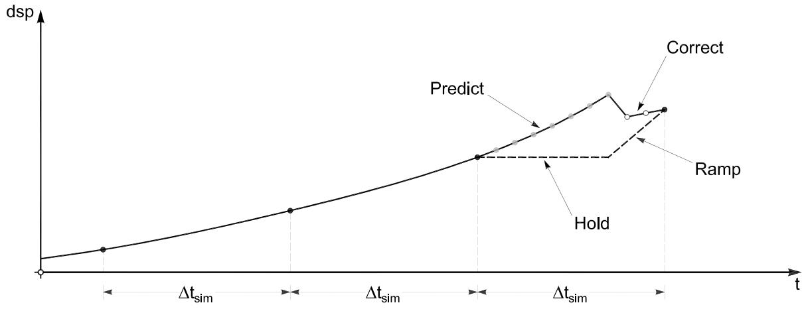

# 5 混合仿真中的事件驱动策略

# 5.1 引言

在混合仿真的有限元分析方法中，执行试验测试需要三个关键组成部分。前一章重点讨论了第一个关键组成部分，即有限元分析软件本身。特别研究了专门的时间步进算法及其在混合仿真中的应用。第二个关键组成部分是允许任何有限元分析软件连接到实验室的中间件，这在第 3 章中已详细讨论。因此，本章致力于研究第三个关键组成部分的方法和策略，即实验室中的控制和数据采集系统。

当今最先进的伺服液压控制系统（属于第三个关键组成部分的一部分）以 1 kHz 及以上的采样率运行。这意味着对于执行器指令的信号生成，需要在非常短的确定性时间间隔内提供新的位移值。另一方面，在有限元分析软件中执行的运动方程数值积分可能非常耗时。此外，将数值解推进到下一步所需的计算时间通常是不确定的，因为它们取决于诸如屈服、屈曲、断裂或结构单元倒塌等事件。因此，计算驱动器和伺服液压控制系统以不同的时间速率运行，前者是不确定的，后者是确定性的。然而，可以通过在计算驱动器和伺服液压控制系统之间放置一个预测-校正算法来同步这两个过程。需要注意的是，这种同步预测-校正算法是在实验室中的实时数字信号处理器上实现的（作为第三个关键组成部分的一部分），因此不要与用于求解运动方程的积分预测-校正方法混淆。

用于同步的预测-校正算法运行如下。当有限元分析软件正在求解下一个积分时间步的试验位移时，预测-校正算法通过向前预测位移路径，为伺服液压控制系统（以其确定性的时间间隔）生成位移指令。一旦从有限元分析软件接收到下一个积分时间步或子步的试验位移，预测-校正算法就会切换到生成位移指令（仍以控制系统的确定性采样率），朝着这些新目标进行校正。只要生成这些预测和校正位移指令所需的计算时间短于伺服液压控制系统的给定采样时间，执行器就可以连续移动，保证测试的连续性。

随着地理分布式混合仿真的最新发展，由于网络传输时间的额外随机性（不确定性），积分和作动器控制过程的时间速率差异变得更大。因此，先前发展的外推-插值方法 (Nakashima and Masaoka 1999; Mosqueda 2003) 不再理想。第一个问题是，位移预测得越远，这些技术的精度会迅速下降。第二个缺点是在从外推切换到插值时，位移指令之间存在较大差异。这种突然的位移跳跃使得执行器无法平滑移动，并在切换区间内产生不切实际的速度。此外，外推和插值过程不是基于物理定律，而是纯粹的数学方法。

为了改善同步预测-校正算法的性能并减少或消除上述问题，本章提出并讨论了一系列新的预测-校正算法。特别地，新发展的算法应比现有算法更精确，同时减少或消除切换区间的不一致性。由于一些提出的预测-校正算法除了位移外，还使用过去的速度和过去的加速度，因此它们依赖于产生这些响应量的积分方法（见第 4 章）。此外，研究了几种自适应的事件驱动策略。这些事件驱动方法不是同步运行（即操作在固定速率时钟信号的集中控制下协调），而是异步执行，这意味着不存在全局时钟，仿真时间步或积分时间步根据某些合适的性能标准在仿真过程中进行调整。

下一节重点回顾先前的发展。特别强调了促进连续测试的外推-插值方法以及用于分布式测试的三环架构的发展。之后，介绍了现有和新提出的预测-校正算法的理论，包括每个算法的优点、缺点和推荐的简要总结。最后，研究了在混合仿真过程中调整参数（如时间步长和执行器速度）的自适应、异步、事件驱动策略。

# 5.2 先前的发展

# 5.2.1 不连续与连续的混合仿真

传统的混合仿真测试技术使用保持和斜坡程序加载试件。这意味着传递系统以斜坡方式施加由计算驱动器计算的试验位移指令。一旦传递系统达到这些目标位移，它们将保持恒定，直到测量了共轭量（抗力）并计算出下一个试验位移指令（见图 5.1）。

  
图 5.1 保持和斜坡程序 vs. 连续测试程序。

尽管此程序允许密切观察结构的响应行为，但它有两个主要缺点。第一个问题是在保持阶段，试件会发生力松弛，这将导致不精确的抗力测量。第二个缺点是许多新型结构构件，如隔震

装置和阻尼器，具有速率相关行为，而斜坡和保持测试程序无法正确捕捉。为了处理这些问题，发展出了两种替代的混合仿真测试方法。在称为连续测试的方法中，试件以缓慢但连续的速率加载，解决了力松弛的问题。这种连续测试首次通过使用隐式积分算法和模拟电路直接力反馈实现 (Thewalt and Mahin 1987)。第二种方法是实时测试，它以适当的速度（考虑相似律影响）连续加载试件，从而捕捉率相关的材料行为 (Nakashima et al. 1992; Horiuchi et al. 1996; Nakashima and Masaoka 1999; Magonette 2001; Shing et al. 2002)。

  
图 5.2 单个数字信号处理器情况下的执行顺序。

为了能够连续或实时运行测试，大多数这些混合仿真方法使用多速率方法。这意味着运动方程的积分和位移指令信号的生成是分离的，因为它们以不同的时间速率运行。在 Nakashima 和 Masaoka (1999) 的算法中，这两个任务都在数字信号处理器 (DSP) 上运行，这是一个实时处理器。因此，为了向数字控制系统发送不间断的指令信号，信号生成任务（具有较高优先级）必须每毫秒执行一次。然而，由于信号生成所需时间不到一毫秒，剩余时间用于求解运动方程。这意味着当积分器正在计算下一个时间步的试验位移时，DSP 在两个任务之间来回切换；然后，一旦新的试验位移可用，只执行信号生成任务（见图 5.2）。提出的算法

应用多项式外推和插值，使用过去的位移值来为传递系统生成指令信号。

# 5.2.2 三环硬件架构

混合仿真的最新发展是将结构的试验和分析部分地理分布在一个实验室和计算站点网络中，该方法由 Campbell 和 Stojadinovic (1998) 首次提出。Mosqueda (2003) 发现，通过将运动方程积分和传递系统的信号生成分离到两台机器上而不是一台，实时测试和连续地理分布式测试都成为可能。此外，从图 5.3 可以看出，不再需要中断响应分析任务来执行信号生成任务，因为它们在两台不同的机器上运行。因此，由于这两个过程在两台独立的计算机上执行，这些机器之间的快速数据传输至关重要。通过使用共享内存网络可以实现这一点，该网络几乎瞬间在计算机之间镜像数据。这种新的三环硬件架构因此能够将更多的计算时间专用于积分任务，这使得增加混合模型解析部分的复杂性成为可能。

  
图 5.3 两台机器情况下的执行顺序。

Mosqueda (2003) 提出的新硬件架构中的三个环承载以下任务（见图 5.4）：

1. 最外环承载带有积分方法的计算驱动器以及 OpenFresco 中间件框架。在实时测试中，此任务以计算驱动器的积分时间步长间隔 $\Delta t _ { i n t }$ (0.005–0.02 秒) 执行。然而，对于地理分布式测试，这样的任务必须放慢速度，使得仿真时间步长间隔 $\Delta t _ { s i m }$ 由网络速度（高达 3 秒）而不是计算所需时间控制。

2. 架构的最内环承载控制和数据采集系统及其软件。任何控制器，如 PID- (比例-积分-微分)、PIDF- (比例-积分-微分-前馈)、SM- (滑模) 控制器等，都可以用来指令传递系统的执行器。许多这类控制器的更新速率在 1 kHz 或更高，意味着新的指令信号需要以确定性的控制器时间步长间隔 $\Delta t _ { c o n }$ 发送给执行器。  
3. 中间环承载连接其他两个以不同时间速率运行的过程的预测-校正算法。与 Nakashima 和 Masaoka (1999) 的算法类似，它使用来自较慢积分算子的试验响应量为较快的控制系统生成子步指令。区别在于这种预测-校正算法的实现。由于在地理分布式测试中会引入随机的网络延迟，Mosqueda (2003) 利用一种事件驱动算法（有限状态机）来处理这些不确定性。

  
图 5.4 三环硬件架构。

这种完全分离任务的优点是它的模块化、灵活性和可扩展性；因此，可以使用和发展不同的计算驱动器，而无需担心与控制和数据采集系统的同步。类似地，控制

算法可以独立于积分方法发展。此外，可以为同步任务发展不同的预测-校正算法。最后，这种划分也有利于将三个过程分布在三台不同的机器上，这允许将计算驱动器（即有限元分析软件）放置在网络上的任何位置。这种对不同任务的抽象和封装类似于用于开发 OpenFresco 软件框架（见第 3 章）的面向对象设计方法。

# 5.3 预测-校正算法理论

# 5.3.1 现有算法

其他研究人员（如 Nakashima 等人 (1999) 和 Mosqueda (2003)）使用的预测-校正算法基于外推和插值，使用过去积分点处的位移值。所使用的多项式是 Lagrange 多项式，阶数为一阶、二阶或三阶 (Burden and Faires 2001)。Nakashima 发现，在计算时间应保持较短的情况下，三阶外推/插值取得了最佳精度。

# 预测 (Pn):

外推位移用 Lagrange 多项式表示，该多项式使用最后 n 个位移值。

$$
d s p _ {p} (x) = \sum_ {k = - n} ^ {0} f _ {k} P _ {n, k} (x) \tag {5.1}
$$

其中 $f _ { k }$ 是先前由积分器计算的位移，$x \in \left[ 0 , 0 . 8 \right]$。预测被限制在仿真时间步长的 $80 \%$ 以内，以便至少留出 $20 \%$ 的仿真时间步长用于向下一个试验位移进行校正。高达三阶多项式的 Lagrange 函数 $P _ { n , k }$ 如下所示。

表 5.1 最高 3 阶预测器 Lagrange 函数。   

<tr><tr><ul><li>P1,0=x+1</li><li>P2,0=1/2(x+1)(x+2)</li><li>P3,0=1/6(x+1)(x+2)(x+3)</li></ul> </td><td> <ul><li>P1,-1=-x</li><li>P2,-1=-x(x+2)</li><li>P3,-1=-1/2x(x+2)(x+3)</li></ul> </td><td> <ul><li>-</li><li>P2,-2=1/2x(x+1)</li><li>P3,-2=1/2x(x+1)(x+3)</li></ul> </td><td> <ul><li>-</li><li>-</li><li>P3,-3=-1/6x(x+1)(x+2)</li></ul> </td> </tr> </table>

  
图 5.5 使用三阶 Lagrange 多项式的预测器。

与 Nakashima 和 Masaoka (1999) 类似，通过假设结构的地震响应是类似正弦的振动来评估预测器的精度。使用这个近似，位移用振幅 $A$ 和圆频率 $\omega$ 表示如下。需要注意的是，正弦振动的圆频率 $\omega$ 是在积分时间尺度上提供的，而不是仿真时间尺度。

$$
f \left(t _ {i n t}\right) = A \sin \left(\omega t _ {i n t}\right) \tag {5.2}
$$

预测公式 (5.1) 中所需的先前仿真时间步的离散位移因此由以下表达式给出。

$$
f _ {k} = A \sin \left(\omega t _ {\text {i n t}} - \omega \Delta t _ {\text {i n t}} (x - k)\right) \tag {5.3}
$$

将方程 (5.3) 代入 (5.1) 并对得到的公式进行三角展开后，得到以下结果。

$$
\begin{array}{l} d s p _ {p} (x) = \sum_ {k = - n} ^ {0} A \sin \left(\omega t _ {i n t} - \omega \Delta t _ {i n t} (x - k)\right) P _ {n, k} (x) \tag {5.4} \\ = A R _ {d} \sin (\omega t _ {i n t} + \phi) \\ \end{array}
$$

其中：

$$
R _ {d} = \sqrt {C _ {S} ^ {2} + C _ {C} ^ {2}} , \phi = \arctan \left(\frac {C _ {C}}{C _ {S}}\right)
$$

$$
C _ {S} = \sum_ {k = - n} ^ {0} \cos (\omega \Delta t _ {\text {i n t}} (x - k)) P _ {n, k} (x) \tag {5.5}
$$

$$
C _ {C} = - \sum_ {k = - n} ^ {0} \sin (\omega \Delta t _ {i n t} (x - k)) P _ {n, k} (x)
$$

可以看出，通过比较公式 (5.2) 和公式 (5.4)，预测位移与精确位移存在偏差。差异可以用振幅变化 $R _ { d }$ 和相位偏移 $\phi$ 来表示。因此，振幅变化和相位偏移被用作精度的度量。一般来说，任何预测器的精度都会随着预测值的距离越远以及积分时间间隔相对于激励周期越大而降低。显然，积分时间间隔需要足够小以保证所用直接积分方法的稳定性和精度。

# 校正 (Cn):

插值位移用类似于外推的 Lagrange 多项式表示：

$$
d s p _ {c} (x) = \sum_ {k = - n + 1} ^ {1} f _ {k} C _ {n, k} (x) \tag {5.6}
$$

其中 $f _ { k }$ 是先前由积分器计算的位移，$x \in \left[ 0 , 1 \right]$。表 5.2 给出了高达三阶多项式的 Lagrange 函数 $C _ { n , k }$。同样，将方程 (5.3) 代入 (5.6)，并对结果进行三角展开，得到以下校正器公式。

$$
\begin{array}{l} d s p _ {c} (x) = \sum_ {k = - n + 1} ^ {1} A \sin \left(\omega t _ {i n t} - \omega \Delta t _ {i n t} (x - k)\right) C _ {n, k} (x) \tag {5.7} \\ = A R _ {d} \sin (\omega t _ {i n t} + \phi) \\ \end{array}
$$

其中：

$$
R _ {d} = \sqrt {C _ {S} ^ {2} + C _ {C} ^ {2}}, \phi = \arctan \left(\frac {C _ {C}}{C _ {S}}\right)
$$

$$
C _ {S} = \sum_ {k = - n + 1} ^ {1} \cos (\omega \Delta t _ {i n t} (x - k)) C _ {n, k} (x) \tag {5.8}
$$

$$
C _ {C} = - \sum_ {k = - n + 1} ^ {1} \sin \left(\omega \Delta t _ {i n t} (x - k)\right) C _ {n, k} (x)
$$

表 5.2 最高 3 阶校正器 Lagrange 函数。   

<tr><tr><td> <ul><li>C1,1=x</li><li>C2,1=1/2x(x+1)</li><li>C3,1=1/6x(x+1)(x+2)</li></ul> </td><td> <ul><li>C1,0=-(x-1)</li><li>C2,0=-(x-1)(x+1)</li><li>C3,0=-1/2(x-1)(x+1)(x+2)</li></ul> </td><td> <ul><li>-</li><li>C2,-1=1/2(x-1)x</li><li>C3,-1=1/2(x-1)x(x+2)</li></ul> </td><td> <ul><li>-</li><li>-</li><li>C3,-2=-1/6(x-1)x(x+1)</li></ul> </td> </tr> </table>

  
图 5.6 使用三阶 Lagrange 多项式的校正器。

与预测器公式一样，使用的精度度量是振幅变化和相位偏移。由于校正器公式使用新时间步或子步的试验位移，它们总体上比预测器公式更精确。此外，虽然它们在 $t _ { i n t , i }$ 和 $t _ { i n t , i } + \Delta t _ { i n t }$ 处返回精确值，但在时间步中间附近精度最低。最后，与预测器公式类似，精度随着积分时间间隔相对于激励周期的增加而降低。

# 5.3.2 使用最后预测位移的算法

除了前面讨论的位移精度外，还必须研究预测-校正算法的另外两个重要性质。第一个性质是指令的作动器位移路径足够平滑，这在连续测试中变得重要。足够平滑指的是位移指令是 $C _ { 0 }$ -连续的；因此，没有突然的位移跳跃。虽然要求 $C _ { 1 }$ -连续性（连续的一阶导数）看起来可能有利，但研究发现，在从预测切换到校正时，这会使系统更有可能变得不稳定。这是因为校正器的精度随着切换点连续性的增加而降低。第二个应该研究的性质是速度精度，这在实时测试中变得重要。如果混合仿真中包含诸如隔震装置和阻尼器等速率相关组件，这一点尤其正确。

回到上一节讨论的预测-校正算法，很明显，当算法被要求在一个控制器时间步 $\Delta t _ { c o n }$（通常为 1 毫秒）内从最后预测的位移值切换到第一个校正的位移值时，会产生非常高的速度需求，导致几乎阶梯状的不连续性。即使这个问题随着 Lagrange 多项式阶数的增加而减小，如果伺服液压控制系统的参数被调整为高度响应，它仍然可能产生不需要的作动器振荡（类似于阶跃输入）。因此，使用现有的外推-插值方案，$C _ { 0 }$ -连续性和速度精度都无法实现。

# 校正 (Cn):

为了修正第一个性质，从而使预测-校正算法达到 $C _ { 0 }$ -连续性，修正后的校正器 Lagrange 多项式包含最后预测的位移。该

预测器公式保持不变。通过将时间步 $t _ { i n t , i }$ 处的最后一个试验位移替换为最后预测的值，得到以下校正器表达式。

$$
d s p _ {c} (x) = \sum_ {\substack {k = - n + 1 \\ k \neq 0}} ^ {1} f _ {k} C _ {n, k} (x, x _ {p}) + f _ {x _ {p}} C _ {n, x _ {p}} (x, x _ {p}) \tag{5.9}
$$

其中 $f _ { k }$ 是由积分器计算的位移，$f _ { x _ { p } }$ 是最后预测的位移。x 的范围仍然是 $x \in \left[ 0 , 1 \right]$，$x _ { p } \in \left[ 0 , 0 . 8 \right]$。高达三阶预测器的修正 Lagrange 函数如下所示。

表 5.3 最高 3 阶修正校正器 Lagrange 函数。   

<tr><tr><td> <ul><li>C1,1 = -x-xp/xp-1</li><li>C2,1 = -(x-xp)(x+1)/2(xp-1)</li><li>C3,1 = -(x-xp)(x+1)(x+2)/6(xp-1)</li></ul> </td><td> <ul><li>C1xp=x-1/xp-1</li><li>C2xp=(x-1)(x+1)/(xp-1)(xp+1)</li><li>C3xp=(x-1)(x+1)(x+2)/(xp-1)(xp+1)(xp+2)</li></ul> </td><td> <ul><li>-</li><li>C2,-1=(x-1)(x-xp)/2(xp+1)</li><li>C3,-1=(x-1)(x-xp)(x+2)/2(xp+1)</li></ul> </td><td> <ul><li>-</li><li>-</li><li>C3,-2=(x-1)(x-xp)(x+1)/3(xp+2)</li></ul> </td> </tr> </table>

为了评估新校正器的精度，再次假设正弦振动。将 (5.3) 和（在 $x _ { p }$ 处求值的 (5.4)）代入 (5.9) 并进行三角展开，得出以下结果。

$$
d s p _ {c} (x) = A R _ {d} \sin (\omega t _ {\text {i n t}} + \phi) \tag {5.10}
$$

其中：

$$
R _ {d} = \sqrt {C _ {S} ^ {2} + C _ {C} ^ {2}} , \phi = \arctan \left(\frac {C _ {C}}{C _ {S}}\right)
$$

$$
\begin{array}{l} C_{S} = \sum_{\substack{k = -n + 1\\ k\neq 0}}^{1}\cos \Bigl(\omega \Delta t_{int}\left(x - k\right)\Bigr)  C_{n,k}\left(x,x_{p}\right) \\ + C _ {n, x _ {p}} \left(x, x _ {p}\right) \sum_ {k = - m} ^ {0} \cos \left(\omega \Delta t _ {i n t} \left(x _ {p} - k\right)\right) P _ {m, k} \left(x _ {p}\right) \tag {5.11} \\ \end{array}
$$

$$
\begin{array}{l} C_{C} = -\sum_{\substack{k = -n + 1\\ k\neq 0}}^{1}\sin \Bigl(\omega \Delta t_{int}\left(x - k\right)\Bigr)  C_{n,k}\left(x,x_{p}\right) \\ - C _ {n, x _ {p}} \left(x, x _ {p}\right) \sum_ {k = - m} ^ {0} \sin \left(\omega \Delta t _ {i n t} \left(x _ {p} - k\right)\right) P _ {m, k} \left(x _ {p}\right) \\ \end{array}
$$

在后面的小节中，在介绍了所有研究的预测-校正算法的公式之后，将对不同 $x$ 和 $x _ { p }$ 值的图形化评估以及与其他所有算法的比较进行讨论。

  
图 5.7 使用包含最后一个预测值的三阶 Lagrange 多项式的校正器。

# 5.3.3 使用速度的算法

如前一节所述，不仅实现 $C _ { 0 }$ -连续性是有利的，而且提高速度精度也是有利的。虽然前面建议的对校正器的修改实现了所寻求的连续性，但速度精度尚未得到改善。朝着获得更好的速度精度的第一步是除了迄今为止使用的位移之外，还纳入速度。根据所采用的积分方法，精确的试验速度是现成可用的，因此可以与试验位移一起发送到预测-校正算法。对于所有龙格-库塔方法尤其如此，其中解向量直接包含位移和速度（见第 4 章）。然而，对于许多直接积分方法，积分时间步或子步（迭代方法）处的试验速度不太精确或不可用，因此它们无法改善预测-校正算法的速度精度。在这些情况下，可以如下所示通过数值微分公式获得速度估计。

# 预测 (PV):

在这种情况下，预测位移用 Hermit 多项式表示，该多项式使用最后 n 个位移值以及最后 n 个速度值。

$$
d s p _ {p} (x) = \sum_ {k = - n} ^ {0} f _ {k} P _ {2 n + 1, k} (x) + \sum_ {k = - n} ^ {0} f _ {k} ^ {\prime} \hat {P} _ {2 n + 1, k} (x) \tag {5.12}
$$

其中 $f _ { k }$ 和 $f _ { k } ^ { \prime }$ 是积分时间步处的位移和速度，并且与往常一样，$x \in \left[ 0 , 0 . 8 \right]$。为方便起见，下面给出三阶多项式的 Hermit 函数。

$$
P _ {3, 0} = - (x + 1) ^ {2} (2 x - 1) \quad \hat {P} _ {3, 0} = (x + 1) ^ {2} x \tag {5.13}
$$

$$
P _ {3, - 1} = x ^ {2} (2 x + 3) \quad \hat {P} _ {3, - 1} = x ^ {2} (x + 1)
$$

如果 (5.12) 中的速度 $f _ { k } ^ { \prime }$ 是从积分方法接收的，则需要在代入之前乘以积分时间步长 $\Delta t _ { i n t }$，因为 x 轴是无量纲的，不是以时间为单位。

另一方面，如果速度是利用数值微分公式确定的，则可以直接代入 (5.12)，因为 x 轴已经是无量纲的。二阶精度速度的微分公式如下。

$$
f _ {0} ^ {\prime} = \frac {1}{2} \left(3 f _ {0} - 4 f _ {- 1} + f _ {- 2}\right) \tag {5.14}
$$

$$
f _ {- 1} ^ {\prime} = \frac {1}{2} \left(f _ {0} - f _ {- 2}\right)
$$

对于三阶精度，速度表示如下。

$$
f _ {0} ^ {\prime} = \frac {1}{6} \left(1 1 f _ {0} - 1 8 f _ {- 1} + 9 f _ {- 2} - 2 f _ {- 3}\right) \tag {5.15}
$$

$$
f _ {- 1} ^ {\prime} = \frac {1}{6} \left(2 f _ {0} + 3 f _ {- 1} - 6 f _ {- 2} + f _ {- 3}\right)
$$

最后，四阶公式近似速度如下。

$$
f _ {0} ^ {\prime} = \frac {1}{1 2} \left(2 5 f _ {0} - 4 8 f _ {- 1} + 3 6 f _ {- 2} - 1 6 f _ {- 3} + 3 f _ {- 4}\right) \tag {5.16}
$$

$$
f _ {- 1} ^ {\prime} = \frac {1}{1 2} \left(3 f _ {0} + 1 0 f _ {- 1} - 1 8 f _ {- 2} + 6 f _ {- 3} - f _ {- 4}\right)
$$

  
图 5.8 使用三阶 Hermit 多项式的预测器。

以与之前相同的方式评估该预测器的精度，不同之处在于在确定振幅变化 $R _ { d }$ 和相位偏移 $\phi$ 之前，将二阶、三阶或四阶速度代入 (5.12)。由于它们的复杂性，这些公式不再在此展示，但结果在本节末尾以图形方式显示。

# 校正 (CV):

为了使校正器公式在保持 $C _ { 0 }$ -连续性的同时提高速度精度，需要纳入试验速度以及最后预测的位移值。同样，对于前面建议的预测器，在切换区间只提供 $C _ { 0 }$ -连续性。这使得系统在预测位移相当不准确的情况下更稳定。与原始算法切换区间中遇到的近乎跳跃的位移指令相比，$C _ { 0 }$ -连续性只允许速度不连续。这显著减少了可能的振荡。此外，由于

不强制执行 $C _ { 1 }$ -连续性，校正器不会使用预测器错误的最后速度在错误方向上初始发射，然后校正到下一个试验位移。

$$
d s p _ {c} (x) = \sum_ {\substack {k = - n + 1 \\ k \neq 0}} ^ {1} f _ {k} C _ {2 n, k} (x, x _ {p}) + \sum_ {\substack {k = - n + 1 \\ k \neq 0}} ^ {1} f _ {k} ^ {\prime} \hat {C} _ {2 n, k} (x, x _ {p}) + f _ {x _ {p}} C _ {2 n, x _ {p}} (x, x _ {p}) \tag{5.17}
$$

其中 $f _ { k }$ 和 $f _ { k } ^ { \prime }$ 是积分时间步处的位移和速度，$f _ { x _ { p } }$ 是最后预测的位移。x 和 $x _ { p }$ 的范围与之前相同，$x \in \left[ 0 , 1 \right]$ 和 $x _ { p } \in \left[ 0 , 0 . 8 \right]$。与预测器公式一样，如果 (5.17) 中的速度 $f _ { k } ^ { \prime }$ 是从积分方法接收的，则需要乘以积分时间步长 $\Delta t _ { i n t }$。由于此校正器只能具有 $2 n$ 阶，下面给出二阶函数作为示例。二阶校正器优于四阶校正器，因为计算指令位移消耗的时间和内存更少。

$$
C _ {2, 1} = - \frac {\left(x + x _ {p} - 2\right) \left(x - x _ {p}\right)}{\left(x _ {p} - 1\right) ^ {2}} \quad \hat {C} _ {2, 1} = - \frac {(x - 1) \left(x - x _ {p}\right)}{x _ {p} - 1} \tag {5.18}
$$

$$
C _ {2, x _ {p}} = \frac {(x - 1) ^ {2}}{(x _ {p} - 1) ^ {2}}
$$

  
图 5.9 使用包含最后一个预测值的二阶多项式的校正器。

同样，由于复杂性，这里不呈现精度公式，但结果在本节末尾以图形方式显示。

# 5.3.4 使用加速度的算法

到目前为止，所有预测-校正算法都基于数值数学中使用的多项式近似，而较少基于系统的物理行为。

# 预测 (PVA):

为了进一步改进作动器指令信号的预测和校正，将质量在常力作用下的物理行为纳入算法。这意味着假设力在一个时间步内不改变，并且等于该步开始时的力。如果所有作用力（施加的力、阻尼力和抗力）之和是常数，那么根据牛顿第二运动定律，加速度在一个时间步内也必须是常数。对恒定加速度积分两次，并使用该时间步开始时的位移和速度作为初始条件，得到以下预测器方程。

$$
d s p _ {p} (x) = f _ {0} + x f _ {0} ^ {\prime} + \frac {1}{2} x ^ {2} f _ {0} ^ {\prime \prime} \tag {5.19}
$$

其中 $f _ { 0 } , \ f _ { 0 } ^ { \prime }$ 和 $f _ { 0 } ^ { \prime \prime }$ 是最后一个积分时间步的位移、速度和加速度，并且与往常一样 $x \in \left[ 0 , 0 . 8 \right]$。如果 (5.19) 中的速度 $f _ { 0 } ^ { \prime }$ 和加速度 $f _ { 0 } ^ { \prime \prime }$ 是从积分方法接收的，则需要分别乘以 $\Delta t _ { i n t }$ 和 $\Delta t _ { i n t } ^ { 2 }$，因为 x 轴是无量纲的，不是以时间为单位。

或者，如果使用数值微分公式确定速度和加速度，则可以直接代入 (5.19)，因为 x 轴已经是无量纲的。

  
图 5.10 恒定加速度预测器。

速度的微分公式与上一小节相同。二阶到四阶精度加速度的公式如下。

$$
f _ {0} ^ {\prime \prime} = 2 f _ {0} - 5 f _ {- 1} + 4 f _ {- 2} - f _ {- 3} \tag {5.20}
$$

$$
f _ {0} ^ {\prime \prime} = \frac {1}{1 2} \left(3 5 f _ {0} - 1 0 4 f _ {- 1} + 1 1 4 f _ {- 2} - 5 6 f _ {- 3} + 1 1 f _ {- 4}\right) \tag {5.21}
$$

$$
f _ {0} ^ {\prime \prime} = \frac {1}{1 2} \left(4 5 f _ {0} - 1 5 4 f _ {- 1} + 2 1 4 f _ {- 2} - 1 5 6 f _ {- 3} + 6 1 f _ {- 4} - 1 0 f _ {- 5}\right) \tag {5.22}
$$

以与之前相同的方式评估该预测器的精度，不同之处在于在确定振幅变化 $R _ { d }$ 和相位偏移 $\phi$ 之前，将二阶、三阶或四阶速度和加速度代入 (5.19)。由于复杂性，这些公式再次省略，但结果在本节末尾以图形方式显示。

# 校正 (CVA):

利用加速度的校正器表达式的推导类似于之前仅使用位移和速度的推导。两者之间的唯一区别是添加了第三项和阶次的变化。

$$
\begin{array}{l} d s p _ {c} (x) = \sum_ {\substack {k = - n + 1 \\ k \neq 0}} ^ {1} f _ {k} C _ {3 n, k} (x, x _ {p}) + \sum_ {\substack {k = - n + 1 \\ k \neq 0}} ^ {1} f _ {k} ^ {\prime} \hat {C} _ {3 n, k} (x, x _ {p}) \tag{5.23} \\ +\sum_{\substack{k = -n + 1\\ k\neq 0}}^{1}f_{k}^{\prime \prime}\tilde{C}_{3n,k}\left(x,x_{p}\right) + f_{x_{p}}  C_{3n,x_{p}}\left(x,x_{p}\right) \\ \end{array}
$$

其中 $f _ { k } , f _ { k } ^ { \prime }$ 和 $f _ { k } ^ { \prime \prime }$ 是积分时间步处的位移、速度和加速度，$f _ { x _ { p } }$ 是最后预测的位移。x 和 $x _ { p }$ 的范围与之前相同，$x \in \left[ 0 , 1 \right]$ 和 $x _ { { p } } \in \left[ 0 , 0 . 8 \right]$。对于三阶校正器，乘以位移、速度和加速度的函数由下式给出。

$$
\begin{array}{l} C _ {3, 1} = - \frac {\left(x ^ {2} + \left(x _ {p} - 3\right) x + x _ {p} ^ {2} - 3 x _ {p} + 3\right) \left(x - x _ {p}\right)}{\left(x _ {p} - 1\right) ^ {3}} \quad \hat {C} _ {3, 1} = - \frac {\left(x + x _ {p} - 2\right) \left(x - x _ {p}\right) (x - 1)}{\left(x _ {p} - 1\right) ^ {2}} \tag {5-24} \\ \tilde {C} _ {3, 1} = - \frac {\left(x - 1\right) ^ {2} \left(x - x _ {p}\right)}{2 \left(x _ {p} - 1\right)} \quad C _ {3, x _ {p}} = \frac {\left(x - 1\right) ^ {3}}{\left(x _ {p} - 1\right) ^ {3}} \\ \end{array}
$$

  
图 5.11 使用包含最后一个预测值的三阶多项式的校正器。

# 5.3.5 图形化评估与比较

为了图形化评估不同的预测-校正算法并进行比较，将计算出的振幅和相位精度相对于归一化积分时间步长 $\Delta t _ { i n t } / T$ 绘图。对于低频振动模式，归一化积分时间步长将位于绘图范围的低端，而对于多自由度系统的较高模式，它可以位于绘图范围的上部。如果这些高频模式对结构整体响应的贡献显著，那么它们的振幅和相位精度也同样重要。振幅变化 $R _ { d }$ 和相位偏移 $\phi$ 针对三个不同的 $x _ { p }$ 值（0.2, 0.5 和 0.8）绘制。对于预测器，$\boldsymbol { x } = \boldsymbol { x } _ { p }$ 且 $x \in \left[ 0 , 0 . 8 \right]$。如前所述，预测被限制在仿真时间步长的 $80 \%$ 以内，以便至少留出 $20 \%$ 的仿真时间步长用于向下一个试验位移进行校正。对于校正器，选择 $x = 0 . 5 + x _ { p } / 2$ 来评估最后一个预测值和新试验值之间的中间位置的精度，并使用四阶数值微分公式来获得速度和加速度。

# 预测器：

从图 5.12 可以看出，两个新提出的预测器的振幅和相位精度总体上优于原始预测器。此外，新开发的预测器的精度通常非常相似，其中使用加速度的预测器比仅使用速度的预测器稍精确。可以看出，对于低频模式（$\cdot \Delta t _ { i n t } / T < 0 . 2 $），新预测器显著更精确。在此值之上，它们的精度不太一致，并开始出现一些振荡行为，这是由于数值微分公式产生的高阶多项式导致的。这个在数值数学中众所周知的现象称为龙格现象。它指出，在给定区间内使用高阶多项式在等距点处插值函数，所得的插值会在区间末端出现振荡。这也是为什么原始预测器只上升到三阶的原因，因为四阶多项式已经表现出显著的振荡行为，因此对于高频模式精度较低。

# 校正器：

图 5.13 显示了不包含最后预测位移的校正器算法的振幅变化和相位偏移。可以看出，校正器总体上比预测器更精确。这是因为新步（或子步）的试验响应量对校正器是可用的，因此计算出的指令位移位于已知值区间内。另一方面，预测期间计算出的指令位移位于已知值区间之外。然而，重要的是要记住，这些校正器算法无法生成 $C _ { 0 }$ -连续的位移指令，因此会在切换区间产生阶跃状信号。这些不精确性和缺陷在图 5.13 中没有被图形化地捕捉到。此外，可以观察到，纳入速度和加速度的校正器达到了与原始二阶和三阶校正器大致相同量级的精度。还值得注意的是，纳入速度的校正器总体上是精度最高的。

  
图 5.12 预测器在振幅和相位方面的精度。

  
图 5.13 校正器在振幅和相位方面的精度。

# 使用最后预测位移的校正器：

很明显，总体而言，$C _ { 0 }$ -连续的预测器比它们不连续的对应物精度略低。这种影响是由于将最后预测的位移纳入了校正器公式，即使在 $x _ { p } = 0 . 2$ 时，该预测已经存在一些预测误差。然而，以略微降低的精度为代价，切换区间中的阶跃状不连续性被完全消除。从图 5.14 可以看出，振幅和相位精度的这种趋势随着 $x _ { p }$ 的增大变得更加明显。预测距离已知最后值越远，最后预测位移的误差就越大，$C _ { 0 }$ -连续校正器的性能就越不精确。然而，必须记住，对于不连续校正器，切换区间中的跳跃也随着 $x _ { p }$ 的增大而增大。而且，如果这种类似阶跃响应的切换不连续性变得太大，响应迅速的伺服液压系统将在这些点处引入超调和振荡进入作动器指令，使得校正非常不精确。因此，似乎一个具有稍低精度的 $C _ { 0 }$ -连续校正器将优于可能引发作动器指令振荡的不连续校正器。从图 5.14 可以看出，对于小的 $x _ { p }$ 值，所有校正器算法都实现了相当相似的精度量级，其中 C3 和 CV 校正器精度最高。另一方面，对于较大的 $x _ { p }$ 值，很明显，纳入速度和加速度的校正器实现了更好的性能，其中 CVA 校正器明显是精度最高且因此首选的算法。

# 5.3.6 优点、缺点和推荐

虽然每个单独预测器和校正器的优点和缺点总结在下面的表 5.4 中，但首先介绍一些一般的优点和缺点。在由解析子结构中包含非线性元素的复杂结构的混合仿真中，不能总是保证运动方程的解能按时提供给控制器（它是指令传递系统的）。即使使用显式直接积分方法来求解运动方程，情况也是如此。对于多个实验室之间的地理分布式混合仿真，这个问题变得更加严重，因为由于网络通信中的延迟，解将不可避免地延迟。

  
图 5.14 包含最后预测位移的校正器的精度。

因此，预测-校正算法的主要优点是它们通过连续产生作动器指令信号来消除这个问题，从而在计算驱动器和施加边界条件的传递系统之间建立了一座桥梁。另一个优点直接来自于产生连续作动器指令信号的能力。这消除了或至少减少了与力松弛相关的问题。另一方面，预测-校正算法最大的问题是，它们需要在没有任何关于结构特性知识的情况下预测结构某些自由度上的响应。因此，即使预测的响应是连续的，也可能是非常错误的。另一个问题是，在其当前形式下，预测-校正算法不能很好地与迭代积分方法配合。这个问题以及相应的解决策略将在本章的后面部分讨论。

表 5.4 预测-校正算法优缺点总结。   

<tr><tr><td>算法</td><td>优点</td><td>缺点</td></tr>
<tr><td>保持和斜坡</td><td>○ 适用于迭代积分器 ○ 公式简单计算快</td><td>○ 非迭代和迭代积分器下作动器运动不连续 ○ 与连续指令信号相比非常不精确 ○ 保持阶段力松弛问题 ○ 如果保持阶段占用 80% 时间步长，斜坡阶段速度可能很高</td> </tr>
<tr><td>原始不连续</td><td>○ 低阶校正器相当准确</td><td>○ 基于纯数值多项式插值 ○ 高频模式或大积分步长时精度显著下降 ○ 切换区间存在阶跃状不连续，可能导致伺服液压控制系统振荡 ○ 高阶多项式振荡（龙格现象） ○ 与迭代积分器一起使用时非常不精确</td> </tr>
<tr><td>修正 C0-连续</td><td>○ C0-连续，因此切换区间没有阶跃状不连续</td><td>○ 基于纯数值多项式插值 ○ 高频模式或大积分步长时精度显著下降 ○ 高阶多项式振荡（龙格现象） ○ 与迭代积分器一起使用时非常不精确</td> </tr>
<tr><td>利用速度</td><td>○ 预测器和校正器达到良好精度 ○ C0-连续</td><td>○ 基于纯数值多项式插值</td> </tr>
<tr><td>利用加速度</td><td>○ 基于质量的物理行为 ○ 所有方法中最准确的 ○ C0-连续</td><td>○ 在归一化积分时间步长较大时出现轻微振荡（轻微龙格现象）</td> </tr> </table>

总之，建议尽可能使用基于速度和加速度且 $C _ { 0 }$ -连续的预测-校正算法。如果使用非迭代积分方法或恒定迭代次数的积分方案（见第 4 章），这一点尤其如此。此外，应避免所有不连续的预测-校正算法，而应使用其 $C _ { 0 }$ -连续的对应物。这消除了切换区间中的阶跃状指令输入条件，从而减少了位移以及因此力的振荡，这种振荡常常使传递系统不稳定。另一方面，如果在有限元分析软件中使用未修改的迭代积分方案，则应使用传统的保持和斜坡算法或稍后讨论的自适应方法来避免位移振荡。

# 5.4 自适应事件驱动策略

# 5.4.1 现有策略

在发展和讨论了三环架构中两个关键要素之后，下一步是研究如何将改进的同步预测-校正算法纳入该架构的中间环。如前所述，将运动方程的解推进一个积分时间步长 $\Delta t _ { i n t }$ 所需的时间不是恒定的。对于其解析子结构中具有材料和几何非线性的复杂结构尤其如此。在地理分布式混合仿真中，

直到下一个试验响应量可用之前所经过的时间甚至更加不可预测。由于网络延迟，必须将随机延迟添加到计算驱动器消耗的时间中。为了处理系统的这种随机性，Mosqueda (2003) 引入了一种事件驱动算法（一种有限状态机），该算法利用预测-校正算法并放置在三环架构的中间环中。有限状态机由系统可以存在的状态以及这些状态之间的转换组成。守卫和/或触发器（即事件）控制转换的执行。此外，动作可以附加到转换和/或状态。

现有的事件驱动控制器 (Mosqueda 2003) 由四个状态组成。在标准操作期间，来自积分方法的试验响应量在没有延迟的情况下可用，控制器将简单地在预测状态和校正状态之间切换。当这些状态处于活动状态时执行的动作是预测-校正算法的三阶外推和三阶插值方法。然而，如果积分方法计算新响应量的时间过长，或者通过网络传输这些试验量的过程延迟，算法会自适应并减慢预测速度。这是通过触发从预测状态到减速状态的转换来实现的。该转换上的守卫检查仿真时间步长 $\Delta t _ { s i m }$ 的给定百分比是否已经过去，以便执行转换。在减速状态下执行的动作仍然是三阶外推，但它们以一半的速度移动执行器，从而允许更多时间来接收下一个试验响应量。如果新的规定边界条件在指定的时间范围内变得可用，则有限状态机被触发从减速状态转换回校正状态。另一方面，如果在指定的时间过去后仍未收到试验响应量，则控制器转换到保持状态。在保持状态下，恒定的指令信号被发送到控制系统，这有效地停止了执行器的移动。一旦下一个时间步的响应量可用，控制器被触发转换回校正状态。Nakashima 和 Masaoka (1999) 发现，在预测、减速和保持状态之间设置两个守卫的最合适值是仿真时间步长 $\Delta t _ { s i m }$ 的 $60 \%$ 和 $80 \%$。这意味着在仿真时间步长的 $60 \%$ 过去之后，控制器将执行器移动速度减半

并在仿真时间步长的 $80 \%$ 时完全停止移动。这为后续的校正留下了至少 $20 \%$ 的仿真时间步长。

# 5.4.2 平滑减速策略

刚刚描述的事件驱动策略出现的问题是，从预测状态到保持状态以及从保持状态回到校正状态的过渡不平滑。速度不连续，因为传递系统从全速跳到半速再到零速又跳回全速。如果这些速度不连续很大，它们可能会引起实验室实际测试中遇到的作动器运动振荡。作动器对这些速度不连续的响应在很大程度上取决于控制系统所有调谐参数。然而，如果这些不连续性已经在事件驱动策略的实现中被消除，那么可以避免将伺服液压控制系统调谐到足够响应同时试图减少振荡的问题。

  
图 5.15 平滑减速策略的位移路径和执行顺序。