# 6 混合模拟案例研究

## 6.1 引言

本章介绍了混合模拟两种新应用的案例研究。主要目的是展示和验证重新设计和新实现的对象导向混合模拟框架的功能和灵活性。这两个案例研究在加州大学伯克利分校的 $\mu \mathrm { N E E S }$ 实验室进行，并利用了混合模拟的广泛方法和实现细节。

## 6.2 快速地理分布测试

网络技术的最新进步与实验软件框架OpenFresco的结合，使快速地理分布混合模拟终于成为可能。作为George E. Brown, Jr. 地震工程模拟网络（NEES）计划的一部分，一个名为NEESgrid的国家合作实验室已经开发出来。NEESgrid基于Internet2的Abilene网络，将15个NEES设备站点连接在一起。Abilene网络是一个用于教育和研究的私有高速骨干网络，截至2006年，其带宽高达10 Gbit/sec。对于在加利福尼亚州Davis的NEESinc和加利福尼亚州Richmond的nees@berkeley设备站点的 $\mu \mathrm { N E E S }$ 实验室之间进行的快速地理分布混合模拟，使用了NEESgrid网络的1 Gbit/sec连接之一。随后描述的测试展示了OpenFresco（见第3章）如何与高性能有限元软件结合使用，以跨越大网络距离执行软实时混合模拟。

### 6.2.1 动机

在过去十年中，为改善结构在地震、爆炸和风等极端荷载条件下的行为而引入高性能装置显著增加。这些装置中的大多数，如基础隔震支座、耗能装置和高性能材料，表现出固有的速率依赖行为。因此，对包含此类装置的结构系统进行测试时以正确的加载速率进行是至关重要的。这意味着全尺度混合模拟需要实时执行。此外，如果混合模型恰好是原型模型的缩放版本，长度比例因子为 $\mathrm { S } _ { \mathrm { l } }$，并且还需要保持速度，即速度比例因子 $\mathrm { S } _ { \mathrm { v } } = 1$，则混合模拟需要以比实时快 ${ \mathrm { S } _ { \mathrm { l } } } ^ { - 1 }$ 倍的速度执行。另一方面，如果要为缩放模型结构保持应变率而不是速度，则实验测试需要再次实时执行，因为时间比例因子 $\mathrm { S } _ { \mathrm { t } } = 1$ 与长度比例因子Sl无关。

表6.1 快速测试的相似定律。   

| 物理量           | 量纲      | 比例因子 （条件：$S_l, S_E = S_v = 1$） | 比例因子 （条件：$S_l, S_E = S_\varepsilon = 1$） |
|------------------|-----------|-------------------------------------------|------------------------------------------------------|
| 长度 $l$         | L         | $S_l$                                     | $S_l$                                                |
| 位移 $d$         | L         | $S_l$                                     | $S_l$                                                |
| 速度 $v$         | LT⁻¹      | $1$                                       | $S_l$                                                |
| 加速度 $a$       | LT⁻²      | $S_l^{-1}$                                | $1$                                                  |
| 力 $F$           | F         | $S_l^2$                                   | $S_l^2$                                              |
| 时间 $t$         | T         | $S_l$                                     | $1$                                                  |
| 弹性模量 $E$     | FL⁻²      | $1$                                       | $1$                                                  |
| 应力 $\sigma$    | FL⁻²      | $1$                                       | $1$                                                  |
| 应变 $\varepsilon$ | 1       | $1$                                       | $1$                                                  |
| 应变率 $\dot{\varepsilon}$ | T⁻¹ | $S_l^{-1}$ | $1$ |
| 质量 $m$         | FL⁻¹T²    | $S_l^3$                                   | $S_l$                                                |
| 阻尼 $c$         | FL⁻¹T     | $S_l^2$                                   | $S_l$                                                |
| 刚度 $k$         | FL⁻¹      | $S_l$                                     | $S_l$                                                |
| 周期 $T$         | T         | $S_l$                                     | $1$                                                  |
| 频率 $f$         | T⁻¹       | $S_l^{-1}$                                | $1$                                                  |

这两组比例因子三元组 $( \mathrm { S } _ { \mathrm { l } } , \mathrm { S } _ { \mathrm { E } } , \mathrm { S } _ { \mathrm { v } } )$ 和 $( \mathrm { S } _ { \mathrm { l } } , \mathrm { S } _ { \mathrm { E } } , \mathrm { S } _ { \dot { \mathrm { \varepsilon } } } )$ 的相似定律如表6.1所示。另一个重要的应用类别，其中具备实时执行测试的能力至关重要，是涉及振动台的混合模拟。这意味着混合模型的物理部分在振动台上进行测试，振动台从结构的数值部分接收实时位移命令，并将相应的抗力反馈给数值部分（见第2章）。

### 6.2.2 测试结构和地震记录

由于其简单性和名义计算量，选择了一个单跨框架模型进行这些混合模拟，该模型有一个延性柱和一个弹性柱，通过一个相当软的弹簧连接。如图6.1所示，单跨框架高度为50英寸，对应于 $\mu \mathrm { N E E S }$ 执行器连接到实验钢试样的高度。框架宽度任意选择为100英寸。

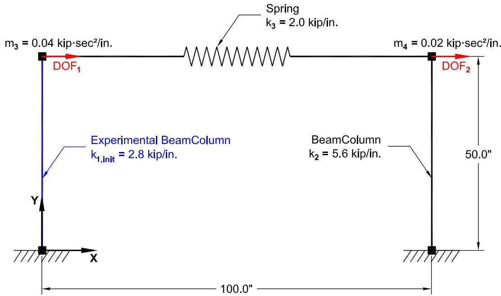  
图 6.1 具有结构特性的单跨框架模型。

对于混合模拟，左侧柱由 $\mu \mathrm { N E E S }$ 实验室中的试样表示，右侧柱和连接两柱的水平弹簧进行数值建模。此外，左侧实验柱、右侧线弹性柱和连接两柱的线弹性弹簧分别被赋予刚度 $\mathrm { k } _ { 1 , \mathrm { i n i t } } = 2 . 8 \mathrm { k i p / i n } .$ .、$\mathrm { k } _ { 2 } = 5 . 6 \mathrm { k i p / i n }$ . 和 ${ \bf k } _ { 3 } = 2 . 0 \mathrm { k i p / i n } .$ .。左柱顶部的质量为 $0 . 0 4 \mathrm { k i p } { \cdot } \mathrm { s e c } ^ { 2 } / \mathrm { i n }$ .，右柱顶部的质量为 $0 . 0 2 \mathrm { k i p } { \cdot } \mathrm { s e c } ^ { 2 } / \mathrm { i n }$ .。鉴于只考虑了水平自由度，这个简单的单跨框架模型总共有两个带质量的自由自由度。根据所选的结构特性，模型的振动周期分别为第一模态 $\mathrm { T } _ { 1 } = 0 . 6 2 2$ 秒和第二模态 $\mathrm { T } _ { 2 } = 0 . 3 1 5$ 秒。为了从第二模态获得对总响应的显著贡献，除了第一模态之外，线弹性弹簧被赋予了相当低的刚度。此外，阻尼矩阵选择为与质量矩阵成比例而不是与刚度矩阵成比例，以便第二模态的阻尼小于第一模态。第一模态被赋予临界阻尼的 $5 \%$，这导致第二模态的阻尼比为 $2 . 5 3 \%$。

使用1940年Imperial Valley地震期间记录的El Centro地面加速度历史的南北分量来动态激励模型。32秒长的时间历程由1600个数据点组成，每0.02秒记录一次，并缩放到0.319 g的峰值地面加速度。该运动的弹性反应谱，对于 $2 . 5 \%$ 和 $5 \%$ 的阻尼比，并在两个模型周期处有标记，如图6.2所示。

### 6.2.3 测试设置和程序

如图6.3所示，用于测试单跨框架模型物理柱的实验装置包括一个自平衡反力框架，旨在支撑执行器和试样在静态和动态荷载条件下。根据Mosqueda（2003），发现反力框架的基本自然频率为 $3 7 \ \mathrm { H z } .$，这被认为足够高，以最小化与相当柔性的测试试样的相互作用。50英寸高的实验 $\mathrm { S 4 x 7 . 7 }$ 钢柱试样安装在一个特殊的带可更换钢试样的U形夹上，能够模拟钢截面端部的塑性铰区。配备两个延性ASTM A36-04 $( \mathrm { f _ { y } } = 6 9 ~ \mathrm { k s i } )$ 钢试样，这种连接产生了稳定和可重复的滞回环，非常适合测试和评估混合模拟中的新想法和概念。此外，通过使用不同的试样设计和/或螺母配置，可以模拟各种滞回行为，如Rodgers和Mahin（2004）所述。带顶部和底部螺母的两个延性钢试样配置连接细节和滞回环（SAC加载方案）如图6.4所示。

ELC270 伪加速度反应谱，T = [0.622,0.315] 秒处的值   
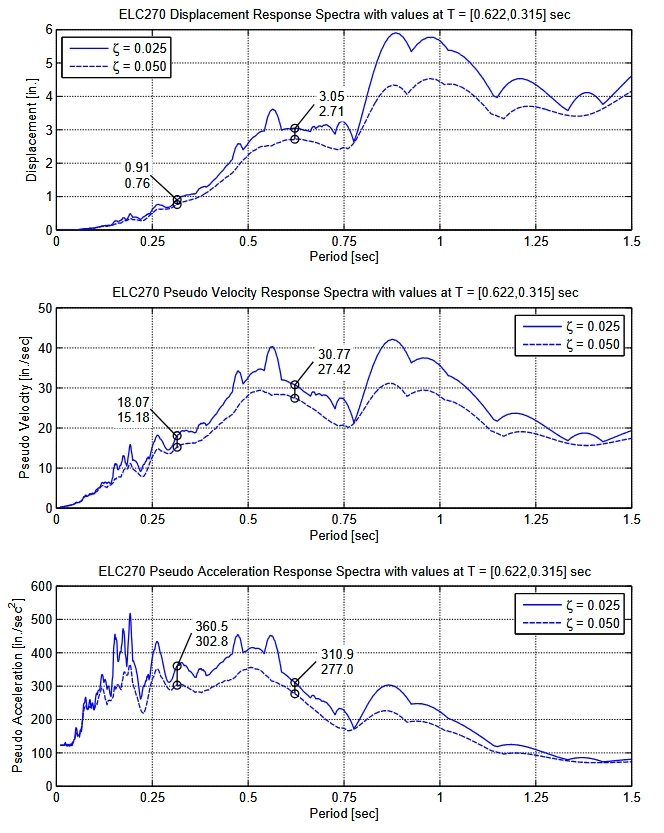
图 6.2 1940年El Centro，Imperial Valley地震记录南北分量的弹性反应谱，模型周期处的值。

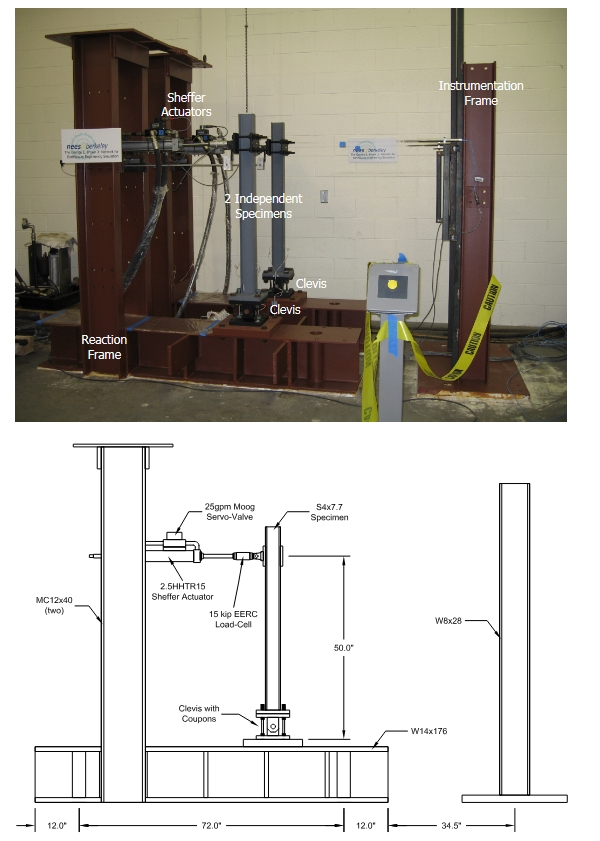  
图 6.3 $\mathbf { \mu N E E S }$ 具有两个独立试样的实验装置。

用于在混合模拟测试期间加载试样的12 kip动态执行器是双端2.5HHTR15 Sheffer型号，总行程容量为15英寸。执行器由连接到3000 psi液压供油管的25 gpm Moog伺服阀驱动，产生大约23 in./sec的速度限制。给定液压油的体积模量 $\beta = 1 0 0 \mathrm { k s i }$ 和有效载荷的近似重量 $\mathrm { W } = 0 . 0 4 9$ kip，$\mu \mathrm { N E E S }$ 装置的油柱频率可以估计为 $\mathrm { f _ { o c } } = 1 4 8 \ : \mathrm { H z }$

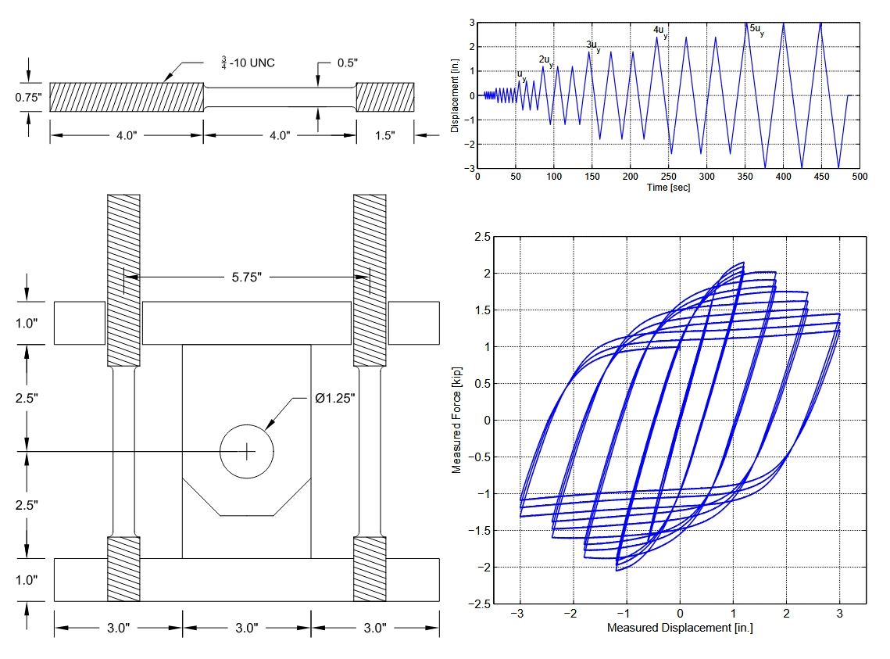  
图 6.4 带试样细节的连接和位移历史与滞回环。

一个容量为 $\pm 1 5$ kip的单向铝制荷载传感器安装在执行器端部和试样之间，用于测量实验抗力。伺服液压控制系统所需的执行器位移反馈由Novotechnik TLH500位移传感器提供，其位移限制为 $\pm 1 0$ 英寸。$\mu \mathrm { N E E S }$ 装置选定特性总结在表6.2中。

表 6.2 $\mathbf { \mu N E E S }$ 实验装置的特性。   

| 类别                          | 参数                     | 值                             |
|-------------------------------|--------------------------|--------------------------------|
| **液压特性**                  | 供油压力                 | $p_s = 3\ \text{ksi}$          |
|                               | 回油压力                 | $p_r = 0.05\ \text{ksi}$       |
|                               | 油液体积弹性模量         | $\beta = 100\ \text{ksi}$      |
| **Sheffer 2.5HHTR15 作动器参数** | 作动器缸径           | $b = 2.5\ \text{in.}$          |
|                               | 活塞杆直径               | $d = 1.0\ \text{in.}$          |
|                               | 活塞杆长度               | $L = 40\ \text{in.}$           |
|                               | 作动器行程               | $S = 15\ \text{in.}$           |
| **伺服阀与负载特性**          | 流量                     | $q = 96.25\ \text{in}^3/\text{sec}$ |
|                               | 总重量（杆、力传感器、试件） | $W = 0.049\ \text{kip}$     |
| **推导得到的试验台特性**      | 位移极限                 | $u_{\max} = \pm 7.5\ \text{in.}$ |
|                               | 速度极限                 | $v_{\max} = \pm 23.3\ \text{in./sec}$ |
|                               | 油柱刚度                 | $K_{oc} = 110\ \text{kip/in.}$ |
|                               | 油柱固有频率             | $f_{oc} = 148\ \text{Hz}$      |
|                               | 反力架固有频率           | $f_{rf} = 37\ \text{Hz}$       |
|                               | 试件固有频率             | $f_{sp} = 25.6\ \text{Hz}$     |

对于所述实验装置的操作，使用了带有结构测试系统（STS）软件和xPC Target实时环境的MTS 493实时控制器。该数字控制器提供闭环PID、微分前馈和Delta-P控制能力。随附的STS软件是一个图形用户界面，允许操作员访问控制器进行校准、配置、测试设置和数据显示。为了在实时地理分布混合模拟期间实现伺服液压控制系统的最佳性能，在测试之前花费了大量时间在当地调谐执行器。建立的PID和前馈增益如表6.3所示，提供了最快的系统响应，执行器滞后和超调最小，且不会过度激励执行器油柱频率。任何将增益提高到给定值以上的尝试都会引发油柱频率处的高频执行器振动，进而产生显著的力振荡，反馈到混合模拟中。

表 6.3 实时MTS 493控制器的参数。   

| 控制器参数           | 值                 |
|----------------------|--------------------|
| 比例增益             | $p = 12.00$        |
| 积分增益             | $i = 0.00$         |
| 积分权限             | $i_A = 5\%$        |
| 微分增益             | $d = 0.07$         |
| 前馈增益             | $f = 0.13$         |
| 低通滤波器带宽       | $\text{bw} = 1024\ \text{Hz}$ |
| Delta-P 增益         | $\Delta p = 0.00$  |

这里描述的软实时地理分布混合模拟在加利福尼亚州Davis的NEESinc总部和加利福尼亚州Richmond的nees@berkeley设备站点之间执行。OpenSees有限元软件用于在NEESinc总部的便携式计算机上建模和分析单跨框架结构，$\mu \mathrm { N E E S }$ 装置用于在nees@berkeley实验室测试模型的实验部分，实验软件框架OpenFresco用于通过60英里长的网络连接将两者连接起来。此测试的特定客户端-服务器配置，在第3章中详细描述，可以从图6.5看出。应注意，OpenFresco的ShadowExpSite和ActorExpSite对提供了使用不同通信协议跨网络分布两个过程所需的功能。

OpenSees有限元分析软件与OpenFresco紧密集成的实验元素和实验站点对象组成了分布式混合模拟的客户端。选择显式Newmark方法（见第4章）在OpenSees中积分运动方程，原因如下。首先，由于该单跨框架模型的两个自由自由度都分配了质量，并且此外结构被选择为相当柔性，因此不存在频率过高的模态。这允许选择显式条件稳定积分方法，具有合理的积分时间步大小。其次，鉴于本案例研究的目标是执行地理分布混合模拟实时进行，希望选择不需要迭代且计算时间尽可能少的积分方法。因此，显式Newmark方法是手头问题的理想选择。此外，对于慢速混合模拟（见第2章），可以使用未修改的运动方程（没有惯性力补偿），因为试样的实际物理质量仅为节点3处解析质量的 $0 . 3 \%$。第6.2.5节中呈现的测试结果成功验证了这一假设。使用来自OpenFresco元素库的TwoNodeLink实验元素来表示实验室中测试的物理柱。

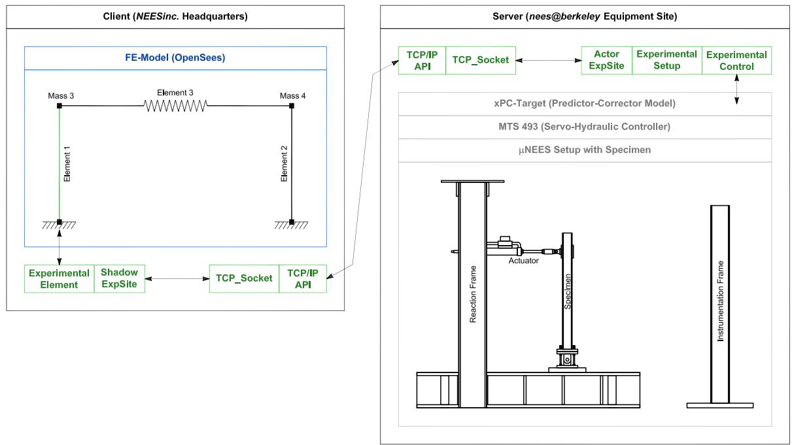  
图 6.5 客户端-服务器配置。

混合模拟的服务器端由OpenFresco的实验站点、实验装置和实验控制对象组成。应注意，对于这个特定的验证测试，选择了有限元分析师视角的混合模拟。这意味着OneActuator实验装置位于分布式配置的服务器端，因此所有跨网络传输的响应量都在元素的基本参考坐标系中。最后，使用xPCtarget实验控制对象连接到运行事件驱动预测-校正模型的实时xPC Target机器。如第5章详细描述的，预测-校正模型负责处理由非确定性TCP/IP网络事务和运动方程的直接积分可能引起的延迟。

测试程序的第一步是启动OpenFresco实验室服务器，它反过来初始化和启动实时xPC Target机器上的预测-校正模型。在此初始化期间，预测-校正模型自动停止，允许对伺服液压控制系统进行最后一刻的调整，将位移和力归零。这保证了实验元素的初始条件尽可能接近零。一旦设置了所需的初始条件，就启动MTS 493控制器通过SCRAMNet+接收命令信号，这完成了nees@berkeley实验室服务器端的测试初始化。运行快速地理分布混合模拟所需做的就是启动NEESinc总部客户端的有限元分析软件（OpenSees）。

### 6.2.4 网络性能评估

为了建立分布式混合模拟的客户端和服务器程序之间的连接，OpenFresco的ShadowExpSite和ActorExpSite类使用通道对象。通道对象是一个抽象基类，定义了数据离开或进入程序的通信端点。因此，是派生子类实现了可用于在客户端和服务器程序之间传输数据的不同通信协议（套接字）。所有可用选项的客户端-服务器架构在第3章中详细描述。对于这里描述的快速地理分布混合模拟案例研究，使用TCP_Socket对象设置从客户端应用程序到服务器应用程序的持久TCP/IP连接。TCP/IP连接保证了传输的消息永远不会丢失、损坏或乱序接收。此外，持久连接提供了显著的性能提升，因为客户端-服务器握手引起的TCP连接设置延迟仅在分布式测试的初始化期间发生一次，而不是在每次单独事务开始时发生。

除了使用持久TCP/IP连接外，发送到TCP堆栈的数据包大小也显著影响了网络性能。由于TCP协议具有数据流接口，允许应用程序将任何大小的数据发送到TCP堆栈（甚至一次一个字节），因此确定产生最佳网络性能的TCP段大小势在必行。确定这种最佳段大小时存在权衡。如果TCP段太大，它们可能在IP级别被分段。另一方面，如果它们太小，网络性能会大大降低，因为少量数据与至少40字节的TCP和IP头开销一起发送。因此，通过将ShadowExpSite和ActorExpSite之间传输的数据包大小增加到超过响应向量所需的最小大小，避免了所谓的发送者愚蠢窗口综合症。发送大量微小数据包非常低效，甚至可能扰乱其他网络流量（Gourley等人，2002年）。

为了研究数据包大小对网络性能的影响，执行了一系列混合模拟，其中单跨框架模型的实验柱被模拟而不是在实验室中测试，跨越不同的网络配置。分布式混合模拟测试在nees@berkeley设备站点的局域网上以及Davis和Berkeley之间的Abilene网络上进行。对于每次测试，记录执行1599步长直接积分分析所需的总模拟时间，并将其作为评估所研究网络性能的度量。

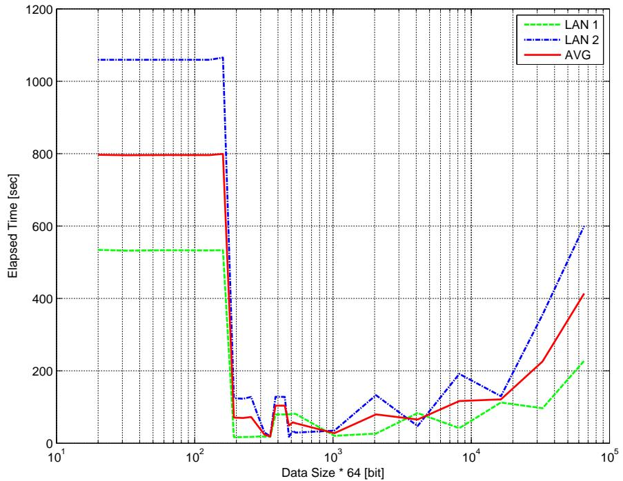  
图 6.6 网络性能取决于数据包大小。

从图6.6可以看出，一旦达到大约200个64位双精度的数据大小，模拟时间突然下降了约10倍。正如预期的那样，对于非常大的数据包，性能开始再次恶化，但速度比遇到之前的突然增加要慢得多。作为这些性能测试的结果，为单跨框架模型的快速地理分布混合模拟选择了256个64位双精度的向量大小。重要的是要认识到，在实时xPC Target机器上运行的事件驱动预测-校正模型（见第5章）实际上确定了在正常操作条件下混合模拟运行的速度。只要没有过度的网络和积分延迟，预测-校正模型中设置的模拟时间步就确定了每个积分时间步在挂钟上经过多少时间。

由于本案例研究的目标是实时执行混合模拟，模拟时间步 $\Delta \mathrm { t } _ { \mathrm { s i m } }$ 必须设置为等于积分时间步 $\Delta \mathrm { t } _ { \mathrm { i n t } } = 2 0$ 毫秒。然而，由于模拟时间步必须是控制器时间步 $\Delta \mathrm { t } _ { \mathrm { c o n } }$ $= ~ 1 / 1 0 2 4$ 秒的倍数，这并不完全可能。决定为每个模拟时间步选择20个子步。只要网络和积分任务能够在预定义模拟时间步的 $60 \%$ 内执行，这就产生了 Δtsim = 19.53125 毫秒。因此，理论测试速率为0.9766，结果略快于实时。

模拟时间步内不同任务的时序和交互可以从图6.7看出。事件流如下。一旦在ti处达到目标位移，就获取抗力并通过Abilene网络发送到积分任务。与此同时，信号生成任务执行响应预测，每 $\Delta \mathrm { t } _ { \mathrm { c o n } }$ 创建新的位移命令。这保证了执行器保持移动直到接收到新的目标位移。完成运动方程的直接积分后，新的位移目标从客户端通过Abilene网络发送回服务器，这触发有限状态机从预测切换到校正。如前所述，如果组合网络和积分时间超过预定义模拟时间步的 $60 \%$，预测-校正模型自动减慢执行器运动。为了实现最佳性能，这种情况需要尽可能少地发生。一旦在 $\mathrm { t } _ { \mathrm { i } + 1 }$ 处达到目标位移，就测量抗力，事件序列重新开始。

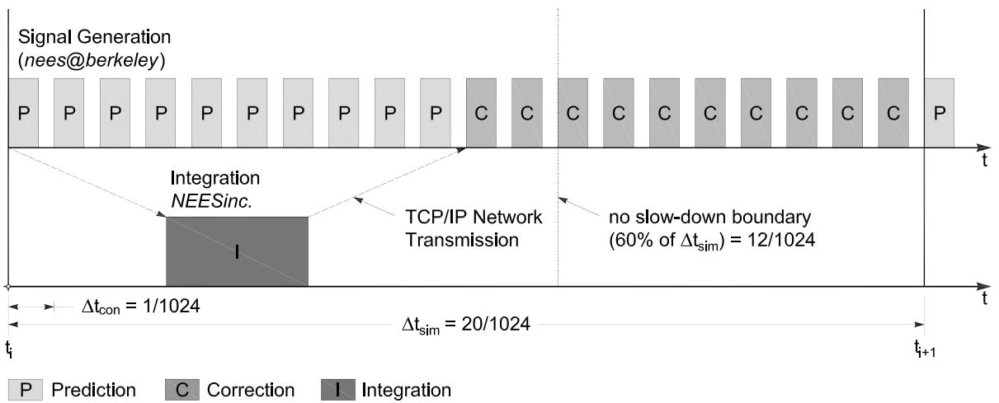  
图 6.7 时间步内任务的时序和交互。

在实际混合模拟期间，时序发生在地理分布测试的客户端和服务器端。在客户端，测量并记录了在非实时操作系统上运行的瞬态分析每一步所消耗的时间。在服务器端，在实时运行的xPC Target机器上对所有预测-校正事件进行时间戳记录。从这些结果中，后来提取了每个模拟时间步所需的时间。

从图6.8可以看出，积分时间步的分布不如模拟时间步的分布窄。这是因为客户端和服务器端的时间测量在时间上相互偏移。根据预测-校正模型的性质，xPC Target机器上的模拟时间步永远不会短于预定义值；在本例中为19.53125毫秒。然而，对于有限状态机必须由于过度延迟而减慢执行器运动的情况，它们可能会更长。与此相反，分析步持续时间是在图6.7中的积分任务块内部的某处测量的，这导致它们比模拟时间步变化更大。

从图6.8还可以看出，由网络和积分任务引起的零星延迟发生在两个独立测量之间一致的时间。由于这些延迟，有限状态机必须减慢执行器速度的次数对应于分析步总数的 $0 . 8 \%$。应注意，从实时xPC Target机器获取的时间测量可能比从非实时客户端机器获取的时间测量更准确。作为网络性能度量的时间步持续时间总结在表6.4中。由于并非所有模拟时间步都能在没有减速的情况下完成，因此地理分布混合模拟不是以硬实时执行的，而是以软实时执行的，遇到了零星的、短暂的延迟。在许多应用中，这种随机的短暂延迟可能是完全可以接受的，不会使整个测试无效。

表 6.4 以时间步持续时间表示的网络性能。   

| 指标                | 客户端 | 服务端 | 目标值 |
|---------------------|--------|--------|--------|
| 最小时间步长 `dtMin` [毫秒] | 16.564 | 19.531 | 19.531 |
| 最大时间步长 `dtMax` [毫秒] | 107.093 | 83.984 | 19.531 |
| 平均时间步长 `dtAvg` [毫秒] | 19.877 | 19.893 | 19.531 |
| 时间步长标准差 `dtStd` [毫秒] | 4.156 | 4.559 | 0.0 |
| 总时长 `tTot` [秒] | 31.784 | 31.809 | 31.230 |

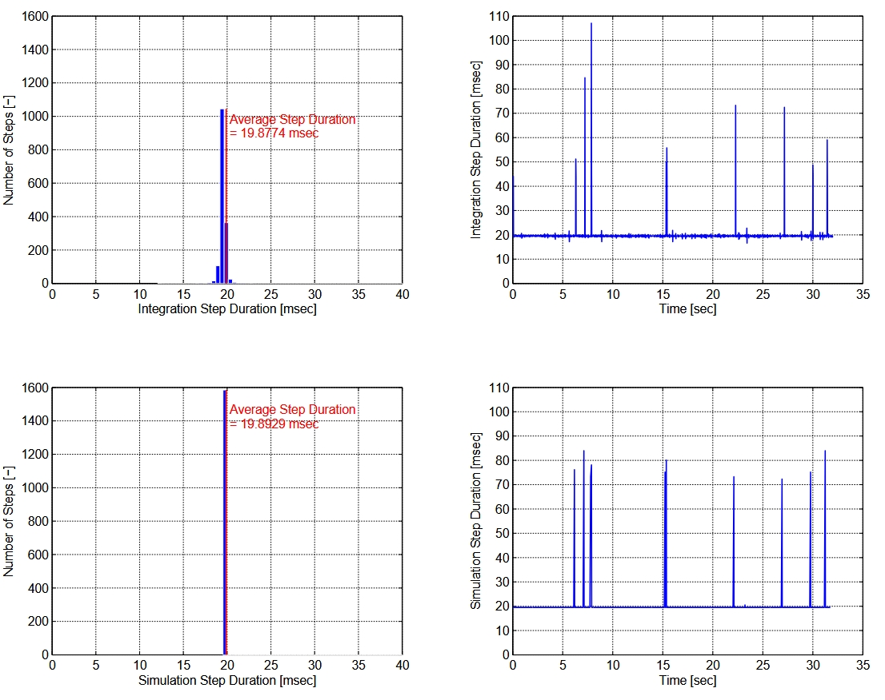  
图 6.8 积分和模拟步分布的比较。

### 6.2.5 测试结果和解释

在本节中，首先讨论由OpenSees在混合模拟客户端（NEESinc总部）记录的结果。其次，呈现一些在xPC Target机器上记录的预测-校正结果。然后使用STS控制器软件记录的测量来评估测试期间伺服液压控制系统实现的性能。最后，将软实时网络测试与慢速本地测试进行比较，以研究测试速度对单跨框架结构响应的影响。

**有限元模型结果：**

图6.9显示了单跨框架结构两个自由自由度的横向位移、速度和加速度响应。响应历史从实时测试期间记录的OpenSees输出文件中绘制。如以下三个图上标记的，左实验柱顶部看到的最大位移、速度和加速度值分别为2.31 in.、22.1 in./sec和 $2 4 2 { \mathrm { ~ i n . / s e c } } ^ { 2 }$。由于左实验柱顶部连接到 $\mu \mathrm { N E E S }$ 装置的执行器，并且测试是实时执行的，执行器经历了相同的响应最大值。因此，这些极端值必须保持在执行器位移限制 $\pm 7 . 5$ in.和执行器速度限制 $\pm 2 3 . 3$ in./sec（如表6.2所列）之内，以免使响应饱和或触发联锁装置并关闭控制系统。

可以从位移历史的最后部分做出的另一个观察是，由于总能量耗散，结构响应在每个周期持续减小，总能量耗散被确定为约等于临界粘滞阻尼系数的 $6 \%$。由于在这些小位移下，滞回能量耗散完全消失，并且因为显式Newmark方法不引入任何数值阻尼，所以总能量耗散是指定粘滞阻尼和实验误差能量耗散的组合。因此，可以得出结论，实验误差贡献的附加阻尼约为临界的 $1 \%$。这意味着执行器控制系统略微超调了参考位移，这从STS控制软件获取的结果得到确认。

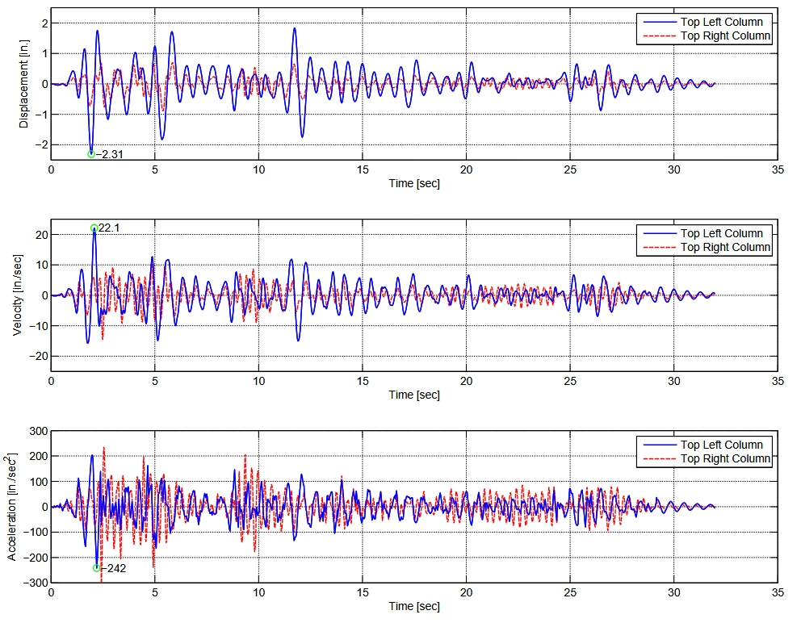  
图 6.9 来自OpenSees的单跨框架模型响应历史。

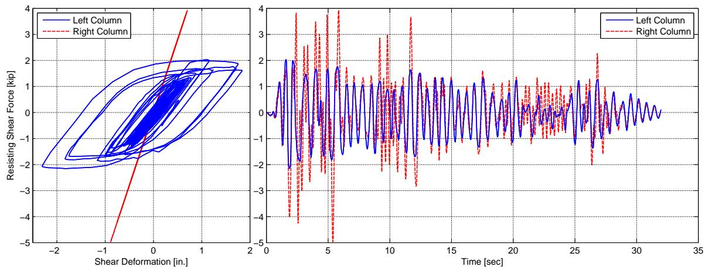  
图 6.10 来自OpenSees的单跨框架模型滞回环和力历史。

从图6.10可以看出，由荷载传感器测量并反馈给OpenSees的抗力相当平滑，除了一个短的时间实例。因此，即使混合模拟以高速度和加速度实时执行，力振荡仍然很小。这可以通过执行器必须来回移动的物理组件的非常小的重量（$4 9 \ 1 \mathrm { b } = 0 . 3 \%$ 节点3处的重量）来解释。如果重量更大，将产生显著的惯性力，进而更大程度地影响力测量。此外，如第2章所述，将需要在运动方程中补偿这些惯性力贡献。

**预测-校正结果：**

为了确认预测-校正有限状态机的正确操作，图6.11提供了位移命令生成和过度网络和计算延迟处理的详细视图。执行器位移命令信号（实线红线）的平滑性，没有跳跃和扭结，验证了为此测试选择的第三阶多项式预测-校正模型是足够的。此外，可以看出，由于小的跟踪误差，测量位移信号（点划线绿线）并不总是精确达到目标位移信号（虚线蓝线）与命令位移信号（实线红线）的交点。

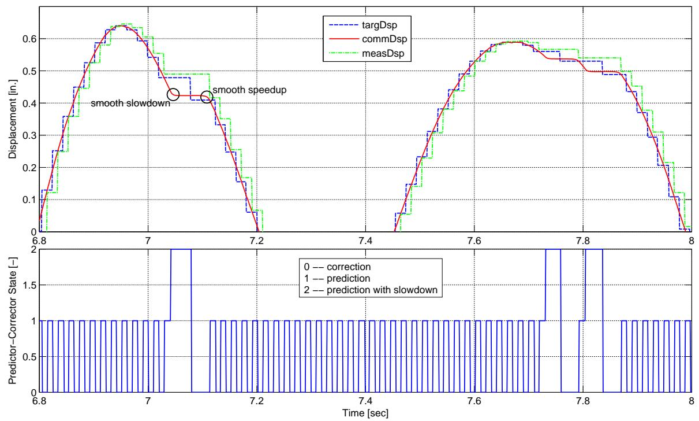  
图 6.11 来自xPC Target的预测-校正状态转换特写。

最后，可以观察到，每当发生延迟时，命令位移信号被平滑地减慢，然后在最后接收到目标位移时再次平滑地加速。这种命令位移的平滑过渡很重要，以免产生虚假力振荡，如果执行器突然改变速度，则会产生这种振荡。

**伺服液压控制系统结果：**

从STS控制软件以1024 Hz采样率获取的位移和力测量来评估伺服液压控制系统的性能。从图6.12可以看出，快速混合模拟期间的最大位移误差等于0.06 in.，约对应于最大位移的 $2 . 6 \%$。

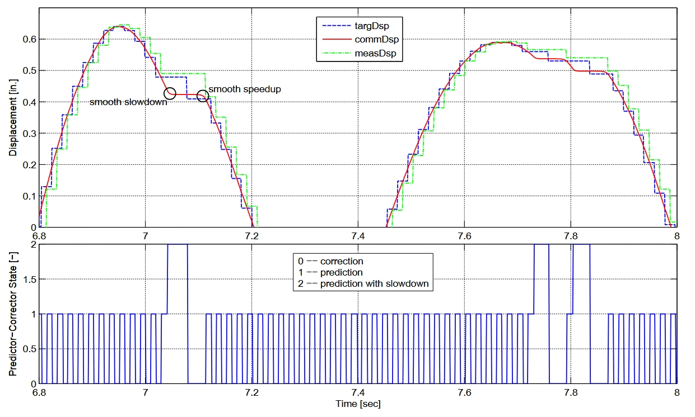  
图 6.12 来自STS的位移误差历史和傅里叶振幅谱。

位移误差的傅里叶振幅谱清楚地显示了结构的基频为 $1 . 4 7 ~ \mathrm { H z }$，由于实验柱的非线性软化，略低于线弹性频率 $1 . 6 1 ~ \mathrm { H z }$。试样必须在 $2 5 . 4 \ : \mathrm { H z }$ 的频率处产生第二个振幅峰值，因为它非常接近试样频率的分析估计值 $2 5 . 6 \ : \mathrm { H z }$。最后，$1 4 8 ~ \mathrm { H z }$ 频率处的第三个振幅峰值对应于 $\mu \mathrm { N E E S }$ 装置的油柱频率，从而确认了分析估计值。

Mercan（2007）利用了一种方便的方法，可以在一个图中检查执行器滞后、超前、欠调和超调。图6.13呈现了这样的图，其中测量位移相对于命令位移绘制。可以从图中快速确定以下执行器性能：如果图是直的 $4 5 ^ { \circ }$ 线，则实现了没有任何误差的完美跟踪。如果图显示逆时针或顺时针旋转的椭球，则执行器产生滞后或超前的位移响应。最后，如果线或椭球轴顺时针或逆时针偏离 $4 5 ^ { \circ } { \mathrm { . } }$ 线，则执行器欠调或超调。

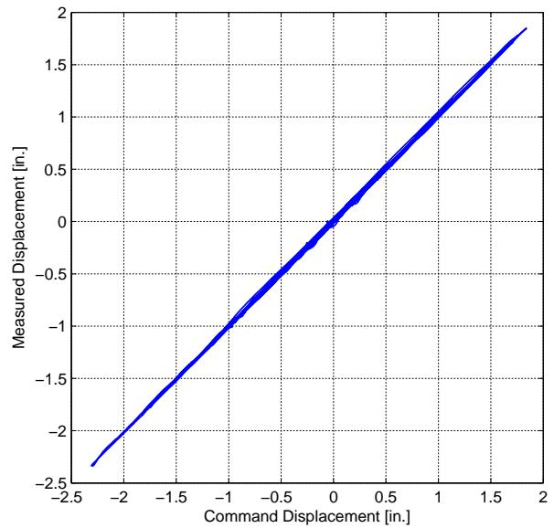  
图 6.13 来自STS的同步子空间图。

这里呈现的实时测试图显示了一条几乎完全直的线，略微逆时针旋转。这意味着执行器略微超调，并确认了通过能量耗散调查得出的结论。从图6.14可以看出，测量抗力的傅里叶谱中有三个不同的振幅峰值。$1 . 5 3 \ \mathrm { \ H z }$ 频率处的第一个峰值再次类似于单跨框架模型的基频。然而，$3 7 \ : \mathrm { H z }$ 频率附近出现的第二个峰值对应于反力框架的自然频率，因此是由测试试样与反力框架和执行器的相互作用产生的。$1 4 8 ~ \mathrm { H z }$ 频率处的第三个振幅峰值再次对应于 $\mu \mathrm { N E E S }$ 装置的油柱频率，从而再次确认了分析估计值。

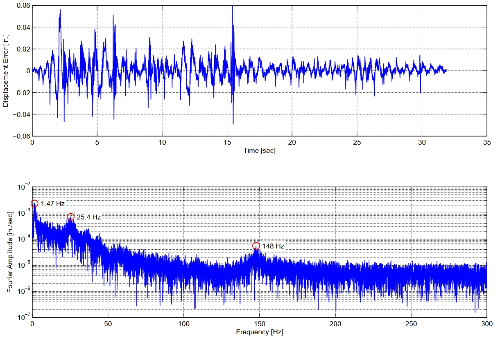  
图 6.14 来自STS的测量力历史和傅里叶振幅谱。

**实时与慢速混合模拟的比较：**

为了确定单跨框架模型的结构响应是否受混合模拟测试速率的影响，进行了第二次慢十倍的本地混合模拟。模拟时间步增加到 $\Delta \mathrm { t _ { s i m } } = 2 0 0 . 2$ 毫秒，这有效地产生了比软实时地理分布模拟慢约十倍的混合模拟。从图6.15可以看出，左实验柱顶部（节点3）的位移、速度和加速度响应几乎相同。这意味着对于这个特定测试和结构，测试速率的影响可以忽略不计，可以忽略。图6.16中滞回环和实验剪力的比较证实了这一观察。由于单跨框架结构的响应几乎不受测试速率的影响，可以得出两个结论。首先，两个延性钢试样的行为（模拟柱端部的塑性铰区）与应变率无关。

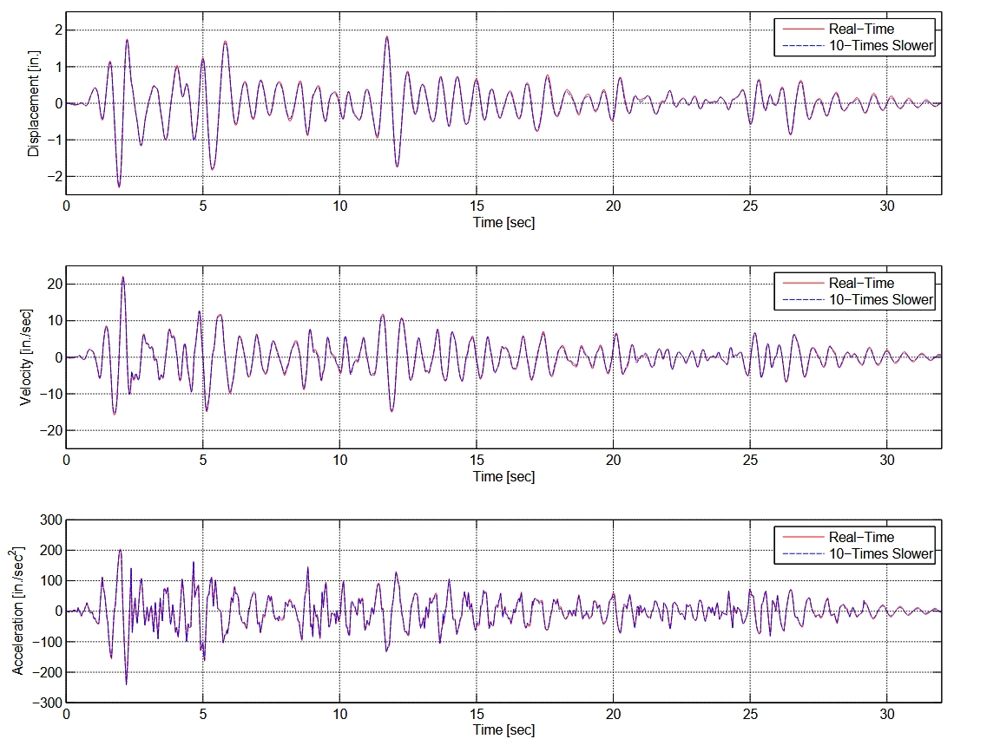  
图 6.15 实时与慢速混合模拟的单跨框架模型响应历史比较。

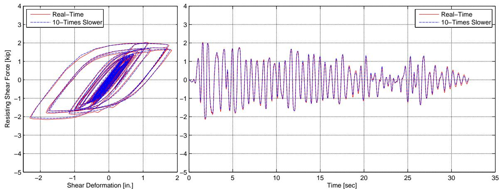  
图 6.16 实时与慢速混合模拟的单跨框架模型滞回环和力历史比较。

其次，由试样和加载装置的物理质量产生的惯性力的影响与节点3处模型质量产生的惯性力相比很小。确定荷载传感器测量并反馈到分析中的最大物理惯性力约为节点3处解析惯性力的 $0 . 5 \%$，这证实了第二个结论。

为了比较实时和慢速测试期间伺服液压控制系统的性能，使用了Mercan（2007）定义的跟踪指标。跟踪指标基于将测量位移相对于命令位移绘制时的滞回环包围面积，如图6.13所示。如果指标值增加，位移响应超前，因此向系统引入额外的能量耗散（阻尼）。另一方面，如果指标减小，位移响应滞后，这些跟踪不准确导致的能量耗散为负。如果这种系统实验误差引入系统的能量大于滞回、粘滞和数值能量耗散的总和，系统的响应开始增长，最终导致系统不稳定。

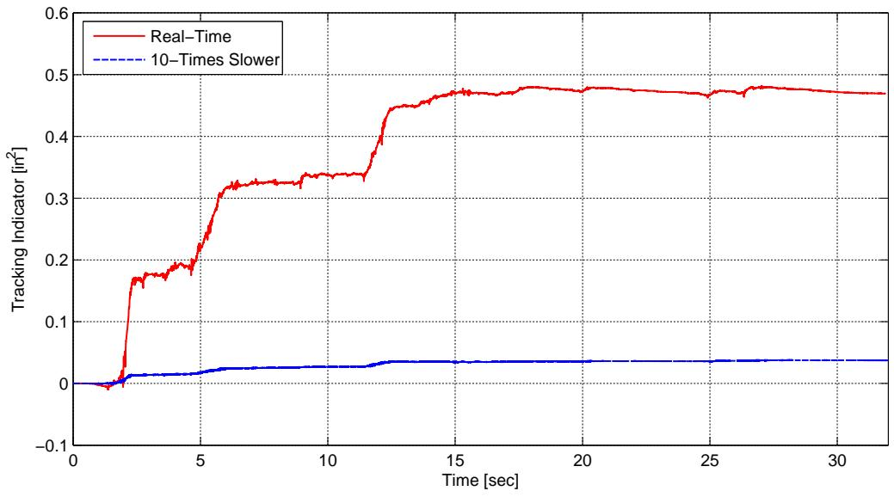  
图 6.17 实时与慢速混合模拟的跟踪性能比较。

图6.17呈现了两个测试的跟踪指标，其中慢速测试在时间上压缩了十倍以便于比较。从两个跟踪指标为正值可以推断，在两个混合模拟期间都向系统引入了额外的阻尼。即使这影响了测试的精度，这种实验误差也比系统性地引入额外能量更可取，后者可能使系统失稳。虽然两个测试的跟踪都很好，但可以观察到慢速测试期间的性能比实时测试期间好约12倍。

**解析模拟与混合模拟的比较：**

为了验证 $\mu \mathrm { N E E S }$ 试样和单跨框架结构的纯解析OpenSees模型，将数值结果与准静态测试和混合模拟获得的实验结果进行比较。$\mu \mathrm { N E E S }$ 试样的解析模型由几个类似于U形夹和 $\mathrm { { s 4 x 7 . 7 } }$ 钢柱的线弹性元素和四个模拟两个钢试样的非线性力梁柱元素组成。

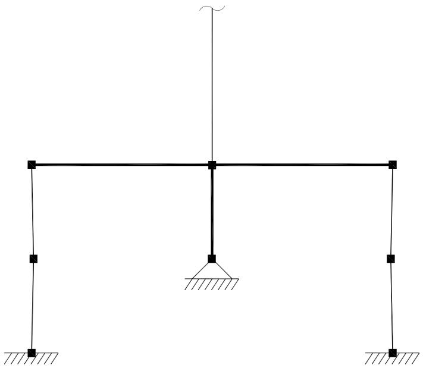  
图 6.18 $\mathbf { \mu N E E S }$ 试样的解析模型。

为了捕捉钢试样的屈曲行为，采用了Uriz（2005）引入的方法，其中使用精确的大位移协转几何变换与试样局部x轴垂直的试样中心节点的初始偏移相结合。对于每个非线性力梁柱元素，使用五个具有圆形纤维截面的Gauss-Lobatto积分点，所有纤维都使用没有各向同性硬化的Menegotto-Pinto塑性模型建模。

第一步，使用图6.4所示的SAC加载历史中实验确定的滞回环来校准 $\mu \mathrm { N E E S }$ 试样解析模型的参数。从图6.19可以看出，校准的解析模型能够相当准确地捕捉整体响应。此外，可以观察到，由于试样屈曲，每个循环的强度降低被非线性力梁柱元素和协转几何变换准确建模。对于正位移，数值生成的滞回环与实验生成的滞回环之间的匹配略好于负位移。

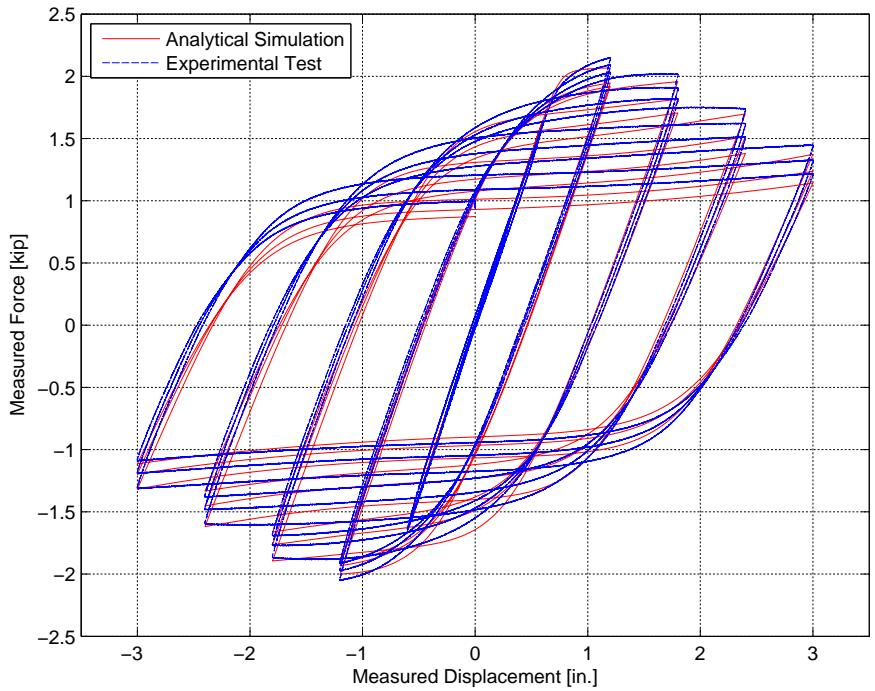  
图 6.19 SAC加载历史的解析与实验滞回环比较。

在试样数值模型成功校准后，将子组件纳入单跨框架结构的完整解析模型中，以执行动态直接积分分析。然后将纯解析结构的地震响应与混合模拟测试获得的结果进行比较。从图6.20可以看出，左柱顶部（节点3）的位移、速度和加速度响应对于解析模型和混合模型几乎相同。这意味着纯数值模型能够准确捕捉非线性单跨框架结构的地震响应。左柱的滞回环和剪力比较如图6.21所示。可以看出，解析模型计算的柱剪力与实验柱试样测量的剪力匹配良好。然而，抗力的捕捉精度略低于位移、速度和加速度。这也可以从滞回环中观察到，其中数值模型的试样在第二响应循环中表现出过多的软化，与实验试样相比。

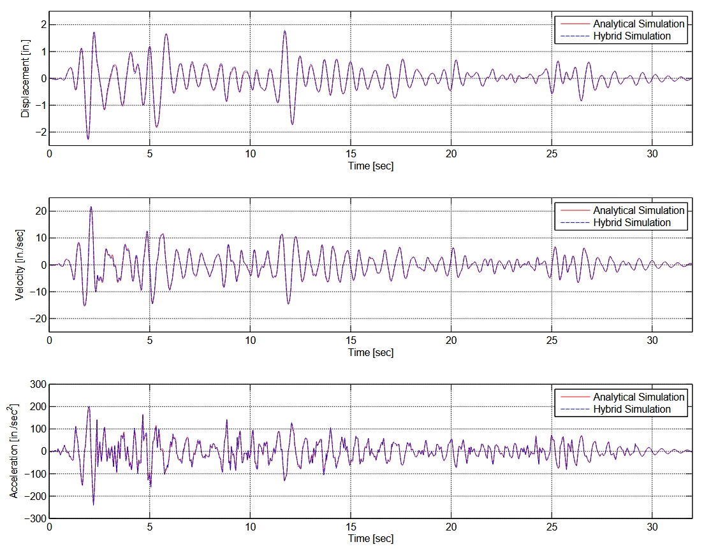  
图 6.20 解析与混合模拟的单跨框架模型响应历史比较。

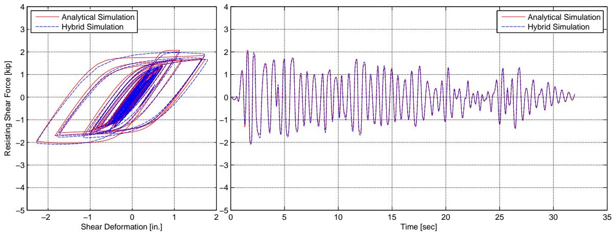  
图 6.21 解析与混合模拟的单跨框架模型滞回环和力历史比较。

尽管如此，纯解析和混合结构的整体响应匹配非常好，这成功证明了两个模型的有效性。特别是，它证明了地理分布混合模拟是一种可行的测试方法，可以通过依赖下一代Abilene网络在不同实验室之间进行软实时实验测试。

## 6.3 结构倒塌模拟

### 6.3.1 动机

地震工程领域的一个重要研究方向涉及模拟结构倒塌的能力，以提高我们对结构在非常罕见的地震事件期间性能的理解。然而，倒塌的实验研究通常复杂、昂贵且潜在危险。可以技术上采用前面描述的三种实验方法中的任何一种来执行结构倒塌测试。然而，准静态和振动台测试在进行、执行和解释此类测试方面都面临困难，而混合模拟则不然。

接下来总结了三种实验方法相对于结构倒塌研究的优势和劣势。

1. 虽然准静态测试相对容易且经济地进行，但施加在测试试样上的需求与观察到的损伤没有直接关系。这引发了关于试样是否测试不足或过度测试的问题，反过来使得对结构在倒塌附近或倒塌时的行为得出准确结论变得极其困难。

2. 振动台测试提供了关于特定地震动动态响应的重要数据，考虑了结构的惯性和能量耗散特性以及几何非线性、局部屈服和损伤对响应的后果。然而，对于此类测试，需要完整的结构系统，并且需要构建包括复杂主动或被动重力荷载设置的试样。此外，需要采取预防措施来保护昂贵的测试设备免受倒塌期间试样冲击的影响。这使得振动台上的倒塌研究非常复杂、昂贵且潜在危险。此外，由于模拟器平台和/或控制系统限制，通常需要缩尺或高度简化的试样，这质疑了许多结构倒塌振动台测试的真实性。   
3. 混合模拟使得通过将其纳入混合模型的解析部分来研究几何非线性、三维效应、多支座激励和土-结构相互作用成为可能。因此，混合模拟方法使研究人员能够测试大尺度或全尺度试样，并减少或避免缩放问题。此外，只有结构的关键的、对倒塌敏感的元素需要物理测试，允许在相同预算下大幅增加不同倒塌测试的数量。

为了演示如何在混合模型的数值部分中考虑重力荷载和几何非线性，使用地震工程模拟开放系统（OpenSees）（McKenna 1997；Fenves等人，2004）和OpenFresco（见第3章）软件包，进行了混合模拟，其中通过一致地考虑重力荷载引起的二阶效应来测试门式框架。

### 6.3.2 二阶效应

由于二阶效应是由重力荷载引起的，因此了解这些荷载如何影响结构的响应很重要。一般而言，重力荷载在三个层面上影响结构的响应，如下表6.5所示。

表 6.5 重力荷载对结构响应的影响。   

| Level 层级 | Effect 作用（英文原文） | 作用（中文翻译） |
| :--- | :--- | :--- |
| **Section 截面** | Gravity loads cause axial forces that interact with bending moments and shears at the cross section, commonly known as P-M and P-V interaction. | 重力荷载在截面产生轴力，该轴力与截面的弯矩和剪力相互作用，通常称为**轴力-弯矩（P-M）**和**轴力-剪力（P-V）**相互作用效应。 |
| **Element 构件** | Gravity loads affect the stability of structural elements and critical regions, causing softening and local and/or lateral-torsional buckling of elements, commonly known as the small P-Delta (P-δ) effects. | 重力荷载影响结构构件及关键部位的稳定性，导致构件刚度软化、局部屈曲或弯扭屈曲，通常称为**小P-Δ效应（P-δ，构件级二阶效应）**。 |
| **Structure 结构** | Gravity loads influence the stability of a structure, causing additional overturning moments due to large displacements. These effects are commonly known as the large P-Delta (P-Δ) effects. | 重力荷载影响整体结构的稳定性，由大位移产生附加倾覆力矩，通常称为**大P-Δ效应（P-Δ，结构级二阶效应）**。 |

💡 术语说明
- `P-δ`：构件在自身弯曲变形下，轴力产生的附加弯矩，也叫“小二阶效应”。
- `P-Δ`：结构整体侧移引起的重力附加倾覆弯矩，也叫“大二阶效应”。
- `P-M/P-V interaction`：轴力与弯矩、剪力共同作用下，构件截面承载力降低的耦合效应。

为了在有限元软件（如OpenSees）中建模这些非线性几何效应，需要在变形构型中满足构件平衡方程。此外，由于大位移，构件变形与全局构件端部位移之间的协调关系变为非线性。对于框架构件，只要力-变形关系在没有刚体模式的基本坐标系中定义，就可以将这些坐标变换与构件本身的实际实现分开。因此，可以为同一构件实现不同的几何理论而无需修改构件代码。在OpenSees中，CrdTransf软件类通过将任何框架构件的响应量从全局自由度变换到简支基本构件自由度并返回，提供了这一确切功能。CrdTransf类是一个抽象基类，具有用于线性、p-delta和协转几何变换的具体子类。框架构件坐标变换的这种抽象和封装，便于在OpenSees软件框架中在不同线性和非线性坐标变换之间切换，而不会影响框架构件本身的实现。

### 6.3.3 理论和实现

OpenFresco中的二维实验梁柱构件公式（在本案例研究中使用）基于悬臂基本系统的三个并置自由度（见图6.22或第3章）。

位移、速度、加速度和力的必要变换在具体的EEBeamColumn2d类中实现。由于此实验构件类似于解析梁柱构件，因此使用上述OpenSees CrdTransf类将响应量从全局自由度变换到简支基本构件自由度并返回。然而，由于简支基本系统不太适合实验测试（由于两个转动自由度），响应量进一步从简支变换到悬臂基本系统并返回。这些额外的非线性变换直接在EEBeamColumn2d类中实现，并在第3章中详细描述。

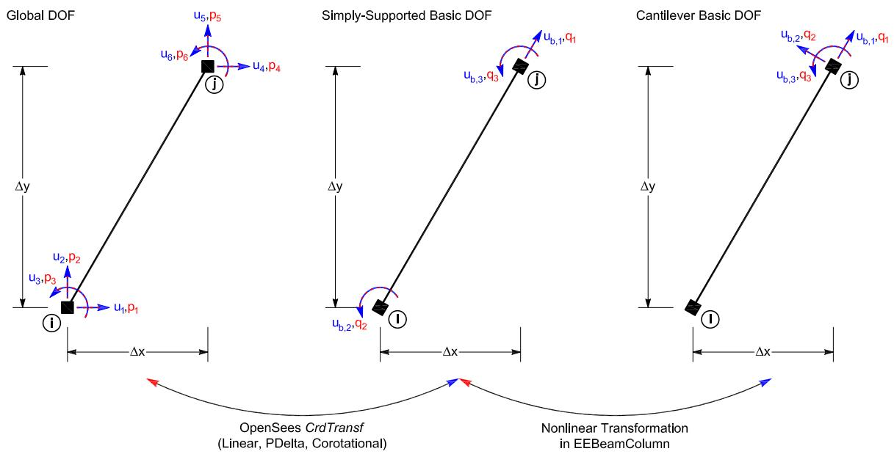  
图 6.22 实验梁柱构件（EEBeamColumn2d）。

在OpenSees中可用的三种坐标变换（线性、p-delta和协转）中，这里只解释大位移、中等变形的协转变换（de Souza 2000；Filippou和Fenves 2004）。

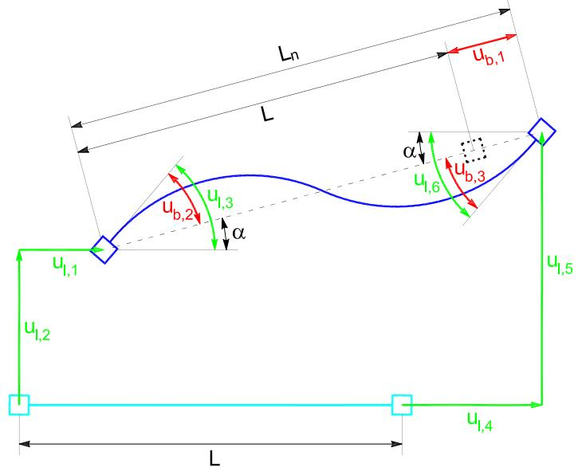  
图 6.23 从局部到基本系统A的协转变换。

第一步（未显示），通过应用旋转变换矩阵将梁柱构件的六个端部位移从全局变换到局部坐标系。之后，使用以下公式将局部坐标系中的构件试算位移 $u _ { l , }$ 变换到基本坐标系中的构件变形 $u _ { b }$：

$$
u _ {b, 1} ^ {(A)} = L _ {n} - L \quad L _ {n} = \sqrt {\left(L + u _ {l , 4} - u _ {l , 1}\right) ^ {2} + \left(u _ {l , 5} - u _ {l , 2}\right) ^ {2}}
$$

$$
u _ {b, 2} ^ {(A)} = u _ {l, 3} - \alpha \quad \text {w i t h} \quad \left( \begin{array}{c} u _ {l, 5} - u _ {l, 2} \end{array} \right) \tag {6.1}
$$

$$
u _ {b, 3} ^ {(A)} = u _ {l, 6} - \alpha  = \arctan \left(\frac {u _ {l, 5} - u _ {l, 2}}{L + u _ {l , 4} - u _ {l , 1}}\right)
$$

其中 $L _ { n }$ 是构件弦在变形构型中的长度，$\alpha$ 是弦从构件未变形到变形构型的旋转角。如前面第4章所示，为方便起见在此重复，抗力和构件刚度矩阵从基本系统A到局部坐标系的变换采用以下形式。

$$
\mathbf {p} _ {1} = \mathbf {a} ^ {T} \mathbf {q} ^ {(A)}
$$

$$
\mathbf {k} _ {1} = \frac {\partial \mathbf {p} _ {1}}{\partial \mathbf {u} _ {1}} = \frac {\partial}{\partial \mathbf {u} _ {1}} \left(\mathbf {a} ^ {T} \mathbf {q} ^ {(A)}\right) = \mathbf {a} ^ {T} \mathbf {k} _ {\mathbf {b}} ^ {(A)} \mathbf {a} + \frac {\partial \mathbf {a} ^ {T}}{\partial \mathbf {u} _ {1}} \mathbf {q} ^ {(A)} \tag {6.2}
$$

其中相容性矩阵 $\mathbf{a}$ 和基本坐标系A中的弹性构件刚度矩阵 $\mathbf { k _ { b } } ^ { ( \mathrm { A } ) }$ 由公式(6.3)给出。

$$
\mathbf {a} = \left[ \begin{array}{l l l l l l} - \cos (\alpha) & - \sin (\alpha) & 0 & \cos (\alpha) & \sin (\alpha) & 0 \\ - \frac {\sin (\alpha)}{L _ {n}} & \frac {\cos (\alpha)}{L _ {n}} & 1 & \frac {\sin (\alpha)}{L _ {n}} & - \frac {\cos (\alpha)}{L _ {n}} & 0 \\ - \frac {\sin (\alpha)}{L _ {n}} & \frac {\cos (\alpha)}{L _ {n}} & 0 & \frac {\sin (\alpha)}{L _ {n}} & - \frac {\cos (\alpha)}{L _ {n}} & 1 \end{array} \right] \quad\quad\text{(6.3)}
% \tag {6.3}
$$

$$
\mathbf {k} _ {\mathbf {b}} ^ {(A)} = \left[ \begin{array}{c c c} \frac {E A}{L} & 0 & 0 \\ 0 & \frac {4 E I}{L} & \frac {2 E I}{L} \\ 0 & \frac {2 E I}{L} & \frac {4 E I}{L} \end{array} \right]
$$

$\mathbf { u } _ { \mathbf { l } }$ 和 $\mathbf { p } _ { \mathbf { l } }$ 是局部坐标系中的构件位移和力，${ \mathbf { u _ { b } } } ^ { ( \mathrm { A } ) }$ 和 $\mathbf { q } ^ { ( \mathrm { A } ) }$ 是基本坐标系A中的构件变形和力，$\alpha$ 是弦旋转角，$L _ { n }$ 是构件弦在变形构型中的长度。此外，(6.2)中局部刚度矩阵的第一部分代表材料刚度，第二部分代表几何刚度。

### 6.3.4 测试结构和地震记录

本节演示了如何使用新型实验梁柱构件（EEBeamColumn2d；见第3章）执行混合模拟直至倒塌。如图6.24所示，钢单层单跨门式框架高度为50英寸，对应于执行器连接到实验钢试样的高度。结构宽度任意选择为100英寸。此外，门式框架由弹性W6x12梁和两个延性、非线性S4x7.7柱组成。连接梁、粘滞能量耗散和质量特性以及重力和地震荷载都在OpenSees中进行了解析建模。EEBeamColumn2d实验构件（见图6.22）用于表示两个柱。左柱使用ECSimDomain控制器进行模拟，右柱在 $\mu \mathrm { N E E S }$ 实验室中进行物理测试。

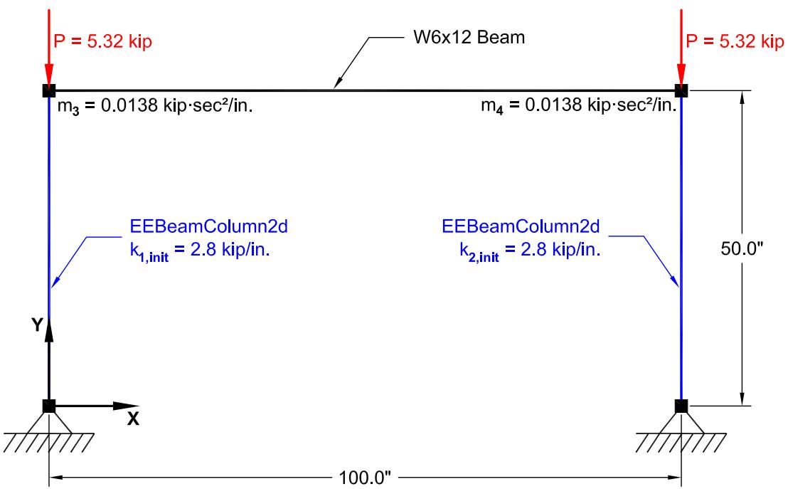  
图 6.24 具有结构特性的门式框架模型。

考虑构件中的轴向和弯曲变形，门式框架模型总共有八个自由度（四个平移和四个转动）。然而，假设只有四个平移自由度具有质量 $\mathrm { ( m _ { 3 } ~ = ~ m _ { 4 } ~ = ~ 0 . 0 1 3 8 }$ $\mathrm { k i p } \cdot \mathrm { s e c } ^ { 2 } / \mathrm { i n } .$ )，这使得8x8质量矩阵的秩等于四。根据所选的结构特性，结构的基本周期为0.49秒，粘滞能量耗散采用 $5 \%$ 质量比例阻尼建模。重力荷载的大小 $( { \mathrm { P } } = 5 . 3 2 { \mathrm { k i p } } $ ) 设置为物理柱（包括U形夹）临界侧移屈曲荷载的 $50 \%$，假设梁是弯曲刚性的且柱的底部支撑为铰接。由于两柱上的重力荷载完全在混合模型的解析部分中处理，对结构实验部分（柱截面和构件）施加的轴向荷载可忽略不计，因此在此演示和验证示例中仅考虑大p-delta效应（见表6.5）。

混合门式框架模型受到SAC数据库的SACNF01近断层地震动的激励，缩放到峰值地面加速度为 $0 . 9 0 6 \ \mathrm { g }$ 。该地震动最初记录于1978年伊朗Tabas地震，并根据SAC协议进行了修改以代表NEHRP土类型Sd。30秒的时间历程被缩短为25秒，以便混合模拟执行时间更短。因此，它由2500个数据点组成，每0.01秒记录一次。该运动对于 $5 \%$ 阻尼比的弹性反应谱，并在基本侧移周期处有标记，如图6.25所示。

### 6.3.5 测试设置和程序

为方便起见，在实验室中，右梁柱试样被倒置，顶部为铰接端，底部为固定端。第6.2.3节详细描述的 $\mu \mathrm { N E E S }$ 实验装置用于测试门式框架的右柱。需要强调的是，由于基本坐标系随构件变形而移动，这些测试中使用的单执行器实验装置（图6.3）的行为也好像它已连接到实验构件并随其移动。由于测试作为本地混合模拟执行，OpenSees有限元分析软件与OpenFresco紧密集成的实验构件、本地实验站点、实验装置和控制对象都位于nees@berkeley实验室。由于八个自由度中只有两个分配了质量，必须使用无条件稳定积分方法来求解运动方程。

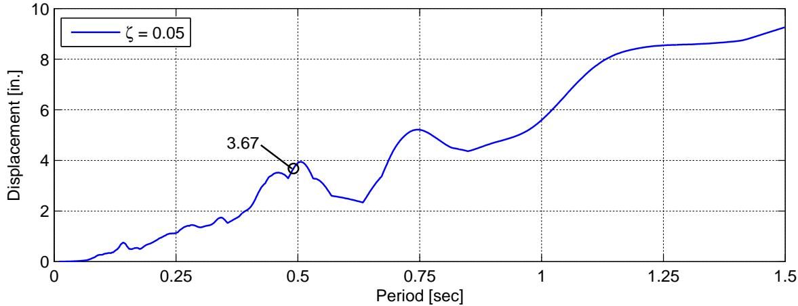  
SACNF01 位移反应谱，$\mathsf { T } = 0 . 4 9 1$ 秒处的值

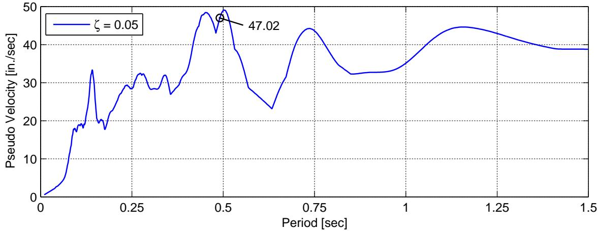  
SACNF01 伪速度反应谱，${ \sf T } = 0 . 4 9 1$ 秒处的值

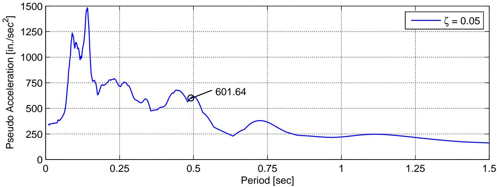  
SACNF01 伪加速度反应谱，${ \sf T } = 0 . 4 9 1$ 秒处的值   
图 6.25 SACNF01地震动的弹性反应谱，基本周期处的值。

此外，由于混合模型由表现出强材料和几何非线性的数值和实验构件组成，广义-alpha-OS方法（见第4章）不太适合，必须采用迭代求解方案。因此，利用具有10个子步的第二修正隐式Newmark方法和具有混合Jacobian的Newton-Raphson算法（见第4章）。

与前面的案例研究一样，在OpenFresco中使用OneActuator实验装置来表示 $\mu \mathrm { N E E S }$ 装置，并使用xPCtarget实验控制对象连接到运行事件驱动的三阶预测-校正算法的实时xPC Target机器，该算法在校正公式中使用最后预测值（见第5章）。积分时间步选择为 $\Delta \mathrm { t } _ { \mathrm { i n t } } = 0 . 0 1$ 秒，等于地震动时间步。另一方面，模拟时间步选择为 $\Delta \mathrm { t } _ { \mathrm { s i m } } = 2 ^ { - 5 } = 3 1 . 2 5$ 毫秒，结合每个时间步10次迭代，混合模拟以比实时慢31.25倍的速率执行，每次测试持续13分钟。

### 6.3.6 测试结果和解释

为了研究重力荷载对门式框架响应的影响，进行了两对模拟。一个模拟在没有施加任何重力荷载的情况下执行，然后在第二个测试中将重力荷载添加到混合模型的解析部分。两个测试都使用了协转几何坐标变换，并且每个测试中U形夹中代表塑性铰的新试样都是相同的。

本节描述了各种结果。首先，讨论在OpenSees中记录的响应。其次，呈现一些在xPC Target机器上记录的预测-校正结果。然后使用STS控制器软件记录的测量来评估测试期间伺服液压控制系统实现的性能。最后，将混合模拟与门式框架模型的纯解析模拟进行比较。

**有限元模型结果：**

层间位移时间历程以及层剪力与层间位移滞回环的比较如图6.26所示。即使没有重力荷载的第一个测试，框架位移和残余位移也很大，但混合模型没有倒塌。在第二次混合模拟中，从组合混合模型表现出的负屈服后切线刚度可以清楚地看出重力荷载的存在。

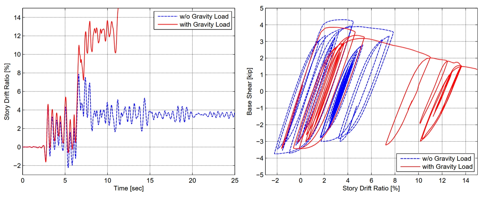  
图 6.26 来自OpenSees的门式框架模型层间位移时间历程和总层滞回环的比较。

从图6.26a可以看出，对于带重力荷载的混合模拟，层间位移在测试开始后6.5秒迅速增加，这可以被认为是框架倒塌的开始。随着每个额外的循环，门式框架进一步倾斜，直到混合模拟最终在执行器达到其7.5英寸的行程限制时终止，这对应于 $1 5 \%$ 的层间位移角。第二次模拟证明混合模型可以被测试到门式框架倒塌，这在振动台测试中将是困难且危险的。

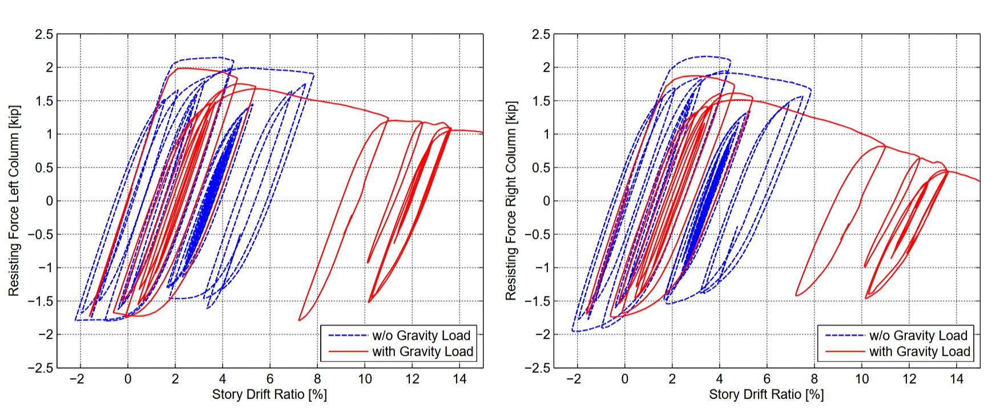  
图 6.27 来自OpenSees的门式框架模型构件力-层间位移滞回环的比较。

图6.27提供了两个实验柱构件滞回环的比较。构件剪力相对于全局参考坐标系中的构件位移角绘制。可以观察到，对于两个混合模拟（无重力荷载和有重力荷载），右柱的负屈服后刚度显著大于左柱。这种行为可以解释为门式框架向右倾斜，倾覆力矩因此使右柱进一步受压并使左柱卸载。由于两个混合模拟都对所有构件使用了大位移非线性几何坐标变换，这种效应也可以在没有重力荷载的测试中观察到。

图6.28比较了两个实验梁柱构件的执行器滞回环。执行器力与执行器位移的关系在基本系统B（悬臂）中绘制，正如从ECSimDomain（左柱）和ECxPCtarget（右柱）控制对象获取的那样。这意味着在变换到基本系统A（简支）之前以及在EEBeamColumn对象中应用非线性几何变换的重力荷载效应之前对响应进行比较。因此，在实际测试中没有观察到负峰值后刚度。滞回环之间的差异完全是由于一致施加的位移。此外，可以看出，对于悬臂柱端的大位移（分别为U形夹的大转动），滞回环表现出一些退化。这种退化是由于U形夹经历大转动时可更换钢试样的屈曲。

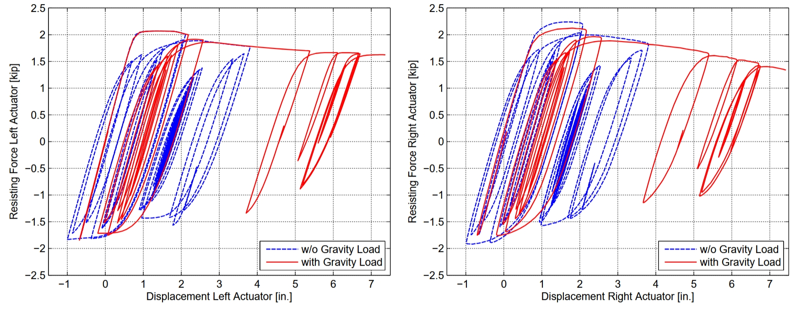  
图 6.28 来自OpenSees的门式框架模型执行器力-位移滞回环的比较。

**预测-校正结果：**

与前面的案例研究类似，通过仔细查看位移1命令生成，再次确认预测-校正有限状态机的正确操作。

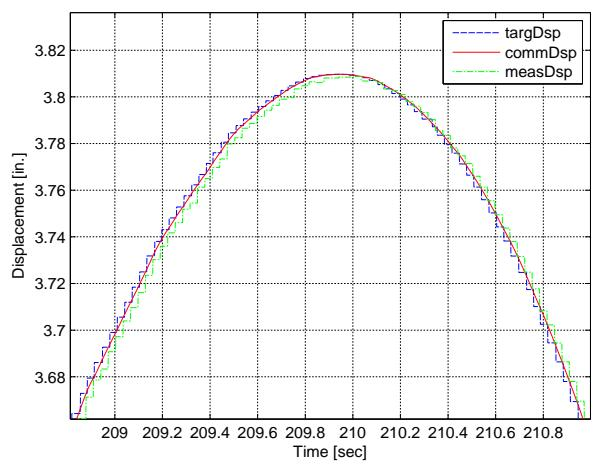

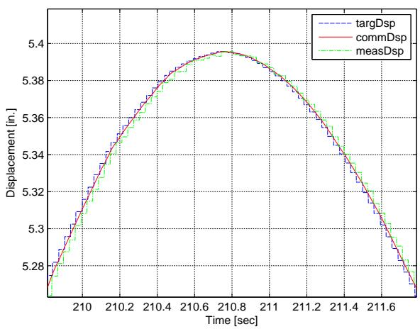  
图 6.29 来自xPC Target的预测-校正状态转换特写。

图6.29中的两个图显示了无重力荷载测试（左）和有重力荷载测试（右）的信号特写。执行器位移命令信号（实线红线）的平滑性，没有跳跃和扭结，验证了所选的三阶预测-校正算法在校正公式中使用最后预测值（见第5章）实现了令人满意的性能。

此外，可以观察到，由于小的跟踪误差，测量位移信号（点划线绿线）并不总是精确达到目标位移信号（虚线蓝线）与命令位移信号（实线红线）的交点。特别是，测量位移信号略小于命令位移。这意味着执行器略微欠调，这从下一节STS控制软件获取的结果得到确认。

**伺服液压控制系统结果：**

从STS控制软件以1024 Hz采样率获取的位移和力测量来评估伺服液压控制系统的性能。对于第一个无重力荷载的混合模拟，测试期间的最大位移误差等于0.006 in.，约对应于最大位移的 $0 . 1 5 \%$；对于第二个有重力荷载的混合模拟，测试期间的最大位移误差等于0.005 in.，约对应于最大位移的 $0 . 0 6 \%$。这意味着伺服液压控制系统能够实现非常精确的位移跟踪，主要是由于测试的慢速执行（比实时慢31.25倍）。

再次从同步子空间图（Mercan 2007）评估执行器滞后、超前、欠调和超调，其中测量位移相对于命令位移绘制。可以从图中快速确定以下执行器性能：如果图是直的 $4 5 ^ { \circ }$ 线，则实现了没有任何误差的完美跟踪。如果图显示逆时针或顺时针旋转的椭球，则执行器产生滞后或超前的位移响应。最后，如果线或椭球轴顺时针或逆时针偏离 $4 5 ^ { \circ }$ 线，则执行器欠调或超调。

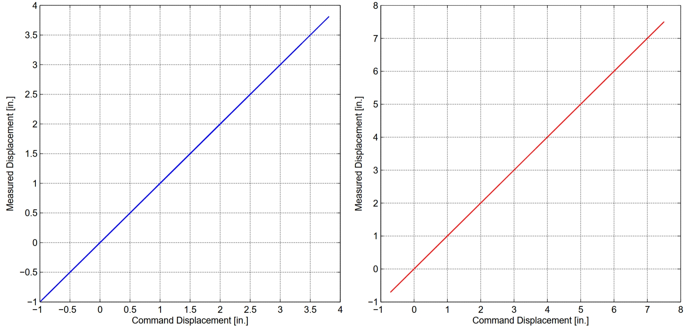

图 6.30 来自STS的同步子空间图。

图6.30中无重力荷载（左）和有重力荷载（右）混合模拟的两个图显示了几乎完全直的线，略微顺时针旋转。这意味着在两个测试期间执行器略微欠调，向系统引入了微小量的额外能量。此外，这证实了上一节中做出的观察。

图6.31呈现了两个测试的跟踪指标（Mercan 2007）。从两个指标的负值可以推断，在两个混合模拟期间向系统引入了负阻尼，即额外能量。然而，跟踪指标的值如此之小，以至于仅向混合模拟引入了微小量的能量，这没有影响系统的稳定性。虽然两个测试的跟踪都很好，但可以观察到，有重力荷载测试期间的跟踪略好于无重力荷载测试，但测量信号中有更多噪声。

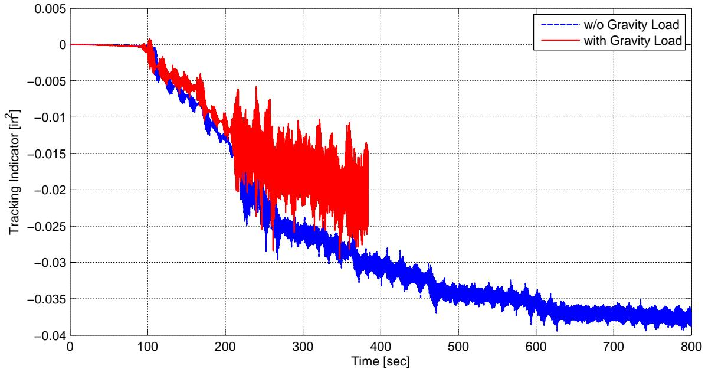  
图 6.31 来自STS的无重力荷载测试与有重力荷载测试的跟踪性能比较。

**解析模拟与混合模拟的比较：**

第6.2.5节开发的 $\mu \mathrm { N E E S }$ 试样数值模型再次用于在OpenSees中执行门式框架模型的两个纯解析模拟（AS），并将数值结果与两个混合模拟（HS）的测试结果进行比较。层间位移时间历程以及层剪力与层间位移滞回环的比较如图6.32所示。总体而言，解析模拟能够相当好地捕捉门式框架的响应，这可以从第一个图中层间位移时间历程的紧密匹配得到确认。

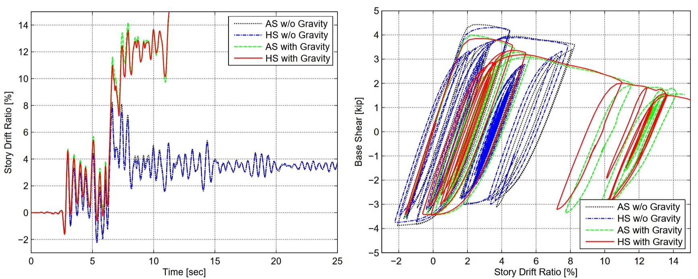

图 6.32 门式框架模型解析与混合模拟的层间位移时间历程和总层滞回环的比较。

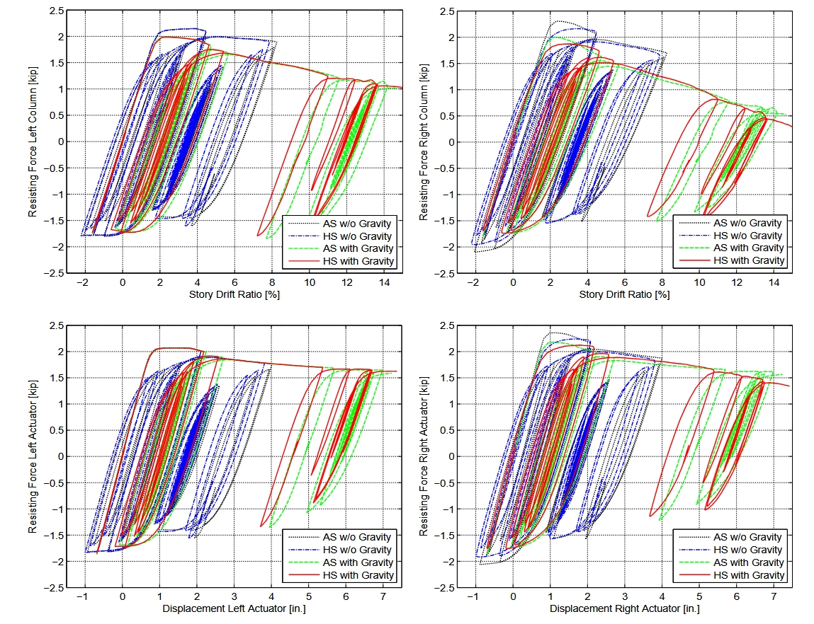  
图 6.33 门式框架模型解析与混合模拟的构件力-层间位移和执行器力-位移滞回环的比较。

然而，从图6.32到图6.33的所有图中可以观察到，无重力荷载的解析模拟明显比有重力荷载的解析模拟更准确。此外，随着门式框架接近倒塌，混合模拟与解析模拟之间的差异增加。这可以通过U形夹大转动（分别为大层间位移角）时可更换钢试样的复杂行为（严重屈曲、截面颈缩、裂纹扩展）来解释，这没有被简化的有限元试样模型准确捕捉。

尽管如此，如前所述，纯解析和混合结构的整体响应匹配非常好，这成功证明了两个模型的有效性。特别是，它证明了OpenFresco软件框架，以及新型实验梁柱构件和本文提出的其他研究，为执行准确、安全且经济有效的结构倒塌混合模拟提供了一套有用且有效的模块。

## 6.4 总结

本章讨论的混合模拟两种新应用，成功展示和验证了第3章提出的新实现的对象导向混合模拟框架的一些功能和整体灵活性。此外，第4章和第5章的几个其他独立开发和实现，如积分方法和事件驱动策略，已被成功用于执行两个具有挑战性的混合模拟案例研究。

第一个应用展示了首次以软实时执行的连续地理分布混合模拟。网络技术的最新进步（Abilene网络）与实验软件框架OpenFresco的结合，使这种实时地理分布混合模拟成为可能。此外，可以得出结论，改进的预测-校正算法和事件驱动策略成功保证了测试的连续执行，以及在网络延迟情况下实验的平滑减速和加速。

讨论了在过去几年中，实时混合模拟已经获得了相当大的重要性，因为许多新型高性能结构装置，如基础隔震支座、耗能装置和高性能材料，表现出固有的速率依赖行为。因此，得出结论，即使混合模拟是地理分布的，对包含此类装置的结构系统进行测试时以正确的加载速率进行也是至关重要的。成功证明，重新设计、扩展和新实现的实验测试软件框架提供了执行此类混合模拟的手段。

第二个案例研究介绍了一种利用混合模拟进行结构倒塌研究的新方法。证明OpenFresco软件框架提供了一套有效的模块，特别是新型实验梁柱构件，用于执行准确、安全且经济有效的结构倒塌混合模拟。此外，证明在混合模型中正确考虑二阶效应的能力对于模拟重力荷载下结构的倒塌至关重要。总之，与常规测试方法相比，结构倒塌行为的混合模拟提供了三个显著优势：（1）重力荷载和由此产生的几何非线性在混合模型的解析部分中用计算机表示，消除了对复杂主动或被动重力荷载设置的需求；（2）不需要保护昂贵的测试设备免受倒塌期间试样冲击的影响，因为执行器控制系统将限制测试试样的移动；（3）只有结构的关键的、对倒塌敏感的元素需要物理测试，允许在相同预算下大幅增加不同倒塌测试的数量。最后，再次详细讨论了门式框架结构、测试设置和程序、传动系统性能和混合模型的响应。

