# 混合仿真的先进控制方法的开发与实现

作者：Hong Ki Kim

提交的学位论文部分满足

哲学博士

学位要求

专业：工程——土木与环境工程

在

研究生部

加州大学伯克利分校

论文指导委员会主席：Bozidar Stojadinoviˇc 教授
委员：Stephen A. Mahin 教授
委员：Jon Wilkening 教授

2011 年秋季

## 版权所有

致所有用户的信息

本复制品的质量取决于所提交副本的质量。

在不太可能的情况下，作者没有发送完整的手稿并且存在缺页，这些页面将被注明。此外，如果有材料必须被移除，将会注明。


UMI 3616138

由 ProQuest LLC 于 2014 年出版。论文版权归作者所有。

微缩版 $\circledcirc$ ProQuest LLC。保留所有权利。本作品受 17 号美国法典的保护，禁止未经授权的复制。


ProQuest LLC.
789 East Eisenhower Parkway
P.O. Box 1346
Ann Arbor, MI 48106 - 1346

混合仿真的先进控制方法的开发与实现

版权所有 2011

Hong Ki Kim

## 摘要

混合仿真的先进控制方法的开发与实现

作者：Hong Ki Kim

哲学博士：工程——土木与环境工程

加州大学伯克利分校

指导教授：Bozidar Stojadinoviˇc

混合仿真是一种有效的结构测试方法，它结合了计算分析和实验测试技术的优点。创新结构由最先进的组件和组合件组成，其作为系统的功能需要通过实验进行测试。通常，这些组件和组合件会将控制器和其他测试设备推向极限。在位移控制模式下使用控制器进行混合仿真并不总是足够的。

为了克服这些限制并提供稳健的混合仿真方法，本文探索了混合仿真中的力控制、开关控制和混合控制方法。力控制混合仿真是一种控制系统处于力控制模式的混合仿真。开关控制混合仿真是控制系统在位移控制和力控制模式之间切换的另一种混合仿真。开关控制混合仿真适用于仅有一个控制自由度的设置。混合控制混合仿真是开关控制混合仿真的扩展，其中多个控制自由度独立地在控制模式之间切换。

本文开发、测试并验证了力控制、开关控制和混合控制混合仿真方法。讨论了开发这些方法的动机。提出并解释了新方法。开发了新的 OpenFresco 类和 Simulink/Stateflow 模型来实现这些方法。然后，使用 nees@berkeley 结构工程实验室的 $\mu$-NEES 实验装置，采用两种不同的配置，测试了这三种替代控制方法。第一种配置是包含一个相对较硬试件的单控制自由度设置。第二种配置在第一种配置基础上扩展为两个控制自由度。研究了各种时间积分方案与这些方法的性能。这些测试验证并确认了三种替代控制方法以及新的 OpenFresco 类和 Simulink/Stateflow 模型。

通过首先将每种控制方法的测试结果与数值结果进行比较，然后与位移控制结果进行比较，最后相互比较，来评估其性能。对于第二种 $\mu$-NEES 配置，力控制方法通常比位移控制方法提供更好的结果。对于单自由度配置，开关控制混合仿真方法提供了比其力控制对应方法更好的结果，但并不优于位移控制结果。由于两个作动器控制模式之间的相互作用，混合控制混合仿真方法并未提供比力控制方法更好的结果。

本论文最后提出了未来研究的方向。需要使用非常刚性的实验装置和深入的误差分析对这些方法进行进一步验证。需要探索新的切换参数。建议继续开发混合控制方法。应测试使用高阶多项式的 Simulink/Stateflow 模型。应为平衡力控制方法实现显式和预测-校正时间积分方案。

更重要的是，为了认识我主基督耶稣的无比价值，我将万事都视为损失。

——使徒保罗（罗马书 3:8(a) 新美国标准圣经）

## 目录

目录 ii

表格列表 vi

图形列表 viii

算法列表 xviii

符号和缩略词列表 xix

1 引言 1

1.1 混合仿真的组成部分 . . . . . . . . . . . . . . . . . . . 2   
1.1.1 计算驱动程序 . . . . . . . . . . . . . . . . . . . . 2   
1.1.2 物理传递系统 . . . . . . . . . . . . . . . . . . . . 2   
1.1.3 中间件 . . . . . . . . . . . . . . . . . . . . . . . . 3   
1.2 动机 . . . . . . . . . . . . . . . . . . . . . . . . . . . . . 3   
1.3 组织和范围 . . . . . . . . . . . . . . . . . . . . . . . . . 4

2 位移控制混合仿真 5

2.1 引言 . . . . . . . . . . . . . . . . . . . . . . . . . . . . . 5   
2.2 计算驱动程序 . . . . . . . . . . . . . . . . . . . . . . . . 5   
2.3 物理传递系统 . . . . . . . . . . . . . . . . . . . . . . . . 6   
2.4 OpenFresco 中间件混合仿真框架 . . . . . . . . . . . . . . . 8

2.4.1 双节点连接实验单元 . . . . . . . . . . . . . . . . . . 9   
2.4.2 本地实验站点 . . . . . . . . . . . . . . . . . . . . . 10   
2.4.3 单作动器实验装置 . . . . . . . . . . . . . . . . . . 1 0   
2.4.4 xPC-Target 实验控制 . . . . . . . . . . . . . . . . 1 1

2.5 DC 混合仿真的顺序过程 . . . . . . . . . . . . . . . . . . . 12   
2.6 DC 混合仿真的优点与局限性 . . . . . . . . . . . . . . . . 18

3 力控制混合仿真 19

3.1 引言 . . . . . . . . . . . . . . . . . . . . . . . . . . . . . 19

3.1.1 问题定义 . . . . . . . . . . . . . . . . . . . . . . . 19   
3.1.2 动机 . . . . . . . . . . . . . . . . . . . . . . . . . 20   
3.1.3 先前研究 . . . . . . . . . . . . . . . . . . . . . . . 23

3.2 获取试验力的方法 . . . . . . . . . . . . . . . . . . . . . . 25

3.2.1 兼容性方法 . . . . . . . . . . . . . . . . . . . . . . 2 6

3.2.1.1 基于切线的兼容性方法 . . . . . . . . . . . . 2 6   
3.2.1.2 基于Krylov子空间的兼容性方法 . . . . . . . . . . . . . . . 30

3.2.2 平衡方法 . . . . . . . . . . . . . . . . . . . . . . . 31   
3.2.3 获取试验力的方法总结 . . . . . . . . . . . . . . . . 34

3.3 实现 . . . . . . . . . . . . . . . . . . . . . . . . . . . . . 34

3.3.1 兼容性方法的实现 . . . . . . . . . . . . . . . . . . 35   
3.3.2 平衡方法的实现 . . . . . . . . . . . . . . . . . . . 3 9   
3.3.3 Simulink/Stateflow 模型 . . . . . . . . . . . . . . . 4 1   
3.3.4 OpenFresco 力实验控制 . . . . . . . . . . . . . . . 43

3.4 实验结果与验证 . . . . . . . . . . . . . . . . . . . . . . . 4 4

3.4.1 1-DOF $\mu \cdot$ -NEES 实验装置与结果 . . . . . . . . . . . 4 4

3.4.1.1 混合模型与 OpenFresco 配置 . . . . . . . . . . . 47   
3.4.1.2 线性 FC 混合仿真 . . . . . . . . . . . . . . . 4 7   
3.4.1.3 非线性 FC 混合仿真 . . . . . . . . . . . . . . . . 5 1

3.4.2 2-DOF $\mu \cdot$ -NEES 实验装置与结果 . . . . . . . . . . . 5 6

3.4.2.1 混合模型与 OpenFresco 配置 . . . . . . . . . . . 59   
3.4.2.2 线性 FC 混合仿真 . . . . . . . . . . . . . . . 6 0   
3.4.2.3 非线性 FC 混合仿真 . . . . . . . . . . . . . 6 6

3.4.3 实验结果与验证总结 . . . . . . . . . . . . . . . . . 7 4

4 开关控制混合仿真 75

4.1 引言 . . . . . . . . . . . . . . . . . . . . . . . . . . . . . 75

4.1.1 问题定义 . . . . . . . . . . . . . . . . . . . . . . . 75   
4.1.2 动机 . . . . . . . . . . . . . . . . . . . . . . . . . 76   
4.1.3 先前研究 . . . . . . . . . . . . . . . . . . . . . . . 7 7

4.2 SC 混合仿真的方法 . . . . . . . . . . . . . . . . . . . . . 77

4.2.1 基于试验力的切换策略 . . . . . . . . . . . . . . . . 78   
4.2.2 基于割线刚度的切换策略 . . . . . . . . . . . . . . . 80

4.3 实现 . . . . . . . . . . . . . . . . . . . . . . . . . . . . . 81

4.3.1 用于开关的兼容性方法 . . . . . . . . . . . . . . . . 8 1   
4.3.2 用于开关的平衡方法 . . . . . . . . . . . . . . . . . 82   
4.3.3 Simulink/Stateflow 模型 . . . . . . . . . . . . . . . 83

4.4 实验结果与验证 . . . . . . . . . . . . . . . . . . . . . . . 88

5 混合控制混合仿真 94

5.1 引言 . . . . . . . . . . . . . . . . . . . . . . . . . . . . . 94

5.1.1 问题定义 . . . . . . . . . . . . . . . . . . . . . . . 94   
5.1.2 动机 . . . . . . . . . . . . . . . . . . . . . . . . . 95   
5.1.3 先前研究 . . . . . . . . . . . . . . . . . . . . . . . 9 5

5.2 MC 混合仿真的方法 . . . . . . . . . . . . . . . . . . . . . 95

5.3 实现 . . . . . . . . . . . . . . . . . . . . . . . . . . . . . 96

5.3.1 OpenFresco MC 实验控制 . . . . . . . . . . . . . . . 96

5.3.2 Simulink/Stateflow 模型 . . . . . . . . . . . . . . . 97

5.4 实验结果与验证 . . . . . . . . . . . . . . . . . . . . . . . 102

5.4.1 基于试验力切换的 MC 混合仿真 . . . . . . . . . . . 102   
5.4.2 基于割线刚度切换的 MC 混合仿真 . . . . . . . . . . . . . 106   
5.4.3 实验结果总结 . . . . . . . . . . . . . . . . . . . . 113

6 结论 114

6.1 力控制 . . . . . . . . . . . . . . . . . . . . . . . . . . . . 114   
6.2 开关控制 . . . . . . . . . . . . . . . . . . . . . . . . . . . 115   
6.3 混合控制 . . . . . . . . . . . . . . . . . . . . . . . . . . . 115   
6.4 未来工作方向 . . . . . . . . . . . . . . . . . . . . . . . . 116

6.4.1 进一步验证 . . . . . . . . . . . . . . . . . . . . . . 116   
6.4.2 使用功率进行切换 . . . . . . . . . . . . . . . . . . 116   
6.4.3 进一步研究 MC 混合仿真 . . . . . . . . . . . . . . . 117   
6.4.4 Simulink/Stateflow 模型 . . . . . . . . . . . . . . . 118   
6.4.5 使用其他时间积分方案的 EFC 方法 . . . . . . . . . . 119   
6.4.6 总结 . . . . . . . . . . . . . . . . . . . . . . . . . 119

参考文献 120

附录 A 用于 FC、SC 和 MC 混合仿真的 OpenFresco 123

A.1 OpenFresco 软件架构 . . . . . . . . . . . . . . . . . . . . 123   
A.1.1 OpenFresco UML 类图 . . . . . . . . . . . . . . . . 124   
A.2 OpenFresco 类 . . . . . . . . . . . . . . . . . . . . . . . 127

A.2.0.1 实验单元 . . . . . . . . . . . . . . . . . . . . . 127   
A.2.0.2 实验站点 . . . . . . . . . . . . . . . . . . . . 127   
A.2.0.3 实验装置 . . . . . . . . . . . . . . . . . . . . 127   
A.2.0.4 实验控制 . . . . . . . . . . . . . . . . . . . . 128

A.3 用于力控制混合仿真的 OpenFresco 代码 . . . . . . . . . . 128

附录 B $\mu$ -NEES 实验装置的调谐 132

B.1 MTS-STS 通道 3 的调谐：底部作动器 . . . . . . . . . . . 132   
B.2 MTS-STS 通道 4 的调谐：顶部作动器 . . . . . . . . . . . 136

附录 C FC 混合仿真实验结果 138

C.1 1-DOF 设置：线性混合仿真 . . . . . . . . . . . . . . . . 138   
C.2 1-DOF 设置：非线性混合仿真 . . . . . . . . . . . . . . . 147   
C.3 2-DOF 设置：线性混合仿真 . . . . . . . . . . . . . . . . 152   
C.4 2-DOF 设置：非线性混合仿真 . . . . . . . . . . . . . . . . 170

附录 D SC 混合仿真实验结果 189

附录 E MC 混合仿真实验结果 206

E.1 点切换混合仿真 . . . . . . . . . . . . . . . . . . . . . . 206

E.1.1 NME 时间积分方案 . . . . . . . . . . . . . . . . . 206   
E.1.2 α 时间积分方案 . . . . . . . . . . . . . . . . . . . 215   
E.1.3 NMF 时间积分方案 . . . . . . . . . . . . . . . . . 224   
E.1.4 NMR 时间积分方案 . . . . . . . . . . . . . . . . . 233

E.2 割线切换混合仿真 . . . . . . . . . . . . . . . . . . . . . . 240

E.2.1 NME 时间积分方案 . . . . . . . . . . . . . . . . . . 240   
E.2.2 α 时间积分方案 . . . . . . . . . . . . . . . . . . . 249   
E.2.3 NMF 时间积分方案 . . . . . . . . . . . . . . . . . 258   
E.2.4 NMR 时间积分方案 . . . . . . . . . . . . . . . . . 267

## 表格列表

2.1 单跨框架示例的 OpenFresco 配置 . . . . . . . . . . . . . 9   
3.1 柔性和刚性单跨框架模型的属性 . . . . . . . . . . . . . . 20   
3.2 时间积分方案及其参数 . . . . . . . . . . . . . . . . . . . 47   
3.3 1-DOF $\mu$ -NEES 装置的单跨框架模型属性 . . . . . . . . . . 47   
3.4 单跨框架 OpenSees 模型线性数值模拟结果的绝对误差 . . . . . . . . . 50   
3.5 1-DOF 线性混合仿真在 FEA 层面的实验绝对位移误差 . . . . . . . . . 50   
3.6 1-DOF 线性混合仿真在 FEA 层面的实验绝对力误差 . . . . . . . . . . 51   
3.7 1-DOF 线性仿真在控制系统层面的绝对误差 . . . . . . . . . . . . . 5 1   
3.8 单跨框架 OpenSees 模型非线性数值模拟结果的绝对误差 . . . . . . . . . . 52   
3.9 1-DOF 非线性混合仿真在 FEA 层面的绝对位移误差 . . . . . . . . . 55   
3.10 1-DOF 非线性混合仿真在 FEA 层面的绝对力误差 . . . . . . . . . . 55   
3.11 1-DOF 非线性仿真在控制系统层面的绝对误差 . . . . . . . . . . . 5 6   
3.12 2-DOF $\mu$ -NEES 装置的 2-DOF 混合模型属性 . . . . . . . . . . 59   
3.13 2-DOF 设置的 OpenFresco 配置 . . . . . . . . . . . . . . . 5 9   
3.14 2-DOF OpenSees 模型线性数值模拟结果的绝对误差 . . . . . . . . . . 63   
3.15 2-DOF 线性混合仿真中节点 1 在 FEA 层面的绝对位移误差 . . . . . . . . . 63   
3.16 2-DOF 线性混合仿真中节点 2 在 FEA 层面的绝对位移误差 . . . . . . . . . 64   
3.17 2-DOF 线性混合仿真中节点 1 在 FEA 层面的绝对力误差 . . . . . . . . . 64   
3.18 2-DOF 线性混合仿真中节点 2 在 FEA 层面的绝对力误差 . . . . . . . . . 64   
3.19 2-DOF 线性仿真中底部作动器在控制系统层面的绝对误差 . . . . . . . . . 65   
3.20 2-DOF 线性仿真中顶部作动器在控制系统层面的绝对误差 . . . . . . . . . 65   
3.21 2-DOF OpenSees 模型非线性数值模拟结果的绝对误差 . . . . . . . . . 69   
3.22 2-DOF 非线性混合仿真中节点 1 在 FEA 层面的绝对位移误差 . . . . . . . . . 69   
3.23 2-DOF 非线性混合仿真中节点 2 在 FEA 层面的绝对位移误差 . . . . . . . . . 70   
3.24 2-DOF 非线性混合仿真中节点 1 在 FEA 层面的绝对力误差 . . . . . . . . . 70   
3.25 2-DOF 非线性混合仿真中节点 2 在 FEA 层面的绝对力误差 . . . . . . . . . 70   
3.26 2-DOF 非线性混合仿真中底部作动器在控制系统层面的绝对误差 . . . . . . . . . 71

3.27 2-DOF 非线性混合仿真中底部作动器在控制系统层面的绝对误差 . . . . . . . . . 71   
4.1 1-DOF 非线性 SC 混合仿真在 FEA 层面的绝对位移误差 . . . . . . . . . 89   
4.2 1-DOF 非线性 SC 混合仿真在 FEA 层面的绝对力误差 . . . . . . . . . . 90   
4.3 1-DOF 非线性 SC 混合仿真在控制系统层面的绝对误差 . . . . . . . . . . 93   
5.1 2-DOF PMC 非线性混合仿真中节点 1 在 FEA 层面的绝对位移误差 . . . . . . . . . 103   
5.2 2-DOF 非线性 PMC 混合仿真中节点 2 在 FEA 层面的绝对位移误差 . . . . . . . . . 103   
5.3 2-DOF 非线性 PMC 混合仿真中节点 1 在 FEA 层面的绝对力误差 . . . . . . . . . 103   
5.4 2-DOF 非线性 PMC 混合仿真中节点 2 在 FEA 层面的绝对力误差 . . . . . . . . . 104   
5.5 2-DOF 非线性 PMC 混合仿真中底部作动器在控制系统层面的绝对误差 . . . . . . . . . 104   
5.6 2-DOF 非线性 PMC 混合仿真中顶部作动器在控制系统层面的绝对误差 . . . . . . . . . 105   
5.7 2-DOF SMC 非线性混合仿真中节点 1 在 FEA 层面的绝对位移误差 . . . . . . . . . 106   
5.8 2-DOF 非线性 SMC 混合仿真中节点 2 在 FEA 层面的绝对位移误差 . . . . . . . . . 107   
5.9 2-DOF 非线性 SMC 混合仿真中节点 1 在 FEA 层面的绝对力误差 . . . . . . . . . 107   
5.10 2-DOF 非线性 SMC 混合仿真中节点 2 在 FEA 层面的绝对力误差 . . . . . . . . . 107   
5.11 2-DOF 非线性 SMC 混合仿真中底部作动器在控制系统层面的绝对误差 . . . . . . . . . 108   
5.12 2-DOF 非线性 SMC 混合仿真中顶部作动器在控制系统层面的绝对误差 . . . . . . . . . 108   
B.1 1-DOF 非线性仿真在控制系统层面的绝对误差 . . . . . . . . . . . 135   
B.2 1-DOF 非线性仿真在控制系统层面的绝对误差 . . . . . . . . . . . 136

## 图形列表

2.1 DC 混合仿真的单跨框架模型 . . . . . . . . . . . . . . . . . 6   
2.2 DC 混合仿真中的控制回路 . . . . . . . . . . . . . . . . . 7   
2.3 nees@berkeley 的 $\mu$ -NEES 实验装置 . . . . . . . . . . . . . 8   
2.4 OpenFresco 抽象类 . . . . . . . . . . . . . . . . . . . . . 9   
2.5 OpenFresco 双节点连接实验单元 . . . . . . . . . . . . . . . 10   
2.6 OpenFresco 单作动器实验装置 . . . . . . . . . . . . . . . . 11   
2.7 OpenFresco 单作动器实验装置变换 . . . . . . . . . . . . . . 11   
2.8 设置试验响应的 OpenFresco UML 序列图 . . . . . . . . . . 13   
2.9 获取抵抗力的 OpenFresco UML 序列图 . . . . . . . . . . . 1 4   
2.10 显示 αOS 近似的力-变形曲线 . . . . . . . . . . . . . . . 1 7   
3.1 El Centro 地震动 . . . . . . . . . . . . . . . . . . . . . . 21   
3.2 模型 1 和 2 的单元 1 试验位移-时间历程图 . . . . . . . . . . . . 21   
3.3 模型 1 和 2 的单元 1 测量力-时间历程图 . . . . . . . . . . . . 21   
3.4 兼容性方法的实现 . . . . . . . . . . . . . . . . . . . . . . 35   
3.5 ExperimentalSignalFilter 类的接口 . . . . . . . . . . . . . . 3 6   
3.6 扩展的 OpenFresco UML 类图 . . . . . . . . . . . . . . . . 37   
3.7 ExperimentalTangentStiff 类的接口 . . . . . . . . . . . . . . . . 38   
3.8 FC 混合仿真的 SimuLink 模型 . . . . . . . . . . . . . . . . 41   
3.9 xPC Target 混合控制器 (F1F1) . . . . . . . . . . . . . . . 4 2   
3.10 FC 混合仿真的 StateFlow 预测-校正模型 . . . . . . . . . . . . 43   
3.11 1-DOF $\mu$ -NEES 实验装置示意图 . . . . . . . . . . . . . . . 45   
3.12 1-DOF $\mu$ -NEES 实验装置 . . . . . . . . . . . . . . . . . . 46   
3.13 1-DOF $\mu$ -NEES 实验装置 U 形夹和试片配置 . . . . . . . . . . . . . . . 46   
3.14 使用 NMI、NME、αOS、NMF 和 NMR 对单跨框架 OpenSees 模型进行线性数值模拟的位移-时间历程结果 . . . . . . . . . . . . . . . 4 8   
3.15 使用 NMI、NME、αOS、NMF 和 NMR 对单跨框架 OpenSees 模型进行线性数值模拟的力-时间历程结果 . . . . . . . . . . . . . . . 49   
3.16 用于数值仿真的 1-DOF $\mu \cdot$ -NEES 装置的 OpenSees 模型 . . . . . . . . . 52   
3.17 使用 NMI、NMF 和 NMR 对单跨框架 OpenSees 模型进行非线性数值模拟的位移-时间历程结果 . . . . . . . . . . . . . . . . . 53   
3.18 使用 NMI、NMF 和 NMR 对单跨框架 OpenSees 模型进行非线性数值模拟的力-时间历程结果 . . . . . . . . . . . . . . . . . 54

3.19 使用 NMF 进行非线性混合仿真期间 1-DOF 装置的切线刚度估计 . . . . . . . . . . . . . . . . . . . . . . . . . . . . . 56   
3.20 2-DOF $\mu$ -NEES 实验装置示意图 . . . . . . . . . . . . . . . 5 7   
3.21 2-DOF $\mu$ -NEES 实验装置和 2-DOF 混合模型 . . . . . . . . . 5 8   
3.22 2-DOF $\mu$ -NEES 实验装置顶部 U 形夹和试片配置 . . . . . . . . . . . . . . 58   
3.23 用于数值仿真的 2-DOF OpenSees 数值模型 . . . . . . . . . . . 6 0   
3.24 使用 NMI、NME、αOS、NMF 和 NMI 对 2-DOF OpenSees 模型进行线性数值模拟的位移-时间历程结果 . . . . . . . . . . . . . . . 61   
3.25 使用 NMI、NME、αOS、NMF 和 NMI 对 2-DOF OpenSees 模型进行线性数值模拟的力-时间历程结果 . . . . . . . . . . . . . . . 6 2   
3.26 使用 NMI、NME、αOS、NMF 和 NMI 对 2-DOF OpenSees 模型进行非线性数值模拟的位移-时间历程结果 . . . . . . . . . . . . . . . 67   
3.27 使用 NMI、NME、αOS、NMF 和 NMI 对 2-DOF OpenSees 模型进行非线性数值模拟的力-时间历程结果 . . . . . . . . . . . . . . . 68   
3.28 使用 CFC:BFGS 进行非线性 2-DOF 混合仿真的切线刚度值 . . . . . . . . . . . . . . . . . 72   
3.29 使用 CFC:Intrinsic 进行非线性 2-DOF 混合仿真的切线刚度值 . . . . . . . . . . . . . . . . . 73   
4.1 高阻尼橡胶支座的滞回曲线 . . . . . . . . . . . . . . . . . 76   
4.2 SC 混合仿真组件及其过程 . . . . . . . . . . . . . . . . . . 81   
4.3 SC 的 SimuLink 模型 . . . . . . . . . . . . . . . . . . . . 84   
4.4 xPC Target 混合控制器 (S1S1) . . . . . . . . . . . . . . . 8 5   
4.5 SC 混合仿真的 StateFlow 预测-校正模型 . . . . . . . . . . . 87   
4.6 使用 NME 的 PSC 中控制模式和试验力与时间的关系图 . . . . . . . . . . . . . . . . 90   
4.7 使用 NME 的 SSC 中控制模式和割线刚度值与时间的关系图 . . . . . . . . . . . . . . . . 91   
4.8 使用 NMR 的 EPSC 中控制模式和试验力与时间的关系图 . . . . . . . . . . . . . . . . 91   
4.9 使用 NMR 的 ESSC 中控制模式和割线刚度值与时间的关系图 . . . . . . . . . . . . . . . . 91   
5.1 MC 混合仿真组件及其过程 . . . . . . . . . . . . . . . . . . 97   
5.2 MC 混合仿真的 SimuLink 模型 . . . . . . . . . . . . . . . . 9 8   
5.3 xPC Target 混合控制器 (M1M1) . . . . . . . . . . . . . . . 9 9   
5.4 MC 混合仿真的 StateFlow 预测-校正模型 . . . . . . . . . . . 101   
5.5 使用 NME 的 PMC:Broyden 中底部作动器的控制模式和试验力与时间的关系图 . . . . . . . . . . . . . . . . . . . . . . . . . . . 105   
5.6 使用 αOS 的 PMC:BFGS 中底部作动器的控制模式和试验力与时间的关系图 . . . . . . . . . . . . . . . . . . . . . . . . . . . 106   
5.7 使用 NME 的 PMC:Broyden 中底部作动器的控制模式和试验力与时间的关系图 . . . . . . . . . . . . . . . . . . . . . . . . . . . 110   
5.8 使用 αOS 的 PMC:BFGS 中底部作动器的控制模式和试验力与时间的关系图 . . . . . . . . . . . . . . . . . . . . . . . . . . . 111   
5.9 使用 αOS 的 PMC:BFGS 中底部作动器的控制模式和试验力与时间的关系图 . . . . . . . . . . . . . . . . . . . . . . . . . . . 112   
6.1 使用 NME 的功率和试验力与时间的关系图 . . . . . . . . . . 117   
6.2 提出的 MC 混合仿真方法 . . . . . . . . . . . . . . . . . . 118

A.1 OpenFresco 多层架构 . . . . . . . . . . . . . . . . . . . . 124   
A.2 DC 混合仿真的 OpenFresco 类图 . . . . . . . . . . . . . . . 125   
A.3 FC、SC 和 MC 混合仿真的 OpenFresco 类图 . . . . . . . . . 126   
A.4 ESFTangForceConverter 类定义 . . . . . . . . . . . . . . . 129   
A.5 ESFKylovForceConverter 类定义 . . . . . . . . . . . . . . . 130   
A.6 ECxPCtargetForce 类定义 . . . . . . . . . . . . . . . . . . 131   
B.1 1-DOF $\mu { \cdot }$ -NEES 实验装置的位移控制调谐 . . . . . . . . . . . 132   
B.2 1-DOF $\mu { \cdot }$ -NEES 实验装置位移误差的绝对值 . . . . . . . . . . . 133   
B.3 位移控制下 1-DOF $\mu$ -NEES 实验装置的跟踪和迟滞图 . . . . . . . . . . . . . . . 133   
B.4 1-DOF $\mu$ -NEES 实验装置的力控制调谐 . . . . . . . . . . . . 134   
B.5 1-DOF $\mu$ -NEES 实验装置力误差的绝对值 . . . . . . . . . . . 134   
B.6 力控制下 1-DOF $\mu$ -NEES 实验装置的跟踪和迟滞图 . . . . . . . . . . . . . . 135   
B.7 2-DOF $\mu { \cdot }$ -NEES 实验装置的位移控制调谐 . . . . . . . . . . . 136   
B.8 1-DOF $\mu { \cdot }$ -NEES 实验装置位移误差的绝对值 . . . . . . . . . . . 137   
B.9 位移控制下 1-DOF $\mu$ -NEES 实验装置的跟踪和迟滞图 . . . . . . . . . . . . . . 137   
C.1 使用 NME 和 1-DOF 装置进行线性 FC 混合仿真的位移和力-时间历程图 . . . . . . . . . . . . . . . . . . 139   
C.2 使用 NME 和 1-DOF 装置进行线性 DC 混合仿真的 STS 控制器指令和测量位移图 . . . . . . . . . . . . . . . . . 140   
C.3 使用 NME 和 1-DOF 装置进行线性 CFC 混合仿真的 STS 控制器指令和测量力图 . . . . . . . . . . . . . . . . . 140   
C.4 使用 αOS 和 1-DOF 装置进行线性 FC 混合仿真的位移和力-时间历程图 . . . . . . . . . . . . . . . . . . 141   
C.5 使用 αOS 和 1-DOF 装置进行线性 DC 混合仿真的 STS 控制器指令和测量位移图 . . . . . . . . . . . . . . 142   
C.6 使用 αOS 和 1-DOF 装置进行线性 CFC 混合仿真的 STS 控制器指令和测量力图 . . . . . . . . . . . . . . 142   
C.7 使用 NMF 和 1-DOF 装置进行线性 FC 混合仿真的位移和力-时间历程图 . . . . . . . . . . . . . . . . . . 143   
C.8 使用 NMF 和 1-DOF 装置进行线性 DC 混合仿真的 STS 控制器指令和测量位移图 . . . . . . . . . . . . . . 144   
C.9 使用 NMF 和 1-DOF 装置进行线性 CFC 混合仿真的 STS 控制器指令和测量力图 . . . . . . . . . . . . . . 144   
C.10 使用 NMR 和 1-DOF 装置进行线性 FC 混合仿真的位移和力-时间历程图 . . . . . . . . . . . . . . . . . . 145   
C.11 使用 NMR 和 1-DOF 装置进行线性 DC 混合仿真的 STS 控制器指令和测量位移图 . . . . . . . . . . . . . . 146   
C.12 使用 NMR 和 1-DOF 装置进行线性 CFC 混合仿真的 STS 控制器指令和测量力图 . . . . . . . . . . . . . . 146

C.13 使用 NMR 和 1-DOF 装置进行线性 EFC 混合仿真的 STS 控制器指令和测量力图 . . . . . . . . . . . . . . 147   
C.14 使用 NMF 和 1-DOF 装置进行非线性 FC 混合仿真的位移和力-时间历程图 . . . . . . . . . . . . . . . . . . 148   
C.15 使用 NMF 和 1-DOF 装置进行非线性 DC 混合仿真的 STS 控制器指令和测量位移图 . . . . . . . . . . . . . . 149   
C.16 使用 NMF 和 1-DOF 装置进行非线性 CFC 混合仿真的 STS 控制器指令和测量力图 . . . . . . . . . . . . . . 149   
C.17 使用 NMR 和 1-DOF 装置进行非线性 FC 混合仿真的位移和力-时间历程图 . . . . . . . . . . . . . . . . . . 150   
C.18 使用 NMR 和 1-DOF 装置进行非线性 DC 混合仿真的 STS 控制器指令和测量位移图 . . . . . . . . . . . . . . 151   
C.19 使用 NMR 和 1-DOF 装置进行非线性 EFC 混合仿真的 STS 控制器指令和测量力图 . . . . . . . . . . . . . . 151   
C.20 使用 NME 和 2-DOF 装置进行线性 FC 混合仿真的节点位移-时间历程图 . . . . . . . . . . . . . . . . . . 153   
C.21 使用 NME 和 2-DOF 装置进行线性 FC 混合仿真的节点力-时间历程图 . . . . . . . . . . . . . . . . . . 154   
C.22 使用 NME 和 2-DOF 装置进行线性 DC 仿真的 STS 控制器指令和测量位移图 . . . . . . . . . . . . . . 155   
C.23 使用 NME 和 2-DOF 装置进行线性 FC 仿真的 STS 控制器指令和测量力图 . . . . . . . . . . . . . . 156   
C.24 使用 αOS 和 2-DOF 装置进行线性 FC 混合仿真的位移-时间历程图 . . . . . . . . . . . . . . . . . . 157   
C.25 使用 αOS 和 2-DOF 装置进行线性 FC 混合仿真的力-时间历程图 . . . . . . . . . . . . . . . . . . 158   
C.26 使用 αOS 和 2-DOF 装置进行线性 DC 仿真的 STS 控制器指令和测量位移图 . . . . . . . . . . . . . . 159   
C.27 使用 αOS 和 2-DOF 装置进行线性 FC 仿真的 STS 控制器指令和测量力图 . . . . . . . . . . . . . . 160   
C.28 使用 NMF 和 2-DOF 装置进行线性 FC 混合仿真的节点位移-时间历程图 . . . . . . . . . . . . . . . . . . 161   
C.29 使用 NMF 和 2-DOF 装置进行线性 FC 混合仿真的节点力-时间历程图 . . . . . . . . . . . . . . . . . . 162   
C.30 使用 NMF 和 2-DOF 装置进行线性 DC 仿真的 STS 控制器指令和测量位移图 . . . . . . . . . . . . . . 163   
C.31 使用 NMF 和 2-DOF 装置进行线性 FC 仿真的 STS 控制器指令和测量力图 . . . . . . . . . . . . . . 164   
C.32 使用 NMR 和 2-DOF 装置进行线性 FC 混合仿真的节点位移-时间历程图 . . . . . . . . . . . . . . . . . . 165   
C.33 使用 NMR 和 2-DOF 装置进行线性 FC 混合仿真的节点力-时间历程图 . . . . . . . . . . . . . . . . . . 166   
C.34 使用 NMR 和 2-DOF 装置进行线性 DC 仿真的 STS 控制器指令和测量位移图 . . . . . . . . . . . . . . 167

C.35 使用 NMR 和 2-DOF 装置进行线性 FC 仿真（CFC）的 STS 控制器指令和测量力图 . . . . . . . . . . . . . . 168   
C.36 使用 NMR 和 2-DOF 装置进行线性 FC 仿真（EFC）的 STS 控制器指令和测量力图 . . . . . . . . . . . . . . 169   
C.37 使用 NME 和 2-DOF 装置进行非线性 FC 混合仿真的节点位移-时间历程图 . . . . . . . . . . . . . . . . . . 171   
C.38 使用 NME 和 2-DOF 装置进行非线性 FC 混合仿真的节点力-时间历程图 . . . . . . . . . . . . . . . . . . 172   
C.39 使用 NME 和 2-DOF 装置进行非线性 DC 仿真的 STS 控制器指令和测量位移图 . . . . . . . . . . . . . . 173   
C.40 使用 NME 和 2-DOF 装置进行非线性 FC 仿真的 STS 控制器指令和测量力图 . . . . . . . . . . . . . . 174   
C.41 使用 αOS 和 2-DOF 装置进行非线性 FC 混合仿真的位移-时间历程图 . . . . . . . . . . . . . . . . . . 175   
C.42 使用 αOS 和 2-DOF 装置进行非线性 FC 混合仿真的力-时间历程图 . . . . . . . . . . . . . . . . . . 176   
C.43 使用 αOS 和 2-DOF 装置进行非线性 DC 仿真的 STS 控制器指令和测量位移图 . . . . . . . . . . . . . . 177   
C.44 使用 αOS 和 2-DOF 装置进行非线性 FC 仿真（CFC:BFGS）的 STS 控制器指令和测量力图 . . . . . . . . . . . . . . 178   
C.45 使用 αOS 和 2-DOF 装置进行非线性 FC 仿真（CFC:Intrinsic）的 STS 控制器指令和测量力图 . . . . . . . . . . . . . . 179   
C.46 使用 NMF 和 2-DOF 装置进行非线性 FC 混合仿真的节点位移-时间历程图 . . . . . . . . . . . . . . . . . . 180   
C.47 使用 NMF 和 2-DOF 装置进行非线性 FC 混合仿真的节点力-时间历程图 . . . . . . . . . . . . . . . . . . 181   
C.48 使用 NMF 和 2-DOF 装置进行非线性 DC 仿真的 STS 控制器指令和测量位移图 . . . . . . . . . . . . . . 182   
C.49 使用 NMF 和 2-DOF 装置进行非线性 FC 仿真的 STS 控制器指令和测量力图 . . . . . . . . . . . . . . 183   
C.50 使用 NMR 和 2-DOF 装置进行非线性 FC 混合仿真的节点位移-时间历程图 . . . . . . . . . . . . . . . . . . 184   
C.51 使用 NMR 和 2-DOF 装置进行非线性 FC 混合仿真的节点力-时间历程图 . . . . . . . . . . . . . . . . . . 185   
C.52 使用 NMR 和 2-DOF 装置进行非线性 DC 仿真的 STS 控制器指令和测量位移图 . . . . . . . . . . . . . . 186   
C.53 使用 NMR 和 2-DOF 装置进行非线性 FC 仿真（CFC:BFGS）的 STS 控制器指令和测量力图 . . . . . . . . . . . . . . 187   
C.54 使用 NMR 和 2-DOF 装置进行非线性 FC 仿真（CFC:Intrinsic）的 STS 控制器指令和测量力图 . . . . . . . . . . . . . . 188   
D.1 使用 NME 和 1-DOF 装置进行非线性 SC 混合仿真的位移和力-时间历程图 . . . . . . . . . . . . . . . . . . 190

D.2 使用 NME 和 1-DOF 装置进行非线性 DC 混合仿真的 STS 控制器指令和测量位移图 . . . . . . . . . . . . . . 191   
D.3 使用 NME 和 1-DOF 装置进行非线性 PSC 混合仿真的 STS 控制器指令和测量位移图 . . . . . . . . . . . . . . 192   
D.4 使用 NME 和 1-DOF 装置进行非线性 SSC 混合仿真的 STS 控制器指令和测量位移图 . . . . . . . . . . . . . . 193   
D.5 使用 αOS 和 1-DOF 装置进行非线性 SC 混合仿真的位移和力-时间历程图 . . . . . . . . . . . . . . . . . . 194   
D.6 使用 αOS 和 1-DOF 装置进行非线性 DC 混合仿真的 STS 控制器指令和测量位移图 . . . . . . . . . . . . . . 195   
D.7 使用 αOS 和 1-DOF 装置进行非线性 PSC 混合仿真的 STS 控制器指令和测量位移图 . . . . . . . . . . . . . . 196   
D.8 使用 αOS 和 1-DOF 装置进行非线性 SSC 混合仿真的 STS 控制器指令和测量位移图 . . . . . . . . . . . . . . 197   
D.9 使用 NMF 和 1-DOF 装置进行非线性 SC 混合仿真的位移和力-时间历程图 . . . . . . . . . . . . . . . . . . 198   
D.10 使用 NMF 和 1-DOF 装置进行非线性 PSC 混合仿真的 STS 控制器指令和测量位移图 . . . . . . . . . . . . . . 199   
D.11 使用 NMF 和 1-DOF 装置进行非线性 SSC 混合仿真的 STS 控制器指令和测量位移图 . . . . . . . . . . . . . . 200   
D.12 使用 NMR 和 1-DOF 装置进行非线性 SC 混合仿真的位移和力-时间历程图 . . . . . . . . . . . . . . . . . . 201   
D.13 使用 NMR 和 1-DOF 装置进行非线性 PSC 混合仿真的 STS 控制器指令和测量位移图 . . . . . . . . . . . . . . 202   
D.14 使用 NMR 和 1-DOF 装置进行非线性 SSC 混合仿真的 STS 控制器指令和测量位移图 . . . . . . . . . . . . . . 203   
D.15 使用 NMR 和 1-DOF 装置进行非线性 EPSC 混合仿真的 STS 控制器指令和测量位移图 . . . . . . . . . . . . . . 204   
D.16 使用 NMR 和 1-DOF 装置进行非线性 ESSC 混合仿真的 STS 控制器指令和测量位移图 . . . . . . . . . . . . . . 205   
E.1 使用 NME 和 2-DOF 装置进行非线性 PMC 混合仿真的节点位移-时间历程图 . . . . . . . . . . . . . . . . . . 207   
E.2 使用 NME 和 2-DOF 装置进行非线性 PMC 混合仿真的节点力-时间历程图 . . . . . . . . . . . . . . . . . . 208   
E.3 使用 NME 和 2-DOF 装置进行非线性 PMC:Broyden 混合仿真的 STS 控制器底部作动器指令和测量位移及力图 . . . . . . . . . . . . . . . 209   
E.4 使用 NME 和 2-DOF 装置进行非线性 PMC:Broyden 混合仿真的 STS 控制器顶部作动器指令和测量位移及力图 . . . . . . . . . . . . . . . 210   
E.5 使用 NME 和 2-DOF 装置进行非线性 PMC:BFGS 混合仿真的 STS 控制器底部作动器指令和测量位移及力图 . . . . . . . . . . . . . . . 211

E.6 使用 NME 和 2-DOF 装置进行非线性 PMC:BFGS 混合仿真的 STS 控制器顶部作动器指令和测量位移及力图 . . . . . . . . . . . . . . . 212   
E.7 使用 NME 和 2-DOF 装置进行非线性 PMC:Intrinsic 混合仿真的 STS 控制器底部作动器指令和测量位移及力图 . . . . . . . . . . . . . . . 213   
E.8 使用 NME 和 2-DOF 装置进行非线性 PMC:Intrinsic 混合仿真的 STS 控制器顶部作动器指令和测量位移及力图 . . . . . . . . . . . . . . . 214   
E.9 使用 αOS 和 2-DOF 装置进行非线性 PMC 混合仿真的节点位移-时间历程图 . . . . . . . . . . . . . . . . . . 216   
E.10 使用 αOS 和 2-DOF 装置进行非线性 PMC 混合仿真的节点力-时间历程图 . . . . . . . . . . . . . . . . . . 217   
E.11 使用 αOS 和 2-DOF 装置进行非线性 PMC:Broyden 混合仿真的 STS 控制器底部作动器指令和测量位移及力图 . . . . . . . . . . . . . . . 218   
E.12 使用 αOS 和 2-DOF 装置进行非线性 PMC:Broyden 混合仿真的 STS 控制器顶部作动器指令和测量位移及力图 . . . . . . . . . . . . . . . 219   
E.13 使用 αOS 和 2-DOF 装置进行非线性 PMC:BFGS 混合仿真的 STS 控制器底部作动器指令和测量位移及力图 . . . . . . . . . . . . . . . 220   
E.14 使用 αOS 和 2-DOF 装置进行非线性 PMC:BFGS 混合仿真的 STS 控制器顶部作动器指令和测量位移及力图 . . . . . . . . . . . . . . . 221   
E.15 使用 αOS 和 2-DOF 装置进行非线性 PMC:Intrinsic 混合仿真的 STS 控制器底部作动器指令和测量位移及力图 . . . . . . . . . . . . . . . 222   
E.16 使用 αOS 和 2-DOF 装置进行非线性 PMC:Intrinsic 混合仿真的 STS 控制器顶部作动器指令和测量位移及力图 . . . . . . . . . . . . . . . 223   
E.17 使用 NMF 和 2-DOF 装置进行非线性 PMC 混合仿真的节点位移-时间历程图 . . . . . . . . . . . . . . . . . . 225   
E.18 使用 NMF 和 2-DOF 装置进行非线性 PMC 混合仿真的节点力-时间历程图 . . . . . . . . . . . . . . . . . . 226   
E.19 使用 NMF 和 2-DOF 装置进行非线性 PMC:Broyden 混合仿真的 STS 控制器底部作动器指令和测量位移及力图 . . . . . . . . . . . . . . . 227   
E.20 使用 NMF 和 2-DOF 装置进行非线性 PMC:Broyden 混合仿真的 STS 控制器顶部作动器指令和测量位移及力图 . . . . . . . . . . . . . . . 228   
E.21 使用 NMF 和 2-DOF 装置进行非线性 PMC:BFGS 混合仿真的 STS 控制器底部作动器指令和测量位移及力图 . . . . . . . . . . . . . . . 229   
E.22 使用 NMF 和 2-DOF 装置进行非线性 PMC:BFGS 混合仿真的 STS 控制器顶部作动器指令和测量位移及力图 . . . . . . . . . . . . . . . 230   
E.23 使用 NMF 和 2-DOF 装置进行非线性 PMC:Intrinsic 混合仿真的 STS 控制器底部作动器指令和测量位移及力图 . . . . . . . . . . . . . . . 231   
E.24 使用 NMF 和 2-DOF 装置进行非线性 PMC:Intrinsic 混合仿真的 STS 控制器顶部作动器指令和测量位移及力图 . . . . . . . . . . . . . . . 232

E.25 使用 NMR 和 2-DOF 装置进行非线性 PMC 混合仿真的节点位移-时间历程图 . . . . . . . . . . . . . . . . . . 234   
E.26 使用 NMR 和 2-DOF 装置进行非线性 PMC 混合仿真的节点力-时间历程图 . . . . . . . . . . . . . . . . . . 235   
E.27 使用 NMR 和 2-DOF 装置进行非线性 PMC:BFGS 混合仿真的 STS 控制器底部作动器指令和测量位移及力图 . . . . . . . . . . . . . . . 236   
E.28 使用 NMR 和 2-DOF 装置进行非线性 PMC:BFGS 混合仿真的 STS 控制器顶部作动器指令和测量位移及力图 . . . . . . . . . . . . . . . 237   
E.29 使用 NMR 和 2-DOF 装置进行非线性 PMC:Intrinsic 混合仿真的 STS 控制器底部作动器指令和测量位移及力图 . . . . . . . . . . . . . . . 238   
E.30 使用 NMR 和 2-DOF 装置进行非线性 PMC:Intrinsic 混合仿真的 STS 控制器顶部作动器指令和测量位移及力图 . . . . . . . . . . . . . . . 239   
E.31 使用 NME 和 2-DOF 装置进行非线性 SMC 混合仿真的节点位移-时间历程图 . . . . . . . . . . . . . . . . . . 241   
E.32 使用 NME 和 2-DOF 装置进行非线性 SMC 混合仿真的节点力-时间历程图 . . . . . . . . . . . . . . . . . . 242   
E.33 使用 NME 和 2-DOF 装置进行非线性 SMC:Broyden 混合仿真的 STS 控制器底部作动器指令和测量位移及力图 . . . . . . . . . . . . . . . 243   
E.34 使用 NME 和 2-DOF 装置进行非线性 SMC:Broyden 混合仿真的 STS 控制器顶部作动器指令和测量位移及力图 . . . . . . . . . . . . . . . 244   
E.35 使用 NME 和 2-DOF 装置进行非线性 SMC:BFGS 混合仿真的 STS 控制器底部作动器指令和测量位移及力图 . . . . . . . . . . . . . . . 245   
E.36 使用 NME 和 2-DOF 装置进行非线性 SMC:BFGS 混合仿真的 STS 控制器顶部作动器指令和测量位移及力图 . . . . . . . . . . . . . . . 246   
E.37 使用 NME 和 2-DOF 装置进行非线性 SMC:Intrinsic 混合仿真的 STS 控制器底部作动器指令和测量位移及力图 . . . . . . . . . . . . . . . 247   
E.38 使用 NME 和 2-DOF 装置进行非线性 SMC:Intrinsic 混合仿真的 STS 控制器顶部作动器指令和测量位移及力图 . . . . . . . . . . . . . . . 248   
E.39 使用 αOS 和 2-DOF 装置进行非线性 SMC 混合仿真的节点位移-时间历程图 . . . . . . . . . . . . . . . . . . 250   
E.40 使用 αOS 和 2-DOF 装置进行非线性 SMC 混合仿真的节点力-时间历程图 . . . . . . . . . . . . . . . . . . 251   
E.41 使用 αOS 和 2-DOF 装置进行非线性 SMC:Broyden 混合仿真的 STS 控制器底部作动器指令和测量位移及力图 . . . . . . . . . . . . . . . 252   
E.42 使用 αOS 和 2-DOF 装置进行非线性 SMC:Broyden 混合仿真的 STS 控制器顶部作动器指令和测量位移及力图 . . . . . . . . . . . . . . . 253   
E.43 使用 αOS 和 2-DOF 装置进行非线性 SMC:BFGS 混合仿真的 STS 控制器底部作动器指令和测量位移及力图 . . . . . . . . . . . . . . . 254

E.44 使用 αOS 和 2-DOF 装置进行非线性 SMC:BFGS 混合仿真的 STS 控制器顶部作动器指令和测量位移及力图 . . . . . . . . . . . . . . . 255   
E.45 使用 αOS 和 2-DOF 装置进行非线性 SMC:Intrinsic 混合仿真的 STS 控制器底部作动器指令和测量位移及力图 . . . . . . . . . . . . . . . 256   
E.46 使用 αOS 和 2-DOF 装置进行非线性 SMC:Intrinsic 混合仿真的 STS 控制器顶部作动器指令和测量位移及力图 . . . . . . . . . . . . . . . 257   
E.47 使用 NMF 和 2-DOF 装置进行非线性 SMC 混合仿真的节点位移-时间历程图 . . . . . . . . . . . . . . . . . . 259   
E.48 使用 NMF 和 2-DOF 装置进行非线性 SMC 混合仿真的节点力-时间历程图 . . . . . . . . . . . . . . . . . . 260   
E.49 使用 NMF 和 2-DOF 装置进行非线性 SMC:Broyden 混合仿真的 STS 控制器底部作动器指令和测量位移及力图 . . . . . . . . . . . . . . . 261   
E.50 使用 NMF 和 2-DOF 装置进行非线性 SMC:Broyden 混合仿真的 STS 控制器顶部作动器指令和测量位移及力图 . . . . . . . . . . . . . . . 262   
E.51 使用 NMF 和 2-DOF 装置进行非线性 SMC:BFGS 混合仿真的 STS 控制器底部作动器指令和测量位移及力图 . . . . . . . . . . . . . . . 263   
E.52 使用 NMF 和 2-DOF 装置进行非线性 SMC:BFGS 混合仿真的 STS 控制器顶部作动器指令和测量位移及力图 . . . . . . . . . . . . . . . 264   
E.53 使用 NMF 和 2-DOF 装置进行非线性 SMC:Intrinsic 混合仿真的 STS 控制器底部作动器指令和测量位移及力图 . . . . . . . . . . . . . . . 265   
E.54 使用 NMF 和 2-DOF 装置进行非线性 SMC:Intrinsic 混合仿真的 STS 控制器顶部作动器指令和测量位移及力图 . . . . . . . . . . . . . . . 266   
E.55 使用 NMR 和 2-DOF 装置进行非线性 SMC 混合仿真的节点位移-时间历程图 . . . . . . . . . . . . . . . . . . 268   
E.56 使用 NMR 和 2-DOF 装置进行非线性 SMC 混合仿真的节点力-时间历程图 . . . . . . . . . . . . . . . . . . 269   
E.57 使用 NMR 和 2-DOF 装置进行非线性 SMC:Broyden 混合仿真的 STS 控制器底部作动器指令和测量位移及力图 . . . . . . . . . . . . . . . 270   
E.58 使用 NMR 和 2-DOF 装置进行非线性 SMC:Broyden 混合仿真的 STS 控制器顶部作动器指令和测量位移及力图 . . . . . . . . . . . . . . . 271   
E.59 使用 NMR 和 2-DOF 装置进行非线性 SMC:BFGS 混合仿真的 STS 控制器底部作动器指令和测量位移及力图 . . . . . . . . . . . . . . . 272   
E.60 使用 NMR 和 2-DOF 装置进行非线性 SMC:BFGS 混合仿真的 STS 控制器顶部作动器指令和测量位移及力图 . . . . . . . . . . . . . . . 273   
E.61 使用 NMR 和 2-DOF 装置进行非线性 SMC:Intrinsic 混合仿真的 STS 控制器底部作动器指令和测量位移及力图 . . . . . . . . . . . . . . . 274

E.62 使用 NMR 和 2-DOF 装置进行非线性 SMC:Intrinsic 混合仿真的 STS 控制器顶部作动器指令和测量位移及力图 . . . . . . . . . . . . . . . 275

## 算法列表

3.1 隐式 FC 算法 . . . . . . . . . . . . . . . . . . . . . . . . 25   
3.2 BFGS 方法 . . . . . . . . . . . . . . . . . . . . . . . . . . 28   
4.1 Elkhoraibi 和 Mosalam [7] 在时间步 n 的模式切换算法 . . . . . . . . . . . . . . . . 77   
4.2 时间步 n 处软化试件的力限制切换策略 . . . . . . . . . . . . . . . 7 9   
4.3 时间步 n 处软化试件的力限制切换策略 . . . . . . . . . . . . . . 79   
4.4 时间步 n 处的割线限制切换策略 . . . . . . . . . . . . . . . 80

## 符号和缩略词列表

本论文使用以下符号和缩略词：

FEA $=$ 有限元分析

DOF $=$ 自由度

DOFs $=$ 多个自由度

DAQ $=$ 数据采集系统

PID 控制器 $=$ 比例积分微分控制器

LVDT $=$ 线性可变差动变压器

LC $=$ 载荷传感器

NEES $=$ George E. Brown, Jr. 地震工程模拟网络

nees $@$ berkeley $=$ 加州大学伯克利分校 NEES 结构工程实验室

MTS-STS $=$ MTS-结构测试软件

OpenFresco $=$ 实验装置与控制的开源框架

OpenSEES $=$ 地震工程模拟开源系统

API $=$ 应用程序接口

SCRAMNet $=$ 共享公共随机存取存储器网络

UML $=$ 统一建模语言

M = 质量矩阵

C = 粘性阻尼矩阵

K = 刚度矩阵

$\mathbf { K } _ { t }$ = 切线刚度矩阵

$\mathbf { K } _ { 0 }$ = 初始刚度矩阵

$k$ = 刚度

$k _ { t }$ = 切线刚度

$k _ { 0 }$ = 初始刚度

HHT $=$ Hiber-Hughes-Talyor

$u _ { i }$ = 时间步 i 处的节点位移

$\mathbf { u } _ { i }$ = 时间步 i 处的节点位移向量

$\dot { u } _ { i }$ = 时间步 i 处的节点速度

$\dot { \mathbf { u } } _ { i }$ = 时间步 i 处的节点速度向量

$\ddot { u } _ { i }$ = 时间步 i 处的节点加速度

$\ddot { \mathbf { u } } _ { i }$ = 时间步 i 处的节点加速度向量

$\ddot { u } _ { g }$ = 记录的地面加速度

$\mathbf { f } _ { i }$ = 时间步 i 处的节点荷载向量

$r ( u _ { i } )$ 或 r = 作为 $u _ { i }$ 函数的节点抵抗力

$\mathbf { r } ( \mathbf { u } _ { i } )$ 或 r = 作为 $\mathbf { u } _ { i }$ 函数的节点抵抗力向量

$\hat { r } ( \hat { u } _ { i } )$ 或 $\hat { r }$ = 作为 $\hat { u } _ { i }$ 函数的单元抵抗力

$\hat { \mathbf { r } } ( \hat { \mathbf { u } } _ { i } )$ 或 $\hat{\mathbf{r}}$ = 作为 $\hat { \mathbf { u } } _ { i }$ 函数的单元抵抗力向量

$\tilde { u } _ { i }$ = 时间步 i 处的节点预测位移

$\tilde { \mathbf { u } } _ { i }$ = 时间步 i 处的节点预测位移向量

$\begin{array} { r l } { \tilde { \dot { u } } _ { i } } & { { } = } \end{array}$ $\tilde { \dot { u } } _ { i }$ 时间步 i 处的节点预测速度

$\tilde { \dot { \mathbf { u } } } _ { i }$ = 时间步 i 处的节点预测速度向量

$\hat { u } _ { i }$ = 时间步 i 处实验单元坐标系中的试验位移

$\hat{\mathbf{u}} _ { i }$ = 时间步 i 处实验单元坐标系中的试验位移向量

$\hat{f}_i$ = 时间步 i 处实验单元坐标系中的试验力

$\hat{\mathbf{f}}_i$ = 时间步 i 处实验单元坐标系中的试验力向量

$\breve { u } _ { i }$ = 时间步 i 处作动器坐标系中的试验位移

$\breve { \mathbf { u } } _ { i }$ = 时间步 i 处作动器坐标系中的试验位移向量

$\begin{array} { r l } { \breve { f } _ { i } } & { { } = } \end{array}$ 时间步 i 处作动器坐标系中的试验力

$\breve{\mathbf{f}}_i$ = 时间步 i 处作动器坐标系中的试验力向量

${ { \bar { u } } _ { i } }$ = 时间步 i 处作动器坐标系中的测量位移

$\bar { \mathbf { u } } _ { i }$ = 时间步 i 处作动器坐标系中的测量位移向量

$\bar { \dot { u } } _ { i }$ = 时间步 i 处作动器坐标系中的测量位移

$\bar{\dot{\mathbf{u}}}_i$ = 时间步 i 处作动器坐标系中的测量位移向量

$\bar { i } _ { i }$ = 时间步 i 处作动器坐标系中的测量位移

$\bar{\ddot{\mathbf{u}}}_i$ = 时间步 i 处作动器坐标系中的测量位移向量

$\bar{f}_i$ = 时间步 i 处作动器坐标系中的测量抵抗力

$\bar{\mathbf{f}}_i$ = 时间步 i 处作动器坐标系中的测量抵抗力向量

$\check{u}_i$ = 时间步 i 处实验单元坐标系中的测量位移

$\check{\mathbf{u}}_i$ = 时间步 i 处实验单元坐标系中的测量位移向量

$\begin{array} { r l } { \check { f } _ { i } } & { { } = } \end{array}$ 时间步 i 处实验单元坐标系中的测量抵抗力

$\check{\mathbf{f}}_i$ = 时间步 i 处实验单元坐标系中的测量抵抗力向量

$r ( \tilde { u } _ { i } )$ = 时间步 i 处的节点测量抵抗力

$\mathbf { r } ( \widetilde { \mathbf { u } } _ { i } )$ = 时间步 i 处的节点测量抵抗力向量

EFT $=$ 有效力测试

ODE $=$ 常微分方程

DC $=$ 位移控制

CFC $=$ 兼容性力控制

EFC $=$ 平衡力控制

NME $=$ Newmark 显式时间积分方案

NMR $=$ Newmark 减缩增量时间积分方案

NMF $=$ Newmark 固定迭代时间积分方案

αOS $=$ α 算子分裂时间积分方案

## 致谢

首先也是最重要的，我感谢我的主耶稣基督，通过他一切成为可能。我真是个有福的人。

我感谢我的妻子 Tami Kim。她从始至终支持我这项事业。在我低谷时鼓励我，在我高光时与我同乐。没有她的支持和祈祷，我无法完成学业。我的孩子 Evie 和 Caleb 也用他们无数的微笑、拥抱和亲吻鼓励了我。

我向我的导师 Bozidar Stojadinoviˇc 教授表达最深切的感谢。他给予我进行研究的灵感和支持。他在为学生提供指导和自由之间拥有罕见的平衡。能与最优秀的人一起工作是我的荣幸。

Stephen A. Mahin 教授和 Gregory L. Fenves 院长在我研究生学习早期就建议我进入混合仿真这一领域。他们都是一流的学者。我感谢他们的指导和远见。我要感谢 Jon Wilkening、Khalid M. Mosalam 教授以及 Horst D. Simon 博士参与我的资格考试委员会。他们为我提供了宝贵的指导。其中，特别感谢 Stephen A. Mahin 教授和 Jon Wilkening 教授同意担任我的论文指导委员会委员。

没有我的研究生同学和朋友们的帮助和陪伴，我无法完成博士学业。我深感 Andreas Schellenberg 博士的恩惠，他对结构工程的热情具有感染力。他在每一个环节都帮助我，并向我伸出友谊之手。Tony Yang 教授以他的学术勤奋和热情激励了我。John-Michael Wong 博士和 Matthew Dryden 博士是我在基督里的好兄弟。我感谢他们在整个学习过程中对我的祈祷和建议。

特别感谢 nees@berkeley 实验室的工作人员。没有他们的支持，我无法完成我的实验。Selim Gunay 博士无数次重新安排他的日程来帮助我完成实验。他也是我的好朋友。最后但同样重要的是，Shakhzod Takhirov 博士和 Donald Patterson 在我需要实验室设备帮助时总是在那里。

# 第 1 章 引言

预测结构（如建筑物和桥梁）在动力荷载尤其是地震荷载作用下的行为，仍然是结构工程中的一个挑战。研究人员采用各种方法来研究结构在此类荷载条件下的行为。最常用的方法是通过计算机软件进行模拟。当今的结构计算机分析应用程序比以往任何时候都更强大，计算机的处理能力也在持续增长。这些因素使工程师能够在相对较短的时间内分析更大、更复杂的模型。然而，分析结果的可靠性取决于模型的准确性。当结构包含高度非线性的结构构件或子装配件时，计算模拟可能无法产生真实的结果。在这些情况下，使用动力测试方法（如振动台测试方法）对结构进行实验测试，可以更准确地预测其行为。振动台测试不像计算模拟那样普遍进行，因为它们昂贵且耗时。振动台模型通常要缩小尺寸以适应台面，因此尺寸、缩尺率和速率效应成为问题。

混合仿真因其将计算机模拟与实验测试相结合而日益普及。一个结构被划分为两个不同的部分。一部分是结构中被很好理解或可以在结构分析软件包中良好建模的部分。另一部分则由无法使用计算机程序良好模拟的部分组成。因此，这些部分的结构需要进行实验测试。计算部分与实验部分相互作用，以产生结构在动力荷载下更真实的模拟。除了模拟结果之外，使用混合仿真还有许多好处。它利用了结构分析软件和计算能力的最新进展。此外，它不像振动台测试那样昂贵或需要那么多设备和资源。因此，不难理解为什么研究人员更喜欢混合仿真。

混合仿真由 Takanashi 等人 [27] 于 1975 年构想。Mahin 和 Nakashima 从 80 年代初开始进一步开创了该方法。它当时被称为拟动力测试，因为只考虑了试件的恢复力，而其他率相关效应则没有考虑。在 80 年代末，Shing 和 Mahin [23, 24] 研究了误差和试件加载速率对拟动力测试结果的影响。Nakashima 等人 [16] 于 1990 年开发了用于拟动力测试的算子分裂（OS）时间积分方案，以最大限度地减少误差。这是当今混合仿真中使用最广泛的时间积分方案。在此期间，研究人员进行了许多成功的拟动力测试。

混合仿真仍然是结构工程和地震工程中一个活跃的研究领域。一些研究人员正在研究快速或“实时”混合仿真 [25]，其中不仅要考虑试件的恢复力，还要考虑惯性力和传递系统的影响。其他人正在探索改进 OS 时间积分方案 [1, 6, 10] 并开发全新的时间积分算法。一些人在研究不同的控制方法，如力控制、开关 [7] 和混合控制 [18]。开发用于执行混合仿真的系统性可定制软件框架 [26] 是另一个研究领域。事实上，混合仿真中仍然存在许多需要解决的挑战。

## 1.1 混合仿真的组成部分

混合仿真包含三个主要部分。对这些部分的解释提供了良好的混合仿真介绍和入门知识。这三个部分是计算驱动程序、物理传递系统和中间件。

### 1.1.1 计算驱动程序

在混合仿真过程中，结构的分析部分在计算驱动程序中进行建模。这是结构中行为相对较好理解且可以使用计算机软件良好模拟的部分。该组件在多个方面驱动混合仿真。它首先启动仿真。然后在仿真期间，它将命令信号发送到传递系统，并且可以根据积分方案使用反馈与否，将仿真推进到下一个积分时间步。仿真结束后，它清理进程并关闭通信。

计算驱动程序实际上可以有多种形式。通常使用商业有限元分析（FEA）软件。FEA 软件必须足够灵活，以便可以对新的用户定义单元进行编程，并且该用户定义单元必须能够与外部程序通信。在本论文中，OpenSees 被用作 FEA 计算驱动程序。计算驱动程序不限于 FEA 程序。例如，Matlab 和基于 Matlab 的程序也可以用作计算驱动程序。基于 Matlab 的混合仿真程序 UI-SimCor [14] 已成功用作计算驱动程序 [21]。在本论文中，运行简单基于力的结构分析的 Matlab 脚本也被用作计算驱动程序。只要一种语言能够执行或协调结构分析并与外部程序通信，它就可以用作混合仿真中的计算驱动程序。计算驱动程序是混合仿真的关键必要组件。

### 1.1.2 物理传递系统

传递系统用于将来自计算驱动程序的命令信号施加到结构的物理部分。本论文中考虑的命令信号是位移和力。然后它将测得的反馈（位移和力）发送回计算驱动程序。一个典型的传递系统包括一个控制系统、数据采集（DAQ）系统和一个包括被测试件在内的物理实验装置。

控制系统通常具有硬件和软件组件。软件组件是硬件组件的图形用户界面。通常，PID 控制器用于控制混合仿真的作动器。DAQ 系统用于在测试过程中收集数据。它使用各种设备，如载荷传感器、线性可变差动变压器（LVDT）和加速度计。它也有类似控制系统的硬件和软件组件。实验装置通常包括载荷边界元件、作动器和 DAQ 设备。

试件被制造出来代表结构中无法在计算驱动程序中良好建模的部分。它可能是一个复杂的非线性子结构单元。它可能是一个新的创新结构构件，其计算机模型从未被验证过。无论哪种情况，都需要物理试件来提供结构构件更真实的行为。本论文中使用的传递系统的详细信息在附录 B 中提供。

### 1.1.3 中间件

混合仿真需要一个组件来协调计算驱动程序和传递系统之间的交互。这称为中间件。该中间件通常是为每个混合仿真实验和测试实验室定制编程的计算机程序。这使得研究人员难以协作和移植他人已经完成的工作。这是开发 OpenFresco 的动力。OpenFresco 是用于混合仿真的透明可扩展软件框架。附录 A 提供了关于 OpenFresco 的更多信息。本论文中使用 OpenFresco 作为中间件。

## 1.2 动机

本研究的动机是扩展混合仿真技术，希望混合仿真能继续成为一种有效的结构测试方法。用计算机软件模拟结构的能力对结构工程师非常重要。一些结构和结构构件无法仅使用数值模型进行良好模拟。这些构件需要进行实验测试。因此，使用混合仿真。

当前混合仿真的需求源于控制系统的局限性。在混合仿真过程中，控制器常常被推到极限。通常在控制系统处于位移控制模式下进行混合仿真。这在许多情况下会产生良好的结果并且相当有效。然而，有些试件仅靠位移控制模式是不够的。控制系统难以准确地施加指令位移。这导致测试无法提供可靠的结果，并浪费了大量时间、金钱和精力。随着结构构件和组合件变得越来越复杂，这个问题可能比以往任何时候都更常见。因此，为混合仿真探索其他控制模式，不仅是为了满足当前需求，也是为了预测未来的需求，并在概念上完善混合仿真的形成。

## 1.3 组织和范围

本论文分为六个主要章节。第 1 章对论文进行了总体介绍。它概述了混合仿真和进一步研究的动机。第 2 章解释了位移控制混合仿真。本章未提出新的研究。第 2 章为其余章节提供了背景。它解释了混合仿真通常如何执行，以及后续章节中的其他类型的混合仿真与位移控制混合仿真有何不同。

接下来的三章分别涵盖力控制、开关控制和混合控制混合仿真。每种类型各有一章专门介绍。这些章明确定义了所使用的术语。然后它们提出了动机，开发了方法，并通过混合仿真测试验证了这些方法。OpenFresco、$\mu$-NEES 实验装置、MTS-STS 控制器和 xPC-Target 实时操作系统被用于测试。在实现和测试这些方法的过程中，在 OpenFresco 中开发了一个新类。最后，最后一章总结了本论文并给出了未来研究的建议。

# 第 2 章 位移控制混合仿真

本章描述和解释位移控制（DC）混合仿真，作为后续章节提出的不同类型混合仿真的背景。它定义了 DC 混合仿真。介绍了 DC 混合仿真的必要组成部分。解释了这些组成部分之间的相互作用。本章展示了 DC 混合仿真中一个积分时间步内通常发生的过程顺序。使用一个简单的单跨框架示例来说明本章提出的概念。最后总结了 DC 混合仿真的一些优点和局限性。

## 2.1 引言

DC 混合仿真是一种混合仿真类型，其中控制系统通过作动器等加载方式将位移施加到物理试件上。因此，“DC”指的是控制系统的控制模式。混合仿真通常以这种方式运行。这有助于实现相对透明和稳定的混合仿真运行，至少有两个原因。首先，大多数有限元分析（FEA）程序使用基于位移的公式。因此，施加到试件上的位移很容易获得。其次，控制系统通常设计为在 DC 模式下运行良好。因此，位移施加稳定且充分。

## 2.2 计算驱动程序

如第 1 章所述，在混合仿真过程中，结构的分析部分在计算驱动程序中数值建模和分析。在 DC 混合仿真期间，计算驱动程序向控制系统发送试验位移以施加到试件上。计算驱动程序可能会使用也可能不会使用来自控制系统的反馈值来推进到下一个时间步。这取决于为仿真部署的时间积分方案的类型。当使用反馈时，通常使用力反馈而不是位移反馈。

在单跨框架示例中，模型由两个柱（单元 1 和 2）和一个弹簧（单元 3）连接组成，如图 2.1 所示。每个柱的顶部放置一个集中质量。两个柱的底部是固定的。柱在轴向是刚性的，顶部可以自由旋转。旋转自由度被凝聚掉，只留下自由度 1 和 2。单元 2 和 3 与质量和阻尼一起在 FEA 软件中建模。为有限元分析选择时间积分方案和地震动。显式和预测-校正时间积分方法优于隐式方法，因为隐式方法的迭代性质。在依赖于路径的物理试件上进行迭代可能会在混合仿真中产生不切实际的结果。对于此示例，选择 αOS（算子分裂）时间积分方案。

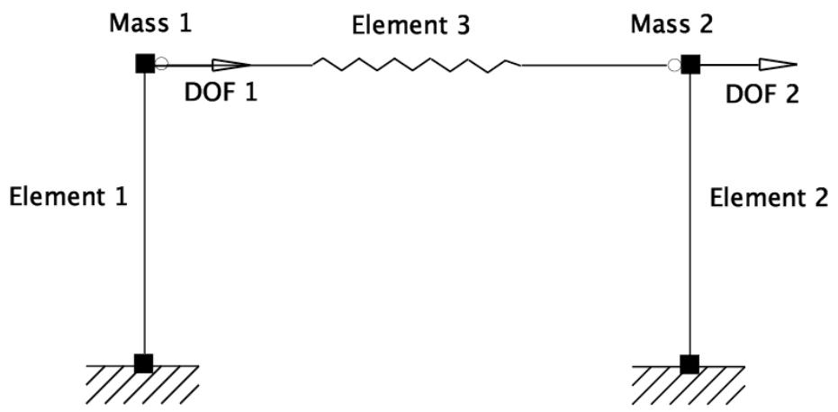  
图 2.1：单跨框架模型。

## 2.3 物理传递系统

在 DC 混合仿真中，物理传递系统的作用是将计算驱动程序的试验位移施加到物理试件上。然后它将测量的反馈（位移和力）发送回计算驱动程序。一个典型的物理传递系统包括一个控制系统、数据采集（DAQ）系统以及包括被测试件在内的物理实验装置。测试试件代表结构中无法在计算驱动程序中良好建模的部分。

控制系统通常采用 PID 控制器来控制 DC 混合仿真的作动器，如图 2.2 所示。需要注意的是，积分器回路（Integrator Loop）的时钟速度与伺服控制回路（Servo-Control Loop）不同。伺服控制回路以固定的时钟速度运行，而积分器回路的时钟速度则根据给定时间步分析的复杂性而变化。控制系统的作用是弥合两个时钟速度之间的差距。

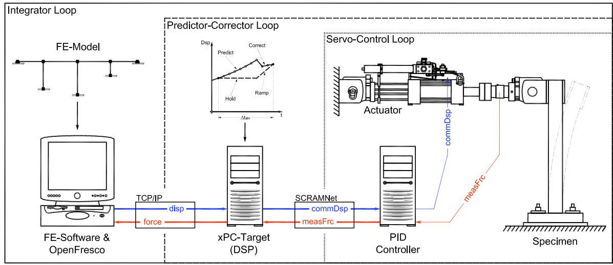  
图 2.2：控制系统中用于 DC 混合仿真的控制回路。

克服这一困难的一种常见方法是让控制系统在收到下一个试验位移之前，对试验位移进行斜坡保持。虽然这种方法解决了问题，但它有一些缺点。一个主要缺点发生在控制系统在计算驱动程序计算下一个指令位移时长时间保持试验位移。由于试件的率相关特性和试件内部的应力松弛，这对结果产生了不利影响。斜坡时间也需要设置得当，以便控制系统有足够的时间以稳定的方式达到试验位移。同时，它不能太长以至于在收到下一个试验位移之前从未达到试验位移。

为了克服与斜坡保持方法相关的问题，Mosequeda [15] 开发并实施了一系列事件驱动的预测-校正方法。这是一个两阶段方法。它在斜坡保持方法保持先前指令位移的地方预测下一个试验位移，并在斜坡保持方法斜坡上升到新试验位移的地方进行校正以达到新的试验位移。它使用先前试验位移以及计算出的速度和加速度的外推多项式进行预测。如果计算驱动程序花费相对较长的时间来发送下一个试验位移，此方法最终会保持最后计算出的预测位移，以避免不切实际的预测。

当从计算驱动程序收到下一个试验位移时，此方法使用先前试验位移、计算出的速度和加速度以及新试验位移构成的插值多项式进行校正以达到新的试验位移。使用 0、1、2 和 3 次多项式的组合实现了不同的预测-校正方法。避免使用更高次多项式，因为它们会产生不必要的振荡，并且需要太多的历史数据。在卸载时，那么长的历史是无关紧要的。预测-校正方法提供了平滑连续的作动器运动，这对于混合仿真是理想的。在 nees@berkeley 实验室，这些预测-校正方法是使用 Mathworks Simulink 和 Stateflow 模型结合 xPC 实时操作系统实现的。关于 nees@berkeley 实验室的更多信息可以在附录 B 中找到。

DAQ 系统在测试过程中收集和记录数据。载荷传感器（LC）和线性可变差动变压器（LVDT）分别测量力和位移。这些测量到的力和位移可以反馈给计算驱动程序。这些测量值位于作动器坐标系中，需要转换到单元坐标系才能被反馈。最后，实验装置通常包括载荷边界元件、作动器和 DAQ 设备。

在单跨框架示例中，单元 1 使用试件进行物理测试。使用 nees@berkeley 的 $\mu$-NEES 实验装置（图 2.3）。关于 $\mu$-NEES 实验装置和实验室的更多信息可以在附录 B 中找到。底部带有 U 形夹、顶部带有作动器的一个柱子是该示例的物理试件。xPC 实时操作系统与带有预测-校正方法的 MTS-STS 控制器一起使用。

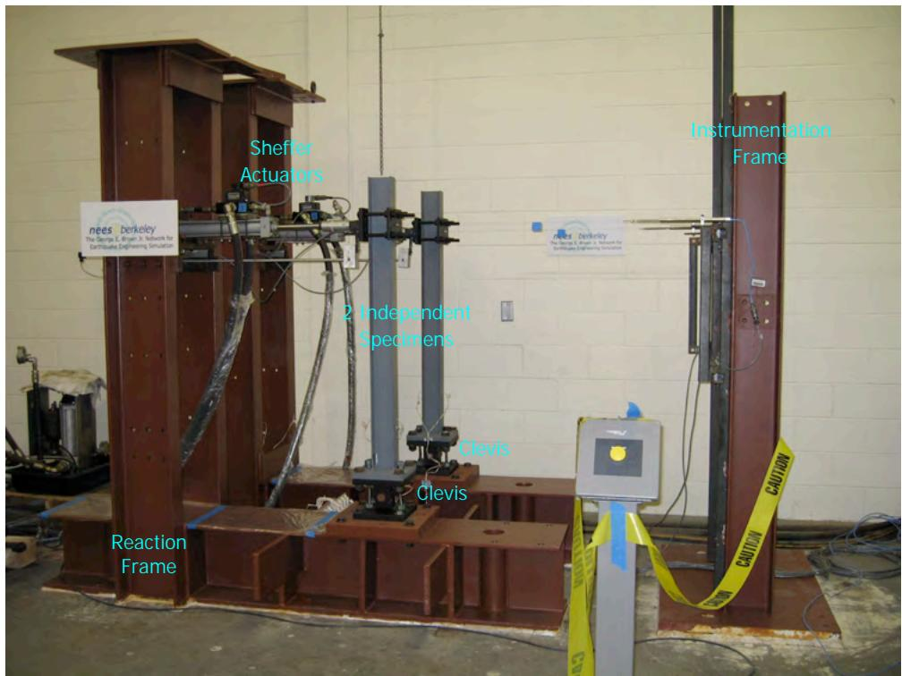  
图 2.3：nees@berkeley 的 $\mu$-NEES 实验装置。

## 2.4 OpenFresco 中间件混合仿真框架

OpenFresco 中间件的目的是协调计算驱动程序和物理传递系统之间的事务 [20]。计算驱动程序和物理传递系统之间的交互可能变得复杂。有几个因素需要考虑。第一个因素是通信方法，决定一个进程将如何与另一个进程通信。另外重要的是，来自计算驱动程序的试验位移可能不在适当的坐标系中，以便作动器施加到试件上。需要执行必要的转换，以确保试件被正确加载，并且反馈被计算驱动程序正确处理。与控制及 DAQ 系统的接口也可能成为挑战，因为每个控制和 DAQ 系统都有独特的接口。因此，需要一个第三系统来协调计算驱动程序和物理传递系统之间的交互。

在许多先前的情况下，这个第三系统是为每个混合仿真定制编程的。每个实验室或设备站点都有自己独特的方式进行混合仿真。这使得站点之间难以协作，特别是在多站点测试中。即使过程基本相同，接口不同，一个实验室也难以移植和修改另一个实验室的实现。OpenFresco 通过提供一个透明且易于扩展的混合仿真软件框架解决了这一难题。图 2.4 以绿色显示了 OpenFresco 抽象类。关于 OpenFresco 的深入讨论可以在附录 A 中找到。表 2.1 显示了如何为单跨框架示例配置 OpenFresco。随后的小节将详细解释这些设置。

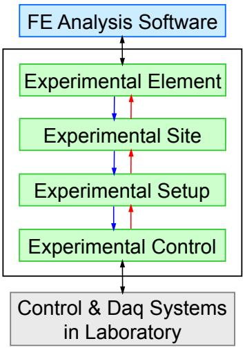  
图 2.4：OpenFresco 抽象类及其过程。

表 2.1：单跨框架示例的 OpenFresco 配置   

| OpenFresco 组件 | 配置 |
|---|---|
| 实验单元 | 双节点连接实验单元 |
| 实验站点 | 本地实验站点 |
| 实验装置 | 单作动器实验装置 |
| 实验控制 | xPC-Target 实验控制 |

### 2.4.1 双节点连接实验单元

单跨框架示例采用了双节点连接实验单元（图 2.5）。该实验单元嵌入在计算驱动程序的 FEA 模型中，代表物理试件。它是计算驱动程序和 OpenFresco 之间的接口。它向计算驱动程序提供刚度、质量和阻尼矩阵。它还提供给定变形状态下的抵抗力向量。该实验单元负责将试验变形从全局坐标系转换到基本实验单元坐标系，并将测得的力和/或位移从基本实验单元坐标系反向转换到全局坐标系。在此示例中，使用了剪切方向（2 方向）的一维双节点连接单元，因为该模型中的节点处轴向和旋转自由度被凝聚掉了。

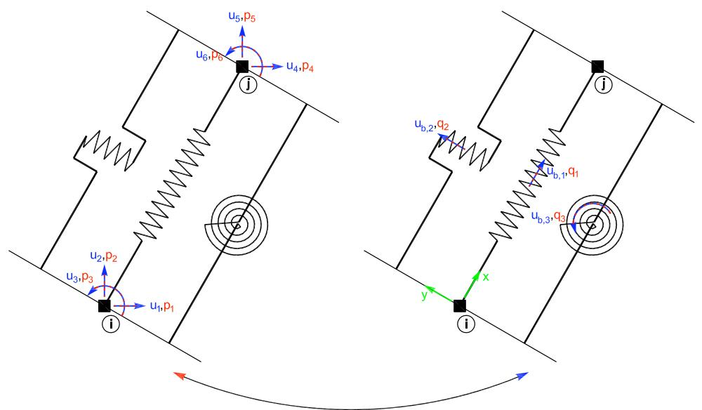  
线性变换   
图 2.5：线性变换中的 OpenFresco 双节点连接实验单元。

### 2.4.2 本地实验站点

此示例是一个本地测试，意味着计算驱动程序、OpenFresco 中间件服务器和物理传递系统都在同一地点运行。因此，在 OpenFresco 中部署了本地实验站点。计算驱动程序和 OpenFresco 之间以及 OpenFresco 内部都没有网络通信。这是最简单的实验站点配置。

### 2.4.3 单作动器实验装置

此示例使用单作动器实验装置（图 2.6）。单作动器实验装置代表了实验室中除控制和 DAQ 系统之外的物理传递系统。因此，图 2.6 中的实验装置与图 2.3 中的 $\mu$-NEES 装置非常相似。单作动器实验装置将基本实验单元系统中的试验变形转换为作动器坐标系中的试验位移。它对测得的力和位移执行反向转换。该实验装置组装发送到控制系统的向量，并提取从控制系统接收的向量。

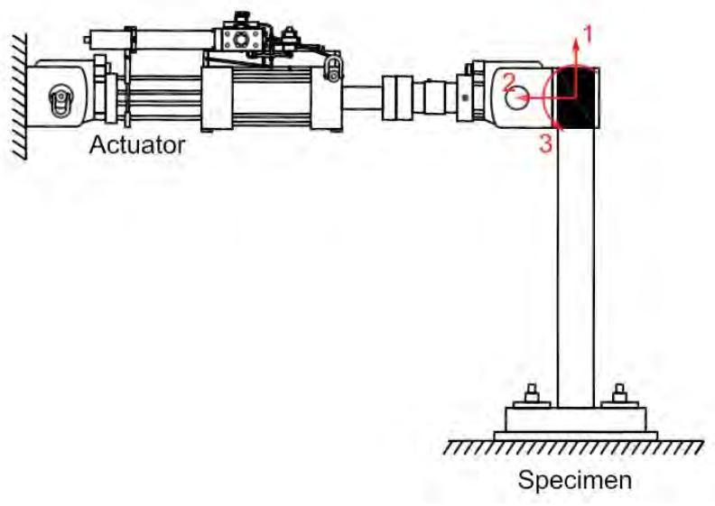  
图 2.6：OpenFresco 单作动器实验装置。

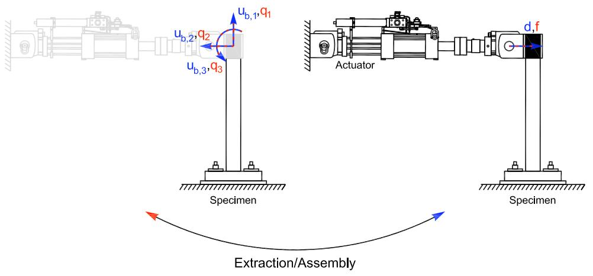  
图 2.7：OpenFresco 单作动器实验装置变换。

### 2.4.4 xPC-Target 实验控制

单跨框架示例使用 xPC-Target 实验控制与控制系统通信。该实验控制使用 xPC-Target 应用程序接口（API）与运行 Simulink 预测-校正模型的 xPC-Target 计算机通信。如图 2.2 所示，OpenFresco 和 xPC-Target 计算机通过 TCP/IP 连接通信。xPC-Target 计算机和 PID 控制器位于 SCRAMNet 环上，这是一种共享内存网络。xPC-Target 上运行的预测-校正算法生成的位移几乎可以瞬间通过 SCRAMNet 被 PID 控制器看到。这允许两个进程之间实现瞬时和确定性的通信。

## 2.5 DC 混合仿真的顺序过程

本节按顺序列出了 DC 混合仿真在积分时间步 n 的过程。它详细解释了每个过程，并展示了计算驱动程序、OpenFresco 中间件和物理传递系统如何相互作用。每个过程都应用于单跨框架示例以帮助解释。本节不涵盖负责初始化和结束仿真的过程。仅突出显示 OpenFresco 具体类中的关键方法。图 2.8 中的 UML（统一建模语言）序列图显示了当计算驱动程序或仿真应用程序设置试验响应时，在 OpenFresco 类中调用的方法序列。图 2.8 对应过程 1 到 5，并相应标记。图 2.9 显示了当仿真应用程序试图获取抵抗力时调用的方法。图 2.9 对应过程 6 到 10，并相应标记。

**1. 计算驱动程序计算预测速度 $( \widetilde { \dot { \bf u } } _ { n } )$ 和位移 $( \widetilde { \mathbf { u } } _ { n } )$ 向量。**

单跨框架使用质量矩阵（M）、粘性阻尼矩阵（C）和切线刚度矩阵 $\mathbf { \eta } ( \mathbf { K } )$ 在 FEA 软件中建模。此示例使用 αOS 时间积分方案。αOS 时间积分方案基于 Hiber-Hughes-Talyor（HHT）运动方程（方程 2.1）[9]。$\ddot { \mathbf { u } } _ { i }$、$\dot { \mathbf { u } } _ { i }$、${ \bf { u } } _ { i }$ 和 $\mathbf { f } _ { i }$ 分别是时间步 $i$ 的节点加速度、速度、位移和荷载向量。$\mathbf { r } ( \mathbf { u } _ { i } )$ 是以 ${ \bf u } _ { i }$ 为输入的节点抵抗力向量函数。当前时间步 $n$ 和上一个时间步 $n - 1$ 在方程 2.1 中使用。其中 $\mathfrak { Q } \in [ 2 / 3 , 1 ]$ 是用户选择的参数，允许调整数值阻尼。

$$
\begin{array}{l} \mathbf {M} \ddot {\mathbf {u}} _ {n} + \alpha \mathbf {C} \dot {\mathbf {u}} _ {n} + (\alpha - 1) \mathbf {C} \dot {\mathbf {u}} _ {n - 1} + \alpha \mathbf {r} (\mathbf {u} _ {n}) + (\alpha - 1) \mathbf {r} (\mathbf {u} _ {n - 1}) \\ = \alpha \mathbf {f} _ {n} + (\alpha - 1) \mathbf {f} _ {n - 1} \quad (2. 1) \\ \end{array}
$$

αOS 方法使用时间步 $n$ 和 $n-1$ 之间位移、速度和加速度的 Newmark 关系。方程 2.2 估计时间步 n 的速度。它可以组织为两部分之和，如方程 2.3。第一部分是预测速度，其中 $\tilde { \dot { \mathbf { u } } } _ { n } = \dot { \mathbf { u } } _ { n - 1 } + \Delta t ( 1 - \gamma ) \ddot { \mathbf { u } } _ { n - 1 }$。第二部分是校正项。

$$
\begin{array}{l} \dot {\mathbf {u}} _ {n} = \dot {\mathbf {u}} _ {n - 1} + \Delta t (1 - \gamma) \ddot {\mathbf {u}} _ {n - 1} + \Delta t \gamma \ddot {\mathbf {u}} _ {n} (2.2) \\ = \tilde {\mathbf {u}} _ {n} + \Delta t \gamma \ddot {\mathbf {u}} _ {n} (2.3) \\ \end{array}
$$

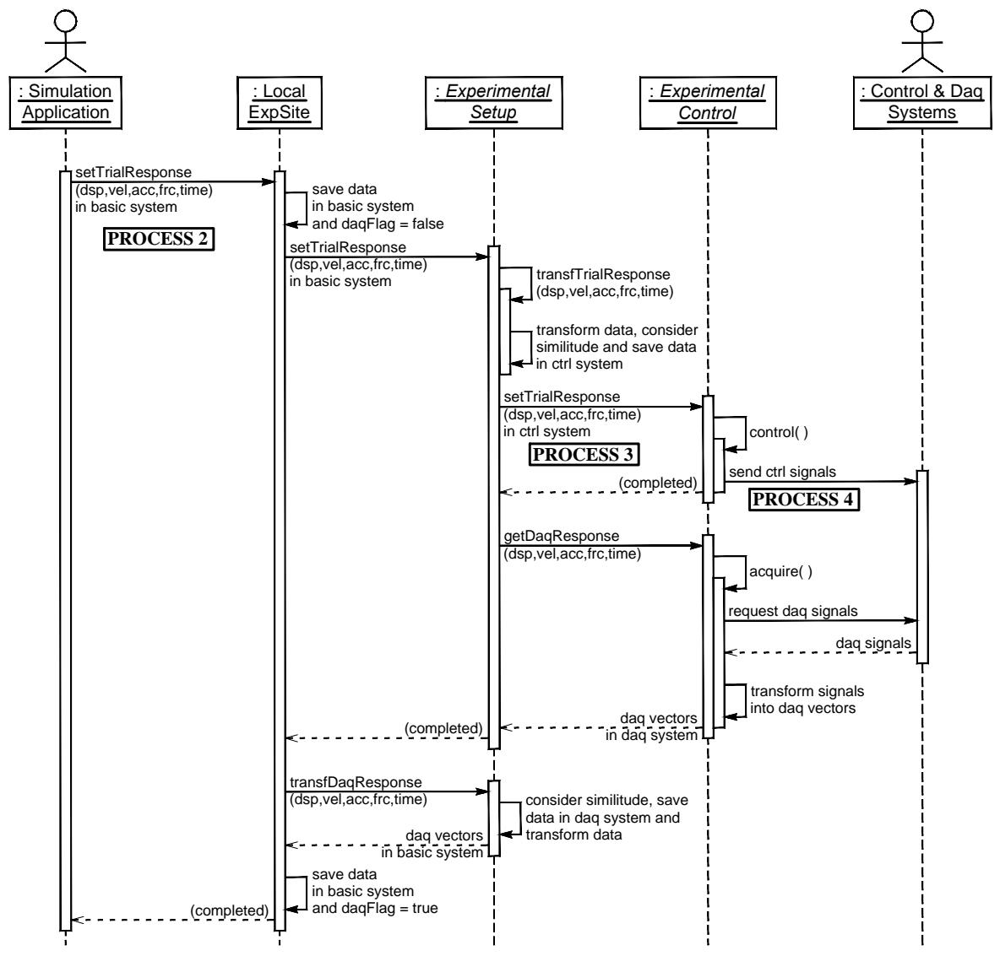  
图 2.8：本地测试期间设置试验响应时 OpenFresco UML 序列图。

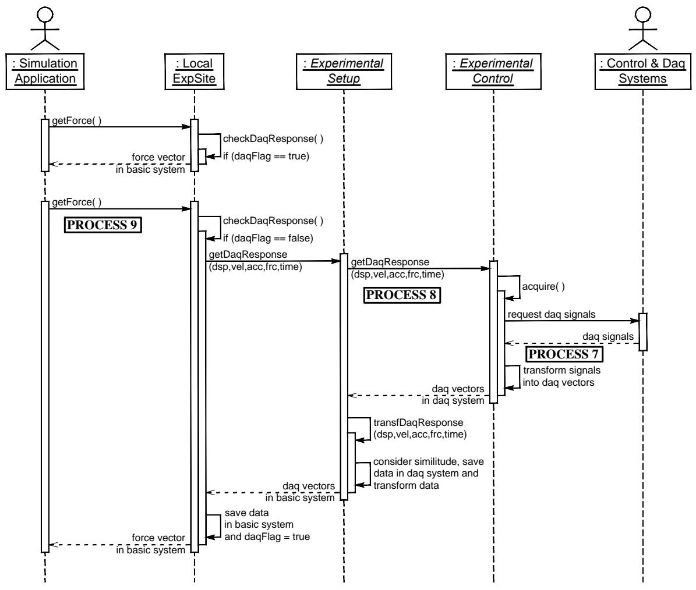  
图 2.9：本地测试期间获取抵抗力时 OpenFresco UML 序列图。

方程 2.4 近似时间步 n 的位移。它同样可以组织为预测部分和校正部分之和。预测位移为 $\widetilde { \mathbf { u } } _ { n } = \mathbf { u } _ { n - 1 } + \Delta t \dot { \mathbf u } _ { n - 1 } + ( \Delta t ) ^ { 2 } ( 1 / 2 - \beta ) \ddot { \mathbf u } _ { n - 1 }$。

$$
\begin{array}{l} \mathbf {u} _ {n} = \mathbf {u} _ {n - 1} + \Delta t \dot {\mathbf {u}} _ {n - 1} + (\Delta t) ^ {2} (1 / 2 - \beta) \ddot {\mathbf {u}} _ {n - 1} + (\Delta t) ^ {2} \beta \ddot {\mathbf {u}} _ {n} (2.4) \\ = \tilde {\mathbf {u}} _ {n} + (\Delta t) ^ {2} \beta \ddot {\mathbf {u}} _ {n} (2.5) \\ \end{array}$$

需要注意的是，这些预测速度和位移是根据上一个时间步 $n - 1$ 的已知速度和位移计算得出的。$\beta$ 和 $\gamma$ 根据选定的 α 值通过方程 2.6 计算。

$$
\beta = \frac {(2 - \alpha) ^ {2}}{4} \quad \gamma = \frac {(3 - 2 \alpha)}{2} \tag {2.6}
$$

校正步骤在过程 10 中执行。在此步骤中，计算驱动程序仅计算 $\widetilde { \dot { \mathbf { u } } } _ { n }$ 和 $\widetilde { \mathbf { u } } _ { n }$。

**2. 实验单元将预测位移向量 $( \widetilde { \mathbf { u } } _ { n } )$ 转换为试验位移向量 $( \widehat { \mathbf { u } } _ { n } )$ 并将 $\hat {  { \mathbf { u } } } _ { n }$ 发送到实验装置。**

在计算驱动程序上运行的 FEA 软件中的双节点连接实验单元将过程 1 中计算的预测位移向量 $( \widetilde { \mathbf { u } } _ { n } )$ 转换为基本实验单元坐标系中的试验位移向量 $( \widehat { \mathbf { u } } _ { n } )$。在此示例中，它获取图 2.1 中单跨框架模型自由度 1 处的节点位移，并将其转换为图 2.5 所示双节点连接单元 2 方向的试验位移。由于这是一维单元，转换很简单。向量 $\hat {  { \mathbf { u } } } _ { n }$ 只有一个条目。转换完成后，双节点连接单元通过本地实验站点将 $\hat {  { \mathbf { u } } } _ { n }$ 发送到单作动器实验装置。双节点连接对象使用 update 方法调用本地站点对象的 setTrialResponse 公共方法。该 setTrialResponse 方法调用单作动器对象的 setTrialResponse 公共方法。

**3. 实验装置将试验位移向量 $( \widehat { \mathbf { u } } _ { n } )$ 从基本实验单元坐标系转换到作动器坐标系，并将转换后的试验位移向量 $( \breve { \mathbf { u } } _ { n } )$ 发送到实验控制。**

单作动器实验装置从双节点连接单元接收 $\hat {  { \mathbf { u } } } _ { n }$。它将 $\hat {  { \mathbf { u } } } _ { n }$ 转换到作动器坐标系，并组装新的试验位移向量 $( \breve { \mathbf { u } } _ { n } )$，如图 2.7 所示。此转换在单作动器对象的 setTrialResponse 方法中执行，该方法调用受保护的 transfTrialResponse 方法。然后，它通过调用 xPC-Target 对象的 setTrialResponse 公共方法，将 $\breve { \mathbf { u } } _ { n }$ 发送到 xPC-Target 实验控制。对于此示例，实验单元和实验装置中的转换设计得非常简单。然而，根据模型和设置的不同，这些转换可能会变得复杂。OpenFresco 可以对这两个过程执行线性和非线性转换。

**4. 实验控制将转换后的试验位移向量 $( \breve { \mathbf { u } } _ { n } )$ 发送到控制系统。**

xPC-Target 实验控制通过 TCP/IP 连接将来自单作动器实验装置的 $\breve { \mathbf { u } } _ { n }$ 发送到 xPC-Target 计算机（图 2.2），通过调用 xPC-Target 对象的受保护 control 方法。xPC-Target 的 setTrialResponse 方法调用 control 方法。除了发送 $\breve { \mathbf { u } } _ { n }$ 外，control 方法还告知 xPC-Target 已发送新的指令位移，并指示预测-校正算法从预测位移切换到开始校正到新的试验位移。

**5. 控制系统施加试验位移。**

在 xPC-Target 上运行的预测-校正模型开始校正到新的试验位移 $\breve { \mathbf { u } } _ { n }$。MTS-STS 控制器通过 SCRAMNet 看到校正位移。控制器通过 $\mu \cdot$ -NEES 实验装置（图 2.3）中的作动器施加这些位移。一旦达到新的试验位移 $\breve { \mathbf { u } } _ { n }$，预测-校正算法从校正切换到预测。这些位移再次由 MTS-STS 控制器和 $\mu$-NEES 装置施加到试件上。预测-校正算法继续预测，直到收到下一个试验位移 $\breve { \mathbf { u } } _ { n + 1 }$。如果 $\breve { \mathbf { u } } _ { n + 1 }$ 未能及时到达，预测-校正算法将进入减速模式。它最终会保持最后计算出的预测位移，直到 $\breve { \mathbf { u } } _ { n + 1 }$ 到达。

**6. DAQ 系统测量位移和力。**

DAQ 系统分别通过 LVDT 和 LC 测量位移和力。LVDT 和 LC 是 $\mu \cdot$ -NEES 实验装置的一部分。PID 控制器使用这些反馈作为其闭环控制系统的一部分。控制器还将它们写入 SCRAMNet，以便 xPC-Target 记录并将其反馈给 xPC-Target 实验控制。

**7. 实验控制从 DAQ 系统读取测量位移 $( \bar {  { \mathbf { u } } } _ { n } )$ 和力 $( { \overline { { \mathbf { f } } } } _ { n } )$，并将 ${ \bar {  { \mathbf { u } } } } _ { n }$ 和 $\mathbf { \overline { { f } } } _ { n }$ 发送到实验装置。**

xPC-Target 实验控制首先检查试验位移是否已被控制系统施加，即是否已完成对新的试验位移的校正。如果试验位移已施加，xPC-Target 实验控制读取在施加试验位移时的测量位移 $( \bar {  { \mathbf { u } } } _ { n } )$ 和力 $( { \overline { { \mathbf { f } } } } _ { n } )$。这两个操作都在 xPC-Target 对象的 acquire() 受保护方法中执行。acquire 方法在 xPC-Target 对象的 getDaqResponse 公共方法中被调用。该 getDaqResponse 方法由单作动器对象的 getDaqResponse 公共方法调用。

**8. 实验装置将测量位移 $( \bar {  { \mathbf { u } } } _ { n } )$ 和力 $( { \bar { \bf f } } _ { n } )$ 从作动器坐标系转换到基本单元坐标系，并将转换后的力 $( { \check { \mathbf { f } } } _ { n } )$ 向量发送到实验单元。**

单作动器实验装置从 xPC-Target 实验控制接收 $\bar {  { \mathbf { u } } } _ { n }$ 和 $\mathbf { \overline { { f } } } _ { n }$。它将作动器坐标系中的 $\bar {  { \mathbf { u } } } _ { n }$ 和 $\mathbf { \overline { { f } } } _ { n }$ 转换为基本实验单元坐标系中的 $\check {  { \mathbf { u } } } _ { n }$ 和 $\mathbf { \check { f } } _ { n }$。这是过程 3 中转换的逆转换。单作动器 getDaqResponse 方法调用私有的 transfDaqResponse 方法执行转换。单作动器 getDaqResponse 方法由本地站点对象的 checkDaqResponse 公共方法调用。checkDaqResponse 方法检查这是否是第一次调用此方法。如果是，它调用单作动器 getDaqResponse 方法。checkDaqResponse 方法由本地站点对象的 getForce 公共方法调用。

**9. 实验单元将测量力 $( { \check { \mathbf { f } } } _ { n } )$ 从基本实验单元坐标系转换到全局坐标系，并将力 $\mathbf { r } ( \widetilde { \mathbf { u } } _ { n } )$ 反馈给计算驱动程序。**

双节点连接实验单元从单作动器装置获取 $\check { \mathbf { f } } _ { n }$。它将基本实验单元坐标系中的 $\check { \mathbf { f } } _ { n }$ 转换为全局坐标系中的 $\mathbf { r } ( \widetilde { \mathbf { u } } _ { n } )$。这是过程 2 的逆转换。然后 $\mathbf { r } ( \widetilde { \mathbf { u } } _ { n } )$ 被反馈给在计算驱动程序上运行的 FEA 程序。$\check { \mathbf { f } } _ { n }$ 通过双节点连接对象的 getResistingForce 公共方法获取，该方法调用本地站点对象的 getForce 方法。然后 getResistingForce 执行向全局坐标系的逆转换。

**10. 计算驱动程序使用测量力 $( \mathbf { r } ( \widetilde { \mathbf { u } } _ { n } ) )$ 并前进到时间步 $n + 1$。**

αOS 方法使用方程 2.7 来近似方程 2.1 中的 $\mathbf { r } ( \mathbf { u } _ { n - 1 } )$。

$$
\mathbf {K} \mathbf {u} _ {n - 1} - \mathbf {r} \left(\mathbf {u} _ {n - 1}\right) \approx \mathbf {K} \tilde {\mathbf {u}} _ {n - 1} - \mathbf {r} \left(\tilde {\mathbf {u}} _ {n - 1}\right) \tag {2.7}
$$

图 2.10 给出了这一近似的图形表示，其中抵抗力在预测位移 $\tilde { u } _ { n - 1 }$ 处偏离线性的程度 $( K \tilde { u } _ { n - 1 } - r ( \tilde { u } _ { n - 1 } ) )$ 近似了在 $u _ { n - 1 }$ 处未知的偏离程度 $( K u _ { n - 1 } - r ( u _ { n - 1 } ) )$。使用方程 2.2 和 2.4，${ \dot {  { \mathbf { u } } } } _ { n }$ 和 $\ddot {  { \mathbf { u } } } _ { n }$ 用 ${ \bf u } _ { n }$ 和 $\widetilde { \mathbf { u } } _ { n }$ 表示。

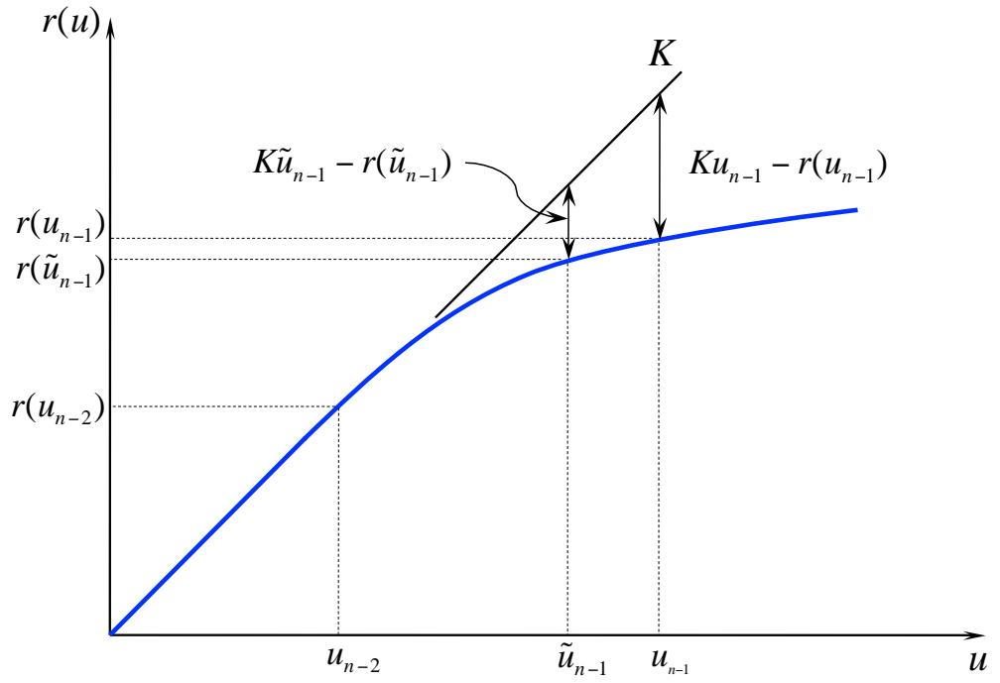  
图 2.10：显示一自由度系统 $r ( u _ { n - 1 } )$ 的 αOS 近似的力-变形曲线。

$$
\dot {\mathbf {u}} _ {n} = \frac {\gamma}{\beta \Delta t} \left(\mathbf {u} _ {n} - \tilde {\mathbf {u}} _ {n}\right) + \dot {\mathbf {u}} _ {n - 1} + \Delta t (1 - \gamma) \ddot {\mathbf {u}} _ {n - 1} \tag {2.8}
$$

$$
\ddot {\mathbf {u}} _ {n} = \frac {1}{\beta (\Delta t) ^ {2}} \left(\mathbf {u} _ {n} - \tilde {\mathbf {u}} _ {n}\right) \tag {2.9}
$$

通过将方程 2.8、2.9 和 2.7 代入方程 2.1，可以形成方程 2.10，其中 $\Delta \mathbf { u } = \mathbf { u } _ { n } - \tilde { \mathbf { u } } _ { n }$，而 $\mathbf { r } ( \widetilde { \mathbf { u } } _ { n } )$ 来自过程 9。

$$
\begin{array}{l} \left[ \frac {1}{\beta (\Delta t) ^ {2}} \mathbf {M} + \alpha \frac {\gamma}{\beta \Delta t} \mathbf {C} + \alpha \mathbf {K} \right] \Delta \mathbf {u} \\ = - \alpha \left[ \mathbf {C} \left(\dot {\mathbf {u}} _ {n - 1} + \Delta t (1 - \gamma) \ddot {\mathbf {u}} _ {n - 1}\right) + \mathbf {r} _ {n} \left(\tilde {\mathbf {u}} _ {n}\right) - \mathbf {f} _ {n} \right] \\ - (1 - \alpha) \left[ \mathbf {C} \tilde {\mathbf {u}} _ {n - 1} + \left(\mathbf {r} _ {n - 1} \left(\tilde {\mathbf {u}} _ {n - 1}\right) + \mathbf {K} \mathbf {u} _ {n - 1} - \mathbf {K} \tilde {\mathbf {u}} _ {n - 1}\right) - \mathbf {f} _ {n - 1} \right] \tag {2.10} \\ \end{array}
$$

αOS 方法不需要任何迭代。FEA 程序只需一步即可解出 $\Delta \mathbf { u }$。然后将 ∆u 代入方程 2.9 求解时间步 $n$ 的加速度 $( \ddot {  { \mathbf { u } } } _ { n } )$。$\ddot {  { \mathbf { u } } } _ { n }$ 用于校正方程 2.3 和 2.5 中的速度和位移。分析现在前进到时间步 $n + 1$，并从过程 1 重新开始。

## 2.6 DC 混合仿真的优点与局限性

与其他控制模式相比，在控制系统处于 DC 模式下进行混合仿真有其优点。首先，DC 混合仿真的公式与大多数 FEA 程序一致。大多数 FEA 程序使用基于位移的方法来求解静态和动态问题。让计算驱动程序向控制系统发送位移并使用测得的力作为反馈，与 FEA 程序从全局层面到单元层面再回到全局层面的处理方式配合得很好。其次，大多数控制和加载系统设计为在位移或位置控制下运行良好。因此，让这些系统在力控制下运行则困难得多。最后，混合仿真中的大部分工作都是在 DC 混合仿真中完成的。因此，使用其他控制模式的开创性研究不多，使得其他类型的混合仿真困难得多。

然而，这并不意味着 DC 混合仿真没有缺点。有些试件无法在 DC 下进行良好测试。如果试件在加载方向上非常刚硬，DC 就不够用了。这种类型的试件在结构工程中非常常见。它出现在剪力墙的侧向方向或梁柱的轴向方向。另一种情况是快速或实时混合仿真。当以相对较高的速度运行混合仿真时，必须考虑试件和加载系统的惯性效应。DC 在这种情况下是不够的。还有其他测试情况需要在仿真过程中切换控制模式。最初非常刚硬随后表现出软化行为的试件可能需要在初始阶段采用力控制，在后期切换到 DC。一个实验装置可能需要同时激活多种控制模式。以梁柱为例，轴向加载可能是力控制，而侧向可能是 DC，两者同时进行。因此，存在探索混合仿真中其他控制策略的需求。

# 第 3 章 力控制混合仿真

第 3 章讨论了力控制（FC）混合仿真的挑战。本章首先解释了 FC 混合仿真以及它与第 2 章中 DC 混合仿真的不同之处。然后定义了 FC 混合仿真的困难；阐述了动机；并调查了先前的研究。提出了 FC 混合仿真的方法。这些方法分为两类，基于位移的方法和基于力的方法。详细解释了两种类型的方法，并描述了它们在 nees@berkeley 实验室使用 OpenFresco 的实现。最后，介绍了使用 1-DOF 和 2-DOF $\mu$-NEES 实验装置对这些 FC 方法进行测试的结果，并对结果进行了讨论。

## 3.1 引言

### 3.1.1 问题定义

FC 混合仿真是一种混合仿真类型，其中控制系统在混合仿真期间通过加载系统将力施加到物理试件上，而在第 2 章所述的 DC 混合仿真中，加载系统将位移施加到物理试件上。加载系统通常由作动器和载荷边界元件组成。因此，“FC”指的是控制系统的控制模式。如果计算驱动程序需要反馈，则使用测量位移，而在 DC 混合仿真中使用测量力。总的来说，执行 FC 混合仿真比 DC 混合仿真更困难。

FC 混合仿真提出了两大挑战。第一个挑战是从计算驱动程序获取要施加到试件的力。这变得困难，因为结构工程中的大多数 FEA 程序使用基于位移的公式，其中对每个单元施加试验变形并计算相应的抵抗力。因此，没有直接的方法可以从大多数现有的 FEA 程序中获取试验力。

第二个挑战在于控制和加载系统。结构测试中使用的大多数控制和加载系统主要设计为在位移或位置控制下良好运行。因此，这些系统在力或载荷控制下运行得没有那么好。一个主要原因是加载系统以及试件的刚度都影响控制系统的比例增益。当在 FC 下测试非常刚硬的试件时，控制系统的比例增益必须设置得相对较低。这导致力的跟踪效果差，意味着指令力与反馈力不匹配。然而，如果增加比例增益以改善跟踪，控制系统会变得不稳定。实验过程中试件刚度的变化也可能对系统性能产生不利影响。作动器运动部件的粘滑和摩擦会导致 FC 下作动器运动不平稳。摩擦也可能对指令力的跟踪产生不利影响。因此，粘滑和摩擦会降低控制系统在 FC 下的性能。

### 3.1.2 动机

尽管 FC 混合仿真难以良好执行，但结构测试中仍存在对其的需求。其主要动机源于控制和加载系统在 DC 下的局限性。在某些情况下，控制和加载系统在 DC 下表现不佳。在加载方向上测试非常刚硬的试件是一个典型的例子。单跨框架模型（图 2.1）用于证明这一点。表 3.1 显示了两个单跨框架模型及其属性。模型 1 和 2 的主要区别在于模型 2 中单元 1 的弹性刚度是模型 1 的 25 倍。

表 3.1：柔性和刚性单跨框架模型的属性。   

| 属性 | 模型 1：软模型 | 模型 2：刚性模型 |
|---|---|---|
| 弹性刚度 (kip/in.): [单元1 单元2 单元3] | [4 2 5] | [100 2 5] |
| 质量 (kip/g): [质量1 质量2] | [0.10 0.05] | [0.10 0.05] |
| 周期 (sec): [T1 T1] | [0.88 0.51] | [0.54 0.20] |
| 质量比例阻尼，ξ = 5%: [αM = 2ξω1] | [0.71] | [1.17] |

两个模型都使用来自第 2.5 节的 αOS 时间积分方案进行分析，其中 $\alpha = 2 / 3$。模型承受图 3.1 所示的 El Centro 地震动的前 350 个点。该地震动按 $15 \%$ 缩放。在本章的后续部分，将再次使用单跨框架模型来测试 FC 方法。单跨框架模型的单元 1 将被一个试件替代。在这些测试中，地震动按 $15 \%$ 缩放，以使试件保持在其弹性范围内。此处缩放地震动是为了与本章其余部分保持一致。缩放后的峰值地面加速度为 $0 . 0 4 8 g$。

图 3.2 显示了由此分析产生的模型 1 和 2 的单元 1 试验位移-时间历程图。模型 1 单元 1 的试验位移值范围从 -0.660 英寸到 0.712 英寸，而模型 2 的范围是从 -0.066 英寸到 0.065 英寸。图 3.3 绘制了两种模型从这些试验位移中测得的单元 1 力。模型 1 的测量力范围是从 -2.640 kips 到 2.846 kips。对于模型 2，测量力范围是从 -6.594 kips 到 6.485 kips。


  
图 3.1：1940 年 5 月 18 日帝国谷地震期间在加利福尼亚州埃尔森特罗一个场地记录到的水平南北分量地震动的前 350 个点 [5]。地面加速度数据每 0.02 秒记录一次。

  
图 3.2：模型 1 和 2 的单元 1 试验位移-时间历程图。   
图 3.3：模型 1 和 2 的单元 1 测量力-时间历程图。

通常，对于一个单元的弹性刚度增加，给定荷载条件下结构的整体变形减小。在这些模型中，将单元 1 的弹性刚度增加 25 倍，使试验位移范围减少了约 10 倍，测量力范围增加了约 3 倍。需要注意的是，模型 2 中的单元 1 不仅比模型 1 中的单元 1 硬得多，而且比单元 2 和 3 也硬得多。由于单元 1 比其他单元更硬，它承受了更多的荷载。但由于它非常坚硬，它的变形并不大。在数值上，两种模型的试验位移范围都不会造成问题。它们都在机器精度范围内。

在混合仿真中，当单元 1 被实验室中的试件替代时，根据控制和加载系统的不同，很难精确施加由模型 2 产生的这些小的单元 1 试验位移。然而，相同的控制和加载系统能够充分施加来自模型 2 的单元 1 测量力范围。此外，小位移通常比施加时更容易测量。在这种情况下，由这些试验力和测量位移对组成的 FC 混合仿真比使用相同试验位移和测量力对的 DC 混合仿真产生更真实的结果。这是假设 FC 算法产生的试验力范围与 DC 算法中的测量力范围相似。

实时和快速混合仿真是 FC 比 DC 更好的其他情况。在实时混合仿真中，仿真时间步长等于记录的地震动时间间隔。根据试件的缩放比例，仿真时间步长可以相对于记录的地震动时间间隔进行缩放。例如，1940 年 El Centro 地震动 [5] 包含每 0.02 秒记录一次的地面加速度。在实时混合仿真中，未缩放的时间步长设置为 0.02 秒，这意味着控制系统每 0.02 秒期望一个新的试验位移或力。快速混合仿真是指运行相对较快的混合仿真。仿真时间步长设置得相对较小。

在实时和快速混合仿真中，控制和加载系统都运行得很快。当混合仿真快速运行时，必须考虑试件和加载系统的动态效应。在 DC 混合仿真期间，只有抵抗力被反馈给计算驱动程序。试件的质量和粘性阻尼特性在 FEA 程序中建模。仿真期间试件惯性和粘性阻尼特性产生的力被忽略了。在快速测试期间，动态效应对整体反馈力的贡献更大。加载系统有其自身的动态效应，来自加载元件（如顶梁、作动器杆和作动器中的液压油）的运动。这些必须在仿真过程中予以考虑。同时向试件施加试验位移、速度和加速度是不可能的。更合理的做法是计算包含所有这些动态效应的施加力 [28]。

FC 混合仿真扩展了混合仿真在可测试试件类型和测试速度方面的能力。混合仿真的主要好处之一是，新的和创新的结构系统可以通过实验进行测试。对此类结构系统的测试同样需要新的和创新的测试方法。另一个主要好处是，它可以产生与振动台测试相当的结果，而无需花费成本以及将试件缩小到台面尺寸。随着混合仿真运行速度的提高，它能够更好地捕捉试件的动态效应，使其与振动台测试更具可比性。

### 3.1.3 先前研究

一些研究人员尝试了 FC 混合仿真。Thewalt [28] 在 1987 年做出了最早的尝试之一。他提出了有效力测试（EFT）方法，作为执行实时和快速混合仿真的一种方式。给定时间步 n 的离散化运动方程（方程 3.1），离散化力函数为 $\mathbf { f } _ { n } = - \mathbf { M } \ddot { \mathbf { u } } _ { g } ( t _ { n } )$，其中 ${ \ddot { u } } _ { g } ( t _ { n } )$ 是记录的地面加速度。一旦质量矩阵（M）公式化，${ \bf f } _ { n }$ 可以在仿真开始前计算。在 EFT 方法中，${ \bf f } _ { n }$ 成为试验力向量 $\hat { \mathbf { f } } _ { n }$。

$$
\mathbf {M} \ddot {\mathbf {u}} _ {n} + \mathbf {C} \dot {\mathbf {u}} _ {n} + \mathbf {r} _ {n} = \mathbf {f} _ {n} \tag {3.1}
$$

$\hat { \mathbf { f } } _ { n }$ 被转换到作动器坐标系 $( { \breve { \mathbf { f } } } _ { n } )$，然后通过加载系统施加到试件上。一旦施加了 $\breve { \mathbf { f } } _ { n }$，就会在每个作动器自由度处测量并记录恢复力 $( { \overline { { \mathbf { f } } } } _ { n } )$、位移 $( \bar {  { \mathbf { u } } } _ { n } )$、速度 $( \bar { \dot { \bf u } } _ { n } )$ 和加速度 $( \bar { \mathbf { u } } _ { n } )$。然后算法前进到下一个时间步 $n + 1$。

EFT 方法的明显优势在于，只要结构没有被划分为数值子结构和物理子结构，$\hat { \mathbf { f } } _ { n }$ 就很容易计算。这意味着整个结构进行物理测试，而质量则进行数值建模。另一个优点是它试图在实时和快速测试期间考虑惯性和能量耗散效应。这些因素使 EFT 方法成为振动台测试的良好替代方案。然而，当结构模型被划分为数值部分和实验部分时，EFT 方法就会失效。问题在于计算出的有效力仍然在每个离散化节点的全局坐标系中。不知道这些全局节点力中有多少应该施加到物理试件上。另外需要注意的是，$\mathbf { \widehat { f } } _ { n }$ 是预先计算的，意味着 $\mathbf { \hat { f } } _ { n }$ 不依赖于任何测量的反馈值。

2005 年，Pan 等人 [18] 进行了开关和混合控制混合仿真，其中使用的控制模式是位移和力。本章仅回顾 FC 部分。他们研究的开关和混合控制部分将在后续章节中讨论。Pan 等人 [18] 对高阻尼橡胶支座（HDRB）隔震器进行了混合仿真。他们的八层两跨钢框架结构模型由 HDRB 隔震。八层框架进行了分析建模，HDRB 进行了实验测试。结构的分析部分建模为每层两个自由度，一个水平和一个垂直。总共 18 个自由度。结构的实验部分设置了一个水平作动器和一个垂直作动器。水平作动器在位置控制下运行，而垂直作动器在位置和 FC 之间切换。水平和垂直自由度被认为是解耦的。因此，水平目标位移独立于垂直目标位移和力计算。他们同时使用了 1995 年 Hyogoken-Nanbu（神户）记录地震动的水平和垂直分量。

两个作动器的预测位移都使用算子分裂（OS）预测-校正方案计算，使用方程 3.1 作为时间步 n 的运动方程。预测位移通过水平作动器施加到试件上。测量的力被反馈回方案以校正预测位移。垂直试验力计算为预测垂直位移与支座垂直弹性刚度的乘积。假定支座在垂直方向上保持弹性。测量的位移和力没有反馈给时间积分方案。计算出的垂直试验力被视为方程 3.1 中的抵抗力 $( \mathbf { r } _ { n } )$。Pan 等人计算试验力的方法的一个缺点是，它仅适用于试件为弹性的情况。因此，研究人员必须事先知道试件的行为（力-变形曲线）才能使用他们的方法。

Elkhoraibi 和 Mosalam [7] 在 2007 年进行了开关控制混合仿真的研究，他们开发了一种执行 FC 的方法。他们的 FC 部分在本章中讨论。他们关于开关控制混合仿真的工作将在第 4 章介绍。Elkhoraibi 和 Mosalam 使用割线刚度估计与 α-OS 时间积分方案来计算试验力。自由度被认为是解耦的，意味着割线刚度矩阵只包含对角项。这使得割线刚度的计算相当直接。每个自由度或割线刚度矩阵对角项在迭代 $i$ 和时间步 $n+1$ 的割线刚度项 $k _ { n + 1 } ^ { i }$ 使用方程 3.2 计算，其中 ˘f i−1n+1 $\breve { f } _ { n + 1 } ^ { i - 1 }$ 和 $r _ { n }$ 分别是时间步 $n+1$ 在迭代 $i-1$ 时的试验力和时间步 $n$ 收敛的抵抗力。类似地，$\check { u } _ { n + 1 } ^ { i - 1 }$ 和 $u _ { n }$ 分别是时间步 $n+1$ 在迭代 $i-1$ 时的测量位移和时间步 n 收敛的位移。

$$
k _ {n + 1} ^ {i} = \left(\check {f} _ {n + 1} ^ {i - 1} - r _ {n}\right) / \left(\check {u} _ {n + 1} ^ {i - 1} - u _ {n}\right) \tag {3.2}
$$

试验力 $\breve { \mathbf { f } } _ { n + 1 } ^ { i }$ 通过使用预测和校正位移公式以及重新排列 HHT 运动方程（方程 2.1）得到方程 3.3、3.4、3.5 和 3.6。（Elkhoraibi 和 Mosalam 使用的 HHT 运动方程与方程 2.1 略有不同。尽管如此，两个方程在数值上是等价的。Elkhoraibi 和 Mosalam 提出的方程在本章中被重新表述，以与方程 2.1 保持一致。）

$$
\mathbf {K} ^ {*} \check {\mathbf {u}} _ {n + 1} ^ {i} + \alpha \check {\mathbf {f}} _ {n + 1} ^ {i} = \mathbf {f} _ {n + 1} ^ {*} \tag {3.3}
$$

$$
\mathbf {K} ^ {*} = \frac {\mathbf {M}}{\Delta t ^ {2} \beta} + \alpha \frac {\gamma \mathbf {C}}{\Delta t \beta} \tag {3.4}
$$

$$
\check {\mathbf {u}} _ {n + 1} ^ {i} = \mathbf {u} _ {n} + \Delta \mathbf {u} _ {n + 1} ^ {i} = \mathbf {u} _ {n} + \left(\mathbf {K} _ {n + 1} ^ {i}\right) ^ {- 1} \left(\check {\mathbf {f}} _ {n + 1} ^ {i} - \mathbf {r} _ {n}\right) \tag {3.5}
$$

$$
\mathbf {f} _ {n + 1} ^ {*} = \alpha \mathbf {f} _ {n + 1} + (1 - \alpha) \mathbf {f} _ {n} - \alpha \mathbf {C} \tilde {\mathbf {u}} _ {n + 1} - (1 - \alpha) \mathbf {C} \dot {\mathbf {u}} _ {n} + \mathbf {K} ^ {*} \tilde {\mathbf {u}} _ {n + 1} - (1 - \alpha) \mathbf {r} _ {n} \tag {3.6}
$$

使用这些方程，公式化了方程 3.7 并求解 $\breve { \mathbf { f } } _ { n + 1 } ^ { i }$。

$$
\left[ \mathbf {K} ^ {*} \left(\mathbf {K} _ {n + 1} ^ {i}\right) ^ {- 1} + \alpha \mathbf {I} \right] \check {\mathbf {f}} _ {n + 1} ^ {i} = \mathbf {f} _ {n + 1} ^ {*} + \mathbf {K} ^ {*} \left(\mathbf {K} _ {n + 1} ^ {i}\right) ^ {- 1} \mathbf {r} _ {n} - \mathbf {K} ^ {*} \mathbf {u} _ {i} \tag {3.7}
$$

这导致了迭代隐式 FC 算法，算法 3.1。

迭代时间积分方案往往会在试件上产生不现实的加载/卸载循环，同时迭代寻找收敛的抵抗力 $\mathbf { r } _ { n + 1 } ^ { l a s t }$。因此，在每次迭代中，只向试件施加增量试验力的一部分 $\lambda ( \mathbf { \check { f } } _ { n + 1 } ^ { i + 1 } - \mathbf { \check { f } } _ { n + 1 } ^ { i } )$ − ˘fin+1)，其中 λ < 1，而不是整个增量力。$\lambda$ 是由研究人员确定的调谐参数。Elkhoraibi 和 Mosalam 的方法比 Pan 等人的方法具有更广泛的应用范围，因为 Elkhoraibi 和 Mosalam 的方法即使在试件变为非弹性时也能计算试验力。

算法 3.1 隐式 FC 算法   
定义初始参数 $\alpha, \beta, \gamma, \varepsilon_r, i_{max}, \mathbf{K}_0$ 和 $\mathbf{K}^*$（方程 3.4）  
for $n = 0$ to (最大步数-1) do  
计算 $\tilde{\mathbf{u}}_{n+1}$（方程 2.5），$\tilde{\mathbf{u}}_{n+1}$（方程 2.3）和 $\mathbf{f}_{n+1}^*$（方程 3.6）  
设置 $\mathbf{K}_{n+1}^1 = \mathbf{K}_n$，$\mathbf{u}_{n+1}^1 = \tilde{\mathbf{u}}_{n+1}$ 和 $i = 0$ 计算 $\check{\mathbf{f}}_{n+1}^{i+1}$（方程 3.7）  
repeat  
在 FC 下向试件施加 $\check{\mathbf{f}}_{n+1}^{i+1}$ 并测量相应的 $\check{\mathbf{u}}_{n+1}^{i+1}$ 更新 $\mathbf{K}_{n+1}^{i+1}$（方程 3.2）  
计算 $\check{\mathbf{f}}_{n+1}^{i+2}$ $i = i + 1$ until $i > i_{max}$ 或 $|\check{\mathbf{f}}_{n+1}^{i+1} - \check{\mathbf{f}}_{n+1}^{i}| \leq \varepsilon_r$ 设置 $\mathbf{K}_{n+1} = \mathbf{K}_{n+1}^i$，$\mathbf{u}_{n+1} = \check{\mathbf{u}}_{n+1}^i$ 和 $\mathbf{r}_{n+1} = \check{\mathbf{f}}_{n+1}^{i+1}$ end for

他们方法的一个局限性是，它仅适用于具有解耦自由度的结构模型，因为其公式基于解耦自由度的割线刚度矩阵计算（方程 3.2）。在实践中，具有解耦自由度的结构模型很难找到。

2006 年，Sivaselvan 等人 [25] 提出了一种实验装置，其中要施加的力首先转换为位移。作动器接收位移并将其施加到具有已知弹性刚度的弹性弹簧上。因此，现在弹簧向试件施加一定的力。通过放置在作动器和弹簧之间的载荷传感器来测量力。这种方法试图绕开直接向作动器发送力指令的挑战。相反，作动器通过位移指令进行控制，这是一种更稳定的作动器控制方式。添加弹簧使刚性系统更具柔性，从而更容易控制。这种设置的一个缺点是弹簧必须在其整个运动范围内保持弹性。将弹簧正确连接到作动器和试件以避免任何滑移存在问题。将此设置扩展到施加相对较大的力可能会由于弹簧中储存的能量而导致额外问题。

总之，Thewalt、Pan 等人以及 Elkhoraibi 和 Mosalam 都开发了用于 FC 混合仿真中计算试验力的方法。Sivaselvan 等人的研究重点放在 FC 混合仿真的控制系统方面。尽管他们的研究扩展了混合仿真的能力，但他们的方法在应用方面受到限制。它们是为特定的控制系统和实验装置开发的。它们不够通用，其他研究人员无法轻松修改用于自己的目的。仍然需要一种更透明、可移植和稳健的 FC 混合仿真方法。

## 3.2 获取试验力的方法

FC 混合仿真的主要挑战之一是计算试验力，即要施加到试件上的力。本节提出了寻找试验力的方法。这些方法根据其公式分为两类。第一类基于求解运动方程（3.1）的基于位移的公式，通过强制变形协调。因此它们被称为兼容性力控制（CFC）方法。第二类是平衡力控制（EFC）方法。这类方法基于通过强制力平衡来求解运动方程中的力。两种方法各有优缺点，取决于其应用。本节描述这些方法的公式，并讨论这些方法的优缺点。

### 3.2.1 兼容性方法

结构工程中的大多数 FEA 软件包使用基于位移的公式来求解运动方程。兼容性方法在 FC 混合仿真中使用 FEA 程序计算的试验位移。这些位移与第 2 章第 2.5 节中计算的位移相同。兼容性方法将这些位移转换或转化为力，供控制系统施加到试件上。一种转换方式是使用切线刚度矩阵。使用切线刚度矩阵的方法在第 3.2.1.1 节中介绍。另一种将这些位移转换为力的方式是使用 Krylov 子空间。这种方法在第 3.2.1.2 节中解释。

#### 3.2.1.1 基于切线的兼容性方法

假设作动器坐标系中时间步 n 的试验力向量 $\mathbf { \xi } , \breve { \mathbf { f } } _ { n } = \breve { \mathbf { f } } ( \breve { \mathbf { u } } _ { n } )$，是同一坐标系中时间步 n 的试验位移向量 $( { \breve { \mathbf { f } } } _ { n } )$ 的函数，方程 3.10 中的泰勒展开显示 $\breve { \mathbf { f } } _ { n }$ 可以用之前的试验力 $\breve { \mathbf { f } } _ { n - 1 }$ 和当前的增量试验位移 $\breve { \mathbf { u } } _ { n }$ 来近似。

$$
\begin{array}{l} \check {\mathbf {f}} \left(\check {\mathbf {u}} _ {n}\right) = \check {\mathbf {f}} \left(\check {\mathbf {u}} _ {n - 1} + \Delta \check {\mathbf {u}} _ {n}\right) (3.8) \\ = \check {\mathbf {f}} \left(\check {\mathbf {u}} _ {n - 1}\right) + \frac {\partial \check {\mathbf {f}} \left(\check {\mathbf {u}} _ {n - 1}\right)}{\partial \mathbf {u}} \left(\Delta \check {\mathbf {u}} _ {n}\right) + H. O. T. (3.9) \\ \approx \check {\mathbf {f}} \left(\check {\mathbf {u}} _ {n - 1}\right) + \mathbf {K} _ {t} \left(\check {\mathbf {u}} _ {n - 1}\right) \cdot \left(\Delta \check {\mathbf {u}} _ {n}\right) (3.10) \\ \end{array}
$$

结构的切线刚度矩阵 $\left( \mathbf { K } _ { t } \right)$ 是抵抗力向量函数 $\breve { \bf f } ( \breve { \bf u } _ { n - 1 } )$ 的雅可比矩阵。作动器坐标系中时间步 n 的试验力 $( { \breve { \mathbf { f } } } _ { n } )$ 可以通过类似方程 3.11 的方式计算。

$$
\check {\mathbf {f}} _ {n} = \mathbf {K} _ {n - 1} ^ {A c t} \Delta \check {\mathbf {u}} _ {n} + \bar {\mathbf {f}} _ {n - 1} \tag {3.11}
$$

在方程 3.11 中，${ \bf K } _ { n - 1 } ^ { A c t }$ 是由先前在时间步 $n-1$ 测量的和计算的反应量计算得出的试件切线刚度矩阵。$\Delta \breve { \mathbf { u } } _ { n }$ 是增量试验位移向量，其中 $\Delta \Breve { \mathbf { u } } _ { n } = \Breve { \mathbf { u } } _ { n } - \Breve { \mathbf { u } } _ { n - 1 }$。$\breve { \mathbf { u } } _ { n }$ 和 $\breve {  { \mathbf { u } } } _ { n - 1 }$ 是在第 2 章第 2.5 节的步骤 3 中计算的位移向量。$\bar { \bf f } _ { n - 1 }$ 是在作动器坐标系中 n-1 时测量的力。${ \bf K } _ { n - 1 } ^ { A c t }$、$\Delta \breve { \mathbf { u } } _ { n }$ 和 $\overline { { \mathbf { f } } } _ { n - 1 }$ 都在作动器坐标系中。

基于切线的兼容性方法的关键在于作动器坐标系中试件切线刚度矩阵 $( \mathbf { K } ^ { A c t } )$ 的公式化。在 DC 混合仿真中，实验单元的 $\mathbf { K } _ { t }$ 通常不在每个时间步都公式化。相反，在整个动力分析中使用初始切线刚度矩阵，即实验单元的弹性刚度矩阵 $\mathbf { \left( K _ { 0 } \right) }$。与使用 $\mathbf { K } _ { 0 }$ 相关的误差要么被接受，要么在时间积分方案中得到校正。$\mathbf { K } _ { 0 }$ 可以通过分析或实验 [3] 计算。在混合仿真中，在每个时间步更新切线刚度矩阵有其好处。但由于其固有的困难，通常不这样做。然而，已经有一些在混合测试期间通过实验估计切线刚度矩阵的尝试。这些用于实验估计切线刚度矩阵的方法可以用来计算试验力。本节的剩余部分涵盖了计算试件切线刚度矩阵的各种方法。

牛顿方法有一个子类，称为割线或拟牛顿方法。之所以如此称呼，是因为在整个迭代过程中从未形成真正的牛顿方程 [12]。换句话说，雅可比矩阵根本没有直接公式化。而是使用雅可比矩阵的割线近似。这种近似通过对当前雅可比矩阵进行连续的秩一更新来执行。其中最著名的是 Broyden 方法 [2]。Carrion 和 Spencer [4] 使用 Broyden 方法来更新基于模型的时间延迟补偿的刚度矩阵。

$$
\mathbf {K} _ {n} = \mathbf {K} _ {n - 1} + \frac {\left(\Delta \mathbf {r} _ {n} - \mathbf {K} _ {n - 1} \Delta \mathbf {u} _ {n}\right) \Delta \mathbf {u} _ {n} ^ {T}}{\Delta \mathbf {u} _ {n} ^ {T} \Delta \mathbf {u} _ {n}} \tag {3.12}
$$

更新使用增量位移 $( \Delta \mathbf { u } _ { n } )$ 和力 $( \Delta \mathbf { r } _ { n } )$ 向量。尽管他们的公式是在全局坐标系中，但可以很容易地适应作动器坐标系。

$$
\mathbf {K} _ {n} ^ {A c t} = \mathbf {K} _ {n - 1} ^ {A c t} + \frac {\left(\Delta \bar {\mathbf {f}} _ {n} - \mathbf {K} _ {n - 1} ^ {A c t} \Delta \bar {\mathbf {u}} _ {n}\right) \Delta \bar {\mathbf {u}} _ {n} ^ {T}}{\Delta \bar {\mathbf {u}} _ {n} ^ {T} \Delta \bar {\mathbf {u}} _ {n}} \tag {3.13}
$$

$\Delta \bar { \mathbf { u } } _ { n }$ 和 $\Delta \bar { \mathbf { f } } _ { n }$ 是时间步 $n$ 在作动器坐标系中测得的增量位移和力向量。

与 Carrion 和 Spencer 类似，Igarashi 等人 [11] 使用 Broyden-Fletcher-Goldfarb-Shanno（BFGS）方法开发了算法 3.2，以在五层全尺寸建筑的混合仿真过程中更新切线刚度矩阵。他们利用刚度矩阵来缩放作动器运动。该算法使用已知的 $\Delta \bar { \mathbf { u } } _ { n }$ 和 $\Delta \bar { \mathbf { f } } _ { n }$ 对。方程 3.14 可以从方程 3.11 推导出来。

$$
\Delta \bar {\mathbf {f}} _ {n} = \mathbf {K} _ {n} ^ {A c t} \Delta \bar {\mathbf {u}} _ {n} \tag {3.14}
$$

BFGS 是 Broyden 方法的一个变种。BFGS 方法假设刚度矩阵是对称正定的，这是一个有效的假设。该算法遵循最小更新方法。具有较小 Forbenius 范数的增量刚度 $\Delta \mathbf { K } _ { n } ^ { A c t }$ 更新刚度矩阵。算法 3.2 中的 ε 参数取决于测量设备的精度。设置该参数是为了防止测量设备的噪声错误地触发更新。

近年来，研究人员提出了非割线基的方法来估计切线刚度矩阵。Ahmadizadeh 和 Mosqueda [1] 开发了这样一种方法来提高 OS 时间积分方案的性能。他们通过使用“内在”坐标系来更新刚度矩阵。$\mathbf { K } _ { n } ^ { A c t }$ 是通过转换内在坐标系中的刚度矩阵得到的。

算法 3.2 BFGS 方法   
指定 $\mathbf{K}_0^{Act}$ 的值并设置 $\hat{\mathbf{K}}_0^{Act} = \mathbf{K}_0^{Act}$ 设置 $\varepsilon$ for $n = 0$ to (最大步数-1) do  
测量 $\Delta \hat{\mathbf{x}}_n$ 和 $\Delta \hat{\mathbf{f}}_n$ if $\Delta \hat{\mathbf{f}}_n^T\Delta \hat{\mathbf{x}}_n\geq \varepsilon \| \Delta \hat{\mathbf{f}}_n\| \| \Delta \hat{\mathbf{x}}_n\|$ then $\hat{\mathbf{K}}_{n + 1}^{Act} = \hat{\mathbf{K}}_n^{Act}$ else $\Delta \mathbf{K}1_{n}^{Act} = [1 + \frac{\Delta\hat{\mathbf{x}}_n^T\mathbf{K}_0^{Act}\Delta\hat{\mathbf{x}}_n}{\Delta\hat{\mathbf{f}}_n^T\Delta\hat{\mathbf{x}}_n} ]\frac{\Delta\hat{\mathbf{f}}_n\Delta\hat{\mathbf{f}}_n^T}{\Delta\hat{\mathbf{f}}_n^T\Delta\hat{\mathbf{x}}_n} -\frac{\Delta\hat{\mathbf{f}}_n\Delta\hat{\mathbf{x}}_n^T\mathbf{K}_0^{Act}}{\Delta\hat{\mathbf{f}}_n^T\Delta\hat{\mathbf{x}}_n} -\frac{\mathbf{K}_0^{Act}\Delta\hat{\mathbf{x}}_n\Delta\hat{\mathbf{f}}_n^T}{\Delta\hat{\mathbf{f}}_n^T\Delta\hat{\mathbf{x}}_n}$ $\Delta \mathbf{K}2_{n}^{Act} = [1 + \frac{\Delta\hat{\mathbf{x}}_n^T\hat{\mathbf{K}}_n^{Act}\Delta\hat{\mathbf{x}}_n}{\Delta\hat{\mathbf{f}}_n^T\Delta\hat{\mathbf{x}}_n} ]\frac{\Delta\hat{\mathbf{f}}_n\Delta\hat{\mathbf{f}}_n^T}{\Delta\hat{\mathbf{f}}_n^T\Delta\hat{\mathbf{x}}_n} -\frac {\Delta \hat {\mathbf{f}}_n\Delta \hat {\mathbf{x}}_n^T\hat {\mathbf{K}}_n^{Act}}{\Delta \hat {\mathbf{f}}_n^T\Delta \hat {\mathbf{x}}_n} -\frac {\hat {\mathbf{K}}_n^{Act}\Delta \hat {\mathbf{x}}_n\Delta \hat {\mathbf{f}}_n^T}{\Delta \hat {\mathbf{f}}_n^T\Delta \hat {\mathbf{x}}_n}$ if $\| \Delta \mathbf{K}1_{n}^{Act}\|_{F}\leq \| \Delta \mathbf{K}2_{n}^{Act}\|_{F}$ then $\hat{\mathbf{K}}_{n + 1}^{Act} = \mathbf{K}_0^{Act} + \Delta \mathbf{K}1_{n}^{Act}$ else $\hat{\mathbf{K}}_{n + 1}^{Act} = \hat{\mathbf{K}}_n^{Act} + \Delta \mathbf{K}2_{n}^{Act}$ end if  
end if  
end for

$$
\mathbf {K} _ {n} ^ {A c t} = \mathbf {T} _ {p} ^ {T} \mathbf {P} _ {n} \mathbf {T} _ {p} \tag {3.15}
$$

$\mathbf { T } _ { p }$ 将位移从作动器坐标系转换到内在坐标系。这种转换的重要结果是 ${ \bf P } _ { n }$ 现在是对角矩阵。局部测量的增量位移和力通过方程 3.16 和 3.17 转换到内在坐标系。

$$
\Delta \mathbf {u} _ {n} ^ {P} = \mathbf {T} _ {p} \Delta \bar {\mathbf {u}} _ {n} \tag {3.16}
$$

$$
\Delta \mathbf {f} _ {n} ^ {P} = \mathbf {P} _ {n - 1} \mathbf {T} _ {P} \left(\mathbf {K} _ {n - 1} ^ {A c t}\right) ^ {- 1} \Delta \bar {\mathbf {f}} _ {n} \tag {3.17}
$$

${ \bf P } _ { n }$ 使用 $\Delta \mathbf { x } _ { n } ^ { p }$ 和 $\Delta \mathbf { f } _ { n } ^ { p }$ 轻松更新。

$$
\mathbf {P} _ {n} = \operatorname {d i a g} \left(\Delta \mathbf {u} _ {n} ^ {P}\right) ^ {- 1} \operatorname {d i a g} \left(\Delta \mathbf {f} _ {n} ^ {p}\right) \tag {3.18}
$$

需要为每个实验装置和试件确定内在坐标系。然后，$\mathbf { T } _ { P }$ 和 ${ \bf P } _ { n }$ 根据内在坐标系公式化。Ahmadizadeh 和 Mosqueda 使用一个简单的 2-DOF 实验装置展示了一个示例，但随着装置变得更复杂，这个过程可能会更加困难。这种方法从此处起被称为内在方法。

另一个非割线基方法由 Hung 和 El-Tawi [10] 提出。他们的意图与 Ahmadizadeh 和 Mosqueda 相同，即改进 OS 时间积分方案。他们的算法基于方程 3.14 以及切线刚度矩阵在时间步之间不会剧烈变化的假设。矩阵 $\Delta \bar { \mathbf F }$ 和 $\Delta \bar { \bf U }$ 由来自时间步 $n+1$ 到 n+2−m 的 m 个 $\bar { \Delta \mathbf { f } }$ 和 $\Delta \bar { \mathbf { u } }$ 向量组成。$\Delta \bar { f } _ { j } ^ { ( i ) }$ 和 $\Delta \bar { u } _ { j } ^ { ( i ) }$ 是在时间步 $i ^ { t h }$ 在第 $i ^ { t h }$ 自由度测得的增量力和位移。方程 3.19 形成，其中 $k _ { n + 1 } ^ { ( i , j ) }$ 是时间步 $n+1$ 处 ${ \bf K } _ { n + 1 } ^ { A c t }$ 在第 $i$ 行第 $j$ 列的条目，其中 $dof$ 是自由度的总数。

$$
\begin{array}{l} \left[ \begin{array}{c c c c} \Delta \bar {f} _ {n + 2 - m} ^ {(1)} & \Delta \bar {f} _ {n + 3 - m} ^ {(1)} & \dots & \Delta \bar {f} _ {n + 1} ^ {(1)} \\ \Delta \bar {f} _ {n + 2 - m} ^ {(2)} & \Delta \bar {f} _ {n + 3 - m} ^ {(2)} & \dots & \Delta \bar {f} _ {n + 1} ^ {(2)} \\ \vdots & \vdots & & \vdots \\ \Delta \bar {f} _ {n + 2 - m} ^ {(d o f)} & \Delta \bar {f} _ {n + 3 - m} ^ {(d o f)} & \dots & \Delta \bar {f} _ {n + 1} ^ {(d o f)} \end{array} \right] = \\ \left[ \begin{array}{c c c c} k _ {n + 1} ^ {(1, 1)} & k _ {n + 1} ^ {(1, 2)} & \dots & k _ {n + 1} ^ {(1, d o f)} \\ k _ {n + 1} ^ {(2, 1)} & k _ {n + 1} ^ {(2, 2)} & \dots & k _ {n + 1} ^ {(2, d o f)} \\ \vdots & \vdots & & \vdots \\ k _ {n + 1} ^ {(d o f, 1)} & k _ {n + 1} ^ {(d o f, 2)} & \dots & k _ {n + 1} ^ {(d o f, d o f)} \end{array} \right] \left[ \begin{array}{c c c c} \Delta \bar {u} _ {n + 2 - m} ^ {(1)} & \Delta \bar {u} _ {n + 3 - m} ^ {(1)} & \dots & \Delta \bar {u} _ {n + 1} ^ {(1)} \\ \Delta \bar {u} _ {n + 2 - m} ^ {(2)} & \Delta \bar {u} _ {n + 3 - m} ^ {(2)} & \dots & \Delta \bar {u} _ {n + 1} ^ {(2)} \\ \vdots & \vdots & & \vdots \\ \Delta \bar {u} _ {n + 2 - m} ^ {(d o f)} & \Delta \bar {u} _ {n + 3 - m} ^ {(d o f)} & \dots & \Delta \bar {u} _ {n + 1} ^ {(d o f)} \end{array} \right] \tag {3.19} \\ \end{array}
$$

当方程 3.19 的两边转置时，得到以下结果。

$$
\begin{array}{l} \left[ \left( \begin{array}{c c} \Delta \bar {f} _ {n + 2 - m} ^ {(1)} & \left( \begin{array}{c} \Delta \bar {f} _ {n + 2 - m} ^ {(2)} \\ \Delta \bar {f} _ {n + 3 - m} ^ {(1)} \\ \vdots \\ \Delta \bar {f} _ {n + 1} ^ {(1)} \end{array} \right) \\ \Delta \bar {f} _ {n + 1} ^ {(1)} \end{array} \right) \quad \left( \begin{array}{c} \Delta \bar {f} _ {n + 2 - m} ^ {(2)} \\ \Delta \bar {f} _ {n + 3 - m} ^ {(2)} \\ \vdots \\ \Delta \bar {f} _ {n + 1} ^ {(2)} \end{array} \right) \quad \ldots \quad \left( \begin{array}{c} \Delta \bar {f} _ {n + 2 - m} ^ {(d o f)} \\ \Delta \bar {f} _ {n + 3 - m} ^ {(d o f)} \\ \vdots \\ \Delta \bar {f} _ {n + 1} ^ {(d o f)} \end{array} \right) \right] = \\ \left[ \begin{array}{c c c c} \Delta \bar {u} _ {n + 2 - m} ^ {(1)} & \Delta \bar {u} _ {n + 2 - m} ^ {(2)} & \dots & \Delta \bar {u} _ {n + 2 - m} ^ {(d o f)} \\ \Delta \bar {u} _ {n + 3 - m} ^ {(1)} & \Delta \bar {u} _ {n + 3 - m} ^ {(2)} & \dots & \Delta \bar {u} _ {n + 3 - m} ^ {(d o f)} \\ \vdots & \vdots & & \vdots \\ \Delta \bar {u} _ {n + 1} ^ {(1)} & \Delta \bar {u} _ {n + 1} ^ {(2)} & \dots & \Delta \bar {u} _ {n + 1} ^ {(d o f)} \end{array} \right] \left[ \begin{array}{c c c c} \left(k _ {n + 1} ^ {(1, 1)}\right) & \left(k _ {n + 1} ^ {(2, 1)}\right) & \dots & \left(k _ {n + 1} ^ {(d o f, 1)}\right) \\ k _ {n + 1} ^ {(1, 2)} & k _ {n + 1} ^ {(2, 2)} & \vdots & k _ {n + 1} ^ {(d o f, 2)} \\ k _ {n + 1} ^ {(1, d o f)} & k _ {n + 1} ^ {(2, d o f)} & \vdots & k _ {n + 1} ^ {(d o f, d o f)} \end{array} \right] \tag {3.20} \\ \end{array}
$$

m 必须大于或等于 dof。当 $m = dof$ 时，${ \bf K } _ { n + 1 } ^ { A c t }$ 的行通过使用高斯消元法求解方程 3.21 获得。当 $m > dof$ 时，${ \bf K } _ { n + 1 } ^ { A c t }$ 的行通过最小二乘法找到。

$$
\left( \begin{array}{c} \Delta \bar {f} _ {n + 2 - m} ^ {(i)} \\ \Delta \bar {f} _ {n + 3 - m} ^ {(i)} \\ \vdots \\ \Delta \bar {f} _ {n + 1} ^ {(i)} \end{array} \right) = \left[ \begin{array}{c c c c} \Delta \bar {u} _ {n + 2 - m} ^ {(1)} & \Delta \bar {u} _ {n + 2 - m} ^ {(2)} & \dots & \Delta \bar {u} _ {n + 2 - m} ^ {(d o f)} \\ \Delta \bar {u} _ {n + 3 - m} ^ {(1)} & \Delta \bar {u} _ {n + 3 - m} ^ {(2)} & \dots & \Delta \bar {u} _ {n + 3 - m} ^ {(d o f)} \\ \vdots & \vdots & & \vdots \\ \Delta \bar {u} _ {n + 1} ^ {(1)} & \Delta \bar {u} _ {n + 1} ^ {(2)} & \dots & \Delta \bar {u} _ {n + 1} ^ {(d o f)} \end{array} \right] \left( \begin{array}{c} k _ {n + 1} ^ {(n, 1)} \\ k _ {n + 1} ^ {(n, 2)} \\ \vdots \\ k _ {n + 1} ^ {(n, d o f)} \end{array} \right) \tag {3.21}
$$

该算法将初始切线矩阵用于卸载/再加载切线矩阵。当增量试验位移小于用户定义的阈值时，它也不更新刚度矩阵。Hung 和 El-Tawi 建议将阈值设置为位移分辨率的两到三倍。这种方法从此处起被称为转置方法。

在本小节中，提出了四种估计切线刚度矩阵的方法：Broyden、BFGS、Intrinsic 和 Transpose 方法。这四种方法最初并非为 FC 混合仿真而设计。然而，它们可以用来估计方程 3.11 中的 ${ \bf K } _ { n - 1 } ^ { A c t }$，这是计算试验力的关键要素。这些方法在 FC 混合仿真中的实现将在本章第 3.3.1 节中介绍。

#### 3.2.1.2 基于 Krylov 子空间的兼容性方法

使用切线刚度矩阵来获取目标力是有前景的，但这些方法确实存在一个固有困难，即克服测量仪器噪声引起的虚假更新。关于这些估计的准确性也存在一些问题。更理想的方法是避开切线刚度矩阵来找到试验力。本小节描述了一种子空间方法，直接从 ∆u˘ 和 $\breve { \pmb { \Delta } } \breve { \pmb { \mathrm { f } } }$ 获取试验力。

Scott 和 Fenves [22] 使用 Krylov 子空间来加速牛顿法。以类似的方式，Krylov 子空间可以成为试验力向量的基础。从方程 3.22 开始，其中作动器坐标系中的柔度矩阵 $( \mathbf { F } ^ { A c t } )$ 是刚度矩阵 $( \mathbf { K } ^ { A c t } )$ 的逆。

$$
0 = \Delta \breve {\mathbf {u}} _ {n + 1} - \mathbf {F} ^ {A c t} \Delta \breve {\mathbf {f}} _ {n + 1} \tag {3.22}
$$

其中 $\Delta \breve { \mathbf u } _ { n + 1 }$ 是来自 FEA 软件的作动器坐标系中的试验位移向量。$\Delta \breve { \mathbf { f } } _ { n + 1 }$ 被写成两个向量 ${ \bf p } _ { n + 1 }$ 和 ${ \bf q } _ { n + 1 }$ 的和。

$$
\Delta \mathbf {f} _ {n + 1} = \mathbf {p} _ {n + 1} + \mathbf {q} _ {n + 1} \tag {3.23}
$$

现在方程 3.22 变为

$$
0 = \Delta \breve {\mathbf {u}} _ {n + 1} - \mathbf {F} ^ {A c t} \Delta \mathbf {p} _ {n + 1} - \mathbf {F} ^ {A c t} \Delta \mathbf {q} _ {n + 1} \tag {3.24}
$$

该算法的关键是最小化 $\Delta \breve { \mathbf { x } } _ { n + 1 }$ 和 $\mathbf { F } ^ { A c t } \mathbf { p } _ { n + 1 }$ 之差的 2-范数。

$$
\min  \left\| \Delta \breve {\mathbf {u}} _ {n + 1} - \mathbf {F} ^ {A c t} \mathbf {p} _ {n + 1} \right\| _ {2} \tag {3.25}
$$

${ \bf p } _ { n + 1 }$ 被假定为先前的力增量向量 $\Delta \mathsf { \breve { f } } _ { 1 } , \Delta \mathsf { \breve { f } } _ { 2 } , \cdots , \Delta \mathsf { \breve { f } } _ { n }$ 的线性组合。

$$
\mathbf {p} _ {n + 1} = c _ {1} \Delta \check {\mathbf {f}} _ {1} + c _ {2} \Delta \check {\mathbf {f}} _ {2} + \dots + c _ {n} \Delta \check {\mathbf {f}} _ {n} \tag {3.26}
$$

那么向量 $\mathbf { F } ^ { A c t } \mathbf { p } _ { n + 1 }$ 是

$$
\mathbf {F} ^ {A c t} \mathbf {p} _ {n + 1} = c _ {1} \mathbf {F} ^ {A c t} \Delta \check {\mathbf {f}} _ {1} + c _ {2} \mathbf {F} ^ {A c t} \Delta \check {\mathbf {f}} _ {2} + \dots + c _ {n} \mathbf {F} ^ {A c t} \Delta \check {\mathbf {f}} _ {n} \tag {3.27}
$$

根据方程 3.22，$\mathbf { F } ^ { A c t } \Delta \breve { \mathbf { f } } _ { 1 } , \mathbf { F } ^ { A c t } \Delta \breve { \mathbf { f } } _ { 2 } , \cdots , \mathbf { F } ^ { A c t } \Delta \breve { \mathbf { f } } _ { n }$ 使用先前测量的增量位移 $\Delta \bar { \mathbf { u } } _ { 1 } , \Delta \bar { \mathbf { u } } _ { 2 } , \cdots , \Delta \bar { \mathbf { u } } _ { n }$ 来估计。使用方程 3.25 求解常数 $c _ { 1 } , c _ { 2 } , \cdots , c _ { n }$ 成为一个最小二乘问题。使用 $c _ { 1 } , c _ { 2 } , \cdots , c _ { n }$ 并将 $\mathbf { F } ^ { A c t } \Delta \mathbf { \check { f } } _ { 1 } , \mathbf { F } ^ { A c t } \Delta \mathbf { \check { f } } _ { 2 } , \cdots , \mathbf { F } ^ { A c t } \Delta \mathbf { \check { f } } _ { n }$ 替换为 $\Delta \bar { \mathbf { u } } _ { 1 } , \Delta \bar { \mathbf { u } } _ { 2 } , \cdots , \Delta \bar { \mathbf { u } } _ { n }$，通过方程 3.27 计算 $\mathbf { F } ^ { A c t } \mathbf { p } _ { n + 1 }$。最小二乘残差 $\mathbf { v } _ { n + 1 }$ 为

$$
\mathbf {v} _ {n + 1} = \Delta \breve {\mathbf {u}} _ {n + 1} - \mathbf {F} ^ {A c t} \mathbf {p} _ {n + 1} \tag {3.28}
$$

方程 3.24 用 $\mathbf { v } _ { n + 1 }$ 重写为

$$
0 = \mathbf {v} _ {n + 1} - \mathbf {F} ^ {A c t} \mathbf {q} _ {n + 1} \tag {3.29}
$$

通过将 $\Breve { \mathbf { u } } _ { n + 1 } \Breve { \mathbf { u } } _ { n + 1 } - \mathbf { F } ^ { A c t } \mathbf { p } _ { n + 1 }$ 代入 $\mathbf { v } _ { n + 1 }$。$\mathbf { q } _ { n + 1 }$ 使用下式求解

$$
\mathbf {q} _ {n + 1} = \mathbf {A} \mathbf {v} _ {n + 1} \tag {3.30}
$$

初始刚度矩阵 $\mathbf { K } _ { 0 } ^ { A c t }$ 是 A 的合理替代，因为它恰当地将变形 $\mathbf { v } _ { n + 1 }$ 与力 ${ \bf q } _ { n + 1 }$ 联系起来。最后，增量试验力 $\Delta \breve { \mathbf { f } } _ { n + 1 }$ 通过方程 3.23 求出。

刚度矩阵仅在方程 3.30 中使用。由于使用了 $\mathbf { K } _ { 0 } ^ { A c t }$，这绕开了估计 $\mathbf { K } _ { t } ^ { A c t }$ 的需要。然而，如果存在对 $\mathbf { K } _ { t } ^ { A c t }$ 的良好估计，也可以使用它。

### 3.2.2 平衡方法

在静力结构分析中，通常使用位移法进行分析，即从给定的刚度矩阵和节点力求解节点变形。这是一个边值问题。静力分析中的位移法也与用于混合仿真求解运动方程的时间积分方案配合良好。还存在一种不太常用的静力结构分析方法，称为力法。在力法中，单元力直接从给定的柔度矩阵和节点力求解。因此，力法成为为 FC 混合仿真制定计算试验力方法的逻辑起点。

力法用于确定静不定结构的单元力。该方法从静力平衡方程开始

$$
\mathbf {r} = \mathbf {B} \hat {\mathbf {r}} = \mathbf {f} - \mathbf {f} _ {w} \tag {3.31}
$$

其中 B 是联系单元抵抗力 $\hat{\mathbf{r}}$ 与节点抵抗力 $\mathbf{r}$ 的平衡矩阵。$\mathbf{f}$ 和 $\mathbf { f } _ { w }$ 分别是施加的节点荷载和等效单元荷载。等效单元荷载通常由分布荷载、温度荷载和初始单元变形引起。方程 3.32 中的单元抵抗力被写为基本系统 $\mathbf { B } _ { i } ( \mathbf { f } - \mathbf { f } _ { w } )$ 和冗余系统 $\mathbf { B } _ { x } \hat { \mathbf { r } } _ { x }$ 的组合。

$$
\hat {\mathbf {r}} = \mathbf {B} _ {i} \left(\mathbf {f} - \mathbf {f} _ {w}\right) + \mathbf {B} _ {x} \hat {\mathbf {r}} _ {x} \tag {3.32}
$$

基本系统是一个稳定的静定结构。它通过在特定单元中引入切口从原始结构创建而成。被切割单元中的抵抗力是冗余力 $\hat { \mathbf { r } } _ { x }$。在整个结构静定的情况下，$\mathbf { B } _ { x } \hat { \mathbf { r } } _ { x } = \mathbf { 0 }$。$\mathbf { B } _ { i }$ 是力影响矩阵，它确定基本结构的单元力 $( \hat { \mathbf { r } } _ { p } )$ 与节点荷载力之间的关系，$\hat { \mathbf { r } } _ { p } = \mathbf { B } _ { i } ( \mathbf { f } - \mathbf { f } _ { w } )$。$\mathbf { B } _ { x }$ 是冗余力影响矩阵，其中每一列由每个单位冗余力加载产生的单元力组成。

$\hat { \mathbf { r } } _ { p }$ 在被切割单元中产生一个间隙 $( \mathbf { d } _ { x } )$。力法的关键在于通过强制方程 3.33 来闭合这个间隙。

$$
\mathbf {0} = \mathbf {B} _ {x} ^ {T} \mathbf {v} \tag {3.33}
$$

将方程 3.32 代入本构关系

$$
\mathbf {v} = f (\hat {\mathbf {r}}) + \mathbf {v} _ {0} \tag {3.34}
$$

其中 $\mathbf{v}$ 是作为单元力 $\hat{\mathbf{r}}$ 和初始单元变形 $\mathbf { \Pi } ( \mathbf { v } _ { 0 } )$ 函数的单元变形，方程 3.34 变为

$$
\mathbf {v} = f \left(\mathbf {B} _ {i} \left(\mathbf {f} - \mathbf {f} _ {w}\right) + \mathbf {B} _ {x} \hat {\mathbf {r}} _ {x}\right) + \mathbf {v} _ {0} \tag {3.35}
$$

现在将方程 3.35 代入方程 3.33，得到

$$
\mathbf {0} = \mathbf {B} _ {x} ^ {T} \left[ f \left(\mathbf {B} _ {i} \left(\mathbf {f} - \mathbf {f} _ {w}\right) + \mathbf {B} _ {x} \hat {\mathbf {r}} _ {x}\right) + \mathbf {v} _ {0} \right] \tag {3.36}
$$

在线性情况下 $\mathbf { v } = \mathbf { F } _ { s } \hat { \mathbf { r } } + \mathbf { v } _ { 0 }$，其中 ${ \bf F } _ { s }$ 是单元的非连接柔度矩阵，方程 3.36 变为

$$
\mathbf {0} = \mathbf {B} _ {x} ^ {T} \left[ \mathbf {F} _ {s} \left(\mathbf {B} _ {i} \left(\mathbf {f} - \mathbf {f} _ {w}\right) + \mathbf {B} _ {x} \hat {\mathbf {r}} _ {x}\right) + \mathbf {v} _ {0} \right] \tag {3.37}
$$

并且

$$
\mathbf {0} = \mathbf {B} _ {x} ^ {T} \left[ \mathbf {F} _ {s} \left(\hat {\mathbf {r}} _ {p}\right) + \mathbf {v} _ {0} \right] + \left(\mathbf {B} _ {x} ^ {T} \mathbf {F} _ {s} \mathbf {B} _ {x}\right) \hat {\mathbf {r}} _ {x} \tag {3.38}
$$

并且

$$
\mathbf {0} = \mathbf {d} _ {x} + \mathbf {F} _ {x} \hat {\mathbf {r}} _ {x} \tag {3.39}
$$

其中 $\mathbf { d } _ { x } = \mathbf { B } _ { i } ^ { T } \bigg ( \mathbf { F } _ { s } \big ( \hat { \mathbf { r } } _ { p } \big ) + \mathbf { v } _ { 0 } \bigg )$ 且 $\mathbf { F } _ { x } = \mathbf { B } _ { x } ^ { T } \mathbf { F } _ { s } \mathbf { B } _ { x }$。方程 3.39 中唯一的未知数是 $\hat { \mathbf { r } } _ { x }$。一旦找到 $\hat { \mathbf { r } } _ { x }$，单元力 $\hat { \mathbf { r } }$ 通过方程 3.32 计算。然后使用本构关系（方程 3.34）计算单元变形（v）。方程 3.40 中的协调关系给出了给定单元变形下的节点变形。

$$
\mathbf {u} = \mathbf {B} _ {i} ^ {T} \mathbf {v} \tag {3.40}
$$

Patnaik [19] 开发了力法的一个变体，称为集成力法。集成力法将单元力视为独立变量，并且不将单元力分为基本单元力和冗余单元力。它直接求解 $\hat{\mathbf{r}}$。Patnaik 的公式如方程 3.41 所示。顶部行使用方程 3.31。在方程 3.33 中，将 $\mathbf{v}$ 替换为方程 3.34 成为底部行。

$$
\left[ \begin{array}{c} \mathbf {B} \hat {\mathbf {r}} \\ \mathbf {B} _ {x} ^ {T} [ f (\hat {\mathbf {r}}) + \mathbf {v} _ {0} ] \end{array} \right] = \left[ \begin{array}{c} \mathbf {f} - \mathbf {f} _ {w} \\ \mathbf {0} \end{array} \right] \tag {3.41}
$$

方程 3.41 可以简化为

$$
F (\hat {\mathbf {r}}) = \mathbf {f} ^ {*} \tag {3.42}
$$

其中 $F ( \hat { \mathbf { r } } )$ 是 $\hat { \mathbf { r } }$ 的向量函数，且 $\mathbf { f } ^ { * } = \left[ \mathbf { f } - \mathbf { f } _ { w } \right]$。在线性情况下，$F ( \hat { \mathbf { r } } ) = \left[ \mathbf { B } _ { x } \right] \hat { \mathbf { r } }$。$\left[ - \mathbf { B } _ { x } ^ { T } \mathbf { F } _ { s } \right]$ 是一个方阵，只要结构是稳定的，它就是非奇异的，并且可以直接求解 $\hat{\mathbf{r}}$。在非线性情况下，可以通过建立以下残差函数来求解单元力

$$
R (\hat {\mathbf {r}}) = F (\hat {\mathbf {r}}) - \mathbf {f} ^ {*} \tag {3.43}
$$

可以利用牛顿法迭代求解 $R ( \hat { \mathbf { r } } )$ 的零点。

$$
\left[ \frac {\partial R \left(\hat {\mathbf {r}} ^ {i}\right)}{\partial \hat {\mathbf {r}} ^ {i}} \right] \Delta \hat {\mathbf {r}} ^ {i} = - R \left(\hat {\mathbf {r}} ^ {i}\right) \tag {3.44}
$$

在方程 3.44 中，i 表示迭代次数，$\Delta \hat { \mathbf r } ^ { i } = \hat { \mathbf r } ^ { i + 1 } - \hat { \mathbf r } ^ { i }$，且 $\frac { \partial R ( \hat { \mathbf { r } } ^ { i } ) } { \partial \hat { \mathbf { r } } ^ { i } } = \left[ \mathbf { B } _ { x } ^ { \phantom { x } } \frac { \mathbf { B } } { \partial \hat { \mathbf { r } } ^ { i } } \right]$。通过方程 3.44 求解 $\Delta \hat { \mathbf { r } } ^ { i }$。方程 3.44 中的 $\frac { \partial f ( \hat { \mathbf { r } } ^ { i } ) } { \partial \hat { \mathbf { r } } ^ { i } }$ 是非连接切线柔度矩阵。随后，为下一次迭代 $i + 1$ 找到 $\hat { \mathbf { r } } ^ { i + 1 }$。此方法继续迭代，直到达到某个容差标准。

集成力法提供了一种开发基于力的时间积分方案来求解运动方程的方法。从方程 3.1 开始，${ \bf r } _ { n }$ 可以替换为 $F ( \hat { \mathbf { r } } _ { n } )$，得到以下运动方程

$$
\left[ \begin{array}{l} \mathbf {M} \\ \mathbf {0} \end{array} \right] \ddot {\mathbf {u}} _ {n} + \left[ \begin{array}{l} \mathbf {C} \\ \mathbf {0} \end{array} \right] \dot {\mathbf {u}} _ {n} + \left[ \begin{array}{c} \mathbf {B} \hat {\mathbf {r}} _ {n} \\ \mathbf {B} _ {x} ^ {T} [ f (\hat {\mathbf {r}} _ {n}) + \mathbf {v} _ {0} ] \end{array} \right] = \left[ \begin{array}{l} \mathbf {f} _ {n} \\ \mathbf {0} \end{array} \right] \tag {3.45}
$$

设 $\mathbf { M } _ { b } = \binom { \mathbf { M } } { \mathbf { 0 } } , \mathbf { C } _ { b } = \binom { \mathbf { C } } { \mathbf { 0 } } , \mathbf { r } _ { n } ^ { * } = \bigg [ \mathbf { B } \hat { \mathbf { r } } _ { n }  \\  \mathbf { B } _ { x } ^ { T } [ f ( \hat { \mathbf { r } } _ { n } ) + \mathbf { v } _ { 0 } ] \bigg ]$ 和 $\mathbf { f } _ { n } ^ { * } = { \binom { \mathbf { f } _ { n } } { \mathbf { 0 } } }$，将方程 3.45 重新表述为残差函数

$$
R \left(\hat {\mathbf {r}} _ {n}\right) = \mathbf {M} _ {b} \ddot {\mathbf {u}} _ {n} + \mathbf {C} _ {b} \dot {\mathbf {u}} _ {n} + \mathbf {r} _ {n} ^ {*} - \mathbf {f} _ {n} ^ {*} \tag {3.46}
$$

将 Newmark 近似（方程 2.2 和 2.4）重新排列为 $\ddot {  { \mathbf { u } } } _ { n }$ 和 ${ \dot {  { \mathbf { u } } } } _ { n }$ 的方程

$$
\ddot {\mathbf {u}} _ {n} = \frac {1}{\beta (\Delta t) ^ {2}} \left(\mathbf {u} _ {n} - \mathbf {u} _ {n - 1}\right) - \frac {1}{\beta \Delta t} \dot {\mathbf {u}} _ {n - 1} - \left(\frac {1}{2 \beta} - 1\right) \ddot {\mathbf {u}} _ {n - 1} \tag {3.47}
$$

$$
\dot {\mathbf {u}} _ {n} = \frac {\gamma}{\beta \Delta t} \left(\mathbf {u} _ {n} - \mathbf {u} _ {n - 1}\right) - \left(\frac {\gamma}{\beta} - 1\right) \dot {\mathbf {u}} _ {n - 1} - \Delta t \left(\frac {\gamma}{2 \beta} - 1\right) \ddot {\mathbf {u}} _ {n - 1} \tag {3.48}
$$

将方程 3.34 代入方程 3.40 得到 $\mathbf{v}$，$\mathbf{u}$ 可以写成 $\hat{\mathbf{r}}$ 的函数。然后将该方程在时间步 $n$ 处离散化，并代入方程 3.47 和 3.48 中的 ${ \bf u } _ { n }$。然后可以将方程 3.47 和 3.48 分别代入方程 3.46 中的 $\ddot{\mathbf{u}}$ 和 $\dot{\mathbf{u}}$，得到方程 3.49。

$$
\begin{array}{l} R (\hat {\mathbf {r}} _ {n}) = \mathbf {M} _ {b} \left[ \frac {1}{\beta (\Delta t) ^ {2}} \left(\mathbf {B} _ {i} ^ {T} \left(f (\hat {\mathbf {r}} _ {n}) + \mathbf {v} _ {0}\right) - \mathbf {u} _ {n - 1}\right) - \frac {1}{\beta \Delta t} \dot {\mathbf {u}} _ {n - 1} - \left(\frac {1}{2 \beta} - 1\right) \ddot {\mathbf {u}} _ {n - 1} \right] \\ + \mathbf {C} _ {b} \left[ \frac {\gamma}{\beta \Delta t} \left(\mathbf {B} _ {i} ^ {T} \left(f (\hat {\mathbf {r}} _ {n}) + \mathbf {v} _ {0}\right) - \mathbf {u} _ {n - 1}\right) - \left(\frac {\gamma}{\beta} - 1\right) \dot {\mathbf {u}} _ {n - 1} \right. \\ \left. - \Delta t \left(\frac {\gamma}{2 \beta} - 1\right) \ddot {\mathbf {u}} _ {n - 1} \right] + \left[ \begin{array}{c} \mathbf {B} \hat {\mathbf {r}} _ {n} \\ \mathbf {B} _ {x} ^ {T} [ f (\hat {\mathbf {r}} _ {n}) + \mathbf {v} _ {0} ] \end{array} \right] - \mathbf {f} _ {n} ^ {*} \tag {3.49} \\ \end{array}
$$

方程 3.49 的零点可以通过牛顿法使用类似于方程 3.44 的方程求解。

$$
\left[ \frac {\partial R \left(\hat {\mathbf {r}} _ {n} ^ {i}\right)}{\partial \hat {\mathbf {r}} _ {n} ^ {i}} \right] \Delta \hat {\mathbf {r}} _ {n} ^ {i} = - R \left(\hat {\mathbf {r}} _ {n} ^ {i}\right) \tag {3.50}
$$

方程 3.50 在时间步 $n$ 和迭代 $i$ 处公式化，雅可比矩阵为

$$
\frac {\partial R \left(\hat {\mathbf {r}} _ {n} ^ {i}\right)}{\partial \hat {\mathbf {r}} _ {n} ^ {i}} = \mathbf {M} _ {b} \frac {1}{\beta (\Delta t) ^ {2}} \left(\mathbf {B} _ {i} ^ {T} \frac {\partial f \left(\hat {\mathbf {r}} _ {n} ^ {i}\right)}{\partial \hat {\mathbf {r}} _ {n} ^ {i}}\right) + \mathbf {C} _ {b} \frac {\gamma}{\beta \Delta t} \left(\mathbf {B} _ {i} ^ {T} \frac {\partial f \left(\hat {\mathbf {r}} _ {n}\right) ^ {i}}{\partial \hat {\mathbf {r}} _ {n} ^ {i}}\right) + \left[ \begin{array}{c} \mathbf {B} \\ \mathbf {B} _ {x} ^ {T} \frac {\partial f \left(\hat {\mathbf {r}} _ {n} ^ {i}\right)}{\partial \hat {\mathbf {r}} _ {n} ^ {i}} \end{array} \right] \tag {3.51}
$$

$\hat { \mathbf { r } } _ { n } ^ { i }$ 是试验力向量，它被转换到作动器坐标系并施加到试件上。测量变形，转换并反馈给此积分方案，作为方程 3.49 中的 $f ( \hat { \mathbf { r } } _ { n } ^ { i } )$，以计算迭代 $i$ 处的残差。此方法继续迭代，直到达到某个收敛标准。然后前进到时间步 $n + 1$，并继续直到达到 $N$，即记录的地面加速度点的数量。

### 3.2.3 获取试验力的方法总结

本节中提出的获取试验力的方法根据其公式分为两类，即兼容性方法和平衡方法。兼容性方法进一步分为两种类型：基于切线的（Broyden、BFGS、Intrinsic 和 Transpose）和基于 Krylov 子空间的兼容性方法。兼容性方法和平衡方法各有优缺点。一种类型的优势反过来就是另一种类型的劣势。兼容性方法的主要优点是它们可以与任何能够运行 DC 混合仿真的计算驱动程序一起使用。试验变形到试验力的转换可以在计算驱动程序外部执行。下一节展示了如何在 OpenFresco 中间件中实现这些方法。平衡方法不能与大多数现有的 FEA 软件一起使用，因为大多数 FEA 程序使用位移法求解运动方程。因此，需要一个定制的基于力的 FEA 程序，这限制了仿真分析部分的范围和复杂性。

然而，平衡方法的优点是试验力是直接计算的，不需要任何类型的转换。对来自 DAQ 系统噪声敏感的切线刚度矩阵估计不是必需的。初始柔度矩阵可以用在雅可比矩阵中（方程 3.51）。该方法本身更符合 FC 混合仿真的特性，因为整个求解算法都是基于力的。其余部分描述了这些方法在 nees@berkeley 实验室的实现和验证。

## 3.3 实现

本节介绍第 3.2 节中提出的方法的实现。这些实现涉及各种软件包中的开发。兼容性方法在 OpenFresco 软件框架环境中作为一个新的抽象类开发。一个用于实现平衡方法的小型定制基于力的 FEA 软件包在 Matlab 中编程。Mathworks SimuLink 和 Stateflow 预测-校正模型被创建用于连接 MTS-STS 控制系统与 OpenFresco 中间件。一个新的 OpenFresco 实验控制具体类被编程作为与 FC Mathworks 模型的接口。所有这些组件都是必要的，并且相互作用以运行 FC 混合仿真。

### 3.3.1 兼容性方法的实现

兼容性方法将从计算驱动程序接收的试验变形转换为试验力。图 3.4 显示了此实现。计算驱动程序发送试验变形并接收相应的测量力，与 DC 混合仿真中相同。这与第 2.5 节中介绍的过程非常相似。步骤 1 到 3 与第 2.5 节相同。在步骤 4 中，实验控制对象将试验位移 $( \breve { \mathbf { u } } _ { n } )$ 转换为转换后的试验力 $( { \pmb { \breve { f } } } _ { n } )$ 并将 $\breve { f } _ { n }$ 发送到控制系统。控制系统施加 $\breve { \mathbf { f } } _ { n }$ 并将 $\bar {  { \mathbf { u } } } _ { n }$ 和 $\mathbf { \overline { { f } } } _ { n }$ 对发送回 OpenFresco（步骤 5 和 6）。在步骤 7 中，实验控制对象读取测量对，将 $\bar {  { \mathbf { u } } } _ { n }$ 转换为转换后的测量力 $( { \bar { f } } _ { n } )$，并将其发送到实验装置。步骤 8 到 10 保持不变。在此实现中有两个转换：1) 试验变形 $( \breve { \mathbf { u } } _ { n } )$ 到试验力 $( { \pmb { \breve { f } } } _ { n } )$ 和 2) 测量变形 $( \bar {  { \mathbf { u } } } _ { n } )$ 到测量力 $( { \bar { f } } _ { n } )$。所有 OpenFresco 支持的 DC 计算驱动程序都可以与此实现一起用于 FC 混合仿真，因为计算驱动程序执行的操作与 DC 混合仿真中相同。

  
图 3.4：使用 OpenFresco 实现兼容性方法。

在图 3.4 中，OpenFresco 将变形转换为力。OpenFresco ExperimentalSignalFilter（ESF）类被扩展以处理此转换。ESF 类可以修改从 Experimental Control 类接收的信号。ExperimentalControl 和 ESF 类之间的关系如图 A.2 所示。ExperimentalControl 类可以有零到多个实验信号过滤器。

图 3.5 显示了为在 OpenFresco 上实现兼容性方法而修改的 $E S F$ 接口。添加了公共转换方法。运算符重载用于转换。converting (Vector∗ td) 具有参数 td，即试验位移向量 $( \breve { \mathbf { u } } _ { n } )$。它返回转换后的试验力向量 $( { \breve { f } } _ { n } )$ 的地址。converting (Vector∗ dd, Vector $^ *$ df) 具有参数 $( \bar {  { \mathbf { u } } } _ { n } )$ 和 $( { \overline { { \mathbf { f } } } } _ { n } )$。它使用这些参数为下一次调用 converting (Vector $^ *$ td) 进行必要的更新。Experimental Control 方法 setTrialResponse 调用 converting (Vector∗ td) 方法将试验位移向量转换为试验力向量。Experimental Control 方法 getDaqResponse 调用 converting (Vector $^ *$ td, Vector $^ *$ df) 方法将测量位移向量转换为转换后的力向量。

实现了两个新的具体类和一个抽象类来扩展 ESF 类在 FC 混合仿真中的能力。两者都继承自 ESF 抽象类，如图 3.6 所示。ESFTangForceConverter 类使用切线刚度矩阵将位移转换为力。图 A.4 显示了 ESFTangForceConverter 类定义。ESFTangForceConverter 构造函数以 int tag（唯一标签）、Matrix& initStif（对初始切线刚度矩阵的引用）和 ExperimentalTangentStiff $^ *$ tangStif（指向 ExperimentalTangentStiff 的指针）作为参数。int tag 和 Matrix& initStif 由用户提供。它使用 ExperimentalTangentStiff 类来估计试件的切线刚度矩阵。ESFTangForceConverter 对象必须有一个 ExperimentalTangentStiff 对象。ESFTangForceConverter 的 converting (Vector∗ td , Vector $^ *$ df) 方法在将 $\bar {  { \mathbf { u } } } _ { n }$ 转换为 ${ \bar { \pmb f } } _ { n }$ 之前调用 updateTangentStiff 方法，使用测量的位移-力对更新切线刚度矩阵。ESFTangForceConverter 类使用方程 3.11 将变形转换为力。

```cpp
class ExperimentalSignalFilter : public TaggedObject
{
public:
    // 构造函数
    ExperimentalSignalFilter(int tag);
    ExperimentalSignalFilter(const ExperimentalSignalFilter& esf);
    // 获取类类型的方法
    virtual const char *getClassType() const;
    // 析构函数
    virtual ~ExperimentalSignalFilter();
    virtual double filtering(double data) = 0;
    virtual Vector& converting (Vector* td) = 0;
    virtual Vector& converting (Vector* dd, Vector* df) = 0;
    virtual int size(const int sz) = 0;
    virtual void update() = 0;
    virtual Matrix& getTangStiffMat();
    virtual ExperimentalSignalFilter *getCopy() = 0;
    // 实验信号过滤器记录器的公共方法
    virtual Response *setResponse(const char **argv, int argc, OPS_Stream &output);
    virtual int getResponse(int responseID, Information &info);
};
```
图 3.5：OpenFresco ExperimentalSignalFilter 抽象类的接口。

第 3.2.1.1 节中估计切线刚度矩阵的方法被实现为 ExperimentalTangentStiff 类的具体类。ETBroyden、ETBfgs、ETTranspose 和 ETIntrinisic 类分别在 OpenFresco 中部署了 Broyden、BFGS、Transpose 和 Intrinsic 方法。使 ExperimentalTangentStiff 成为一个单独的类而不是 ESFTangForceConverter 的子类，使 ExperimentalTangentStiff 更加通用。这种解耦架构允许 ExperimentalElement 类使用切线刚度估计来估计实验单元的切线刚度矩阵。在 OpenFresco 的原始版本中，ExperimentalElement 类总是返回初始刚度矩阵（由用户提供），即使调用获取切线刚度矩阵的方法也是如此。使用切线刚度矩阵而不是初始刚度矩阵可以获得更好的结果。事实上，开发 Intrinsic 和 Transpose 方法的目的就是为了提供试件切线刚度矩阵的估计，以改善 DC 混合仿真期间的结果。

  
图 3.6：包含 ESFTangForceConverter、ESFKrylovForceConverter 和 ExperimentalTangentStiff 类的 OpenFresco UML 类图。

图 3.6 显示了 ExperimentalElement、ESFTangForceConverter 和 ExperimentalTangentStiff 之间的关系。ExperimentalElement 可以有 0 到 1 个 ExperimentalTangentStiff，而 ESFTangForceConverter 必须有一个 ExperimentalTangentStiff。用于实现 ExperimentalTangentStiff 类的软件设计模式称为策略模式 [8]。该模式定义了一系列估计切线刚度矩阵的算法，封装了每种算法（Broyden、BFGS、Transpose 和 Intrinsic），并使它们可互换。这些算法可以独立于调用它们的客户端而变化。在图 3.6 中，ExperimentalElement 和 ESFTangForceConverter 类可以通过 ExperimentalTangentStiff 接口调用不同的切线刚度矩阵估计算法。ExperimentalTangentStiff 不依赖于调用它的对象。

图 3.6 中的另一个类是 ESFKrylovForceConverter 具体类。图 A.5 显示了 ESFKrylovForceConverter 类定义。该类部署了第 3.2.1.2 节中介绍的基于 Krylov 子空间的兼容性方法。构造函数以 tag（唯一标签）、ss（子空间数量）和 initStif（初始刚度矩阵）作为参数。这些参数由用户提供。converting 方法的重载与 ESFTangForceConverter 类非常相似。converting (Vector∗ td) 使用测量增量力向量的 Krylov 子空间来计算下一个增量试验力向量。当用户定义的 ss 大于或等于试验位移向量的大小时，使用最小二乘法求解方程 3.25。当 ss 小于力向量的大小时，使用拉格朗日乘子法 [13] 求解方程 3.25。converting (Vector $^ *$ dd, Vector $^ *$ df) 方法使用测量的增量对更新子空间，以供下次使用。

```cpp
class ExperimentalTangentStiff : public TaggedObject
{
public:
    // 构造函数
    ExperimentalTangentStiff(int tag);
    ExperimentalTangentStiff(const
        ExperimentalTangentStiff& ets);
    // 获取类类型的方法
    virtual const char *getClassType() const;
    // 析构函数
    virtual ~ExperimentalTangentStiff();
    virtual Matrix& updateTangentStiff(const Vector* disp,
                    const Vector* vel,
                    const Vector* accel,
                    const Vector* force,
                    const Vector* time,
                    const Matrix* kInit,
                    const Matrix* kPrev) = 0;
    virtual ExperimentalTangentStiff *getCopy() = 0;
    // 实验信号过滤器记录器的公共方法
    virtual Response *setResponse(const char **argv, int argc,
                          OPS_Stream &output);
    virtual int getResponse(int responseID, Information &info);
};
```
图 3.7：OpenFresco ExperimentalTangentStiff 抽象类的接口。

ESFTangForceConverter 和 ESFKrylovForceConverter 具有防止噪声引起虚假更新的过滤器。增量测量位移和力向量在 ESFTangConverter 的 updateIncreMat 方法中被过滤，防止对切线刚度矩阵进行不必要的更新。在 ESFKrylovForceConverter 中，增量测量位移和力向量的过滤确保来自控制系统的噪声不会填充 Krylov 子空间。这些过滤器采用测量对向量的 1-范数或 2-范数。如果这些范数都大于用户定义的限值，则进行更新。

### 3.3.2 平衡方法的实现

本节介绍第 3.2.2 节中提出的平衡方法的实现。平衡方法需要一个具有基于力的时间积分方案的计算驱动程序。没有多少商业 FEA 软件包使用基于力的时间积分方案。因此，使用 Matlab 编程了一个基本的 FEA 软件包。该软件包的用途是证明平衡方法的有效性。

该软件包由三个主要的 Matlab 函数组成。第一个函数是 createModel() 函数。混合模型被硬编码到这个函数中。以下模型属性在此函数中定义：质量矩阵（M）、粘性阻尼矩阵（C）、刚度矩阵 $\mathbf { \eta } ( \mathbf { K } )$、协调矩阵（A）、平衡矩阵（B、$\mathbf { B } _ { i }$ 和 $\mathbf { B } _ { f }$）以及材料类型。只有 1-D 桁架单元可用。然而，有多个 1-D 材料类型。如果几何效应被纳入材料属性，这些材料类型也可以兼作单元。所有材料既是基于位移的材料也是基于力的材料。这些材料在给定试验变形时返回一个力值，在给定试验力时返回一个变形值。这使得该软件包可以使用平衡方法执行开关控制混合仿真。这将在第 4 章讨论。以下材料可用：

• 弹性材料 - 这是一种简单的线弹性材料。其输入是弹性模量 $( E )$。
• 双线性弹性材料 - 这种材料表现出双线性行为。它在达到预定义的屈服点之前是线弹性的。然后线性刚度发生变化。它有三个输入：$E$ - 弹性模量、$f _ { y }$ - 屈服力和 $b$ - 屈服后模量比，其中屈服后模量 $E _ { \mathrm { y } } = b * E$。
• 双线性弹性 RDM 材料 - 此单元与双线性弹性材料相同，但它会向返回值添加噪声。这是为了模拟控制系统中的噪声。它具有与双线性弹性材料相同的输入参数。
• 双线性滞回材料 - 此单元类似于双线性弹性单元，但表现出滞回行为。它具有与双线性弹性材料相同的输入参数。
• 实验材料/单元 - 此单元与 OpenFresco 接口。它有三个输入：$E$ - 初始刚度、ipAddr - 运行 OpenFresco 仿真应用服务器的机器 IP 地址和 ipPort - 运行 OpenFresco 仿真应用服务器的 IP 端口号。它使用 TCP 套接字与 OpenFresco 服务器通信。

第二个函数是 initializeAnalysis(deltaT) 函数。此函数的输入参数是 deltaT，即用户定义的积分时间步长。FC 方法在此函数中定义。它有各种可用的基于力的时间积分方案，这些方案使用平衡方法。以下是 FC 混合仿真可用的时间积分方案：

• FM NLDynamicNR - 此时间积分方案实现了第 3.2.2 节中的平衡方法，使用牛顿法，具有预定义的残差容差和最大迭代次数。如果在达到最大迭代次数后残差不在容差范围内，算法将停止仿真。
• FM NLDynamicNRLimit - 这与 FM NLDynamicNR 类似。唯一的区别是它使用增量限制（一个预定义变量）来缩放试验力。缩放试验力的目的是用牛顿法生成平滑的试验力曲线。如果没有缩放，牛顿法倾向于产生振荡的试验力曲线，因为牛顿法是二次收敛的。在大多数纯数值仿真中，二次收敛特性是可取的，但在混合仿真中则不然。
• FM NLDynamicNRwFixIter - 这与 FM NLDynamicNR 类似。不同之处在于它只进行固定次数的迭代。在每次迭代中，它根据以下缩放因子缩放试验力

$$
s f = \frac {1}{\text {m a x I t e r} - \text {i t e r} + 1} \tag {3.52}
$$

其中 maxiter 是最大迭代次数，iter 是当前迭代次数。该时间积分方案不检查残差是否在容差范围内。

• FM NMDynamicExplicit - 这是 $\beta = 0$ 的 Newmark 显式时间积分算法。它被编程到该软件包中，用于测试上一节中介绍的兼容性方法的单转换实现。
• FM aOSDynamicPC - 这是 αOS 预测-校正算法。它被编程到该软件包中，用于测试上一节中介绍的兼容性方法的单转换实现。

包括容差、最大迭代次数和增量限制在内的时间积分参数以及收敛标准也在此函数中设置。

最后一个函数是 main 函数。这是进入软件包的门户函数。它通过调用 createModel() 函数创建模型，并通过调用 initializeAnalysis(deltaT) 函数初始化仿真。记录的地面加速度也在 main 函数中加载。它使用 initializeAnalysis(deltaT) 函数中定义的时间积分方法启动仿真。它记录仿真的所有数据。仿真完成后，它使用记录的数据绘制图形。这些图形包括时间历程图、单元滞回图、试验力图等。

### 3.3.3 Simulink/Stateflow 模型

需要一个 FC 预测-校正 Simulink 模型来桥接积分器回路和伺服控制回路之间的时钟速度。FC 预测-校正 Simulink 模型与第 2.3 节中描述的 DC Simulink 模型类似。主要区别在于它校正和预测的是力而不是位移。如图 3.8 所示，来自 xPC 混合控制器（F1F1）的信号作为指令力写入 SCRAMNet 内存。xPC Target 混合控制器（F1F1）实现了许多与其位移对应物相同的功能。Schellenberg 的论文 [20] 提供了关于用于 DC 的 xPC Target 混合控制器的更详细信息。在图 3.9 中需要注意两个重要区别。首先，xPC Target 混合控制器从 OpenFresco 接收目标力（targFrc）而不是目标位移。其次，反馈位移（dspIn）和力（frcIn）在信号偏移框中被偏移，并在移动平均滤波器框中被平均，然后才被中继回 OpenFresco。这样做是为了补偿载荷传感器和位置传感器中的噪声。偏移量或要平均的测量次数由用户决定。

  
图 3.8：在 nees@berkeley 实验室使用带有 SCRAMNet 的 xPC Target 实时工作台的 FC 混合仿真 SimuLink 模型。

图 3.10 中的 StateFlow 模型也类似于其位移对应物，只是现在它预测和校正的是力而不是位移。

  
图 3.9：这表示为图 3.8 中的 xPC Target 混合控制器（F1F1）框。它包含 Stateflow 模型并与 OpenFresco 接口。

为此部署了以下 C 函数：

• zerFrc(&com) - 此函数将力数组置零。
• setCurFrc(&com,i/N) - 此函数将当前力数组存储为预测和校正新力的起点。
• setNewFrc(&frcLocal) - 此函数更新之前的力数组。该算法存储六个先前用于预测-校正模型的目标位移和力。
• correctD1Frc(&com,i/N) - 此函数使用线性插值校正到新的目标力。
• predictD1Frc(&com,i/N) - 此函数在预测-校正器等待 OpenFresco 的新目标力时预测下一个目标力。它使用线性外推。

Stateflow 模型调用这些 C 函数来运行预测-校正算法。Stateflow 模型接收从 OpenFresco 实验控制对象接收到的新目标力。然后它进入 Correct 状态，在那里使用一阶（线性）插值为控制系统生成校正到新目标力的指令力。如果 Stateflow 模型完成了对目标力的校正，并且尚未从实验控制对象接收到下一个目标力，则它进入 Predict 状态，开始使用一阶外推预测指令力。当 Stateflow 模型在仿真时间步的 $60 \%$ 过去之前没有收到下一个目标力时，它进入 AutoSlowDown 状态。在 AutoSlowDown 状态下，指令力的预测速度逐渐减缓，直到最终保持一个指令力，直到下一个目标力到来。

  
图 3.10：StateFlow 预测-校正模型由图 3.9 中的 Predictor-Corrector 框表示。它预测和校正力。它具有自动减速模式，以防止模型过度预测。

所有 FC 混合仿真测试的仿真时间步长设置为 0.10 秒。这意味着 Simulink 模型每个积分时间步运行 0.10 秒。控制系统以 $1 0 2 4 ~ \mathrm { H z }$ 运行。因此，在一个仿真时间步内有 102 个周期。102 是图 3.10 中的变量 N。102 个周期给出 0.0996 秒。因此，仿真时间步长更准确地说是 0.0996 秒。与积分时间步长相比，这相当慢。正如本章后面讨论的，大多数用于 FC 混合仿真的时间积分方案有 20 个子步，导致积分时间步长为 0.001 秒。仿真时间步长比积分时间步长大 100 倍。因此，它被认为是一个慢速测试。

### 3.3.4 OpenFresco 力实验控制

Simulink 和 Stateflow 模型所需的目标力由 OpenFresco 实验控制类生成。此类通过 xPC 混合控制器（F1F1）模型（图 3.9）与控制系统接口。为此目的编程了 ECxPCtargetForce 实验控制类。类定义如图 A.6 所示。目标力在 control 私有方法中发送给 Simulink 模型。acquire 私有方法在达到目标力时从 MTS-STS 控制系统读取测量的位移和力对。ECxPCtargetForce 可以有一个或多个 ExperimentalSignalFilter，如图 A.3 中的类图所示。兼容性和平衡方法都使用此实验控制与控制系统通信。如果部署 CFC 方法，它使用 TangentForceConverter 将位移转换为力。如果使用 EFC 方法，它只是将力传递给控制系统。

## 3.4 实验结果与验证

本节包含本章介绍的 FC 混合仿真方法的实验结果。使用 nees@berkeley 实验室的 $\mu$-NEES 实验装置。$\mu$-NEES 装置以两种方式配置，1-DOF 和 2-DOF 配置。对于每种配置，进行两种类型的混合仿真。第一种是线性混合仿真，其中输入地震动被缩放以保持试件在线性范围内。第二种是非线性混合仿真，其中地震动被缩放以使试件屈服进入非线性区域。两种混合仿真都部署了不同的时间积分方案。

分析结果以确定 FC 方法的性能。将 FC 实验结果与 DC 实验结果进行比较。比较控制系统指令和反馈信号之间的误差。检查发送到控制系统的试验值是否存在过度振荡。将 FEA 程序记录的位移和力仿真结果与数值结果进行比较。

### 3.4.1 1-DOF $\mu$ -NEES 实验装置与结果

1-DOF $\mu$-NEES 实验装置如图 3.11 和 3.12 所示。作动器定位在装置中最低可能的位置，以创建一个刚性的设置，这是 FC 混合仿真的理想设置。刚性系统难以设置。通常，这些系统在相对较小的位移下会经历较高的力。这意味着系统中的任何滑移都可能对结果产生不利影响。滑移发生在连接处。对于此设置，滑移发生在 U 形夹销、连接作动器与试件的作动器销以及作动器与反力架的连接处。这些连接处用薄金属垫片紧固以限制过度滑移。

  
图 3.11：nees@berkeley 实验室的 1-DOF $\mu$-NEES 实验装置示意图。此装置用于 1-DOF DC、FC 和 SC 混合仿真。

试片以某种方式放置在 U 形夹中（图 3.13），以防止不必要的横向运动。在图 3.13 中，右侧的试片在底部和顶部用螺母拧紧。对于左侧的试片，只有底部被拧紧，而顶部是松的。如图 3.13 所示，螺母放置在左侧试片的顶部，留下一个间隙。这是为了防止当作动器处于 FC 模式时对作动器和装置造成损坏。如果作动器接收到 10 kips 的指令力，而试片在作动器试图向试件施加 10 kips 时断裂，作动器可能会无限期地继续移动，试图达到 10 kips。使用这种试片配置，一旦右侧的试片在混合仿真过程中断裂，左侧的试片将抓住试件。这两个试片在 U 形夹的另一侧镜像分布。

此装置在 FC 模式下作动器的比例增益约为装置在 DC 模式下比例增益的 10 倍。装置的调谐结果在附录 B 中提供。


  
图 3.12：nees@berkeley 实验室的 1-DOF $\mu$-NEES 实验装置。   
图 3.13：1-DOF $\mu$-NEES 实验装置 U 形夹和试片配置。总共使用了 4 个钢试片，每侧两个。

在 FC 模式下，比例增益取决于系统的刚度。较高的刚度通常会将比例增益降低以使控制系统保持稳定。如果实验过程中装置的刚度发生变化，例如试件屈服，控制系统在 FC 模式下可能会变得不稳定。然而，如果比例增益太低，它会降低跟踪性能。跟踪是指指令力和测量力的匹配程度。因此，在 FC 模式下调谐作动器是困难的。比例增益必须足够低以保持控制系统在 FC 模式下稳定，但又不能太低以至于跟踪不可靠。摩擦和粘滑也可能在 FC 模式下引起问题，但这个作动器不受它们的影响。

FC 混合仿真结果与解析结果以及每种时间积分方案的 DC 混合仿真结果进行比较。表 3.2 包含了所使用的四种时间积分方案及其参数。第 2.2 节中的 Newmark 显式（NME）和 αOS 方法通常用于 DC 混合仿真。使用固定迭代次数的 Newmark 时间积分方法（NMF）和使用减缩增量的 Newmark 方法（NMR）不太常用 [20]。

表 3.2：时间积分方案及其参数。   

| 时间积分方案 | 参数 |
|---|---|
| Newmark 显式 (NME) | γ = 1/2, 子步 = 20 |
| α 算子分裂 (αOS) | α = 1.0, 子步 = 20 |
| Newmark 固定迭代 (NMF) | γ = 1/2, β = 1/4, iterfix = 20 |
| Newmark 减缩增量 (NMR) | γ = 1/2, β = 1/4, itermax = 20, tolenergy = 1 × 10-6 |

#### 3.4.1.1 混合模型与 OpenFresco 配置

图 2.1 显示了与 1-DOF $\mu { \cdot }$ -NEES 实验装置结合使用的混合模型。表 3.3 显示了混合模型的属性。线性模型比非线性模型更硬。在线性混合仿真期间，U 形夹（3.13）中接合了四个试片，而在非线性混合仿真中接合了两个试片。当所有四个试片都接合时，即使力水平达到作动器 12 kips 的容量，试片也不会屈服。因此，只有两个试片用于非线性仿真以使试片屈服。四试片配置仅用于 1-DOF 线性混合仿真设置。力控制、开关控制和混合控制混合仿真的其余实验使用两试片配置。

表 3.3：1-DOF $\mu$-NEES 装置的单跨框架模型属性。   

| 属性 | 线性混合模型 | 非线性混合模型 |
|---|---|---|
| 弹性刚度 (kip/in.): [单元1 单元2 单元3] | [45 2 5] | [32 2 5] |
| 初始切线刚度矩阵 (kip/in.) | [47 -2 -2 7] | [34 -2 -2 7] |
| 质量 (kip/g): [质量1 质量2] | [0.10 0.05] | [0.10 0.05] |
| 周期 (sec): [T1 T1] | [0.54 0.20] | [0.54 0.34] |
| 质量比例阻尼，ξ = 5%: [αM = 2ξω1] | [1.17] | [1.17] |

混合模型中的单元 1 是与 OpenFresco 通信的 TwoNodeLink 实验单元。FEA 软件是 OpenSees。对于 DC 混合仿真，部署了表 2.1 中的 OpenFresco 配置。相同的 OpenFresco 配置用于 FC 混合仿真，只有一个例外。唯一的区别是使用了第 3.3.4 节中的 xPC-Target Force 实验控制，而不是 xPC-Target 实验控制。

#### 3.4.1.2 线性 FC 混合仿真

对混合模型进行 OpenSees 分析以评估实验结果的准确性。该数值分析使用表 3.3 中显示的线性混合模型的属性。它使用一个线性数值单元作为单元 1 来模拟 1-DOF $\mu$-NEES 装置的行为。对表 3.2 中的每种时间积分方案分别进行 OpenSees 分析，并与使用 Newmark 隐式（NMI）方案（具有与 NMR 方案相同的参数但没有增量限制）的结果进行比较。分析使用缩放到 $15 \%$ 的埃尔森特罗地震动的前 400 个记录点（图 3.1）。

图 3.14 和 3.15 显示了模型分析中单元 1 的位移-时间历程和力-时间历程。表 3.4 显示了绝对位移和力误差的最小值、平均值和最大值。这些误差使用 NMI 结果作为基线计算。从图 3.14 和 3.15 以及表 3.4 可以看出，除了 NME 之外，所有方案与 NMI 的偏差都不大。αOS、NMF 和 NMR 的位移和力误差相当，而 NME 误差大约大一个数量级。

表 3.4：使用单跨框架 OpenSees 模型的线性数值模拟的位移（图 3.14）和力（图 3.15）结果的绝对误差。   

| 控制方法 | NME | αOS | NMF | NMR |
|---|---|---|---|---|
| |ErrD|Min (in.) | 1.95×10-6 | 9.10×10-7 | 0 | 1.00×10-8 |
| |ErrD|Mean (in.) | 0.0065 | 8.14×10-4 | 0 | 3.30×10-4 |
| |ErrD|Max (in.) | 0.0237 | 0.0049 | 0 | 0.00120 |
| |ErrF|Min (kip) | 8.77×10-5 | 4.08×10-5 | 0 | 0 |
| |ErrF|Mean (kip) | 0.291 | 0.0366 | 0 | 0.0149 |
| |ErrF|Max (kip) | 1.07 | 0.221 | 0 | 0.0539 |

表 3.5 和 3.6 显示了来自 DC 和 FC 混合仿真的实验结果的绝对误差。这些误差是根据 OpenSees 记录值计算的。时间历程图及其误差在附录 C 的 C.1 节中。对于每种时间积分方案，误差是在实验结果与其数值对应结果（来自图 3.14 和 3.15）之间计算的，但 NME 方法除外。NME 实验结果与 NME 数值结果进行比较，因为 NME 数值结果与其他数值结果不具有可比性。测试了两种类型的 FC 方法，CFC 和 EFC 方法。EFC 方法仅针对 NMR 方案进行了测试，因为只有 NMR 与 EFC 方法始终稳定。其他时间积分方案与 EFC 方法不稳定或不能给出可靠的结果。

表 3.5：1-DOF 设置在线性混合仿真中在 FEA 层面针对各种时间积分方案的位移结果绝对误差。   

| 控制方法 | NME (in.) | αOS (in.) | NMF (in.) | NMR (in.) |
|---|---|---|---|---|
| DC-最小值 | 1.61×10-5 | 0 | 6.43×10-6 | 7.43×10-6 |
| DC-平均值 | 0.00632 | 0.00761 | 0.00583 | 0.00613 |
| DC-最大值 | 0.0226 | 0.0299 | 0.0248 | 0.0217 |
| CFC-最小值 | 1.16×10-5 | 0 | 1.79×10-5 | 3.30×10-6 |
| CFC-平均值 | 0.00709 | 0.00893 | 0.00785 | 0.00823 |
| CFC-最大值 | 0.0227 | 0.0291 | 0.0292 | 0.0352 |
| EFC-最小值 | N/A | N/A | N/A | 1.64×10-5 |
| EFC-平均值 | N/A | N/A | N/A | 0.00599 |
| EFC-最大值 | N/A | N/A | N/A | 0.0201 |

表 3.6：1-DOF 设置在线性混合仿真中在 FEA 层面针对各种时间积分方案的力结果实验绝对误差。   

| 控制方法 | NME (kip) | αOS (kip) | NMF (kip) | NMR (kip) |
|---|---|---|---|---|
| DC-最小值 | 5.03×10-5 | 5.32×10-5 | 4.88×10-5 | 8.90×10-5 |
| DC-平均值 | 0.295 | 0.342 | 0.265 | 0.2934 |
| DC-最大值 | 1.21 | 1.30 | 1.08 | 1.02 |
| CFC-最小值 | 1.50×10-4 | 0.00227 | 0.00116 | 3.55×10-4 |
| CFC-平均值 | 0.340 | 0.406 | 0.361 | 0.358 |
| CFC-最大值 | 1.12 | 1.31 | 1.30 | 1.41 |
| EFC-最小值 | N/A | N/A | N/A | 3.14×10-4 |
| EFC-平均值 | N/A | N/A | N/A | 0.256 |
| EFC-最大值 | N/A | N/A | N/A | 0.937 |

表 3.7 显示了控制系统层面的误差。DC 和 FC 模式下的控制系统误差彼此相似。预期力误差是位移误差的 45 倍。45 是试件线性刚度的值。在这方面，所有时间积分方案的力误差都略小于位移误差。推测如果试件更硬，力误差将明显小于位移误差。然而，很难构建一个像 $\mu$-NEES 装置那样达到如此高刚度的可重复测试设置。图 C.13 包含了使用 NMR 的 EFC 方法的指令力图。它显示了一条不均匀且锯齿状的指令力曲线，这在混合仿真中是不可取的。

表 3.7：1-DOF 设置在控制系统层面针对各种时间积分方案的线性混合仿真绝对误差。   

| 控制方法 | NME | αOS | NMF | NMR |
|---|---|---|---|---|
| DC-最小值 (in.) | 1.03×10-10 | 3.74×10-10 | 2.43×10-9 | 2.61×10-10 |
| DC-平均值 (in.) | 4.14×10-4 | 3.81×10-4 | 5.07×10-4 | 4.88×10-4 |
| DC-最大值 (in.) | 0.00254 | 0.00285 | 0.00303 | 0.00363 |
| CFC-最小值 (kip) | 1.49×10-8 | 5.96×10-8 | 1.12×10-8 | 0 |
| CFC-平均值 (kip) | 0.0164 | 0.0456 | 0.0180 | 0.0160 |
| CFC-最大值 (kip) | 0.128 | 0.129 | 0.216 | 0.106 |
| EFC-最小值 (kip) | N/A | N/A | N/A | 2.08×10-7 |
| EFC-平均值 (kip) | N/A | N/A | N/A | 0.0186 |
| EFC-最大值 (kip) | N/A | N/A | N/A | 0.0726 |

#### 3.4.1.3 非线性 FC 混合仿真

与线性混合仿真一样，对非线性混合模型进行 OpenSees 分析。非线性模型的属性如表 3.3 所示。为了数值模拟 1-DOF $\mu { \cdot }$ -NEES 装置，在 OpenSees 中构建了一个更复杂的模型（图 3.16），而不是对单元 1 使用简单的线性单元。OpenSees $\mu$-NEES 模型的所有单元都是弹性梁柱单元，除了红色的单元。红色单元模拟了试片，是带有圆形纤维截面的非线性力梁柱单元，使用 OpenSees 的 Steel02 材料。红色节点偏移以模拟试片损伤。该模型的最顶部节点连接到混合模型的节点 1。埃尔森特罗地震动缩放到 $40 \%$，以将试件推入非线性区域，但同时不超过作动器 12 kips 的负载能力。

图 3.17 和 3.18 显示了 NMF、NMR 和 NMI 的 OpenSees 数值结果。1-DOF $\mu$-NEES 装置的非线性 OpenSees 模型在使用 NME 和 αOS 时间积分方案时不收敛。表 3.8 显示 NMF 数值结果比 NMR 数值结果更好地匹配 NMI 结果。NMR 误差比 NMF 结果高两个数量级。

表 3.8：使用单跨框架 OpenSees 模型的非线性数值模拟的位移（图 3.17）和力（图 3.18）结果的绝对误差。   

| 控制方法 | NMF | NMR |
|---|---|---|
| |ErrD|Min (in.) | 0 | 1.40×10-6 |
| |ErrD|Mean (in.) | 5.88×10-5 | 0.00442 |
| |ErrD|Max (in.) | 2.65×10-4 | 0.0223 |
| |ErrF|Min (kip) | 0 | 4.38×10-4 |
| |ErrF|Mean (kip) | 0.00269 | 0.145 |
| |ErrF|Max (kip) | 0.0105 | 0.487 |

表 3.9 和 3.10 显示混合仿真结果总体上与数值结果吻合良好。仅呈现了 CFC 方法的 NMF 结果，因为即使多次尝试，NME、αOS 和 NMR 的 CFC 方法都会触发控制器 0.75 kips 的力误差联锁。混合仿真结果的图在附录 C 的 C.2 节中给出。误差是通过从每种时间积分方案的仿真结果中减去数值结果，然后取该误差的绝对值计算的。对于 DC 和 FC 混合仿真测试，误差平均值约为位移和力水平跨度的 $6 \%$ 到 $8 \%$。一种方法并不明显优于另一种方法，除非仅比较 NMF 结果。在这种情况下，CFC 结果远优于 DC 结果。值得注意的是，从力-时间历程图（图 C.14 和 C.17）可以看出，U 形夹中的第二个试片（图 3.13）被接合了。力-时间历程曲线显示试件先软化然后变硬。这种效应在 OpenSees $\mu$-NEES 1-DOF 模型中没有被模拟。

表 3.9：1-DOF 设置在非线性混合仿真中在 FEA 层面针对各种时间积分方法的位移结果绝对误差。   

| 控制方法 | NME (in.) | αOS (in.) | NMF (in.) | NMR (in.) |
|---|---|---|---|---|
| DC-最小值 | 2.84×10-5 | 7.30×10-7 | 1.64×10-5 | 1.68×10-5 |
| DC-平均值 | 0.0266 | 0.0288 | 0.114 | 0.0711 |
| DC-最大值 | 0.116 | 0.118 | 0.357 | 0.253 |
| CFC-最小值 | N/A | N/A | 1.14×10-5 | N/A |
| CFC-平均值 | N/A | N/A | 0.0409 | N/A |
| CFC-最大值 | N/A | N/A | 0.143 | N/A |
| EFC-最小值 | N/A | N/A | N/A | 1.28×10-4 |
| EFC-平均值 | N/A | N/A | N/A | 0.0922 |
| EFC-最大值 | N/A | N/A | N/A | 0.280 |

表 3.10：1-DOF 设置在非线性混合仿真中在 FEA 层面针对各种时间积分方法的力结果绝对误差。   

| 控制方法 | NME (kip) | αOS (kip) | NMF (kip) | NMR (kip) |
|---|---|---|---|---|
| DC-最小值 | 0.00150 | 9.60×10-4 | 5.20×10-4 | 0.00972 |
| DC-平均值 | 0.394 | 0.435 | 0.804 | 1.28 |
| DC-最大值 | 2.03 | 2.08 | 4.05 | 5.42 |
| CFC-最小值 | N/A | N/A | 6.65×10-4 | N/A |
| CFC-平均值 | N/A | N/A | 0.593 | N/A |
| CFC-最大值 | N/A | N/A | 2.34 | N/A |
| EFC-最小值 | N/A | N/A | N/A | 0.00700 |
| EFC-平均值 | N/A | N/A | N/A | 1.26 |
| EFC-最大值 | N/A | N/A | N/A | 5.77 |

表 3.11 显示了控制系统层面的误差。误差是根据指令值和测量值计算的。它显示了 MTS-STS 控制系统跟踪指令值的良好程度。控制器在两种控制模式下跟踪得同样好。力误差大约是位移误差的 34 倍（试件的初始刚度）。图 C.19 显示 EFC 方法为混合仿真产生了一条不期望的指令力曲线。

表 3.11：1-DOF 设置在控制系统层面针对各种时间积分方案的非线性混合仿真绝对误差。   

| Control method | NME | αOS | NMF | NMR |
|---|---|---|---|---|
| DC-最小值 (in.) | 1.38×10-9 | 7.86×10-9 | 7.94×10-9 | 3.14×10-9 |
| DC-平均值 (in.) | 8.53×10-4 | 8.20×10-4 | 0.00167 | 8.66×10-4 |
| DC-最大值 (in.) | 0.00513 | 0.00526 | 0.0129 | 0.0181 |
| CFC-最小值 (kip) | N/A | N/A | 0 | N/A |
| CFC-平均值 (kip) | N/A | N/A | 0.0328 | N/A |
| CFC-最大值 (kip) | N/A | N/A | 0.285 | N/A |
| EFC-最小值 (kip) | N/A | N/A | N/A | 0 |
| EFC-平均值 (kip) | N/A | N/A | N/A | 0.0282 |
| EFC-最大值 (kip) | N/A | N/A | N/A | 0.640 |

图 3.19 显示了使用 NMF 和 CFC 方法进行非线性混合仿真期间切线刚度计算的变化。显示的切线刚度值是在每个时间步计算的，而不是在时间步之间的每次迭代中。对于图 3.19 中的结果，位移和力都使用了 0.005 的滤波器。这意味着，如果当前时间步与上一个时间步的测量位移和力值之差小于 0.005，则不更新切线刚度值。滤波器的目的是防止对切线刚度值进行虚假更新。图 3.19 显示切线更新相当稳定，除了在 2000 次迭代标记附近，当试件首次进入非线性区域时。

图 3.19：使用 NMF 和 CFC 方法进行非线性混合仿真期间，1-DOF 装置切线刚度估计值与迭代次数的关系图。

### 3.4.2 2-DOF $\mu$ -NEES 实验装置与结果

2-DOF $\mu$-NEES 实验装置配置用于测试 CFC 方法。在 1-DOF 设置中，所有 CFC 切线方法都退化为使用割线。图 3.20 详细说明了 2-DOF $\mu$-NEES 实验装置示意图。图 3.21 显示了 2-DOF 装置的照片。图 3.11 中的 1-DOF 装置通过堆叠另一个 U 形夹和一个 $\mathrm { { { S 4 x 7 . 7 } } }$ 钢构件进行了修改。第二个作动器被添加到反力架上，并连接到 $\mathord { \ s } 4 \mathrm { x } 7 . 7$ 构件上。两个钢试片放置在顶部 U 形夹中，如图 3.22 所示。底部试片配置与 1-DOF 装置保持相同。

图 3.20：nees@berkeley 实验室的 2-DOF $\mu$-NEES 实验装置示意图。此装置用于 2-DOF DC、FC 和 MC 混合仿真。

图 3.21：nees@berkeley 实验室的 2-DOF $\mu$-NEES 实验装置（左）和 2-DOF 混合模型（右）。   
图 3.22：2-DOF $\mu$-NEES 实验装置 U 形夹和试片配置。总共使用了 2 个钢试片，销的每侧各一个。

#### 3.4.2.1 混合模型与 OpenFresco 配置

图 3.21（右）中的 2-DOF 混合模型被部署用于测试 FC 方法。集中质量放置在顶部和底部节点上。只有质量和阻尼被数值建模。使用质量比例阻尼。模型属性在表 3.12 中提供。在垂直和旋转自由度被凝聚后，只留下两个水平自由度。底部支撑是固定的。选择集中质量值，使得周期与 1-DOF 混合模型相似。使用表 3.2 中相同的时间积分方案和参数。

表 3.12：2-DOF $\mu \cdot$ -NEES 装置的 2-DOF 混合模型属性。   

| 属性 | 2-DOF 混合模型 |
|---|---|
| 初始切线刚度矩阵 (kip/in.) | [81 -12 -12 3.4] |
| 质量 (kip/g): [质量1 质量2] | [0.10 0.01] |
| 周期 (sec): [T1 T1] | [0.55 0.20] |
| 质量比例阻尼，ξ = 5%: [αM = 2ξω1] | [1.17] |

表 3.13 包含了 2-DOF 设置的 OpenFresco 配置。通用实验单元允许用户为每个节点定义任意节点和自由度。为 2-DOF 设置定义了两个节点，每个对应图 3.21（右）中显示的一个节点，每个节点在水平方向上有 1 个自由度。初始刚度矩阵根据表 3.12 定义。由于 2-DOF 混合模型和 2-DOF ‘$\cdot \mu$-NEES 设置之间不需要转换，因此部署了无转换实验装置。所有混合仿真都是本地仿真，意味着 OpenSees 和 OpenFresco 之间没有网络通信。

表 3.13：2-DOF 设置的 OpenFresco 配置。   

| OpenFresco 组件 | 配置 |
|---|---|
| 实验单元 | 通用实验单元 |
| 实验站点 | 本地实验站点 |
| 实验装置 | 无转换实验装置 |
| 实验控制 | xPC-Target 力实验控制 |

使用 2-DOF OpenSees 模型（图 3.23）进行数值分析。将线性结果和非线性结果与 FC 混合仿真实验结果进行比较。它使用与图 3.16 中 1-DOF OpenSees 模型类似的单元。红色单元与 1-DOF Opensees 模型中使用的非线性梁柱单元相同，模拟钢试片。模型的其余部分由弹性梁柱单元组成。红色节点偏移以模拟试片损伤。集中质量放置在最顶部节点以及两个 U 形夹之间的节点处，距离底部 16 个单位。

图 3.23：用于 2-DOF $\mu$-NEES 实验装置数值模拟的 2-DOF OpenSees 数值模型。

#### 3.4.2.2 线性 FC 混合仿真

图 3.24 和 3.25 显示了 2-DOF OpenSees 模型数值模拟的位移和力-时间历程。表 3.14 包含了这些图中的绝对误差。埃尔森特罗地震动缩放到 $10 \%$，以使试件保持在线性范围内。与单跨框架线性分析一样，NMF 结果与 NMI 结果完全匹配。这是因为 NMI 能够在 20 次迭代之前收敛到容差。αOS 结果略好于 NME 和 NMR 结果。

表 3.14：使用 2-DOF OpenSees 模型的线性数值模拟的位移（图 3.24）和力（图 3.25）结果相对于 NMI 的绝对误差。   

| 控制方法 | NME | αOS | NMF | NMR |
|---|---|---|---|---|
| |ErrD1|Min (in.) | 2.05×10-6 | 0 | 0 | 1.19×10-5 |
| |ErrD1|Mean (in.) | 0.00837 | 1.17×10-5 | 0 | 0.00798 |
| |ErrD1|Max (in.) | 0.0382 | 1.33×10-4 | 0 | 0.0228 |
| |ErrF1|Min (kip) | 1.13×10-4 | 2.608×10-5 | 0 | 6.53×10-4 |
| |ErrF1|Mean (kip) | 0.524 | 0.0524 | 0 | 0.506 |
| |ErrF1|Max (kip) | 2.15 | 0.203 | 0 | 1.53 |
| |ErrD2|Min (in.) | 3.36×10-6 | 0 | 0 | 1.35×10-5 |
| |ErrD2|Mean (in.) | 0.0235 | 5.01×10-5 | 0 | 0.0405 |
| |ErrD2|Max (in.) | 0.103 | 6.29×10-4 | 0 | 0.00120 |
| |ErrF2|Min (kip) | 1.90×10-5 | 1.68×10-5 | 0 | 9.68×10-5 |
| |ErrF2|Mean (kip) | 0.144 | 0.0136 | 0 | 0.0650 |
| |ErrF2|Max (kip) | 0.593 | 0.0487 | 0 | 0.233 |

表 3.15 和 3.16 包含了节点 1 和 2 分别与其数值对应结果计算得出的绝对位移误差。表 3.17 和 3.18 显示了节点 1 和 2 的绝对力误差。混合仿真结果的图在附录 C 的 C.3 节中给出。所有四个表都包含在 FEA 层面计算的误差，意味着误差来自 OpenSees 记录的值。对于节点 1 和 2，最佳结果是 CFC NMR 结果。这是唯一与数值结果相当的结果。对于这些线性测试，FC 方法在所有时间积分方案中要么略优于其 DC 对应方法，要么与 DC 方法相当。

表 3.15：2-DOF 设置在线性混合仿真中在 FEA 层面针对各种时间积分方法的节点 1 绝对位移误差。   

| 控制方法 | NME (in.) | αOS (in.) | NMF (in.) | NMR (in.) |
|---|---|---|---|---|
| DC-最小值 | 5.95×10-8 | 5.95×10-8 | 6.06×10-6 | 1.06×10-6 |
| DC-平均值 | 0.0186 | 0.0184 | 0.0224 | 0.00989 |
| DC-最大值 | 0.0578 | 0.0569 | 0.0703 | 0.0281 |
| CFC-最小值 | 5.95×10-8 | 5.95×10-8 | 4.29×10-6 | 1.40×10-7 |
| CFC-平均值 | 0.0187 | 0.0189 | 0.00904 | 0.00586 |
| CFC-最大值 | 0.0601 | 0.0591 | 0.0356 | 0.0162 |
| EFC-最小值 | N/A | N/A | N/A | 3.25×10-5 |
| EFC-平均值 | N/A | N/A | N/A | 0.109 |
| EFC-最大值 | N/A | N/A | N/A | 0.380 |

表 3.16：2-DOF 设置在线性混合仿真中在 FEA 层面针对各种时间积分方法的节点 2 绝对位移误差。   

| 控制方法 | NME (in.) | αOS (in.) | NMF (in.) | NMR (in.) |
|---|---|---|---|---|
| DC-最小值 | 1.84×10-8 | 5.95×10-8 | 1.33×10-5 | 8.702×10-7 |
| DC-平均值 | 0.0835 | 0.0834 | 0.0571 | 0.0483 |
| DC-最大值 | 0.276 | 0.275 | 0.191 | 0.1435 |
| CFC-最小值 | 5.95×10-08 | 5.95×10-8 | 1.33×10-5 | 2.34×10-7 |
| CFC-平均值 | 0.0850 | 0.0861 | 0.0390 | 0.0307 |
| CFC-最大值 | 0.275 | 0.277 | 0.120 | 0.0867 |
| EFC-最小值 | N/A | N/A | N/A | 1.31×10-5] |
| EFC-平均值 | N/A | N/A | N/A | 0.482 |
| EFC-最大值 | N/A | N/A | N/A | 1.79 |

表 3.17：2-DOF 设置在线性混合仿真中在 FEA 层面针对各种时间积分方法的节点 1 绝对力误差。   

| 控制方法 | NME (kip) | αOS (kip) | NMF (kip) | NMR (kip) |
|---|---|---|---|---|
| DC-最小值 | 1.12×10-4 | 6.49×10-4 | 6.28×10-4 | 4.32×10-4 |
| DC-平均值 | 0.700 | 0.671 | 2.13 | 0.495 |
| DC-最大值 | 2.72 | 2.61 | 6.49 | 1.66 |
| CFC-最小值 | 9.37×10-5 | 1.99×10-4 | 1.99×10-4 | 5.36×10-4 |
| CFC-平均值 | 0.597 | 0.598 | 0.456 | 0.188 |
| CFC-最大值 | 2.25 | 2.39 | 1.53 | 0.865 |
| EFC-最小值 | N/A | N/A | N/A | 7.05×10-5 |
| EFC-平均值 | N/A | N/A | N/A | 0.971 |
| EFC-最大值 | N/A | N/A | N/A | 3.51 |

表 3.18：2-DOF 设置在线性混合仿真中在 FEA 层面针对各种时间积分方法的节点 2 绝对力误差。   

| 控制方法 | NME (kip) | αOS (kip) | NMF (kip) | NMR (kip) |
|---|---|---|---|---|
| DC-最小值 | 1.69×10-05 | 1.50×10-5 | 3.97×10-5 | 1.73×10-5 |
| DC-平均值 | 0.163 | 0.158 | 0.0385 | 0.106 |
| DC-最大值 | 0.632 | 0.618 | 1.16 | 0.390 |
| CFC-最小值 | 3.30×10-6 | 1.57×10-5 | 2.08×10-4 | 1.08×10-4 |
| CFC-平均值 | 0.147 | 0.148 | 0.0953 | 0.0501 |
| CFC-最大值 | 0.544 | 0.556 | 0.323 | 0.201 |
| EFC-最小值 | N/A | N/A | N/A | 1.08×10-5 |
| EFC-平均值 | N/A | N/A | N/A | 0.3341 |
| EFC-最大值 | N/A | N/A | N/A | 1.23 |

表 3.19 和 3.20 显示了来自 MTS-STS 控制器记录值的绝对误差。这些结果表明控制器在每种控制模式下的跟踪效果。NMF 混合仿真的跟踪在 DC 和 FC 中都异常差。DC 中底部作动器的跨度是 0.05 英寸，FC 中是 1 kip。底部作动器力误差的平均值范围从力跨度的 $0 . 8 \%$ 到 $2 . 4 \%$，而位移误差平均值范围从 $0 . 6 \%$ 到 $3 . 6 \%$。很难说哪种控制模式对底部作动器明显更好。顶部作动器在 DC 和 FC 中的跨度分别是 0.30 英寸和 0.5 kips。顶部作动器力误差的平均值范围从 $0 . 3 \%$ 到 $11 \%$，而 DC 仅为 $0 . 1 5 \%$ 到 $0 . 9 \%$。DC 在顶部作动器的跟踪方面明显更好。值得注意的是，装置的顶部自由度比底部自由度软约 30 倍。这支持了较软的系统在 DC 下控制更好，而较硬的系统在 FC 下更好的观点。图 C.34 和 C.35 显示了使用 NMR 的 CFC 方法在两个节点的指令位移和力曲线。图 C.36 显示了使用 NMR 的 EFC 方法在两个节点的指令位移和力曲线。这些方法在使用 NMR 时间积分方案时没有产生理想的指令值曲线。

表 3.19：2-DOF 设置在线性混合仿真中在控制系统层面针对各种时间积分方案的底部作动器绝对误差。   

| 控制方法 | NME | αOS | NMF | NMR |
|---|---|---|---|---|
| DC-最小值 (in.) | 1.16×10-9 | 8.64×10-10 | 6.92×10-9 | 2.15×10-10 |
| DC-平均值 (in.) | 3.16×10-4 | 2.96×10-4 | 0.00178 | 0.00102 |
| DC-最大值 (in.) | 0.00211 | 0.00186 | 0.00676 | 0.00473 |
| CFC-最小值 (kip) | 6.98×10-9 | 1.12×10-8 | 5.96×10-8 | 0 |
| CFC-平均值 (kip) | 0.00783 | 0.00959 | 0.0389 | 0.0238 |
| CFC-最大值 (kip) | 0.0534 | 0.05207 | 0.181 | 0.287 |
| EFC-最小值 (kip) | N/A | N/A | N/A | 2.98×10-7 |
| EFC-平均值 (kip) | N/A | N/A | N/A | 0.0341 |
| EFC-最大值 (kip) | N/A | N/A | N/A | 0.196 |

表 3.20：2-DOF 设置在线性混合仿真中在控制系统层面针对各种时间积分方案的顶部作动器绝对误差。   

| 控制方法 | NME | αOS | NMF | NMR |
|---|---|---|---|---|
| DC-最小值 (in.) | 1.09×10-9 | 1.38×10-9 | 3.01×10-8 | 1.64×10-9 |
| DC-平均值 (in.) | 4.60×10-4 | 4.5×10-4 | 0.00262 | 8.31×10-4 |
| DC-最大值 (in.) | 0.00417 | 0.00344 | 0.00788 | 0.00535 |
| CFC-最小值 (kip) | 0.00227 | 2.79×10-9 | 0.0355 | 5.77×10-8 |
| CFC-平均值 (kip) | 0.00859 | 0.00150 | 0.0569 | 0.00429 |
| CFC-最大值 (kip) | 0.0132 | 0.00875 | 0.0752 | 0.0403 |
| EFC-最小值 (kip) | N/A | N/A | N/A | 0 |
| EFC-平均值 (kip) | N/A | N/A | N/A | 0.00529 |
| EFC-最大值 (kip) | N/A | N/A | N/A | 0.0682 |

#### 3.4.2.3 非线性 FC 混合仿真

图 3.26 和 3.27 显示了 2-DOF OpenSees 模型数值模拟的位移和力-时间历程。表 3.21 包含了这些图中的绝对误差。埃尔森特罗地震动缩放到 $50 \%$，以将试件推入其非线性范围。与非线性单跨框架分析类似，αOS 和 NME 时间积分方案在 2-DOF OpenSees 模型的非线性数值分析中不收敛。表 3.21 显示了 NMF 和 NMR 相对于 NMI 的绝对位移和力误差。NMF 数值误差比 NMR 结果小两个数量级。

表 3.21：使用 2-DOF OpenSees 模型的非线性数值模拟的位移（图 3.26）和力（图 3.27）结果相对于 NMI 的绝对误差。   

| Control method | NMF | NMR |
|---|---|---|
| |ErrD1|Min (in.) | 0 | 4.49×10-5 |
| |ErrD1|Mean (in.) | 1.05×10-4 | 0.0122 |
| |ErrD1|Max (in.) | 5.52×10-4 | 0.0304 |
| |ErrF1|Min (kip) | 0 | 0.00101 |
| |ErrF1|Mean (kip) | 0.00583 | 0.272 |
| |ErrF1|Max (kip) | 0.0342 | 0.9235 |
| |ErrD2|Min (in.) | 0 | 6.15×10-5 |
| |ErrD2|Mean (in.) | 5.00×10-4 | 0.0570 |
| |ErrD2|Max (in.) | 0.0021 | 0.156 |
| |ErrF2|Min (kip) | 0 | 1.60×10-4 |
| |ErrF2|Mean (kip) | 8.90×10-4 | 0.0493 |
| |ErrF2|Max (kip) | 0.00457 | 0.1739 |

CFC:Broyden、CFC:Transpose、CFC:Krylov 和 EFC 方法在 FC 混合仿真期间失败，要么由于控制系统中的力误差触发了联锁，要么在测试期间控制系统变得不稳定。因此，只提供了 DC、CFC:BFGS 和 CFC:Intrinsic 方法的结果。对于 CFC:Intrinsic 方法，它也因某些时间积分方案而失败。CFC:BFGS 是最稳健的 FC 方法。它适用于所有时间积分方案。来自 OpenSees 的混合仿真结果图在附录 C 的 C.4 节中给出。从这些图中可以看出，FC 方法总体上能最好地捕捉漂移。从表 3.22 到 3.23，对于每种时间积分方案，FC 方法在两个节点上总体上给出比 DC 方法更好的结果，NMF 除外。FC 方法的力误差在各方面都显著优于 DC 方法。

表 3.22：2-DOF 设置在非线性混合仿真中在 FEA 层面针对各种时间积分方法的节点 1 绝对位移误差。   

| 控制方法 | NME (in.) | αOS (in.) | NMF (in.) | NMR (in.) |
|---|---|---|---|---|
| DC-最小值 | 2.97×10-7 | 1.32×10-8 | 3.90×10-6 | 2.45×10-5 |
| DC-平均值 | 0.163 | 0.147 | 0.0307 | 0.379 |
| DC-最大值 | 0.419 | 0.337 | 0.153 | 0.664 |
| CFC:BFGS-最小值 | 3.75×10-8 | 1.15e-08 | 4.19×10-5 | 1.81×10-5 |
| CFC:BFGS-平均值 | 0.0594 | 0.0319 | 0.0519 | 0.110 |
| CFC:BFGS-最大值 | 0.251 | 0.166 | 0.182 | 0.241 |
| CFC:Intrinsic-最小值 | N/A | 2.92e-08 | N/A | 8.23×10-6 |
| CFC:Intrinsic-平均值 | N/A | 0.0527 | N/A | 0.0750 |
| CFC:Intrinsic-最大值 | N/A | 0.229 | N/A | 0.191 |

很难确定哪种控制模式对底部作动器跟踪更好。然而，将线性结果与非线性结果进行比较时，平均力误差与平均位移误差的比率从 20 增加到 40。

表 3.23：2-DOF 设置在非线性混合仿真中在 FEA 层面针对各种时间积分方法的节点 2 绝对位移误差。   

| 控制方法 | NME (in.) | αOS (in.) | NMF (in.) | NMR (in.) |
|---|---|---|---|---|
| DC-最小值 | 2.97×10-7 | 4.07×10-9 | 6.36×10-6 | 2.39×10-5 |
| DC-平均值 | 1.40 | 1.54 | 0.277 | 1.83 |
| DC-最大值 | 3.02 | 2.70 | 1.10 | 3.25 |
| CFC:BFGS-最小值 | 1.20×10-7 | 1.54×10-8 | 4.77×10-5 | 2.02×10-5 |
| CFC:BFGS-平均值 | 0.271 | 0.438 | 0.327 | 0.522 |
| CFC:BFGS-最大值 | 1.12 | 1.13 | 0.9251 | 1.21 |
| CFC:Intrinsic-最小值 | N/A | 4.67×10-8 | N/A | 1.54×10-5 |
| CFC:Intrinsic-平均值 | N/A | 0.300 | N/A | 0.348 |
| CFC:Intrinsic-最大值 | N/A | 1.35 | N/A | 0.876 |

表 3.24：2-DOF 设置在非线性混合仿真中在 FEA 层面针对各种时间积分方法的节点 1 绝对力误差。   

| 控制方法 | NME (kip) | αOS (kip) | NMF (kip) | NMR (kip) |
|---|---|---|---|---|
| DC-最小值 | 0.000364 | 7.94×10-5 | 0.00213 | 0.00111 |
| DC-平均值 | 1.16 | 1.40 | 1.46 | 0.699 |
| DC-最大值 | 4.47 | 5.62 | 5.70 | 3.13 |
| CFC:BFGS-最小值 | 4.6×10-5 | 9.10×10-5 | 0.00304 | 2.74×10-4 |
| CFC:BFGS-平均值 | 1.19 | 1.32 | 1.06 | 0.723 |
| CFC:BFGS-最大值 | 4.94 | 5.47 | 3.68 | 3.23 |
| CFC:Intrinsic-最小值 | N/A | 1.44×10-4 | N/A | 4.84×10-5 |
| CFC:Intrinsic-平均值 | N/A | 2.34 | N/A | 0.679 |
| CFC:Intrinsic-最大值 | N/A | 9.93 | N/A | 3.94 |

表 3.25：2-DOF 设置在非线性混合仿真中在 FEA 层面针对各种时间积分方法的节点 2 绝对力误差。   

| 控制方法 | NME (kip) | αOS (kip) | NMF (kip) | NMR (kip) |
|---|---|---|---|---|
| DC-最小值 | 4.57×10-6 | 4.20×10-6 | 0.000273 | 4.20×10-5 |
| DC-平均值 | 0.203 | 0.231 | 0.247 | 0.195 |
| DC-最大值 | 0.741 | 0.714 | 0.959 | 0.988 |
| CFC:BFGS-最小值 | 5.30×10-7 | 3.94×10-5 | 5.32×10-5 | 3.31×10-4 |
| CFC:BFGS-平均值 | 0.193 | 0.216 | 0.182 | 0.197 |
| CFC:BFGS-最大值 | 0.658 | 0.689 | 0.620 | 0.714 |
| CFC:Intrinsic-最小值 | N/A | 2.98×10-5 | N/A | 5.22×10-5 |
| CFC:Intrinsic-平均值 | N/A | 0.388 | N/A | 0.184 |
| CFC:Intrinsic-最大值 | N/A | 1.74 | N/A | 0.590 |

很明显，顶部作动器在 DC 下比在 FC 下跟踪得更好。图 C.53 和 C.54 显示了使用 NMR 的 CFC:BFGS 和 CFC:Intrinsic 的指令力曲线。两者都没有产生平滑的指令曲线。

表 3.26：2-DOF 设置在非线性混合仿真中在控制系统层面针对各种时间积分方案的底部作动器绝对误差。   

| 控制方法 | NME | αOS | NMF | NMR |
|---|---|---|---|---|
| DC-最小值 (in.) | 2.84×10-9 | 1.96×10-9 | 6.01×10-10 | 1.50×10-9 |
| DC-平均值 (in.) | 7.30×10-4 | 6.69×10-4 | 0.00108 | 8.11×10-4 |
| DC-最大值 (in.) | 0.00397 | 0.00392 | 0.00505 | 0.00789 |
| CFC:BFGS-最小值 (kip) | 0 | 4.47×10-8 | 0 | 0 |
| CFC:BFGS-平均值 (kip) | 0.0125 | 0.0277 | 0.0391 | 0.0297 |
| CFC:BFGS-最大值 (kip) | 0.162 | 0.176 | 0.174 | 0.318 |
| CFC:Intrinsic-最小值 (kip) | N/A | 0 | N/A | 0 |
| CFC:Intrinsic-平均值 (kip) | N/A | 0.0426 | N/A | 0.0801 |
| CFC:Intrinsic-最大值 (kip) | N/A | 0.172 | N/A | 0.287 |

表 3.27：2-DOF 设置在非线性混合仿真中在控制系统层面针对各种时间积分方案的底部作动器绝对误差。   

| 控制方法 | NME | αOS | NMF | NMR |
|---|---|---|---|---|
| DC-最小值 (in.) | 220×10-9 | 6.44×10-9 | 2.66×10-9 | 8.48×10-9 |
| DC-平均值 (in.) | 4.84×10-4 | 5.74×10-4 | 6.58×10-4 | 6.49×10-4 |
| DC-最大值 (in.) | 0.00472 | 0.00463 | 0.00562 | 0.00946 |
| CFC:BFGS-最小值 (kip) | 0.00125 | 0 | 0.00262 | 2.74×10-6 |
| CFC:BFGS-平均值 (kip) | 0.0215 | 0.00697 | 0.0451 | 0.0105 |
| CFC:BFGS-最大值 (kip) | 0.0465 | 0.0288 | 0.0788 | 0.0418 |
| CFC:Intrinsic-最小值 (kip) | N/A | 1.61×10-6 | N/A | 0 |
| CFC:Intrinsic-平均值 (kip) | N/A | 0.0224 | N/A | 0.00213 |
| CFC:Intrinsic-最大值 (kip) | N/A | 0.0487 | N/A | 0.0352 |

图 3.28 和 3.29 分别显示了 CFC:BFGS 和 CFC:Intrinsic 方法计算的切线刚度矩阵条目。位移和力限制均使用 0.01 的滤波器。这意味着，如果增量测量位移或力向量的 2-范数不大于 0.01，则不更新切线刚度矩阵。这些图显示 CFC:Intrinsic 方法更新切线刚度矩阵的频率不如 CFC:BFGS 方法。同时，CFC:Intrinsic 方法没有像 CFC:BFGS 方法那样在估计中产生尖峰。这里的 CFC:BFGS 方法使用算法 3.2 中的 $\varepsilon = 0 . 8$。

图 3.28：使用 CFC:BFGS 对 NME、αOS、NMF 和 NMR 进行非线性 2-DOF 混合仿真的切线刚度值

图 3.29：使用 CFC:Intrinsic 对 αOS 和 NMR 进行非线性 2-DOF 混合仿真的切线刚度值


  
图 3.29：使用CFC:Intrinsic.for αOS和NMR进行非线性2自由度混合仿真的切线刚度值。

### 3.4.3 实验结果总结与验证

本节结果表明，对于使用刚性$\mu$-NEES装置的测试，力控制（FC）混合仿真略优于位移控制（DC）混合仿真。CFC方法优于EFC方法，尽管EFC方法不依赖于切线刚度矩阵。MTS-STS控制系统对位移和力的跟踪效果同样良好。BFGS方法是估计切线刚度矩阵最稳健的方法，它与所有四种时间积分方案都能配合使用。使用NMR的方法会产生不希望出现的控制系统指令力曲线。

# 第 4 章 换控制混合仿真

本章讨论切换控制（SC）混合仿真。首先定义SC混合仿真并阐述其挑战。介绍SC混合仿真的动机，并综述以往的研究。提出SC混合仿真的方法。然后详细描述使用OpenFresco和Mathworks Simulink/Stateflow实现这些方法的过程。SC方法在nees@berkeley实验室使用1自由度$\mu$-NEES实验装置进行测试。本章最后展示和讨论SC混合仿真测试的实验结果。

## 4.1 引言

### 4.1.1 问题定义

SC混合仿真是一种在混合仿真过程中执行器控制模式发生改变的混合仿真。例如，执行器可能在仿真开始时处于位移控制模式。在仿真过程中，由于本章后面讨论的各种原因，执行器可能需要改变或切换到力控制模式。根据被测试试件和所使用的执行器，控制模式可能在仿真过程中多次改变。虽然可以考虑多种控制模式用于SC混合仿真，但本章仅处理位移和力控制模式。

SC混合仿真具有第3.1.1节中提出的FC混合仿真的相同挑战，因为部分仿真可能处于力控制模式。除了FC混合仿真的挑战之外，还存在确定仿真过程中执行器控制模式切换标准的挑战。对于给定的标准，何时启动控制模式切换的问题就会出现。当试件状态在切换点附近振荡时，可能发生不必要的控制模式切换。这可能会产生不可靠的结果，并可能导致控制系统在测试过程中变得不稳定。控制系统必须能够在测试过程中实时切换控制模式，并能够对试件充分施加位移和力。

### 4.1.2 动机

当试件响应发生变化导致当前控制模式不足时，混合仿真过程中需要切换控制模式。图4.1显示了高阻尼橡胶支座（HDBR）的滞回曲线。使用位移-力混合控制的在线测试对此类试件进行混合仿真需要在仿真过程中切换控制模式。试件

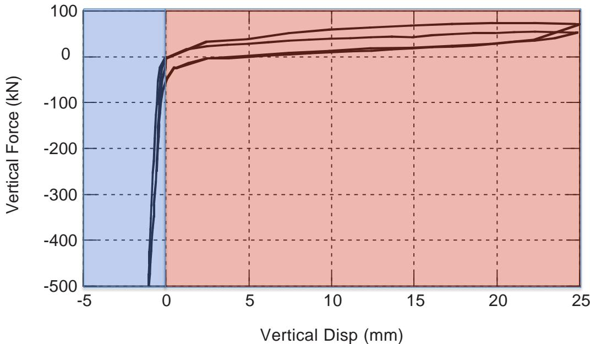  
图4.1：高阻尼橡胶支座（HDBR）的典型滞回曲线。HDRB在压缩和拉伸状态下垂直加载。

对橡胶施加垂直载荷至25mm的垂直伸长（对应于一定的拉伸应变），然后卸载。此加载重复两次，获得的力-位移关系绘制在图11中。如图所示，试件在HDBR处于压缩状态的蓝色区域非常刚性。试件在进入红色区域时变得柔软得多，此时处于拉伸状态。对于此类试件，在整个混合仿真测试中使用单一控制模式是不够的。如果试件仅在DC模式下测试，当试件进入蓝色区域时，控制系统无法充分施加小位移。另一方面，如果试件仅在FC模式下，当试件进入红色区域时，控制系统无法施加小力。在单次混合仿真测试中必须使用两种控制模式。需要一种在控制模式之间切换的机制。HDBR表现出的这种行为在结构测试中的其他试件中也很常见。许多试件在测试过程中屈服并变软。在大多数情况下，使用DC模式的执行器进行测试是令人满意的。然而，在某些情况下，试件初始非常刚性，FC模式更适合该任务。在混合仿真中，通常对创新的结构构件进行实验测试，这种具有非常刚性试件的情况可能较为常见。

### 4.1.3 以往研究

有一些但不多研究人员进行过SC混合仿真。Pan等人[18]作为他们在第3.1.3节中介绍的研究的一部分，对HDBR在垂直加载方向进行了SC混合仿真。他们使用试算力的符号作为在力和位移控制模式之间切换的标准。由于他们通过运行准静态循环测试预先了解HDBR的滞回行为，他们知道该支座在压缩时非常刚性，在拉伸时非常柔软。当试算力为负或处于压缩状态时，他们使用力控制。当试算力为正或处于拉伸状态时，他们使用位移控制。强制执行加载限制以防止大的试算力和位移施加到试件上。

Elkhoraibi和Mosalam[7]也作为他们在第3.1.3节中介绍的研究的一部分进行了切换控制混合仿真。算法4.1显示了在每个时间步$n$切换控制模式的算法。Elkhoraibi和Mosalam使用了两个在位移和力控制模式之间切换的标准：割线刚度$k$和恢复力$f$。切换阈值事先定义。测量的刚度$k_i$和力$f_i$与切换阈值进行比较。$k_d$和$k_f$分别是位移和力的刚度阈值，其中$k_d < k_f$。恢复力阈值$f_d$和$f_f$以相同方式设置。缓冲区域防止了由$k$的小波动引起的来回切换。

Algorithm 4.1 Elkhoraibi和Mosalam[7]的时间步$n$模式切换算法  
定义限制$k_{d},K_{f},f_{d}$和$f_{f}$，其中$k_{d} < k_{f}$且$f_{d} < f_{f}$  
计算$k_{n}$和$f_{n}$  
如果$\text{ctrl}_{n - 1} = \text{DC}$则  
&nbsp;&nbsp;如果$k_{n} > k_{f}$且$|f_n| > f_f$则  
&nbsp;&nbsp;&nbsp;&nbsp;设置$\text{ctrl}_n = \text{FC}$  
&nbsp;&nbsp;否则  
&nbsp;&nbsp;&nbsp;&nbsp;设置$\text{ctrl}_n = \text{ctrl}_{n - 1}$  
&nbsp;&nbsp;结束如果  
否则如果$\text{ctrl}_{n - 1} = \text{FC}$则  
&nbsp;&nbsp;如果$k_{n} < k_{d}$或$|f_n| < f_d$则  
&nbsp;&nbsp;&nbsp;&nbsp;设置$\text{ctrl}_n = \text{DC}$  
&nbsp;&nbsp;否则  
&nbsp;&nbsp;&nbsp;&nbsp;设置$\text{ctrl}_n = \text{ctrl}_{n - 1}$  
&nbsp;&nbsp;结束如果  
结束如果

## 4.2 SC混合仿真的方法

SC混合仿真的方法与第3.2节讨论的FC混合仿真方法相关联，因为部分仿真处于FC模式。本节介绍的每种切换策略都利用所有不同的FC方法。本节开发了两种类型的切换策略。第一种是基于试算力的切换。第二种是基于试件割线刚度的切换。两种策略都必须包含缓冲区域以避免不必要的控制模式切换或控制模式抖动。每种策略都有其优点和缺点。

### 4.2.1 基于试算力的切换策略

执行器控制模式的切换可以基于计算的试算力。这确实是Pan等人[18]所做的。在仿真开始前确定预定义的切换限制。当达到此限制或阈值时，控制模式切换。切换限制可以来自任何响应量，如位移、速度、加速度和力。速度和加速度不是好的候选，因为它们难以控制。使用位移值作为切换限制更可行。位移值相对容易控制和读取。然而，基于位移值进行切换并不是结构测试中的最佳方式。试件经常经历永久变形，导致位移偏移。在这种情况下，试件偏离线性时的位移限制发生变化。预定义的位移切换限制不再能准确检测试件行为的变化。

基于计算的试算力$\breve{f}$切换控制模式优于基于试算位移$\breve{u}$切换。确实，随着一些试件在测试过程中经历越来越多的损伤，其承受施加力的能力会退化。因此，预定义的力切换限制不再有效。然而，试件抗力的退化通常比混合仿真测试过程中发生的永久变形更加渐进和可预测。这种退化可以通过缩放力限制来预测。试算力使用第3.2节介绍的方法计算。

软化和硬化试件确定控制模式的算法分别显示在算法4.2和4.3中。这些是Elkhoraibi和Mosalam[7]开发的算法4.1的修改版本。在此算法中实现了缓冲，以避免当连续试算力接近力限制时控制模式抖动。$f_d$和$f_f$分别是从FC模式切换到DC模式和从DC模式切换到FC模式的力限制。$f_d$和$f_f$在仿真开始前预定义，必须仔细确定。如果$f_d$和$f_f$之间的跨度太大，控制模式可能无法正确切换。另一方面，如果跨度太小，则无法避免控制模式抖动。

力限制切换的一个优点是它易于实现且算法简单。它对某些类型的试件效果很好。一个主要缺点是，需要预先了解试件的行为才能有效设置力限制和缓冲参数。本质上，研究人员必须知道试件行为何时会改变。因此，当试件行为未知或无法进行合理预测时，力限制切换不适用。

Algorithm 4.2 软化试件在时间步$n$的力限制切换策略  
定义限制$f_{d}$和$f_{f}$，其中$f_{d}>$  
计算$\check{f}_n$  
如果ctrlMode $n - 1 = \text{DC}$则  
&nbsp;&nbsp;如果$|\check{f}_n| < f_f$则  
&nbsp;&nbsp;&nbsp;&nbsp;设置ctrlMode $n = \text{FC}$  
&nbsp;&nbsp;否则  
&nbsp;&nbsp;&nbsp;&nbsp;设置ctrlMode $n =$ ctrlMode $n - 1$  
&nbsp;&nbsp;结束如果  
否则如果ctrlMode $n - 1 = \text{FC}$则  
&nbsp;&nbsp;如果$|\check{f}_n| > f_d$则  
&nbsp;&nbsp;&nbsp;&nbsp;设置ctrlMode $n = \text{DC}$  
&nbsp;&nbsp;否则  
&nbsp;&nbsp;&nbsp;&nbsp;设置ctrlMode $n =$ ctrlMode $n - 1$  
&nbsp;&nbsp;结束如果  
结束如果

Algorithm 4.3 软化试件在时间步$n$的力限制切换策略  
定义限制$f_{d}$和$f_{f}$，其中$f_{d} < f_{f}$  
计算$\check{f}_{n}$  
如果ctrlMode $n - 1 = \text{DC}$则  
&nbsp;&nbsp;如果$|\check{f}_n| > f_f$则  
&nbsp;&nbsp;&nbsp;&nbsp;设置ctrlMode $n = \text{FC}$  
&nbsp;&nbsp;否则  
&nbsp;&nbsp;&nbsp;&nbsp;设置ctrlMode $n =$ ctrlMode $n - 1$  
&nbsp;&nbsp;结束如果  
否则如果ctrlMode $n - 1 = \text{fFC}$则  
&nbsp;&nbsp;如果$|\check{f}| < f_d$则  
&nbsp;&nbsp;&nbsp;&nbsp;设置ctrlMode $n = \text{DC}$  
&nbsp;&nbsp;否则  
&nbsp;&nbsp;&nbsp;&nbsp;设置ctrlMode $n =$ ctrlMode $n - 1$  
&nbsp;&nbsp;结束如果  
结束如果

### 4.2.2 基于割线刚度的切换策略

割线刚度值可用作切换控制模式的标准。割线刚度值给出切线刚度值的估计。它可用于检测试件的软化或硬化行为。时间步$n$的割线刚度值计算为$sec_n = (\bar{f}_{n-1} - \bar{f}_{n-2}) / (\bar{u}_{n-1} - \bar{u}_{n-2})$。该值从前两个时间步的测量位移和力值计算，不使用任何子步的值。一旦确定了切换的割线限制，它的工作方式与硬化试件的力限制切换相同。然而，这一个算法对软化和硬化试件都适用。算法4.4显示了割线限制切换中确定控制模式的策略。$k_d$和$k_f$分别是从FC切换到DC和从DC切换到FC的割线刚度限制。割线刚度的绝对值$sec_n$不用于确定控制模式。这是因为无论这些值的大小如何，对于开始表现出负刚度值的试件都使用DC。

Algorithm 4.4 时间步$n$的割线限制切换策略  
定义限制$k_{d}$和$k_{f}$，其中$k_{d} < k_{f}$  
计算$\sec n$  
如果ctrlMode $n - 1 = \text{DC}$则  
&nbsp;&nbsp;如果$\sec_n > k_f$则  
&nbsp;&nbsp;&nbsp;&nbsp;设置ctrlMode $n = \text{FC}$  
&nbsp;&nbsp;否则  
&nbsp;&nbsp;&nbsp;&nbsp;设置ctrlMode $n =$ ctrlMode $n - 1$  
&nbsp;&nbsp;结束如果  
否则如果ctrlMode $n - 1 = \text{FC}$则  
&nbsp;&nbsp;如果$\sec_n < f_d$则  
&nbsp;&nbsp;&nbsp;&nbsp;设置ctrlMode $n = \text{DC}$  
&nbsp;&nbsp;否则  
&nbsp;&nbsp;&nbsp;&nbsp;设置ctrlMode $n =$ ctrlMode $n - 1$  
&nbsp;&nbsp;结束如果  
结束如果

与力限制切换不同，实现此方法不需要预先了解试件的行为。该算法通过计算试件的割线刚度值来检测试件何时改变其行为。该值可以从控制系统的调谐参数确定。对于给定的一组控制系统调谐参数，可以确定控制系统在力控制下变得不稳定或跟踪性能下降的割线刚度值限制。这是因为试件的刚度对控制系统的比例增益有贡献。切换的割线限制不依赖于试件，而是依赖于控制系统。鉴于控制系统可能比试件更频繁地被重复使用，这比力限制切换是更有效的切换策略。割线限制切换的一个缺点是它容易受到虚假更新的影响，如第3章所讨论的。这可能导致混合仿真测试过程中不必要的控制模式切换。因此，必须使用滤波器来防止控制系统噪声导致

割线刚度值更新。

## 4.3 实现

如前所述，SC混合仿真使用FC混合仿真的方法。因此，每种SC策略都使用所有FC方法实现。力限制切换策略使用CFC和EFC方法。使用CFC方法的力限制切换策略称为点切换控制（PSC），因为切换发生在预定义的点。使用EFC方法的力限制切换策略称为平衡点切换控制（EPSC）。使用CFC和EFC方法的割线限制切换策略分别命名为割线切换控制（SSC）和平衡割线切换控制（ESSC）。

### 4.3.1 切换的兼容性方法

PSC和SSC策略在OpenFresco的ECxPCtargetSwitchCM实验控制类中实现。类定义与图A.6中给出的ECxPCtargetForce的类定义非常相似。OpenFresco从计算驱动器接收试算变形，如图4.2所示。在OpenFresco中，ECxPCtargetSwitchCM从实验设置类接收试算位移。然后使用CFC方法计算$\breve{f}_n$。$\breve{f}_n$通过算法4.2或4.3传递以设置控制模式。它将控制模式和适当的试算值发送到控制系统。

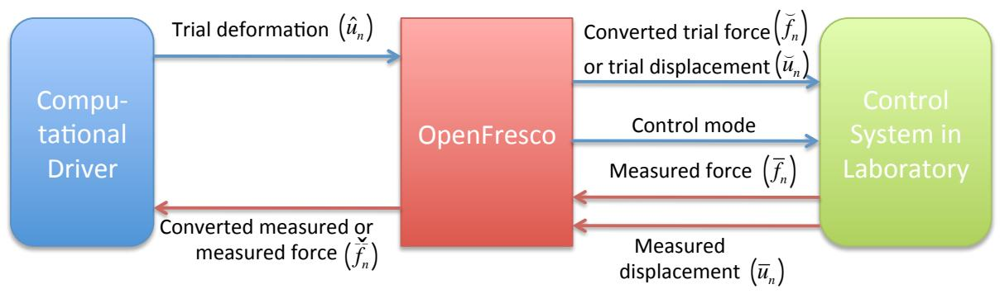  
图4.2：SC混合仿真组件及其流程。

如果使用SSC，ECxPCtargetSwitchCM通过算法4.4传递$sec_n$以确定控制模式。$sec_n$在时间步$n-1$的获取方法中从前两个时间步$n-1$和$n-2$的测量位移和力对计算。使用测量值而不是试算值，因为测量值给出试件更准确的状态。由于试算力是从试算位移计算的，且只有一个施加到试件上，试算位移和力对不能给出试件准确的状态。至少一个未施加到试件上的试算值可能不等于其测量对应值。ECxPCtargetSwitchCM在计算下一个割线刚度计算的割线刚度值后存储测量对。如果增量测量位移和力不大于控制系统的噪声限制，则不更新割线刚度。

MTS-STS控制器在切换到另一种控制模式时将反馈值设置为新的零点。这意味着如果控制器处于DC模式且力反馈为1千磅，当切换到FC模式时，控制器将所有指令力偏移1千磅。例如，如果ECxPCtargetSwitchCM计算2千磅的试算力，MTS-STS控制器将尝试对试件施加3千磅。因此，ECxPCtargetSwitchCM对此行为进行补偿。它在内存中保留控制模式切换时的反馈值。然后在发送到控制器之前，用内存中的反馈值偏移试算值。继续前面的例子，当ECxPCtargetSwitchCM计算3千磅的试算力时，它将3千磅偏移2千磅并发送1千磅到控制器。控制器然后对试件施加3千磅。ECxPCtargetSwitchCM对DC和FC模式都这样做。MTS-STS不以任何方式偏移测量值，仅偏移指令值。

### 4.3.2 切换的平衡方法

EPSC和ESSC策略的大部分在Matlab中编程。它是第3.3.2节讨论内容的扩展。以下是SC混合仿真所需的附加函数：

• simpleYield - 此函数使用算法4.2或4.3在SC混合仿真期间设置控制模式，有一个例外。使用上一步的力而不是当前时间步计算的试算力来确定控制模式。第3.3.2节的位移时间积分和力时间积分方案是此函数的参数。每个时间步的位移和力作为主函数中的全局变量存储。主函数中的位移和力对被传递到为下一步选择的任何时间积分方案。此函数仅用于数值模型。
• simpleYieldExperimental - 这与simpleYield相同，但用于混合模型。由于与MTS-STS控制系统的交互，需要与第3.3.2节的Experimental元素不同的函数。
• secantUpdate - 此函数使用算法4.4确定控制模式。除此之外，它的操作与simpleYield函数相同。它具有位移时间积分和力时间积分方案的参数。此函数仅用于数值模型。
• secantUpdateExperimental - 此函数与secantUpdate相同，但用于混合模型和Experimental元素。

数值函数simpleYield和secantUpdate需要获得实际仿真如何进行的好概念，将地面运动缩放到适当水平而不超过控制系统限制。它对调试Matlab脚本也很有用。

OpenFresco中的ECxPCtargetSwitchEM实验控制类处理从Matlab函数到Simulink/Stateflow模型的所有通信。ECxPCtargetSwitchEM

从Matlab函数接收控制模式和适当的试算值。ECxPCtargetSwitchEM不确定控制模式。控制模式由Matlab函数设置，然后计算试算值。需要单独的实验控制用于平衡切换策略，因为与PSC和SSC不同，试算位移和力对不可用。试算力直接从EFC方法计算，而不是从试算位移计算。因此，在每个时间步只计算两个试算值中的一个。因此，ECxPCtargetSwitchEM不能与EPSC和ESSC一起使用。ECxPCtargetSwitchEM不需要滤波器。上一节讨论的偏移由simpleYieldExperimental和secantUpdatedExperimental函数执行。这就是为什么数值模型和混合模型需要单独的函数。ECxPCtargetSwitchEM不执行试算值的偏移。

### 4.3.3 Simulink/Stateflow模型

SC混合仿真的预测-校正Simulink/Stateflow模型相当复杂，因为它必须对两种控制模式进行预测和校正。图4.3显示了SC混合仿真的Simulink模型。它与FC Simulink模型（图4.3）的不同之处在于，SC Simulink模型写入三个不同的SCRAMNet存储位置：ctrl modes、displ cmds和force cmds。MTS-STS控制器读取ctrl modes存储位置中的0作为DC模式，1作为FC模式。

图4.4显示了图4.3中xPC Target Hybrid Controller (S1S1)块所表示的内容。ctrlMode（控制模式）和targVal（目标值）从ECxPCtargetSwitchCM或ECxPCtargetSwitchEM接收。所有控制策略对SC混合仿真使用相同的Simulink模型。测量位移和力的移动平均值被发送回OpenFresco实验控制对象。Switch和Switch1块根据控制模式将targVal或反馈值馈送到Stateflow模型。如果使用FC模式，Switch1块将frc（力）设置为targVal，Switch块将dsp（位移）设置为反馈位移。在DC模式下，Switch1块将反馈力设置为frc，Switch块将dsp设置为targVal。如果Switch和Switch1块未发送targVal，则它们发送到Stateflow模型的内容无关紧要，因为Stateflow模型最终会将这些值归零。

**混合控制器**

  
图4.3：在nees@berkeley实验室使用xPC Target实时工作室与SCRAMNet进行SC混合仿真的SimuLink模型。

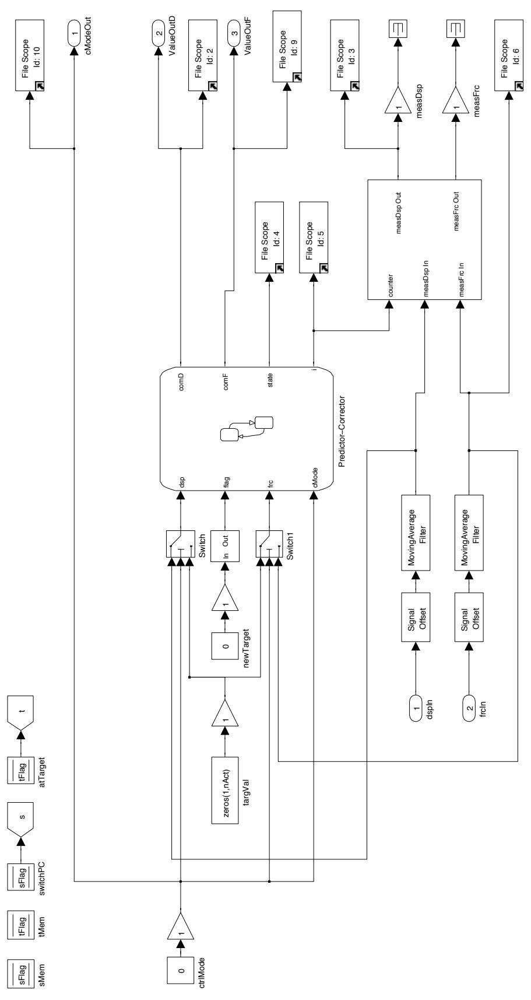  
图4.4：这表示为图4.3中的xPC Target Hybrid Controller (S1S1)。它包含Stateflow模型和

Stateflow模型（图4.5）执行位移和力的实际预测和校正。此Stateflow模型本质上将图3.10中的FC Stateflow模型和DC Stateflow模型连接在一起。图的顶部包含DC模式的CorrectDisp、PredictDisp和AutoSlowDownDisp状态。底部包含FC模式的相同三个状态。与其FC对应物中的flag变量一起，它还有另一个变量cMode，指定何时离开其当前状态以及下一步应该移动到哪个状态。flag让Stateflow模型知道何时设置了新的targVal。cMode是从OpenFresco接收的控制模式。

从Correct状态，它可以移动到相同控制模式或另一控制模式的Predict状态。从Predict状态，它可以移动到两个控制模式之一的Correct状态或相同控制模式的AutoSlowDown状态。从AutoSlowDown状态，它可以移动到相同控制模式的Correct状态或另一控制模式的Correct状态。这些移动由flag和cMode变量控制。

每次Stateflow模型进入其中一个Correct状态时，它使用C函数setNewDsp和setNewFrc分别存储dsp和frc值。这些存储值用于校正、预测和自动减速。S1S1混合控制器使用线性插值进行校正，使用线性外推进行预测和自动减速。Correct状态在Stateflow模型进入该状态时清零另一控制模式的存储值。这有助于控制模式的平滑切换。因为插值和外推使用先前存储的值，并且因为控制器在切换模式时用反馈值偏移，除非用于插值和外推的先前记录值被清零，否则控制模式的过渡不会平滑切换。否则，它将使用切换前的存储值和新目标值进行插值和外推。这会导致Correct和Predict状态功能不正确，因为零点已从控制模式切换中改变。所有SC混合仿真测试的仿真时间步设置为0.10秒。

  
图4.5：根据控制模式预测和校正位移或力的Flow预测-校正模型。它具有自动减速功能以防止

## 4.4 实验结果与验证

第3章中的相同单跨框架混合模型用于SC混合仿真。此模型在图2.1中展示，其属性在表3.3中提供。表2.1中的相同OpenFresco配置也被利用，实验控制类除外。不使用xPCtarget和xPCtargetForce，而是使用xPCtargetSwitchCM和xPCtargetSwitchEM。第3章中的1自由度$\mu$-NEES实验设置（图3.11）带有两个夹具中的试件（图3.13）用于这些测试。

SC混合仿真仅使用单跨框架模型和1自由度$\mu$-NEES设置进行，而不使用2自由度模型和2自由度$\mu$-NEES设置。应为每个控制自由度单独考虑控制模式切换。假设所有控制自由度在整个仿真中同时切换到相同控制是不明智的。当有多个控制自由度时，最好使用混合控制混合仿真。此主题在下一章讨论。仅进行非线性混合仿真以测试SC混合仿真方法，因为仅当1自由度设置开始软化时才需要SC混合仿真。因此，地面运动缩放到40%，与FC非线性混合仿真结果进行比较。

SC混合仿真实验使用表3.2中参数的NME、αOS、NMF和NMR时间积分方案。这些结果与图3.17和3.18以及表3.8中的OpenSees数值结果进行比较。如前一章所述，NME和αOS在1自由度OpenSees数值模型中不收敛（图3.16）。因此，NME和αOS实验结果与NMR数值结果进行比较。NME和αOS时间积分方案使用20个子步以防止控制系统变得不稳定。表4.1和4.2分别显示了与数值对应物的位移和力误差。这些表包含绝对误差的最小值、平均值和最大值。支持这些误差值的图在附录D中提供。第3章中的DC和FC误差值也出现在这些表中用于比较。

对于PSC和EPSC混合仿真，4千磅是切换点，$f_d$和$f_f$设置为预定义切换点的10%。$f_d = 4.4$千磅和$f_f = 3.6$千磅。这些值从DC和FC混合仿真结果确定。4千磅是试件刚开始屈服的点。对于SSC和ESSC混合仿真，切换的割线刚度值为25千磅/英寸。$k_d$和$k_f$设置为25千磅/英寸的10%。测量位移和力以0.005滤波，意味着如果在给定时间步的增量测量位移和力不大于0.005，则不用于更新割线刚度。

首先查看表4.1和4.2中的结果，可以看到PCS和SSC策略对所有时间积分方案都有效，而CFC方法仅对NMF有效。CFC方法在FC混合仿真中对其他三种时间积分方案变得不稳定。EPSC和ESSC策略仍然仅与NMF配合使用。

DC误差最低，对于NME和αOS略优于SSC误差，但对于NMF和NMR则不是。SSC结果总体上更一致。EPSC和ESSC给出与SSC相当的NMR结果。PSC结果也非常可与其他结果相比，除了αOS结果。力误差给出与位移误差非常相似的结果。NME的DC误差最低。图4.6绘制了使用NME的PSC的试算力和控制模式。当控制模式为零时，处于DC模式。当控制大于零时，处于FC模式。它在仿真的大部分时间处于FC模式。每次控制模式从FC切换到DC时，试算力似乎有抖动。图4.7显示了割线刚度值的控制模式。与前一图不同，控制大部分时间处于DC模式。即使在对控制系统噪声进行滤波后，割线刚度值仍然有些噪声。使用SSC切换控制模式时，试算力不会抖动。这可以从附录D中MTS-STS控制器的指令和测量力图验证。图4.6和4.7与其他时间积分方案的PSC和SSC结果相似。

表4.1：各种时间积分方法在有限元分析水平上1自由度设置非线性SC混合仿真的位移结果绝对误差。包括DC、CFC和EFC结果用于比较。

| 控制方法 | NME (英寸) | αOS (英寸) | NMF (英寸) | NMR (英寸) |
|---|---|---|---|---|
| DC-最小值 | 2.84×10⁻⁵ | 7.30×10⁻⁷ | 1.64×10⁻⁵ | 1.68×10⁻⁵ |
| DC-平均值 | 0.0266 | 0.0288 | 0.114 | 0.0711 |
| DC-最大值 | 0.116 | 0.118 | 0.357 | 0.253 |
| CFC-最小值 | N/A | N/A | 1.14×10⁻⁵ | N/A |
| CFC-平均值 | N/A | N/A | 0.0409 | N/A |
| CFC-最大值 | N/A | N/A | 0.143 | N/A |
| PSC-最小值 | 2.12×10⁻⁵ | 6.34×10⁻⁶ | 2.11×10⁻⁵ | 2.49×10⁻⁵ |
| PSC-平均值 | 0.0410 | 0.0816 | 0.0433 | 0.0422 |
| PSC-最大值 | 0.104 | 0.300 | 0.204 | 0.147 |
| SSC-最小值 | 8.00×10⁻⁶ | 1.40×10⁻⁵ | 6.67×10⁻⁵ | 6.94×10⁻⁶ |
| SSC-平均值 | 0.0341 | 0.0315 | 0.0397 | 0.0419 |
| SSC-最大值 | 0.112 | 0.122 | 0.177 | 0.150 |
| EFC-最小值 | N/A | N/A | N/A | 1.28×10⁻⁴ |
| EFC-平均值 | N/A | N/A | N/A | 0.0922 |
| EFC-最大值 | N/A | N/A | N/A | 0.280 |
| EPSC-最小值 | N/A | N/A | N/A | 6.02×10⁻⁵ |
| EPSC-平均值 | N/A | N/A | N/A | 0.0339 |
| EPSC-最大值 | N/A | N/A | N/A | 0.161 |
| ESSC-最小值 | N/A | N/A | N/A | 9.82×10⁻⁶ |
| ESSC-平均值 | N/A | N/A | N/A | 0.0322 |
| ESSC-最大值 | N/A | N/A | N/A | 0.0989 |

图4.8绘制了EPSC与NMR的控制模式和试算力随时间的变化。使用此策略切换控制模式时，试算力没有抖动。与PSC一样，控制模式的大部分处于FC模式。图4.9显示了ESSC与NMR的割线刚度。割线刚度值比SSC波动更大。这是因为没有使用滤波器进行割线更新。然而，ESSC不使用割线来计算试算力。与SSC对应物不同，控制模式在仿真的大部分时间处于FC模式。

表4.3中的控制系统误差说明，控制系统在FC模式下对SC混合仿真的跟踪优于FC混合仿真。SC混合仿真在两种控制模式下都有误差结果。

表4.2：各种时间积分方法在有限元分析水平上1自由度设置非线性SC混合仿真的力结果绝对误差。包括DC、CFC和EFC结果用于比较。

| 控制方法 | NME (千磅) | αOS (千磅) | NMF (千磅) | NMR (千磅) |
|---|---|---|---|---|
| DC-最小值 | 0.00150 | 9.60×10⁻⁴ | 5.20×10⁻⁴ | 0.00972 |
| DC-平均值 | 0.394 | 0.435 | 0.804 | 1.28 |
| DC-最大值 | 2.03 | 2.08 | 4.05 | 5.42 |
| CFC-最小值 | N/A | N/A | 6.65×10⁻⁴ | N/A |
| CFC-平均值 | N/A | N/A | 0.593 | N/A |
| CFC-最大值 | N/A | N/A | 2.34 | N/A |
| PSC-最小值 | 1.14×10⁻⁴ | 4.83×10⁻⁴ | 6.45×10⁻⁴ | 9.37×10⁻⁴ |
| PSC-平均值 | 0.486 | 0.794 | 0.561 | 0.586 |
| PSC-最大值 | 3.26 | 6.24 | 2.31 | 2.19 |
| SSC-最小值 | 2.46×10⁻⁴ | 3.00×10⁻⁵ | 2.53×10⁻⁴ | 1.27×10⁻⁴ |
| SSC-平均值 | 0.407 | 0.447 | 0.582 | 0.601 |
| SSC-最大值 | 2.13 | 2.17 | 2.55 | 2.23 |
| EFC-最小值 | N/A | N/A | N/A | 0.00700 |
| EFC-平均值 | N/A | N/A | N/A | 1.26 |
| EFC-最大值 | N/A | N/A | N/A | 5.77 |
| EPSC-最小值 | N/A | N/A | N/A | 7.06×10⁻⁴ |
| EPSC-平均值 | N/A | N/A | N/A | 0.771 |
| EPSC-最大值 | N/A | N/A | N/A | 3.03 |
| ESSC-最小值 | N/A | N/A | N/A | 0.0012 |
| ESSC-平均值 | N/A | N/A | N/A | 0.702 |
| ESSC-最大值 | N/A | N/A | N/A | 2.79 |

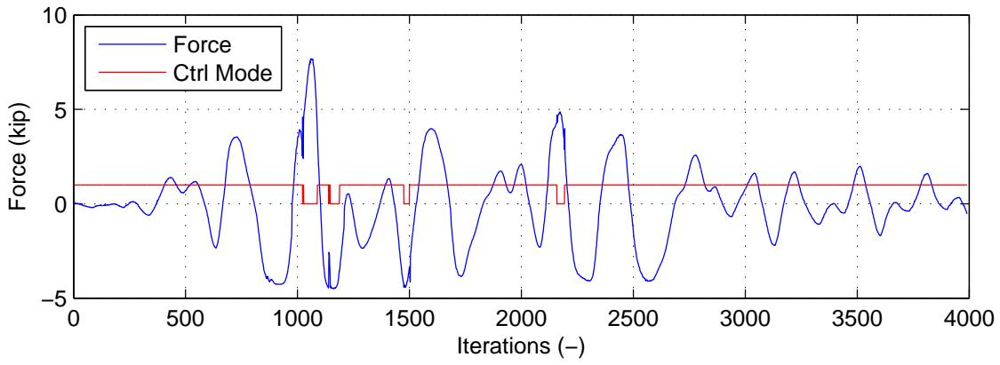  
图4.6：PSC与NME的控制模式和试算力随时间变化的图。

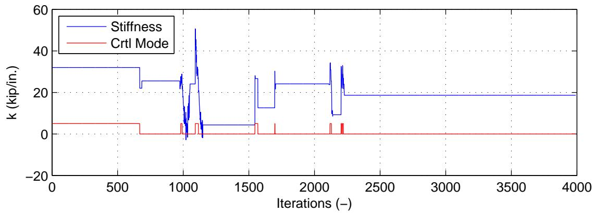

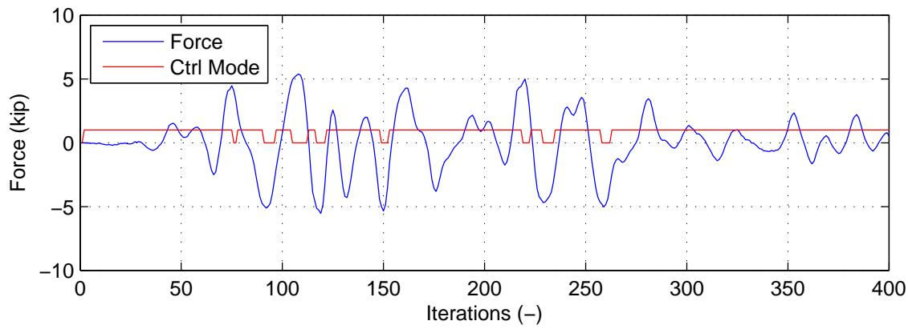  
图4.7：PSC与NME的控制模式和割线刚度值随时间变化的图。

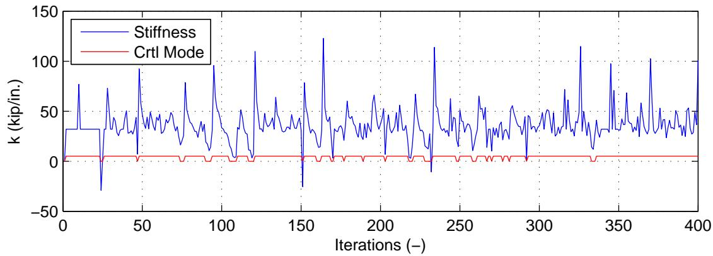  
图4.8：EPSC与NMR的控制模式和试算力随时间变化的图。  
图4.9：ESSC与NMR的控制模式和割线刚度值随时间变化的图。

DC和FC模式。SC混合仿真在DC模式下的跟踪性能与DC混合仿真相当。DC、FC和SC混合仿真结果在DC和FC模式中的误差值彼此相似。FC模式误差约为DC误差的34倍。34千磅/英寸是试件的线性刚度。附录D中NME、αOS、NMF的所有指令位移和力图对于混合仿真都是理想的。指令曲线相当平滑。所有类型混合仿真中NMR的指令位移和力图不理想，因为曲线非常锯齿状。这是NMI和NMR的常见行为，因为它们使用牛顿方法求解二次收敛的运动方程。第一次迭代通常产生大的指令值，后续值按比例减小。值得注意的是，所有MTS-STS位移和力误差图在控制器切换控制模式时都表现出测量值的尖峰。

总之，实验结果首先表明SC混合仿真是可实现的，控制模式的切换不会对结果产生不利影响。PSC、SSC、EPSC和ESSC结果与DC结果相当，优于FC结果。基于割线刚度的切换策略在有限元分析水平上产生略优于基于试算力的切换策略的结果。PSC和SSC混合仿真方法更稳健，因为它不会像CFC混合仿真方法那样对NME、αOS和NMR变得不稳定，尽管两者都使用相同的方法计算试算力。在控制系统水平上，所有类型混合仿真的两种控制模式中的总体跟踪性能与1自由度$\mu$-NEES实验设置同样良好。然而，NMR时间积分方案生成的指令值使其不适用于混合仿真。

表4.3：各种时间积分方案在控制系统水平上1自由度设置非线性SC混合仿真的绝对误差。包括DC、CFC和EFC结果用于比较。

| 控制方法 | NME | αOS | NMF | NMR |
|---|---|---|---|---|
| DC-最小值 (英寸) | 1.38×10⁻⁹ | 7.86×10⁻⁹ | 7.94×10⁻⁹ | 3.14×10⁻⁹ |
| DC-平均值 (英寸) | 8.53×10⁻⁴ | 8.20×10⁻⁴ | 0.00167 | 8.66×10⁻⁴ |
| DC-最大值 (英寸) | 0.00513 | 0.00526 | 0.0129 | 0.0181 |
| CFC-最小值 (千磅) | N/A | N/A | 0 | N/A |
| CFC-平均值 (千磅) | N/A | N/A | 0.0328 | N/A |
| CFC-最大值 (千磅) | N/A | N/A | 0.285 | N/A |
| PSC-最小值 (英寸) | 1.33×10⁻⁷ | 5.38×10⁻⁷ | 8.62×10⁻⁹ | 4.93×10⁻⁹ |
| PSC-平均值 (英寸) | 0.00144 | 0.00277 | 9.25×10⁻⁴ | 7.83×10⁻⁴ |
| PSC-最大值 (英寸) | 0.0480 | 0.0788 | 0.0219 | 0.0403 |
| PSC-最小值 (千磅) | 2.38×10⁻⁷ | 2.38×10⁻⁷ | 1.79×10⁻⁷ | 0 |
| PSC-平均值 (千磅) | 0.0452 | 0.0415 | 0.0278 | 0.0276 |
| PSC-最大值 (千磅) | 0.565 | 1.29 | 0.371 | 0.770 |
| SSC-最小值 (英寸) | 1.24×10⁻⁹ | 6.57×10⁻⁹ | 1.19×10⁻⁸ | 1.90×10⁻⁷ |
| SSC-平均值 (英寸) | 0.00110 | 0.00124 | 0.00108 | 0.00248 |
| SSC-最大值 (英寸) | 0.0126 | 0.00532 | 0.00957 | 0.0152 |
| SSC-最小值 (千磅) | 3.73×10⁻⁸ | 2.24×10⁻⁸ | 5.96×10⁻⁸ | 0 |
| SSC-平均值 (千磅) | 0.0393 | 0.0423 | 0.0272 | 0.0250 |
| SSC-最大值 (千磅) | 0.183 | 0.141 | 0.358 | 0.494 |
| EFC-最小值 (千磅) | N/A | N/A | N/A | 0 |
| EFC-平均值 (千磅) | N/A | N/A | N/A | 0.0282 |
| EFC-最大值 (千磅) | N/A | N/A | N/A | 0.640 |
| EPSC-最小值 (英寸) | N/A | N/A | N/A | 9.00×10⁻⁸ |
| EPSC-平均值 (英寸) | N/A | N/A | N/A | 0.00152 |
| EPSC-最大值 (英寸) | N/A | N/A | N/A | 0.0162 |
| EPSC-最小值 (千磅) | N/A | N/A | N/A | 0 |
| EPSC-平均值 (千磅) | N/A | N/A | N/A | 0.0337 |
| EPSC-最大值 (千磅) | N/A | N/A | N/A | 0.141 |
| ESSC-最小值 (英寸) | N/A | N/A | N/A | 3.34×10⁻⁷ |
| ESSC-平均值 (英寸) | N/A | N/A | N/A | 0.00159 |
| ESSC-最大值 (英寸) | N/A | N/A | N/A | 0.01833 |
| ESSC-最小值 (千磅) | N/A | N/A | N/A | 0 |
| ESSC-平均值 (千磅) | N/A | N/A | N/A | 0.0336 |
| ESSC-最大值 (千磅) | N/A | N/A | N/A | 0.181 |

# 第 5 章 混合控制混合仿真  

本章讨论和探索混合控制（MC）混合仿真。明确定义MC混合仿真术语。解释MC混合仿真的挑战。介绍其动机以及以往的研究。然后开发MC混合仿真的方法。描述使用OpenSees、OpenFresco和Simulink/Stateflow模型实现这些方法的过程。本章最后讨论在nees@berkeley实验室使用2自由度$\mu$-NEES设置进行MC混合仿真测试的实验结果。

## 5.1 引言

### 5.1.1 问题定义

混合控制混合仿真术语指的是控制系统同时处于多种控制模式下进行的混合仿真。它类似于第4章的切换控制混合仿真，因为混合控制混合仿真是具有多个控制系统自由度的切换控制混合仿真。例如，如果实验设置有两个执行器，并且两者都在DC和FC模式之间独立切换，则这被称为混合控制混合仿真。在任何给定时间，一个执行器可能处于DC模式，另一个执行器可能处于FC模式。在切换控制混合仿真的情况下，只有1个控制系统自由度。该自由度要么处于DC模式，要么处于FC模式。对于此设置，不能混合控制模式。

混合控制和切换控制这两个术语经常被互换使用。然而，在本章和前一章中对两者进行了严格区分。切换控制混合仿真仅指在控制模式之间切换的1自由度实验设置。混合控制混合仿真指多个控制系统自由度独立切换。也可能存在某些执行器处于DC模式而其他执行器处于FC模式的混合仿真测试，并且这些执行器从不切换控制模式。这也被认为是混合控制混合仿真。

### 5.1.2 动机

当试件根据加载方向表现出非常不同的行为时，就需要MC混合仿真。这些类型的试件在结构测试中很常见。梁柱是建筑和桥梁中非常常见的结构构件。梁柱在轴向方向上比在垂直于轴向的方向上更刚性。当对隔震支座进行实验测试时，通常垂直方向使用FC加载，水平方向使用DC加载。当这些结构构件使用混合仿真进行测试时，通常在整个测试过程中保持垂直或轴向力恒定，并在水平方向对试件施加位移。

在整个测试过程中保持垂直力恒定是不现实的。此力应在测试过程中变化。保持垂直力恒定是因为垂直载荷难以计算和控制。垂直力难以计算是因为水平位移取决于垂直力，反之亦然。当垂直力在混合仿真中变化时，该力的计算与水平位移计算解耦。控制力的困难在第3.1.1节中解释。

### 5.1.3 以往研究

很少有研究人员进行过MC混合仿真。这里综述了两项工作。第一项是Pan等人[18]的工作。前面两章中提到的HDBR相同实验。他们进行了MC混合仿真，垂直自由度在DC和FC之间切换，水平自由度处于DC模式。垂直试算力与水平试算位移解耦，并彼此独立计算。使用初始刚度值计算每个时间步的垂直试算力，而每个时间步的水平试算位移使用DC混合仿真方法计算。然后将两个试算值同时施加到HDBR上。

第二项是Nakata等人[17]的工作，他们进行了一种MC混合仿真来研究轴向加载梁柱的P-Δ效应。他们在其实验设置中使用了伊利诺伊大学厄巴纳-香槟分校的载荷和边界条件箱。通过相应的目标位移以迭代方式对试件施加目标轴向力。使用Broyden更新[2]从测量的位移和力在每个迭代中更新梁柱的轴向刚度，计算目标位移。这不是真正的MC仿真，因为力自由度不是以FC模式控制，而是以DC模式控制以达到目标力。试算力被转换为试算位移，然后将所有控制器自由度的试算位移施加到试件上。迭代执行此过程，直到测量力等于时间步开始时计算的试算力。

## 5.2 MC混合仿真的方法

MC混合仿真的方法是第3.2.1节中CFC方法和第4.2.1节中切换策略的组合。MC混合仿真使用第3.2.1节中的一种CFC方法将

试算位移（$\breve{u}$）向量转换为试算力（$\breve{f}$）向量。然后使用第4.2.1节中的一种切换策略独立确定每个控制自由度的控制模式。每个控制自由度的切换策略由研究人员在测试开始前确定。这意味着可以为每个控制自由度分配不同的策略。因此，在测试过程中可能同时运行多种切换策略。

EFC方法不用于获取MC混合仿真的试算力。可以同时运行基于位移的时间积分方案和基于力的时间积分方案来计算$\breve{u}$和$\breve{f}$以及控制模式。但存在关于测量值$\bar{u}$和$\bar{f}$应如何反馈到NMR时间积分方案的问题。使用2自由度$\mu$-NEES实验设置（图3.20）来说明此障碍。在时间积分方案计算$\breve{u}$和$\breve{f}$之后，切换策略确定顶部执行器处于DC模式，底部执行器处于FC模式。控制系统施加$\breve{u}_{bottom}$和$\breve{f}_{top}$。然后将相应的测量值$\bar{u}$和$\bar{f}$反馈到计算驱动器。计算驱动器现在必须决定将什么测量值反馈到时间积分方案。如果它将$\bar{f}$向量反馈到基于位移的时间积分方案，则$\bar{f}_{bottom}$可能与其计算的底部执行器试算位移不对应。如果以某种方式修改$\bar{f}_{bottom}$以使其与$\breve{u}_{bottom}$更一致，则将试件的不正确状态传递给基于位移的时间积分方案。对于$\bar{u}$和基于力的时间积分方案也存在同样的问题。因此，EFC不作为MC混合仿真的一部分实现。

## 5.3 实现

MC混合仿真的实现与第4.3.1节中PSC和SSC混合仿真的实现非常相似。MC混合仿真需要两个主要组件。第一个是OpenFresco，特别是实验控制组件。第二个组件是MC混合仿真的Simulink/Stateflow模型。这些组件彼此交互并与计算驱动器交互，使MC混合仿真正常运行。

### 5.3.1 OpenFresco MC实验控制

OpenFresco在MC混合仿真中的作用如图5.1所示。与FC和SC混合仿真一样，Openfresco从计算驱动器接收试算变形$(\widehat{\mathbf{u}}_n)$。OpenFresco在实验控制类中将$\hat{\mathbf{u}}_n$转换为$\breve{\mathbf{f}}_n$。用于MC混合仿真的实验控制是xPCtargetMixedCM实验控制。xPCtargetMixedCM是xPCtargetForce和xPCtargetSwitchCM的组合。与xPCtargetForce一样，它将$\breve{\mathbf{u}}_n$传递给ExperimentalSignalFilter类。ExperimentalSignalFilter使用ExperimentalTangentStiff类将$\breve{\mathbf{u}}_n$转换为$\breve{\mathbf{f}}_n$。xPCtargetMixedCM使用指定的切换策略确定每个控制系统自由度的控制模式，并组装控制模式向量。

如图5.1所示，它向控制系统发送这三个向量。控制系统根据控制模式向量施加位移或力。在控制系统成功施加指令值后，它读取测量位移$(\bar{\mathbf{u}}_n)$和力

$(\bar{\mathbf{f}}_n)$并将它们发送回xPXtargetMixedCM。xPXtargetMixedCM将$\bar{\mathbf{u}}_n$转换为力。然后组装$\check{\mathbf{f}}_n$并执行坐标变换。它被发送回计算驱动器。在组装$\check{\mathbf{f}}_n$时，xPXtargetMixedCM放置控制系统自由度在DC模式下的实际测量力，以及控制系统自由度在FC模式下的转换测量力。一旦计算驱动器接收到$\check{\mathbf{f}}_n$，它就移动到下一个时间$n+1$。此过程重复直到仿真完成。

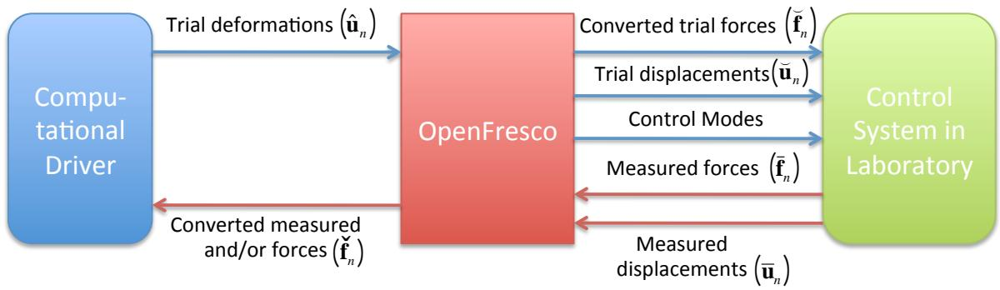  
图5.1：MC混合仿真组件及其流程。

### 5.3.2 Simulink/Stateflow模型

本节介绍的Simlink/Stateflow模型用于MC混合仿真，其中顶部执行器处于DC模式，底部执行器在DC和FC模式之间切换。将此Simulink/Stateflow模型扩展为让两个执行器都在DC和FC模式之间切换是直接的。这会增加图5.4中Stateflow模型的复杂性。为此Simulink/Stateflow模型设计的2自由度$\mu$-NEES实验设置不需要顶部执行器处于FC模式，因为它相对较软，在DC模式下表现更好。

图5.2中的Simulink模型与SC混合仿真的Simulink模型（图4.3）几乎相同。唯一的可见区别是它使用xPC Target Hybrid Controller (M1/M1)而不是用于SC混合仿真的混合控制器。图5.2中不明显的另一个区别是Extract和Assemble块从SCRAMNet存储位置提取和组装二维向量，而不是像SC模型中那样仅提取标量值。

图5.3中的xPC Target Hybrid Controller (M1M1)从xPCtargetMixedCM实验控制接收目标位移（targDsp）、目标力（targFrc）和控制模式（ctrlMode）。这些值与newTarget标志一起传递到Predictor-Corrector Stateflow模型。与FC和SC混合仿真的混合控制器一样，原始测量位移和力在反馈回OpenFresco之前通过移动平均滤波器。

**混合控制器**

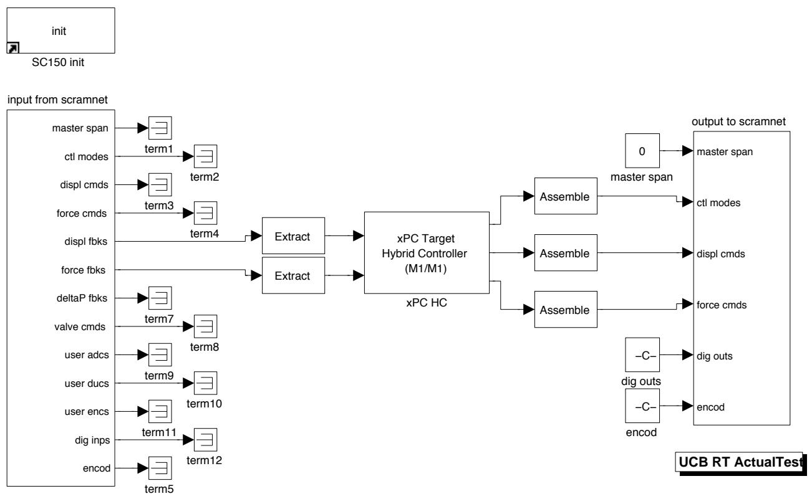  
图5.2：在nees@berkeley实验室使用xPC Target实时工作室与SCRAMNet进行MC混合仿真的SimuLink模型。

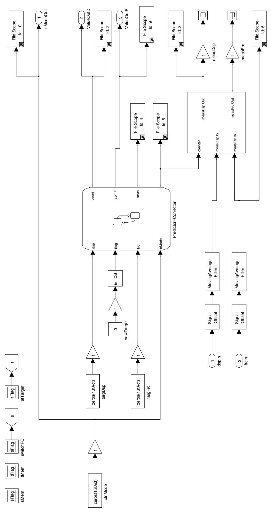  
图5.3：这表示为图4.3中的xPC Target Hybrid Controller (M1M1)。它包含Stateflow模型和

Stateflow模型（图5.4）顶部的三个状态（CorrectDisp、PredictDisp和AutoSlowDownDisp）执行校正和预测位移命令，这些命令被写入SCRAMNet存储器以供MTS-STS控制器使用。这些状态本质上类似于SC Stateflow模型中的三个位移状态。在这些状态中，所有自由度都处于DC模式。

图5.4底部部分的CorrectForce、PredictForce和AutoSlowDown状态更复杂。它们负责预测和校正顶部执行器的位移和底部执行器的力。当Stateflow模型从任何一个位移状态进入CorrectForce和PredictForce状态时，MTS-STS控制器使用顶部执行器的最后测量位移和底部执行器的最后测量力作为新的零点。这与第4.3.3节中讨论的SC Stateflow模型的控制器行为相同，但更复杂，因为现在涉及两个处于不同控制模式的单独控制自由度。

xPCtargetMixedCM在内存中保留这些最后测量值，并用此偏移偏移后续指令值。CorrectForce状态将底部执行器的位移设置为0，并将其存储为当Stateflow模型移动到CorrectDisp和PredictDisp状态时要用于校正和预测的值。否则，插值和外推不会按预期工作，因为底部执行器从FC模式切换到DC模式时的位移指令是偏移值。指示何时到达新目标值的flag变量和底部执行器控制模式的cMode[0]决定状态的切换。所有MC混合仿真测试的仿真时间步设置为0.10秒。

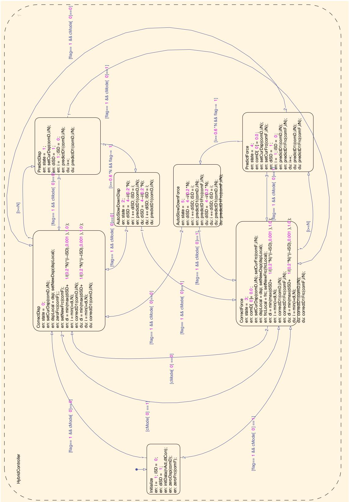  
图5.4：根据控制模式预测和校正位移或力的Flow预测-校正模型。它具有自动减速功能以防止

## 5.4 实验结果与验证

MC混合仿真使用第3章中的2自由度模型（图3.21（右））和2自由度$\mu$-NEES实验设置（图3.20）进行。El Centro地面运动的前400个记录点缩放到50%。OpenFresco配置与表3.13中的相同，只是部署了xPCtargetMixedCM而不是xPCtargetForce。2自由度$\mu$-NEES设置中的顶部执行器始终处于DC模式，底部执行器使用算法4.2和4.4中的两种切换策略之一在DC模式和FC模式之间切换。因此测试了两种类型的MC混合仿真。

使用表3.2中参数的NME、αOS、NMF和NMR时间积分方案。对于每种时间积分方案，将MC结果与第3.4.2.3节中的OpenSees数值结果进行比较。如前所述，NME和αOS时间积分方案在2自由度OpenSees模型中数值上不收敛。因此，这两种时间积分方案的实验结果与NMI数值结果进行比较。使用CFC:Krylov和CFC:Transpose方法进行FC的MC方法会导致MTS-STS控制变得不稳定。因此，后续章节中不呈现这些结果。

如果增量测量位移和力向量的2-范数都不大于0.01，则不更新切线刚度矩阵。此滤波值在测试0.001、0.005和0.02后使用。0.01似乎在不受到控制系统噪声过度影响的情况下频繁更新切线。1-范数和$\infty$-范数在测试期间表现不佳。

### 5.4.1 基于试算力切换的MC混合仿真

本节中的结果来自仅对底部执行器使用力限制切换策略的MC混合仿真（PMC）。力限制设置为5千磅，$f_d = 5.5$千磅和$f_f = 4.5$千磅。这些结果与第3章第3.4.2.3节中的DC和CFC混合仿真结果进行比较。表5.1和5.2包含给定时间积分方案的实验结果与其时间历程分析数值对应物之间的位移误差绝对值。从这些表计算的图在附录E的E.1节中。在第3章中，节点位移结果表明，总体上FC方法优于DC方法。FC方法比DC方法更好地捕捉漂移。两者都给出形状非常相似的曲线。PMC位移误差总体上甚至比DC结果更差。尽管位移-时间历程曲线的形状与DC和CFC曲线相似，但它向相反方向漂移。唯一可与DC和CFC结果相比的是PMC:Broyden位移误差。

表5.3和5.4分别显示了节点1和2的力误差绝对值。对于NME和αOS，PMC给出比DC和CFC方法更好的结果，但对于NMF和NMR则不是。尽管PMC方法不能正确捕捉漂移，但它产生的力与数值结果相对匹配良好。

如表5.5和5.6所示，不带切换控制模式的DC和FC混合仿真的跟踪略优于PMC混合仿真期间底部执行器的跟踪。一个原因是PMC的跟踪不太好，是因为当MTS-STS控制器切换控制模式时，测量值会瞬间尖峰。PMC混合仿真期间顶部执行器在DC模式下的跟踪与DC混合仿真结果大致相同。

表5.1：各种时间积分方法在有限元分析水平上2自由度设置非线性PMC混合仿真的节点1位移结果绝对误差。

| 控制方法 | NME (英寸) | αOS (英寸) | NMF (英寸) | NMR (英寸) |
|---|---|---|---|---|
| PMC:Broyden-最小值 | 2.97×10⁻⁷ | 7.79×10⁻⁸ | 1.05×10⁻⁵ | N/A |
| PMC:Broyden-平均值 | 0.0882 | 0.165 | 0.125 | N/A |
| PMC:Broyden-最大值 | 0.247 | 0.326 | 0.355 | N/A |
| PMC:BFGS-最小值 | 2.97×10⁻⁷ | 1.20×10⁻⁷ | 3.2-×10⁻⁵ | 1.96×10⁻⁵ |
| PMC:BFGS-平均值 | 0.301 | 0.411 | 0.319 | 0.263 |
| PMC:BFGS-最大值 | 0.593 | 0.710 | 0.618 | 0.585 |
| PMC:Intrinsic-最小值 | 4.52×10⁻⁸ | 6.56×10⁻⁸ | 7.64×10⁻⁶ | 1.23×10⁻⁵ |
| PMC:Intrinsic-平均值 | 0.229 | 0.207 | 0.167 | 0.156 |
| PMC:Intrinsic-最大值 | 0.463 | 0.399 | 0.415 | 0.330 |

表5.2：各种时间积分方法在有限元分析水平上2自由度设置PMC非线性混合仿真的节点2位移结果绝对误差。

| 控制方法 | NME (英寸) | αOS (英寸) | NMF (英寸) | NMR (英寸) |
|---|---|---|---|---|
| PMC:Broyden-最小值 | 2.98×10⁻⁷ | 1.45×10⁻⁷ | 2.49×10⁻⁶ | N/A |
| PMC:Broyden-平均值 | 0.688 | 0.926 | 0.827 | N/A |
| PMC:Broyden-最大值 | 1.63 | 1.78 | 2.04 | N/A |
| PMC:BFGS-最小值 | 2.98×10⁻⁷ | 3.23×10⁻⁷ | 7.23×10⁻⁵ | 3.75×10⁻⁵ |
| PMC:BFGS-平均值 | 1.49 | 2.14 | 1.92 | 1.73 |
| PMC:BFGS-最大值 | 2.80 | 3.78 | 3.43 | 3.44 |
| PMC:Intrinsic-最小值 | 6.36×10⁻⁸ | 2.80×10⁻⁷ | 2.65×10⁻⁶ | 3.32×10⁻⁵ |
| PMC:Intrinsic-平均值 | 1.30 | 1.10 | 0.715 | 1.04 |
| PMC:Intrinsic-最大值 | 2.39 | 2.04 | 1.86 | 1.97 |

表5.3：各种时间积分方法在有限元分析水平上2自由度设置非线性PMC混合仿真的节点1力结果绝对误差。

| 控制方法 | NME (千磅) | αOS (千磅) | NMF (千磅) | NMR (千磅) |
|---|---|---|---|---|
| PMC:Broyden-最小值 | 1.37×10⁻⁴ | 7.10×10⁻⁶ | 0.00152 | N/A |
| PMC:Broyden-平均值 | 0.769 | 0.764 | 1.79 | N/A |
| PMC:Broyden-最大值 | 3.53 | 3.85 | 6.97 | N/A |
| PMC:BFGS-最小值 | 5.30×10⁻⁵ | 6.00×10⁻⁶ | 0.00248 | 3.44×10⁻⁴ |
| PMC:BFGS-平均值 | 0.803 | 0.708 | 1.47 | 1.12 |
| PMC:BFGS-最大值 | 3.34 | 3.07 | 5.02 | 3.62 |
| PMC:Intrinsic-最小值 | 1.14×10⁻⁴ | 6.06×10⁻⁵ | 0.00153 | 0.00302 |
| PMC:Intrinsic-平均值 | 0.865 | 0.769 | 1.56 | 1.15 |
| PMC:Intrinsic-最大值 | 3.82 | 3.70 | 5.20 | 4.22 |

表5.4：各种时间积分方法在有限元分析水平上2自由度设置非线性PMC混合仿真的节点2力结果绝对误差。

| 控制方法 | NME (千磅) | αOS (千磅) | NMF (千磅) | NMR (千磅) |
|---|---|---|---|---|
| PMC:Broyden-最小值 | 1.00×10⁻⁶ | 7.10×10⁻⁶ | 4.02×10⁻⁴ | N/A |
| PMC:Broyden-平均值 | 0.175 | 0.202 | 0.300 | N/A |
| PMC:Broyden-最大值 | 0.555 | 0.781 | 1.08 | N/A |
| PMC:BFGS-最小值 | 3.00×10⁻⁷ | 1.05×10⁻⁵ | 8.82×10⁻⁴ | 6.00×10⁻⁶ |
| PMC:BFGS-平均值 | 0.167 | 0.189 | 0.239 | 0.196 |
| PMC:BFGS-最大值 | 0.671 | 0.871 | 0.745 | 0.618 |
| PMC:Intrinsic-最小值 | 6.86×10⁻⁶ | 2.00×10⁻⁵ | 3.00×10⁻⁵ | 9.98×10⁻⁵ |
| PMC:Intrinsic-平均值 | 0.170 | 0.182 | 0.254 | 0.196 |
| PMC:Intrinsic-最大值 | 0.626 | 0.679 | 0.867 | 0.611 |

表5.5：各种时间积分方案在控制系统水平上2自由度设置非线性PMC混合仿真的底部执行器绝对误差。

| 控制方法 | NME | αOS | NMF | NMR |
|---|---|---|---|---|
| PMC:Broyden-最小值 (英寸) | 9.37×10⁻⁸ | 1.22×10⁻⁸ | 1.30×10⁻⁸ | N/A |
| PMC:Broyden-平均值 (英寸) | 7.65×10⁻⁴ | 7.70×10⁻⁴ | 8.04×10⁻⁴ | N/A |
| PMC:Broyden-最大值 (英寸) | 0.00333 | 0.00378 | 0.00900 | N/A |
| PMC:Broyden-最小值 (千磅) | 0 | 0 | 0 | N/A |
| PMC:Broyden-平均值 (千磅) | 0.0330 | 0.138 | 0.0317 | N/A |
| PMC:Broyden-最大值 (千磅) | 0.185 | 0.837 | 0.211 | N/A |
| PMC:BFGS-最小值 (英寸) | 4.99×10⁻⁹ | 6.79×10⁻⁹ | 1.51×10⁻⁷ | 6.52×10⁻⁶ |
| PMC:BFGS-平均值 (英寸) | 6.65×10⁻⁴ | 6.55×10⁻⁴ | 9.03×10⁻⁴ | 0.00216 |
| PMC:BFGS-最大值 (英寸) | 0.00386 | 0.00325 | 0.00332 | 0.00515 |
| PMC:BFGS-最小值 (千磅) | 0 | 0 | 0 | 0 |
| PMC:BFGS-平均值 (千磅) | 0.0286 | 0.0764 | 0.0507 | 0.0368 |
| PMC:BFGS-最大值 (千磅) | 0.253 | 0.306 | 0.219 | 0.277 |
| PMC:Intrinsic-最小值 (英寸) | 4.82×10⁻⁸ | 5.02×10⁻⁸ | 2.50×10⁻⁸ | 1.66×10⁻⁸ |
| PMC:Intrinsic-平均值 (英寸) | 8.84×10⁻⁴ | 8.38×10⁻⁴ | 0.00140 | 7.06×10⁻⁴ |
| PMC:Intrinsic-最大值 (英寸) | 0.00375 | 0.00354 | 0.00557 | 0.00324 |
| PMC:Intrinsic-最小值 (千磅) | 0 | 0 | 0 | 0 |
| PMC:Intrinsic-平均值 (千磅) | 0.0281 | 0.0472 | 0.0563 | 0.0419 |
| PMC:Intrinsic-最大值 (千磅) | 0.178 | 0.227 | 0.398 | 0.323 |

表5.6：各种时间积分方案在控制系统水平上2自由度设置非线性PMC混合仿真的顶部执行器绝对误差。

| 控制方法 | NME | αOS | NMF | NMR |
|---|---|---|---|---|
| PMC:Broyden-最小值 (英寸) | 1.41×10⁻⁸ | 1.25×10⁻⁹ | 8.67×10⁻¹¹ | N/A |
| PMC:Broyden-平均值 (英寸) | 7.38×10⁻⁴ | 9.33×10⁻⁴ | 6.20×10⁻⁴ | N/A |
| PMC:Broyden-最大值 (英寸) | 0.00587 | 0.0475 | 0.00570 | N/A |
| PMC:BFGS-最小值 (英寸) | 1.68×10⁻⁹ | 4.84×10⁻⁹ | 1.06×10⁻⁸ | 1.98×10⁻¹¹ |
| PMC:BFGS-平均值 (英寸) | 5.53×10⁻⁴ | 5.67×10⁻⁴ | 5.40×10⁻⁴ | 5.57×10⁻⁴ |
| PMC:BFGS-最大值 (英寸) | 0.00642 | 0.00497 | 0.00528 | 0.00684 |
| PMC:Intrinsic-最小值 (英寸) | 9.74×10⁻⁹ | 5.14×10⁻⁹ | 2.72×10⁻⁹ | 3.32×10⁻⁹ |
| PMC:Intrinsic-平均值 (英寸) | 7.47×10⁻⁴ | 6.12×10⁻⁴ | 0.00144 | 8.13×10⁻⁴ |
| PMC:Intrinsic-最大值 (英寸) | 0.00579 | 0.00469 | 0.00565 | 0.00564 |

图5.5显示了使用NME的PMC:Broyden的底部执行器力-时间历程曲线和混合仿真测试期间的控制模式。当控制模式为零时，MTS-STS控制器处于DC模式，当它不为零时处于FC模式。这

最匹配数值结果。相比之下，图5.6中的图显示了最差的结果，它使用αOS与BGFS。从图E.10中，BFGS方法在1.5到2秒标记之间开始与数值结果相比向相反方向漂移。这是试件第一次进入非线性区域。通过检查图5.5和5.6，使用NME的PMC:Broyden在此时间段处于DC模式，使用αOS的PMC:BFGS处于FC模式。否则，两者产生几乎相同的控制模式。

  
图5.5：使用NME的PMC:Broyden的底部执行器控制模式和试算力随时间变化的图。

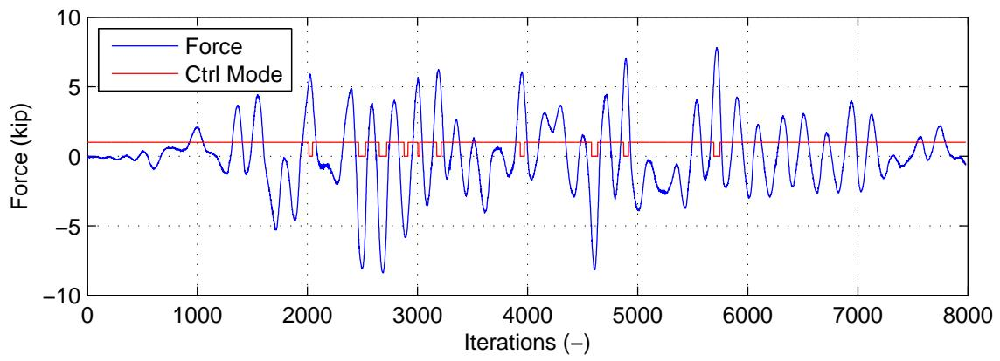  
图5.6：使用αOS的PMC:BFGS的底部执行器控制模式和试算力随时间变化的图。

### 5.4.2 基于割线刚度切换的MC混合仿真

本节介绍使用基于割线刚度切换（SMC）的MC混合仿真结果。割线刚度切换限制设置为50千磅/英寸。$k_d = 45$千磅/英寸。和$k_f = 55$千磅/英寸。初始刚度矩阵的$k_{11}$为81千磅/英寸。表5.7和5.8分别包含节点1和2的绝对位移误差。NMF和NMR结果正确捕捉漂移，除了SMC:BFGS方法。NME和αOS与数值结果匹配不佳。表5.9和5.10显示力误差与DC、FC和PMC混合仿真结果大致处于同一水平。检查力误差时，没有方法或时间积分方案真正突出。表5.11和5.12显示了MTS-STS控制系统的跟踪性能。跟踪性能与其他相似。

表5.7：各种时间积分方法在有限元分析水平上2自由度设置非线性SMC混合仿真的节点1位移结果绝对误差。

| 控制方法 | NME (英寸) | αOS (英寸) | NMF (英寸) | NMR (英寸) |
|---|---|---|---|---|
| SMC:Broyden-最小值 | 0 | 3.45×10⁻⁷ | 9.73×10⁻⁶ | 1.68×10⁻⁵ |
| SMC:Broyden-平均值 | 0.422 | 0.262 | 0.0529 | 0.0677 |
| SMC:Broyden-最大值 | 0.738 | 0.505 | 0.271 | 0.221 |
| SMC:BFGS-最小值 | 5.63×10⁻⁸ | 6.28×10⁻⁸ | 6.39×10⁻⁵ | 5.59×10⁻⁵ |
| SMC:BFGS-平均值 | 0.309 | 0.188 | 0.0731 | 0.400 |
| SMC:BFGS-最大值 | 0.617 | 0.436 | 0.316 | 0.687 |
| SMC:Intrinsic-最小值 | 2.97×10⁻⁷ | 3.20×10⁻⁸ | 2.46×10⁻⁵ | 2.19×10⁻⁵ |
| SMC:Intrinsic-平均值 | 0.356 | 0.137 | 0.162 | 0.0962 |
| SMC:Intrinsic-最大值 | 0.675 | 0.341 | 0.403 | 0.305 |

SMC混合仿真的最佳时间积分方案是NMF。以下图检查了切线刚度估计。Broyden方法（图5.7）最活跃，其次是BFGS（图5.8），然后是Intrinsic（图5.9）。控制模式

表5.8：各种时间积分方法在有限元分析水平上2自由度设置SMC非线性混合仿真的节点2位移结果绝对误差。

| 控制方法 | NME (英寸) | αOS (英寸) | NMF (英寸) | NMR (英寸) |
|---|---|---|---|---|
| SMC:Broyden-最小值 | 2.98×10⁻⁷ | 6.10×10⁻⁷ | 5.09×10⁻⁵ | 5.05×10⁻⁵ |
| SMC:Broyden-平均值 | 2.07 | 1.91 | 0.279 | 0.416 |
| SMC:Broyden-最大值 | 3.59 | 3.62 | 1.19 | 1.16 |
| SMC:BFGS-最小值 | 2.98×10⁻⁷ | 3.33×10⁻⁷ | 7.32×10⁻⁵ | 4.71×10⁻⁵ |
| SMC:BFGS-平均值 | 1.52 | 0.864 | 0.355 | 1.84 |
| SMC:BFGS-最大值 | 3.02 | 2.08 | 1.37 | 3.29 |
| SMC:Intrinsic-最小值 | 2.98×10⁻⁷ | 1.51×10⁻⁷ | 9.40×10⁻⁶ | 6.46×10⁻⁵ |
| SMC:Intrinsic-平均值 | 1.60 | 0.542 | 0.717 | 0.693 |
| SMC:Intrinsic-最大值 | 3.05 | 1.40 | 1.82 | 1.85 |

表5.9：各种时间积分方法在有限元分析水平上2自由度设置非线性SMC混合仿真的节点1力结果绝对误差。

| 控制方法 | NME (千磅) | αOS (千磅) | NMF (千磅) | NMR (千磅) |
|---|---|---|---|---|
| SMC:Broyden-最小值 | 5.87×10⁻⁶ | 1.74×10⁻⁴ | 9.05×10⁻⁴ | 0.00237 |
| SMC:Broyden-平均值 | 0.776 | 1.19 | 1.46 | 1.04 |
| SMC:Broyden-最大值 | 3.55 | 4.27 | 5.02 | 4.87 |
| SMC:BFGS-最小值 | 4.03×10⁻⁴ | 2.85×10⁻⁴ | 6.51×10⁻⁴ | 0.00336 |
| SMC:BFGS-平均值 | 0.814 | 1.28 | 1.42 | 1.12 |
| SMC:BFGS-最大值 | 3.68 | 4.82 | 5.13 | 3.87 |
| SMC:Intrinsic-最小值 | 9.52×10⁻⁵ | 9.04×10⁻⁵ | 2.38×10⁻⁴ | 2.56×10⁻⁴ |
| SMC:Intrinsic-平均值 | 0.798 | 0.984 | 1.38 | 0.894 |
| SMC:Intrinsic-最大值 | 3.35 | 4.45 | 5.03 | 3.40 |

表5.10：各种时间积分方法在有限元分析水平上2自由度设置非线性SMC混合仿真的节点2力结果绝对误差。

| 控制方法 | NME (千磅) | αOS (千磅) | NMF (千磅) | NMR (千磅) |
|---|---|---|---|---|
| SMC:Broyden-最小值 | 7.40×10⁻⁶ | 9.00×10⁻⁶ | 7.14×10⁻⁴ | 6.94×10⁻⁵ |
| SMC:Broyden-平均值 | 0.175 | 0.208 | 0.268 | 0.221 |
| SMC:Broyden-最大值 | 0.865 | 0.704 | 0.887 | 0.870 |
| SMC:BFGS-最小值 | 5.83×10⁻⁵ | 1.30×10⁻⁵ | 2.93×10⁻⁴ | 3.37×10⁻⁴ |
| SMC:BFGS-平均值 | 0.175 | 0.299 | 0.263 | 0.219 |
| SMC:BFGS-最大值 | 0.671 | 1.06 | 0.848 | 0.987 |
| SMC:Intrinsic-最小值 | 1.49×10⁻⁵ | 2.90×10⁻⁵ | 1.21×10⁻⁴ | 2.86×10⁻⁴ |
| SMC:Intrinsic-平均值 | 0.171 | 0.240 | 0.245 | 0.176 |
| SMC:Intrinsic-最大值 | 0.610 | 0.962 | 0.881 | 0.695 |

表5.11：各种时间积分方案在控制系统水平上2自由度设置非线性SMC混合仿真的底部执行器绝对误差。

| 控制方法 | NME | αOS | NMF | NMR |
|---|---|---|---|---|
| SMC:Broyden-最小值 (英寸) | 5.24×10⁻¹⁰ | 2.02×10⁻⁸ | 4.31×10⁻⁹ | 3.04×10⁻⁹ |
| SMC:Broyden-平均值 (英寸) | 9.96×10⁻⁴ | 8.40×10⁻⁴ | 7.85×10⁻⁴ | 9.18×10⁻⁴ |
| SMC:Broyden-最大值 (英寸) | 0.00694 | 0.00493 | 0.00431 | 0.00671 |
| SMC:Broyden-最小值 (千磅) | 0 | 0 | 0 | 0 |
| SMC:Broyden-平均值 (千磅) | 0.0167 | 0.0362 | 0.0130 | 0.0260 |
| SMC:Broyden-最大值 (千磅) | 0.163 | 0.172 | 0.0877 | 0.213 |
| SMC:BFGS-最小值 (英寸) | 2.47×10⁻⁹ | 6.75×10⁻⁹ | 1.60×10⁻⁹ | 1.08×10⁻⁶ |
| SMC:BFGS-平均值 (英寸) | 0.00127 | 0.00130 | 0.00139 | 0.00159 |
| SMC:BFGS-最大值 (英寸) | 0.00515 | 0.00676 | 0.00498 | 0.00329 |
| SMC:BFGS-最小值 (千磅) | 0 | 0 | 0 | 0 |
| SMC:BFGS-平均值 (千磅) | 0.0318 | 0.0471 | 0.0306 | 0.0448 |
| SMC:BFGS-最大值 (千磅) | 0.165 | 0.220 | 0.138 | 0.250 |
| SMC:Intrinsic-最小值 (英寸) | 3.68×10⁻⁹ | 1.29×10⁻⁹ | 3.61×10⁻⁹ | 2.79×10⁻¹⁰ |
| SMC:Intrinsic-平均值 (英寸) | 0.00104 | 0.00119 | 7.80×10⁻⁴ | 9.88×10⁻⁴ |
| SMC:Intrinsic-最大值 (英寸) | 0.00671 | 0.00524 | 0.00409 | 0.00536 |
| SMC:Intrinsic-最小值 (千磅) | 0 | 0 | 0 | 0 |
| SMC:Intrinsic-平均值 (千磅) | 0.0178 | 0.0194 | 0.290 | 0.0295 |
| SMC:Intrinsic-最大值 (千磅) | 0.117 | 0.171 | 0.178 | 0.240 |

表5.12：各种时间积分方案在控制系统水平上2自由度设置非线性SMC混合仿真的顶部执行器绝对误差。

| 控制方法 | NME | αOS | NMF | NMR |
|---|---|---|---|---|
| SMC:Broyden-最小值 (英寸) | 4.69×10⁻⁹ | 2.19×10⁻⁸ | 5.99×10⁻⁹ | 4.15×10⁻⁹ |
| SMC:Broyden-平均值 (英寸) | 7.75×10⁻⁴ | 5.92×10⁻⁴ | 6.88×10⁻⁴ | 0.00134 |
| SMC:Broyden-最大值 (英寸) | 0.00532 | 0.00609 | 0.00531 | 0.00603 |
| SMC:BFGS-最小值 (英寸) | 8.53×10⁻¹⁰ | 6.34×10⁻⁹ | 6.88×10⁻⁹ | 1.98×10⁻⁰⁹ |
| SMC:BFGS-平均值 (英寸) | 6.57×10⁻⁴ | 5.09×10⁻⁴ | 6.35×10⁻⁴ | 6.03×10⁻⁴ |
| SMC:BFGS-最大值 (英寸) | 0.00487 | 0.00538 | 0.00552 | 0.00546 |
| SMC:Intrinsic-最小值 (英寸) | 6.97×10⁻¹⁰ | 1.42×10⁻⁸ | 4.71×10⁻¹⁰ | 6.81×10⁻⁹ |
| SMC:Intrinsic-平均值 (英寸) | 5.53×10⁻⁴ | 5.42×10⁻⁴ | 5.53×10⁻⁴ | 6.22×10⁻⁴ |
| SMC:Intrinsic-最大值 (英寸) | 0.00459 | 0.00415 | 0.00485 | 0.00501 |

在使用BFGS方法时切换最频繁。其他方法仅切换一次控制模式。在这三种方法中，Broyden方法在有限元分析水平上产生最佳结果，但它并不比BFGS方法好多少。Intrinsic方法的误差是BFGS方法误差的两倍。

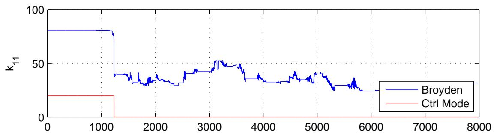


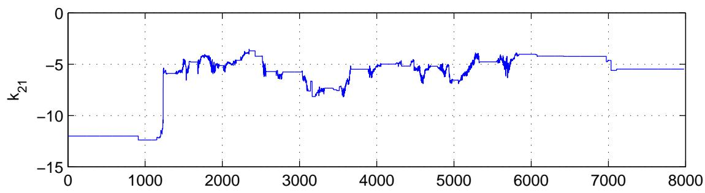

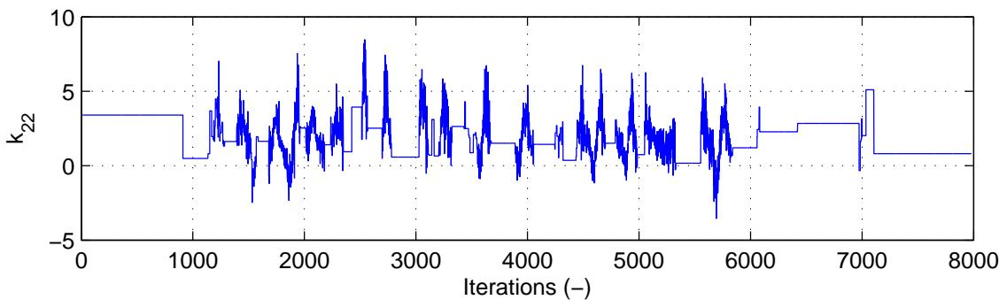  
图5.7：使用NME的PMC:Broyden的底部执行器控制模式和试算力随时间变化的图。

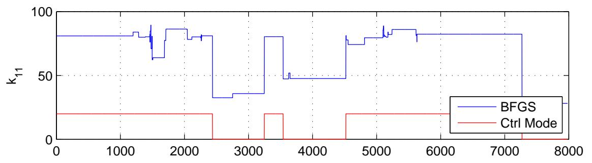

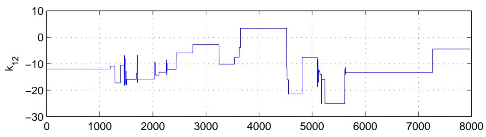

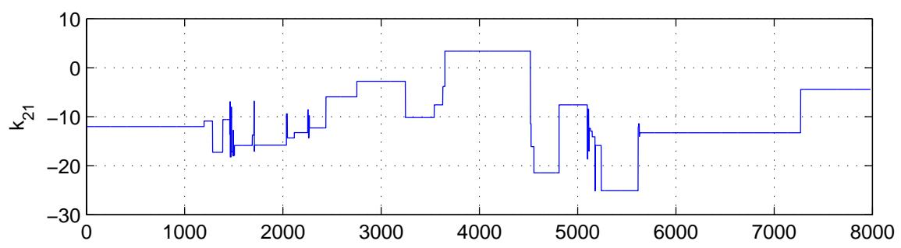

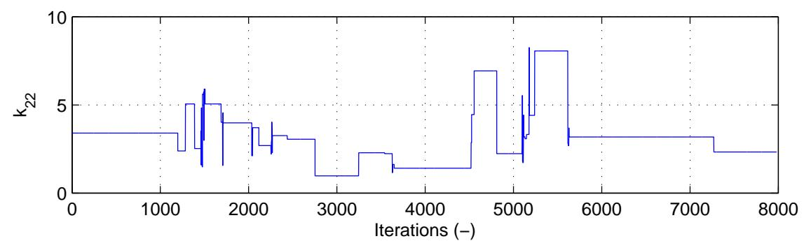  
图5.8：使用αOS的PMC:BFGS的底部执行器控制模式和试算力随时间变化的图。

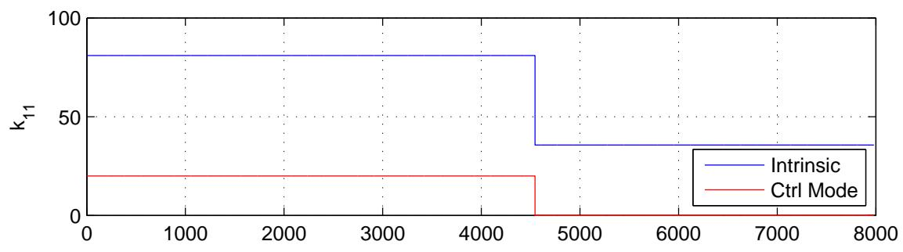

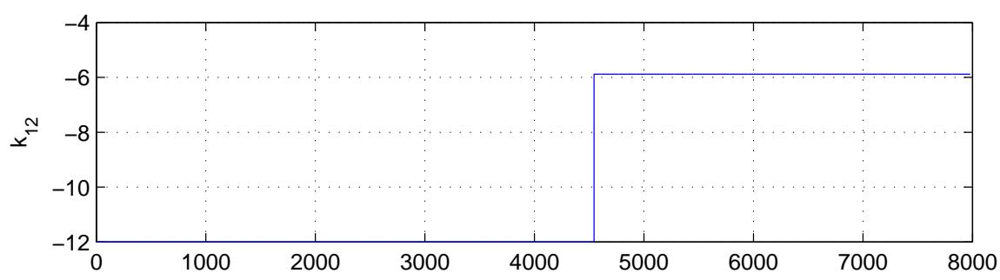

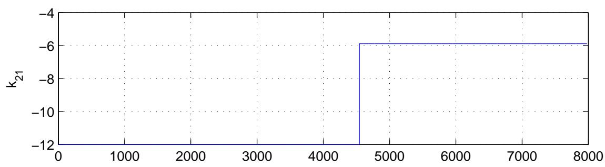

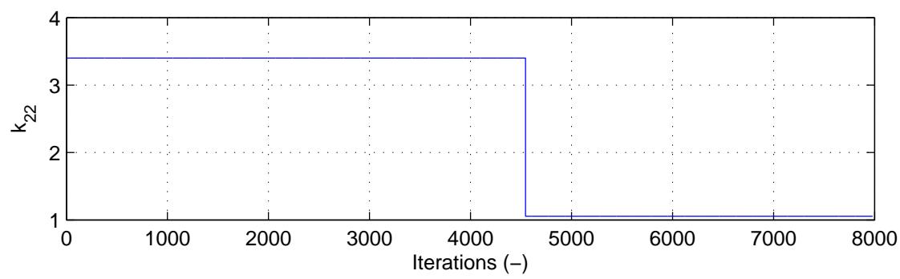  
图5.9：使用αOS的PMC:BFGS的底部执行器控制模式和试算力随时间变化的图。

### 5.4.3 实验结果总结

这些实验结果表明，即使结果不是最好的，MC混合仿真也是可行的混合仿真类型。特别是，PMC混合仿真结果总体上略优于SMC混合仿真结果。PMC似乎比SMC更好地捕捉试件行为的变化。这可能是由几个原因造成的。割线刚度值限制太高，切线刚度估计不准确。可能只是这些原因之一，或者两者共同作用。MC混合仿真不比第3章中的DC和FC混合仿真提供更好的控制系统跟踪性能。

# 第 6 章 结论

本论文开发并探索了混合仿真中的替代控制方法，即力控制（FC）、切换控制（SC）和混合控制（MC）。由于控制系统的限制，需要这些控制方法。大多数混合仿真测试在控制系统处于位移控制（DC）模式下进行。在许多情况下，位移控制是最佳控制模式并产生良好结果。然而，这并不意味着混合仿真中不需要替代控制方法。

结构工程师和研究人员总是在突破极限并发明新的创新结构构件和组件。民用结构在其预期寿命期间提供低概率生命损失灾难性故障的高置信度。因此，安全性和可靠性在结构工程中非常重要。随着结构工程师设计和开发新的先进结构构件，同样需要先进的实验技术和装置来测试这些构件的性能。

混合仿真是实现这些先进实验技术和装置的完美平台。混合仿真是革命性的，因为它提供了一种通过物理测试其构件来对结构系统进行验证测试的方法。在此之前，研究人员必须测试整个系统，或者使用鉴定而非验证测试方法来测试独立构件。混合仿真产生真实的加载模式，并且可以捕捉这些构件对整个结构的影响。为了使混合仿真继续成为结构工程中相关且有效的系统工程方法，它必须提供手段来测试整个结构系统、构件和组件组合，在任何现实的长期和极端挑战组合下。这是本论文的大局动机，推进混合仿真的能力，使其继续成为结构测试的有效方法。另一个动机因素是完成混合仿真概念公式的需要，提供处理结构力学中位移和力之间对偶性的手段。

## 6.1 力控制

第3章定义、开发并测试了控制系统处于FC模式的混合仿真方法。设计了获取试算力（施加到试件上的力）的方法。这些方法分为两个不同类别。一个基于强制执行结构变形的兼容性。另一个基于保持结构中的力平衡。这些方法在Matlab和OpenFresco中实现。

然后研究转向FC混合仿真的控制方面，扩展了用于FC混合仿真的Simulink/Stateflow模型。第3章展示了使用FC Simulink/Stateflow模型和计算试算力的方法进行FC混合仿真测试的结果。$\mu$-NEES实验设置为FC混合仿真测试配置。进行了DC和FC混合仿真测试并进行比较。FC结果总体上略优于DC结果。如果试件比测试的设置更刚性，则怀疑FC的结果会比DC明显更好。然而，构建像$\mu$-NEES这样非常刚性的可重复测试平台非常困难。这些结果表明FC混合仿真是可实现的，并且产生的结果至少与DC混合仿真一样好，如果不是更好的话。

## 6.2 切换控制

第4章介绍了切换控制混合仿真。切换控制混合仿真是FC混合仿真的逻辑扩展。在整个混合仿真测试过程中，试件可能经历需要改变控制系统控制模式的变形和力。本章实现了两种切换策略，即力限制和割线刚度限制切换。使用第3章的FC混合仿真方法进行这些切换策略的SC混合仿真测试。

1自由度$\mu$-NEES设置和SC Simulink/Stateflow模型用于SC混合仿真测试。测试结果表明DC结果略优于SC结果。SC结果优于FC结果。实际上，所有三个结果都同样好。还与FC混合仿真结果一样得出结论，更刚性的试件会产生SC方法的更好结果。NNE和αOS时间积分方案在SC混合仿真测试中表现优于NMF和NMR时间积分方案。

## 6.3 混合控制

混合控制混合仿真是SC混合仿真和多自由度FC混合仿真的下一个自然发展。第5章讨论了MC混合仿真。它结合了第3章获取试算力的FC混合仿真方法与第4章的切换策略。实现了MC Simulink/Stateflow模型用于MC混合仿真，其中2自由度$\mu$-NEES设置的顶部执行器始终处于DC模式，底部执行器在DC和FC模式之间切换。

MC混合仿真测试结果证明与数值结果的匹配不如DC和FC结果好。事实上，大多数MC结果在正确捕捉漂移方面存在困难。然而，力结果与数值结果吻合良好。不同控制模式下执行器的相互作用可能导致某些位移偏差。尽管如此，令人鼓舞的是，有一些测试中MC的响应与DC和FC中的响应相当。至少，可以成功进行MC混合仿真，并且软件框架和预测-校正Simulink/Stateflow模型已经到位以继续研究。

## 6.4 未来工作方向

尽管本论文在上述讨论的主题上取得了一些进展，但要使这些类型的混合仿真完全成熟，仍需要进行更多的研究和实验。本节概述了本论文所呈现的混合仿真中替代控制方法的未来研究。

### 6.4.1 进一步验证

需要进一步验证FC、SC和MC混合仿真方法。如前所述，这些方法并不总是产生比DC混合仿真方法更好的结果。一个可能的原因是$\mu$-NEES实验设置不够刚性。需要一个刚性系统，其中FC模式下的跟踪性能明显优于DC模式下的跟踪性能。FC、SC和MC方法适用于控制系统在整个测试过程中无法在DC模式下充分运行的设置和试件。只有使用这样的设置才能完全验证这些方法。除了刚性设置外，本论文中的混合模型相对简单且自由度数量较少。需要使用更大的模型测试这些方法，以证明这些方法可扩展。

需要对所有控制模式（FC、SC、MC和DC）进行深入的误差分析。应检查几个可能的误差来源。第一个是切线刚度矩阵的估计及其用于计算试算力的部署。向混合仿真过程添加这一额外的计算层改变了先前的误差分析。另一个来源在于控制系统环路实现：当切换控制模式时，它通过控制系统测量值的尖峰表现出来。这可能或可能不影响结果。这取决于这是MTS-STS控制系统和$\mu$-NEES实验设置特有的伪影。此尖峰也可能对控制系统的跟踪性能产生不利影响。另一方面，尖峰可能发生在控制系统改变模式的瞬间，可能对其性能没有大的影响。这不确定，因此值得研究。需要对基于平衡力的力控制（ECF）方法进行误差分析。这是首次将基于力的时间积分方案用于混合仿真。因此，不存在此方法的误差分析。

### 6.4.2 使用功率进行切换

SC和MC混合仿真的性能和结果主要取决于其切换策略。力和割线刚度是本论文中研究的两个切换标准。还应研究其他标准。从实验结果可以看出，基于力和基于割线刚度的切换给出相当的结果。然而，它们确实有各自的缺点，如第4章所述。

一个值得研究的标准是实验设置产生的机械功率。功率可以从测量值计算或直接通过仪器测量。机械功率计算简单，$P(t) = F(t) * V(t)$。$F(t)$是测量力，$V(t)$是从测量位移计算的速度。图6.1显示了第4章中呈现的SC混合仿真测试之一的计算功率$P(t)$图。从对图6.1的粗略检查来看，功率的正尖峰可能是测试期间的良好切换点。正功率尖峰发生在试件开始进入非线性区域之前。

  
图6.1：使用NME的PSC的计算功率和试算力随时间变化的图。

### 6.4.3 MC混合仿真的进一步研究

在三种混合仿真控制方法中，MC混合仿真方法是最不成熟的。它的表现也不如其他两种。确切原因未知。推测两个执行器在不同控制模式下运行的相互作用可能是原因之一。这种推测的原因是DC和FC结果表现更好。需要新的设置来研究这种可能的原因。这个新设置必须首先对一个控制自由度更刚性，并且其执行器配置需要改变。2自由度$\mu$-NEES设置中的执行器彼此平行。新配置应将执行器配置为正交配置。性能不佳的另一个原因可能与切换策略有关。切换参数可能没有正确设置。需要进行参数研究以排除这是原因。

值得研究获取试算力的新方法。图6.2说明了当两个加载方向彼此正交时获取试算力的拟议方法。红色元素是被测试的梁柱元素。水平自由度处于DC模式，垂直自由度处于FC模式。水平试算位移的计算方式与DC混合仿真相同。获得这些给定试算位移的数值模型状态。然后不平衡垂直力$(r_s + r_a - P_2)$用作试算力。此方法的大多数商业有限元程序无法实现，因为它需要高度可定制的有限元软件包。

  
图6.2：通常用于多自由度多执行器系统的MC混合仿真拟议方法，使用节点处的不平衡力作为试算力。

### 6.4.4 Simulink/Stateflow模型

用于FC、SC和MC混合仿真测试的Simulink/Stateflow模型使用线性插值和外推进行校正和预测。看看其他类型的插值和外推如何表现会很有趣。有使用$2^{nd}$和$3^{rd}$阶多项式的DC Simulink/Stateflow模型。这些模型可以轻松扩展用于FC、SC和MC混合仿真测试。最初避免使用高阶多项式，因为怀疑这些会导致可能引起控制系统不稳定的振荡。此怀疑未得到验证。

本论文所有测试使用0.10秒的仿真时间步。这些测试相对较慢。NME、αOS、NMF和NMR的积分时间步为0.02秒，但NME、αOS和NMF使用20个子步。这使得实际积分时间步为0.001秒。仿真时间步大100倍。使用如此大仿真时间步的原因是在整个测试过程中保持控制系统稳定。应进行研究以查看这些测试是否可以更快运行。调查计算驱动器使用的不同积分方法以及这些方法与预测器/校正器策略之间的交互是一个很好的起点。

### 6.4.5 EFC方法与其他时间积分方案

EFC方法使用NMR时间积分方案，因为其他时间积分方案会导致使用此方法驱动的仿真变得不稳定。使用NMR的缺点是它不能为控制器生成良好的指令值曲线。为了克服这一缺点，可能可以将NME、αOS和NMF与此方法一起使用。已经开始了一些初步公式，但它们不完整。如果这可以实现，它可能使EFC方法比兼容性力控制方法更有效，因为它不使用切线刚度矩阵的估计。

### 6.4.6 总结

结构工程这一领域需要进一步研究。这些主题既具有挑战性又有回报。作者希望本论文中呈现的研究将继续进行，如果不是由作者本人，则由发现此主题同样迷人的其他研究人员继续进行。

# 参考文献

[1] M. Ahmadizadeh和G. Mosqueda。使用实验切线刚度矩阵估计的改进算子分裂积分的混合仿真。J. Struct. Eng.-ASCE, 134(12):1829–1838, 2008年1月。
[2] C.G. Broyden。求解非线性联立方程的一类方法。Mathematics of Computation, 19(92):577–593, 1965年10月。
[3] P. Caravani, M.L. Watson和W.T. Thomson。递归最小二乘时域结构参数识别。J. Appl. Mech.-T. Asme, 44(1):135–140, 1977年3月。
[4] J.E. Carrion和B.F. Spencer。基于模型的实时混合测试策略。In ASCE Structure Congress, Seattle, WA, 2003。
[5] Anil K. Chopra。结构动力学。Prentice Hall, 2001。
[6] D. Combescure和P. Pegon。伪动力测试的α-算子分裂时间积分技术 - 误差传播分析。Soil Dyn. Earthq. Eng., 16:427–443, 1997年1月。
[7] T. Elkhoraibi和K.M. Mosalam。迈向使用混合变量的无误差混合仿真。Earthquake Engineering Structural Dynamics, 36(11):1497–1522, 2007。
[8] Erich Gamma, Richard Helm, Ralph Johnson和John Vlissides。科学家和工程师数学手册。McGraw- Hill, New York, 1968。
[9] H.M. Hilber, Hughes T.J.R.和R.L. Taylor。结构动力学时间积分算法的改进数值耗散。Earthquake Engineering Structural Dynamics, 5:283–292, 1977年1月。
[10] C. Hung和S. El-Tawi。混合仿真试件切线刚度估计方法。Earthquake Engineering Structural Dynamics, 38(1):115–134, 2008。
[11] A. Igarashi, F. Seible和G. Hegemier。伪动力技术开发用于测试全尺寸5层剪力墙结构。In Development and Future Dimensions of Structural Testing Techniques, 1993。
[12] H. Klie和M. Wheeler。非线性Krylov-secant求解器。Technical report, The Center for Subsurface Modeling, The Institute for Computational Engineering and Sciences, Univ. of Texas, Austin, 2006年1月。

[13] G. Korn和publisher = McGraw- Hill, New York year = 1968 Korn, T., title = Mathematical Handbook for Scientists and Engineers。
[14] O. Kwon, N. Nakata, K. Park, A. Elnashai和B. Spencer。UI-SIMCOR v2.6和NEES-SAM v2.0用户手册和示例。
[15] G. Mosqueda。具有地理分布子结构的连续混合仿真。PhD thesis, University of California, Berkeley, 2003。
[16] M. Nakashima, T. Kaminosono, M. Ishida和K. Ando。子结构伪动力测试的积分技术。In Proceedings of the US National Conference on Earthquake Engineering, 1990。
[17] N. Nakata, B.F. Spencer和A.S. Elnashai。混合仿真的混合载荷/位移控制策略。In Proc., 4th Int. Conf. on Earthquake Engineering, Taipei, Taiwan, 2006。
[18] M. Pan, P.and Nakashima和H. Tomofuji。使用位移-力混合控制的在线测试。Earthquake Engineering Structural Dynamics, 34(8):869–888, 2005。
[19] S. Patnaik。地震激励下拉链支撑钢框架的混合仿真。International J. for Num. Meth. in Eng., 6:237–251, 1973。
[20] A. Schellenberg。混合仿真的高级实现。PhD thesis, University of California, Berkeley, 2008。
[21] A. Schellenberg, H.K. Kim, Y. Takahashi, Fenves G.L.和Mahin S.A。混合仿真的Openfresco框架：Ui-simcor v2.6示例。Technical report, Department of Civil and Environmental Engineering, University of California, Berkeley, 2009年8月。
[22] M.H. Scott和G.L. Fenves。Krylov子空间加速牛顿算法。In Proc., 4th Int. Conf. on Earthquake Engineering, Taipei, Taiwan, 2006。
[23] P.S.B. Shing和S.A. Mahin。伪动力测试的加载速率效应。J. Struct. Eng.-ASCE, 114(11):2403–2420, 1988年1月。
[24] P.S.B. Shing和S.A. Mahin。伪动力测试中的实验误差效应。J. Eng. Mech.-ASCE, 116(4):805–821, 1990年1月。
[25] M. Sivaselvan, A. Reinhorn, Z. Liang和X. Shao。结构系统的实时动态混合测试。In Proc. of the 13th World Conf. Earthquake Engineering, 2004。
[26] Y. Takahashi和G.L. Fenves。结构系统分布式实验计算仿真的软件框架。Earthquake Engineering Structural Dynamics, 35(2):267–291, 2006。
[27] K. Takanashi, K. Udagawa, M. Seki, T. Okada和H. Tanaka。通过计算机-执行器在线系统进行的结构非线性地震响应分析（第1部分 系统详情）。Trans. Architectural Inst. of Japan, (229):77–83, 1975。

[28] C.R. Thewalt和S.A. Mahin。广义伪动力测试的混合求解技术。Technical Report UCB/EERC-87/09, Earthquake Engineering Research Center, University of California, Berkeley, 1987年7月。

# 附录A 用于FC、SC和MC混合仿真的OpenFresco

OpenFresco最初由Takahashi和Fenves[26]开发。Schellenberg等人[20]对原始概念进行了进一步完善。它经历了几次改进，目前发布为2.6版本。OpenFresco提供了一种在计算驱动器和传输系统之间进行事务处理的标准方式。此软件框架使用C++编程，并利用面向对象编程范式。因此，它是灵活、可扩展和可适应的，支持许多不同类型的计算驱动器传输系统。OpenFresco还允许来自不同站点的用户通过其多层软件架构更轻松地协作。这有助于涉及多站点的分布式混合仿真。

## A.1 OpenFresco软件架构

OpenFresco基于三层和多层软件架构。这些软件架构是著名的客户端-服务器架构的变体。三层架构由客户端、中间层服务器和后端服务器组成。计算驱动器代表客户端。这是架构的顶层，在此对结构进行数值建模并执行分析。中间层服务器封装OpenFresco进程。在所有实际用途中，中间层服务器就是OpenFresco。中间层服务器调解客户端和后端服务器之间的交互。它处理从客户端到后端服务器以及 vice-versa 的数据通信和转换。后端服务器，最后一层，代表包括控制和DAQ系统的实验室。这是混合仿真的实验部分。

此架构提供了灵活性，使得各种计算驱动器和实验室设备可用于混合仿真。目前OpenFresco支持OpenSees、LS-Syna、Abacus和Matlab作为计算驱动器。它还支持各种实验室设备。

  
(a)   
(b)   
图A.1：OpenFresco架构用于(a)本地部署和(b)分布式部署[20]。

### A.1.1 OpenFresco UML类图

  
：DC混合仿真的OpenFresco类图

  
FC、SC、MC混合仿真的OpenFresco类图

## A.2 OpenFresco类

#### A.2.0.1 实验单元

实验单元代表有限元分析程序中的物理试件。它与分析单元有许多相似之处。它提供质量、阻尼和刚度矩阵；它还返回给定变形状态的力向量。因此，OpenFresco中的实验单元抽象类继承自OpenSees单元类。实验单元类执行从分析模型的全局坐标系到用于测试的局部或基本坐标系的变换。它还执行此变换的逆变换。此抽象类变换以下响应量：位移、速度、加速度和力。实验单元始终返回初始刚度矩阵，因为在测试期间难以准确确定物理试件的切线刚度矩阵。

以下是实验单元具体子类的列表：

• 桁架（1D、2D和3D）
• 梁柱（2D和3D）
• 两节点连杆（1D、2D和3D）
• 通用（1D、2D和3D）
• 倒V支撑

#### A.2.0.2 实验站点

实验站点代表实验室和计算驱动器运行的位置。这些站点不一定必须在同一位置。为了概括实验站点抽象类，实现了通信方法。此类还提供站点之间的安全通信。

以下是实验站点具体子类的列表：

• 本地
• 影子和参与者

#### A.2.0.3 实验设置

实验设置代表实验室中的传输系统，不包括控制和数据采集系统。实验设置抽象类执行从局部或基本系统到执行器坐标系的变换。它还执行反向变换。

-代表实验室中的传输系统 -变换 以下是实验设置具体子类的列表：

• 无变换

• 一个执行器
• 两个执行器
• 三个执行器
• 倒V支撑
• 聚合器

#### A.2.0.4 实验控制

实验控制抽象类提供与控制系统的接口。它允许OpenFresco与控制系统通信。它与实验设置类分离，以便在加载设置上工作的实验室技术人员不必关心控制和数据采集系统的IT方面。

以下是实验控制具体子类的列表：

• dSpace、xPC Target和SCRAMNet+
• MTS-CSI和LabVIEW
• 单轴材料和域仿真

## A.3 力控制混合仿真的OpenFresco代码

```cpp
class ESFTangForceConverter : public ExperimentalSignalFilter
{
public:
    // constructors
    ESFTangForceConverter(int tag, Matrix& initStif,
        ExperimentalTangentStiff* tangStif = 0);
    ESFTangForceConverter(const ESFTangForceConverter& esf);
    
    // destructor
    virtual ~ESFTangForceConverter();
    
    // method to get class type
    const char *getClassType() const {return "ESFTangForceConverter";};
    
    virtual int setSize(const int sz);
    virtual double filtering(double data);
    virtual Vector& converting(Vector* trialDisp);
    virtual Vector& converting(Vector* daqDisp, Vector* daqForce);
    virtual void update();
    
    virtual ExperimentalSignalFilter *getCopy();
    
    // public methods for output
    void Print(OPS_Stream &s, int flag = 0);

private:
    ExperimentalTangentStiff *theTangStiff;
    bool firstWarning;  // flag for updating the stiffness matrix
    int size;           // size of ctrl and daq vectors
    Vector dispPast, forcePast, convertFrc, incrDisp, incrForce;
    Matrix kInit, kPrev, thetangStiffMat;  // tangent stiffness matrix
    
    int setInitialStiff();
    int updateMatrix(const Vector* daqDisp, const Vector* daqForce);
};
```

图A.4：继承自ExperimentalSignalFilter类的ESFTangForceConverter具体类定义。

```cpp
class ESFKrylovForceConverter : public ExperimentalSignalFilter
{
public:
    // constructors
    ESFKrylovForceConverter(int tag, int ss, Matrix& initStif);
    ESFKrylovForceConverter(const ESFKrylovForceConverter& esf);
    
    // destructor
    virtual ~ESFKrylovForceConverter();
    
    // method to get class type
    const char *getClassType() const {return "ESFKrylovForceConverter";};
    
    virtual int setSize(const int sz);
    virtual double filtering(double data);
    virtual Vector& converting(Vector* trialDisp);
    virtual Vector& converting(Vector* daqDisp, Vector* daqForce);
    virtual void update();
    
    virtual ExperimentalSignalFilter *getCopy();
    
    // public methods for output
    void Print(OPS_Stream &s, int flag = 0);

private:
    bool firstWarning;	// flag for updating the stiffness matrix
    int size;			// size of ctrl and daq vectors
    int szSubspace;		// number of spaces vectors to use
    Vector dispPast, forcePast, convertFrc, incrDisp, incrForce, cn;
    Matrix kInit;	    // tangent stiffness matrix
    Matrix iDMatrix;	// the incremental displacement Matrix
    Matrix iFMatrix;	// the incremental force Matrix
    
    int setInitialStiff();
    int updateIncrMat(const Vector* daqDisp, const Vector* daqForce);
    int matTranspose(Matrix* kT, const Matrix* k);
};
```

图A.5：继承自ExperimentalSignalFilter类的ESFKylovForceConverter具体类定义。 

```cpp
class ECxPCtargetForce : public ExperimentalControl
{
public:
    // constructors
    ECxPCtargetForce(int tag, char *ipAddress, char *ipPort,
        char *appName, char *appPath = 0);
    ECxPCtargetForce(const ECxPCtargetForce &ec);
    // destructor
    virtual ~ECxPCtargetForce();
    // method to get class type
    const char *getClassType() const {return "ECxPCtargetForce";};
    // public methods to set and to get response
    virtual int setup();
    virtual int setSize(ID sizeT, ID sizeO);
    virtual int setTrialResponse(const Vector* disp,
        const Vector* vel, const Vector* accel, const Vector* force,
        const Vector* time);
    virtual int getDaqResponse(Vector* disp,
        Vector* vel, Vector* accel, Vector* force, Vector* time);
    virtual int commitState();
    virtual ExperimentalControl *getCopy();
    // public methods for experimental control recorder
    virtual Response *setResponse(const char **argv, int argc,
        OPS_Stream &output);
    virtual int getResponse(int responseID, Information &info);
    // public methods for output
    void Print(OPS_Stream &s, int flag = 0);
protected:
    // protected methods to set and to get response
    virtual int control();
    virtual int acquire();
private:
    void sleep(const clock_t wait);
    int port;
    char *ipAddress, *ipPort, *appName, *appPath, char errMsg[256];
    double newTarget, switchPC, atTarget;
    bool frcFeedbackMode;  // 0-converted frc or 1-daq frc feedback
    double *ctrlDisp, *ctrlForce, *daqDisp, *daqForce;
    int newTargetId, switchPCId, atTargetId;
    int ctrlForceId, *daqDispId, *daqForceId;
};
```

图A.6：ECxPCtargetForce具体类定义。

# 附录B µ-NEES实验设置的调谐

$\mu-NEES$实验设置是可用于验证混合仿真方法的实验设置。图3.13中所示的夹具提供可更换钢试件的可重复行为。它可以配置为提供不同的设置选项。两种实验设置配置用于力、切换和混合控制方法的测试。本附录显示了$\mu$-NEES实验设置的调谐。

## B.1 MTS-STS通道3的调谐：底部执行器

  
图B.1：使用振幅为0.1英寸、频率为0.25Hz的正弦波的1自由度$\mu$-NEES实验设置的位移控制调谐图。MTS-STS控制器的通道3针对位移控制进行调谐。

  
图B.2：图B.1上图的位移误差绝对值。平均误差为0.00154英寸。最小误差为4.04e-6英寸。最大误差为0.00470英寸。


  
图B.3：左 - 使用MTS-STS控制器通道3在位移控制下的1自由度$\mu$-NEES实验设置的跟踪图。右 - 使用MTS-STS控制器通道3在位移控制下的1自由度$\mu$-NEES实验设置的滞回图。

  
图B.4：使用振幅为5千磅、频率为0.25Hz的正弦波的1自由度$\mu$-NEES实验设置的力控制调谐图。MTS-STS控制器的通道3针对力控制进行调谐。

  
图B.5：图B.4上图的力误差绝对值。平均误差为0.0796千磅。最小误差为2.38e-6千磅。最大误差为0.261千磅。


  
图B.6：左 - 使用MTS-STS控制器通道3在位移控制下的1自由度$\mu$-NEES实验设置的跟踪图。右 - 使用MTS-STS控制器通道3在位移控制下的1自由度$\mu$-NEES实验设置的滞回图。

表B.1：各种时间积分方案在控制系统水平上1自由度设置非线性混合仿真的绝对误差。显示最小值、平均值和最大值，以数值和量程百分比表示。

| 控制模式 | |误差| | |误差| (量程%) |
|---|---|---|
| DC-最小值 | 4.04×10⁻⁶英寸 | 0.00404% |
| DC-平均值 | 0.00154英寸 | 1.54% |
| DC-最大值 | 0.00470英寸 | 4.60% |
| FC-最小值 | 2.38×10⁻⁶千磅 | 4.76×10⁻⁵% |
| FC-平均值 | 0.0796千磅 | 1.59% |
| FC-最大值 | 0.261千磅 | 5.22% |

## B.2 MTS-STS通道4的调谐：顶部执行器

  
图B.7：使用振幅为0.3英寸、频率为0.25Hz的正弦波的2自由度$\mu$-NEES实验设置的位移控制调谐图。MTS-STS控制器的通道4针对位移控制进行调谐。

表B.2：各种时间积分方案在控制系统水平上1自由度设置非线性混合仿真的绝对误差。显示最小值、平均值和最大值，以数值和量程百分比表示。

| 控制模式 | |误差| | |误差| (量程%) |
|---|---|---|
| DC-最小值 | 1.10×10⁻⁸英寸 | 3.67×10⁻⁶% |
| DC-平均值 | 5.47×10⁻⁵英寸 | 0.0182% |
| DC-最大值 | 0.00357英寸 | 1.19% |

  
图B.8：图B.1上图的位移误差绝对值。平均误差为5.47e-5英寸。最小误差为1.10e-8英寸。最大误差为0.00357英寸。


  
图B.9：左 - 使用MTS-STS控制器通道3在位移控制下的1自由度$\mu$-NEES实验设置的跟踪图。右 - 使用MTS-STS控制器通道3在位移控制下的1自由度$\mu$-NEES实验设置的滞回图。

# 附录C FC混合仿真实验结果

本章包含使用两种不同配置的$\mu$-NEES实验设置进行FC混合仿真的实验结果，即1自由度和2自由度设置。在每个两种设置上运行线性和非线性混合仿真。部署了NME、$\alpha$-OS、NMF和NMR，但并非所有仿真都成功完成。有些不完整，因为STS控制器变得不稳定或时间积分容差限制不满足。这些时间积分方案的分析结果比较在第3.4节中讨论。

## C.1 1自由度设置：线性混合仿真

第3.1.2节中的El Centro缩放到15%以保持试件在线性范围内。混合模型如图2.1所示。绘制了有限元分析水平软件中单元1（实验单元）的变形和抗力随时间的变化。这些响应量与OpenSees分析中的数值对应物进行比较。显示了DC混合仿真的STS控制器指令和测量位移。还绘制了CFC和EFC混合仿真的STS控制器指令和测量力随时间的变化。这些仿真的结果绘制在图C.1至C.13中。


  
图C.1：FC混合仿真的单元1位移-时间历程图（上）和位移误差（中上）。单元1抗力-时间历程图（中下）和绝对抗力误差（下）。地面运动缩放15%以保持仿真在线性范围内。1自由度设置使用NME与DC和CFC。


  
图C.2：上：DC混合仿真的STS控制器指令和测量位移图。下：STS控制器指令和测量位移之间的绝对误差。地面运动缩放15%以保持仿真在线性范围内。1自由度设置使用NME。

  
图C.3：上：CFC混合仿真的STS控制器指令和测量力图。下：STS控制器指令和测量力之间的绝对误差。地面运动缩放15%以保持仿真在线性范围内。1自由度设置使用NME。


  
图C.4：FC混合仿真的单元1位移-时间历程图（上）和位移误差（中上）。单元1抗力-时间历程图（中下）和绝对抗力误差（下）。地面运动缩放15%以保持仿真在线性范围内。1自由度设置使用αOS与DC和CFC。


  
图C.5：上：DC混合仿真的STS控制器指令和测量位移图。下：STS控制器指令和测量位移之间的绝对误差。地面运动缩放15%以保持仿真在线性范围内。1自由度设置使用αOS。

  
图C.6：上：CFC混合仿真的STS控制器指令和测量力图。下：STS控制器指令和测量力之间的绝对误差。地面运动缩放15%以保持仿真在线性范围内。1自由度设置使用αOS


  
图C.7：FC混合仿真的单元1位移-时间历程图（上）和位移误差（中上）。单元1抗力-时间历程图（中下）和绝对抗力误差（下）。地面运动缩放15%以保持仿真在线性范围内。1自由度设置使用NMF与DC和CFC。


  
图C.8：上：DC混合仿真的STS控制器指令和测量位移图。下：STS控制器指令和测量位移之间的绝对误差。地面运动缩放15%以保持仿真在线性范围内。1自由度设置使用NMF。

  
图C.9：上：CFC混合仿真的STS控制器指令和测量力图。下：STS控制器指令和测量力之间的绝对误差。地面运动缩放15%以保持仿真在线性范围内。1自由度设置使用NMF。


  
图C.10：FC混合仿真的单元1位移-时间历程图（上）和位移误差（中上）。单元1抗力-时间历程图（中下）和绝对抗力误差（下）。地面运动缩放15%以保持仿真在线性范围内。1自由度设置使用NMR与DC、CFC和EFC。


  
图C.11：上：DC混合仿真的STS控制器指令和测量位移图。下：STS控制器指令和测量位移之间的绝对误差。地面运动缩放15%以保持仿真在线性范围内。1自由度设置使用NMR。

  
图C.12：上：CFC混合仿真的STS控制器指令和测量力图。下：STS控制器指令和测量力之间的绝对误差。地面运动缩放15%以保持仿真在线性范围内。1自由度设置使用NMR。


  
图C.13：上：EFC混合仿真的STS控制器指令和测量力图。下：STS控制器指令和测量力之间的绝对误差。地面运动缩放15%以保持仿真在线性范围内。1自由度设置使用NMR。

## C.2 1自由度设置：非线性混合仿真

第3.1.2节中的El Centro缩放到40%。混合模型如图2.1所示。绘制了有限元分析软件中单元1（实验单元）的变形和抗力随时间的变化。这些响应量与OpenSees分析中的数值对应物进行比较。显示了DC混合仿真的STS控制器指令和测量位移。还绘制了CFC和EFC混合仿真的STS控制器指令和测量力随时间的变化。由于仅使用1自由度时所有CFC方法都退化为估计割线，因此CFC方法使用割线估计。这些仿真的结果绘制在图C.14至C.19中。


  
图C.14：FC混合仿真的单元1位移-时间历程图（上）和位移误差（中上）。单元1抗力-时间历程图（中下）和绝对抗力误差（下）。地面运动缩放到40%以将试件推入非线性范围。1自由度设置使用NMF与DC和CFC。


  
图C.15：上：DC混合仿真的STS控制器指令和测量位移图。下：STS控制器指令和测量位移之间的绝对误差。地面运动缩放到40%以将试件推入非线性范围。1自由度设置使用NMF。

  
图C.16：上：CFC混合仿真的STS控制器指令和测量力图。下：STS控制器指令和测量力之间的绝对误差。地面运动缩放到40%以将试件推入非线性范围。1自由度设置使用NMF。


  
图C.17：FC混合仿真的单元1位移-时间历程图（上）和位移误差（中上）。单元1抗力-时间历程图（中下）和绝对抗力误差（下）。地面运动缩放到40%以将试件推入非线性范围。1自由度设置使用NMR与DC和CFC。


  
图C.18：上：DC混合仿真的STS控制器指令和测量位移图。下：STS控制器指令和测量位移之间的绝对误差。地面运动缩放到40%以将试件推入非线性范围。1自由度设置使用NMR。

  
图C.19：上：EFC混合仿真的STS控制器指令和测量力图。下：STS控制器指令和测量力之间的绝对误差。地面运动缩放到40%以将试件推入非线性范围。1自由度设置使用NMR。

## C.3 2自由度设置：线性混合仿真

第3.1.2节中的El Centro缩放到10%以保持试件在线性范围内。混合模型如图3.21（右）所示。绘制了有限元分析软件中实验单元的节点位移和力随时间的变化。这些响应量与OpenSees分析中的数值对应物进行比较。显示了DC混合仿真的两个执行器的STS控制器指令和测量位移。还绘制了CFC和EFC混合仿真的STS控制器指令和测量力随时间的变化。即使测试了其他方法，也仅绘制CFC:BFGS结果。这是因为在线性仿真期间所有CFC方法都使用初始刚度矩阵，并且不更新刚度矩阵。这些仿真的结果绘制在图C.20至C.36中。


  
图C.20：FC混合仿真的节点1位移-时间历程图（上）、节点1绝对位移误差（中上）、节点2位移-时间历程图（中下）和节点2绝对位移误差（下）。地面运动缩放到10%以保持仿真在线性范围内。2自由度设置使用NME与DC和CFC。


  
图C.21：FC混合仿真的节点1力-时间历程图（上）、节点1绝对力误差（中上）、节点2力-时间历程图（中下）和节点2绝对力误差（下）。地面运动缩放到10%以保持仿真在线性范围内。2自由度设置使用NME与DC和CFC。


  
MATLAB学生版图C.22：DC模式下底部执行器STS控制器的指令和测量位移图（上）。底部执行器STS控制器指令和测量位移之间的绝对误差（中上）。DC模式下顶部执行器STS控制器的指令和测量位移图（中下）。顶部执行器STS控制器指令和测量位移之间的绝对误差（下）。地面运动缩放到10%以保持仿真在线性范围内。2自由度设置使用NME。


  
MATLAB学生版图C.23：DC模式下底部执行器STS控制器的指令和测量力图（上）。底部执行器STS控制器指令和测量力之间的绝对误差（中上）。DC模式下顶部执行器STS控制器的指令和测量力图（中下）。顶部执行器STS控制器指令和测量力之间的绝对误差（下）。地面运动缩放到10%以保持仿真在线性范围内。2自由度设置使用NME。


  
图C.24：FC混合仿真的节点1位移-时间历程图（上）、节点1绝对位移误差（中上）、节点2位移-时间历程图（中下）和节点2绝对位移误差（下）。地面运动缩放到10%以保持仿真在线性范围内。2自由度设置使用αOS与DC和CFC。


  
图C.25：FC混合仿真的节点1力-时间历程图（上）、节点1绝对力误差（中上）、节点2力-时间历程图（中下）和节点2绝对力误差（下）。地面运动缩放到10%以保持仿真在线性范围内。2自由度设置使用αOS与DC和CFC。


  
MATLAB学生版图C.26：DC模式下底部执行器STS控制器的指令和测量位移图（上）。底部执行器STS控制器指令和测量位移之间的绝对误差（中上）。DC模式下顶部执行器STS控制器的指令和测量位移图（中下）。顶部执行器STS控制器指令和测量位移之间的绝对误差（下）。地面运动缩放到10%以保持仿真在线性范围内。2自由度设置使用αOS。


  
MATLAB学生版图C.27：DC模式下底部执行器STS控制器的指令和测量力图（上）。底部执行器STS控制器指令和测量力之间的绝对误差（中上）。DC模式下顶部执行器STS控制器的指令和测量力图（中下）。顶部执行器STS控制器指令和测量力之间的绝对误差（下）。地面运动缩放到10%以保持仿真在线性范围内。2自由度设置使用αOS。


  
图C.28：FC混合仿真的节点1位移-时间历程图（上）、节点1绝对位移误差（中上）、节点2位移-时间历程图（中下）和节点2绝对位移误差（下）。地面运动缩放到10%以保持仿真在线性范围内。2自由度设置使用NMF与DC和CFC。


  
图C.29：FC混合仿真的节点1力-时间历程图（上）、节点1绝对力误差（中上）、节点2力-时间历程图（中下）和节点2绝对力误差（下）。地面运动缩放到10%以保持仿真在线性范围内。2自由度设置使用NMF与DC和CFC。


  
MATLAB学生版图C.30：DC模式下底部执行器STS控制器的指令和测量位移图（上）。底部执行器STS控制器指令和测量位移之间的绝对误差（中上）。DC模式下顶部执行器STS控制器的指令和测量位移图（中下）。顶部执行器STS控制器指令和测量位移之间的绝对误差（下）。地面运动缩放到10%以保持仿真在线性范围内。2自由度设置使用NMF。


  
MATLAB学生版图C.31：DC模式下底部执行器STS控制器的指令和测量力图（上）。底部执行器STS控制器指令和测量力之间的绝对误差（中上）。DC模式下顶部执行器STS控制器的指令和测量力图（中下）。顶部执行器STS控制器指令和测量力之间的绝对误差（下）。地面运动缩放到10%以保持仿真在线性范围内。2自由度设置使用NMF。


  
图C.32：FC混合仿真的节点1位移-时间历程图（上）、节点 1绝对位移误差（中上）、节点2位移-时间历程图（中下）和节点2绝对位移误差（下）。地面运动缩放到10%以保持仿真在线性范围内。2自由度设置使用NMR与DC、CFC和EFC。


  
图C.33：FC混合仿真的节点1力-时间历程图（上）、节点1绝对力误差（中上）、节点2力-时间历程图（中下）和节点2绝对力误差（下）。地面运动缩放到10%以保持仿真在线性范围内。2自由度设置使用NMR与DC、CFC和EFC。


  
MATLAB学生版图C.34：DC模式下底部执行器STS控制器的指令和测量位移图（上）。底部执行器STS控制器指令和测量位移之间的绝对误差（中上）。DC模式下顶部执行器STS控制器的指令和测量位移图（中下）。顶部执行器STS控制器指令和测量位移之间的绝对误差（下）。地面运动缩放到10%以保持仿真在线性范围内。2自由度设置使用NMR。


  
MATLAB学生版图C.35：DC模式下底部执行器STS控制器的指令和测量力图（上）。底部执行器STS控制器指令和测量力之间的绝对误差（中上）。DC模式下顶部执行器STS控制器的指令和测量力图（中下）。顶部执行器STS控制器指令和测量力之间的绝对误差（下）。地面运动缩放到10%以保持仿真在线性范围内。2自由度设置使用NMR与CFC。


  
MATLAB学生版图C.36：DC模式下底部执行器STS控制器的指令和测量力图（上）。底部执行器STS控制器指令和测量力之间的绝对误差（中上）。DC模式下顶部执行器STS控制器的指令和测量力图（中下）。顶部执行器STS控制器指令和测量力之间的绝对误差（下）。地面运动缩放到10%以保持仿真在线性范围内。2自由度设置使用NME与EFC。

## C.4 2自由度设置：非线性混合仿真

第3.1.2节中的El Centro缩放到50%。混合模型如图3.21（右）所示。绘制了有限元分析软件中实验单元的节点位移和力随时间的变化。这些响应量与OpenSees分析中的数值对应物进行比较。显示了DC混合仿真的两个执行器的STS控制器指令和测量位移。还绘制了CFC和EFC混合仿真的STS控制器指令和测量力随时间的变化。虽然测试了所有方法，但仅显示成功的测试。当时间积分方案的容差限制未满足或STS控制变得不稳定时，某些测试不被认为是成功的。这些仿真的结果绘制在图C.37至C.54中。


  
图C.37：FC混合仿真的节点1位移-时间历程图（上）、节点1绝对位移误差（中上）、节点2位移-时间历程图（中下）和节点2绝对位移误差（下）。地面运动缩放到50%以保持仿真在非线性范围内。2自由度设置使用NME与DC和CFC:BFGS。


  
图C.38：FC混合仿真的节点1力-时间历程图（上）、节点1绝对力误差（中上）、节点2力-时间历程图（中下）和节点2绝对力误差（下）。地面运动缩放到50%以保持仿真在非线性范围内。2自由度设置使用NME与DC和CFC:BFGS。


  
MATLAB学生版图C.39：DC模式下底部执行器STS控制器的指令和测量位移图（上）。底部执行器STS控制器指令和测量位移之间的绝对误差（中上）。DC模式下顶部执行器STS控制器的指令和测量位移图（中下）。顶部执行器STS控制器指令和测量位移之间的绝对误差（下）。地面运动缩放到50%以保持仿真在非线性范围内。2自由度设置使用NME与DC。


  
MATLAB学生版图C.39：STS控制器在DC模式下底部作动器指令和测量位移曲线（上）。STS控制器底部作动器指令和测量位移之间的绝对误差（中上）。STS控制器在DC模式下顶部作动器指令和测量位移曲线（中下）。STS控制器顶部作动器指令和测量位移之间的绝对误差（下）。地面运动缩放至$50 \%$以保持模拟在非线性范围内。2自由度设置使用NME与DC。


  
MATLAB学生版图C.40：STS控制器在DC模式下底部作动器指令和测量力曲线（上）。STS控制器底部作动器指令和测量力之间的绝对误差（中上）。STS控制器在DC模式下顶部作动器指令和测量力曲线（中下）。STS控制器顶部作动器指令和测量力之间的绝对误差（下）。地面运动缩放至$50 \%$以保持模拟在非线性范围内。2自由度设置使用NME与CFC:BFGS。


  
图C.41：FC混合仿真节点1位移-时程曲线（上）、节点1绝对位移误差（中上）、节点2位移-时程曲线（中下）和节点2绝对位移误差（下）。地面运动缩放至$50 \%$以保持模拟在非线性范围内。2自由度设置使用αOS与DC、CFC:BFGS和CFC:Intrinsic。


  
图C.42：FC混合仿真节点1力-时程曲线（上）、节点1绝对力误差（中上）、节点2力-时程曲线（中下）和节点2绝对力误差（下）。地面运动缩放至$50 \%$以保持模拟在非线性范围内。2自由度设置使用αOS与DC、CFC:BFGS和CFC:Intrinsic。


  
MATLAB学生版图C.43：STS控制器在DC模式下底部作动器指令和测量位移曲线（上）。STS控制器底部作动器指令和测量位移之间的绝对误差（中上）。STS控制器在DC模式下顶部作动器指令和测量位移曲线（中下）。STS控制器顶部作动器指令和测量位移之间的绝对误差（下）。地面运动缩放至$50 \%$以保持模拟在非线性范围内。2自由度设置使用αOS与DC。


  
MATLAB学生版图C.44：STS控制器在DC模式下底部作动器指令和测量力曲线（上）。STS控制器底部作动器指令和测量力之间的绝对误差（中上）。STS控制器在DC模式下顶部作动器指令和测量力曲线（中下）。STS控制器顶部作动器指令和测量力之间的绝对误差（下）。2自由度设置使用αOS-CFC:BFGS。


  
MATLAB学生版图C.45：STS控制器在DC模式下底部作动器指令和测量力曲线（上）。STS控制器底部作动器指令和测量力之间的绝对误差（中上）。STS控制器在DC模式下顶部作动器指令和测量力曲线（中下）。STS控制器顶部作动器指令和测量力之间的绝对误差（下）。地面运动缩放至$50 \%$以保持模拟在非线性范围内。2自由度设置使用αOS-CFC:Intrinsic。


  
图C.46：FC混合仿真节点1位移-时程曲线（上）、节点1绝对位移误差（中上）、节点2位移-时程曲线（中下）和节点2绝对位移误差（下）。地面运动缩放至$50 \%$以保持模拟在非线性范围内。2自由度设置使用NMF与DC和CFC:BFGS。


  
图C.47：FC混合仿真节点1力-时程曲线（上）、节点1绝对力误差（中上）、节点2力-时程曲线（中下）和节点2绝对力误差（下）。地面运动缩放至$50 \%$以保持模拟在非线性范围内。2自由度设置使用NMF与DC和CFC:BFGS。


  
MATLAB学生版图C.48：STS控制器在DC模式下底部作动器指令和测量位移曲线（上）。STS控制器底部作动器指令和测量位移之间的绝对误差（中上）。STS控制器在DC模式下顶部作动器指令和测量位移曲线（中下）。STS控制器顶部作动器指令和测量位移之间的绝对误差（下）。地面运动缩放至$50 \%$以保持模拟在非线性范围内。2自由度设置使用NMF与DC。


  
MATLAB学生版图C.49：STS控制器在DC模式下底部作动器指令和测量力曲线（上）。STS控制器底部作动器指令和测量力之间的绝对误差（中上）。STS控制器在DC模式下顶部作动器指令和测量力曲线（中下）。STS控制器顶部作动器指令和测量力之间的绝对误差（下）。地面运动缩放至$50 \%$以保持模拟在非线性范围内。2自由度设置使用NMF与CFC:BFGS。


  
图C.50：FC混合仿真节点1位移-时程曲线（上）、节点1绝对位移误差（中上）、节点2位移-时程曲线（中下）和节点2绝对位移误差（下）。地面运动缩放至$50 \%$以保持模拟在非线性范围内。2自由度设置使用NMR与DC、CFC:BFGS和CFC:Intrinisic。


  
图C.51：FC混合仿真节点1力-时程曲线（上）、节点1绝对力误差（中上）、节点2力-时程曲线（中下）和节点2绝对力误差（下）。地面运动缩放至$50 \%$以保持模拟在非线性范围内。2自由度设置使用NMR与DC、CFC:BFGS和CFC:Intrinsic。


  
MATLAB学生版图C.52：STS控制器在DC模式下底部作动器指令和测量位移曲线（上）。STS控制器底部作动器指令和测量位移之间的绝对误差（中上）。STS控制器在DC模式下顶部作动器指令和测量位移曲线（中下）。STS控制器顶部作动器指令和测量位移之间的绝对误差（下）。地面运动缩放至$50 \%$以保持模拟在非线性范围内。2自由度设置使用NMR与DC。


  
MATLAB学生版图C.53：STS控制器在DC模式下底部作动器指令和测量力曲线（上）。STS控制器底部作动器指令和测量力之间的绝对误差（中上）。STS控制器在DC模式下顶部作动器指令和测量力曲线（中下）。STS控制器顶部作动器指令和测量力之间的绝对误差（下）。地面运动缩放至$50 \%$以保持模拟在非线性范围内。2自由度设置使用NMR与CFC:BFGS。


  
MATLAB学生版图C.54：STS控制器在DC模式下底部作动器指令和测量力曲线（上）。STS控制器底部作动器指令和测量力之间的绝对误差（中上）。STS控制器在DC模式下顶部作动器指令和测量力曲线（中下）。STS控制器顶部作动器指令和测量力之间的绝对误差（下）。地面运动缩放至$50 \%$以保持模拟在非线性范围内。2自由度设置使用NMR与CFC:Intrinsic。

# 附录D SC混合仿真实验结果

第3.1.2节中的El Centro波缩放至$40 \%$。混合模型如图XX所示。单元1为试验单元，其变形和抗力来自有限元软件层面，并随时间绘制。这些响应量与其OpenSees分析中的数值对应量进行比较。DC混合仿真中STS控制器的指令和测量位移也已给出。CFC:SP、CFC:SW、EFC:SP和EFC:SW混合仿真的STS控制器指令/测量位移和力也随时间绘制。这些仿真的结果绘制于图D.1至图XX中。


  
MATLAB学生版图D.1：SC混合仿真单元1位移-时程曲线（上）和位移误差（中上）。单元1抗力-时程曲线（中下）和绝对抗力误差（下）。地面运动缩放至$40 \%$以将试件推入非线性范围。1自由度设置使用NME与DC、PSC和SSC。


  
图D.2：上：DC混合仿真STS控制器指令和测量位移曲线。下：STS控制器指令和测量位移之间的绝对误差。地面运动缩放至$40 \%$以将试件推入非线性范围。1自由度设置使用NME与DC。


  
MATLAB学生版图D.3：上：PSC混合仿真STS控制器指令和测量位移曲线。中上：STS控制器指令和测量位移之间的绝对误差。中下：PSC混合仿真STS控制器指令和测量力曲线。下：STS控制器指令和测量力之间的绝对误差。地面运动缩放至$40 \%$以将试件推入非线性范围。1自由度设置使用NME。


  
MATLAB学生版图D.4：上：SSC混合仿真STS控制器指令和测量位移曲线。中上：STS控制器指令和测量位移之间的绝对误差。中下：SSC混合仿真STS控制器指令和测量力曲线。下：STS控制器指令和测量力之间的绝对误差。地面运动缩放至$40 \%$以将试件推入非线性范围。1自由度设置使用NME。


  
MATLAB学生版图D.5：SC混合仿真单元1位移-时程曲线（上）和位移误差（中上）。单元1抗力-时程曲线（中下）和绝对抗力误差（下）。地面运动缩放至$40 \%$以将试件推入非线性范围。1自由度设置使用αOS与DC、PSC和SSC。


  
图D.6：上：DC混合仿真STS控制器指令和测量位移曲线。下：STS控制器指令和测量位移之间的绝对误差。地面运动缩放至$40 \%$以将试件推入非线性范围。1自由度设置使用αOS与DC。


  
MATLAB学生版图D.7：上：PSC混合仿真STS控制器指令和测量位移曲线。中上：STS控制器指令和测量位移之间的绝对误差。中下：PSC混合仿真STS控制器指令和测量力曲线。下：STS控制器指令和测量力之间的绝对误差。地面运动缩放至$40 \%$以将试件推入非线性范围。1自由度设置使用αOS。


  
MATLAB学生版图D.8：上：SSC混合仿真STS控制器指令和测量位移曲线。中上：STS控制器指令和测量位移之间的绝对误差。中下：SSC混合仿真STS控制器指令和测量力曲线。下：STS控制器指令和测量力之间的绝对误差。地面运动缩放至$40 \%$以将试件推入非线性范围。1自由度设置使用αOS。


  
MATLAB学生版图D.9：SC混合仿真单元1位移-时程曲线（上）和位移误差（中上）。单元1抗力-时程曲线（中下）和绝对抗力误差（下）。地面运动缩放至$40 \%$以将试件推入非线性范围。1自由度设置使用NMF与PSC和SSC。


  
MATLAB学生版图D.10：上：PSC混合仿真STS控制器指令和测量位移曲线。中上：STS控制器指令和测量位移之间的绝对误差。中下：PSC混合仿真STS控制器指令和测量力曲线。下：STS控制器指令和测量力之间的绝对误差。地面运动缩放至$40 \%$以将试件推入非线性范围。1自由度设置使用NMF。


  
MATLAB学生版图D.11：上：SSC混合仿真STS控制器指令和测量位移曲线。中上：STS控制器指令和测量位移之间的绝对误差。中下：SSC混合仿真STS控制器指令和测量力曲线。下：STS控制器指令和测量力之间的绝对误差。地面运动缩放至$40 \%$以将试件推入非线性范围。1自由度设置使用NMF。


  
MATLAB学生版图D.12：SC混合仿真单元1位移-时程曲线（上）和位移误差（中上）。单元1抗力-时程曲线（中下）和绝对抗力误差（下）。地面运动缩放至$40 \%$以将试件推入非线性范围。1自由度设置使用NMR与PSC、SSC、ESPC和ESSC。


  
MATLAB学生版图D.13：上：PSC混合仿真STS控制器指令和测量位移曲线。中上：STS控制器指令和测量位移之间的绝对误差。中下：PSC混合仿真STS控制器指令和测量力曲线。下：STS控制器指令和测量力之间的绝对误差。地面运动缩放至$40 \%$以将试件推入非线性范围。1自由度设置使用NMR。


  
MATLAB学生版图D.14：上：SSC混合仿真STS控制器指令和测量位移曲线。中上：STS控制器指令和测量位移之间的绝对误差。中下：SSC混合仿真STS控制器指令和测量力曲线。下：STS控制器指令和测量力之间的绝对误差。地面运动缩放至$40 \%$以将试件推入非线性范围。1自由度设置使用NMR。


  
MATLAB学生版图D.15：上：EPSC混合仿真STS控制器指令和测量位移曲线。中上：STS控制器指令和测量位移之间的绝对误差。中下：EPSC混合仿真STS控制器指令和测量力曲线。下：STS控制器指令和测量力之间的绝对误差。地面运动缩放至$40 \%$以将试件推入非线性范围。1自由度设置使用NMR。


  
MATLAB学生版图D.16：上：ESSC混合仿真STS控制器指令和测量位移曲线。中上：STS控制器指令和测量位移之间的绝对误差。中下：ESSC混合仿真STS控制器指令和测量力曲线。下：STS控制器指令和测量力之间的绝对误差。地面运动缩放至$40 \%$以将试件推入非线性范围。1自由度设置使用NMR。

# 附录E MC混合仿真实验结果

第3.1.2节中的El Centro波缩放至$40 \%$。混合模型如图XX所示。单元1为试验单元，其变形和抗力来自有限元软件层面，并随时间绘制。这些响应量与其OpenSees分析中的数值对应量进行比较。DC混合仿真中STS控制器的指令和测量位移也已给出。CFC:SP、CFC:SW、EFC:SP和EFC:SW混合仿真的STS控制器指令/测量位移和力也随时间绘制。这些仿真的结果绘制于图XX至图XX中。

## E.1 点切换混合仿真

### E.1.1 NME时间积分方案


  
MATLAB学生版图E.1：PMC混合仿真节点1位移-时程曲线（上）、节点1绝对位移误差（中上）、节点2位移-时程曲线（中下）和节点2绝对位移误差（下）。地面运动缩放至$50 \%$以保持模拟在非线性范围内。2自由度设置使用NME与DC、CFC:BFGS、PMC:Broyden、PMC:BFGS、PMC:Intrinsic。所有试验结果误差均使用NMI数值结果计算。


  
MATLAB学生版图E.2：PMC混合仿真节点1力-时程曲线（上）、节点1绝对力误差（中上）、节点2力-时程曲线（中下）和节点2绝对力误差（下）。地面运动缩放至$50 \%$以保持模拟在非线性范围内。2自由度设置使用NME与DC、CFC:BFGS、PMC:Broyden、PMC:BFGS、PMC:Intrinsic。所有试验结果误差均使用NMI数值结果计算。


  
图E.3：底部作动器STS控制器记录值。上：PMC:Broyden混合仿真DC模式下STS控制器指令和测量位移曲线。中上：STS控制器指令和测量位移之间的绝对误差。中下：PMC:Broyden混合仿真FC模式下STS控制器指令和测量力曲线。下：STS控制器指令和测量力之间的绝对误差。地面运动缩放至$50 \%$以将试件推入非线性范围。2自由度设置使用NME与PMC:Broyden。


  
图E.4：顶部作动器STS控制器记录值。上：PMC:Broyden混合仿真STS控制器指令和测量位移曲线。下：STS控制器指令和测量位移之间的绝对误差。地面运动缩放至$50 \%$以将试件推入非线性范围。2自由度设置使用NME与PMC:Broyden。


  
图E.5：底部作动器STS控制器记录值。上：PMC:BFGS混合仿真DC模式下STS控制器指令和测量位移曲线。中上：STS控制器指令和测量位移之间的绝对误差。中下：PMC:BFGS混合仿真FC模式下STS控制器指令和测量力曲线。下：STS控制器指令和测量力之间的绝对误差。地面运动缩放至$50 \%$以将试件推入非线性范围。2自由度设置使用NME与PMC:BFGS。


  
图E.6：顶部作动器STS控制器记录值。上：PMC:BFGS混合仿真STS控制器指令和测量位移曲线。下：STS控制器指令和测量位移之间的绝对误差。地面运动缩放至$50 \%$以将试件推入非线性范围。2自由度设置使用NME与PMC:BFGS。


  
图E.7：底部作动器STS控制器记录值。上：PMC:Intrinsic混合仿真DC模式下STS控制器指令和测量位移曲线。中上：STS控制器指令和测量位移之间的绝对误差。中下：PMC:Intrinsic混合仿真FC模式下STS控制器指令和测量力曲线。下：STS控制器指令和测量力之间的绝对误差。地面运动缩放至$50 \%$以将试件推入非线性范围。2自由度设置使用NME与PMC:Intrinsic。


  
图E.8：顶部作动器STS控制器记录值。上：PMC:Intrinsic混合仿真STS控制器指令和测量位移曲线。下：STS控制器指令和测量位移之间的绝对误差。地面运动缩放至$50 \%$以将试件推入非线性范围。2自由度设置使用NME与PMC:Intrinsic。

### E.1.2 α时间积分方案


  
MATLAB学生版图E.9：PMC混合仿真节点1位移-时程曲线（上）、节点1绝对位移误差（中上）、节点2位移-时程曲线（中下）和节点2绝对位移误差（下）。地面运动缩放至$50 \%$以保持模拟在非线性范围内。2自由度设置使用αOS与DC、CFC:BFGS、PMC:Broyden、PMC:BFGS、PMC:Intrinsic。所有试验结果误差均使用NMI数值结果计算。


  
MATLAB学生版图E.10：PMC混合仿真节点1力-时程曲线（上）、节点1绝对力误差（中上）、节点2力-时程曲线（中下）和节点2绝对力误差（下）。地面运动缩放至$50 \%$以保持模拟在非线性范围内。2自由度设置使用αOS与DC、CFC:BFGS、PMC:Broyden、PMC:BFGS、PMC:Intrinsic。所有试验结果误差均使用NMI数值结果计算。


  
图E.11：底部作动器STS控制器记录值。上：PMC:Broyden混合仿真DC模式下STS控制器指令和测量位移曲线。中上：STS控制器指令和测量位移之间的绝对误差。中下：PMC:Broyden混合仿真FC模式下STS控制器指令和测量力曲线。下：STS控制器指令和测量力之间的绝对误差。地面运动缩放至$50 \%$以将试件推入非线性范围。2自由度设置使用αOS与PMC:Broyden。


  
图E.12：顶部作动器STS控制器记录值。上：PMC:Broyden混合仿真STS控制器指令和测量位移曲线。下：STS控制器指令和测量位移之间的绝对误差。地面运动缩放至$50 \%$以将试件推入非线性范围。2自由度设置使用αOS与PMC:Broyden。


  
图E.13：底部作动器STS控制器记录值。上：PMC:BFGS混合仿真DC模式下STS控制器指令和测量位移曲线。中上：STS控制器指令和测量位移之间的绝对误差。中下：PMC:BFGS混合仿真FC模式下STS控制器指令和测量力曲线。下：STS控制器指令和测量力之间的绝对误差。地面运动缩放至$50 \%$以将试件推入非线性范围。2自由度设置使用αOS与PMC:BFGS。


  
图E.14：顶部作动器STS控制器记录值。上：PMC:BFGS混合仿真STS控制器指令和测量位移曲线。下：STS控制器指令和测量位移之间的绝对误差。地面运动缩放至$50 \%$以将试件推入非线性范围。2自由度设置使用αOS与PMC:BFGS。


  
图E.15：底部作动器STS控制器记录值。上：PMC:Intrinsic混合仿真DC模式下STS控制器指令和测量位移曲线。中上：STS控制器指令和测量位移之间的绝对误差。中下：PMC:Intrinsic混合仿真FC模式下STS控制器指令和测量力曲线。下：STS控制器指令和测量力之间的绝对误差。地面运动缩放至$50 \%$以将试件推入非线性范围。2自由度设置使用αOS与PMC:Intrinsic。


  
图E.16：顶部作动器STS控制器记录值。上：PMC:Intrinsic混合仿真STS控制器指令和测量位移曲线。下：STS控制器指令和测量位移之间的绝对误差。地面运动缩放至$50 \%$以将试件推入非线性范围。2自由度设置使用αOS与PMC:Intrinsic。

### E.1.3 NMF时间积分方案


  
MATLAB学生版图E.17：PMC混合仿真节点1位移-时程曲线（上）、节点1绝对位移误差（中上）、节点2位移-时程曲线（中下）和节点2绝对位移误差（下）。地面运动缩放至$50 \%$以保持模拟在非线性范围内。2自由度设置使用NMF与DC、CFC:BFGS、PMC:Broyden、PMC:BFGS、PMC:Intrinsic。所有试验结果误差均使用NMI数值结果计算。


  
MATLAB学生版图E.18：PMC混合仿真节点1力-时程曲线（上）、节点1绝对力误差（中上）、节点2力-时程曲线（中下）和节点2绝对力误差（下）。地面运动缩放至$50 \%$以保持模拟在非线性范围内。2自由度设置使用NMF与DC、CFC:BFGS、PMC:Broyden、PMC:BFGS、PMC:Intrinsic。所有试验结果误差均使用NMI数值结果计算。


  
图E.19：底部作动器STS控制器记录值。上：PMC:Broyden混合仿真DC模式下STS控制器指令和测量位移曲线。中上：STS控制器指令和测量位移之间的绝对误差。中下：PMC:Broyden混合仿真FC模式下STS控制器指令和测量力曲线。下：STS控制器指令和测量力之间的绝对误差。地面运动缩放至$50 \%$以将试件推入非线性范围。2自由度设置使用NMF与PMC:Broyden。


  
图E.20：顶部作动器STS控制器记录值。上：PMC:Broyden混合仿真STS控制器指令和测量位移曲线。下：STS控制器指令和测量位移之间的绝对误差。地面运动缩放至$50 \%$以将试件推入非线性范围。2自由度设置使用NMF与PMC:Broyden。


  
图E.21：底部作动器STS控制器记录值。上：PMC:BFGS混合仿真DC模式下STS控制器指令和测量位移曲线。中上：STS控制器指令和测量位移之间的绝对误差。中下：PMC:BFGS混合仿真FC模式下STS控制器指令和测量力曲线。下：STS控制器指令和测量力之间的绝对误差。地面运动缩放至$50 \%$以将试件推入非线性范围。2自由度设置使用NMF与PMC:BFGS。


  
图E.22：顶部作动器STS控制器记录值。上：PMC:BFGS混合仿真STS控制器指令和测量位移曲线。下：STS控制器指令和测量位移之间的绝对误差。地面运动缩放至$50 \%$以将试件推入非线性范围。2自由度设置使用NMF与PMC:BFGS。


  
图E.23：底部作动器STS控制器记录值。上：PMC:Intrinsic混合仿真DC模式下STS控制器指令和测量位移曲线。中上：STS控制器指令和测量位移之间的绝对误差。中下：PMC:Intrinsic混合仿真FC模式下STS控制器指令和测量力曲线。下：STS控制器指令和测量力之间的绝对误差。地面运动缩放至$50 \%$以将试件推入非线性范围。2自由度设置使用NMF与PMC:Intrinsic。


  
图E.24：顶部作动器STS控制器记录值。上：PMC:Intrinsic混合仿真STS控制器指令和测量位移曲线。下：STS控制器指令和测量位移之间的绝对误差。地面运动缩放至$50 \%$以将试件推入非线性范围。2自由度设置使用NMF与PMC:Intrinsic。

### E.1.4 NMR时间积分方案


  
MATLAB学生版图E.25：PMC混合仿真节点1位移-时程曲线（上）、节点1绝对位移误差（中上）、节点2位移-时程曲线（中下）和节点2绝对位移误差（下）。地面运动缩放至$50 \%$以保持模拟在非线性范围内。2自由度设置使用NMR与DC、CFC:BFGS、PMC:BFGS、PMC:Intrinsic。所有试验结果误差均使用NMI数值结果计算。


  
MATLAB学生版图E.26：PMC混合仿真节点1力-时程曲线（上）、节点1绝对力误差（中上）、节点2力-时程曲线（中下）和节点2绝对力误差（下）。地面运动缩放至$50 \%$以保持模拟在非线性范围内。2自由度设置使用NMR与DC、CFC:BFGS、PMC:BFGS、PMC:Intrinsic。所有试验结果误差均使用NMI数值结果计算。


  
图E.27：底部作动器STS控制器记录值。上：PMC:BFGS混合仿真DC模式下STS控制器指令和测量位移曲线。中上：STS控制器指令和测量位移之间的绝对误差。中下：PMC:BFGS混合仿真FC模式下STS控制器指令和测量力曲线。下：STS控制器指令和测量力之间的绝对误差。地面运动缩放至$50 \%$以将试件推入非线性范围。2自由度设置使用NMR与PMC:BFGS。


  
图E.28：顶部作动器STS控制器记录值。上：PMC:BFGS混合仿真STS控制器指令和测量位移曲线。下：STS控制器指令和测量位移之间的绝对误差。地面运动缩放至$50 \%$以将试件推入非线性范围。2自由度设置使用NMR与PMC:BFGS。


  
图E.29：底部作动器STS控制器记录值。上：PMC:Intrinsic混合仿真DC模式下STS控制器指令和测量位移曲线。中上：STS控制器指令和测量位移之间的绝对误差。中下：PMC:Intrinsic混合仿真FC模式下STS控制器指令和测量力曲线。下：STS控制器指令和测量力之间的绝对误差。地面运动缩放至$50 \%$以将试件推入非线性范围。2自由度设置使用NMR与PMC:Intrinsic。


  
图E.30：顶部作动器STS控制器记录值。上：PMC:Intrinsic混合仿真STS控制器指令和测量位移曲线。下：STS控制器指令和测量位移之间的绝对误差。地面运动缩放至$50 \%$以将试件推入非线性范围。2自由度设置使用NMR与PMC:Intrinsic。

## E.2 割线切换混合仿真

### E.2.1 NME时间积分方案


  
MATLAB学生版图E.31：SMC混合仿真节点1位移-时程曲线（上）、节点1绝对位移误差（中上）、节点2位移-时程曲线（中下）和节点2绝对位移误差（下）。地面运动缩放至$50 \%$以保持模拟在非线性范围内。2自由度设置使用NME与DC、CFC:BFGS、SMC:Broyden、SMC:BFGS、SMC:Intrinsic。所有试验结果误差均使用NMI数值结果计算。


  
MATLAB学生版图E.32：SMC混合仿真节点1力-时程曲线（上）、节点1绝对力误差（中上）、节点2力-时程曲线（中下）和节点2绝对力误差（下）。地面运动缩放至$50 \%$以保持模拟在非线性范围内。2自由度设置使用NME与DC、CFC:BFGS、SMC:Broyden、SMC:BFGS、SMC:Intrinsic。所有试验结果误差均使用NMI数值结果计算。


  
图E.33：底部作动器STS控制器记录值。上：SMC:Broyden混合仿真DC模式下STS控制器指令和测量位移曲线。中上：STS控制器指令和测量位移之间的绝对误差。中下：SMC:Broyden混合仿真FC模式下STS控制器指令和测量力曲线。下：STS控制器指令和测量力之间的绝对误差。地面运动缩放至$50 \%$以将试件推入非线性范围。2自由度设置使用NME与SMC:Broyden。


  
图E.34：顶部作动器STS控制器记录值。上：SMC:Broyden混合仿真STS控制器指令和测量位移曲线。下：STS控制器指令和测量位移之间的绝对误差。地面运动缩放至$50 \%$以将试件推入非线性范围。2自由度设置使用NME与SMC:Broyden。


  
图E.35：底部作动器STS控制器记录值。上：SMC:BFGS混合仿真DC模式下STS控制器指令和测量位移曲线。中上：STS控制器指令和测量位移之间的绝对误差。中下：SMC:BFGS混合仿真FC模式下STS控制器指令和测量力曲线。下：STS控制器指令和测量力之间的绝对误差。地面运动缩放至$50 \%$以将试件推入非线性范围。2自由度设置使用NME与SMC:BFGS。


  
图E.36：顶部作动器STS控制器记录值。上：SMC:BFGS混合仿真STS控制器指令和测量位移曲线。下：STS控制器指令和测量位移之间的绝对误差。地面运动缩放至$50 \%$以将试件推入非线性范围。2自由度设置使用NME与SMC:BFGS。


  
图E.37：底部作动器STS控制器记录值。上：SMC:Intrinsic混合仿真DC模式下STS控制器指令和测量位移曲线。中上：STS控制器指令和测量位移之间的绝对误差。中下：SMC:Intrinsic混合仿真FC模式下STS控制器指令和测量力曲线。下：STS控制器指令和测量力之间的绝对误差。地面运动缩放至$50 \%$以将试件推入非线性范围。2自由度设置使用NME与SMC:Intrinsic。


  
图E.38：顶部作动器STS控制器记录值。上：SMC:Intrinsic混合仿真STS控制器指令和测量位移曲线。下：STS控制器指令和测量位移之间的绝对误差。地面运动缩放至$50 \%$以将试件推入非线性范围。2自由度设置使用NME与SMC:Intrinsic。

### E.2.2 α时间积分方案


  
MATLAB学生版图E.39：SMC混合仿真节点1位移-时程曲线（上）、节点1绝对位移误差（中上）、节点2位移-时程曲线（中下）和节点2绝对位移误差（下）。地面运动缩放至$50 \%$以保持模拟在非线性范围内。2自由度设置使用αOS与DC、CFC:BFGS、SMC:Broyden、SMC:BFGS、SMC:Intrinsic。所有试验结果误差均使用NMI数值结果计算。


  
MATLAB学生版图E.40：SMC混合仿真节点1力-时程曲线（上）、节点1绝对力误差（中上）、节点2力-时程曲线（中下）和节点2绝对力误差（下）。地面运动缩放至$50 \%$以保持模拟在非线性范围内。2自由度设置使用αOS与DC、CFC:BFGS、SMC:Broyden、SMC:BFGS、SMC:Intrinsic。所有试验结果误差均使用NMI数值结果计算。


  
图E.41：底部作动器STS控制器记录值。上：SMC:Broyden混合仿真DC模式下STS控制器指令和测量位移曲线。中上：STS控制器指令和测量位移之间的绝对误差。中下：SMC:Broyden混合仿真FC模式下STS控制器指令和测量力曲线。下：STS控制器指令和测量力之间的绝对误差。地面运动缩放至$50 \%$以将试件推入非线性范围。2自由度设置使用αOS与SMC:Broyden。


  
图E.42：顶部作动器STS控制器记录值。上：SMC:Broyden混合仿真STS控制器指令和测量位移曲线。下：STS控制器指令和测量位移之间的绝对误差。地面运动缩放至$50 \%$以将试件推入非线性范围。2自由度设置使用αOS与SMC:Broyden。


  
图E.43：底部作动器STS控制器记录值。上：SMC:BFGS混合仿真DC模式下STS控制器指令和测量位移曲线。中上：STS控制器指令和测量位移之间的绝对误差。中下：SMC:BFGS混合仿真FC模式下STS控制器指令和测量力曲线。下：STS控制器指令和测量力之间的绝对误差。地面运动缩放至$50 \%$以将试件推入非线性范围。2自由度设置使用αOS与SMC:BFGS。


  
图E.44：顶部作动器STS控制器记录值。上：SMC:BFGS混合仿真STS控制器指令和测量位移曲线。下：STS控制器指令和测量位移之间的绝对误差。地面运动缩放至$50 \%$以将试件推入非线性范围。2自由度设置使用αOS与SMC:BFGS。


  
图E.45：底部作动器STS控制器记录值。上：SMC:Intrinsic混合仿真DC模式下STS控制器指令和测量位移曲线。中上：STS控制器指令和测量位移之间的绝对误差。中下：SMC:Intrinsic混合仿真FC模式下STS控制器指令和测量力曲线。下：STS控制器指令和测量力之间的绝对误差。地面运动缩放至$50 \%$以将试件推入非线性范围。2自由度设置使用αOS与SMC:Intrinsic。


  
图E.46：顶部作动器STS控制器记录值。上：SMC:Intrinsic混合仿真STS控制器指令和测量位移曲线。下：STS控制器指令和测量位移之间的绝对误差。地面运动缩放至$50 \%$以将试件推入非线性范围。2自由度设置使用αOS与SMC:Intrinsic。

### E.2.3 NMF时间积分方案


  
MATLAB学生版图E.47：SMC混合仿真节点1位移-时程曲线（上）、节点1绝对位移误差（中上）、节点2位移-时程曲线（中下）和节点2绝对位移误差（下）。地面运动缩放至$50 \%$以保持模拟在非线性范围内。2自由度设置使用NMF与DC、CFC:BFGS、SMC:Broyden、SMC:BFGS、SMC:Intrinsic。所有试验结果误差均使用NMI数值结果计算。


  
MATLAB学生版图E.48：SMC混合仿真节点1力-时程曲线（上）、节点1绝对力误差（中上）、节点2力-时程曲线（中下）和节点2绝对力误差（下）。地面运动缩放至$50 \%$以保持模拟在非线性范围内。2自由度设置使用NMF与DC、CFC:BFGS、SMC:Broyden、SMC:BFGS、SMC:Intrinsic。所有试验结果误差均使用NMI数值结果计算。


  
图E.49：底部作动器STS控制器记录值。上：SMC:Broyden混合仿真DC模式下STS控制器指令和测量位移曲线。中上：STS控制器指令和测量位移之间的绝对误差。中下：SMC:Broyden混合仿真FC模式下STS控制器指令和测量力曲线。下：STS控制器指令和测量力之间的绝对误差。地面运动缩放至$50 \%$以将试件推入非线性范围。2自由度设置使用NMF与SMC:Broyden。


  
图E.50：顶部作动器STS控制器记录值。上：SMC:Broyden混合仿真STS控制器指令和测量位移曲线。下：STS控制器指令和测量位移之间的绝对误差。地面运动缩放至$50 \%$以将试件推入非线性范围。2自由度设置使用NMF与SMC:Broyden。


  
图E.51：底部作动器STS控制器记录值。上：SMC:BFGS混合仿真DC模式下STS控制器指令和测量位移曲线。中上：STS控制器指令和测量位移之间的绝对误差。中下：SMC:BFGS混合仿真FC模式下STS控制器指令和测量力曲线。下：STS控制器指令和测量力之间的绝对误差。地面运动缩放至$50 \%$以将试件推入非线性范围。2自由度设置使用NMF与SMC:BFGS。


  
图E.52：顶部作动器STS控制器记录值。上：SMC:BFGS混合仿真STS控制器指令和测量位移曲线。下：STS控制器指令和测量位移之间的绝对误差。地面运动缩放至$50 \%$以将试件推入非线性范围。2自由度设置使用NMF与SMC:BFGS。


  
图E.53：底部作动器STS控制器记录值。上：SMC:Intrinsic混合仿真DC模式下STS控制器指令和测量位移曲线。中上：STS控制器指令和测量位移之间的绝对误差。中下：SMC:Intrinsic混合仿真FC模式下STS控制器指令和测量力曲线。下：STS控制器指令和测量力之间的绝对误差。地面运动缩放至$50 \%$以将试件推入非线性范围。2自由度设置使用NMF与SMC:Intrinsic。


  
图E.54：顶部作动器STS控制器记录值。上：SMC:Intrinsic混合仿真STS控制器指令和测量位移曲线。下：STS控制器指令和测量位移之间的绝对误差。地面运动缩放至$50 \%$以将试件推入非线性范围。2自由度设置使用NMF与SMC:Intrinsic。

### E.2.4 NMR时间积分方案


  
MATLAB学生版图E.55：SMC混合仿真节点1位移-时程曲线（上）、节点1绝对位移误差（中上）、节点2位移-时程曲线（中下）和节点2绝对位移误差（下）。地面运动缩放至$50 \%$以保持模拟在非线性范围内。2自由度设置使用NMR与DC、CFC:BFGS、SMC:Broyden、SMC:BFGS、SMC:Intrinsic。所有试验结果误差均使用NMI数值结果计算。


  
MATLAB学生版图E.56：SMC混合仿真节点1力-时程曲线（上）、节点1绝对力误差（中上）、节点2力-时程曲线（中下）和节点2绝对力误差（下）。地面运动缩放至$50 \%$以保持模拟在非线性范围内。2自由度设置使用NMR与DC、CFC:BFGS、SMC:Broyden、SMC:BFGS、SMC:Intrinsic。所有试验结果误差均使用NMI数值结果计算。


  
图E.57：底部作动器STS控制器记录值。上：SMC:BFGS混合仿真DC模式下STS控制器指令和测量位移曲线。中上：STS控制器指令和测量位移之间的绝对误差。中下：SMC:Broyden混合仿真FC模式下STS控制器指令和测量力曲线。下：STS控制器指令和测量力之间的绝对误差。地面运动缩放至$50 \%$以将试件推入非线性范围。2自由度设置使用NMR与SMC:Broyden。


  
图E.58：顶部作动器STS控制器记录值。上：SMC:Broyden混合仿真STS控制器指令和测量位移曲线。下：STS控制器指令和测量位移之间的绝对误差。地面运动缩放至$50 \%$以将试件推入非线性范围。2自由度设置使用NMR与SMC:Broyden。


  
图E.59：底部作动器STS控制器记录值。上：SMC:BFGS混合仿真DC模式下STS控制器指令和测量位移曲线。中上：STS控制器指令和测量位移之间的绝对误差。中下：SMC:BFGS混合仿真FC模式下STS控制器指令和测量力曲线。下：STS控制器指令和测量力之间的绝对误差。地面运动缩放至$50 \%$以将试件推入非线性范围。2自由度设置使用NMR与SMC:BFGS。


  
图E.60：顶部作动器STS控制器记录值。上：SMC:BFGS混合仿真STS控制器指令和测量位移曲线。下：STS控制器指令和测量位移之间的绝对误差。地面运动缩放至$50 \%$以将试件推入非线性范围。2自由度设置使用NMR与SMC:BFGS。


  
图E.61：底部作动器STS控制器记录值。上：SMC:Intrinsic混合仿真DC模式下STS控制器指令和测量位移曲线。中上：STS控制器指令和测量位移之间的绝对误差。中下：SMC:Intrinsic混合仿真FC模式下STS控制器指令和测量力曲线。下：STS控制器指令和测量力之间的绝对误差。地面运动缩放至$50 \%$以将试件推入非线性范围。2自由度设置使用NMR与SMC:Intrinsic。


  
图E.62：顶部作动器STS控制器记录值。上：SMC:Intrinsic混合仿真STS控制器指令和测量位移曲线。下：STS控制器指令和测量位移之间的绝对误差。地面运动缩放至$50 \%$以将试件推入非线性范围。2自由度设置使用NMR与SMC:Intrinsic。


