# 第 3 章 力控制混合仿真

第 3 章讨论了力控制（FC）混合仿真的挑战。本章首先解释了 FC 混合仿真以及它与第 2 章中 DC 混合仿真的不同之处。然后定义了 FC 混合仿真的困难；阐述了动机；并调查了先前的研究。提出了 FC 混合仿真的方法。这些方法分为两类，基于位移的方法和基于力的方法。详细解释了两种类型的方法，并描述了它们在 nees@berkeley 实验室使用 OpenFresco 的实现。最后，介绍了使用 1-DOF 和 2-DOF $\mu$-NEES 实验装置对这些 FC 方法进行测试的结果，并对结果进行了讨论。

## 3.1 引言

### 3.1.1 问题定义

FC 混合仿真是一种混合仿真类型，其中控制系统在混合仿真期间通过加载系统将力施加到物理试件上，而在第 2 章所述的 DC 混合仿真中，加载系统将位移施加到物理试件上。加载系统通常由作动器和载荷边界元件组成。因此，“FC”指的是控制系统的控制模式。如果计算驱动程序需要反馈，则使用测量位移，而在 DC 混合仿真中使用测量力。总的来说，执行 FC 混合仿真比 DC 混合仿真更困难。

FC 混合仿真提出了两大挑战。第一个挑战是从计算驱动程序获取要施加到试件的力。这变得困难，因为结构工程中的大多数 FEA 程序使用基于位移的公式，其中对每个单元施加试验变形并计算相应的抵抗力。因此，没有直接的方法可以从大多数现有的 FEA 程序中获取试验力。

第二个挑战在于控制和加载系统。结构测试中使用的大多数控制和加载系统主要设计为在位移或位置控制下良好运行。因此，这些系统在力或载荷控制下运行得没有那么好。一个主要原因是加载系统以及试件的刚度都影响控制系统的比例增益。当在 FC 下测试非常刚硬的试件时，控制系统的比例增益必须设置得相对较低。这导致力的跟踪效果差，意味着指令力与反馈力不匹配。然而，如果增加比例增益以改善跟踪，控制系统会变得不稳定。实验过程中试件刚度的变化也可能对系统性能产生不利影响。作动器运动部件的粘滑和摩擦会导致 FC 下作动器运动不平稳。摩擦也可能对指令力的跟踪产生不利影响。因此，粘滑和摩擦会降低控制系统在 FC 下的性能。

### 3.1.2 动机

尽管 FC 混合仿真难以良好执行，但结构测试中仍存在对其的需求。其主要动机源于控制和加载系统在 DC 下的局限性。在某些情况下，控制和加载系统在 DC 下表现不佳。在加载方向上测试非常刚硬的试件是一个典型的例子。单跨框架模型（图 2.1）用于证明这一点。表 3.1 显示了两个单跨框架模型及其属性。模型 1 和 2 的主要区别在于模型 2 中单元 1 的弹性刚度是模型 1 的 25 倍。

表 3.1：柔性和刚性单跨框架模型的属性。   

| 属性 | 模型 1：软模型 | 模型 2：刚性模型 |
|---|---|---|
| 弹性刚度 (kip/in.): [单元1 单元2 单元3] | [4 2 5] | [100 2 5] |
| 质量 (kip/g): [质量1 质量2] | [0.10 0.05] | [0.10 0.05] |
| 周期 (sec): [T1 T1] | [0.88 0.51] | [0.54 0.20] |
| 质量比例阻尼，ξ = 5%: [αM = 2ξω1] | [0.71] | [1.17] |

两个模型都使用来自第 2.5 节的 αOS 时间积分方案进行分析，其中 $\alpha = 2 / 3$。模型承受图 3.1 所示的 El Centro 地震动的前 350 个点。该地震动按 $15 \%$ 缩放。在本章的后续部分，将再次使用单跨框架模型来测试 FC 方法。单跨框架模型的单元 1 将被一个试件替代。在这些测试中，地震动按 $15 \%$ 缩放，以使试件保持在其弹性范围内。此处缩放地震动是为了与本章其余部分保持一致。缩放后的峰值地面加速度为 $0 . 0 4 8 g$。

图 3.2 显示了由此分析产生的模型 1 和 2 的单元 1 试验位移-时间历程图。模型 1 单元 1 的试验位移值范围从 -0.660 英寸到 0.712 英寸，而模型 2 的范围是从 -0.066 英寸到 0.065 英寸。图 3.3 绘制了两种模型从这些试验位移中测得的单元 1 力。模型 1 的测量力范围是从 -2.640 kips 到 2.846 kips。对于模型 2，测量力范围是从 -6.594 kips 到 6.485 kips。

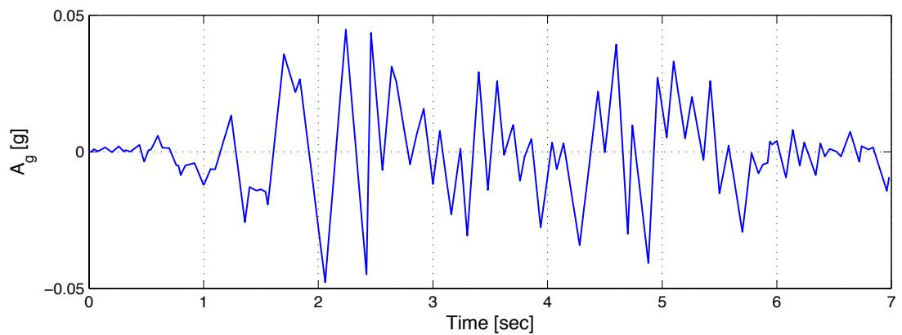

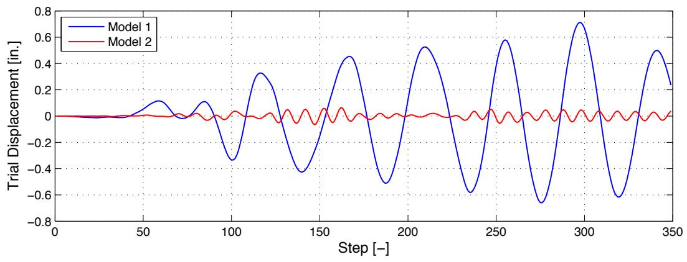  
图 3.1：1940 年 5 月 18 日帝国谷地震期间在加利福尼亚州埃尔森特罗一个场地记录到的水平南北分量地震动的前 350 个点 [5]。地面加速度数据每 0.02 秒记录一次。

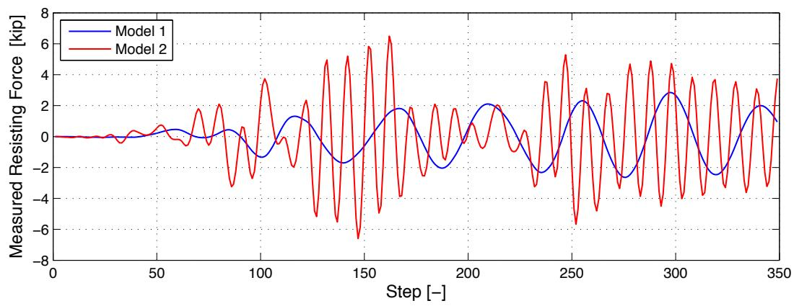  
图 3.2：模型 1 和 2 的单元 1 试验位移-时间历程图。   
图 3.3：模型 1 和 2 的单元 1 测量力-时间历程图。

通常，对于一个单元的弹性刚度增加，给定荷载条件下结构的整体变形减小。在这些模型中，将单元 1 的弹性刚度增加 25 倍，使试验位移范围减少了约 10 倍，测量力范围增加了约 3 倍。需要注意的是，模型 2 中的单元 1 不仅比模型 1 中的单元 1 硬得多，而且比单元 2 和 3 也硬得多。由于单元 1 比其他单元更硬，它承受了更多的荷载。但由于它非常坚硬，它的变形并不大。在数值上，两种模型的试验位移范围都不会造成问题。它们都在机器精度范围内。

在混合仿真中，当单元 1 被实验室中的试件替代时，根据控制和加载系统的不同，很难精确施加由模型 2 产生的这些小的单元 1 试验位移。然而，相同的控制和加载系统能够充分施加来自模型 2 的单元 1 测量力范围。此外，小位移通常比施加时更容易测量。在这种情况下，由这些试验力和测量位移对组成的 FC 混合仿真比使用相同试验位移和测量力对的 DC 混合仿真产生更真实的结果。这是假设 FC 算法产生的试验力范围与 DC 算法中的测量力范围相似。

实时和快速混合仿真是 FC 比 DC 更好的其他情况。在实时混合仿真中，仿真时间步长等于记录的地震动时间间隔。根据试件的缩放比例，仿真时间步长可以相对于记录的地震动时间间隔进行缩放。例如，1940 年 El Centro 地震动 [5] 包含每 0.02 秒记录一次的地面加速度。在实时混合仿真中，未缩放的时间步长设置为 0.02 秒，这意味着控制系统每 0.02 秒期望一个新的试验位移或力。快速混合仿真是指运行相对较快的混合仿真。仿真时间步长设置得相对较小。

在实时和快速混合仿真中，控制和加载系统都运行得很快。当混合仿真快速运行时，必须考虑试件和加载系统的动态效应。在 DC 混合仿真期间，只有抵抗力被反馈给计算驱动程序。试件的质量和粘性阻尼特性在 FEA 程序中建模。仿真期间试件惯性和粘性阻尼特性产生的力被忽略了。在快速测试期间，动态效应对整体反馈力的贡献更大。加载系统有其自身的动态效应，来自加载元件（如顶梁、作动器杆和作动器中的液压油）的运动。这些必须在仿真过程中予以考虑。同时向试件施加试验位移、速度和加速度是不可能的。更合理的做法是计算包含所有这些动态效应的施加力 [28]。

FC 混合仿真扩展了混合仿真在可测试试件类型和测试速度方面的能力。混合仿真的主要好处之一是，新的和创新的结构系统可以通过实验进行测试。对此类结构系统的测试同样需要新的和创新的测试方法。另一个主要好处是，它可以产生与振动台测试相当的结果，而无需花费成本以及将试件缩小到台面尺寸。随着混合仿真运行速度的提高，它能够更好地捕捉试件的动态效应，使其与振动台测试更具可比性。

### 3.1.3 先前研究

一些研究人员尝试了 FC 混合仿真。Thewalt [28] 在 1987 年做出了最早的尝试之一。他提出了有效力测试（EFT）方法，作为执行实时和快速混合仿真的一种方式。给定时间步 n 的离散化运动方程（方程 3.1），离散化力函数为 $\mathbf { f } _ { n } = - \mathbf { M } \ddot { \mathbf { u } } _ { g } ( t _ { n } )$，其中 ${ \ddot { u } } _ { g } ( t _ { n } )$ 是记录的地面加速度。一旦质量矩阵（M）公式化，${ \bf f } _ { n }$ 可以在仿真开始前计算。在 EFT 方法中，${ \bf f } _ { n }$ 成为试验力向量 $\hat { \mathbf { f } } _ { n }$。

$$
\mathbf {M} \ddot {\mathbf {u}} _ {n} + \mathbf {C} \dot {\mathbf {u}} _ {n} + \mathbf {r} _ {n} = \mathbf {f} _ {n} \tag {3.1}
$$

$\hat { \mathbf { f } } _ { n }$ 被转换到作动器坐标系 $( { \breve { \mathbf { f } } } _ { n } )$，然后通过加载系统施加到试件上。一旦施加了 $\breve { \mathbf { f } } _ { n }$，就会在每个作动器自由度处测量并记录恢复力 $( { \overline { { \mathbf { f } } } } _ { n } )$、位移 $( \bar {  { \mathbf { u } } } _ { n } )$、速度 $( \bar { \dot { \bf u } } _ { n } )$ 和加速度 $( \bar { \mathbf { u } } _ { n } )$。然后算法前进到下一个时间步 $n + 1$。

EFT 方法的明显优势在于，只要结构没有被划分为数值子结构和物理子结构，$\hat { \mathbf { f } } _ { n }$ 就很容易计算。这意味着整个结构进行物理测试，而质量则进行数值建模。另一个优点是它试图在实时和快速测试期间考虑惯性和能量耗散效应。这些因素使 EFT 方法成为振动台测试的良好替代方案。然而，当结构模型被划分为数值部分和实验部分时，EFT 方法就会失效。问题在于计算出的有效力仍然在每个离散化节点的全局坐标系中。不知道这些全局节点力中有多少应该施加到物理试件上。另外需要注意的是，$\mathbf { \widehat { f } } _ { n }$ 是预先计算的，意味着 $\mathbf { \hat { f } } _ { n }$ 不依赖于任何测量的反馈值。

2005 年，Pan 等人 [18] 进行了开关和混合控制混合仿真，其中使用的控制模式是位移和力。本章仅回顾 FC 部分。他们研究的开关和混合控制部分将在后续章节中讨论。Pan 等人 [18] 对高阻尼橡胶支座（HDRB）隔震器进行了混合仿真。他们的八层两跨钢框架结构模型由 HDRB 隔震。八层框架进行了分析建模，HDRB 进行了实验测试。结构的分析部分建模为每层两个自由度，一个水平和一个垂直。总共 18 个自由度。结构的实验部分设置了一个水平作动器和一个垂直作动器。水平作动器在位置控制下运行，而垂直作动器在位置和 FC 之间切换。水平和垂直自由度被认为是解耦的。因此，水平目标位移独立于垂直目标位移和力计算。他们同时使用了 1995 年 Hyogoken-Nanbu（神户）记录地震动的水平和垂直分量。

两个作动器的预测位移都使用算子分裂（OS）预测-校正方案计算，使用方程 3.1 作为时间步 n 的运动方程。预测位移通过水平作动器施加到试件上。测量的力被反馈回方案以校正预测位移。垂直试验力计算为预测垂直位移与支座垂直弹性刚度的乘积。假定支座在垂直方向上保持弹性。测量的位移和力没有反馈给时间积分方案。计算出的垂直试验力被视为方程 3.1 中的抵抗力 $( \mathbf { r } _ { n } )$。Pan 等人计算试验力的方法的一个缺点是，它仅适用于试件为弹性的情况。因此，研究人员必须事先知道试件的行为（力-变形曲线）才能使用他们的方法。

Elkhoraibi 和 Mosalam [7] 在 2007 年进行了开关控制混合仿真的研究，他们开发了一种执行 FC 的方法。他们的 FC 部分在本章中讨论。他们关于开关控制混合仿真的工作将在第 4 章介绍。Elkhoraibi 和 Mosalam 使用割线刚度估计与 α-OS 时间积分方案来计算试验力。自由度被认为是解耦的，意味着割线刚度矩阵只包含对角项。这使得割线刚度的计算相当直接。每个自由度或割线刚度矩阵对角项在迭代 $i$ 和时间步 $n+1$ 的割线刚度项 $k _ { n + 1 } ^ { i }$ 使用方程 3.2 计算，其中 ˘f i−1n+1 $\breve { f } _ { n + 1 } ^ { i - 1 }$ 和 $r _ { n }$ 分别是时间步 $n+1$ 在迭代 $i-1$ 时的试验力和时间步 $n$ 收敛的抵抗力。类似地，$\check { u } _ { n + 1 } ^ { i - 1 }$ 和 $u _ { n }$ 分别是时间步 $n+1$ 在迭代 $i-1$ 时的测量位移和时间步 n 收敛的位移。

$$
k _ {n + 1} ^ {i} = \left(\check {f} _ {n + 1} ^ {i - 1} - r _ {n}\right) / \left(\check {u} _ {n + 1} ^ {i - 1} - u _ {n}\right) \tag {3.2}
$$

试验力 $\breve { \mathbf { f } } _ { n + 1 } ^ { i }$ 通过使用预测和校正位移公式以及重新排列 HHT 运动方程（方程 2.1）得到方程 3.3、3.4、3.5 和 3.6。（Elkhoraibi 和 Mosalam 使用的 HHT 运动方程与方程 2.1 略有不同。尽管如此，两个方程在数值上是等价的。Elkhoraibi 和 Mosalam 提出的方程在本章中被重新表述，以与方程 2.1 保持一致。）

$$
\mathbf {K} ^ {*} \check {\mathbf {u}} _ {n + 1} ^ {i} + \alpha \check {\mathbf {f}} _ {n + 1} ^ {i} = \mathbf {f} _ {n + 1} ^ {*} \tag {3.3}
$$

$$
\mathbf {K} ^ {*} = \frac {\mathbf {M}}{\Delta t ^ {2} \beta} + \alpha \frac {\gamma \mathbf {C}}{\Delta t \beta} \tag {3.4}
$$

$$
\check {\mathbf {u}} _ {n + 1} ^ {i} = \mathbf {u} _ {n} + \Delta \mathbf {u} _ {n + 1} ^ {i} = \mathbf {u} _ {n} + \left(\mathbf {K} _ {n + 1} ^ {i}\right) ^ {- 1} \left(\check {\mathbf {f}} _ {n + 1} ^ {i} - \mathbf {r} _ {n}\right) \tag {3.5}
$$

$$
\mathbf {f} _ {n + 1} ^ {*} = \alpha \mathbf {f} _ {n + 1} + (1 - \alpha) \mathbf {f} _ {n} - \alpha \mathbf {C} \tilde {\mathbf {u}} _ {n + 1} - (1 - \alpha) \mathbf {C} \dot {\mathbf {u}} _ {n} + \mathbf {K} ^ {*} \tilde {\mathbf {u}} _ {n + 1} - (1 - \alpha) \mathbf {r} _ {n} \tag {3.6}
$$

使用这些方程，公式化了方程 3.7 并求解 $\breve { \mathbf { f } } _ { n + 1 } ^ { i }$。

$$
\left[ \mathbf {K} ^ {*} \left(\mathbf {K} _ {n + 1} ^ {i}\right) ^ {- 1} + \alpha \mathbf {I} \right] \check {\mathbf {f}} _ {n + 1} ^ {i} = \mathbf {f} _ {n + 1} ^ {*} + \mathbf {K} ^ {*} \left(\mathbf {K} _ {n + 1} ^ {i}\right) ^ {- 1} \mathbf {r} _ {n} - \mathbf {K} ^ {*} \mathbf {u} _ {i} \tag {3.7}
$$

这导致了迭代隐式 FC 算法，算法 3.1。

迭代时间积分方案往往会在试件上产生不现实的加载/卸载循环，同时迭代寻找收敛的抵抗力 $\mathbf { r } _ { n + 1 } ^ { l a s t }$。因此，在每次迭代中，只向试件施加增量试验力的一部分 $\lambda ( \mathbf { \check { f } } _ { n + 1 } ^ { i + 1 } - \mathbf { \check { f } } _ { n + 1 } ^ { i } )$ − ˘fin+1)，其中 λ < 1，而不是整个增量力。$\lambda$ 是由研究人员确定的调谐参数。Elkhoraibi 和 Mosalam 的方法比 Pan 等人的方法具有更广泛的应用范围，因为 Elkhoraibi 和 Mosalam 的方法即使在试件变为非弹性时也能计算试验力。

算法 3.1 隐式 FC 算法   
定义初始参数 $\alpha, \beta, \gamma, \varepsilon_r, i_{max}, \mathbf{K}_0$ 和 $\mathbf{K}^*$（方程 3.4）  
for $n = 0$ to (最大步数-1) do  
计算 $\tilde{\mathbf{u}}_{n+1}$（方程 2.5），$\tilde{\mathbf{u}}_{n+1}$（方程 2.3）和 $\mathbf{f}_{n+1}^*$（方程 3.6）  
设置 $\mathbf{K}_{n+1}^1 = \mathbf{K}_n$，$\mathbf{u}_{n+1}^1 = \tilde{\mathbf{u}}_{n+1}$ 和 $i = 0$ 计算 $\check{\mathbf{f}}_{n+1}^{i+1}$（方程 3.7）  
repeat  
在 FC 下向试件施加 $\check{\mathbf{f}}_{n+1}^{i+1}$ 并测量相应的 $\check{\mathbf{u}}_{n+1}^{i+1}$ 更新 $\mathbf{K}_{n+1}^{i+1}$（方程 3.2）  
计算 $\check{\mathbf{f}}_{n+1}^{i+2}$ $i = i + 1$ until $i > i_{max}$ 或 $|\check{\mathbf{f}}_{n+1}^{i+1} - \check{\mathbf{f}}_{n+1}^{i}| \leq \varepsilon_r$ 设置 $\mathbf{K}_{n+1} = \mathbf{K}_{n+1}^i$，$\mathbf{u}_{n+1} = \check{\mathbf{u}}_{n+1}^i$ 和 $\mathbf{r}_{n+1} = \check{\mathbf{f}}_{n+1}^{i+1}$ end for

他们方法的一个局限性是，它仅适用于具有解耦自由度的结构模型，因为其公式基于解耦自由度的割线刚度矩阵计算（方程 3.2）。在实践中，具有解耦自由度的结构模型很难找到。

2006 年，Sivaselvan 等人 [25] 提出了一种实验装置，其中要施加的力首先转换为位移。作动器接收位移并将其施加到具有已知弹性刚度的弹性弹簧上。因此，现在弹簧向试件施加一定的力。通过放置在作动器和弹簧之间的载荷传感器来测量力。这种方法试图绕开直接向作动器发送力指令的挑战。相反，作动器通过位移指令进行控制，这是一种更稳定的作动器控制方式。添加弹簧使刚性系统更具柔性，从而更容易控制。这种设置的一个缺点是弹簧必须在其整个运动范围内保持弹性。将弹簧正确连接到作动器和试件以避免任何滑移存在问题。将此设置扩展到施加相对较大的力可能会由于弹簧中储存的能量而导致额外问题。

总之，Thewalt、Pan 等人以及 Elkhoraibi 和 Mosalam 都开发了用于 FC 混合仿真中计算试验力的方法。Sivaselvan 等人的研究重点放在 FC 混合仿真的控制系统方面。尽管他们的研究扩展了混合仿真的能力，但他们的方法在应用方面受到限制。它们是为特定的控制系统和实验装置开发的。它们不够通用，其他研究人员无法轻松修改用于自己的目的。仍然需要一种更透明、可移植和稳健的 FC 混合仿真方法。

## 3.2 获取试验力的方法

FC 混合仿真的主要挑战之一是计算试验力，即要施加到试件上的力。本节提出了寻找试验力的方法。这些方法根据其公式分为两类。第一类基于求解运动方程（3.1）的基于位移的公式，通过强制变形协调。因此它们被称为兼容性力控制（CFC）方法。第二类是平衡力控制（EFC）方法。这类方法基于通过强制力平衡来求解运动方程中的力。两种方法各有优缺点，取决于其应用。本节描述这些方法的公式，并讨论这些方法的优缺点。

### 3.2.1 兼容性方法

结构工程中的大多数 FEA 软件包使用基于位移的公式来求解运动方程。兼容性方法在 FC 混合仿真中使用 FEA 程序计算的试验位移。这些位移与第 2 章第 2.5 节中计算的位移相同。兼容性方法将这些位移转换或转化为力，供控制系统施加到试件上。一种转换方式是使用切线刚度矩阵。使用切线刚度矩阵的方法在第 3.2.1.1 节中介绍。另一种将这些位移转换为力的方式是使用 Krylov 子空间。这种方法在第 3.2.1.2 节中解释。

#### 3.2.1.1 基于切线的兼容性方法

假设作动器坐标系中时间步 n 的试验力向量 $\mathbf { \xi } , \breve { \mathbf { f } } _ { n } = \breve { \mathbf { f } } ( \breve { \mathbf { u } } _ { n } )$，是同一坐标系中时间步 n 的试验位移向量 $( { \breve { \mathbf { f } } } _ { n } )$ 的函数，方程 3.10 中的泰勒展开显示 $\breve { \mathbf { f } } _ { n }$ 可以用之前的试验力 $\breve { \mathbf { f } } _ { n - 1 }$ 和当前的增量试验位移 $\breve { \mathbf { u } } _ { n }$ 来近似。

$$
\begin{array}{l} \check {\mathbf {f}} \left(\check {\mathbf {u}} _ {n}\right) = \check {\mathbf {f}} \left(\check {\mathbf {u}} _ {n - 1} + \Delta \check {\mathbf {u}} _ {n}\right) (3.8) \\ = \check {\mathbf {f}} \left(\check {\mathbf {u}} _ {n - 1}\right) + \frac {\partial \check {\mathbf {f}} \left(\check {\mathbf {u}} _ {n - 1}\right)}{\partial \mathbf {u}} \left(\Delta \check {\mathbf {u}} _ {n}\right) + H. O. T. (3.9) \\ \approx \check {\mathbf {f}} \left(\check {\mathbf {u}} _ {n - 1}\right) + \mathbf {K} _ {t} \left(\check {\mathbf {u}} _ {n - 1}\right) \cdot \left(\Delta \check {\mathbf {u}} _ {n}\right) (3.10) \\ \end{array}
$$

结构的切线刚度矩阵 $\left( \mathbf { K } _ { t } \right)$ 是抵抗力向量函数 $\breve { \bf f } ( \breve { \bf u } _ { n - 1 } )$ 的雅可比矩阵。作动器坐标系中时间步 n 的试验力 $( { \breve { \mathbf { f } } } _ { n } )$ 可以通过类似方程 3.11 的方式计算。

$$
\check {\mathbf {f}} _ {n} = \mathbf {K} _ {n - 1} ^ {A c t} \Delta \check {\mathbf {u}} _ {n} + \bar {\mathbf {f}} _ {n - 1} \tag {3.11}
$$

在方程 3.11 中，${ \bf K } _ { n - 1 } ^ { A c t }$ 是由先前在时间步 $n-1$ 测量的和计算的反应量计算得出的试件切线刚度矩阵。$\Delta \breve { \mathbf { u } } _ { n }$ 是增量试验位移向量，其中 $\Delta \Breve { \mathbf { u } } _ { n } = \Breve { \mathbf { u } } _ { n } - \Breve { \mathbf { u } } _ { n - 1 }$。$\breve { \mathbf { u } } _ { n }$ 和 $\breve {  { \mathbf { u } } } _ { n - 1 }$ 是在第 2 章第 2.5 节的步骤 3 中计算的位移向量。$\bar { \bf f } _ { n - 1 }$ 是在作动器坐标系中 n-1 时测量的力。${ \bf K } _ { n - 1 } ^ { A c t }$、$\Delta \breve { \mathbf { u } } _ { n }$ 和 $\overline { { \mathbf { f } } } _ { n - 1 }$ 都在作动器坐标系中。

基于切线的兼容性方法的关键在于作动器坐标系中试件切线刚度矩阵 $( \mathbf { K } ^ { A c t } )$ 的公式化。在 DC 混合仿真中，实验单元的 $\mathbf { K } _ { t }$ 通常不在每个时间步都公式化。相反，在整个动力分析中使用初始切线刚度矩阵，即实验单元的弹性刚度矩阵 $\mathbf { \left( K _ { 0 } \right) }$。与使用 $\mathbf { K } _ { 0 }$ 相关的误差要么被接受，要么在时间积分方案中得到校正。$\mathbf { K } _ { 0 }$ 可以通过分析或实验 [3] 计算。在混合仿真中，在每个时间步更新切线刚度矩阵有其好处。但由于其固有的困难，通常不这样做。然而，已经有一些在混合测试期间通过实验估计切线刚度矩阵的尝试。这些用于实验估计切线刚度矩阵的方法可以用来计算试验力。本节的剩余部分涵盖了计算试件切线刚度矩阵的各种方法。

牛顿方法有一个子类，称为割线或拟牛顿方法。之所以如此称呼，是因为在整个迭代过程中从未形成真正的牛顿方程 [12]。换句话说，雅可比矩阵根本没有直接公式化。而是使用雅可比矩阵的割线近似。这种近似通过对当前雅可比矩阵进行连续的秩一更新来执行。其中最著名的是 Broyden 方法 [2]。Carrion 和 Spencer [4] 使用 Broyden 方法来更新基于模型的时间延迟补偿的刚度矩阵。

$$
\mathbf {K} _ {n} = \mathbf {K} _ {n - 1} + \frac {\left(\Delta \mathbf {r} _ {n} - \mathbf {K} _ {n - 1} \Delta \mathbf {u} _ {n}\right) \Delta \mathbf {u} _ {n} ^ {T}}{\Delta \mathbf {u} _ {n} ^ {T} \Delta \mathbf {u} _ {n}} \tag {3.12}
$$

更新使用增量位移 $( \Delta \mathbf { u } _ { n } )$ 和力 $( \Delta \mathbf { r } _ { n } )$ 向量。尽管他们的公式是在全局坐标系中，但可以很容易地适应作动器坐标系。

$$
\mathbf {K} _ {n} ^ {A c t} = \mathbf {K} _ {n - 1} ^ {A c t} + \frac {\left(\Delta \bar {\mathbf {f}} _ {n} - \mathbf {K} _ {n - 1} ^ {A c t} \Delta \bar {\mathbf {u}} _ {n}\right) \Delta \bar {\mathbf {u}} _ {n} ^ {T}}{\Delta \bar {\mathbf {u}} _ {n} ^ {T} \Delta \bar {\mathbf {u}} _ {n}} \tag {3.13}
$$

$\Delta \bar { \mathbf { u } } _ { n }$ 和 $\Delta \bar { \mathbf { f } } _ { n }$ 是时间步 $n$ 在作动器坐标系中测得的增量位移和力向量。

与 Carrion 和 Spencer 类似，Igarashi 等人 [11] 使用 Broyden-Fletcher-Goldfarb-Shanno（BFGS）方法开发了算法 3.2，以在五层全尺寸建筑的混合仿真过程中更新切线刚度矩阵。他们利用刚度矩阵来缩放作动器运动。该算法使用已知的 $\Delta \bar { \mathbf { u } } _ { n }$ 和 $\Delta \bar { \mathbf { f } } _ { n }$ 对。方程 3.14 可以从方程 3.11 推导出来。

$$
\Delta \bar {\mathbf {f}} _ {n} = \mathbf {K} _ {n} ^ {A c t} \Delta \bar {\mathbf {u}} _ {n} \tag {3.14}
$$

BFGS 是 Broyden 方法的一个变种。BFGS 方法假设刚度矩阵是对称正定的，这是一个有效的假设。该算法遵循最小更新方法。具有较小 Forbenius 范数的增量刚度 $\Delta \mathbf { K } _ { n } ^ { A c t }$ 更新刚度矩阵。算法 3.2 中的 ε 参数取决于测量设备的精度。设置该参数是为了防止测量设备的噪声错误地触发更新。

近年来，研究人员提出了非割线基的方法来估计切线刚度矩阵。Ahmadizadeh 和 Mosqueda [1] 开发了这样一种方法来提高 OS 时间积分方案的性能。他们通过使用“内在”坐标系来更新刚度矩阵。$\mathbf { K } _ { n } ^ { A c t }$ 是通过转换内在坐标系中的刚度矩阵得到的。

算法 3.2 BFGS 方法   
指定 $\mathbf{K}_0^{Act}$ 的值并设置 $\hat{\mathbf{K}}_0^{Act} = \mathbf{K}_0^{Act}$ 设置 $\varepsilon$ for $n = 0$ to (最大步数-1) do  
测量 $\Delta \hat{\mathbf{x}}_n$ 和 $\Delta \hat{\mathbf{f}}_n$ if $\Delta \hat{\mathbf{f}}_n^T\Delta \hat{\mathbf{x}}_n\geq \varepsilon \| \Delta \hat{\mathbf{f}}_n\| \| \Delta \hat{\mathbf{x}}_n\|$ then $\hat{\mathbf{K}}_{n + 1}^{Act} = \hat{\mathbf{K}}_n^{Act}$ else $\Delta \mathbf{K}1_{n}^{Act} = [1 + \frac{\Delta\hat{\mathbf{x}}_n^T\mathbf{K}_0^{Act}\Delta\hat{\mathbf{x}}_n}{\Delta\hat{\mathbf{f}}_n^T\Delta\hat{\mathbf{x}}_n} ]\frac{\Delta\hat{\mathbf{f}}_n\Delta\hat{\mathbf{f}}_n^T}{\Delta\hat{\mathbf{f}}_n^T\Delta\hat{\mathbf{x}}_n} -\frac{\Delta\hat{\mathbf{f}}_n\Delta\hat{\mathbf{x}}_n^T\mathbf{K}_0^{Act}}{\Delta\hat{\mathbf{f}}_n^T\Delta\hat{\mathbf{x}}_n} -\frac{\mathbf{K}_0^{Act}\Delta\hat{\mathbf{x}}_n\Delta\hat{\mathbf{f}}_n^T}{\Delta\hat{\mathbf{f}}_n^T\Delta\hat{\mathbf{x}}_n}$ $\Delta \mathbf{K}2_{n}^{Act} = [1 + \frac{\Delta\hat{\mathbf{x}}_n^T\hat{\mathbf{K}}_n^{Act}\Delta\hat{\mathbf{x}}_n}{\Delta\hat{\mathbf{f}}_n^T\Delta\hat{\mathbf{x}}_n} ]\frac{\Delta\hat{\mathbf{f}}_n\Delta\hat{\mathbf{f}}_n^T}{\Delta\hat{\mathbf{f}}_n^T\Delta\hat{\mathbf{x}}_n} -\frac {\Delta \hat {\mathbf{f}}_n\Delta \hat {\mathbf{x}}_n^T\hat {\mathbf{K}}_n^{Act}}{\Delta \hat {\mathbf{f}}_n^T\Delta \hat {\mathbf{x}}_n} -\frac {\hat {\mathbf{K}}_n^{Act}\Delta \hat {\mathbf{x}}_n\Delta \hat {\mathbf{f}}_n^T}{\Delta \hat {\mathbf{f}}_n^T\Delta \hat {\mathbf{x}}_n}$ if $\| \Delta \mathbf{K}1_{n}^{Act}\|_{F}\leq \| \Delta \mathbf{K}2_{n}^{Act}\|_{F}$ then $\hat{\mathbf{K}}_{n + 1}^{Act} = \mathbf{K}_0^{Act} + \Delta \mathbf{K}1_{n}^{Act}$ else $\hat{\mathbf{K}}_{n + 1}^{Act} = \hat{\mathbf{K}}_n^{Act} + \Delta \mathbf{K}2_{n}^{Act}$ end if  
end if  
end for

$$
\mathbf {K} _ {n} ^ {A c t} = \mathbf {T} _ {p} ^ {T} \mathbf {P} _ {n} \mathbf {T} _ {p} \tag {3.15}
$$

$\mathbf { T } _ { p }$ 将位移从作动器坐标系转换到内在坐标系。这种转换的重要结果是 ${ \bf P } _ { n }$ 现在是对角矩阵。局部测量的增量位移和力通过方程 3.16 和 3.17 转换到内在坐标系。

$$
\Delta \mathbf {u} _ {n} ^ {P} = \mathbf {T} _ {p} \Delta \bar {\mathbf {u}} _ {n} \tag {3.16}
$$

$$
\Delta \mathbf {f} _ {n} ^ {P} = \mathbf {P} _ {n - 1} \mathbf {T} _ {P} \left(\mathbf {K} _ {n - 1} ^ {A c t}\right) ^ {- 1} \Delta \bar {\mathbf {f}} _ {n} \tag {3.17}
$$

${ \bf P } _ { n }$ 使用 $\Delta \mathbf { x } _ { n } ^ { p }$ 和 $\Delta \mathbf { f } _ { n } ^ { p }$ 轻松更新。

$$
\mathbf {P} _ {n} = \operatorname {d i a g} \left(\Delta \mathbf {u} _ {n} ^ {P}\right) ^ {- 1} \operatorname {d i a g} \left(\Delta \mathbf {f} _ {n} ^ {p}\right) \tag {3.18}
$$

需要为每个实验装置和试件确定内在坐标系。然后，$\mathbf { T } _ { P }$ 和 ${ \bf P } _ { n }$ 根据内在坐标系公式化。Ahmadizadeh 和 Mosqueda 使用一个简单的 2-DOF 实验装置展示了一个示例，但随着装置变得更复杂，这个过程可能会更加困难。这种方法从此处起被称为内在方法。

另一个非割线基方法由 Hung 和 El-Tawi [10] 提出。他们的意图与 Ahmadizadeh 和 Mosqueda 相同，即改进 OS 时间积分方案。他们的算法基于方程 3.14 以及切线刚度矩阵在时间步之间不会剧烈变化的假设。矩阵 $\Delta \bar { \mathbf F }$ 和 $\Delta \bar { \bf U }$ 由来自时间步 $n+1$ 到 n+2−m 的 m 个 $\bar { \Delta \mathbf { f } }$ 和 $\Delta \bar { \mathbf { u } }$ 向量组成。$\Delta \bar { f } _ { j } ^ { ( i ) }$ 和 $\Delta \bar { u } _ { j } ^ { ( i ) }$ 是在时间步 $i ^ { t h }$ 在第 $i ^ { t h }$ 自由度测得的增量力和位移。方程 3.19 形成，其中 $k _ { n + 1 } ^ { ( i , j ) }$ 是时间步 $n+1$ 处 ${ \bf K } _ { n + 1 } ^ { A c t }$ 在第 $i$ 行第 $j$ 列的条目，其中 $dof$ 是自由度的总数。

$$
\begin{array}{l} \left[ \begin{array}{c c c c} \Delta \bar {f} _ {n + 2 - m} ^ {(1)} & \Delta \bar {f} _ {n + 3 - m} ^ {(1)} & \dots & \Delta \bar {f} _ {n + 1} ^ {(1)} \\ \Delta \bar {f} _ {n + 2 - m} ^ {(2)} & \Delta \bar {f} _ {n + 3 - m} ^ {(2)} & \dots & \Delta \bar {f} _ {n + 1} ^ {(2)} \\ \vdots & \vdots & & \vdots \\ \Delta \bar {f} _ {n + 2 - m} ^ {(d o f)} & \Delta \bar {f} _ {n + 3 - m} ^ {(d o f)} & \dots & \Delta \bar {f} _ {n + 1} ^ {(d o f)} \end{array} \right] = \\ \left[ \begin{array}{c c c c} k _ {n + 1} ^ {(1, 1)} & k _ {n + 1} ^ {(1, 2)} & \dots & k _ {n + 1} ^ {(1, d o f)} \\ k _ {n + 1} ^ {(2, 1)} & k _ {n + 1} ^ {(2, 2)} & \dots & k _ {n + 1} ^ {(2, d o f)} \\ \vdots & \vdots & & \vdots \\ k _ {n + 1} ^ {(d o f, 1)} & k _ {n + 1} ^ {(d o f, 2)} & \dots & k _ {n + 1} ^ {(d o f, d o f)} \end{array} \right] \left[ \begin{array}{c c c c} \Delta \bar {u} _ {n + 2 - m} ^ {(1)} & \Delta \bar {u} _ {n + 3 - m} ^ {(1)} & \dots & \Delta \bar {u} _ {n + 1} ^ {(1)} \\ \Delta \bar {u} _ {n + 2 - m} ^ {(2)} & \Delta \bar {u} _ {n + 3 - m} ^ {(2)} & \dots & \Delta \bar {u} _ {n + 1} ^ {(2)} \\ \vdots & \vdots & & \vdots \\ \Delta \bar {u} _ {n + 2 - m} ^ {(d o f)} & \Delta \bar {u} _ {n + 3 - m} ^ {(d o f)} & \dots & \Delta \bar {u} _ {n + 1} ^ {(d o f)} \end{array} \right]  \\ \end{array}
\text{(3.19)}
% \tag {3.19}
$$

当方程 3.19 的两边转置时，得到以下结果。

$$
\begin{array}{l} \left[ \left( \begin{array}{c c} \Delta \bar {f} _ {n + 2 - m} ^ {(1)} & \left( \begin{array}{c} \Delta \bar {f} _ {n + 2 - m} ^ {(2)} \\ \Delta \bar {f} _ {n + 3 - m} ^ {(1)} \\ \vdots \\ \Delta \bar {f} _ {n + 1} ^ {(1)} \end{array} \right) \\ \Delta \bar {f} _ {n + 1} ^ {(1)} \end{array} \right) \quad \left( \begin{array}{c} \Delta \bar {f} _ {n + 2 - m} ^ {(2)} \\ \Delta \bar {f} _ {n + 3 - m} ^ {(2)} \\ \vdots \\ \Delta \bar {f} _ {n + 1} ^ {(2)} \end{array} \right) \quad \ldots \quad \left( \begin{array}{c} \Delta \bar {f} _ {n + 2 - m} ^ {(d o f)} \\ \Delta \bar {f} _ {n + 3 - m} ^ {(d o f)} \\ \vdots \\ \Delta \bar {f} _ {n + 1} ^ {(d o f)} \end{array} \right) \right] = \\ \left[ \begin{array}{c c c c} \Delta \bar {u} _ {n + 2 - m} ^ {(1)} & \Delta \bar {u} _ {n + 2 - m} ^ {(2)} & \dots & \Delta \bar {u} _ {n + 2 - m} ^ {(d o f)} \\ \Delta \bar {u} _ {n + 3 - m} ^ {(1)} & \Delta \bar {u} _ {n + 3 - m} ^ {(2)} & \dots & \Delta \bar {u} _ {n + 3 - m} ^ {(d o f)} \\ \vdots & \vdots & & \vdots \\ \Delta \bar {u} _ {n + 1} ^ {(1)} & \Delta \bar {u} _ {n + 1} ^ {(2)} & \dots & \Delta \bar {u} _ {n + 1} ^ {(d o f)} \end{array} \right] \left[ \begin{array}{c c c c} \left(k _ {n + 1} ^ {(1, 1)}\right) & \left(k _ {n + 1} ^ {(2, 1)}\right) & \dots & \left(k _ {n + 1} ^ {(d o f, 1)}\right) \\ k _ {n + 1} ^ {(1, 2)} & k _ {n + 1} ^ {(2, 2)} & \vdots & k _ {n + 1} ^ {(d o f, 2)} \\ k _ {n + 1} ^ {(1, d o f)} & k _ {n + 1} ^ {(2, d o f)} & \vdots & k _ {n + 1} ^ {(d o f, d o f)} \end{array} \right]  \\ \end{array}
\text{(3.20)}
% \tag {3.20}
$$

m 必须大于或等于 dof。当 $m = dof$ 时，${ \bf K } _ { n + 1 } ^ { A c t }$ 的行通过使用高斯消元法求解方程 3.21 获得。当 $m > dof$ 时，${ \bf K } _ { n + 1 } ^ { A c t }$ 的行通过最小二乘法找到。

$$
\left( \begin{array}{c} \Delta \bar {f} _ {n + 2 - m} ^ {(i)} \\ \Delta \bar {f} _ {n + 3 - m} ^ {(i)} \\ \vdots \\ \Delta \bar {f} _ {n + 1} ^ {(i)} \end{array} \right) = \left[ \begin{array}{c c c c} \Delta \bar {u} _ {n + 2 - m} ^ {(1)} & \Delta \bar {u} _ {n + 2 - m} ^ {(2)} & \dots & \Delta \bar {u} _ {n + 2 - m} ^ {(d o f)} \\ \Delta \bar {u} _ {n + 3 - m} ^ {(1)} & \Delta \bar {u} _ {n + 3 - m} ^ {(2)} & \dots & \Delta \bar {u} _ {n + 3 - m} ^ {(d o f)} \\ \vdots & \vdots & & \vdots \\ \Delta \bar {u} _ {n + 1} ^ {(1)} & \Delta \bar {u} _ {n + 1} ^ {(2)} & \dots & \Delta \bar {u} _ {n + 1} ^ {(d o f)} \end{array} \right] \left( \begin{array}{c} k _ {n + 1} ^ {(n, 1)} \\ k _ {n + 1} ^ {(n, 2)} \\ \vdots \\ k _ {n + 1} ^ {(n, d o f)} \end{array} \right)
\text{(3.21)} 
% \tag {3.21}
$$

该算法将初始切线矩阵用于卸载/再加载切线矩阵。当增量试验位移小于用户定义的阈值时，它也不更新刚度矩阵。Hung 和 El-Tawi 建议将阈值设置为位移分辨率的两到三倍。这种方法从此处起被称为转置方法。

在本小节中，提出了四种估计切线刚度矩阵的方法：Broyden、BFGS、Intrinsic 和 Transpose 方法。这四种方法最初并非为 FC 混合仿真而设计。然而，它们可以用来估计方程 3.11 中的 ${ \bf K } _ { n - 1 } ^ { A c t }$，这是计算试验力的关键要素。这些方法在 FC 混合仿真中的实现将在本章第 3.3.1 节中介绍。

#### 3.2.1.2 基于 Krylov 子空间的兼容性方法

使用切线刚度矩阵来获取目标力是有前景的，但这些方法确实存在一个固有困难，即克服测量仪器噪声引起的虚假更新。关于这些估计的准确性也存在一些问题。更理想的方法是避开切线刚度矩阵来找到试验力。本小节描述了一种子空间方法，直接从 ∆u˘ 和 $\breve { \pmb { \Delta } } \breve { \pmb { \mathrm { f } } }$ 获取试验力。

Scott 和 Fenves [22] 使用 Krylov 子空间来加速牛顿法。以类似的方式，Krylov 子空间可以成为试验力向量的基础。从方程 3.22 开始，其中作动器坐标系中的柔度矩阵 $( \mathbf { F } ^ { A c t } )$ 是刚度矩阵 $( \mathbf { K } ^ { A c t } )$ 的逆。

$$
0 = \Delta \breve {\mathbf {u}} _ {n + 1} - \mathbf {F} ^ {A c t} \Delta \breve {\mathbf {f}} _ {n + 1} \tag {3.22}
$$

其中 $\Delta \breve { \mathbf u } _ { n + 1 }$ 是来自 FEA 软件的作动器坐标系中的试验位移向量。$\Delta \breve { \mathbf { f } } _ { n + 1 }$ 被写成两个向量 ${ \bf p } _ { n + 1 }$ 和 ${ \bf q } _ { n + 1 }$ 的和。

$$
\Delta \mathbf {f} _ {n + 1} = \mathbf {p} _ {n + 1} + \mathbf {q} _ {n + 1} \tag {3.23}
$$

现在方程 3.22 变为

$$
0 = \Delta \breve {\mathbf {u}} _ {n + 1} - \mathbf {F} ^ {A c t} \Delta \mathbf {p} _ {n + 1} - \mathbf {F} ^ {A c t} \Delta \mathbf {q} _ {n + 1} \tag {3.24}
$$

该算法的关键是最小化 $\Delta \breve { \mathbf { x } } _ { n + 1 }$ 和 $\mathbf { F } ^ { A c t } \mathbf { p } _ { n + 1 }$ 之差的 2-范数。

$$
\min  \left\| \Delta \breve {\mathbf {u}} _ {n + 1} - \mathbf {F} ^ {A c t} \mathbf {p} _ {n + 1} \right\| _ {2} \tag {3.25}
$$

${ \bf p } _ { n + 1 }$ 被假定为先前的力增量向量 $\Delta \mathsf { \breve { f } } _ { 1 } , \Delta \mathsf { \breve { f } } _ { 2 } , \cdots , \Delta \mathsf { \breve { f } } _ { n }$ 的线性组合。

$$
\mathbf {p} _ {n + 1} = c _ {1} \Delta \check {\mathbf {f}} _ {1} + c _ {2} \Delta \check {\mathbf {f}} _ {2} + \dots + c _ {n} \Delta \check {\mathbf {f}} _ {n} \tag {3.26}
$$

那么向量 $\mathbf { F } ^ { A c t } \mathbf { p } _ { n + 1 }$ 是

$$
\mathbf {F} ^ {A c t} \mathbf {p} _ {n + 1} = c _ {1} \mathbf {F} ^ {A c t} \Delta \check {\mathbf {f}} _ {1} + c _ {2} \mathbf {F} ^ {A c t} \Delta \check {\mathbf {f}} _ {2} + \dots + c _ {n} \mathbf {F} ^ {A c t} \Delta \check {\mathbf {f}} _ {n} \tag {3.27}
$$

根据方程 3.22，$\mathbf { F } ^ { A c t } \Delta \breve { \mathbf { f } } _ { 1 } , \mathbf { F } ^ { A c t } \Delta \breve { \mathbf { f } } _ { 2 } , \cdots , \mathbf { F } ^ { A c t } \Delta \breve { \mathbf { f } } _ { n }$ 使用先前测量的增量位移 $\Delta \bar { \mathbf { u } } _ { 1 } , \Delta \bar { \mathbf { u } } _ { 2 } , \cdots , \Delta \bar { \mathbf { u } } _ { n }$ 来估计。使用方程 3.25 求解常数 $c _ { 1 } , c _ { 2 } , \cdots , c _ { n }$ 成为一个最小二乘问题。使用 $c _ { 1 } , c _ { 2 } , \cdots , c _ { n }$ 并将 $\mathbf { F } ^ { A c t } \Delta \mathbf { \check { f } } _ { 1 } , \mathbf { F } ^ { A c t } \Delta \mathbf { \check { f } } _ { 2 } , \cdots , \mathbf { F } ^ { A c t } \Delta \mathbf { \check { f } } _ { n }$ 替换为 $\Delta \bar { \mathbf { u } } _ { 1 } , \Delta \bar { \mathbf { u } } _ { 2 } , \cdots , \Delta \bar { \mathbf { u } } _ { n }$，通过方程 3.27 计算 $\mathbf { F } ^ { A c t } \mathbf { p } _ { n + 1 }$。最小二乘残差 $\mathbf { v } _ { n + 1 }$ 为

$$
\mathbf {v} _ {n + 1} = \Delta \breve {\mathbf {u}} _ {n + 1} - \mathbf {F} ^ {A c t} \mathbf {p} _ {n + 1} \tag {3.28}
$$

方程 3.24 用 $\mathbf { v } _ { n + 1 }$ 重写为

$$
0 = \mathbf {v} _ {n + 1} - \mathbf {F} ^ {A c t} \mathbf {q} _ {n + 1} \tag {3.29}
$$

通过将 $\Breve { \mathbf { u } } _ { n + 1 } \Breve { \mathbf { u } } _ { n + 1 } - \mathbf { F } ^ { A c t } \mathbf { p } _ { n + 1 }$ 代入 $\mathbf { v } _ { n + 1 }$。$\mathbf { q } _ { n + 1 }$ 使用下式求解

$$
\mathbf {q} _ {n + 1} = \mathbf {A} \mathbf {v} _ {n + 1} \tag {3.30}
$$

初始刚度矩阵 $\mathbf { K } _ { 0 } ^ { A c t }$ 是 A 的合理替代，因为它恰当地将变形 $\mathbf { v } _ { n + 1 }$ 与力 ${ \bf q } _ { n + 1 }$ 联系起来。最后，增量试验力 $\Delta \breve { \mathbf { f } } _ { n + 1 }$ 通过方程 3.23 求出。

刚度矩阵仅在方程 3.30 中使用。由于使用了 $\mathbf { K } _ { 0 } ^ { A c t }$，这绕开了估计 $\mathbf { K } _ { t } ^ { A c t }$ 的需要。然而，如果存在对 $\mathbf { K } _ { t } ^ { A c t }$ 的良好估计，也可以使用它。

### 3.2.2 平衡方法

在静力结构分析中，通常使用位移法进行分析，即从给定的刚度矩阵和节点力求解节点变形。这是一个边值问题。静力分析中的位移法也与用于混合仿真求解运动方程的时间积分方案配合良好。还存在一种不太常用的静力结构分析方法，称为力法。在力法中，单元力直接从给定的柔度矩阵和节点力求解。因此，力法成为为 FC 混合仿真制定计算试验力方法的逻辑起点。

力法用于确定静不定结构的单元力。该方法从静力平衡方程开始

$$
\mathbf {r} = \mathbf {B} \hat {\mathbf {r}} = \mathbf {f} - \mathbf {f} _ {w} \tag {3.31}
$$

其中 B 是联系单元抵抗力 $\hat{\mathbf{r}}$ 与节点抵抗力 $\mathbf{r}$ 的平衡矩阵。$\mathbf{f}$ 和 $\mathbf { f } _ { w }$ 分别是施加的节点荷载和等效单元荷载。等效单元荷载通常由分布荷载、温度荷载和初始单元变形引起。方程 3.32 中的单元抵抗力被写为基本系统 $\mathbf { B } _ { i } ( \mathbf { f } - \mathbf { f } _ { w } )$ 和冗余系统 $\mathbf { B } _ { x } \hat { \mathbf { r } } _ { x }$ 的组合。

$$
\hat {\mathbf {r}} = \mathbf {B} _ {i} \left(\mathbf {f} - \mathbf {f} _ {w}\right) + \mathbf {B} _ {x} \hat {\mathbf {r}} _ {x} \tag {3.32}
$$

基本系统是一个稳定的静定结构。它通过在特定单元中引入切口从原始结构创建而成。被切割单元中的抵抗力是冗余力 $\hat { \mathbf { r } } _ { x }$。在整个结构静定的情况下，$\mathbf { B } _ { x } \hat { \mathbf { r } } _ { x } = \mathbf { 0 }$。$\mathbf { B } _ { i }$ 是力影响矩阵，它确定基本结构的单元力 $( \hat { \mathbf { r } } _ { p } )$ 与节点荷载力之间的关系，$\hat { \mathbf { r } } _ { p } = \mathbf { B } _ { i } ( \mathbf { f } - \mathbf { f } _ { w } )$。$\mathbf { B } _ { x }$ 是冗余力影响矩阵，其中每一列由每个单位冗余力加载产生的单元力组成。

$\hat { \mathbf { r } } _ { p }$ 在被切割单元中产生一个间隙 $( \mathbf { d } _ { x } )$。力法的关键在于通过强制方程 3.33 来闭合这个间隙。

$$
\mathbf {0} = \mathbf {B} _ {x} ^ {T} \mathbf {v} \tag {3.33}
$$

将方程 3.32 代入本构关系

$$
\mathbf {v} = f (\hat {\mathbf {r}}) + \mathbf {v} _ {0} \tag {3.34}
$$

其中 $\mathbf{v}$ 是作为单元力 $\hat{\mathbf{r}}$ 和初始单元变形 $\mathbf { \Pi } ( \mathbf { v } _ { 0 } )$ 函数的单元变形，方程 3.34 变为

$$
\mathbf {v} = f \left(\mathbf {B} _ {i} \left(\mathbf {f} - \mathbf {f} _ {w}\right) + \mathbf {B} _ {x} \hat {\mathbf {r}} _ {x}\right) + \mathbf {v} _ {0} \tag {3.35}
$$

现在将方程 3.35 代入方程 3.33，得到

$$
\mathbf {0} = \mathbf {B} _ {x} ^ {T} \left[ f \left(\mathbf {B} _ {i} \left(\mathbf {f} - \mathbf {f} _ {w}\right) + \mathbf {B} _ {x} \hat {\mathbf {r}} _ {x}\right) + \mathbf {v} _ {0} \right] \tag {3.36}
$$

在线性情况下 $\mathbf { v } = \mathbf { F } _ { s } \hat { \mathbf { r } } + \mathbf { v } _ { 0 }$，其中 ${ \bf F } _ { s }$ 是单元的非连接柔度矩阵，方程 3.36 变为

$$
\mathbf {0} = \mathbf {B} _ {x} ^ {T} \left[ \mathbf {F} _ {s} \left(\mathbf {B} _ {i} \left(\mathbf {f} - \mathbf {f} _ {w}\right) + \mathbf {B} _ {x} \hat {\mathbf {r}} _ {x}\right) + \mathbf {v} _ {0} \right] \tag {3.37}
$$

并且

$$
\mathbf {0} = \mathbf {B} _ {x} ^ {T} \left[ \mathbf {F} _ {s} \left(\hat {\mathbf {r}} _ {p}\right) + \mathbf {v} _ {0} \right] + \left(\mathbf {B} _ {x} ^ {T} \mathbf {F} _ {s} \mathbf {B} _ {x}\right) \hat {\mathbf {r}} _ {x} \tag {3.38}
$$

并且

$$
\mathbf {0} = \mathbf {d} _ {x} + \mathbf {F} _ {x} \hat {\mathbf {r}} _ {x} \tag {3.39}
$$

其中 $\mathbf { d } _ { x } = \mathbf { B } _ { i } ^ { T } \bigg ( \mathbf { F } _ { s } \big ( \hat { \mathbf { r } } _ { p } \big ) + \mathbf { v } _ { 0 } \bigg )$ 且 $\mathbf { F } _ { x } = \mathbf { B } _ { x } ^ { T } \mathbf { F } _ { s } \mathbf { B } _ { x }$。方程 3.39 中唯一的未知数是 $\hat { \mathbf { r } } _ { x }$。一旦找到 $\hat { \mathbf { r } } _ { x }$，单元力 $\hat { \mathbf { r } }$ 通过方程 3.32 计算。然后使用本构关系（方程 3.34）计算单元变形（v）。方程 3.40 中的协调关系给出了给定单元变形下的节点变形。

$$
\mathbf {u} = \mathbf {B} _ {i} ^ {T} \mathbf {v} 
\quad\quad\text{(3.40)}
% \tag {3.40}
$$

Patnaik [19] 开发了力法的一个变体，称为集成力法。集成力法将单元力视为独立变量，并且不将单元力分为基本单元力和冗余单元力。它直接求解 $\hat{\mathbf{r}}$。Patnaik 的公式如方程 3.41 所示。顶部行使用方程 3.31。在方程 3.33 中，将 $\mathbf{v}$ 替换为方程 3.34 成为底部行。

$$
\left[ \begin{array}{c} \mathbf {B} \hat {\mathbf {r}} \\ \mathbf {B} _ {x} ^ {T} [ f (\hat {\mathbf {r}}) + \mathbf {v} _ {0} ] \end{array} \right] = \left[ \begin{array}{c} \mathbf {f} - \mathbf {f} _ {w} \\ \mathbf {0} \end{array} \right] 
\quad\quad\text{(3.41)}
% \tag {3.41}
$$

方程 3.41 可以简化为

$$
F (\hat {\mathbf {r}}) = \mathbf {f} ^ {*} \tag {3.42}
$$

其中 $F ( \hat { \mathbf { r } } )$ 是 $\hat { \mathbf { r } }$ 的向量函数，且 $\mathbf { f } ^ { * } = \left[ \mathbf { f } - \mathbf { f } _ { w } \right]$。在线性情况下，$F ( \hat { \mathbf { r } } ) = \left[ \mathbf { B } _ { x } \right] \hat { \mathbf { r } }$。$\left[ - \mathbf { B } _ { x } ^ { T } \mathbf { F } _ { s } \right]$ 是一个方阵，只要结构是稳定的，它就是非奇异的，并且可以直接求解 $\hat{\mathbf{r}}$。在非线性情况下，可以通过建立以下残差函数来求解单元力

$$
R (\hat {\mathbf {r}}) = F (\hat {\mathbf {r}}) - \mathbf {f} ^ {*} \tag {3.43}
$$

可以利用牛顿法迭代求解 $R ( \hat { \mathbf { r } } )$ 的零点。

$$
\left[ \frac {\partial R \left(\hat {\mathbf {r}} ^ {i}\right)}{\partial \hat {\mathbf {r}} ^ {i}} \right] \Delta \hat {\mathbf {r}} ^ {i} = - R \left(\hat {\mathbf {r}} ^ {i}\right) \tag {3.44}
$$

在方程 3.44 中，i 表示迭代次数，$\Delta \hat { \mathbf r } ^ { i } = \hat { \mathbf r } ^ { i + 1 } - \hat { \mathbf r } ^ { i }$，且 $\frac { \partial R ( \hat { \mathbf { r } } ^ { i } ) } { \partial \hat { \mathbf { r } } ^ { i } } = \left[ \mathbf { B } _ { x } ^ { \phantom { x } } \frac { \mathbf { B } } { \partial \hat { \mathbf { r } } ^ { i } } \right]$。通过方程 3.44 求解 $\Delta \hat { \mathbf { r } } ^ { i }$。方程 3.44 中的 $\frac { \partial f ( \hat { \mathbf { r } } ^ { i } ) } { \partial \hat { \mathbf { r } } ^ { i } }$ 是非连接切线柔度矩阵。随后，为下一次迭代 $i + 1$ 找到 $\hat { \mathbf { r } } ^ { i + 1 }$。此方法继续迭代，直到达到某个容差标准。

集成力法提供了一种开发基于力的时间积分方案来求解运动方程的方法。从方程 3.1 开始，${ \bf r } _ { n }$ 可以替换为 $F ( \hat { \mathbf { r } } _ { n } )$，得到以下运动方程

$$
\left[ \begin{array}{l} \mathbf {M} \\ \mathbf {0} \end{array} \right] \ddot {\mathbf {u}} _ {n} + \left[ \begin{array}{l} \mathbf {C} \\ \mathbf {0} \end{array} \right] \dot {\mathbf {u}} _ {n} + \left[ \begin{array}{c} \mathbf {B} \hat {\mathbf {r}} _ {n} \\ \mathbf {B} _ {x} ^ {T} [ f (\hat {\mathbf {r}} _ {n}) + \mathbf {v} _ {0} ] \end{array} \right] = \left[ \begin{array}{l} \mathbf {f} _ {n} \\ \mathbf {0} \end{array} \right] 
\quad\quad\text{(3.41)}
% \tag {3.45}
$$

设 $\mathbf { M } _ { b } = \binom { \mathbf { M } } { \mathbf { 0 } } , \mathbf { C } _ { b } = \binom { \mathbf { C } } { \mathbf { 0 } } , \mathbf { r } _ { n } ^ { * } = \bigg [ \mathbf { B } \hat { \mathbf { r } } _ { n }  \\  \mathbf { B } _ { x } ^ { T } [ f ( \hat { \mathbf { r } } _ { n } ) + \mathbf { v } _ { 0 } ] \bigg ]$ 和 $\mathbf { f } _ { n } ^ { * } = { \binom { \mathbf { f } _ { n } } { \mathbf { 0 } } }$，将方程 3.45 重新表述为残差函数

$$
R \left(\hat {\mathbf {r}} _ {n}\right) = \mathbf {M} _ {b} \ddot {\mathbf {u}} _ {n} + \mathbf {C} _ {b} \dot {\mathbf {u}} _ {n} + \mathbf {r} _ {n} ^ {*} - \mathbf {f} _ {n} ^ {*} \tag {3.46}
$$

将 Newmark 近似（方程 2.2 和 2.4）重新排列为 $\ddot {  { \mathbf { u } } } _ { n }$ 和 ${ \dot {  { \mathbf { u } } } } _ { n }$ 的方程

$$
\ddot {\mathbf {u}} _ {n} = \frac {1}{\beta (\Delta t) ^ {2}} \left(\mathbf {u} _ {n} - \mathbf {u} _ {n - 1}\right) - \frac {1}{\beta \Delta t} \dot {\mathbf {u}} _ {n - 1} - \left(\frac {1}{2 \beta} - 1\right) \ddot {\mathbf {u}} _ {n - 1} \tag {3.47}
$$

$$
\dot {\mathbf {u}} _ {n} = \frac {\gamma}{\beta \Delta t} \left(\mathbf {u} _ {n} - \mathbf {u} _ {n - 1}\right) - \left(\frac {\gamma}{\beta} - 1\right) \dot {\mathbf {u}} _ {n - 1} - \Delta t \left(\frac {\gamma}{2 \beta} - 1\right) \ddot {\mathbf {u}} _ {n - 1} \tag {3.48}
$$

将方程 3.34 代入方程 3.40 得到 $\mathbf{v}$，$\mathbf{u}$ 可以写成 $\hat{\mathbf{r}}$ 的函数。然后将该方程在时间步 $n$ 处离散化，并代入方程 3.47 和 3.48 中的 ${ \bf u } _ { n }$。然后可以将方程 3.47 和 3.48 分别代入方程 3.46 中的 $\ddot{\mathbf{u}}$ 和 $\dot{\mathbf{u}}$，得到方程 3.49。

$$
\begin{array}{l} R (\hat {\mathbf {r}} _ {n}) = \mathbf {M} _ {b} \left[ \frac {1}{\beta (\Delta t) ^ {2}} \left(\mathbf {B} _ {i} ^ {T} \left(f (\hat {\mathbf {r}} _ {n}) + \mathbf {v} _ {0}\right) - \mathbf {u} _ {n - 1}\right) - \frac {1}{\beta \Delta t} \dot {\mathbf {u}} _ {n - 1} - \left(\frac {1}{2 \beta} - 1\right) \ddot {\mathbf {u}} _ {n - 1} \right] \\ + \mathbf {C} _ {b} \left[ \frac {\gamma}{\beta \Delta t} \left(\mathbf {B} _ {i} ^ {T} \left(f (\hat {\mathbf {r}} _ {n}) + \mathbf {v} _ {0}\right) - \mathbf {u} _ {n - 1}\right) - \left(\frac {\gamma}{\beta} - 1\right) \dot {\mathbf {u}} _ {n - 1} \right. \\ \left. - \Delta t \left(\frac {\gamma}{2 \beta} - 1\right) \ddot {\mathbf {u}} _ {n - 1} \right] + \left[ \begin{array}{c} \mathbf {B} \hat {\mathbf {r}} _ {n} \\ \mathbf {B} _ {x} ^ {T} [ f (\hat {\mathbf {r}} _ {n}) + \mathbf {v} _ {0} ] \end{array} \right] - \mathbf {f} _ {n} ^ {*}  \\ \end{array}
\quad\quad\text{(3.49)}
% \tag {3.49}
$$

方程 3.49 的零点可以通过牛顿法使用类似于方程 3.44 的方程求解。

$$
\left[ \frac {\partial R \left(\hat {\mathbf {r}} _ {n} ^ {i}\right)}{\partial \hat {\mathbf {r}} _ {n} ^ {i}} \right] \Delta \hat {\mathbf {r}} _ {n} ^ {i} = - R \left(\hat {\mathbf {r}} _ {n} ^ {i}\right) \tag {3.50}
$$

方程 3.50 在时间步 $n$ 和迭代 $i$ 处公式化，雅可比矩阵为

$$
\frac {\partial R \left(\hat {\mathbf {r}} _ {n} ^ {i}\right)}{\partial \hat {\mathbf {r}} _ {n} ^ {i}} = \mathbf {M} _ {b} \frac {1}{\beta (\Delta t) ^ {2}} \left(\mathbf {B} _ {i} ^ {T} \frac {\partial f \left(\hat {\mathbf {r}} _ {n} ^ {i}\right)}{\partial \hat {\mathbf {r}} _ {n} ^ {i}}\right) + \mathbf {C} _ {b} \frac {\gamma}{\beta \Delta t} \left(\mathbf {B} _ {i} ^ {T} \frac {\partial f \left(\hat {\mathbf {r}} _ {n}\right) ^ {i}}{\partial \hat {\mathbf {r}} _ {n} ^ {i}}\right) + \left[ \begin{array}{c} \mathbf {B} \\ \mathbf {B} _ {x} ^ {T} \frac {\partial f \left(\hat {\mathbf {r}} _ {n} ^ {i}\right)}{\partial \hat {\mathbf {r}} _ {n} ^ {i}} \end{array} \right] 
\quad\quad\text{(3.51)}
% \tag {3.51}
$$

$\hat { \mathbf { r } } _ { n } ^ { i }$ 是试验力向量，它被转换到作动器坐标系并施加到试件上。测量变形，转换并反馈给此积分方案，作为方程 3.49 中的 $f ( \hat { \mathbf { r } } _ { n } ^ { i } )$，以计算迭代 $i$ 处的残差。此方法继续迭代，直到达到某个收敛标准。然后前进到时间步 $n + 1$，并继续直到达到 $N$，即记录的地面加速度点的数量。

### 3.2.3 获取试验力的方法总结

本节中提出的获取试验力的方法根据其公式分为两类，即兼容性方法和平衡方法。兼容性方法进一步分为两种类型：基于切线的（Broyden、BFGS、Intrinsic 和 Transpose）和基于 Krylov 子空间的兼容性方法。兼容性方法和平衡方法各有优缺点。一种类型的优势反过来就是另一种类型的劣势。兼容性方法的主要优点是它们可以与任何能够运行 DC 混合仿真的计算驱动程序一起使用。试验变形到试验力的转换可以在计算驱动程序外部执行。下一节展示了如何在 OpenFresco 中间件中实现这些方法。平衡方法不能与大多数现有的 FEA 软件一起使用，因为大多数 FEA 程序使用位移法求解运动方程。因此，需要一个定制的基于力的 FEA 程序，这限制了仿真分析部分的范围和复杂性。

然而，平衡方法的优点是试验力是直接计算的，不需要任何类型的转换。对来自 DAQ 系统噪声敏感的切线刚度矩阵估计不是必需的。初始柔度矩阵可以用在雅可比矩阵中（方程 3.51）。该方法本身更符合 FC 混合仿真的特性，因为整个求解算法都是基于力的。其余部分描述了这些方法在 nees@berkeley 实验室的实现和验证。

## 3.3 实现

本节介绍第 3.2 节中提出的方法的实现。这些实现涉及各种软件包中的开发。兼容性方法在 OpenFresco 软件框架环境中作为一个新的抽象类开发。一个用于实现平衡方法的小型定制基于力的 FEA 软件包在 Matlab 中编程。Mathworks SimuLink 和 Stateflow 预测-校正模型被创建用于连接 MTS-STS 控制系统与 OpenFresco 中间件。一个新的 OpenFresco 实验控制具体类被编程作为与 FC Mathworks 模型的接口。所有这些组件都是必要的，并且相互作用以运行 FC 混合仿真。

### 3.3.1 兼容性方法的实现

兼容性方法将从计算驱动程序接收的试验变形转换为试验力。图 3.4 显示了此实现。计算驱动程序发送试验变形并接收相应的测量力，与 DC 混合仿真中相同。这与第 2.5 节中介绍的过程非常相似。步骤 1 到 3 与第 2.5 节相同。在步骤 4 中，实验控制对象将试验位移 $( \breve { \mathbf { u } } _ { n } )$ 转换为转换后的试验力 $( { \pmb { \breve { f } } } _ { n } )$ 并将 $\breve { f } _ { n }$ 发送到控制系统。控制系统施加 $\breve { \mathbf { f } } _ { n }$ 并将 $\bar {  { \mathbf { u } } } _ { n }$ 和 $\mathbf { \overline { { f } } } _ { n }$ 对发送回 OpenFresco（步骤 5 和 6）。在步骤 7 中，实验控制对象读取测量对，将 $\bar {  { \mathbf { u } } } _ { n }$ 转换为转换后的测量力 $( { \bar { f } } _ { n } )$，并将其发送到实验装置。步骤 8 到 10 保持不变。在此实现中有两个转换：1) 试验变形 $( \breve { \mathbf { u } } _ { n } )$ 到试验力 $( { \pmb { \breve { f } } } _ { n } )$ 和 2) 测量变形 $( \bar {  { \mathbf { u } } } _ { n } )$ 到测量力 $( { \bar { f } } _ { n } )$。所有 OpenFresco 支持的 DC 计算驱动程序都可以与此实现一起用于 FC 混合仿真，因为计算驱动程序执行的操作与 DC 混合仿真中相同。

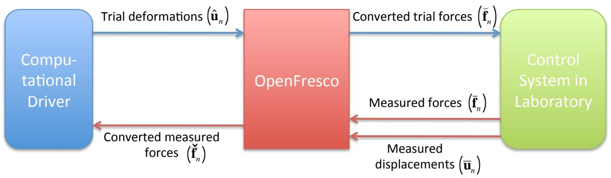  
图 3.4：使用 OpenFresco 实现兼容性方法。

在图 3.4 中，OpenFresco 将变形转换为力。OpenFresco ExperimentalSignalFilter（ESF）类被扩展以处理此转换。ESF 类可以修改从 Experimental Control 类接收的信号。ExperimentalControl 和 ESF 类之间的关系如图 A.2 所示。ExperimentalControl 类可以有零到多个实验信号过滤器。

图 3.5 显示了为在 OpenFresco 上实现兼容性方法而修改的 $E S F$ 接口。添加了公共转换方法。运算符重载用于转换。converting (Vector∗ td) 具有参数 td，即试验位移向量 $( \breve { \mathbf { u } } _ { n } )$。它返回转换后的试验力向量 $( { \breve { f } } _ { n } )$ 的地址。converting (Vector∗ dd, Vector $^ *$ df) 具有参数 $( \bar {  { \mathbf { u } } } _ { n } )$ 和 $( { \overline { { \mathbf { f } } } } _ { n } )$。它使用这些参数为下一次调用 converting (Vector $^ *$ td) 进行必要的更新。Experimental Control 方法 setTrialResponse 调用 converting (Vector∗ td) 方法将试验位移向量转换为试验力向量。Experimental Control 方法 getDaqResponse 调用 converting (Vector $^ *$ td, Vector $^ *$ df) 方法将测量位移向量转换为转换后的力向量。

实现了两个新的具体类和一个抽象类来扩展 ESF 类在 FC 混合仿真中的能力。两者都继承自 ESF 抽象类，如图 3.6 所示。ESFTangForceConverter 类使用切线刚度矩阵将位移转换为力。图 A.4 显示了 ESFTangForceConverter 类定义。ESFTangForceConverter 构造函数以 int tag（唯一标签）、Matrix& initStif（对初始切线刚度矩阵的引用）和 ExperimentalTangentStiff $^ *$ tangStif（指向 ExperimentalTangentStiff 的指针）作为参数。int tag 和 Matrix& initStif 由用户提供。它使用 ExperimentalTangentStiff 类来估计试件的切线刚度矩阵。ESFTangForceConverter 对象必须有一个 ExperimentalTangentStiff 对象。ESFTangForceConverter 的 converting (Vector∗ td , Vector $^ *$ df) 方法在将 $\bar {  { \mathbf { u } } } _ { n }$ 转换为 ${ \bar { \pmb f } } _ { n }$ 之前调用 updateTangentStiff 方法，使用测量的位移-力对更新切线刚度矩阵。ESFTangForceConverter 类使用方程 3.11 将变形转换为力。

```cpp
class ExperimentalSignalFilter : public TaggedObject
{
public:
    // 构造函数
    ExperimentalSignalFilter(int tag);
    ExperimentalSignalFilter(const ExperimentalSignalFilter& esf);
    // 获取类类型的方法
    virtual const char *getClassType() const;
    // 析构函数
    virtual ~ExperimentalSignalFilter();
    virtual double filtering(double data) = 0;
    virtual Vector& converting (Vector* td) = 0;
    virtual Vector& converting (Vector* dd, Vector* df) = 0;
    virtual int size(const int sz) = 0;
    virtual void update() = 0;
    virtual Matrix& getTangStiffMat();
    virtual ExperimentalSignalFilter *getCopy() = 0;
    // 实验信号过滤器记录器的公共方法
    virtual Response *setResponse(const char **argv, int argc, OPS_Stream &output);
    virtual int getResponse(int responseID, Information &info);
};
```
图 3.5：OpenFresco ExperimentalSignalFilter 抽象类的接口。

第 3.2.1.1 节中估计切线刚度矩阵的方法被实现为 ExperimentalTangentStiff 类的具体类。ETBroyden、ETBfgs、ETTranspose 和 ETIntrinisic 类分别在 OpenFresco 中部署了 Broyden、BFGS、Transpose 和 Intrinsic 方法。使 ExperimentalTangentStiff 成为一个单独的类而不是 ESFTangForceConverter 的子类，使 ExperimentalTangentStiff 更加通用。这种解耦架构允许 ExperimentalElement 类使用切线刚度估计来估计实验单元的切线刚度矩阵。在 OpenFresco 的原始版本中，ExperimentalElement 类总是返回初始刚度矩阵（由用户提供），即使调用获取切线刚度矩阵的方法也是如此。使用切线刚度矩阵而不是初始刚度矩阵可以获得更好的结果。事实上，开发 Intrinsic 和 Transpose 方法的目的就是为了提供试件切线刚度矩阵的估计，以改善 DC 混合仿真期间的结果。

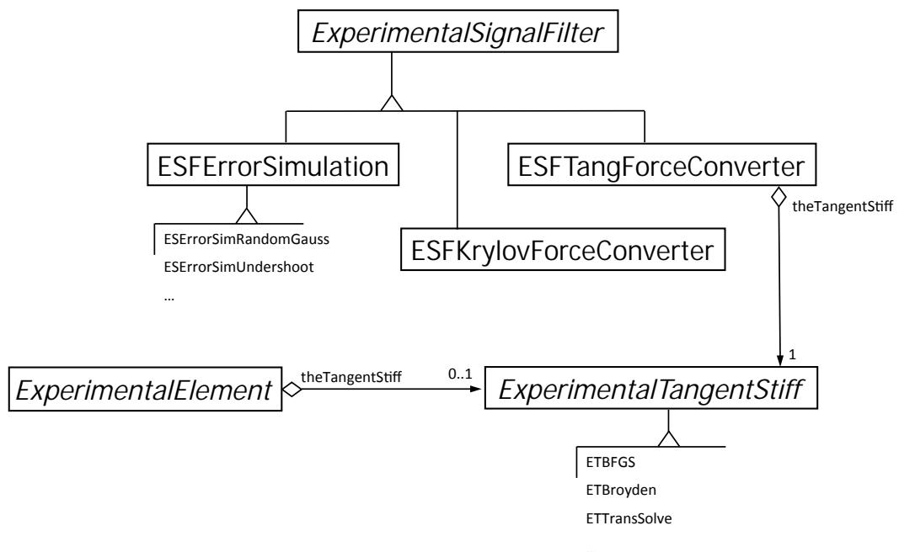  
图 3.6：包含 ESFTangForceConverter、ESFKrylovForceConverter 和 ExperimentalTangentStiff 类的 OpenFresco UML 类图。

图 3.6 显示了 ExperimentalElement、ESFTangForceConverter 和 ExperimentalTangentStiff 之间的关系。ExperimentalElement 可以有 0 到 1 个 ExperimentalTangentStiff，而 ESFTangForceConverter 必须有一个 ExperimentalTangentStiff。用于实现 ExperimentalTangentStiff 类的软件设计模式称为策略模式 [8]。该模式定义了一系列估计切线刚度矩阵的算法，封装了每种算法（Broyden、BFGS、Transpose 和 Intrinsic），并使它们可互换。这些算法可以独立于调用它们的客户端而变化。在图 3.6 中，ExperimentalElement 和 ESFTangForceConverter 类可以通过 ExperimentalTangentStiff 接口调用不同的切线刚度矩阵估计算法。ExperimentalTangentStiff 不依赖于调用它的对象。

图 3.6 中的另一个类是 ESFKrylovForceConverter 具体类。图 A.5 显示了 ESFKrylovForceConverter 类定义。该类部署了第 3.2.1.2 节中介绍的基于 Krylov 子空间的兼容性方法。构造函数以 tag（唯一标签）、ss（子空间数量）和 initStif（初始刚度矩阵）作为参数。这些参数由用户提供。converting 方法的重载与 ESFTangForceConverter 类非常相似。converting (Vector∗ td) 使用测量增量力向量的 Krylov 子空间来计算下一个增量试验力向量。当用户定义的 ss 大于或等于试验位移向量的大小时，使用最小二乘法求解方程 3.25。当 ss 小于力向量的大小时，使用拉格朗日乘子法 [13] 求解方程 3.25。converting (Vector $^ *$ dd, Vector $^ *$ df) 方法使用测量的增量对更新子空间，以供下次使用。

```cpp
class ExperimentalTangentStiff : public TaggedObject
{
public:
    // 构造函数
    ExperimentalTangentStiff(int tag);
    ExperimentalTangentStiff(const
        ExperimentalTangentStiff& ets);
    // 获取类类型的方法
    virtual const char *getClassType() const;
    // 析构函数
    virtual ~ExperimentalTangentStiff();
    virtual Matrix& updateTangentStiff(const Vector* disp,
                    const Vector* vel,
                    const Vector* accel,
                    const Vector* force,
                    const Vector* time,
                    const Matrix* kInit,
                    const Matrix* kPrev) = 0;
    virtual ExperimentalTangentStiff *getCopy() = 0;
    // 实验信号过滤器记录器的公共方法
    virtual Response *setResponse(const char **argv, int argc,
                          OPS_Stream &output);
    virtual int getResponse(int responseID, Information &info);
};
```
图 3.7：OpenFresco ExperimentalTangentStiff 抽象类的接口。

ESFTangForceConverter 和 ESFKrylovForceConverter 具有防止噪声引起虚假更新的过滤器。增量测量位移和力向量在 ESFTangConverter 的 updateIncreMat 方法中被过滤，防止对切线刚度矩阵进行不必要的更新。在 ESFKrylovForceConverter 中，增量测量位移和力向量的过滤确保来自控制系统的噪声不会填充 Krylov 子空间。这些过滤器采用测量对向量的 1-范数或 2-范数。如果这些范数都大于用户定义的限值，则进行更新。

### 3.3.2 平衡方法的实现

本节介绍第 3.2.2 节中提出的平衡方法的实现。平衡方法需要一个具有基于力的时间积分方案的计算驱动程序。没有多少商业 FEA 软件包使用基于力的时间积分方案。因此，使用 Matlab 编程了一个基本的 FEA 软件包。该软件包的用途是证明平衡方法的有效性。

该软件包由三个主要的 Matlab 函数组成。第一个函数是 createModel() 函数。混合模型被硬编码到这个函数中。以下模型属性在此函数中定义：质量矩阵（M）、粘性阻尼矩阵（C）、刚度矩阵 $\mathbf { \eta } ( \mathbf { K } )$、协调矩阵（A）、平衡矩阵（B、$\mathbf { B } _ { i }$ 和 $\mathbf { B } _ { f }$）以及材料类型。只有 1-D 桁架单元可用。然而，有多个 1-D 材料类型。如果几何效应被纳入材料属性，这些材料类型也可以兼作单元。所有材料既是基于位移的材料也是基于力的材料。这些材料在给定试验变形时返回一个力值，在给定试验力时返回一个变形值。这使得该软件包可以使用平衡方法执行开关控制混合仿真。这将在第 4 章讨论。以下材料可用：

• 弹性材料 - 这是一种简单的线弹性材料。其输入是弹性模量 $( E )$。
• 双线性弹性材料 - 这种材料表现出双线性行为。它在达到预定义的屈服点之前是线弹性的。然后线性刚度发生变化。它有三个输入：$E$ - 弹性模量、$f _ { y }$ - 屈服力和 $b$ - 屈服后模量比，其中屈服后模量 $E _ { \mathrm { y } } = b * E$。
• 双线性弹性 RDM 材料 - 此单元与双线性弹性材料相同，但它会向返回值添加噪声。这是为了模拟控制系统中的噪声。它具有与双线性弹性材料相同的输入参数。
• 双线性滞回材料 - 此单元类似于双线性弹性单元，但表现出滞回行为。它具有与双线性弹性材料相同的输入参数。
• 实验材料/单元 - 此单元与 OpenFresco 接口。它有三个输入：$E$ - 初始刚度、ipAddr - 运行 OpenFresco 仿真应用服务器的机器 IP 地址和 ipPort - 运行 OpenFresco 仿真应用服务器的 IP 端口号。它使用 TCP 套接字与 OpenFresco 服务器通信。

第二个函数是 initializeAnalysis(deltaT) 函数。此函数的输入参数是 deltaT，即用户定义的积分时间步长。FC 方法在此函数中定义。它有各种可用的基于力的时间积分方案，这些方案使用平衡方法。以下是 FC 混合仿真可用的时间积分方案：

• FM NLDynamicNR - 此时间积分方案实现了第 3.2.2 节中的平衡方法，使用牛顿法，具有预定义的残差容差和最大迭代次数。如果在达到最大迭代次数后残差不在容差范围内，算法将停止仿真。
• FM NLDynamicNRLimit - 这与 FM NLDynamicNR 类似。唯一的区别是它使用增量限制（一个预定义变量）来缩放试验力。缩放试验力的目的是用牛顿法生成平滑的试验力曲线。如果没有缩放，牛顿法倾向于产生振荡的试验力曲线，因为牛顿法是二次收敛的。在大多数纯数值仿真中，二次收敛特性是可取的，但在混合仿真中则不然。
• FM NLDynamicNRwFixIter - 这与 FM NLDynamicNR 类似。不同之处在于它只进行固定次数的迭代。在每次迭代中，它根据以下缩放因子缩放试验力

$$
s f = \frac {1}{\text {m a x I t e r} - \text {i t e r} + 1} \tag {3.52}
$$

其中 maxiter 是最大迭代次数，iter 是当前迭代次数。该时间积分方案不检查残差是否在容差范围内。

• FM NMDynamicExplicit - 这是 $\beta = 0$ 的 Newmark 显式时间积分算法。它被编程到该软件包中，用于测试上一节中介绍的兼容性方法的单转换实现。
• FM aOSDynamicPC - 这是 αOS 预测-校正算法。它被编程到该软件包中，用于测试上一节中介绍的兼容性方法的单转换实现。

包括容差、最大迭代次数和增量限制在内的时间积分参数以及收敛标准也在此函数中设置。

最后一个函数是 main 函数。这是进入软件包的门户函数。它通过调用 createModel() 函数创建模型，并通过调用 initializeAnalysis(deltaT) 函数初始化仿真。记录的地面加速度也在 main 函数中加载。它使用 initializeAnalysis(deltaT) 函数中定义的时间积分方法启动仿真。它记录仿真的所有数据。仿真完成后，它使用记录的数据绘制图形。这些图形包括时间历程图、单元滞回图、试验力图等。

### 3.3.3 Simulink/Stateflow 模型

需要一个 FC 预测-校正 Simulink 模型来桥接积分器回路和伺服控制回路之间的时钟速度。FC 预测-校正 Simulink 模型与第 2.3 节中描述的 DC Simulink 模型类似。主要区别在于它校正和预测的是力而不是位移。如图 3.8 所示，来自 xPC 混合控制器（F1F1）的信号作为指令力写入 SCRAMNet 内存。xPC Target 混合控制器（F1F1）实现了许多与其位移对应物相同的功能。Schellenberg 的论文 [20] 提供了关于用于 DC 的 xPC Target 混合控制器的更详细信息。在图 3.9 中需要注意两个重要区别。首先，xPC Target 混合控制器从 OpenFresco 接收目标力（targFrc）而不是目标位移。其次，反馈位移（dspIn）和力（frcIn）在信号偏移框中被偏移，并在移动平均滤波器框中被平均，然后才被中继回 OpenFresco。这样做是为了补偿载荷传感器和位置传感器中的噪声。偏移量或要平均的测量次数由用户决定。

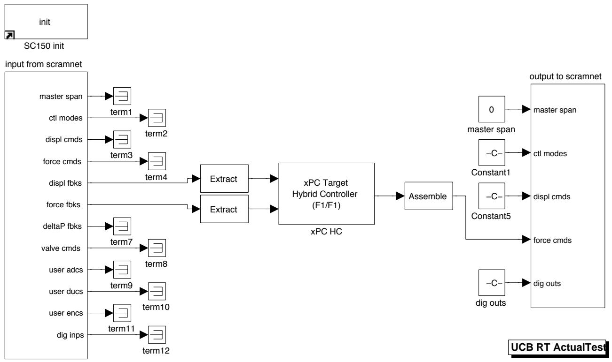  
图 3.8：在 nees@berkeley 实验室使用带有 SCRAMNet 的 xPC Target 实时工作台的 FC 混合仿真 SimuLink 模型。

图 3.10 中的 StateFlow 模型也类似于其位移对应物，只是现在它预测和校正的是力而不是位移。

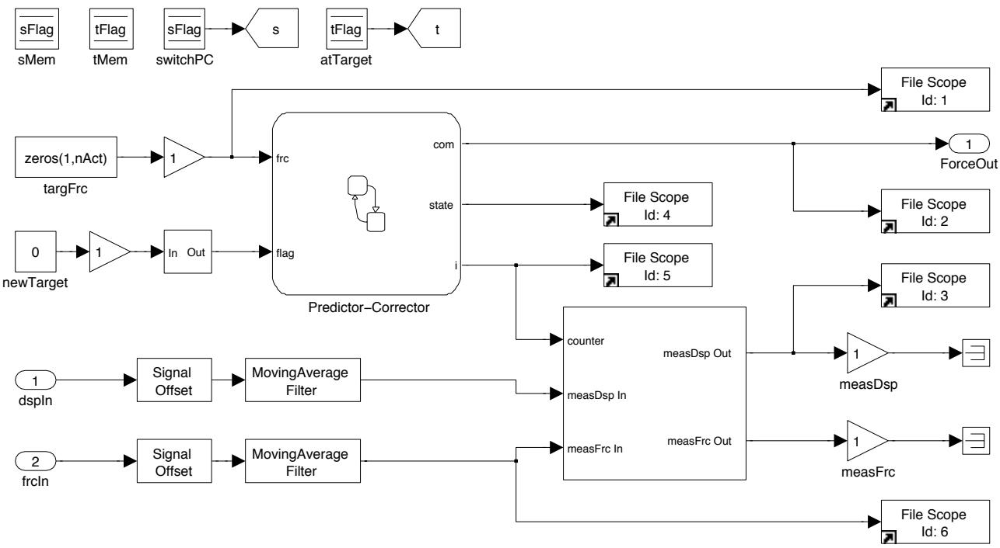  
图 3.9：这表示为图 3.8 中的 xPC Target 混合控制器（F1F1）框。它包含 Stateflow 模型并与 OpenFresco 接口。

为此部署了以下 C 函数：

• zerFrc(&com) - 此函数将力数组置零。
• setCurFrc(&com,i/N) - 此函数将当前力数组存储为预测和校正新力的起点。
• setNewFrc(&frcLocal) - 此函数更新之前的力数组。该算法存储六个先前用于预测-校正模型的目标位移和力。
• correctD1Frc(&com,i/N) - 此函数使用线性插值校正到新的目标力。
• predictD1Frc(&com,i/N) - 此函数在预测-校正器等待 OpenFresco 的新目标力时预测下一个目标力。它使用线性外推。

Stateflow 模型调用这些 C 函数来运行预测-校正算法。Stateflow 模型接收从 OpenFresco 实验控制对象接收到的新目标力。然后它进入 Correct 状态，在那里使用一阶（线性）插值为控制系统生成校正到新目标力的指令力。如果 Stateflow 模型完成了对目标力的校正，并且尚未从实验控制对象接收到下一个目标力，则它进入 Predict 状态，开始使用一阶外推预测指令力。当 Stateflow 模型在仿真时间步的 $60 \%$ 过去之前没有收到下一个目标力时，它进入 AutoSlowDown 状态。在 AutoSlowDown 状态下，指令力的预测速度逐渐减缓，直到最终保持一个指令力，直到下一个目标力到来。

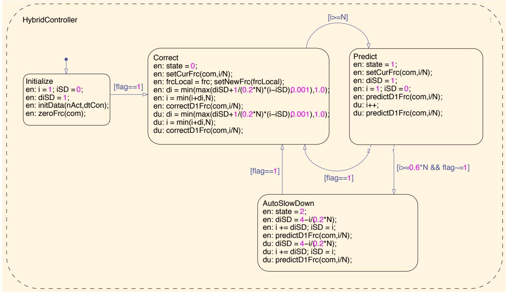  
图 3.10：StateFlow 预测-校正模型由图 3.9 中的 Predictor-Corrector 框表示。它预测和校正力。它具有自动减速模式，以防止模型过度预测。

所有 FC 混合仿真测试的仿真时间步长设置为 0.10 秒。这意味着 Simulink 模型每个积分时间步运行 0.10 秒。控制系统以 $1 0 2 4 ~ \mathrm { H z }$ 运行。因此，在一个仿真时间步内有 102 个周期。102 是图 3.10 中的变量 N。102 个周期给出 0.0996 秒。因此，仿真时间步长更准确地说是 0.0996 秒。与积分时间步长相比，这相当慢。正如本章后面讨论的，大多数用于 FC 混合仿真的时间积分方案有 20 个子步，导致积分时间步长为 0.001 秒。仿真时间步长比积分时间步长大 100 倍。因此，它被认为是一个慢速测试。

### 3.3.4 OpenFresco 力实验控制

Simulink 和 Stateflow 模型所需的目标力由 OpenFresco 实验控制类生成。此类通过 xPC 混合控制器（F1F1）模型（图 3.9）与控制系统接口。为此目的编程了 ECxPCtargetForce 实验控制类。类定义如图 A.6 所示。目标力在 control 私有方法中发送给 Simulink 模型。acquire 私有方法在达到目标力时从 MTS-STS 控制系统读取测量的位移和力对。ECxPCtargetForce 可以有一个或多个 ExperimentalSignalFilter，如图 A.3 中的类图所示。兼容性和平衡方法都使用此实验控制与控制系统通信。如果部署 CFC 方法，它使用 TangentForceConverter 将位移转换为力。如果使用 EFC 方法，它只是将力传递给控制系统。

## 3.4 实验结果与验证

本节包含本章介绍的 FC 混合仿真方法的实验结果。使用 nees@berkeley 实验室的 $\mu$-NEES 实验装置。$\mu$-NEES 装置以两种方式配置，1-DOF 和 2-DOF 配置。对于每种配置，进行两种类型的混合仿真。第一种是线性混合仿真，其中输入地震动被缩放以保持试件在线性范围内。第二种是非线性混合仿真，其中地震动被缩放以使试件屈服进入非线性区域。两种混合仿真都部署了不同的时间积分方案。

分析结果以确定 FC 方法的性能。将 FC 实验结果与 DC 实验结果进行比较。比较控制系统指令和反馈信号之间的误差。检查发送到控制系统的试验值是否存在过度振荡。将 FEA 程序记录的位移和力仿真结果与数值结果进行比较。

### 3.4.1 1-DOF $\mu$ -NEES 实验装置与结果

1-DOF $\mu$-NEES 实验装置如图 3.11 和 3.12 所示。作动器定位在装置中最低可能的位置，以创建一个刚性的设置，这是 FC 混合仿真的理想设置。刚性系统难以设置。通常，这些系统在相对较小的位移下会经历较高的力。这意味着系统中的任何滑移都可能对结果产生不利影响。滑移发生在连接处。对于此设置，滑移发生在 U 形夹销、连接作动器与试件的作动器销以及作动器与反力架的连接处。这些连接处用薄金属垫片紧固以限制过度滑移。

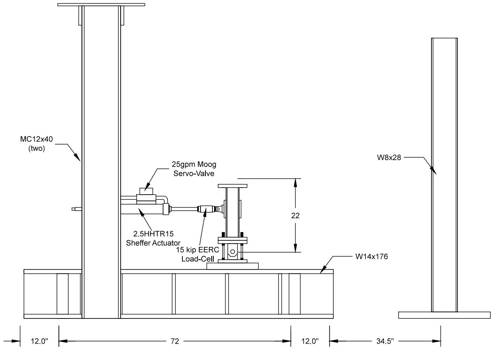  
图 3.11：nees@berkeley 实验室的 1-DOF $\mu$-NEES 实验装置示意图。此装置用于 1-DOF DC、FC 和 SC 混合仿真。

试片以某种方式放置在 U 形夹中（图 3.13），以防止不必要的横向运动。在图 3.13 中，右侧的试片在底部和顶部用螺母拧紧。对于左侧的试片，只有底部被拧紧，而顶部是松的。如图 3.13 所示，螺母放置在左侧试片的顶部，留下一个间隙。这是为了防止当作动器处于 FC 模式时对作动器和装置造成损坏。如果作动器接收到 10 kips 的指令力，而试片在作动器试图向试件施加 10 kips 时断裂，作动器可能会无限期地继续移动，试图达到 10 kips。使用这种试片配置，一旦右侧的试片在混合仿真过程中断裂，左侧的试片将抓住试件。这两个试片在 U 形夹的另一侧镜像分布。

此装置在 FC 模式下作动器的比例增益约为装置在 DC 模式下比例增益的 10 倍。装置的调谐结果在附录 B 中提供。

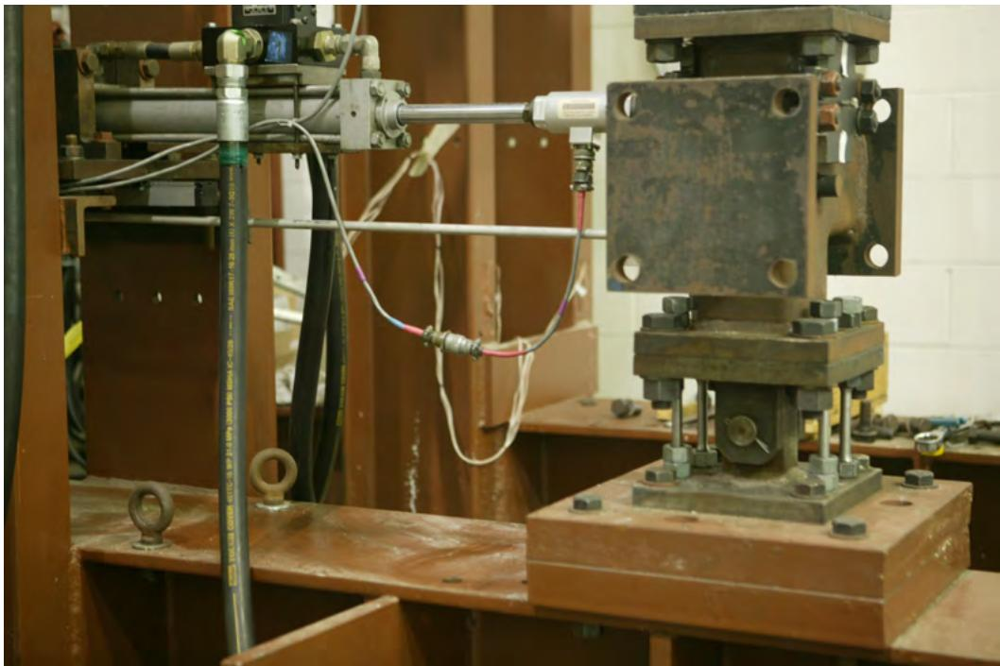

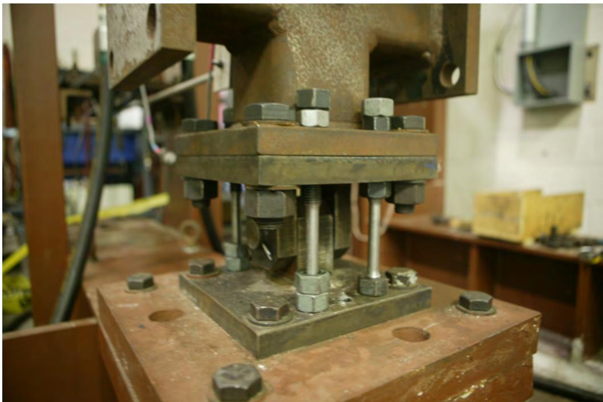  
图 3.12：nees@berkeley 实验室的 1-DOF $\mu$-NEES 实验装置。   
图 3.13：1-DOF $\mu$-NEES 实验装置 U 形夹和试片配置。总共使用了 4 个钢试片，每侧两个。

在 FC 模式下，比例增益取决于系统的刚度。较高的刚度通常会将比例增益降低以使控制系统保持稳定。如果实验过程中装置的刚度发生变化，例如试件屈服，控制系统在 FC 模式下可能会变得不稳定。然而，如果比例增益太低，它会降低跟踪性能。跟踪是指指令力和测量力的匹配程度。因此，在 FC 模式下调谐作动器是困难的。比例增益必须足够低以保持控制系统在 FC 模式下稳定，但又不能太低以至于跟踪不可靠。摩擦和粘滑也可能在 FC 模式下引起问题，但这个作动器不受它们的影响。

FC 混合仿真结果与解析结果以及每种时间积分方案的 DC 混合仿真结果进行比较。表 3.2 包含了所使用的四种时间积分方案及其参数。第 2.2 节中的 Newmark 显式（NME）和 αOS 方法通常用于 DC 混合仿真。使用固定迭代次数的 Newmark 时间积分方法（NMF）和使用减缩增量的 Newmark 方法（NMR）不太常用 [20]。

表 3.2：时间积分方案及其参数。   

| 时间积分方案 | 参数 |
|---|---|
| Newmark 显式 (NME) | γ = 1/2, 子步 = 20 |
| α 算子分裂 (αOS) | α = 1.0, 子步 = 20 |
| Newmark 固定迭代 (NMF) | γ = 1/2, β = 1/4, iterfix = 20 |
| Newmark 减缩增量 (NMR) | γ = 1/2, β = 1/4, itermax = 20, tolenergy = 1 × 10-6 |

#### 3.4.1.1 混合模型与 OpenFresco 配置

图 2.1 显示了与 1-DOF $\mu { \cdot }$ -NEES 实验装置结合使用的混合模型。表 3.3 显示了混合模型的属性。线性模型比非线性模型更硬。在线性混合仿真期间，U 形夹（3.13）中接合了四个试片，而在非线性混合仿真中接合了两个试片。当所有四个试片都接合时，即使力水平达到作动器 12 kips 的容量，试片也不会屈服。因此，只有两个试片用于非线性仿真以使试片屈服。四试片配置仅用于 1-DOF 线性混合仿真设置。力控制、开关控制和混合控制混合仿真的其余实验使用两试片配置。

表 3.3：1-DOF $\mu$-NEES 装置的单跨框架模型属性。   

| 属性 | 线性混合模型 | 非线性混合模型 |
|---|---|---|
| 弹性刚度 (kip/in.): [单元1 单元2 单元3] | [45 2 5] | [32 2 5] |
| 初始切线刚度矩阵 (kip/in.) | [47 -2 -2 7] | [34 -2 -2 7] |
| 质量 (kip/g): [质量1 质量2] | [0.10 0.05] | [0.10 0.05] |
| 周期 (sec): [T1 T1] | [0.54 0.20] | [0.54 0.34] |
| 质量比例阻尼，ξ = 5%: [αM = 2ξω1] | [1.17] | [1.17] |

混合模型中的单元 1 是与 OpenFresco 通信的 TwoNodeLink 实验单元。FEA 软件是 OpenSees。对于 DC 混合仿真，部署了表 2.1 中的 OpenFresco 配置。相同的 OpenFresco 配置用于 FC 混合仿真，只有一个例外。唯一的区别是使用了第 3.3.4 节中的 xPC-Target Force 实验控制，而不是 xPC-Target 实验控制。

#### 3.4.1.2 线性 FC 混合仿真

对混合模型进行 OpenSees 分析以评估实验结果的准确性。该数值分析使用表 3.3 中显示的线性混合模型的属性。它使用一个线性数值单元作为单元 1 来模拟 1-DOF $\mu$-NEES 装置的行为。对表 3.2 中的每种时间积分方案分别进行 OpenSees 分析，并与使用 Newmark 隐式（NMI）方案（具有与 NMR 方案相同的参数但没有增量限制）的结果进行比较。分析使用缩放到 $15 \%$ 的埃尔森特罗地震动的前 400 个记录点（图 3.1）。

图 3.14 和 3.15 显示了模型分析中单元 1 的位移-时间历程和力-时间历程。表 3.4 显示了绝对位移和力误差的最小值、平均值和最大值。这些误差使用 NMI 结果作为基线计算。从图 3.14 和 3.15 以及表 3.4 可以看出，除了 NME 之外，所有方案与 NMI 的偏差都不大。αOS、NMF 和 NMR 的位移和力误差相当，而 NME 误差大约大一个数量级。

表 3.4：使用单跨框架 OpenSees 模型的线性数值模拟的位移（图 3.14）和力（图 3.15）结果的绝对误差。   

| 控制方法 | NME | αOS | NMF | NMR |
|---|---|---|---|---|
| |ErrD|Min (in.) | 1.95×10-6 | 9.10×10-7 | 0 | 1.00×10-8 |
| |ErrD|Mean (in.) | 0.0065 | 8.14×10-4 | 0 | 3.30×10-4 |
| |ErrD|Max (in.) | 0.0237 | 0.0049 | 0 | 0.00120 |
| |ErrF|Min (kip) | 8.77×10-5 | 4.08×10-5 | 0 | 0 |
| |ErrF|Mean (kip) | 0.291 | 0.0366 | 0 | 0.0149 |
| |ErrF|Max (kip) | 1.07 | 0.221 | 0 | 0.0539 |

表 3.5 和 3.6 显示了来自 DC 和 FC 混合仿真的实验结果的绝对误差。这些误差是根据 OpenSees 记录值计算的。时间历程图及其误差在附录 C 的 C.1 节中。对于每种时间积分方案，误差是在实验结果与其数值对应结果（来自图 3.14 和 3.15）之间计算的，但 NME 方法除外。NME 实验结果与 NME 数值结果进行比较，因为 NME 数值结果与其他数值结果不具有可比性。测试了两种类型的 FC 方法，CFC 和 EFC 方法。EFC 方法仅针对 NMR 方案进行了测试，因为只有 NMR 与 EFC 方法始终稳定。其他时间积分方案与 EFC 方法不稳定或不能给出可靠的结果。

表 3.5：1-DOF 设置在线性混合仿真中在 FEA 层面针对各种时间积分方案的位移结果绝对误差。   

| 控制方法 | NME (in.) | αOS (in.) | NMF (in.) | NMR (in.) |
|---|---|---|---|---|
| DC-最小值 | 1.61×10-5 | 0 | 6.43×10-6 | 7.43×10-6 |
| DC-平均值 | 0.00632 | 0.00761 | 0.00583 | 0.00613 |
| DC-最大值 | 0.0226 | 0.0299 | 0.0248 | 0.0217 |
| CFC-最小值 | 1.16×10-5 | 0 | 1.79×10-5 | 3.30×10-6 |
| CFC-平均值 | 0.00709 | 0.00893 | 0.00785 | 0.00823 |
| CFC-最大值 | 0.0227 | 0.0291 | 0.0292 | 0.0352 |
| EFC-最小值 | N/A | N/A | N/A | 1.64×10-5 |
| EFC-平均值 | N/A | N/A | N/A | 0.00599 |
| EFC-最大值 | N/A | N/A | N/A | 0.0201 |

表 3.6：1-DOF 设置在线性混合仿真中在 FEA 层面针对各种时间积分方案的力结果实验绝对误差。   

| 控制方法 | NME (kip) | αOS (kip) | NMF (kip) | NMR (kip) |
|---|---|---|---|---|
| DC-最小值 | 5.03×10-5 | 5.32×10-5 | 4.88×10-5 | 8.90×10-5 |
| DC-平均值 | 0.295 | 0.342 | 0.265 | 0.2934 |
| DC-最大值 | 1.21 | 1.30 | 1.08 | 1.02 |
| CFC-最小值 | 1.50×10-4 | 0.00227 | 0.00116 | 3.55×10-4 |
| CFC-平均值 | 0.340 | 0.406 | 0.361 | 0.358 |
| CFC-最大值 | 1.12 | 1.31 | 1.30 | 1.41 |
| EFC-最小值 | N/A | N/A | N/A | 3.14×10-4 |
| EFC-平均值 | N/A | N/A | N/A | 0.256 |
| EFC-最大值 | N/A | N/A | N/A | 0.937 |

表 3.7 显示了控制系统层面的误差。DC 和 FC 模式下的控制系统误差彼此相似。预期力误差是位移误差的 45 倍。45 是试件线性刚度的值。在这方面，所有时间积分方案的力误差都略小于位移误差。推测如果试件更硬，力误差将明显小于位移误差。然而，很难构建一个像 $\mu$-NEES 装置那样达到如此高刚度的可重复测试设置。图 C.13 包含了使用 NMR 的 EFC 方法的指令力图。它显示了一条不均匀且锯齿状的指令力曲线，这在混合仿真中是不可取的。

表 3.7：1-DOF 设置在控制系统层面针对各种时间积分方案的线性混合仿真绝对误差。   

| 控制方法 | NME | αOS | NMF | NMR |
|---|---|---|---|---|
| DC-最小值 (in.) | 1.03×10-10 | 3.74×10-10 | 2.43×10-9 | 2.61×10-10 |
| DC-平均值 (in.) | 4.14×10-4 | 3.81×10-4 | 5.07×10-4 | 4.88×10-4 |
| DC-最大值 (in.) | 0.00254 | 0.00285 | 0.00303 | 0.00363 |
| CFC-最小值 (kip) | 1.49×10-8 | 5.96×10-8 | 1.12×10-8 | 0 |
| CFC-平均值 (kip) | 0.0164 | 0.0456 | 0.0180 | 0.0160 |
| CFC-最大值 (kip) | 0.128 | 0.129 | 0.216 | 0.106 |
| EFC-最小值 (kip) | N/A | N/A | N/A | 2.08×10-7 |
| EFC-平均值 (kip) | N/A | N/A | N/A | 0.0186 |
| EFC-最大值 (kip) | N/A | N/A | N/A | 0.0726 |

#### 3.4.1.3 非线性 FC 混合仿真

与线性混合仿真一样，对非线性混合模型进行 OpenSees 分析。非线性模型的属性如表 3.3 所示。为了数值模拟 1-DOF $\mu { \cdot }$ -NEES 装置，在 OpenSees 中构建了一个更复杂的模型（图 3.16），而不是对单元 1 使用简单的线性单元。OpenSees $\mu$-NEES 模型的所有单元都是弹性梁柱单元，除了红色的单元。红色单元模拟了试片，是带有圆形纤维截面的非线性力梁柱单元，使用 OpenSees 的 Steel02 材料。红色节点偏移以模拟试片损伤。该模型的最顶部节点连接到混合模型的节点 1。埃尔森特罗地震动缩放到 $40 \%$，以将试件推入非线性区域，但同时不超过作动器 12 kips 的负载能力。

图 3.17 和 3.18 显示了 NMF、NMR 和 NMI 的 OpenSees 数值结果。1-DOF $\mu$-NEES 装置的非线性 OpenSees 模型在使用 NME 和 αOS 时间积分方案时不收敛。表 3.8 显示 NMF 数值结果比 NMR 数值结果更好地匹配 NMI 结果。NMR 误差比 NMF 结果高两个数量级。

表 3.8：使用单跨框架 OpenSees 模型的非线性数值模拟的位移（图 3.17）和力（图 3.18）结果的绝对误差。   

| 控制方法 | NMF | NMR |
|---|---|---|
| |ErrD|Min (in.) | 0 | 1.40×10-6 |
| |ErrD|Mean (in.) | 5.88×10-5 | 0.00442 |
| |ErrD|Max (in.) | 2.65×10-4 | 0.0223 |
| |ErrF|Min (kip) | 0 | 4.38×10-4 |
| |ErrF|Mean (kip) | 0.00269 | 0.145 |
| |ErrF|Max (kip) | 0.0105 | 0.487 |

表 3.9 和 3.10 显示混合仿真结果总体上与数值结果吻合良好。仅呈现了 CFC 方法的 NMF 结果，因为即使多次尝试，NME、αOS 和 NMR 的 CFC 方法都会触发控制器 0.75 kips 的力误差联锁。混合仿真结果的图在附录 C 的 C.2 节中给出。误差是通过从每种时间积分方案的仿真结果中减去数值结果，然后取该误差的绝对值计算的。对于 DC 和 FC 混合仿真测试，误差平均值约为位移和力水平跨度的 $6 \%$ 到 $8 \%$。一种方法并不明显优于另一种方法，除非仅比较 NMF 结果。在这种情况下，CFC 结果远优于 DC 结果。值得注意的是，从力-时间历程图（图 C.14 和 C.17）可以看出，U 形夹中的第二个试片（图 3.13）被接合了。力-时间历程曲线显示试件先软化然后变硬。这种效应在 OpenSees $\mu$-NEES 1-DOF 模型中没有被模拟。

表 3.9：1-DOF 设置在非线性混合仿真中在 FEA 层面针对各种时间积分方法的位移结果绝对误差。   

| 控制方法 | NME (in.) | αOS (in.) | NMF (in.) | NMR (in.) |
|---|---|---|---|---|
| DC-最小值 | 2.84×10-5 | 7.30×10-7 | 1.64×10-5 | 1.68×10-5 |
| DC-平均值 | 0.0266 | 0.0288 | 0.114 | 0.0711 |
| DC-最大值 | 0.116 | 0.118 | 0.357 | 0.253 |
| CFC-最小值 | N/A | N/A | 1.14×10-5 | N/A |
| CFC-平均值 | N/A | N/A | 0.0409 | N/A |
| CFC-最大值 | N/A | N/A | 0.143 | N/A |
| EFC-最小值 | N/A | N/A | N/A | 1.28×10-4 |
| EFC-平均值 | N/A | N/A | N/A | 0.0922 |
| EFC-最大值 | N/A | N/A | N/A | 0.280 |

表 3.10：1-DOF 设置在非线性混合仿真中在 FEA 层面针对各种时间积分方法的力结果绝对误差。   

| 控制方法 | NME (kip) | αOS (kip) | NMF (kip) | NMR (kip) |
|---|---|---|---|---|
| DC-最小值 | 0.00150 | 9.60×10-4 | 5.20×10-4 | 0.00972 |
| DC-平均值 | 0.394 | 0.435 | 0.804 | 1.28 |
| DC-最大值 | 2.03 | 2.08 | 4.05 | 5.42 |
| CFC-最小值 | N/A | N/A | 6.65×10-4 | N/A |
| CFC-平均值 | N/A | N/A | 0.593 | N/A |
| CFC-最大值 | N/A | N/A | 2.34 | N/A |
| EFC-最小值 | N/A | N/A | N/A | 0.00700 |
| EFC-平均值 | N/A | N/A | N/A | 1.26 |
| EFC-最大值 | N/A | N/A | N/A | 5.77 |

表 3.11 显示了控制系统层面的误差。误差是根据指令值和测量值计算的。它显示了 MTS-STS 控制系统跟踪指令值的良好程度。控制器在两种控制模式下跟踪得同样好。力误差大约是位移误差的 34 倍（试件的初始刚度）。图 C.19 显示 EFC 方法为混合仿真产生了一条不期望的指令力曲线。

表 3.11：1-DOF 设置在控制系统层面针对各种时间积分方案的非线性混合仿真绝对误差。   

| Control method | NME | αOS | NMF | NMR |
|---|---|---|---|---|
| DC-最小值 (in.) | 1.38×10-9 | 7.86×10-9 | 7.94×10-9 | 3.14×10-9 |
| DC-平均值 (in.) | 8.53×10-4 | 8.20×10-4 | 0.00167 | 8.66×10-4 |
| DC-最大值 (in.) | 0.00513 | 0.00526 | 0.0129 | 0.0181 |
| CFC-最小值 (kip) | N/A | N/A | 0 | N/A |
| CFC-平均值 (kip) | N/A | N/A | 0.0328 | N/A |
| CFC-最大值 (kip) | N/A | N/A | 0.285 | N/A |
| EFC-最小值 (kip) | N/A | N/A | N/A | 0 |
| EFC-平均值 (kip) | N/A | N/A | N/A | 0.0282 |
| EFC-最大值 (kip) | N/A | N/A | N/A | 0.640 |

图 3.19 显示了使用 NMF 和 CFC 方法进行非线性混合仿真期间切线刚度计算的变化。显示的切线刚度值是在每个时间步计算的，而不是在时间步之间的每次迭代中。对于图 3.19 中的结果，位移和力都使用了 0.005 的滤波器。这意味着，如果当前时间步与上一个时间步的测量位移和力值之差小于 0.005，则不更新切线刚度值。滤波器的目的是防止对切线刚度值进行虚假更新。图 3.19 显示切线更新相当稳定，除了在 2000 次迭代标记附近，当试件首次进入非线性区域时。

图 3.19：使用 NMF 和 CFC 方法进行非线性混合仿真期间，1-DOF 装置切线刚度估计值与迭代次数的关系图。

### 3.4.2 2-DOF $\mu$ -NEES 实验装置与结果

2-DOF $\mu$-NEES 实验装置配置用于测试 CFC 方法。在 1-DOF 设置中，所有 CFC 切线方法都退化为使用割线。图 3.20 详细说明了 2-DOF $\mu$-NEES 实验装置示意图。图 3.21 显示了 2-DOF 装置的照片。图 3.11 中的 1-DOF 装置通过堆叠另一个 U 形夹和一个 $\mathrm { { { S 4 x 7 . 7 } } }$ 钢构件进行了修改。第二个作动器被添加到反力架上，并连接到 $\mathord { \ s } 4 \mathrm { x } 7 . 7$ 构件上。两个钢试片放置在顶部 U 形夹中，如图 3.22 所示。底部试片配置与 1-DOF 装置保持相同。

图 3.20：nees@berkeley 实验室的 2-DOF $\mu$-NEES 实验装置示意图。此装置用于 2-DOF DC、FC 和 MC 混合仿真。

图 3.21：nees@berkeley 实验室的 2-DOF $\mu$-NEES 实验装置（左）和 2-DOF 混合模型（右）。   
图 3.22：2-DOF $\mu$-NEES 实验装置 U 形夹和试片配置。总共使用了 2 个钢试片，销的每侧各一个。

#### 3.4.2.1 混合模型与 OpenFresco 配置

图 3.21（右）中的 2-DOF 混合模型被部署用于测试 FC 方法。集中质量放置在顶部和底部节点上。只有质量和阻尼被数值建模。使用质量比例阻尼。模型属性在表 3.12 中提供。在垂直和旋转自由度被凝聚后，只留下两个水平自由度。底部支撑是固定的。选择集中质量值，使得周期与 1-DOF 混合模型相似。使用表 3.2 中相同的时间积分方案和参数。

表 3.12：2-DOF $\mu \cdot$ -NEES 装置的 2-DOF 混合模型属性。   

| 属性 | 2-DOF 混合模型 |
|---|---|
| 初始切线刚度矩阵 (kip/in.) | [81 -12 -12 3.4] |
| 质量 (kip/g): [质量1 质量2] | [0.10 0.01] |
| 周期 (sec): [T1 T1] | [0.55 0.20] |
| 质量比例阻尼，ξ = 5%: [αM = 2ξω1] | [1.17] |

表 3.13 包含了 2-DOF 设置的 OpenFresco 配置。通用实验单元允许用户为每个节点定义任意节点和自由度。为 2-DOF 设置定义了两个节点，每个对应图 3.21（右）中显示的一个节点，每个节点在水平方向上有 1 个自由度。初始刚度矩阵根据表 3.12 定义。由于 2-DOF 混合模型和 2-DOF ‘$\cdot \mu$-NEES 设置之间不需要转换，因此部署了无转换实验装置。所有混合仿真都是本地仿真，意味着 OpenSees 和 OpenFresco 之间没有网络通信。

表 3.13：2-DOF 设置的 OpenFresco 配置。   

| OpenFresco 组件 | 配置 |
|---|---|
| 实验单元 | 通用实验单元 |
| 实验站点 | 本地实验站点 |
| 实验装置 | 无转换实验装置 |
| 实验控制 | xPC-Target 力实验控制 |

使用 2-DOF OpenSees 模型（图 3.23）进行数值分析。将线性结果和非线性结果与 FC 混合仿真实验结果进行比较。它使用与图 3.16 中 1-DOF OpenSees 模型类似的单元。红色单元与 1-DOF Opensees 模型中使用的非线性梁柱单元相同，模拟钢试片。模型的其余部分由弹性梁柱单元组成。红色节点偏移以模拟试片损伤。集中质量放置在最顶部节点以及两个 U 形夹之间的节点处，距离底部 16 个单位。

图 3.23：用于 2-DOF $\mu$-NEES 实验装置数值模拟的 2-DOF OpenSees 数值模型。

#### 3.4.2.2 线性 FC 混合仿真

图 3.24 和 3.25 显示了 2-DOF OpenSees 模型数值模拟的位移和力-时间历程。表 3.14 包含了这些图中的绝对误差。埃尔森特罗地震动缩放到 $10 \%$，以使试件保持在线性范围内。与单跨框架线性分析一样，NMF 结果与 NMI 结果完全匹配。这是因为 NMI 能够在 20 次迭代之前收敛到容差。αOS 结果略好于 NME 和 NMR 结果。

表 3.14：使用 2-DOF OpenSees 模型的线性数值模拟的位移（图 3.24）和力（图 3.25）结果相对于 NMI 的绝对误差。   

| 控制方法 | NME | αOS | NMF | NMR |
|---|---|---|---|---|
| |ErrD1|Min (in.) | 2.05×10-6 | 0 | 0 | 1.19×10-5 |
| |ErrD1|Mean (in.) | 0.00837 | 1.17×10-5 | 0 | 0.00798 |
| |ErrD1|Max (in.) | 0.0382 | 1.33×10-4 | 0 | 0.0228 |
| |ErrF1|Min (kip) | 1.13×10-4 | 2.608×10-5 | 0 | 6.53×10-4 |
| |ErrF1|Mean (kip) | 0.524 | 0.0524 | 0 | 0.506 |
| |ErrF1|Max (kip) | 2.15 | 0.203 | 0 | 1.53 |
| |ErrD2|Min (in.) | 3.36×10-6 | 0 | 0 | 1.35×10-5 |
| |ErrD2|Mean (in.) | 0.0235 | 5.01×10-5 | 0 | 0.0405 |
| |ErrD2|Max (in.) | 0.103 | 6.29×10-4 | 0 | 0.00120 |
| |ErrF2|Min (kip) | 1.90×10-5 | 1.68×10-5 | 0 | 9.68×10-5 |
| |ErrF2|Mean (kip) | 0.144 | 0.0136 | 0 | 0.0650 |
| |ErrF2|Max (kip) | 0.593 | 0.0487 | 0 | 0.233 |

表 3.15 和 3.16 包含了节点 1 和 2 分别与其数值对应结果计算得出的绝对位移误差。表 3.17 和 3.18 显示了节点 1 和 2 的绝对力误差。混合仿真结果的图在附录 C 的 C.3 节中给出。所有四个表都包含在 FEA 层面计算的误差，意味着误差来自 OpenSees 记录的值。对于节点 1 和 2，最佳结果是 CFC NMR 结果。这是唯一与数值结果相当的结果。对于这些线性测试，FC 方法在所有时间积分方案中要么略优于其 DC 对应方法，要么与 DC 方法相当。

表 3.15：2-DOF 设置在线性混合仿真中在 FEA 层面针对各种时间积分方法的节点 1 绝对位移误差。   

| 控制方法 | NME (in.) | αOS (in.) | NMF (in.) | NMR (in.) |
|---|---|---|---|---|
| DC-最小值 | 5.95×10-8 | 5.95×10-8 | 6.06×10-6 | 1.06×10-6 |
| DC-平均值 | 0.0186 | 0.0184 | 0.0224 | 0.00989 |
| DC-最大值 | 0.0578 | 0.0569 | 0.0703 | 0.0281 |
| CFC-最小值 | 5.95×10-8 | 5.95×10-8 | 4.29×10-6 | 1.40×10-7 |
| CFC-平均值 | 0.0187 | 0.0189 | 0.00904 | 0.00586 |
| CFC-最大值 | 0.0601 | 0.0591 | 0.0356 | 0.0162 |
| EFC-最小值 | N/A | N/A | N/A | 3.25×10-5 |
| EFC-平均值 | N/A | N/A | N/A | 0.109 |
| EFC-最大值 | N/A | N/A | N/A | 0.380 |

表 3.16：2-DOF 设置在线性混合仿真中在 FEA 层面针对各种时间积分方法的节点 2 绝对位移误差。   

| 控制方法 | NME (in.) | αOS (in.) | NMF (in.) | NMR (in.) |
|---|---|---|---|---|
| DC-最小值 | 1.84×10-8 | 5.95×10-8 | 1.33×10-5 | 8.702×10-7 |
| DC-平均值 | 0.0835 | 0.0834 | 0.0571 | 0.0483 |
| DC-最大值 | 0.276 | 0.275 | 0.191 | 0.1435 |
| CFC-最小值 | 5.95×10-08 | 5.95×10-8 | 1.33×10-5 | 2.34×10-7 |
| CFC-平均值 | 0.0850 | 0.0861 | 0.0390 | 0.0307 |
| CFC-最大值 | 0.275 | 0.277 | 0.120 | 0.0867 |
| EFC-最小值 | N/A | N/A | N/A | 1.31×10-5] |
| EFC-平均值 | N/A | N/A | N/A | 0.482 |
| EFC-最大值 | N/A | N/A | N/A | 1.79 |

表 3.17：2-DOF 设置在线性混合仿真中在 FEA 层面针对各种时间积分方法的节点 1 绝对力误差。   

| 控制方法 | NME (kip) | αOS (kip) | NMF (kip) | NMR (kip) |
|---|---|---|---|---|
| DC-最小值 | 1.12×10-4 | 6.49×10-4 | 6.28×10-4 | 4.32×10-4 |
| DC-平均值 | 0.700 | 0.671 | 2.13 | 0.495 |
| DC-最大值 | 2.72 | 2.61 | 6.49 | 1.66 |
| CFC-最小值 | 9.37×10-5 | 1.99×10-4 | 1.99×10-4 | 5.36×10-4 |
| CFC-平均值 | 0.597 | 0.598 | 0.456 | 0.188 |
| CFC-最大值 | 2.25 | 2.39 | 1.53 | 0.865 |
| EFC-最小值 | N/A | N/A | N/A | 7.05×10-5 |
| EFC-平均值 | N/A | N/A | N/A | 0.971 |
| EFC-最大值 | N/A | N/A | N/A | 3.51 |

表 3.18：2-DOF 设置在线性混合仿真中在 FEA 层面针对各种时间积分方法的节点 2 绝对力误差。   

| 控制方法 | NME (kip) | αOS (kip) | NMF (kip) | NMR (kip) |
|---|---|---|---|---|
| DC-最小值 | 1.69×10-05 | 1.50×10-5 | 3.97×10-5 | 1.73×10-5 |
| DC-平均值 | 0.163 | 0.158 | 0.0385 | 0.106 |
| DC-最大值 | 0.632 | 0.618 | 1.16 | 0.390 |
| CFC-最小值 | 3.30×10-6 | 1.57×10-5 | 2.08×10-4 | 1.08×10-4 |
| CFC-平均值 | 0.147 | 0.148 | 0.0953 | 0.0501 |
| CFC-最大值 | 0.544 | 0.556 | 0.323 | 0.201 |
| EFC-最小值 | N/A | N/A | N/A | 1.08×10-5 |
| EFC-平均值 | N/A | N/A | N/A | 0.3341 |
| EFC-最大值 | N/A | N/A | N/A | 1.23 |

表 3.19 和 3.20 显示了来自 MTS-STS 控制器记录值的绝对误差。这些结果表明控制器在每种控制模式下的跟踪效果。NMF 混合仿真的跟踪在 DC 和 FC 中都异常差。DC 中底部作动器的跨度是 0.05 英寸，FC 中是 1 kip。底部作动器力误差的平均值范围从力跨度的 $0 . 8 \%$ 到 $2 . 4 \%$，而位移误差平均值范围从 $0 . 6 \%$ 到 $3 . 6 \%$。很难说哪种控制模式对底部作动器明显更好。顶部作动器在 DC 和 FC 中的跨度分别是 0.30 英寸和 0.5 kips。顶部作动器力误差的平均值范围从 $0 . 3 \%$ 到 $11 \%$，而 DC 仅为 $0 . 1 5 \%$ 到 $0 . 9 \%$。DC 在顶部作动器的跟踪方面明显更好。值得注意的是，装置的顶部自由度比底部自由度软约 30 倍。这支持了较软的系统在 DC 下控制更好，而较硬的系统在 FC 下更好的观点。图 C.34 和 C.35 显示了使用 NMR 的 CFC 方法在两个节点的指令位移和力曲线。图 C.36 显示了使用 NMR 的 EFC 方法在两个节点的指令位移和力曲线。这些方法在使用 NMR 时间积分方案时没有产生理想的指令值曲线。

表 3.19：2-DOF 设置在线性混合仿真中在控制系统层面针对各种时间积分方案的底部作动器绝对误差。   

| 控制方法 | NME | αOS | NMF | NMR |
|---|---|---|---|---|
| DC-最小值 (in.) | 1.16×10-9 | 8.64×10-10 | 6.92×10-9 | 2.15×10-10 |
| DC-平均值 (in.) | 3.16×10-4 | 2.96×10-4 | 0.00178 | 0.00102 |
| DC-最大值 (in.) | 0.00211 | 0.00186 | 0.00676 | 0.00473 |
| CFC-最小值 (kip) | 6.98×10-9 | 1.12×10-8 | 5.96×10-8 | 0 |
| CFC-平均值 (kip) | 0.00783 | 0.00959 | 0.0389 | 0.0238 |
| CFC-最大值 (kip) | 0.0534 | 0.05207 | 0.181 | 0.287 |
| EFC-最小值 (kip) | N/A | N/A | N/A | 2.98×10-7 |
| EFC-平均值 (kip) | N/A | N/A | N/A | 0.0341 |
| EFC-最大值 (kip) | N/A | N/A | N/A | 0.196 |

表 3.20：2-DOF 设置在线性混合仿真中在控制系统层面针对各种时间积分方案的顶部作动器绝对误差。   

| 控制方法 | NME | αOS | NMF | NMR |
|---|---|---|---|---|
| DC-最小值 (in.) | 1.09×10-9 | 1.38×10-9 | 3.01×10-8 | 1.64×10-9 |
| DC-平均值 (in.) | 4.60×10-4 | 4.5×10-4 | 0.00262 | 8.31×10-4 |
| DC-最大值 (in.) | 0.00417 | 0.00344 | 0.00788 | 0.00535 |
| CFC-最小值 (kip) | 0.00227 | 2.79×10-9 | 0.0355 | 5.77×10-8 |
| CFC-平均值 (kip) | 0.00859 | 0.00150 | 0.0569 | 0.00429 |
| CFC-最大值 (kip) | 0.0132 | 0.00875 | 0.0752 | 0.0403 |
| EFC-最小值 (kip) | N/A | N/A | N/A | 0 |
| EFC-平均值 (kip) | N/A | N/A | N/A | 0.00529 |
| EFC-最大值 (kip) | N/A | N/A | N/A | 0.0682 |

#### 3.4.2.3 非线性 FC 混合仿真

图 3.26 和 3.27 显示了 2-DOF OpenSees 模型数值模拟的位移和力-时间历程。表 3.21 包含了这些图中的绝对误差。埃尔森特罗地震动缩放到 $50 \%$，以将试件推入其非线性范围。与非线性单跨框架分析类似，αOS 和 NME 时间积分方案在 2-DOF OpenSees 模型的非线性数值分析中不收敛。表 3.21 显示了 NMF 和 NMR 相对于 NMI 的绝对位移和力误差。NMF 数值误差比 NMR 结果小两个数量级。

表 3.21：使用 2-DOF OpenSees 模型的非线性数值模拟的位移（图 3.26）和力（图 3.27）结果相对于 NMI 的绝对误差。   

| Control method | NMF | NMR |
|---|---|---|
| |ErrD1|Min (in.) | 0 | 4.49×10-5 |
| |ErrD1|Mean (in.) | 1.05×10-4 | 0.0122 |
| |ErrD1|Max (in.) | 5.52×10-4 | 0.0304 |
| |ErrF1|Min (kip) | 0 | 0.00101 |
| |ErrF1|Mean (kip) | 0.00583 | 0.272 |
| |ErrF1|Max (kip) | 0.0342 | 0.9235 |
| |ErrD2|Min (in.) | 0 | 6.15×10-5 |
| |ErrD2|Mean (in.) | 5.00×10-4 | 0.0570 |
| |ErrD2|Max (in.) | 0.0021 | 0.156 |
| |ErrF2|Min (kip) | 0 | 1.60×10-4 |
| |ErrF2|Mean (kip) | 8.90×10-4 | 0.0493 |
| |ErrF2|Max (kip) | 0.00457 | 0.1739 |

CFC:Broyden、CFC:Transpose、CFC:Krylov 和 EFC 方法在 FC 混合仿真期间失败，要么由于控制系统中的力误差触发了联锁，要么在测试期间控制系统变得不稳定。因此，只提供了 DC、CFC:BFGS 和 CFC:Intrinsic 方法的结果。对于 CFC:Intrinsic 方法，它也因某些时间积分方案而失败。CFC:BFGS 是最稳健的 FC 方法。它适用于所有时间积分方案。来自 OpenSees 的混合仿真结果图在附录 C 的 C.4 节中给出。从这些图中可以看出，FC 方法总体上能最好地捕捉漂移。从表 3.22 到 3.23，对于每种时间积分方案，FC 方法在两个节点上总体上给出比 DC 方法更好的结果，NMF 除外。FC 方法的力误差在各方面都显著优于 DC 方法。

表 3.22：2-DOF 设置在非线性混合仿真中在 FEA 层面针对各种时间积分方法的节点 1 绝对位移误差。   

| 控制方法 | NME (in.) | αOS (in.) | NMF (in.) | NMR (in.) |
|---|---|---|---|---|
| DC-最小值 | 2.97×10-7 | 1.32×10-8 | 3.90×10-6 | 2.45×10-5 |
| DC-平均值 | 0.163 | 0.147 | 0.0307 | 0.379 |
| DC-最大值 | 0.419 | 0.337 | 0.153 | 0.664 |
| CFC:BFGS-最小值 | 3.75×10-8 | 1.15e-08 | 4.19×10-5 | 1.81×10-5 |
| CFC:BFGS-平均值 | 0.0594 | 0.0319 | 0.0519 | 0.110 |
| CFC:BFGS-最大值 | 0.251 | 0.166 | 0.182 | 0.241 |
| CFC:Intrinsic-最小值 | N/A | 2.92e-08 | N/A | 8.23×10-6 |
| CFC:Intrinsic-平均值 | N/A | 0.0527 | N/A | 0.0750 |
| CFC:Intrinsic-最大值 | N/A | 0.229 | N/A | 0.191 |

很难确定哪种控制模式对底部作动器跟踪更好。然而，将线性结果与非线性结果进行比较时，平均力误差与平均位移误差的比率从 20 增加到 40。

表 3.23：2-DOF 设置在非线性混合仿真中在 FEA 层面针对各种时间积分方法的节点 2 绝对位移误差。   

| 控制方法 | NME (in.) | αOS (in.) | NMF (in.) | NMR (in.) |
|---|---|---|---|---|
| DC-最小值 | 2.97×10-7 | 4.07×10-9 | 6.36×10-6 | 2.39×10-5 |
| DC-平均值 | 1.40 | 1.54 | 0.277 | 1.83 |
| DC-最大值 | 3.02 | 2.70 | 1.10 | 3.25 |
| CFC:BFGS-最小值 | 1.20×10-7 | 1.54×10-8 | 4.77×10-5 | 2.02×10-5 |
| CFC:BFGS-平均值 | 0.271 | 0.438 | 0.327 | 0.522 |
| CFC:BFGS-最大值 | 1.12 | 1.13 | 0.9251 | 1.21 |
| CFC:Intrinsic-最小值 | N/A | 4.67×10-8 | N/A | 1.54×10-5 |
| CFC:Intrinsic-平均值 | N/A | 0.300 | N/A | 0.348 |
| CFC:Intrinsic-最大值 | N/A | 1.35 | N/A | 0.876 |

表 3.24：2-DOF 设置在非线性混合仿真中在 FEA 层面针对各种时间积分方法的节点 1 绝对力误差。   

| 控制方法 | NME (kip) | αOS (kip) | NMF (kip) | NMR (kip) |
|---|---|---|---|---|
| DC-最小值 | 0.000364 | 7.94×10-5 | 0.00213 | 0.00111 |
| DC-平均值 | 1.16 | 1.40 | 1.46 | 0.699 |
| DC-最大值 | 4.47 | 5.62 | 5.70 | 3.13 |
| CFC:BFGS-最小值 | 4.6×10-5 | 9.10×10-5 | 0.00304 | 2.74×10-4 |
| CFC:BFGS-平均值 | 1.19 | 1.32 | 1.06 | 0.723 |
| CFC:BFGS-最大值 | 4.94 | 5.47 | 3.68 | 3.23 |
| CFC:Intrinsic-最小值 | N/A | 1.44×10-4 | N/A | 4.84×10-5 |
| CFC:Intrinsic-平均值 | N/A | 2.34 | N/A | 0.679 |
| CFC:Intrinsic-最大值 | N/A | 9.93 | N/A | 3.94 |

表 3.25：2-DOF 设置在非线性混合仿真中在 FEA 层面针对各种时间积分方法的节点 2 绝对力误差。   

| 控制方法 | NME (kip) | αOS (kip) | NMF (kip) | NMR (kip) |
|---|---|---|---|---|
| DC-最小值 | 4.57×10-6 | 4.20×10-6 | 0.000273 | 4.20×10-5 |
| DC-平均值 | 0.203 | 0.231 | 0.247 | 0.195 |
| DC-最大值 | 0.741 | 0.714 | 0.959 | 0.988 |
| CFC:BFGS-最小值 | 5.30×10-7 | 3.94×10-5 | 5.32×10-5 | 3.31×10-4 |
| CFC:BFGS-平均值 | 0.193 | 0.216 | 0.182 | 0.197 |
| CFC:BFGS-最大值 | 0.658 | 0.689 | 0.620 | 0.714 |
| CFC:Intrinsic-最小值 | N/A | 2.98×10-5 | N/A | 5.22×10-5 |
| CFC:Intrinsic-平均值 | N/A | 0.388 | N/A | 0.184 |
| CFC:Intrinsic-最大值 | N/A | 1.74 | N/A | 0.590 |

很明显，顶部作动器在 DC 下比在 FC 下跟踪得更好。图 C.53 和 C.54 显示了使用 NMR 的 CFC:BFGS 和 CFC:Intrinsic 的指令力曲线。两者都没有产生平滑的指令曲线。

表 3.26：2-DOF 设置在非线性混合仿真中在控制系统层面针对各种时间积分方案的底部作动器绝对误差。   

| 控制方法 | NME | αOS | NMF | NMR |
|---|---|---|---|---|
| DC-最小值 (in.) | 2.84×10-9 | 1.96×10-9 | 6.01×10-10 | 1.50×10-9 |
| DC-平均值 (in.) | 7.30×10-4 | 6.69×10-4 | 0.00108 | 8.11×10-4 |
| DC-最大值 (in.) | 0.00397 | 0.00392 | 0.00505 | 0.00789 |
| CFC:BFGS-最小值 (kip) | 0 | 4.47×10-8 | 0 | 0 |
| CFC:BFGS-平均值 (kip) | 0.0125 | 0.0277 | 0.0391 | 0.0297 |
| CFC:BFGS-最大值 (kip) | 0.162 | 0.176 | 0.174 | 0.318 |
| CFC:Intrinsic-最小值 (kip) | N/A | 0 | N/A | 0 |
| CFC:Intrinsic-平均值 (kip) | N/A | 0.0426 | N/A | 0.0801 |
| CFC:Intrinsic-最大值 (kip) | N/A | 0.172 | N/A | 0.287 |

表 3.27：2-DOF 设置在非线性混合仿真中在控制系统层面针对各种时间积分方案的底部作动器绝对误差。   

| 控制方法 | NME | αOS | NMF | NMR |
|---|---|---|---|---|
| DC-最小值 (in.) | 220×10-9 | 6.44×10-9 | 2.66×10-9 | 8.48×10-9 |
| DC-平均值 (in.) | 4.84×10-4 | 5.74×10-4 | 6.58×10-4 | 6.49×10-4 |
| DC-最大值 (in.) | 0.00472 | 0.00463 | 0.00562 | 0.00946 |
| CFC:BFGS-最小值 (kip) | 0.00125 | 0 | 0.00262 | 2.74×10-6 |
| CFC:BFGS-平均值 (kip) | 0.0215 | 0.00697 | 0.0451 | 0.0105 |
| CFC:BFGS-最大值 (kip) | 0.0465 | 0.0288 | 0.0788 | 0.0418 |
| CFC:Intrinsic-最小值 (kip) | N/A | 1.61×10-6 | N/A | 0 |
| CFC:Intrinsic-平均值 (kip) | N/A | 0.0224 | N/A | 0.00213 |
| CFC:Intrinsic-最大值 (kip) | N/A | 0.0487 | N/A | 0.0352 |

图 3.28 和 3.29 分别显示了 CFC:BFGS 和 CFC:Intrinsic 方法计算的切线刚度矩阵条目。位移和力限制均使用 0.01 的滤波器。这意味着，如果增量测量位移或力向量的 2-范数不大于 0.01，则不更新切线刚度矩阵。这些图显示 CFC:Intrinsic 方法更新切线刚度矩阵的频率不如 CFC:BFGS 方法。同时，CFC:Intrinsic 方法没有像 CFC:BFGS 方法那样在估计中产生尖峰。这里的 CFC:BFGS 方法使用算法 3.2 中的 $\varepsilon = 0 . 8$。

图 3.28：使用 CFC:BFGS 对 NME、αOS、NMF 和 NMR 进行非线性 2-DOF 混合仿真的切线刚度值

图 3.29：使用 CFC:Intrinsic 对 αOS 和 NMR 进行非线性 2-DOF 混合仿真的切线刚度值


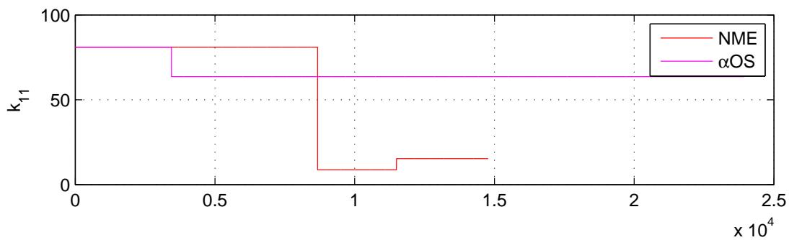

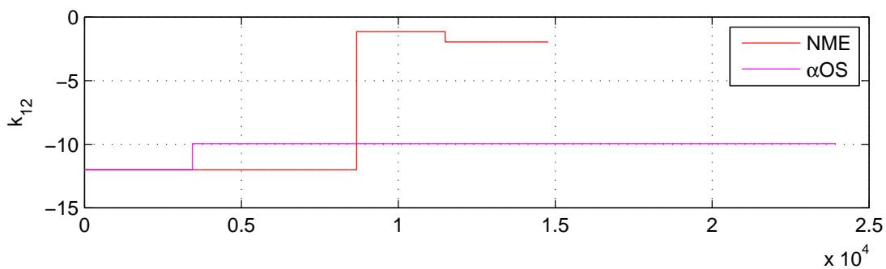

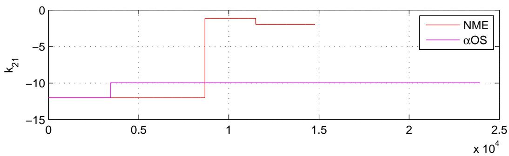

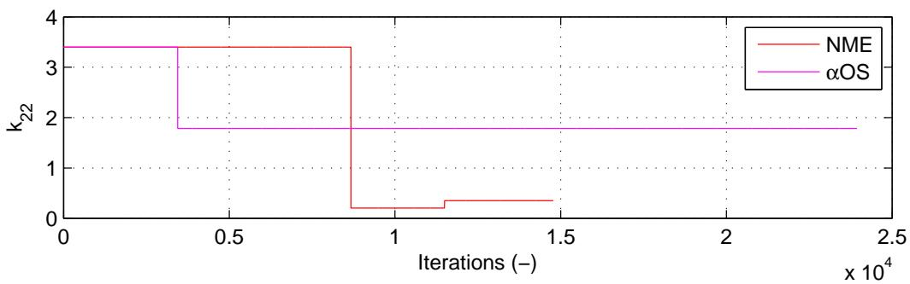  
图 3.29：使用CFC:Intrinsic.for αOS和NMR进行非线性2自由度混合仿真的切线刚度值。

### 3.4.3 实验结果总结与验证

本节结果表明，对于使用刚性$\mu$-NEES装置的测试，力控制（FC）混合仿真略优于位移控制（DC）混合仿真。CFC方法优于EFC方法，尽管EFC方法不依赖于切线刚度矩阵。MTS-STS控制系统对位移和力的跟踪效果同样良好。BFGS方法是估计切线刚度矩阵最稳健的方法，它与所有四种时间积分方案都能配合使用。使用NMR的方法会产生不希望出现的控制系统指令力曲线。


