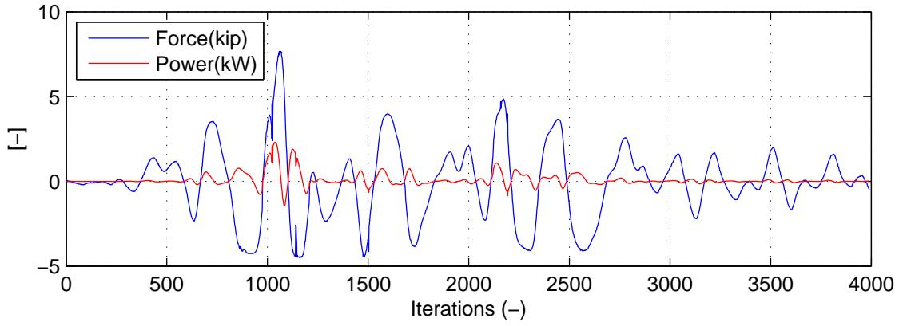
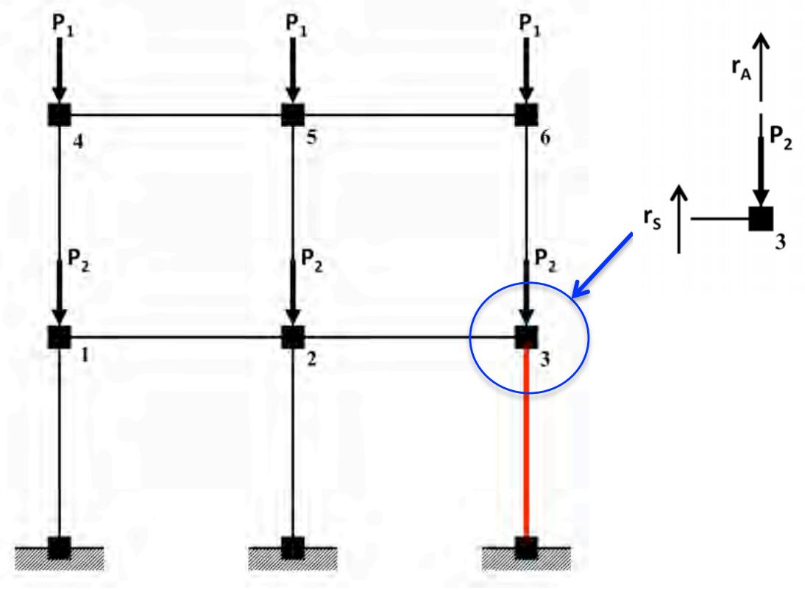

# 第 6 章 结论

本论文开发并探索了混合仿真中的替代控制方法，即力控制（FC）、切换控制（SC）和混合控制（MC）。由于控制系统的限制，需要这些控制方法。大多数混合仿真测试在控制系统处于位移控制（DC）模式下进行。在许多情况下，位移控制是最佳控制模式并产生良好结果。然而，这并不意味着混合仿真中不需要替代控制方法。

结构工程师和研究人员总是在突破极限并发明新的创新结构构件和组件。民用结构在其预期寿命期间提供低概率生命损失灾难性故障的高置信度。因此，安全性和可靠性在结构工程中非常重要。随着结构工程师设计和开发新的先进结构构件，同样需要先进的实验技术和装置来测试这些构件的性能。

混合仿真是实现这些先进实验技术和装置的完美平台。混合仿真是革命性的，因为它提供了一种通过物理测试其构件来对结构系统进行验证测试的方法。在此之前，研究人员必须测试整个系统，或者使用鉴定而非验证测试方法来测试独立构件。混合仿真产生真实的加载模式，并且可以捕捉这些构件对整个结构的影响。为了使混合仿真继续成为结构工程中相关且有效的系统工程方法，它必须提供手段来测试整个结构系统、构件和组件组合，在任何现实的长期和极端挑战组合下。这是本论文的大局动机，推进混合仿真的能力，使其继续成为结构测试的有效方法。另一个动机因素是完成混合仿真概念公式的需要，提供处理结构力学中位移和力之间对偶性的手段。

## 6.1 力控制

第3章定义、开发并测试了控制系统处于FC模式的混合仿真方法。设计了获取试算力（施加到试件上的力）的方法。这些方法分为两个不同类别。一个基于强制执行结构变形的兼容性。另一个基于保持结构中的力平衡。这些方法在Matlab和OpenFresco中实现。

然后研究转向FC混合仿真的控制方面，扩展了用于FC混合仿真的Simulink/Stateflow模型。第3章展示了使用FC Simulink/Stateflow模型和计算试算力的方法进行FC混合仿真测试的结果。$\mu$-NEES实验设置为FC混合仿真测试配置。进行了DC和FC混合仿真测试并进行比较。FC结果总体上略优于DC结果。如果试件比测试的设置更刚性，则怀疑FC的结果会比DC明显更好。然而，构建像$\mu$-NEES这样非常刚性的可重复测试平台非常困难。这些结果表明FC混合仿真是可实现的，并且产生的结果至少与DC混合仿真一样好，如果不是更好的话。

## 6.2 切换控制

第4章介绍了切换控制混合仿真。切换控制混合仿真是FC混合仿真的逻辑扩展。在整个混合仿真测试过程中，试件可能经历需要改变控制系统控制模式的变形和力。本章实现了两种切换策略，即力限制和割线刚度限制切换。使用第3章的FC混合仿真方法进行这些切换策略的SC混合仿真测试。

1自由度$\mu$-NEES设置和SC Simulink/Stateflow模型用于SC混合仿真测试。测试结果表明DC结果略优于SC结果。SC结果优于FC结果。实际上，所有三个结果都同样好。还与FC混合仿真结果一样得出结论，更刚性的试件会产生SC方法的更好结果。NNE和αOS时间积分方案在SC混合仿真测试中表现优于NMF和NMR时间积分方案。

## 6.3 混合控制

混合控制混合仿真是SC混合仿真和多自由度FC混合仿真的下一个自然发展。第5章讨论了MC混合仿真。它结合了第3章获取试算力的FC混合仿真方法与第4章的切换策略。实现了MC Simulink/Stateflow模型用于MC混合仿真，其中2自由度$\mu$-NEES设置的顶部执行器始终处于DC模式，底部执行器在DC和FC模式之间切换。

MC混合仿真测试结果证明与数值结果的匹配不如DC和FC结果好。事实上，大多数MC结果在正确捕捉漂移方面存在困难。然而，力结果与数值结果吻合良好。不同控制模式下执行器的相互作用可能导致某些位移偏差。尽管如此，令人鼓舞的是，有一些测试中MC的响应与DC和FC中的响应相当。至少，可以成功进行MC混合仿真，并且软件框架和预测-校正Simulink/Stateflow模型已经到位以继续研究。

## 6.4 未来工作方向

尽管本论文在上述讨论的主题上取得了一些进展，但要使这些类型的混合仿真完全成熟，仍需要进行更多的研究和实验。本节概述了本论文所呈现的混合仿真中替代控制方法的未来研究。

### 6.4.1 进一步验证

需要进一步验证FC、SC和MC混合仿真方法。如前所述，这些方法并不总是产生比DC混合仿真方法更好的结果。一个可能的原因是$\mu$-NEES实验设置不够刚性。需要一个刚性系统，其中FC模式下的跟踪性能明显优于DC模式下的跟踪性能。FC、SC和MC方法适用于控制系统在整个测试过程中无法在DC模式下充分运行的设置和试件。只有使用这样的设置才能完全验证这些方法。除了刚性设置外，本论文中的混合模型相对简单且自由度数量较少。需要使用更大的模型测试这些方法，以证明这些方法可扩展。

需要对所有控制模式（FC、SC、MC和DC）进行深入的误差分析。应检查几个可能的误差来源。第一个是切线刚度矩阵的估计及其用于计算试算力的部署。向混合仿真过程添加这一额外的计算层改变了先前的误差分析。另一个来源在于控制系统环路实现：当切换控制模式时，它通过控制系统测量值的尖峰表现出来。这可能或可能不影响结果。这取决于这是MTS-STS控制系统和$\mu$-NEES实验设置特有的伪影。此尖峰也可能对控制系统的跟踪性能产生不利影响。另一方面，尖峰可能发生在控制系统改变模式的瞬间，可能对其性能没有大的影响。这不确定，因此值得研究。需要对基于平衡力的力控制（ECF）方法进行误差分析。这是首次将基于力的时间积分方案用于混合仿真。因此，不存在此方法的误差分析。

### 6.4.2 使用功率进行切换

SC和MC混合仿真的性能和结果主要取决于其切换策略。力和割线刚度是本论文中研究的两个切换标准。还应研究其他标准。从实验结果可以看出，基于力和基于割线刚度的切换给出相当的结果。然而，它们确实有各自的缺点，如第4章所述。

一个值得研究的标准是实验设置产生的机械功率。功率可以从测量值计算或直接通过仪器测量。机械功率计算简单，$P(t) = F(t) * V(t)$。$F(t)$是测量力，$V(t)$是从测量位移计算的速度。图6.1显示了第4章中呈现的SC混合仿真测试之一的计算功率$P(t)$图。从对图6.1的粗略检查来看，功率的正尖峰可能是测试期间的良好切换点。正功率尖峰发生在试件开始进入非线性区域之前。

  
图6.1：使用NME的PSC的计算功率和试算力随时间变化的图。

### 6.4.3 MC混合仿真的进一步研究

在三种混合仿真控制方法中，MC混合仿真方法是最不成熟的。它的表现也不如其他两种。确切原因未知。推测两个执行器在不同控制模式下运行的相互作用可能是原因之一。这种推测的原因是DC和FC结果表现更好。需要新的设置来研究这种可能的原因。这个新设置必须首先对一个控制自由度更刚性，并且其执行器配置需要改变。2自由度$\mu$-NEES设置中的执行器彼此平行。新配置应将执行器配置为正交配置。性能不佳的另一个原因可能与切换策略有关。切换参数可能没有正确设置。需要进行参数研究以排除这是原因。

值得研究获取试算力的新方法。图6.2说明了当两个加载方向彼此正交时获取试算力的拟议方法。红色元素是被测试的梁柱元素。水平自由度处于DC模式，垂直自由度处于FC模式。水平试算位移的计算方式与DC混合仿真相同。获得这些给定试算位移的数值模型状态。然后不平衡垂直力$(r_s + r_a - P_2)$用作试算力。此方法的大多数商业有限元程序无法实现，因为它需要高度可定制的有限元软件包。

  
图6.2：通常用于多自由度多执行器系统的MC混合仿真拟议方法，使用节点处的不平衡力作为试算力。

### 6.4.4 Simulink/Stateflow模型

用于FC、SC和MC混合仿真测试的Simulink/Stateflow模型使用线性插值和外推进行校正和预测。看看其他类型的插值和外推如何表现会很有趣。有使用$2^{nd}$和$3^{rd}$阶多项式的DC Simulink/Stateflow模型。这些模型可以轻松扩展用于FC、SC和MC混合仿真测试。最初避免使用高阶多项式，因为怀疑这些会导致可能引起控制系统不稳定的振荡。此怀疑未得到验证。

本论文所有测试使用0.10秒的仿真时间步。这些测试相对较慢。NME、αOS、NMF和NMR的积分时间步为0.02秒，但NME、αOS和NMF使用20个子步。这使得实际积分时间步为0.001秒。仿真时间步大100倍。使用如此大仿真时间步的原因是在整个测试过程中保持控制系统稳定。应进行研究以查看这些测试是否可以更快运行。调查计算驱动器使用的不同积分方法以及这些方法与预测器/校正器策略之间的交互是一个很好的起点。

### 6.4.5 EFC方法与其他时间积分方案

EFC方法使用NMR时间积分方案，因为其他时间积分方案会导致使用此方法驱动的仿真变得不稳定。使用NMR的缺点是它不能为控制器生成良好的指令值曲线。为了克服这一缺点，可能可以将NME、αOS和NMF与此方法一起使用。已经开始了一些初步公式，但它们不完整。如果这可以实现，它可能使EFC方法比兼容性力控制方法更有效，因为它不使用切线刚度矩阵的估计。

### 6.4.6 总结

结构工程这一领域需要进一步研究。这些主题既具有挑战性又有回报。作者希望本论文中呈现的研究将继续进行，如果不是由作者本人，则由发现此主题同样迷人的其他研究人员继续进行。

# 参考文献

* [1] M. Ahmadizadeh和G. Mosqueda。使用实验切线刚度矩阵估计的改进算子分裂积分的混合仿真。J. Struct. Eng.-ASCE, 134(12):1829–1838, 2008年1月。
* [2] C.G. Broyden。求解非线性联立方程的一类方法。Mathematics of Computation, 19(92):577–593, 1965年10月。
* [3] P. Caravani, M.L. Watson和W.T. Thomson。递归最小二乘时域结构参数识别。J. Appl. Mech.-T. Asme, 44(1):135–140, 1977年3月。
* [4] J.E. Carrion和B.F. Spencer。基于模型的实时混合测试策略。In ASCE Structure Congress, Seattle, WA, 2003。
* [5] Anil K. Chopra。结构动力学。Prentice Hall, 2001。
* [6] D. Combescure和P. Pegon。伪动力测试的α-算子分裂时间积分技术 - 误差传播分析。Soil Dyn. Earthq. Eng., 16:427–443, 1997年1月。
* [7] T. Elkhoraibi和K.M. Mosalam。迈向使用混合变量的无误差混合仿真。Earthquake Engineering Structural Dynamics, 36(11):1497–1522, 2007。
* [8] Erich Gamma, Richard Helm, Ralph Johnson和John Vlissides。科学家和工程师数学手册。McGraw- Hill, New York, 1968。
* [9] H.M. Hilber, Hughes T.J.R.和R.L. Taylor。结构动力学时间积分算法的改进数值耗散。Earthquake Engineering Structural Dynamics, 5:283–292, 1977年1月。
* [10] C. Hung和S. El-Tawi。混合仿真试件切线刚度估计方法。Earthquake Engineering Structural Dynamics, 38(1):115–134, 2008。
* [11] A. Igarashi, F. Seible和G. Hegemier。伪动力技术开发用于测试全尺寸5层剪力墙结构。In Development and Future Dimensions of Structural Testing Techniques, 1993。
* [12] H. Klie和M. Wheeler。非线性Krylov-secant求解器。Technical report, The Center for Subsurface Modeling, The Institute for Computational Engineering and Sciences, Univ. of Texas, Austin, 2006年1月。
* [13] G. Korn和publisher = McGraw- Hill, New York year = 1968 Korn, T., title = Mathematical Handbook for Scientists and Engineers。
* [14] O. Kwon, N. Nakata, K. Park, A. Elnashai和B. Spencer。UI-SIMCOR v2.6和NEES-SAM v2.0用户手册和示例。
* [15] G. Mosqueda。具有地理分布子结构的连续混合仿真。PhD thesis, University of California, Berkeley, 2003。
* [16] M. Nakashima, T. Kaminosono, M. Ishida和K. Ando。子结构伪动力测试的积分技术。In Proceedings of the US National Conference on Earthquake Engineering, 1990。
* [17] N. Nakata, B.F. Spencer和A.S. Elnashai。混合仿真的混合载荷/位移控制策略。In Proc., 4th Int. Conf. on Earthquake Engineering, Taipei, Taiwan, 2006。
* [18] M. Pan, P.and Nakashima和H. Tomofuji。使用位移-力混合控制的在线测试。Earthquake Engineering Structural Dynamics, 34(8):869–888, 2005。
* [19] S. Patnaik。地震激励下拉链支撑钢框架的混合仿真。International J. for Num. Meth. in Eng., 6:237–251, 1973。
* [20] A. Schellenberg。混合仿真的高级实现。PhD thesis, University of California, Berkeley, 2008。
* [21] A. Schellenberg, H.K. Kim, Y. Takahashi, Fenves G.L.和Mahin S.A。混合仿真的Openfresco框架：Ui-simcor v2.6示例。Technical report, Department of Civil and Environmental Engineering, University of California, Berkeley, 2009年8月。
* [22] M.H. Scott和G.L. Fenves。Krylov子空间加速牛顿算法。In Proc., 4th Int. Conf. on Earthquake Engineering, Taipei, Taiwan, 2006。
* [23] P.S.B. Shing和S.A. Mahin。伪动力测试的加载速率效应。J. Struct. Eng.-ASCE, 114(11):2403–2420, 1988年1月。
* [24] P.S.B. Shing和S.A. Mahin。伪动力测试中的实验误差效应。J. Eng. Mech.-ASCE, 116(4):805–821, 1990年1月。
* [25] M. Sivaselvan, A. Reinhorn, Z. Liang和X. Shao。结构系统的实时动态混合测试。In Proc. of the 13th World Conf. Earthquake Engineering, 2004。
* [26] Y. Takahashi和G.L. Fenves。结构系统分布式实验计算仿真的软件框架。Earthquake Engineering Structural Dynamics, 35(2):267–291, 2006。
* [27] K. Takanashi, K. Udagawa, M. Seki, T. Okada和H. Tanaka。通过计算机-执行器在线系统进行的结构非线性地震响应分析（第1部分 系统详情）。Trans. Architectural Inst. of Japan, (229):77–83, 1975。
* [28] C.R. Thewalt和S.A. Mahin。广义伪动力测试的混合求解技术。Technical Report UCB/EERC-87/09, Earthquake Engineering Research Center, University of California, Berkeley, 1987年7月。

