# 附录A 用于FC、SC和MC混合仿真的OpenFresco

OpenFresco最初由Takahashi和Fenves[26]开发。Schellenberg等人[20]对原始概念进行了进一步完善。它经历了几次改进，目前发布为2.6版本。OpenFresco提供了一种在计算驱动器和传输系统之间进行事务处理的标准方式。此软件框架使用C++编程，并利用面向对象编程范式。因此，它是灵活、可扩展和可适应的，支持许多不同类型的计算驱动器传输系统。OpenFresco还允许来自不同站点的用户通过其多层软件架构更轻松地协作。这有助于涉及多站点的分布式混合仿真。

## A.1 OpenFresco软件架构

OpenFresco基于三层和多层软件架构。这些软件架构是著名的客户端-服务器架构的变体。三层架构由客户端、中间层服务器和后端服务器组成。计算驱动器代表客户端。这是架构的顶层，在此对结构进行数值建模并执行分析。中间层服务器封装OpenFresco进程。在所有实际用途中，中间层服务器就是OpenFresco。中间层服务器调解客户端和后端服务器之间的交互。它处理从客户端到后端服务器以及 vice-versa 的数据通信和转换。后端服务器，最后一层，代表包括控制和DAQ系统的实验室。这是混合仿真的实验部分。

此架构提供了灵活性，使得各种计算驱动器和实验室设备可用于混合仿真。目前OpenFresco支持OpenSees、LS-Syna、Abacus和Matlab作为计算驱动器。它还支持各种实验室设备。

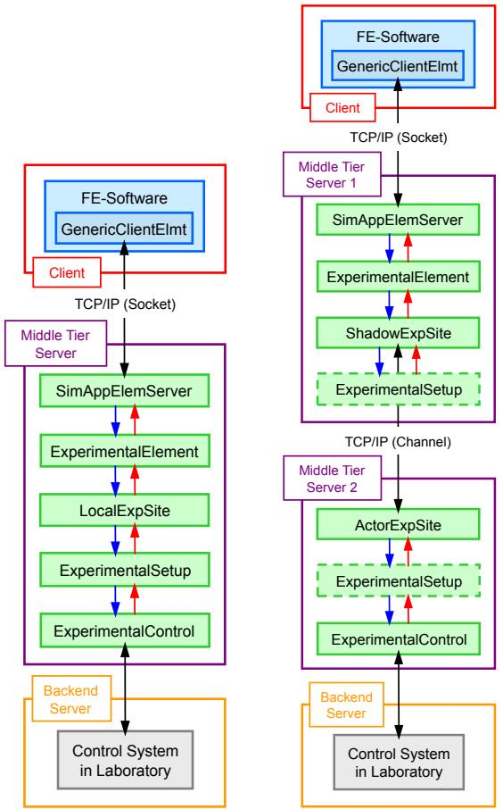  
(a)   
(b)   
图A.1：OpenFresco架构用于(a)本地部署和(b)分布式部署[20]。

### A.1.1 OpenFresco UML类图

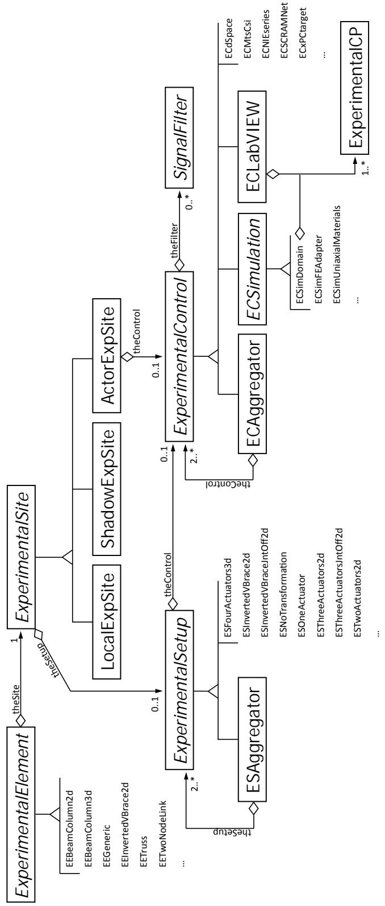  
：DC混合仿真的OpenFresco类图

  
FC、SC、MC混合仿真的OpenFresco类图

## A.2 OpenFresco类

#### A.2.0.1 实验单元

实验单元代表有限元分析程序中的物理试件。它与分析单元有许多相似之处。它提供质量、阻尼和刚度矩阵；它还返回给定变形状态的力向量。因此，OpenFresco中的实验单元抽象类继承自OpenSees单元类。实验单元类执行从分析模型的全局坐标系到用于测试的局部或基本坐标系的变换。它还执行此变换的逆变换。此抽象类变换以下响应量：位移、速度、加速度和力。实验单元始终返回初始刚度矩阵，因为在测试期间难以准确确定物理试件的切线刚度矩阵。

以下是实验单元具体子类的列表：

• 桁架（1D、2D和3D）
• 梁柱（2D和3D）
• 两节点连杆（1D、2D和3D）
• 通用（1D、2D和3D）
• 倒V支撑

#### A.2.0.2 实验站点

实验站点代表实验室和计算驱动器运行的位置。这些站点不一定必须在同一位置。为了概括实验站点抽象类，实现了通信方法。此类还提供站点之间的安全通信。

以下是实验站点具体子类的列表：

• 本地
• 影子和参与者

#### A.2.0.3 实验设置

实验设置代表实验室中的传输系统，不包括控制和数据采集系统。实验设置抽象类执行从局部或基本系统到执行器坐标系的变换。它还执行反向变换。

-代表实验室中的传输系统 -变换 以下是实验设置具体子类的列表：

• 无变换

• 一个执行器
• 两个执行器
• 三个执行器
• 倒V支撑
• 聚合器

#### A.2.0.4 实验控制

实验控制抽象类提供与控制系统的接口。它允许OpenFresco与控制系统通信。它与实验设置类分离，以便在加载设置上工作的实验室技术人员不必关心控制和数据采集系统的IT方面。

以下是实验控制具体子类的列表：

• dSpace、xPC Target和SCRAMNet+
• MTS-CSI和LabVIEW
• 单轴材料和域仿真

## A.3 力控制混合仿真的OpenFresco代码

```cpp
class ESFTangForceConverter : public ExperimentalSignalFilter
{
public:
    // constructors
    ESFTangForceConverter(int tag, Matrix& initStif,
        ExperimentalTangentStiff* tangStif = 0);
    ESFTangForceConverter(const ESFTangForceConverter& esf);
    
    // destructor
    virtual ~ESFTangForceConverter();
    
    // method to get class type
    const char *getClassType() const {return "ESFTangForceConverter";};
    
    virtual int setSize(const int sz);
    virtual double filtering(double data);
    virtual Vector& converting(Vector* trialDisp);
    virtual Vector& converting(Vector* daqDisp, Vector* daqForce);
    virtual void update();
    
    virtual ExperimentalSignalFilter *getCopy();
    
    // public methods for output
    void Print(OPS_Stream &s, int flag = 0);

private:
    ExperimentalTangentStiff *theTangStiff;
    bool firstWarning;  // flag for updating the stiffness matrix
    int size;           // size of ctrl and daq vectors
    Vector dispPast, forcePast, convertFrc, incrDisp, incrForce;
    Matrix kInit, kPrev, thetangStiffMat;  // tangent stiffness matrix
    
    int setInitialStiff();
    int updateMatrix(const Vector* daqDisp, const Vector* daqForce);
};
```

图A.4：继承自ExperimentalSignalFilter类的ESFTangForceConverter具体类定义。

```cpp
class ESFKrylovForceConverter : public ExperimentalSignalFilter
{
public:
    // constructors
    ESFKrylovForceConverter(int tag, int ss, Matrix& initStif);
    ESFKrylovForceConverter(const ESFKrylovForceConverter& esf);
    
    // destructor
    virtual ~ESFKrylovForceConverter();
    
    // method to get class type
    const char *getClassType() const {return "ESFKrylovForceConverter";};
    
    virtual int setSize(const int sz);
    virtual double filtering(double data);
    virtual Vector& converting(Vector* trialDisp);
    virtual Vector& converting(Vector* daqDisp, Vector* daqForce);
    virtual void update();
    
    virtual ExperimentalSignalFilter *getCopy();
    
    // public methods for output
    void Print(OPS_Stream &s, int flag = 0);

private:
    bool firstWarning;	// flag for updating the stiffness matrix
    int size;			// size of ctrl and daq vectors
    int szSubspace;		// number of spaces vectors to use
    Vector dispPast, forcePast, convertFrc, incrDisp, incrForce, cn;
    Matrix kInit;	    // tangent stiffness matrix
    Matrix iDMatrix;	// the incremental displacement Matrix
    Matrix iFMatrix;	// the incremental force Matrix
    
    int setInitialStiff();
    int updateIncrMat(const Vector* daqDisp, const Vector* daqForce);
    int matTranspose(Matrix* kT, const Matrix* k);
};
```

图A.5：继承自ExperimentalSignalFilter类的ESFKylovForceConverter具体类定义。 

```cpp
class ECxPCtargetForce : public ExperimentalControl
{
public:
    // constructors
    ECxPCtargetForce(int tag, char *ipAddress, char *ipPort,
        char *appName, char *appPath = 0);
    ECxPCtargetForce(const ECxPCtargetForce &ec);
    // destructor
    virtual ~ECxPCtargetForce();
    // method to get class type
    const char *getClassType() const {return "ECxPCtargetForce";};
    // public methods to set and to get response
    virtual int setup();
    virtual int setSize(ID sizeT, ID sizeO);
    virtual int setTrialResponse(const Vector* disp,
        const Vector* vel, const Vector* accel, const Vector* force,
        const Vector* time);
    virtual int getDaqResponse(Vector* disp,
        Vector* vel, Vector* accel, Vector* force, Vector* time);
    virtual int commitState();
    virtual ExperimentalControl *getCopy();
    // public methods for experimental control recorder
    virtual Response *setResponse(const char **argv, int argc,
        OPS_Stream &output);
    virtual int getResponse(int responseID, Information &info);
    // public methods for output
    void Print(OPS_Stream &s, int flag = 0);
protected:
    // protected methods to set and to get response
    virtual int control();
    virtual int acquire();
private:
    void sleep(const clock_t wait);
    int port;
    char *ipAddress, *ipPort, *appName, *appPath, char errMsg[256];
    double newTarget, switchPC, atTarget;
    bool frcFeedbackMode;  // 0-converted frc or 1-daq frc feedback
    double *ctrlDisp, *ctrlForce, *daqDisp, *daqForce;
    int newTargetId, switchPCId, atTargetId;
    int ctrlForceId, *daqDispId, *daqForceId;
};
```

图A.6：ECxPCtargetForce具体类定义。

# 附录B µ-NEES实验设置的调谐

$\mu-NEES$实验设置是可用于验证混合仿真方法的实验设置。图3.13中所示的夹具提供可更换钢试件的可重复行为。它可以配置为提供不同的设置选项。两种实验设置配置用于力、切换和混合控制方法的测试。本附录显示了$\mu$-NEES实验设置的调谐。

## B.1 MTS-STS通道3的调谐：底部执行器

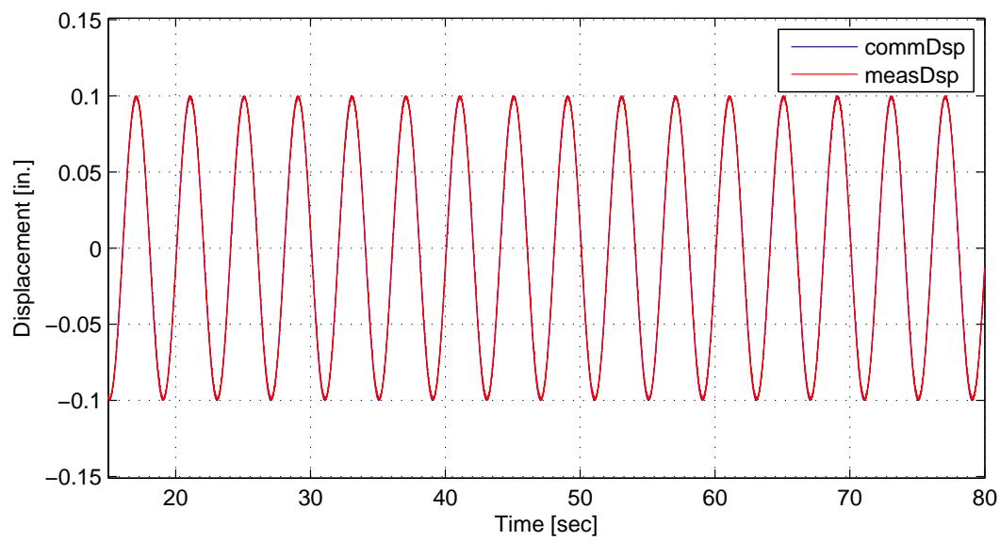  
图B.1：使用振幅为0.1英寸、频率为0.25Hz的正弦波的1自由度$\mu$-NEES实验设置的位移控制调谐图。MTS-STS控制器的通道3针对位移控制进行调谐。

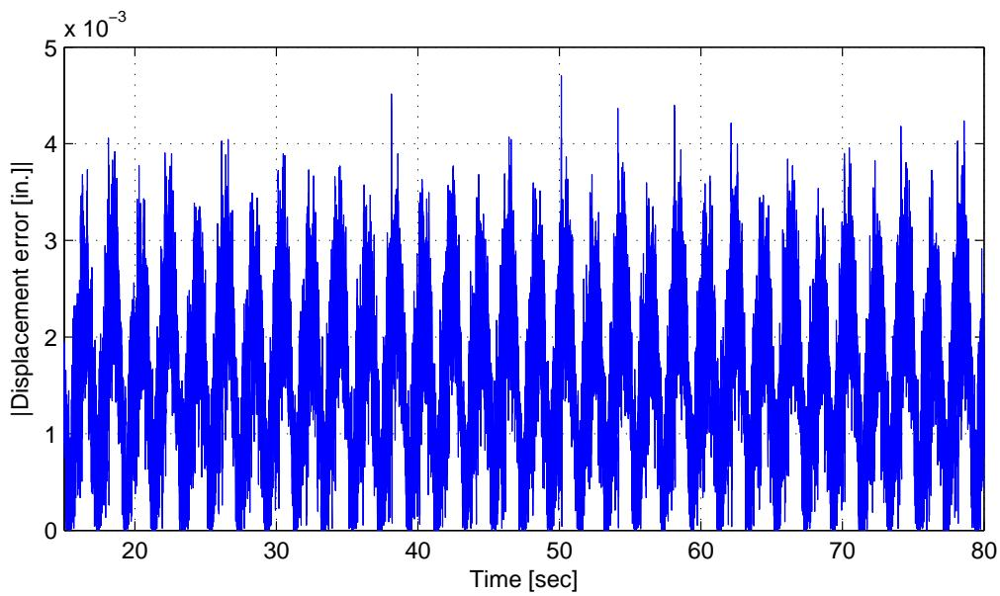  
图B.2：图B.1上图的位移误差绝对值。平均误差为0.00154英寸。最小误差为4.04e-6英寸。最大误差为0.00470英寸。

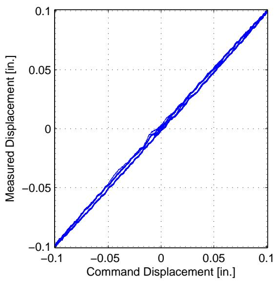

  
图B.3：左 - 使用MTS-STS控制器通道3在位移控制下的1自由度$\mu$-NEES实验设置的跟踪图。右 - 使用MTS-STS控制器通道3在位移控制下的1自由度$\mu$-NEES实验设置的滞回图。

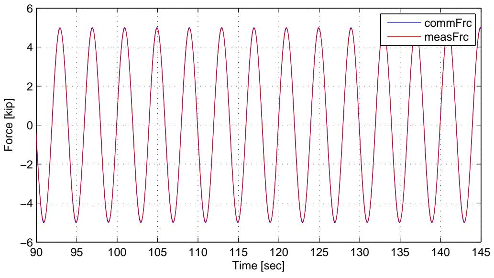  
图B.4：使用振幅为5千磅、频率为0.25Hz的正弦波的1自由度$\mu$-NEES实验设置的力控制调谐图。MTS-STS控制器的通道3针对力控制进行调谐。

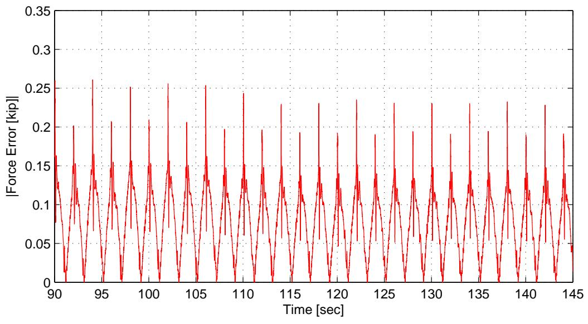  
图B.5：图B.4上图的力误差绝对值。平均误差为0.0796千磅。最小误差为2.38e-6千磅。最大误差为0.261千磅。

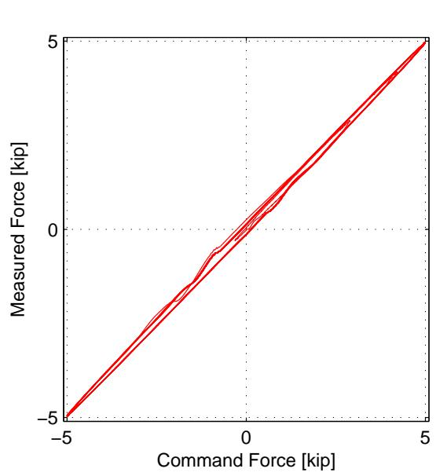

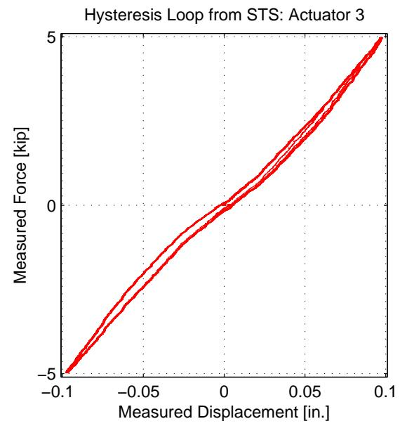  
图B.6：左 - 使用MTS-STS控制器通道3在位移控制下的1自由度$\mu$-NEES实验设置的跟踪图。右 - 使用MTS-STS控制器通道3在位移控制下的1自由度$\mu$-NEES实验设置的滞回图。

表B.1：各种时间积分方案在控制系统水平上1自由度设置非线性混合仿真的绝对误差。显示最小值、平均值和最大值，以数值和量程百分比表示。

| 控制模式 | |误差| | |误差| (量程%) |
|---|---|---|
| DC-最小值 | 4.04×10⁻⁶英寸 | 0.00404% |
| DC-平均值 | 0.00154英寸 | 1.54% |
| DC-最大值 | 0.00470英寸 | 4.60% |
| FC-最小值 | 2.38×10⁻⁶千磅 | 4.76×10⁻⁵% |
| FC-平均值 | 0.0796千磅 | 1.59% |
| FC-最大值 | 0.261千磅 | 5.22% |

## B.2 MTS-STS通道4的调谐：顶部执行器

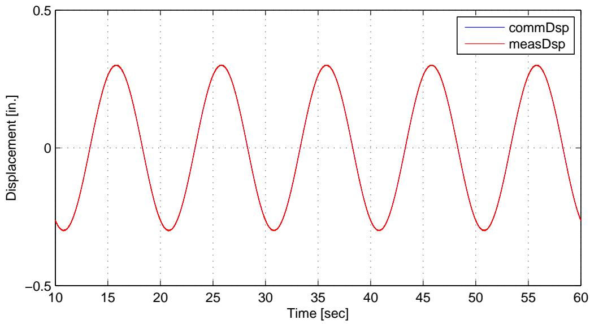  
图B.7：使用振幅为0.3英寸、频率为0.25Hz的正弦波的2自由度$\mu$-NEES实验设置的位移控制调谐图。MTS-STS控制器的通道4针对位移控制进行调谐。

表B.2：各种时间积分方案在控制系统水平上1自由度设置非线性混合仿真的绝对误差。显示最小值、平均值和最大值，以数值和量程百分比表示。

| 控制模式 | |误差| | |误差| (量程%) |
|---|---|---|
| DC-最小值 | 1.10×10⁻⁸英寸 | 3.67×10⁻⁶% |
| DC-平均值 | 5.47×10⁻⁵英寸 | 0.0182% |
| DC-最大值 | 0.00357英寸 | 1.19% |

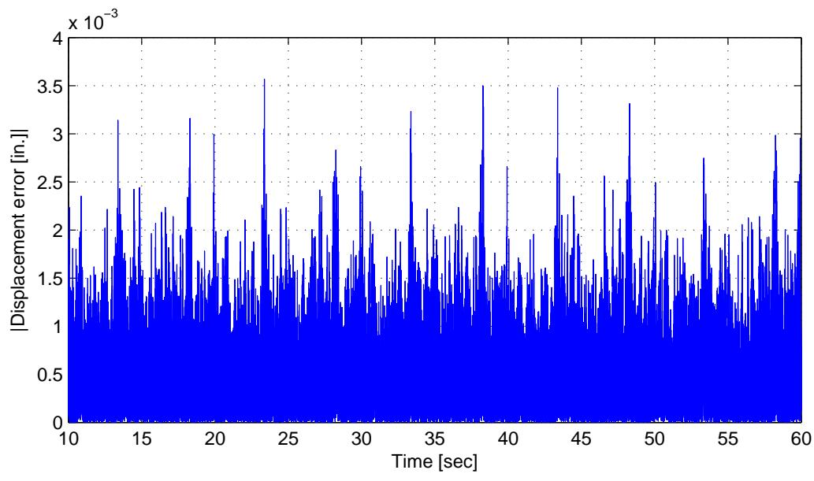  
图B.8：图B.1上图的位移误差绝对值。平均误差为5.47e-5英寸。最小误差为1.10e-8英寸。最大误差为0.00357英寸。

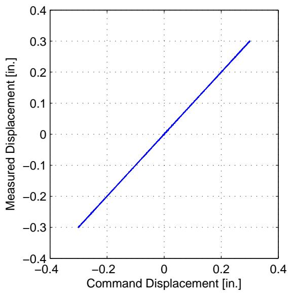

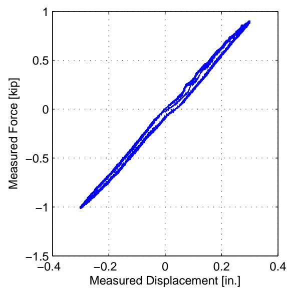  
图B.9：左 - 使用MTS-STS控制器通道3在位移控制下的1自由度$\mu$-NEES实验设置的跟踪图。右 - 使用MTS-STS控制器通道3在位移控制下的1自由度$\mu$-NEES实验设置的滞回图。

# 附录C FC混合仿真实验结果

本章包含使用两种不同配置的$\mu$-NEES实验设置进行FC混合仿真的实验结果，即1自由度和2自由度设置。在每个两种设置上运行线性和非线性混合仿真。部署了NME、$\alpha$-OS、NMF和NMR，但并非所有仿真都成功完成。有些不完整，因为STS控制器变得不稳定或时间积分容差限制不满足。这些时间积分方案的分析结果比较在第3.4节中讨论。

## C.1 1自由度设置：线性混合仿真

第3.1.2节中的El Centro缩放到15%以保持试件在线性范围内。混合模型如图2.1所示。绘制了有限元分析水平软件中单元1（实验单元）的变形和抗力随时间的变化。这些响应量与OpenSees分析中的数值对应物进行比较。显示了DC混合仿真的STS控制器指令和测量位移。还绘制了CFC和EFC混合仿真的STS控制器指令和测量力随时间的变化。这些仿真的结果绘制在图C.1至C.13中。

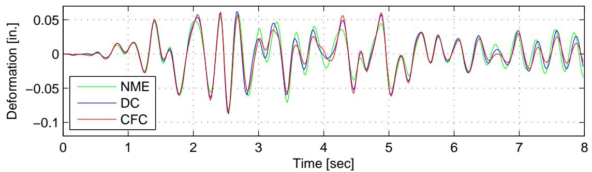

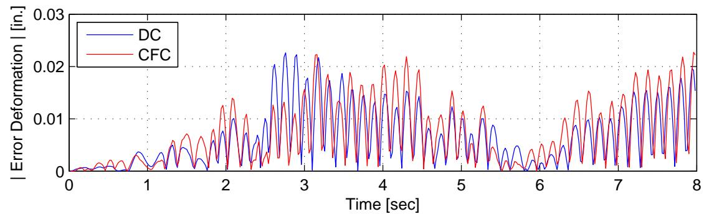

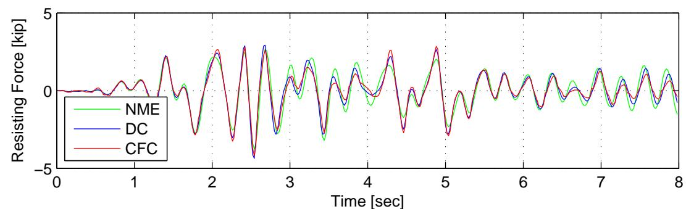

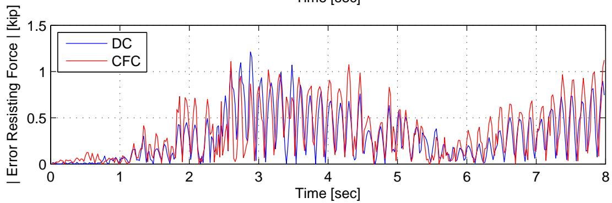  
图C.1：FC混合仿真的单元1位移-时间历程图（上）和位移误差（中上）。单元1抗力-时间历程图（中下）和绝对抗力误差（下）。地面运动缩放15%以保持仿真在线性范围内。1自由度设置使用NME与DC和CFC。

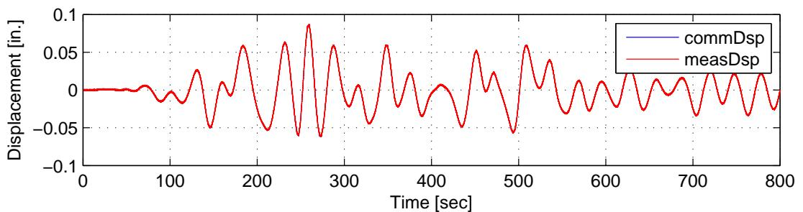

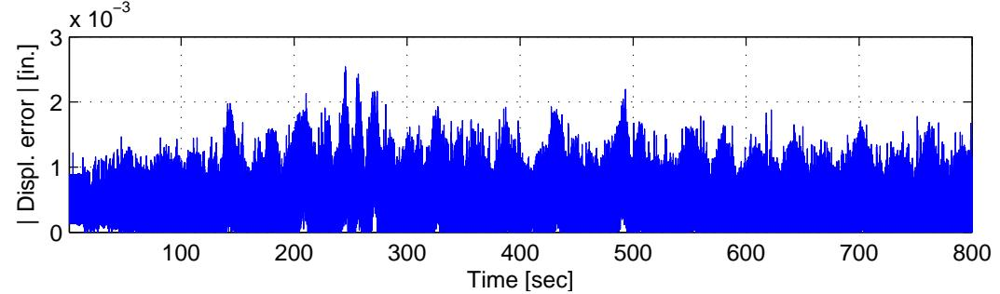

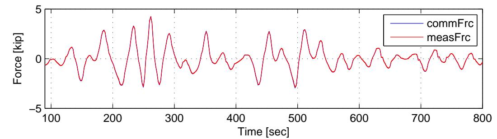  
图C.2：上：DC混合仿真的STS控制器指令和测量位移图。下：STS控制器指令和测量位移之间的绝对误差。地面运动缩放15%以保持仿真在线性范围内。1自由度设置使用NME。

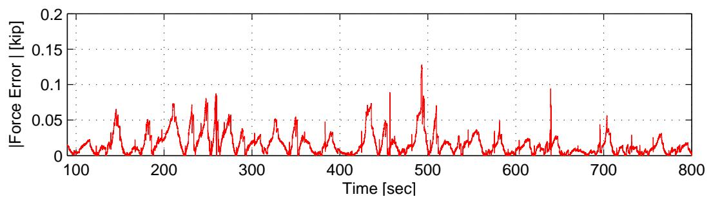  
图C.3：上：CFC混合仿真的STS控制器指令和测量力图。下：STS控制器指令和测量力之间的绝对误差。地面运动缩放15%以保持仿真在线性范围内。1自由度设置使用NME。

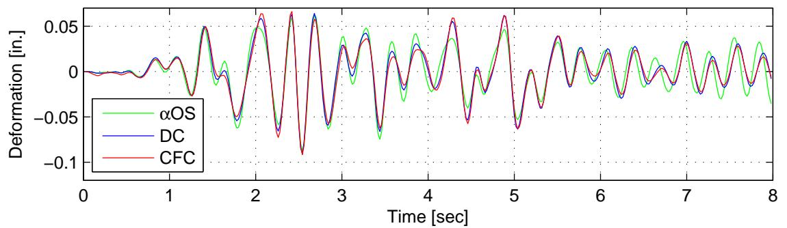

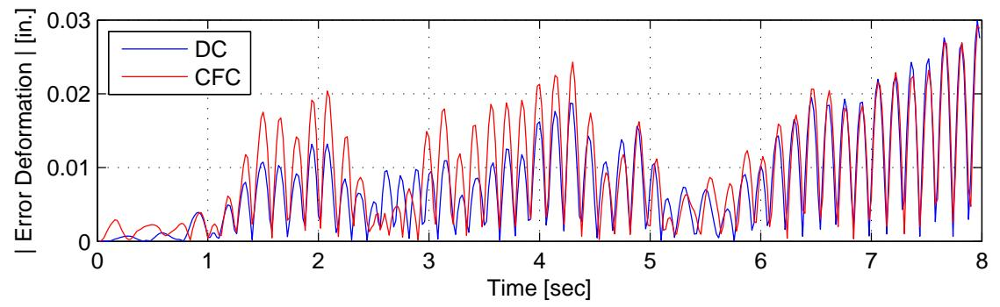

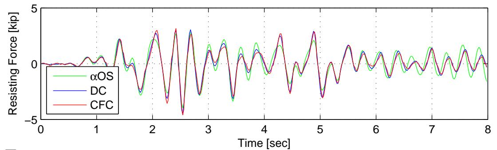

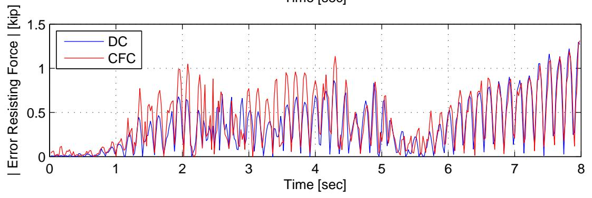  
图C.4：FC混合仿真的单元1位移-时间历程图（上）和位移误差（中上）。单元1抗力-时间历程图（中下）和绝对抗力误差（下）。地面运动缩放15%以保持仿真在线性范围内。1自由度设置使用αOS与DC和CFC。


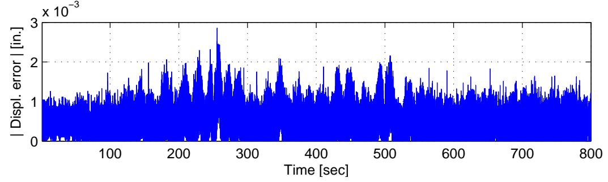

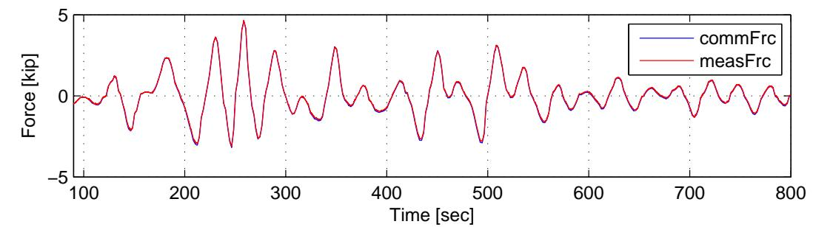  
图C.5：上：DC混合仿真的STS控制器指令和测量位移图。下：STS控制器指令和测量位移之间的绝对误差。地面运动缩放15%以保持仿真在线性范围内。1自由度设置使用αOS。

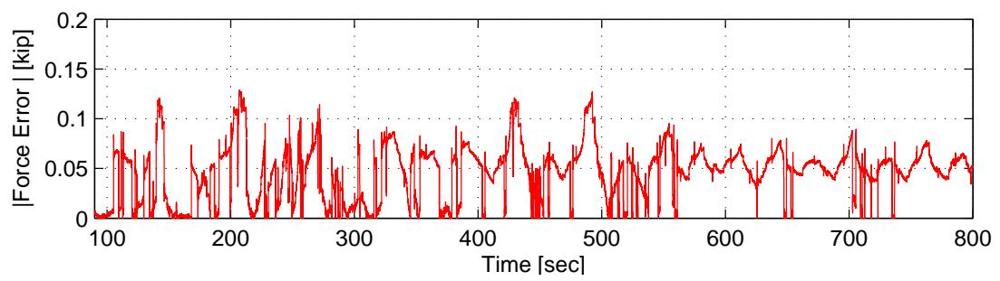  
图C.6：上：CFC混合仿真的STS控制器指令和测量力图。下：STS控制器指令和测量力之间的绝对误差。地面运动缩放15%以保持仿真在线性范围内。1自由度设置使用αOS

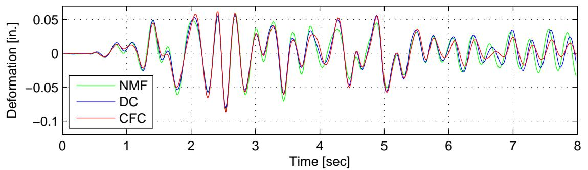

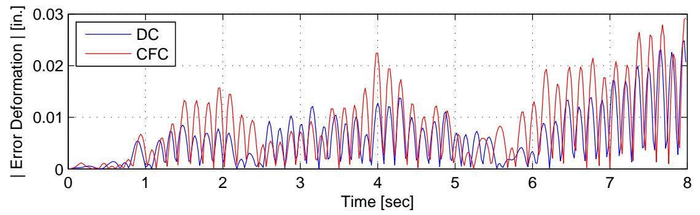

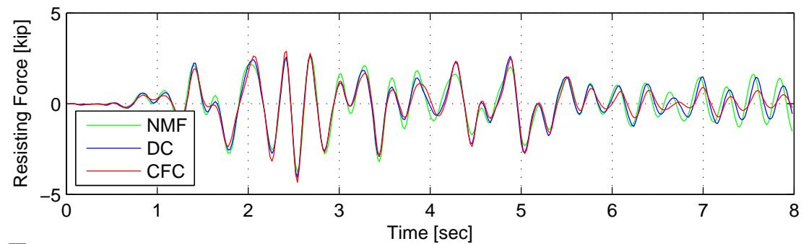

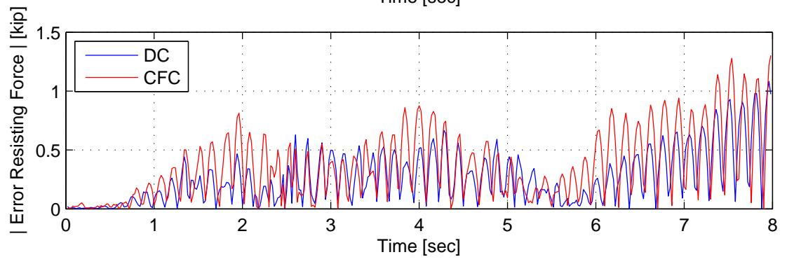  
图C.7：FC混合仿真的单元1位移-时间历程图（上）和位移误差（中上）。单元1抗力-时间历程图（中下）和绝对抗力误差（下）。地面运动缩放15%以保持仿真在线性范围内。1自由度设置使用NMF与DC和CFC。


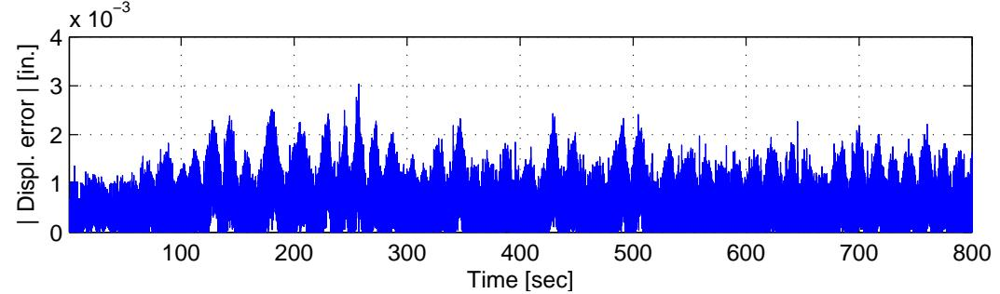

  
图C.8：上：DC混合仿真的STS控制器指令和测量位移图。下：STS控制器指令和测量位移之间的绝对误差。地面运动缩放15%以保持仿真在线性范围内。1自由度设置使用NMF。

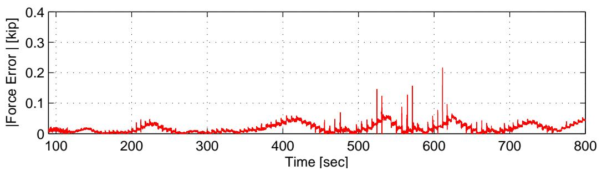  
图C.9：上：CFC混合仿真的STS控制器指令和测量力图。下：STS控制器指令和测量力之间的绝对误差。地面运动缩放15%以保持仿真在线性范围内。1自由度设置使用NMF。

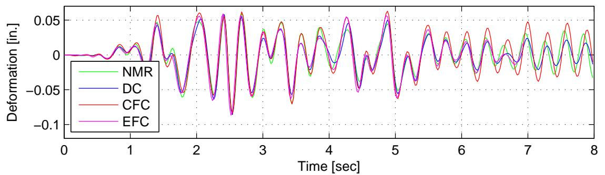


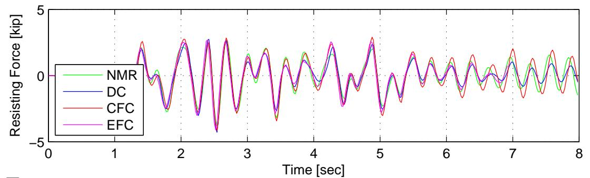

  
图C.10：FC混合仿真的单元1位移-时间历程图（上）和位移误差（中上）。单元1抗力-时间历程图（中下）和绝对抗力误差（下）。地面运动缩放15%以保持仿真在线性范围内。1自由度设置使用NMR与DC、CFC和EFC。

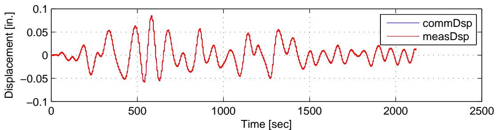

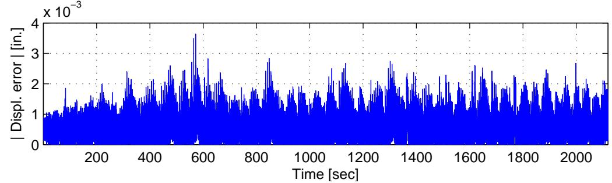

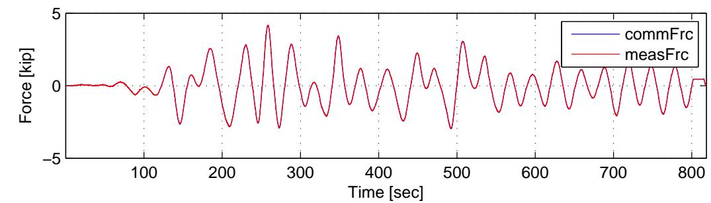  
图C.11：上：DC混合仿真的STS控制器指令和测量位移图。下：STS控制器指令和测量位移之间的绝对误差。地面运动缩放15%以保持仿真在线性范围内。1自由度设置使用NMR。

  
图C.12：上：CFC混合仿真的STS控制器指令和测量力图。下：STS控制器指令和测量力之间的绝对误差。地面运动缩放15%以保持仿真在线性范围内。1自由度设置使用NMR。

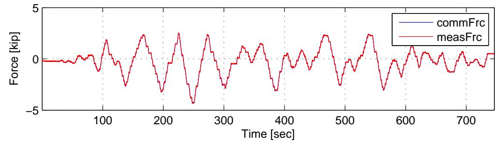

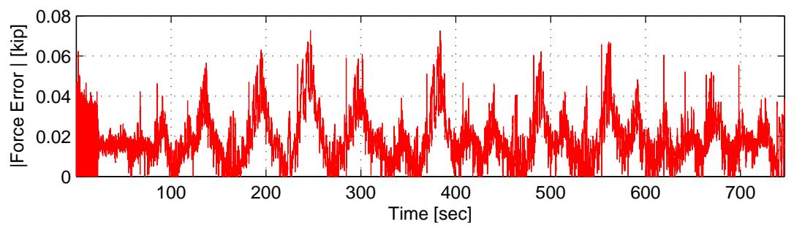  
图C.13：上：EFC混合仿真的STS控制器指令和测量力图。下：STS控制器指令和测量力之间的绝对误差。地面运动缩放15%以保持仿真在线性范围内。1自由度设置使用NMR。

## C.2 1自由度设置：非线性混合仿真

第3.1.2节中的El Centro缩放到40%。混合模型如图2.1所示。绘制了有限元分析软件中单元1（实验单元）的变形和抗力随时间的变化。这些响应量与OpenSees分析中的数值对应物进行比较。显示了DC混合仿真的STS控制器指令和测量位移。还绘制了CFC和EFC混合仿真的STS控制器指令和测量力随时间的变化。由于仅使用1自由度时所有CFC方法都退化为估计割线，因此CFC方法使用割线估计。这些仿真的结果绘制在图C.14至C.19中。

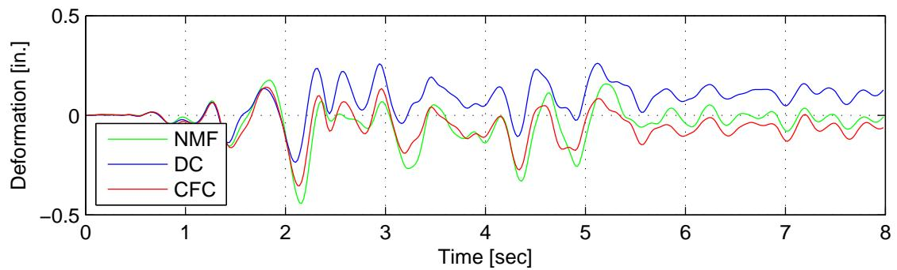


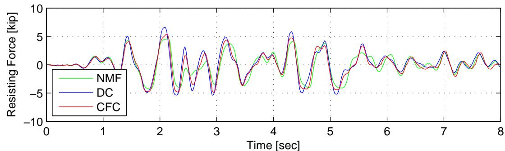

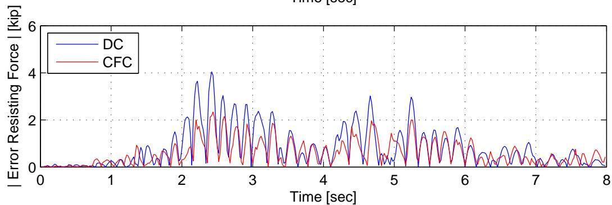  
图C.14：FC混合仿真的单元1位移-时间历程图（上）和位移误差（中上）。单元1抗力-时间历程图（中下）和绝对抗力误差（下）。地面运动缩放到40%以将试件推入非线性范围。1自由度设置使用NMF与DC和CFC。

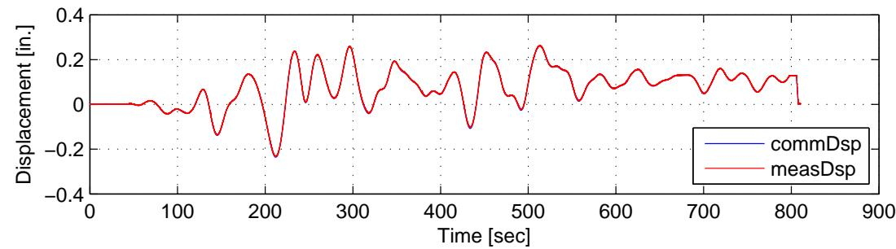

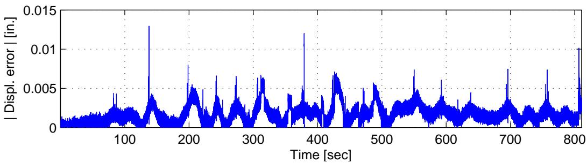

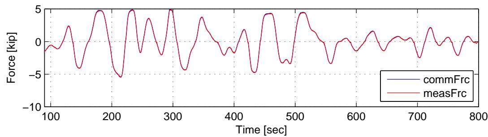  
图C.15：上：DC混合仿真的STS控制器指令和测量位移图。下：STS控制器指令和测量位移之间的绝对误差。地面运动缩放到40%以将试件推入非线性范围。1自由度设置使用NMF。

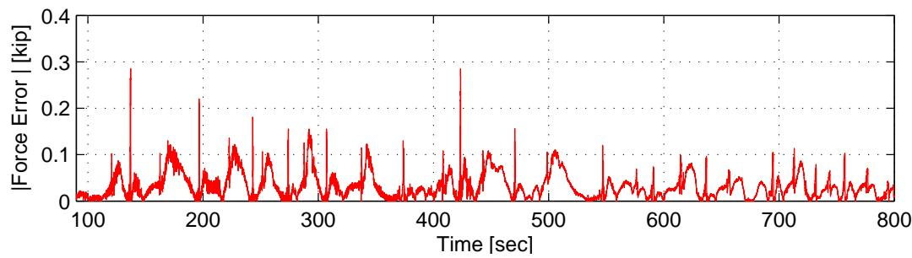  
图C.16：上：CFC混合仿真的STS控制器指令和测量力图。下：STS控制器指令和测量力之间的绝对误差。地面运动缩放到40%以将试件推入非线性范围。1自由度设置使用NMF。


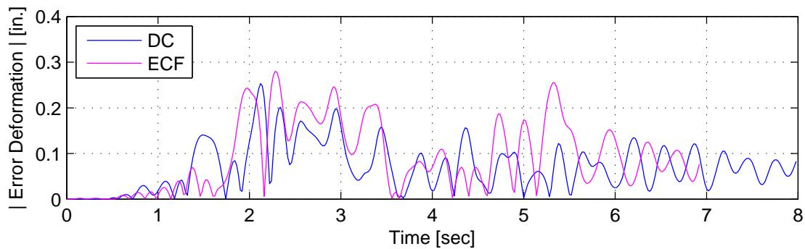

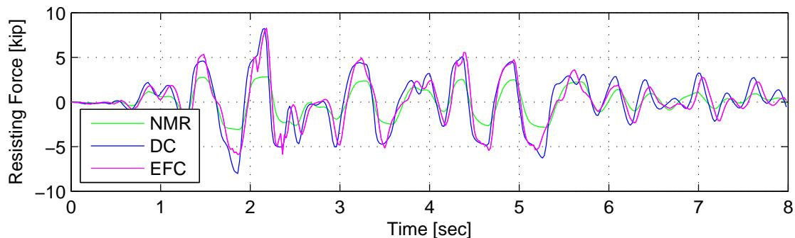

  
图C.17：FC混合仿真的单元1位移-时间历程图（上）和位移误差（中上）。单元1抗力-时间历程图（中下）和绝对抗力误差（下）。地面运动缩放到40%以将试件推入非线性范围。1自由度设置使用NMR与DC和CFC。


  
图C.18：上：DC混合仿真的STS控制器指令和测量位移图。下：STS控制器指令和测量位移之间的绝对误差。地面运动缩放到40%以将试件推入非线性范围。1自由度设置使用NMR。

  
图C.19：上：EFC混合仿真的STS控制器指令和测量力图。下：STS控制器指令和测量力之间的绝对误差。地面运动缩放到40%以将试件推入非线性范围。1自由度设置使用NMR。

## C.3 2自由度设置：线性混合仿真

第3.1.2节中的El Centro缩放到10%以保持试件在线性范围内。混合模型如图3.21（右）所示。绘制了有限元分析软件中实验单元的节点位移和力随时间的变化。这些响应量与OpenSees分析中的数值对应物进行比较。显示了DC混合仿真的两个执行器的STS控制器指令和测量位移。还绘制了CFC和EFC混合仿真的STS控制器指令和测量力随时间的变化。即使测试了其他方法，也仅绘制CFC:BFGS结果。这是因为在线性仿真期间所有CFC方法都使用初始刚度矩阵，并且不更新刚度矩阵。这些仿真的结果绘制在图C.20至C.36中。


  
图C.20：FC混合仿真的节点1位移-时间历程图（上）、节点1绝对位移误差（中上）、节点2位移-时间历程图（中下）和节点2绝对位移误差（下）。地面运动缩放到10%以保持仿真在线性范围内。2自由度设置使用NME与DC和CFC。


  
图C.21：FC混合仿真的节点1力-时间历程图（上）、节点1绝对力误差（中上）、节点2力-时间历程图（中下）和节点2绝对力误差（下）。地面运动缩放到10%以保持仿真在线性范围内。2自由度设置使用NME与DC和CFC。


  
MATLAB学生版图C.22：DC模式下底部执行器STS控制器的指令和测量位移图（上）。底部执行器STS控制器指令和测量位移之间的绝对误差（中上）。DC模式下顶部执行器STS控制器的指令和测量位移图（中下）。顶部执行器STS控制器指令和测量位移之间的绝对误差（下）。地面运动缩放到10%以保持仿真在线性范围内。2自由度设置使用NME。


  
MATLAB学生版图C.23：DC模式下底部执行器STS控制器的指令和测量力图（上）。底部执行器STS控制器指令和测量力之间的绝对误差（中上）。DC模式下顶部执行器STS控制器的指令和测量力图（中下）。顶部执行器STS控制器指令和测量力之间的绝对误差（下）。地面运动缩放到10%以保持仿真在线性范围内。2自由度设置使用NME。


  
图C.24：FC混合仿真的节点1位移-时间历程图（上）、节点1绝对位移误差（中上）、节点2位移-时间历程图（中下）和节点2绝对位移误差（下）。地面运动缩放到10%以保持仿真在线性范围内。2自由度设置使用αOS与DC和CFC。


  
图C.25：FC混合仿真的节点1力-时间历程图（上）、节点1绝对力误差（中上）、节点2力-时间历程图（中下）和节点2绝对力误差（下）。地面运动缩放到10%以保持仿真在线性范围内。2自由度设置使用αOS与DC和CFC。


  
MATLAB学生版图C.26：DC模式下底部执行器STS控制器的指令和测量位移图（上）。底部执行器STS控制器指令和测量位移之间的绝对误差（中上）。DC模式下顶部执行器STS控制器的指令和测量位移图（中下）。顶部执行器STS控制器指令和测量位移之间的绝对误差（下）。地面运动缩放到10%以保持仿真在线性范围内。2自由度设置使用αOS。


  
MATLAB学生版图C.27：DC模式下底部执行器STS控制器的指令和测量力图（上）。底部执行器STS控制器指令和测量力之间的绝对误差（中上）。DC模式下顶部执行器STS控制器的指令和测量力图（中下）。顶部执行器STS控制器指令和测量力之间的绝对误差（下）。地面运动缩放到10%以保持仿真在线性范围内。2自由度设置使用αOS。


  
图C.28：FC混合仿真的节点1位移-时间历程图（上）、节点1绝对位移误差（中上）、节点2位移-时间历程图（中下）和节点2绝对位移误差（下）。地面运动缩放到10%以保持仿真在线性范围内。2自由度设置使用NMF与DC和CFC。


  
图C.29：FC混合仿真的节点1力-时间历程图（上）、节点1绝对力误差（中上）、节点2力-时间历程图（中下）和节点2绝对力误差（下）。地面运动缩放到10%以保持仿真在线性范围内。2自由度设置使用NMF与DC和CFC。


  
MATLAB学生版图C.30：DC模式下底部执行器STS控制器的指令和测量位移图（上）。底部执行器STS控制器指令和测量位移之间的绝对误差（中上）。DC模式下顶部执行器STS控制器的指令和测量位移图（中下）。顶部执行器STS控制器指令和测量位移之间的绝对误差（下）。地面运动缩放到10%以保持仿真在线性范围内。2自由度设置使用NMF。


  
MATLAB学生版图C.31：DC模式下底部执行器STS控制器的指令和测量力图（上）。底部执行器STS控制器指令和测量力之间的绝对误差（中上）。DC模式下顶部执行器STS控制器的指令和测量力图（中下）。顶部执行器STS控制器指令和测量力之间的绝对误差（下）。地面运动缩放到10%以保持仿真在线性范围内。2自由度设置使用NMF。


  
图C.32：FC混合仿真的节点1位移-时间历程图（上）、节点 1绝对位移误差（中上）、节点2位移-时间历程图（中下）和节点2绝对位移误差（下）。地面运动缩放到10%以保持仿真在线性范围内。2自由度设置使用NMR与DC、CFC和EFC。


  
图C.33：FC混合仿真的节点1力-时间历程图（上）、节点1绝对力误差（中上）、节点2力-时间历程图（中下）和节点2绝对力误差（下）。地面运动缩放到10%以保持仿真在线性范围内。2自由度设置使用NMR与DC、CFC和EFC。


  
MATLAB学生版图C.34：DC模式下底部执行器STS控制器的指令和测量位移图（上）。底部执行器STS控制器指令和测量位移之间的绝对误差（中上）。DC模式下顶部执行器STS控制器的指令和测量位移图（中下）。顶部执行器STS控制器指令和测量位移之间的绝对误差（下）。地面运动缩放到10%以保持仿真在线性范围内。2自由度设置使用NMR。


  
MATLAB学生版图C.35：DC模式下底部执行器STS控制器的指令和测量力图（上）。底部执行器STS控制器指令和测量力之间的绝对误差（中上）。DC模式下顶部执行器STS控制器的指令和测量力图（中下）。顶部执行器STS控制器指令和测量力之间的绝对误差（下）。地面运动缩放到10%以保持仿真在线性范围内。2自由度设置使用NMR与CFC。


  
MATLAB学生版图C.36：DC模式下底部执行器STS控制器的指令和测量力图（上）。底部执行器STS控制器指令和测量力之间的绝对误差（中上）。DC模式下顶部执行器STS控制器的指令和测量力图（中下）。顶部执行器STS控制器指令和测量力之间的绝对误差（下）。地面运动缩放到10%以保持仿真在线性范围内。2自由度设置使用NME与EFC。

## C.4 2自由度设置：非线性混合仿真

第3.1.2节中的El Centro缩放到50%。混合模型如图3.21（右）所示。绘制了有限元分析软件中实验单元的节点位移和力随时间的变化。这些响应量与OpenSees分析中的数值对应物进行比较。显示了DC混合仿真的两个执行器的STS控制器指令和测量位移。还绘制了CFC和EFC混合仿真的STS控制器指令和测量力随时间的变化。虽然测试了所有方法，但仅显示成功的测试。当时间积分方案的容差限制未满足或STS控制变得不稳定时，某些测试不被认为是成功的。这些仿真的结果绘制在图C.37至C.54中。


  
图C.37：FC混合仿真的节点1位移-时间历程图（上）、节点1绝对位移误差（中上）、节点2位移-时间历程图（中下）和节点2绝对位移误差（下）。地面运动缩放到50%以保持仿真在非线性范围内。2自由度设置使用NME与DC和CFC:BFGS。


  
图C.38：FC混合仿真的节点1力-时间历程图（上）、节点1绝对力误差（中上）、节点2力-时间历程图（中下）和节点2绝对力误差（下）。地面运动缩放到50%以保持仿真在非线性范围内。2自由度设置使用NME与DC和CFC:BFGS。


  
MATLAB学生版图C.39：DC模式下底部执行器STS控制器的指令和测量位移图（上）。底部执行器STS控制器指令和测量位移之间的绝对误差（中上）。DC模式下顶部执行器STS控制器的指令和测量位移图（中下）。顶部执行器STS控制器指令和测量位移之间的绝对误差（下）。地面运动缩放到50%以保持仿真在非线性范围内。2自由度设置使用NME与DC。


  
MATLAB学生版图C.39：STS控制器在DC模式下底部作动器指令和测量位移曲线（上）。STS控制器底部作动器指令和测量位移之间的绝对误差（中上）。STS控制器在DC模式下顶部作动器指令和测量位移曲线（中下）。STS控制器顶部作动器指令和测量位移之间的绝对误差（下）。地面运动缩放至$50 \%$以保持模拟在非线性范围内。2自由度设置使用NME与DC。


  
MATLAB学生版图C.40：STS控制器在DC模式下底部作动器指令和测量力曲线（上）。STS控制器底部作动器指令和测量力之间的绝对误差（中上）。STS控制器在DC模式下顶部作动器指令和测量力曲线（中下）。STS控制器顶部作动器指令和测量力之间的绝对误差（下）。地面运动缩放至$50 \%$以保持模拟在非线性范围内。2自由度设置使用NME与CFC:BFGS。


  
图C.41：FC混合仿真节点1位移-时程曲线（上）、节点1绝对位移误差（中上）、节点2位移-时程曲线（中下）和节点2绝对位移误差（下）。地面运动缩放至$50 \%$以保持模拟在非线性范围内。2自由度设置使用αOS与DC、CFC:BFGS和CFC:Intrinsic。


  
图C.42：FC混合仿真节点1力-时程曲线（上）、节点1绝对力误差（中上）、节点2力-时程曲线（中下）和节点2绝对力误差（下）。地面运动缩放至$50 \%$以保持模拟在非线性范围内。2自由度设置使用αOS与DC、CFC:BFGS和CFC:Intrinsic。


  
MATLAB学生版图C.43：STS控制器在DC模式下底部作动器指令和测量位移曲线（上）。STS控制器底部作动器指令和测量位移之间的绝对误差（中上）。STS控制器在DC模式下顶部作动器指令和测量位移曲线（中下）。STS控制器顶部作动器指令和测量位移之间的绝对误差（下）。地面运动缩放至$50 \%$以保持模拟在非线性范围内。2自由度设置使用αOS与DC。


  
MATLAB学生版图C.44：STS控制器在DC模式下底部作动器指令和测量力曲线（上）。STS控制器底部作动器指令和测量力之间的绝对误差（中上）。STS控制器在DC模式下顶部作动器指令和测量力曲线（中下）。STS控制器顶部作动器指令和测量力之间的绝对误差（下）。2自由度设置使用αOS-CFC:BFGS。


  
MATLAB学生版图C.45：STS控制器在DC模式下底部作动器指令和测量力曲线（上）。STS控制器底部作动器指令和测量力之间的绝对误差（中上）。STS控制器在DC模式下顶部作动器指令和测量力曲线（中下）。STS控制器顶部作动器指令和测量力之间的绝对误差（下）。地面运动缩放至$50 \%$以保持模拟在非线性范围内。2自由度设置使用αOS-CFC:Intrinsic。


  
图C.46：FC混合仿真节点1位移-时程曲线（上）、节点1绝对位移误差（中上）、节点2位移-时程曲线（中下）和节点2绝对位移误差（下）。地面运动缩放至$50 \%$以保持模拟在非线性范围内。2自由度设置使用NMF与DC和CFC:BFGS。


  
图C.47：FC混合仿真节点1力-时程曲线（上）、节点1绝对力误差（中上）、节点2力-时程曲线（中下）和节点2绝对力误差（下）。地面运动缩放至$50 \%$以保持模拟在非线性范围内。2自由度设置使用NMF与DC和CFC:BFGS。


  
MATLAB学生版图C.48：STS控制器在DC模式下底部作动器指令和测量位移曲线（上）。STS控制器底部作动器指令和测量位移之间的绝对误差（中上）。STS控制器在DC模式下顶部作动器指令和测量位移曲线（中下）。STS控制器顶部作动器指令和测量位移之间的绝对误差（下）。地面运动缩放至$50 \%$以保持模拟在非线性范围内。2自由度设置使用NMF与DC。


  
MATLAB学生版图C.49：STS控制器在DC模式下底部作动器指令和测量力曲线（上）。STS控制器底部作动器指令和测量力之间的绝对误差（中上）。STS控制器在DC模式下顶部作动器指令和测量力曲线（中下）。STS控制器顶部作动器指令和测量力之间的绝对误差（下）。地面运动缩放至$50 \%$以保持模拟在非线性范围内。2自由度设置使用NMF与CFC:BFGS。


  
图C.50：FC混合仿真节点1位移-时程曲线（上）、节点1绝对位移误差（中上）、节点2位移-时程曲线（中下）和节点2绝对位移误差（下）。地面运动缩放至$50 \%$以保持模拟在非线性范围内。2自由度设置使用NMR与DC、CFC:BFGS和CFC:Intrinisic。


  
图C.51：FC混合仿真节点1力-时程曲线（上）、节点1绝对力误差（中上）、节点2力-时程曲线（中下）和节点2绝对力误差（下）。地面运动缩放至$50 \%$以保持模拟在非线性范围内。2自由度设置使用NMR与DC、CFC:BFGS和CFC:Intrinsic。


  
MATLAB学生版图C.52：STS控制器在DC模式下底部作动器指令和测量位移曲线（上）。STS控制器底部作动器指令和测量位移之间的绝对误差（中上）。STS控制器在DC模式下顶部作动器指令和测量位移曲线（中下）。STS控制器顶部作动器指令和测量位移之间的绝对误差（下）。地面运动缩放至$50 \%$以保持模拟在非线性范围内。2自由度设置使用NMR与DC。


  
MATLAB学生版图C.53：STS控制器在DC模式下底部作动器指令和测量力曲线（上）。STS控制器底部作动器指令和测量力之间的绝对误差（中上）。STS控制器在DC模式下顶部作动器指令和测量力曲线（中下）。STS控制器顶部作动器指令和测量力之间的绝对误差（下）。地面运动缩放至$50 \%$以保持模拟在非线性范围内。2自由度设置使用NMR与CFC:BFGS。


  
MATLAB学生版图C.54：STS控制器在DC模式下底部作动器指令和测量力曲线（上）。STS控制器底部作动器指令和测量力之间的绝对误差（中上）。STS控制器在DC模式下顶部作动器指令和测量力曲线（中下）。STS控制器顶部作动器指令和测量力之间的绝对误差（下）。地面运动缩放至$50 \%$以保持模拟在非线性范围内。2自由度设置使用NMR与CFC:Intrinsic。

# 附录D SC混合仿真实验结果

第3.1.2节中的El Centro波缩放至$40 \%$。混合模型如图XX所示。单元1为试验单元，其变形和抗力来自有限元软件层面，并随时间绘制。这些响应量与其OpenSees分析中的数值对应量进行比较。DC混合仿真中STS控制器的指令和测量位移也已给出。CFC:SP、CFC:SW、EFC:SP和EFC:SW混合仿真的STS控制器指令/测量位移和力也随时间绘制。这些仿真的结果绘制于图D.1至图XX中。


  
MATLAB学生版图D.1：SC混合仿真单元1位移-时程曲线（上）和位移误差（中上）。单元1抗力-时程曲线（中下）和绝对抗力误差（下）。地面运动缩放至$40 \%$以将试件推入非线性范围。1自由度设置使用NME与DC、PSC和SSC。


  
图D.2：上：DC混合仿真STS控制器指令和测量位移曲线。下：STS控制器指令和测量位移之间的绝对误差。地面运动缩放至$40 \%$以将试件推入非线性范围。1自由度设置使用NME与DC。


  
MATLAB学生版图D.3：上：PSC混合仿真STS控制器指令和测量位移曲线。中上：STS控制器指令和测量位移之间的绝对误差。中下：PSC混合仿真STS控制器指令和测量力曲线。下：STS控制器指令和测量力之间的绝对误差。地面运动缩放至$40 \%$以将试件推入非线性范围。1自由度设置使用NME。


  
MATLAB学生版图D.4：上：SSC混合仿真STS控制器指令和测量位移曲线。中上：STS控制器指令和测量位移之间的绝对误差。中下：SSC混合仿真STS控制器指令和测量力曲线。下：STS控制器指令和测量力之间的绝对误差。地面运动缩放至$40 \%$以将试件推入非线性范围。1自由度设置使用NME。


  
MATLAB学生版图D.5：SC混合仿真单元1位移-时程曲线（上）和位移误差（中上）。单元1抗力-时程曲线（中下）和绝对抗力误差（下）。地面运动缩放至$40 \%$以将试件推入非线性范围。1自由度设置使用αOS与DC、PSC和SSC。


  
图D.6：上：DC混合仿真STS控制器指令和测量位移曲线。下：STS控制器指令和测量位移之间的绝对误差。地面运动缩放至$40 \%$以将试件推入非线性范围。1自由度设置使用αOS与DC。


  
MATLAB学生版图D.7：上：PSC混合仿真STS控制器指令和测量位移曲线。中上：STS控制器指令和测量位移之间的绝对误差。中下：PSC混合仿真STS控制器指令和测量力曲线。下：STS控制器指令和测量力之间的绝对误差。地面运动缩放至$40 \%$以将试件推入非线性范围。1自由度设置使用αOS。


  
MATLAB学生版图D.8：上：SSC混合仿真STS控制器指令和测量位移曲线。中上：STS控制器指令和测量位移之间的绝对误差。中下：SSC混合仿真STS控制器指令和测量力曲线。下：STS控制器指令和测量力之间的绝对误差。地面运动缩放至$40 \%$以将试件推入非线性范围。1自由度设置使用αOS。


  
MATLAB学生版图D.9：SC混合仿真单元1位移-时程曲线（上）和位移误差（中上）。单元1抗力-时程曲线（中下）和绝对抗力误差（下）。地面运动缩放至$40 \%$以将试件推入非线性范围。1自由度设置使用NMF与PSC和SSC。


  
MATLAB学生版图D.10：上：PSC混合仿真STS控制器指令和测量位移曲线。中上：STS控制器指令和测量位移之间的绝对误差。中下：PSC混合仿真STS控制器指令和测量力曲线。下：STS控制器指令和测量力之间的绝对误差。地面运动缩放至$40 \%$以将试件推入非线性范围。1自由度设置使用NMF。


  
MATLAB学生版图D.11：上：SSC混合仿真STS控制器指令和测量位移曲线。中上：STS控制器指令和测量位移之间的绝对误差。中下：SSC混合仿真STS控制器指令和测量力曲线。下：STS控制器指令和测量力之间的绝对误差。地面运动缩放至$40 \%$以将试件推入非线性范围。1自由度设置使用NMF。


  
MATLAB学生版图D.12：SC混合仿真单元1位移-时程曲线（上）和位移误差（中上）。单元1抗力-时程曲线（中下）和绝对抗力误差（下）。地面运动缩放至$40 \%$以将试件推入非线性范围。1自由度设置使用NMR与PSC、SSC、ESPC和ESSC。


  
MATLAB学生版图D.13：上：PSC混合仿真STS控制器指令和测量位移曲线。中上：STS控制器指令和测量位移之间的绝对误差。中下：PSC混合仿真STS控制器指令和测量力曲线。下：STS控制器指令和测量力之间的绝对误差。地面运动缩放至$40 \%$以将试件推入非线性范围。1自由度设置使用NMR。


  
MATLAB学生版图D.14：上：SSC混合仿真STS控制器指令和测量位移曲线。中上：STS控制器指令和测量位移之间的绝对误差。中下：SSC混合仿真STS控制器指令和测量力曲线。下：STS控制器指令和测量力之间的绝对误差。地面运动缩放至$40 \%$以将试件推入非线性范围。1自由度设置使用NMR。


  
MATLAB学生版图D.15：上：EPSC混合仿真STS控制器指令和测量位移曲线。中上：STS控制器指令和测量位移之间的绝对误差。中下：EPSC混合仿真STS控制器指令和测量力曲线。下：STS控制器指令和测量力之间的绝对误差。地面运动缩放至$40 \%$以将试件推入非线性范围。1自由度设置使用NMR。


  
MATLAB学生版图D.16：上：ESSC混合仿真STS控制器指令和测量位移曲线。中上：STS控制器指令和测量位移之间的绝对误差。中下：ESSC混合仿真STS控制器指令和测量力曲线。下：STS控制器指令和测量力之间的绝对误差。地面运动缩放至$40 \%$以将试件推入非线性范围。1自由度设置使用NMR。

# 附录E MC混合仿真实验结果

第3.1.2节中的El Centro波缩放至$40 \%$。混合模型如图XX所示。单元1为试验单元，其变形和抗力来自有限元软件层面，并随时间绘制。这些响应量与其OpenSees分析中的数值对应量进行比较。DC混合仿真中STS控制器的指令和测量位移也已给出。CFC:SP、CFC:SW、EFC:SP和EFC:SW混合仿真的STS控制器指令/测量位移和力也随时间绘制。这些仿真的结果绘制于图XX至图XX中。

## E.1 点切换混合仿真

### E.1.1 NME时间积分方案


  
MATLAB学生版图E.1：PMC混合仿真节点1位移-时程曲线（上）、节点1绝对位移误差（中上）、节点2位移-时程曲线（中下）和节点2绝对位移误差（下）。地面运动缩放至$50 \%$以保持模拟在非线性范围内。2自由度设置使用NME与DC、CFC:BFGS、PMC:Broyden、PMC:BFGS、PMC:Intrinsic。所有试验结果误差均使用NMI数值结果计算。


  
MATLAB学生版图E.2：PMC混合仿真节点1力-时程曲线（上）、节点1绝对力误差（中上）、节点2力-时程曲线（中下）和节点2绝对力误差（下）。地面运动缩放至$50 \%$以保持模拟在非线性范围内。2自由度设置使用NME与DC、CFC:BFGS、PMC:Broyden、PMC:BFGS、PMC:Intrinsic。所有试验结果误差均使用NMI数值结果计算。


  
图E.3：底部作动器STS控制器记录值。上：PMC:Broyden混合仿真DC模式下STS控制器指令和测量位移曲线。中上：STS控制器指令和测量位移之间的绝对误差。中下：PMC:Broyden混合仿真FC模式下STS控制器指令和测量力曲线。下：STS控制器指令和测量力之间的绝对误差。地面运动缩放至$50 \%$以将试件推入非线性范围。2自由度设置使用NME与PMC:Broyden。


  
图E.4：顶部作动器STS控制器记录值。上：PMC:Broyden混合仿真STS控制器指令和测量位移曲线。下：STS控制器指令和测量位移之间的绝对误差。地面运动缩放至$50 \%$以将试件推入非线性范围。2自由度设置使用NME与PMC:Broyden。


  
图E.5：底部作动器STS控制器记录值。上：PMC:BFGS混合仿真DC模式下STS控制器指令和测量位移曲线。中上：STS控制器指令和测量位移之间的绝对误差。中下：PMC:BFGS混合仿真FC模式下STS控制器指令和测量力曲线。下：STS控制器指令和测量力之间的绝对误差。地面运动缩放至$50 \%$以将试件推入非线性范围。2自由度设置使用NME与PMC:BFGS。


  
图E.6：顶部作动器STS控制器记录值。上：PMC:BFGS混合仿真STS控制器指令和测量位移曲线。下：STS控制器指令和测量位移之间的绝对误差。地面运动缩放至$50 \%$以将试件推入非线性范围。2自由度设置使用NME与PMC:BFGS。


  
图E.7：底部作动器STS控制器记录值。上：PMC:Intrinsic混合仿真DC模式下STS控制器指令和测量位移曲线。中上：STS控制器指令和测量位移之间的绝对误差。中下：PMC:Intrinsic混合仿真FC模式下STS控制器指令和测量力曲线。下：STS控制器指令和测量力之间的绝对误差。地面运动缩放至$50 \%$以将试件推入非线性范围。2自由度设置使用NME与PMC:Intrinsic。


  
图E.8：顶部作动器STS控制器记录值。上：PMC:Intrinsic混合仿真STS控制器指令和测量位移曲线。下：STS控制器指令和测量位移之间的绝对误差。地面运动缩放至$50 \%$以将试件推入非线性范围。2自由度设置使用NME与PMC:Intrinsic。

### E.1.2 α时间积分方案


  
MATLAB学生版图E.9：PMC混合仿真节点1位移-时程曲线（上）、节点1绝对位移误差（中上）、节点2位移-时程曲线（中下）和节点2绝对位移误差（下）。地面运动缩放至$50 \%$以保持模拟在非线性范围内。2自由度设置使用αOS与DC、CFC:BFGS、PMC:Broyden、PMC:BFGS、PMC:Intrinsic。所有试验结果误差均使用NMI数值结果计算。


  
MATLAB学生版图E.10：PMC混合仿真节点1力-时程曲线（上）、节点1绝对力误差（中上）、节点2力-时程曲线（中下）和节点2绝对力误差（下）。地面运动缩放至$50 \%$以保持模拟在非线性范围内。2自由度设置使用αOS与DC、CFC:BFGS、PMC:Broyden、PMC:BFGS、PMC:Intrinsic。所有试验结果误差均使用NMI数值结果计算。


  
图E.11：底部作动器STS控制器记录值。上：PMC:Broyden混合仿真DC模式下STS控制器指令和测量位移曲线。中上：STS控制器指令和测量位移之间的绝对误差。中下：PMC:Broyden混合仿真FC模式下STS控制器指令和测量力曲线。下：STS控制器指令和测量力之间的绝对误差。地面运动缩放至$50 \%$以将试件推入非线性范围。2自由度设置使用αOS与PMC:Broyden。


  
图E.12：顶部作动器STS控制器记录值。上：PMC:Broyden混合仿真STS控制器指令和测量位移曲线。下：STS控制器指令和测量位移之间的绝对误差。地面运动缩放至$50 \%$以将试件推入非线性范围。2自由度设置使用αOS与PMC:Broyden。


  
图E.13：底部作动器STS控制器记录值。上：PMC:BFGS混合仿真DC模式下STS控制器指令和测量位移曲线。中上：STS控制器指令和测量位移之间的绝对误差。中下：PMC:BFGS混合仿真FC模式下STS控制器指令和测量力曲线。下：STS控制器指令和测量力之间的绝对误差。地面运动缩放至$50 \%$以将试件推入非线性范围。2自由度设置使用αOS与PMC:BFGS。


  
图E.14：顶部作动器STS控制器记录值。上：PMC:BFGS混合仿真STS控制器指令和测量位移曲线。下：STS控制器指令和测量位移之间的绝对误差。地面运动缩放至$50 \%$以将试件推入非线性范围。2自由度设置使用αOS与PMC:BFGS。


  
图E.15：底部作动器STS控制器记录值。上：PMC:Intrinsic混合仿真DC模式下STS控制器指令和测量位移曲线。中上：STS控制器指令和测量位移之间的绝对误差。中下：PMC:Intrinsic混合仿真FC模式下STS控制器指令和测量力曲线。下：STS控制器指令和测量力之间的绝对误差。地面运动缩放至$50 \%$以将试件推入非线性范围。2自由度设置使用αOS与PMC:Intrinsic。


  
图E.16：顶部作动器STS控制器记录值。上：PMC:Intrinsic混合仿真STS控制器指令和测量位移曲线。下：STS控制器指令和测量位移之间的绝对误差。地面运动缩放至$50 \%$以将试件推入非线性范围。2自由度设置使用αOS与PMC:Intrinsic。

### E.1.3 NMF时间积分方案


  
MATLAB学生版图E.17：PMC混合仿真节点1位移-时程曲线（上）、节点1绝对位移误差（中上）、节点2位移-时程曲线（中下）和节点2绝对位移误差（下）。地面运动缩放至$50 \%$以保持模拟在非线性范围内。2自由度设置使用NMF与DC、CFC:BFGS、PMC:Broyden、PMC:BFGS、PMC:Intrinsic。所有试验结果误差均使用NMI数值结果计算。


  
MATLAB学生版图E.18：PMC混合仿真节点1力-时程曲线（上）、节点1绝对力误差（中上）、节点2力-时程曲线（中下）和节点2绝对力误差（下）。地面运动缩放至$50 \%$以保持模拟在非线性范围内。2自由度设置使用NMF与DC、CFC:BFGS、PMC:Broyden、PMC:BFGS、PMC:Intrinsic。所有试验结果误差均使用NMI数值结果计算。


  
图E.19：底部作动器STS控制器记录值。上：PMC:Broyden混合仿真DC模式下STS控制器指令和测量位移曲线。中上：STS控制器指令和测量位移之间的绝对误差。中下：PMC:Broyden混合仿真FC模式下STS控制器指令和测量力曲线。下：STS控制器指令和测量力之间的绝对误差。地面运动缩放至$50 \%$以将试件推入非线性范围。2自由度设置使用NMF与PMC:Broyden。


  
图E.20：顶部作动器STS控制器记录值。上：PMC:Broyden混合仿真STS控制器指令和测量位移曲线。下：STS控制器指令和测量位移之间的绝对误差。地面运动缩放至$50 \%$以将试件推入非线性范围。2自由度设置使用NMF与PMC:Broyden。


  
图E.21：底部作动器STS控制器记录值。上：PMC:BFGS混合仿真DC模式下STS控制器指令和测量位移曲线。中上：STS控制器指令和测量位移之间的绝对误差。中下：PMC:BFGS混合仿真FC模式下STS控制器指令和测量力曲线。下：STS控制器指令和测量力之间的绝对误差。地面运动缩放至$50 \%$以将试件推入非线性范围。2自由度设置使用NMF与PMC:BFGS。


  
图E.22：顶部作动器STS控制器记录值。上：PMC:BFGS混合仿真STS控制器指令和测量位移曲线。下：STS控制器指令和测量位移之间的绝对误差。地面运动缩放至$50 \%$以将试件推入非线性范围。2自由度设置使用NMF与PMC:BFGS。


  
图E.23：底部作动器STS控制器记录值。上：PMC:Intrinsic混合仿真DC模式下STS控制器指令和测量位移曲线。中上：STS控制器指令和测量位移之间的绝对误差。中下：PMC:Intrinsic混合仿真FC模式下STS控制器指令和测量力曲线。下：STS控制器指令和测量力之间的绝对误差。地面运动缩放至$50 \%$以将试件推入非线性范围。2自由度设置使用NMF与PMC:Intrinsic。


  
图E.24：顶部作动器STS控制器记录值。上：PMC:Intrinsic混合仿真STS控制器指令和测量位移曲线。下：STS控制器指令和测量位移之间的绝对误差。地面运动缩放至$50 \%$以将试件推入非线性范围。2自由度设置使用NMF与PMC:Intrinsic。

### E.1.4 NMR时间积分方案


  
MATLAB学生版图E.25：PMC混合仿真节点1位移-时程曲线（上）、节点1绝对位移误差（中上）、节点2位移-时程曲线（中下）和节点2绝对位移误差（下）。地面运动缩放至$50 \%$以保持模拟在非线性范围内。2自由度设置使用NMR与DC、CFC:BFGS、PMC:BFGS、PMC:Intrinsic。所有试验结果误差均使用NMI数值结果计算。


  
MATLAB学生版图E.26：PMC混合仿真节点1力-时程曲线（上）、节点1绝对力误差（中上）、节点2力-时程曲线（中下）和节点2绝对力误差（下）。地面运动缩放至$50 \%$以保持模拟在非线性范围内。2自由度设置使用NMR与DC、CFC:BFGS、PMC:BFGS、PMC:Intrinsic。所有试验结果误差均使用NMI数值结果计算。


  
图E.27：底部作动器STS控制器记录值。上：PMC:BFGS混合仿真DC模式下STS控制器指令和测量位移曲线。中上：STS控制器指令和测量位移之间的绝对误差。中下：PMC:BFGS混合仿真FC模式下STS控制器指令和测量力曲线。下：STS控制器指令和测量力之间的绝对误差。地面运动缩放至$50 \%$以将试件推入非线性范围。2自由度设置使用NMR与PMC:BFGS。


  
图E.28：顶部作动器STS控制器记录值。上：PMC:BFGS混合仿真STS控制器指令和测量位移曲线。下：STS控制器指令和测量位移之间的绝对误差。地面运动缩放至$50 \%$以将试件推入非线性范围。2自由度设置使用NMR与PMC:BFGS。


  
图E.29：底部作动器STS控制器记录值。上：PMC:Intrinsic混合仿真DC模式下STS控制器指令和测量位移曲线。中上：STS控制器指令和测量位移之间的绝对误差。中下：PMC:Intrinsic混合仿真FC模式下STS控制器指令和测量力曲线。下：STS控制器指令和测量力之间的绝对误差。地面运动缩放至$50 \%$以将试件推入非线性范围。2自由度设置使用NMR与PMC:Intrinsic。


  
图E.30：顶部作动器STS控制器记录值。上：PMC:Intrinsic混合仿真STS控制器指令和测量位移曲线。下：STS控制器指令和测量位移之间的绝对误差。地面运动缩放至$50 \%$以将试件推入非线性范围。2自由度设置使用NMR与PMC:Intrinsic。

## E.2 割线切换混合仿真

### E.2.1 NME时间积分方案


  
MATLAB学生版图E.31：SMC混合仿真节点1位移-时程曲线（上）、节点1绝对位移误差（中上）、节点2位移-时程曲线（中下）和节点2绝对位移误差（下）。地面运动缩放至$50 \%$以保持模拟在非线性范围内。2自由度设置使用NME与DC、CFC:BFGS、SMC:Broyden、SMC:BFGS、SMC:Intrinsic。所有试验结果误差均使用NMI数值结果计算。


  
MATLAB学生版图E.32：SMC混合仿真节点1力-时程曲线（上）、节点1绝对力误差（中上）、节点2力-时程曲线（中下）和节点2绝对力误差（下）。地面运动缩放至$50 \%$以保持模拟在非线性范围内。2自由度设置使用NME与DC、CFC:BFGS、SMC:Broyden、SMC:BFGS、SMC:Intrinsic。所有试验结果误差均使用NMI数值结果计算。


  
图E.33：底部作动器STS控制器记录值。上：SMC:Broyden混合仿真DC模式下STS控制器指令和测量位移曲线。中上：STS控制器指令和测量位移之间的绝对误差。中下：SMC:Broyden混合仿真FC模式下STS控制器指令和测量力曲线。下：STS控制器指令和测量力之间的绝对误差。地面运动缩放至$50 \%$以将试件推入非线性范围。2自由度设置使用NME与SMC:Broyden。


  
图E.34：顶部作动器STS控制器记录值。上：SMC:Broyden混合仿真STS控制器指令和测量位移曲线。下：STS控制器指令和测量位移之间的绝对误差。地面运动缩放至$50 \%$以将试件推入非线性范围。2自由度设置使用NME与SMC:Broyden。


  
图E.35：底部作动器STS控制器记录值。上：SMC:BFGS混合仿真DC模式下STS控制器指令和测量位移曲线。中上：STS控制器指令和测量位移之间的绝对误差。中下：SMC:BFGS混合仿真FC模式下STS控制器指令和测量力曲线。下：STS控制器指令和测量力之间的绝对误差。地面运动缩放至$50 \%$以将试件推入非线性范围。2自由度设置使用NME与SMC:BFGS。


  
图E.36：顶部作动器STS控制器记录值。上：SMC:BFGS混合仿真STS控制器指令和测量位移曲线。下：STS控制器指令和测量位移之间的绝对误差。地面运动缩放至$50 \%$以将试件推入非线性范围。2自由度设置使用NME与SMC:BFGS。


  
图E.37：底部作动器STS控制器记录值。上：SMC:Intrinsic混合仿真DC模式下STS控制器指令和测量位移曲线。中上：STS控制器指令和测量位移之间的绝对误差。中下：SMC:Intrinsic混合仿真FC模式下STS控制器指令和测量力曲线。下：STS控制器指令和测量力之间的绝对误差。地面运动缩放至$50 \%$以将试件推入非线性范围。2自由度设置使用NME与SMC:Intrinsic。


  
图E.38：顶部作动器STS控制器记录值。上：SMC:Intrinsic混合仿真STS控制器指令和测量位移曲线。下：STS控制器指令和测量位移之间的绝对误差。地面运动缩放至$50 \%$以将试件推入非线性范围。2自由度设置使用NME与SMC:Intrinsic。

### E.2.2 α时间积分方案


  
MATLAB学生版图E.39：SMC混合仿真节点1位移-时程曲线（上）、节点1绝对位移误差（中上）、节点2位移-时程曲线（中下）和节点2绝对位移误差（下）。地面运动缩放至$50 \%$以保持模拟在非线性范围内。2自由度设置使用αOS与DC、CFC:BFGS、SMC:Broyden、SMC:BFGS、SMC:Intrinsic。所有试验结果误差均使用NMI数值结果计算。


  
MATLAB学生版图E.40：SMC混合仿真节点1力-时程曲线（上）、节点1绝对力误差（中上）、节点2力-时程曲线（中下）和节点2绝对力误差（下）。地面运动缩放至$50 \%$以保持模拟在非线性范围内。2自由度设置使用αOS与DC、CFC:BFGS、SMC:Broyden、SMC:BFGS、SMC:Intrinsic。所有试验结果误差均使用NMI数值结果计算。


  
图E.41：底部作动器STS控制器记录值。上：SMC:Broyden混合仿真DC模式下STS控制器指令和测量位移曲线。中上：STS控制器指令和测量位移之间的绝对误差。中下：SMC:Broyden混合仿真FC模式下STS控制器指令和测量力曲线。下：STS控制器指令和测量力之间的绝对误差。地面运动缩放至$50 \%$以将试件推入非线性范围。2自由度设置使用αOS与SMC:Broyden。


  
图E.42：顶部作动器STS控制器记录值。上：SMC:Broyden混合仿真STS控制器指令和测量位移曲线。下：STS控制器指令和测量位移之间的绝对误差。地面运动缩放至$50 \%$以将试件推入非线性范围。2自由度设置使用αOS与SMC:Broyden。


  
图E.43：底部作动器STS控制器记录值。上：SMC:BFGS混合仿真DC模式下STS控制器指令和测量位移曲线。中上：STS控制器指令和测量位移之间的绝对误差。中下：SMC:BFGS混合仿真FC模式下STS控制器指令和测量力曲线。下：STS控制器指令和测量力之间的绝对误差。地面运动缩放至$50 \%$以将试件推入非线性范围。2自由度设置使用αOS与SMC:BFGS。


  
图E.44：顶部作动器STS控制器记录值。上：SMC:BFGS混合仿真STS控制器指令和测量位移曲线。下：STS控制器指令和测量位移之间的绝对误差。地面运动缩放至$50 \%$以将试件推入非线性范围。2自由度设置使用αOS与SMC:BFGS。


  
图E.45：底部作动器STS控制器记录值。上：SMC:Intrinsic混合仿真DC模式下STS控制器指令和测量位移曲线。中上：STS控制器指令和测量位移之间的绝对误差。中下：SMC:Intrinsic混合仿真FC模式下STS控制器指令和测量力曲线。下：STS控制器指令和测量力之间的绝对误差。地面运动缩放至$50 \%$以将试件推入非线性范围。2自由度设置使用αOS与SMC:Intrinsic。


  
图E.46：顶部作动器STS控制器记录值。上：SMC:Intrinsic混合仿真STS控制器指令和测量位移曲线。下：STS控制器指令和测量位移之间的绝对误差。地面运动缩放至$50 \%$以将试件推入非线性范围。2自由度设置使用αOS与SMC:Intrinsic。

### E.2.3 NMF时间积分方案


  
MATLAB学生版图E.47：SMC混合仿真节点1位移-时程曲线（上）、节点1绝对位移误差（中上）、节点2位移-时程曲线（中下）和节点2绝对位移误差（下）。地面运动缩放至$50 \%$以保持模拟在非线性范围内。2自由度设置使用NMF与DC、CFC:BFGS、SMC:Broyden、SMC:BFGS、SMC:Intrinsic。所有试验结果误差均使用NMI数值结果计算。


  
MATLAB学生版图E.48：SMC混合仿真节点1力-时程曲线（上）、节点1绝对力误差（中上）、节点2力-时程曲线（中下）和节点2绝对力误差（下）。地面运动缩放至$50 \%$以保持模拟在非线性范围内。2自由度设置使用NMF与DC、CFC:BFGS、SMC:Broyden、SMC:BFGS、SMC:Intrinsic。所有试验结果误差均使用NMI数值结果计算。


  
图E.49：底部作动器STS控制器记录值。上：SMC:Broyden混合仿真DC模式下STS控制器指令和测量位移曲线。中上：STS控制器指令和测量位移之间的绝对误差。中下：SMC:Broyden混合仿真FC模式下STS控制器指令和测量力曲线。下：STS控制器指令和测量力之间的绝对误差。地面运动缩放至$50 \%$以将试件推入非线性范围。2自由度设置使用NMF与SMC:Broyden。


  
图E.50：顶部作动器STS控制器记录值。上：SMC:Broyden混合仿真STS控制器指令和测量位移曲线。下：STS控制器指令和测量位移之间的绝对误差。地面运动缩放至$50 \%$以将试件推入非线性范围。2自由度设置使用NMF与SMC:Broyden。


  
图E.51：底部作动器STS控制器记录值。上：SMC:BFGS混合仿真DC模式下STS控制器指令和测量位移曲线。中上：STS控制器指令和测量位移之间的绝对误差。中下：SMC:BFGS混合仿真FC模式下STS控制器指令和测量力曲线。下：STS控制器指令和测量力之间的绝对误差。地面运动缩放至$50 \%$以将试件推入非线性范围。2自由度设置使用NMF与SMC:BFGS。


  
图E.52：顶部作动器STS控制器记录值。上：SMC:BFGS混合仿真STS控制器指令和测量位移曲线。下：STS控制器指令和测量位移之间的绝对误差。地面运动缩放至$50 \%$以将试件推入非线性范围。2自由度设置使用NMF与SMC:BFGS。


  
图E.53：底部作动器STS控制器记录值。上：SMC:Intrinsic混合仿真DC模式下STS控制器指令和测量位移曲线。中上：STS控制器指令和测量位移之间的绝对误差。中下：SMC:Intrinsic混合仿真FC模式下STS控制器指令和测量力曲线。下：STS控制器指令和测量力之间的绝对误差。地面运动缩放至$50 \%$以将试件推入非线性范围。2自由度设置使用NMF与SMC:Intrinsic。


  
图E.54：顶部作动器STS控制器记录值。上：SMC:Intrinsic混合仿真STS控制器指令和测量位移曲线。下：STS控制器指令和测量位移之间的绝对误差。地面运动缩放至$50 \%$以将试件推入非线性范围。2自由度设置使用NMF与SMC:Intrinsic。

### E.2.4 NMR时间积分方案


  
MATLAB学生版图E.55：SMC混合仿真节点1位移-时程曲线（上）、节点1绝对位移误差（中上）、节点2位移-时程曲线（中下）和节点2绝对位移误差（下）。地面运动缩放至$50 \%$以保持模拟在非线性范围内。2自由度设置使用NMR与DC、CFC:BFGS、SMC:Broyden、SMC:BFGS、SMC:Intrinsic。所有试验结果误差均使用NMI数值结果计算。


  
MATLAB学生版图E.56：SMC混合仿真节点1力-时程曲线（上）、节点1绝对力误差（中上）、节点2力-时程曲线（中下）和节点2绝对力误差（下）。地面运动缩放至$50 \%$以保持模拟在非线性范围内。2自由度设置使用NMR与DC、CFC:BFGS、SMC:Broyden、SMC:BFGS、SMC:Intrinsic。所有试验结果误差均使用NMI数值结果计算。


  
图E.57：底部作动器STS控制器记录值。上：SMC:BFGS混合仿真DC模式下STS控制器指令和测量位移曲线。中上：STS控制器指令和测量位移之间的绝对误差。中下：SMC:Broyden混合仿真FC模式下STS控制器指令和测量力曲线。下：STS控制器指令和测量力之间的绝对误差。地面运动缩放至$50 \%$以将试件推入非线性范围。2自由度设置使用NMR与SMC:Broyden。


  
图E.58：顶部作动器STS控制器记录值。上：SMC:Broyden混合仿真STS控制器指令和测量位移曲线。下：STS控制器指令和测量位移之间的绝对误差。地面运动缩放至$50 \%$以将试件推入非线性范围。2自由度设置使用NMR与SMC:Broyden。


  
图E.59：底部作动器STS控制器记录值。上：SMC:BFGS混合仿真DC模式下STS控制器指令和测量位移曲线。中上：STS控制器指令和测量位移之间的绝对误差。中下：SMC:BFGS混合仿真FC模式下STS控制器指令和测量力曲线。下：STS控制器指令和测量力之间的绝对误差。地面运动缩放至$50 \%$以将试件推入非线性范围。2自由度设置使用NMR与SMC:BFGS。


  
图E.60：顶部作动器STS控制器记录值。上：SMC:BFGS混合仿真STS控制器指令和测量位移曲线。下：STS控制器指令和测量位移之间的绝对误差。地面运动缩放至$50 \%$以将试件推入非线性范围。2自由度设置使用NMR与SMC:BFGS。


  
图E.61：底部作动器STS控制器记录值。上：SMC:Intrinsic混合仿真DC模式下STS控制器指令和测量位移曲线。中上：STS控制器指令和测量位移之间的绝对误差。中下：SMC:Intrinsic混合仿真FC模式下STS控制器指令和测量力曲线。下：STS控制器指令和测量力之间的绝对误差。地面运动缩放至$50 \%$以将试件推入非线性范围。2自由度设置使用NMR与SMC:Intrinsic。


  
图E.62：顶部作动器STS控制器记录值。上：SMC:Intrinsic混合仿真STS控制器指令和测量位移曲线。下：STS控制器指令和测量位移之间的绝对误差。地面运动缩放至$50 \%$以将试件推入非线性范围。2自由度设置使用NMR与SMC:Intrinsic。


