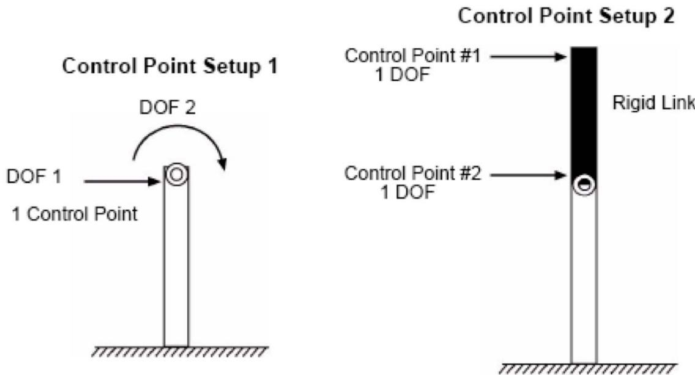
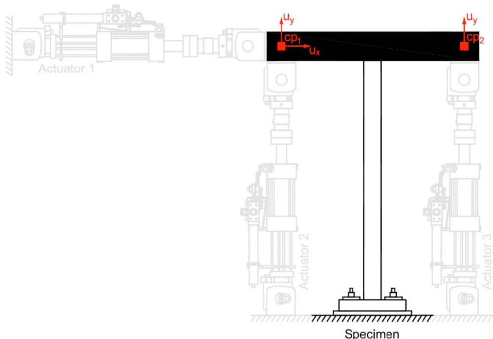

#  expControlPoint 命令

此命令用于构造 expControlPoint 对象。当使用控制点进行测试时，使用 expControlPoint 命令。例如，使用 LabVIEW 实验控制命令时需要控制点。由于 MTS MiniMost 由 LabVIEW 控制，无法设置安全限制，因此使用 expControlPoint 命令来设置此类限制。

## 命令

```tcl
expControlPoint $tag <-node $nodeTag> dof resp <-fact $f> <-lim $l $u> <-relTrial> <-relOut> <-relCtrl> <-relDaq>
```

| 参数 | 说明 |
|:----|:-----|
| $tag | 唯一控制点标签 |
| $nodeTag | 唯一节点标签 |
| dof | 响应量的方向。2d："1" = X 轴方向、"2" = Y 轴方向，"3" = Z 轴方向的旋转。3d："1" = X 轴方向、"2" = Y 轴方向、"3" = Z 轴方向、"4" = X 轴方向的旋转、"5" = Y 轴方向的旋转、"6" = Z 轴方向的旋转 (旧版命令使用的是dir:"ux"，"uy"，"uz"，"rx"，"ry"，"rz"，现在已经废弃)|
| resp | 响应量；输入参数为：disp = 位移、vel = 速度、accel = 加速度、force = 力、time = 时间 |
| $f | 应用于响应量的因子（可选） |
| $l | 下限（可选） |
| $u | 上限（可选） |

<注意:dof和resp必须输入字符串，尤其在python版本中，使用"1" 和"disp"。

控制点表示用于向控制器发送命令信号或从数据采集系统获取反馈信号的一个或多个方向（自由度）的逻辑容器。控制点表示输出控制通道或输入数据采集通道的逻辑分组。要定义测试配置的控制和数据采集轴，使用 expControlPoint 对象的方向（dir）属性。每个方向（自由度）与控制通道和响应量相关联。控制点集和控制点内的方向集定义了使用控制点的 expControl 对象的控制轴及其预期顺序。

类似地，控制点集和控制点内的方向集定义了从 expControl 对象接收的反馈轴及其预期顺序。此外，expControlPoint 命令允许为每个响应量定义缩放因子以及下限和上限。可选的缩放因子可用于在不同单位之间转换和/或考虑相似定律。最后，如果控制系统中无法设置安全限制，则可以调用可选的限制。

## 示例
```tcl
# Define geometry for model
# _____________
set mass3 0.04
set mass4 0.02
# node $tag $xCrd $yCrd $mass
node 1 0.0 0.00
node 2 100.0 0.00
node 3 0.0 54.00 -mass $mass3 $mass3
node 4 100.0 54.00 -mass $mass4 $mass4
# Define experimental control points
# _____________
expControlPoint 1 1 ux disp -fact 0.003 -lim -0.01 0.01
expControlPoint 2 1 ux disp -fact 0.003 ux force -fact [expr 18.0/7.0]
# Define experimental control
# _____________
expControl LabVIEW 1 "130.126.242.175" 44000 -trialCP 1 -outCP 2 
```

此示例使用节点 1 作为实验控制点。第一个控制点将 x 方向的位移乘以 0.003，并将下限设置为 -0.01，上限设置为 0.01。第二个控制点将 x 方向的位移乘以 0.002，将 x 方向的力乘以 [expr 18.0/7.0] = 2.57。第一个控制点用于 LabVIEW 试命令（位移），第二个用于 LabVIEW 输出反馈（测量位移和力）。

以下是代表相同物理系统的两个控制点设置。在设置 1 中，单个控制点有两个方向（自由度），每个方向将映射到平移或旋转控制通道。控制系统必须正确转换控制通道以匹配物理测试装置（使用 NoTransformation 实验装置）。设置 2 从适当的 expSetup 对象接收正确转换的响应量，因此每个具有单个方向（自由度）的控制点直接映射到简单的控制通道。

<figure>
  
  <figcaption>图 31：两种根本不同的控制点设置（由 MTS 提供）</figcaption>
</figure>

<figure>
  
  <figcaption>图 32：具有两个控制点的示例</figcaption>
</figure>