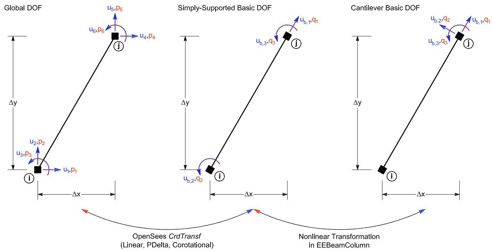
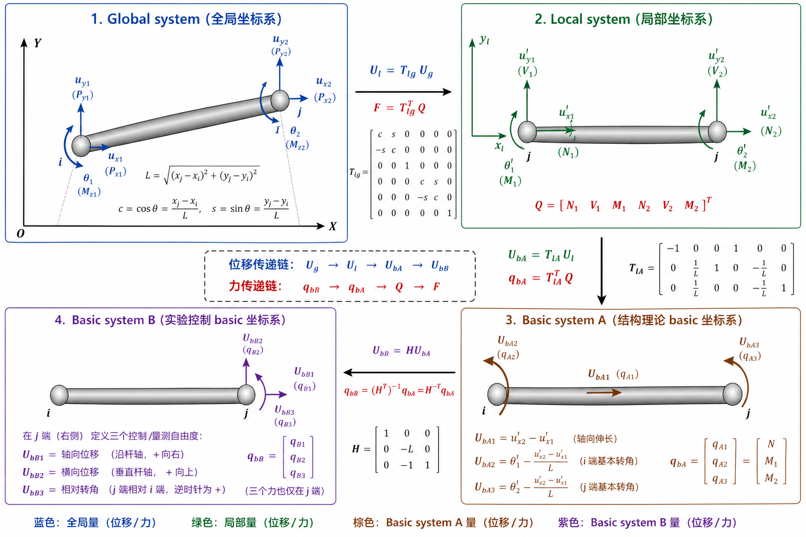

# 梁柱单元坐标体系及变换关系
## 2D 梁柱单元坐标体系及变换关系
### 问题描述

在二维梁柱单元中，通常涉及四类坐标或自由度体系：

1. Global system，全局坐标系；
2. Local system，单元局部坐标系；
3. Basic system A，结构理论 basic 坐标系（即 OpenSees 里面的basic坐标系 ）；
4. Basic system B，实验控制 basic 坐标系（OpenFresco 独有）。

其中，Global system 用于结构整体平衡方程，Local system 用于描述构件轴向和横向方向，Basic system A 用于 OpenSees 中梁柱单元的理论基本自由度（即 OpenSees 里面的basic坐标系），Basic system B 用于 OpenFresco 实验单元的控制与量测自由度(在这里就是悬臂柱单元)。

本文整理 2D 梁柱单元中 Global、Local、Basic system A 和 Basic system B 之间的位移、力和刚度变换关系。

- 在程序中，Global、Local、Basic system A之间的转换由 geomTransf Linear、PDelta和Corotational完成。

- Basic system A 和 Basic system B 之间的转换由 expElement beamColumn （即源码OpenFresco/SRC/experimentalElement
/EEBeamColumn2d.cpp ）完成，这里的转换只说明了linear转换，非线性转换参考源代码。

### 符号定义

#### 位移向量

全局位移向量定义为

$$
\mathbf U_g=
[x_1,y_1,rz_1,x_2,y_2,rz_2]^T
$$

局部位移向量定义为

$$
\mathbf U_l=
[x_1^l,y_1^l,rz_1^l,x_2^l,y_2^l,rz_2^l]^T
$$

Basic system A 位移向量定义为

$$
\mathbf U_{A}=[eps,theta_1,theta_2]^T=
[\epsilon,\theta_1,\theta_2]^T
$$

$$\epsilon=\text{轴向伸长},
\theta_{1}=\text{i端基本转角},\theta_{2}=\text{j端基本转角}$$

Basic system B 位移向量定义为

$$
\mathbf U_{B}=
[d_{b1},d_{b2},d_{b3}]^T
$$

$$
d_{b1}=\text{轴向位移},d_{b2}=\text{横向位移},d_{b3}=\text{相对转角}
$$

#### 力向量

全局力向量定义为

$$
\mathbf P=
[P_{x1},P_{y1},M_{z1},P_{x2},P_{y2},M_{z2}]^T
$$

局部力向量定义为

$$
\mathbf Q=
[N_1,V_1,M_1,N_2,V_2,M_2]^T
$$

Basic system A 力向量定义为

$$
\mathbf q_{A}=
[N_{a},M_{a1},M_{a2}]^T
$$

Basic system B 力向量定义为

$$
\mathbf q_{B}=
[q_{b1},q_{b2},q_{b3}]^T
$$

#### 局部坐标系与方向余弦

对于二维梁柱单元，局部 $x$ 轴沿构件节点 $i \rightarrow j$ 方向。设节点 $i$ 和节点 $j$ 的全局坐标分别为 $(x_i,y_i)$ 和 $(x_j,y_j)$，则单元长度为

$$
L=\sqrt{(x_j-x_i)^2+(y_j-y_i)^2}
$$

局部 $x$ 轴相对于全局坐标系的方向余弦为

$$
c=\cos\theta=\frac{x_j-x_i}{L}
$$

$$
s=\sin\theta=\frac{y_j-y_i}{L}
$$

其中，$c$ 和 $s$ 分别为局部 $x$ 轴在全局 $x$ 和 $y$ 方向上的投影。

<!--  -->

### 位移变换

#### Global 到 Local 的位移变换

Global 到 Local 的位移变换为

$$
\mathbf U_l=\mathbf T_{lg}\mathbf U_g
$$

其中，$\mathbf T_{lg}$ 为 Global 到 Local 的坐标变换矩阵：

$$
\mathbf T_{lg}=
\begin{bmatrix}
c&s&0&0&0&0\\
-s&c&0&0&0&0\\
0&0&1&0&0&0\\
0&0&0&c&s&0\\
0&0&0&-s&c&0\\
0&0&0&0&0&1
\end{bmatrix}
$$

因此有

$$
\begin{aligned}
x_1^l &= c x_1+s y_1 \\
y_1^l &= -s x_1+c y_1 \\
rz_1^l &= rz_1 \\
x_2^l &= c x_2+s y_2 \\
y_2^l &= -s x_2+c y_2 \\
rz_2^l &= rz_2
\end{aligned}
$$

#### Local system 到 Basic system A 的转换

矩阵形式为：

$$
\mathbf{U}_{A}=\mathbf{T}_{Al}\mathbf{U}_l
$$

其中：

$$
\mathbf{T}_{lA}=
\begin{bmatrix}
-1&0&0&1&0&0\\
0&1/L&1&0&-1/L&0\\
0&1/L&0&0&-1/L&1
\end{bmatrix}
$$

$$
\epsilon=x_2^l-x_1^l
$$

$$
\theta_1=rx_1^l-\frac{x_2^l-x_1^l}{L}
$$

$$
\theta_2=rx_2^l-\frac{x_2^l-x_1^l}{L}
$$

#### Global 到 Basic system A 的位移变换

将局部位移代入全局位移，可得

$$
\mathbf U_{A}=\mathbf T_Ag\mathbf U_g
$$

其中

$$
\mathbf T_Ag=
\begin{bmatrix}
-c&-s&0&c&s&0\\
-\frac{s}{L}&\frac{c}{L}&1&\frac{s}{L}&-\frac{c}{L}&0\\
-\frac{s}{L}&\frac{c}{L}&0&\frac{s}{L}&-\frac{c}{L}&1
\end{bmatrix}
$$

即

$$
\begin{aligned}
\epsilon
&=-c x_1-s y_1+c x_2+s y_2 \\
\theta_1
&=-\frac{s}{L}x_1+\frac{c}{L}y_1+rz_1
+\frac{s}{L}x_2-\frac{c}{L}y_2 \\
\theta_2
&=-\frac{s}{L}x_1+\frac{c}{L}y_1
+\frac{s}{L}x_2-\frac{c}{L}y_2+rz_2
\end{aligned}
$$

#### Basic system A 到 Basic system B 的位移变换

Basic system B 是实验控制 basic 坐标系（这里就是悬臂柱）。对于 Linear 或 PDelta 几何变换，其与 Basic system A 的关系为

$$
\mathbf U_{B}=\mathbf T_{BA}\mathbf U_{A}
$$

其中

$$
\mathbf T_{BA}=
\begin{bmatrix}
1&0&0\\
0&-L&0\\
0&-1&1
\end{bmatrix}
$$

展开为

$$
d_{b1}=\epsilon
$$

$$
d_{b2}=-L \theta_1
$$

$$
d_{b3}=-\theta_1+\theta_2
$$

因此，Global 到 Basic system B 的总位移变换为

$$
\mathbf U_{B}=\mathbf T_{BA}\mathbf T_{Ag}\mathbf U_g
$$

---

### 力变换
#### Basic system B 到 Basic system A 的力变换

根据虚功一致性，有

$$
\mathbf q_{A}^T\mathbf U_{A}
=
\mathbf q_{B}^T\mathbf U_{B}
$$

又因为

$$
\mathbf U_{B}=\mathbf T_{BA}\mathbf U_{A}
$$

所以

$$
\mathbf q_{A}^T\mathbf U_{A}
=
\mathbf q_{B}^T\mathbf T_{BA}\mathbf U_{A}
=
(\mathbf T_{BA}^T\mathbf q_{B})^T\mathbf U_{A}
$$

因此

$$
\mathbf q_{A}=\mathbf T_{BA}^T\mathbf q_{B}
$$

其中

$$
\mathbf T_{BA}^T=
\begin{bmatrix}
1&0&0\\
0&-L&-1\\
0&0&1
\end{bmatrix}
$$

即

$$
\begin{aligned}
N_{a} &= q_{b1} \\
M_{a1} &= -Lq_{b2}-q_{b3} \\
M_{a3} &= q_{b3}
\end{aligned}
$$

#### Basic system A 到 Local 的力变换

Basic system A 的力向量可写为

$$
\mathbf q_{A}=
[N_a,M_{a1},M_{a2}]^T
$$

其中，$N_a$ 为轴力，$M_{a1}$ 和 $M_{a2}$ 分别为两端弯矩。

由梁端力平衡，局部剪力为

$$
V=\frac{M_{a1}+M_{a2}}{L}
$$

因此，局部力向量为

$$
\begin{aligned}
N_1 &= -N_a \\
V_1 &= V=\frac{M_{a1}+M_{a2}}{L} \\
M_1 &= M_{a1} \\
N_2 &= N_a \\
V_2 &= -V=-\frac{M_{a1}+M_{a2}}{L} \\
M_2 &= M_{a2}
\end{aligned}
$$
即矩阵形式：
$$
Q=T_{Al}^T q_{A}
$$

#### Local 到 Global 的力变换

Local 到 Global 的力变换为

$$
\mathbf F=\mathbf T_{lg}^T\mathbf Q
$$

其中

$$
\mathbf F=
[P_{x1},P_{y1},M_{z1},P_{x2},P_{y2},M_{z2}]^T
$$

展开为

$$
\begin{aligned}
P_{x1} &= cN_1-sV_1 \\
P_{y1} &= sN_1+cV_1 \\
M_{z1} &= M_1 \\
P_{x2} &= cN_2-sV_2 \\
P_{y2} &= sN_2+cV_2 \\
M_{z2} &= M_2
\end{aligned}
$$

因此，力的完整传递链条为

$$
\mathbf q_{B}
\rightarrow
\mathbf q_{A}
\rightarrow
\mathbf Q
\rightarrow
\mathbf F
$$

可写为

$$
\mathbf F=\mathbf T_{lg}^T\mathbf Q=\mathbf T_{lg}^T\mathbf T_{Ag}^T\mathbf q_{B})
$$

### 刚度转换 
#### Basic system B 到 Basic system A 的刚度转换

${K}_B$就是该单元输入的初始矩阵。
若：

$$
\mathbf{q}_B=\mathbf{K}_B\mathbf{U}_B
$$

则：

$$
\mathbf{K}_A=\mathbf{T}_{BA}^T\mathbf{K}_B\mathbf{T}_{BA}
$$

代码中对应展开为：

$$
K_{A11}=K_{B11}
$$

$$
K_{A22}=L^2K_{B22}+L(K_{B23}+K_{B32})+K_{B33}
$$

$$
K_{A23}=-LK_{B23}-K_{B33}
$$

$$
K_{A32}=-LK_{B32}-K_{B33}
$$

$$
K_{A33}=K_{B33}
$$

其余耦合项在该实现中未展开，主要保留轴向项和弯曲控制项。

### 物理含义总结

Global system 用于整体结构方程组的组装和平衡；Local system 用于描述构件沿自身轴线方向和横向方向的力学行为；Basic system A 是梁柱单元理论分析中的最小自由度体系，主要描述轴向变形和两端弯曲转角；Basic system B 是实验单元中用于控制和量测的自由度体系。

其中，$\mathbf T_{lg}$ 描述 Global 与 Local 之间的坐标旋转关系，$\mathbf T_{Al}$ 描述 Local  与 Basic system A 之间的几何关系，$\mathbf T_{Ag}$ 描述 Global  与 Basic system A 之间的几何关系，这部分转换在geomTransf Linear、PDelta和Corotational中完成。

$\mathbf T_{BA}$ 描述 Basic system A 与 Basic system B 之间的实验接口映射关系。

最终，2D 梁柱实验单元的核心变换关系可概括为

- 位移变换链条

$$
\mathbf U_g
\rightarrow
\mathbf U_l
\rightarrow
\mathbf U_{A}
\rightarrow
\mathbf U_{B}
$$

​		核心表达式为

$$
\mathbf U_{B}=\mathbf T_{BA}\mathbf T_{Ag}\mathbf U_g
$$

- 力变换链条

$$
\mathbf q_{bB}
\rightarrow
\mathbf q_{bA}
\rightarrow
\mathbf Q
\rightarrow
\mathbf F
$$

​		核心表达式为

$$
\mathbf F=\mathbf T_{lg}^T\mathbf Q=\mathbf T_{lg}^T\mathbf T_{Ag}^T\mathbf q_{B})
$$

## 3D 梁柱单元坐标体系及变换关系

### 问题描述

在三维梁柱单元中，涉及四类坐标或自由度体系：

1. Global system，全局坐标系；
2. Local system，单元局部坐标系；
3. Basic system A，OpenSees 结构理论 basic 坐标系；
4. Basic system B，OpenFresco 实验控制 basic 坐标系。

其中，Global、Local 和 Basic system A 之间的转换由 `LinearCrdTransf3d` 完成；Basic system A 与 Basic system B 之间的实验接口转换由 `EEBeamColumn3d` 完成。

---

### 符号定义

#### 位移向量

全局位移向量：三维梁柱单元每个节点有 6 个自由度：

$$
\mathbf U_g =
[x_1,y_1,z_1,rx_1,ry_1,rz_1,
x_2,y_2,z_2,rx_2,ry_2,rz_2]^T
$$

局部坐标系下位移向量为

$$
\mathbf U_l =
[x_1^l,y_1^l,z_1^l,rx_1^l,ry_1^l,rz_1^l,
x_2^l,y_2^l,z_2^l,rx_2^l,ry_2^l,rz_2^l]^T
$$

Basic system A 位移向量：根据 `LinearCrdTransf3d::getBasicTrialDisp()`，OpenSees 3D basic deformation 为

$$
\mathbf U_A =
[\epsilon,\theta_{z1},\theta_{z2},\theta_{y1},\theta_{y2},\phi_x]^T
$$

其中

$$
\epsilon=\text{轴向伸长}
$$

$$
\theta_{z1},\theta_{z2}=\text{绕局部 }z\text{ 轴弯曲对应的两端 basic 转角}
$$

$$
\theta_{y1},\theta_{y2}=\text{绕局部 }y\text{ 轴弯曲对应的两端 basic 转角}
$$

$$
\phi_x=\text{绕局部 }x\text{ 轴的相对扭转角}
$$

Basic system B 位移向量：OpenFresco 3D 实验 basic 坐标系为

$$
\mathbf U_B =
[d_{b1},d_{b2},d_{b3},d_{b4},d_{b5},d_{b6}]^T
$$

其中可理解为

$$
d_{b1}=\text{轴向位移}
$$

$$
d_{b2}=\text{局部 }y\text{ 向端部控制位移}
$$

$$
d_{b3}=\text{局部 }z\text{ 向弯曲相对转角}
$$

$$
d_{b4}=\text{局部 }z\text{ 向端部控制位移}
$$

$$
d_{b5}=\text{局部 }y\text{ 向弯曲相对转角}
$$

$$
d_{b6}=\text{绕局部 }x\text{ 轴扭转角}
$$

#### 力向量

全局力向量定义为

$$
\mathbf P=
[P_{x1},P_{y1},P_{z1},M_{x1},M_{y1},M_{z1},P_{x2},P_{y2},P_{z2},M_{x2},M_{y2},M_{z2}]^T
$$

局部力向量定义为

$$
\mathbf Q=
[N_1,V_{y1},V_{z1},T_1,M_{y1},M_{y1},N_2,V_{y2},V_{z2},T_2,M_{y2},M_{y2},]^T
$$

Basic system A 力向量定义为

$$
\mathbf q_{A}=
[N_{a},M_{az1},M_{az2},M_{ay1},M_{ay2},T_{a}]^T
$$

Basic system B 力向量定义为

$$
\mathbf q_{B}=
[q_{b1},q_{b2},q_{b3},q_{b4},q_{b5},q_{b6}]^T
$$

#### 局部坐标系定义

对于3维梁柱单元，局部 $x$ 轴沿构件节点 $i \rightarrow j$ 方向。设节点 $i$ 和节点 $j$ 的全局坐标分别为 $(x_i,y_i,z_i)$ 和 $(x_j,y_j,z_j)$

单元长度为

$$
L=\|\mathbf X_j-\mathbf X_i\|
$$

局部 $x$ 轴为

$$
\mathbf e_x =
\frac{\mathbf X_j-\mathbf X_i}{L}
$$

在 `LinearCrdTransf3d` 中，用户输入的 `vecInLocXZPlane` 用于确定局部 $xz$ 平面。设该向量为

$$
\mathbf v
$$

则局部 $y$ 轴由

$$
\mathbf e_y =
\frac{\mathbf v \times \mathbf e_x}
{\|\mathbf v \times \mathbf e_x\|}
$$

局部 $z$ 轴由

$$
\mathbf e_z =
\mathbf e_x \times \mathbf e_y
$$

因此方向余弦矩阵为

$$
\mathbf R =
\begin{bmatrix}
\mathbf e_x^T\\
\mathbf e_y^T\\
\mathbf e_z^T
\end{bmatrix}
=
\begin{bmatrix}
R_{00}&R_{01}&R_{02}\\
R_{10}&R_{11}&R_{12}\\
R_{20}&R_{21}&R_{22}
\end{bmatrix}
$$

---

### 位移变换

#### Global system 到 Local system

三维局部位移由全局位移旋转得到：

$$
\mathbf U_l=\mathbf T_{lg}\mathbf U_g
$$

其中

$$
\mathbf T_{lg}=
\begin{bmatrix}
\mathbf R&0&0&0\\
0&\mathbf R&0&0\\
0&0&\mathbf R&0\\
0&0&0&\mathbf R
\end{bmatrix}
$$

即

$$
\begin{aligned}
\mathbf u_1^l &= \mathbf R \mathbf u_1^g\\
\boldsymbol\theta_1^l &= \mathbf R \boldsymbol\theta_1^g\\
\mathbf u_2^l &= \mathbf R \mathbf u_2^g\\
\boldsymbol\theta_2^l &= \mathbf R \boldsymbol\theta_2^g
\end{aligned}
$$

---

#### Local system 到 Basic system A

根据 `LinearCrdTransf3d::getBasicTrialDisp()`，3D basic deformation 为

$$
\mathbf U_A=\mathbf T_{Al}\mathbf U_l
$$

展开为

$$
\epsilon=x_2^l-x_1^l
$$

$$
\theta_{z1}=rz_1^l+\frac{y_1^l-y_2^l}{L}
$$

$$
\theta_{z2}=rz_2^l+\frac{y_1^l-y_2^l}{L}
$$

$$
\theta_{y1}=ry_1^l+\frac{z_2^l-z_1^l}{L}
$$

$$
\theta_{y2}=ry_2^l+\frac{z_2^l-z_1^l}{L}
$$

$$
\phi_x=rx_2^l-rx_1^l
$$

矩阵形式为

$$
\mathbf T_{Al}=
\begin{bmatrix}
-1&0&0&0&0&0&1&0&0&0&0&0\\
0&1/L&0&0&0&1&0&-1/L&0&0&0&0\\
0&1/L&0&0&0&0&0&-1/L&0&0&0&1\\
0&0&-1/L&0&1&0&0&0&1/L&0&0&0\\
0&0&-1/L&0&0&0&0&0&1/L&0&1&0\\
0&0&0&-1&0&0&0&0&0&1&0&0
\end{bmatrix}
$$

---

#### Basic system A 到 Basic system B

对于 `EEBeamColumn3d` 中的 Linear 或 PDelta 情况，Basic system A 到 Basic system B 的位移变换为

$$
\mathbf U_B=\mathbf T_{BA}\mathbf U_A
$$

其中

$$
\mathbf T_{BA}=
\begin{bmatrix}
1&0&0&0&0&0\\
0&-L&0&0&0&0\\
0&-1&1&0&0&0\\
0&0&0&L&0&0\\
0&0&0&-1&1&0\\
0&0&0&0&0&1
\end{bmatrix}
$$

展开为

$$
d_{b1}=\epsilon
$$

$$
d_{b2}=-L\theta_{z1}
$$

$$
d_{b3}=-\theta_{z1}+\theta_{z2}
$$

$$
d_{b4}=L\theta_{y1}
$$

$$
d_{b5}=-\theta_{y1}+\theta_{y2}
$$

$$
d_{b6}=\phi_x
$$

因此，Global 到 Basic system B 的完整位移变换为

$$
\mathbf U_B
=
\mathbf T_{BA}\mathbf T_{Al}\mathbf T_{lg}\mathbf U_g
$$
