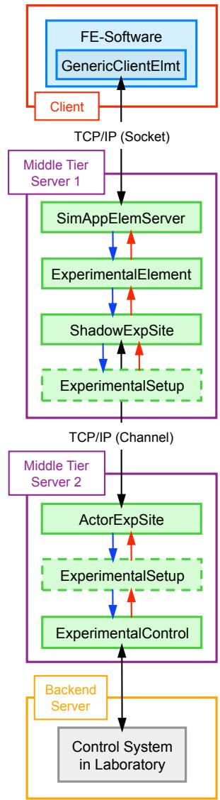
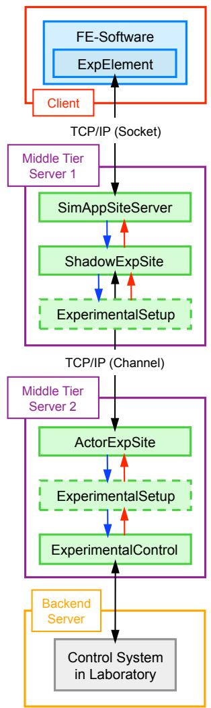

# expElement 简介
这些命令用于构建实验单元对象。OpenFresco 提供了两种定义实验单元的方式。第一种也是更常用的方式是在中间层服务器端定义实验单元，并在有限元软件中使用通用客户端单元，如图6a所示。对于所有实验单元命令，此方法以黄色高亮显示。第二种选择是直接在有限元软件中定义实验单元，因此不在中间层服务器端使用任何单元，如图6b所示。具体来说，如果使用 OpenSees 作为有限元软件，可以使用灰色高亮的命令。其他有限元分析软件也可以使用此选项。每个单元都可以使用记录器命令来捕获仿真过程中的响应量。

图:在有限元软件中定义的通用客户端单元（左）和实验单元（右）

- beamColumn (2D or 3D) Experimental Element
- generic (1D, 2D, or 3D) Experimental Element
- invertedVBrace (2D) Experimental Element
- truss (1D, 2D, or 3D) Experimental Element
- corotTruss (1D, 2D, or 3D) Experimental Element
- twoNodeLink (1D, 2D, or 3D) Experimental Element
- bearing Experimental Element
