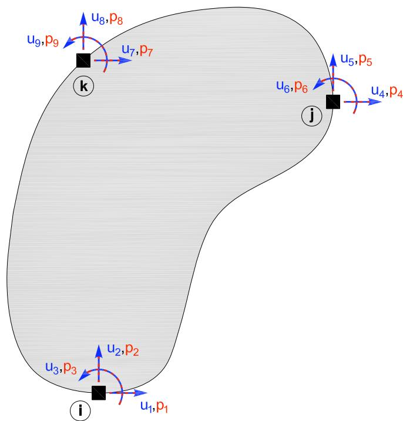
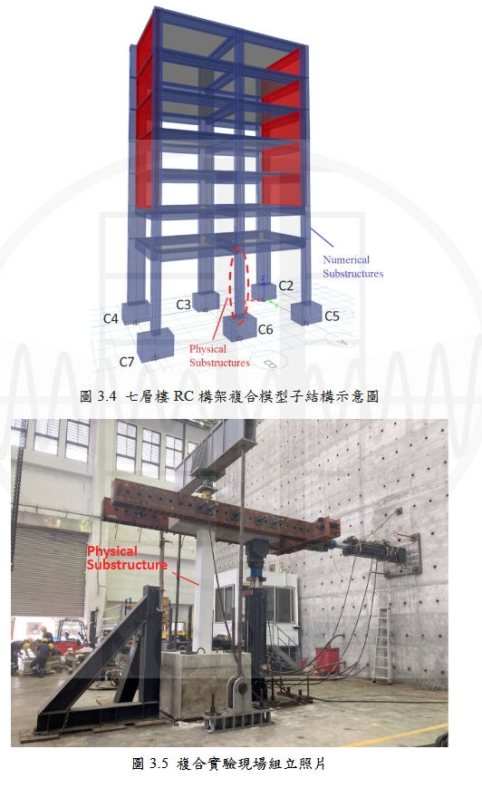
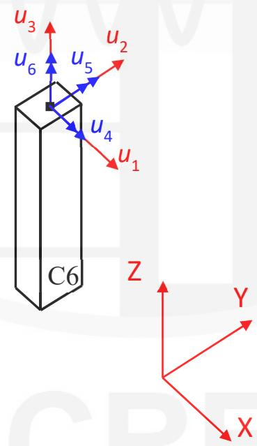
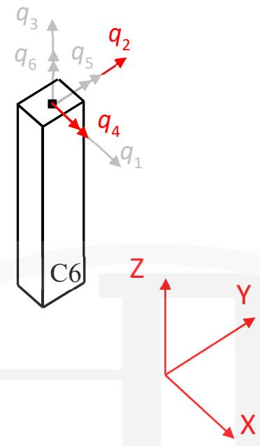

# generic 实验单元
## 命令
构建通用实验单元，支持任意节点数与自由度。这个单元不进行任何

**site模式**
```tcl
expElement generic eleTag -node Ndi -dof dofNdi -dof dofNdj ... -site siteTag -initStif Kij <-iMod> <-noRayleigh> <-mass Mij> <-checkTime>
```

**server模式**
```tcl
expElement generic eleTag -node Ndi -dof dofNdi -dof dofNdj ... -server ipPort <ipAddr> <-ssl> <-udp> <-dataSize size> -initStif Kij <-iMod> <-noRayleigh> <-mass Mij> <-checkTime>
```

| 参数 | 说明 |
|:--- |:--- |
| $eleTag | 唯一单元标签 |
| $Ndi | 端节点标签 |
| $dofNdi,$dofNdj | 节点自由度 |
| $siteTag | 站点标签 |
| $Kij | 初始刚度矩阵（按行） |
| -iMod | Nakashima修正（可选） |
| -noRayleigh | 关闭瑞雷阻尼（可选） |
| $Mij | 质量矩阵（可选） |
| 其余 | 同beamColumn |

## 示例
```tcl
# 定义模型几何
set mass3 0.04
set mass4 0.02
# node $tag $xCrd $yCrd $mass
node 1 0.0 0.00
node 2 100.0 0.00
node 3 0.0 54.00 -mass $mass3 $mass3
node 4 100.0 54.00 -mass $mass4 $mass4
# 定义实验站点
expSite LocalSite 2 2 
# 定义实验单元
expElement generic 1 -node 1 3 -dof 1 2 -dof 1 2 -site 2 -initStif 130 150 110 100 150 220 180 100 110 180 150 125 100 100 125 200
```

初始刚度矩阵：
$
\mathbf{K}_{i} = \left[ \begin{array}{cccc}
130 &150 &110 &100\\   
150 &220 &180 &100 \\  
110 &180 &150 &125\\   
100 &100 &125 &200 \\
\end{array} \right]
$



## 记录Recorder
- 全局力：force, forces, globalForce, globalForces
- 局部力：localForce, localForces
- 基本力：basicForce, basicForces, daqForce, daqForces
- 控制位移/速度/加速度
- 数据采集位移/速度/加速度


## 完整示例(2025)
>这里仅用了一个节点作为generic的单元，可以查看台湾2023的案例是两个节点作为generic单元。



**4.2 OpenFresco 物理子结构环境之建立**

图3.6为本文七层楼 RC结构之OpenFresco复合实验架构图，图中作为中介软件之 OpenFresco 透过四个阶段建立数值子结构与物理子结构间沟通之环境，分别为：实验元素(Experimental Element)、实验场域(ExperimentalSite)、实验组立(Experimental Setup)及实验控制系统(Experimental Control)。

另外亦须设定实验控制点(control point)以便设定输出指令及回授反应之讯号，而于脚本中之设定顺序为逆向设定，亦即依序设定实验控制点、实验控制系统、实验组立、实验场域及实验元素。

**(1) 实验控制点(expControlPoint)**

指令：expControlPoint $cpTag $rspType

此指令设定实验控制点之指令及回授讯号，共两个控制点，于$cpTag 中设定实验控制点之编号，并于$rspType 中设定物理量及其编号，位移讯号表示为 disp，速度讯号表示为 vel，加速度讯号表示为 accel，力讯号表示为force，时间讯号表示为 time。而本章实验为位移控制，输出大柱及小柱之位移命力，并回授真实频道及虚拟频道之位移及力讯号，验控制点(编号 1)及回授实验控制点(编号 2)设定如下

```tcl
# Define experimental control(s)  
# ExpControlPoint "cmd": cpTag <-node nodeTag> dof rspType <-fact f<-lim 1 u<-isRel> 
expControlPoint 1 disp 2 disp 
# ExpControlPoint "fdk": cpTag rspType
expControlPoint 2 1 disp 2 disp 1 force 2 force 
```

**(2) 实验控制系统(expControl)**

指令：expControl MTSCsi $tag $cfgFileName $rampTime -trialcp $trialcp - outcp $outcp

根据第 2 章所述，OpenFresco 可连接数种不同之实验控制系统，而本文实验架构为使用 MTS CSIC 作为其控制系统，此指令即进行相关设定。其中，于\$tag 中设定实验控制系统之编号，\$cfgFileName 则是根据 MTS CSIC之设定档存放路径进行设定，其中需注意由电脑档案总管所复制之路径以「\」作为资料夹之区分符号，而于此指令之设定须将其改为 「/」 方可正确执行。于\$rampTime 中设定ramptime 参数，该参数决定致动器作动之速率，依照试体或模型种类之差异有适合之 ramptime 参数， \$trialcp 及 \$outcp 则是设定前一步骤设定完成之实验控制点及回授实验控制点编号。本章之设定如下

```tcl
expControl MTSCsi 1 "C:/Users/Administrator/Desktop/seven/six/sevenstoryone.mtscs" 1 -trialCP 1 -outCP 2 
```

**(3) 实验组立(expSetup)**

指令：expSetup NoTransformation \$setupTag <-control \$ctrlTag> -dir \$dirs -sizeTrialOut \$trialSize \$outSize -outForceFact \$ outForceFacts

配合本文复合实验所使用之泛用型实验元素(generic ExpElement)，**实验组立采用不进行坐标转换之 NoTransformation 实验组立**，于\$setupTag 设定实验组立之编号，\$ctrlTag 则是设定前一步骤建立之实验控制系统编号，而\$dirs 设定欲输出指令及读入回授讯号之实验元素自由度，本文控制二维一楼 C6 小柱之水平方向及旋转向自由度，亦即 Generic 实验元素的 2 号及 4号自由度，\$trialSize及\$outSize设定输出及读入之矩阵大小。本小节之设定如下

```tcl
# Define experimental setup(s)  
# ExpSetup "ExpSetup01": setupTag <-control ctrlTag> -dir dirs -sizeTrialOut to <factors>  
expSetup NoTransformation 1 -control 1 -dir 2 4 -sizeTrialOut 6 6 -outForceFact 1 1 1 1 1 1
```

**(4) 实验场域(expSite)**

指令：expSite LocalSite $siteTag $setupTag

本文复合实验之数值分析软件与实验场为于在同一处，为同一区域连线，因此使用 LocalSite 指令，于$siteTag 设定实验场域之编号，并于$setupTag中设定前一步骤设定之实验组立编号。本章之设定如下

```tcl
# Define experimental site(s) 
# ExpSite "ExpSite01": siteTag setupTag
expSite LocalSite 1 1 
```

**(5) 实验元素(expElement)**

指 令 ： expElement generic $tag –node $Ndi… – dof $dofNdi… –dof$dofNdj…–site $siteTag –initStif $Kij …

本文使用 OpenFresco 实验元素之泛用型实验元素(generic ExpElement)进行复合实验，该实验元素即代表物理子结构部分，于本章即代表一楼之C6小柱。于$tag 中设定实验元素之编号， $\$ 123$ 中设定物理子结构柱之柱顶节点编号，本文之物理子结构柱顶节点为节点 21，$dofNdi 则设定该节点以Generic元素建立之自由度方向，各节点皆须设定欲建立之自由度方向，而$siteTag则是设定前一步骤设定之实验场域编号，最后于$Kij中设定Generic元素之初始劲度矩阵，三维单柱初始劲度矩阵公式如下
>台湾原本公式有误,多了负号，但是后面算的initStif是对的

$$
\mathbf {K} _ {\mathrm {i}} = \left[ \begin{array}{c c c c c c} \frac {12 \mathrm {E I} _ {z}}{\mathrm {L} ^ {3}} & 0 & 0 & 0 & - \frac {6 \mathrm {E I} _ {z}}{\mathrm {L} ^ {2}} & 0 \\
 0 & \frac {12 \mathrm {E I} _ {y}}{\mathrm {L} ^ {3}} & 0 & \frac {6 \mathrm {E I} _ {y}}{\mathrm {L} ^ {2}} & 0 & 0 \\0 & 0 & \frac {\mathrm {E A}}{\mathrm {L}} & 0 & 0 & 0 \\0 &  \frac {6 \mathrm {E I} _ {y}}{\mathrm {L} ^ {2}} & 0 & \frac {4 \mathrm {E I} _ {y}}{\mathrm {L}} & 0 & 0 \\- \frac {6 \mathrm {E I} _ {z}}{\mathrm {L} ^ {2}} & 0 & 0 & 0 & \frac {4 \mathrm {E I} _ {\mathrm {z}}}{\mathrm {L}} & 0 \\0 & 0 & 0 & 0 & 0 & \frac {\mathrm {G J}}{\mathrm {L}} \end{array} \right] 
% \tag {4.1}
\text{(4.1)}
$$

图 4.6 为本实验之 Generic 元素示意图，于三维模型中将 C6 小柱以Generic 建立包含 1 个节点及 6 个自由度之实验元素。由于 Generic 实验元素之控制及回授自由度已建立在全域坐标系中，OpenFresco EEGeneric class将不再进行坐标转换，图4.7为 Generic 元素力回授示意图，红色及灰色表示物理及数值子结构自由度。

  
图 4.4 Generic 元素示意图

 
  
(红色及灰色表示物理及数值子结构自由度)
图 4.5 Generic 元素力回授示意图 

(4.1)式表示三维单柱物理子结构之 Generic 初始进度矩阵。依照上述内容，

本小节之实验元素设定如下
```tcl
# Define experimental element

# expElement generic $eleTag -node $Ndi -dof $dofNdi -dof $dofNdj ... -server $ipPort <$ipAddr> <-ssl> <-dataSize $size>

expElement generic 1000 -node 21 -dof 1 2 3 4 5 6 -site 1\

-initStif\

968650.1083 0 0 0 -1452975.162 0 \

0 968650.1083 0 1452975.162 0 0 \

0 0 645766738.9 0 0 0 \

0 1452975.162 0 2905950.325 0 0 \

-1452975.162 0 0 0 2905950.325 0 \

0 0 0 0 0 3410455.59
```


## 参考
[1] 郑弘, 于允文. OpenFresco开放式实验架构在多自由度混合实验中的应用. 中国台湾: 国家地震工程研究中心（台湾）; 2025.

