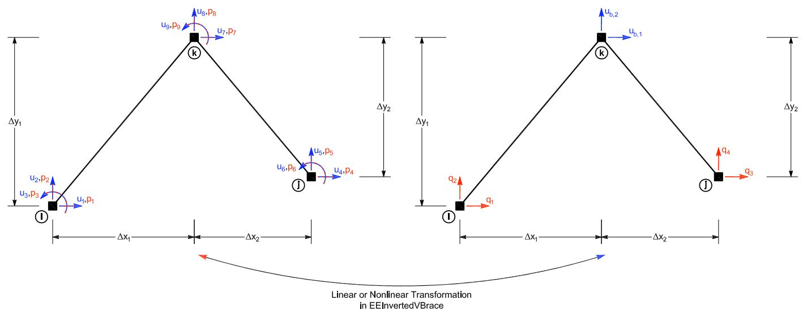

# invertedVBrace 倒V型支撑（二维）实验单元
## 命令
此命令用于构建倒V型支撑实验单元对象。该单元由三个节点定义。

**generic（site）**
```tcl
expElement invertedVBrace eleTag iNode jNode kNode -site siteTag -initStif Kij <-iMod> <-nlGeom> <-noRayleigh> <-rho1 rho1> <-rho2 rho2>
```

**generic（server）**
```tcl
expElement invertedVBrace eleTag iNode jNode kNode -server ipPort <ipAddr> <-ssl> <-udp> <-dataSize size> -initStif Kij <-iMod> <-nlGeom> <-noRayleigh> <-rho1 rho1> <-rho2 rho2>
```

| 参数 | 说明 |
|:--- |:--- |
| $eleTag | 唯一单元标签 |
| $iNode, $jNode $kNode | 根据图7所示构型的端节点标签 |
| $siteTag | 先前定义的站点对象的标签 |
| $Kij | 单元的初始刚度矩阵分量（按行排列） |
| -iMod | 使用Nakashima初始刚度修正法进行误差校正（可选，默认值为false） |
| -nlGeom | 非线性几何（可选，默认值为false） |
| -noRayleigh | 不考虑瑞雷阻尼（可选，默认值为考虑） |
| $rho1, $rho2 | 支撑腿的单位长度质量（可选，默认值为0.0） |
| $ipPort | 中间层服务器的IP端口 |
| ipAddr | 中间层服务器的IP地址（可选） |
| -ssl | 使用OpenSSL进行安全传输（可选） |
| -udp | 使用udp进行数据传输（默认是tcp/ip） |
| $size | 发送的数据大小（可选） |

## 示例
```tcl
# 定义模型几何
# -------------
set mass3 0.04
# node $tag $xCrd $yCrd $mass
node 1 0.0 0.00
node 2 100.0 0.00
node 3 50.0 54.00 -mass $mass3 $mass3
# 定义实验站点
# -------------
# expSite LocalSite $tag $setupTag
expSite LocalSite 1 1
# 定义实验单元
# -------------
expElement invertedVBrace 1 1 2 3 -site 1 -initStif 250 0 0 0 434 0 0 0 
```

节点1、2和3连接上述倒V型支撑实验单元。注意图5中节点的顺序。该单元使用本地实验站点定义。该单元的初始刚度为$
\mathbf{K}_{i} = \left[ \begin{array}{ccc} 
250 & 0 & 0 \\ 
0 & 434 & 0 \\ 
0 & 0 & 0 
\end{array} \right] \quad (\text{若忽略转动自由度})
$



## 记录Recorder
在创建 ElementRecorder 对象时（参见 OpenSees 手册），对generic实验单元的有效查询包括：
- 全局力：force, forces, globalForce, globalForces
  - 顺序：Px_1，Py_1，Mz_1，Px_2，Py_2，Mz_2，Px_3，Py_3，Mz_3
- 局部力（=goal）：localForce, localForces
- 基本力：basicForce, basicForces, daqForce, daqForces
  - 顺序：q_1，q_2，q_3，q_4，q_5，q_6
- 控制（命令）位移：defo, deformation, deformations, basicDefo, basicDeformation, basicDeformations, ctrlDisp, ctrlDisplacement, ctrlDisplacements
- 控制（命令）速度：ctrlVel, ctrlVelocity, ctrlVelocities
- 控制（命令）加速度：ctrlAccel, ctrlAcceleration, ctrlAccelerations
- 数据采集（反馈）位移：daqDisp, daqDisplacement, daqDisplacements
- 数据采集（反馈）速度：daqVel, daqVelocity, daqVelocities
- 数据采集（反馈）加速度：daqAccel, daqAcceleration, daqAccelerations

## 参考
