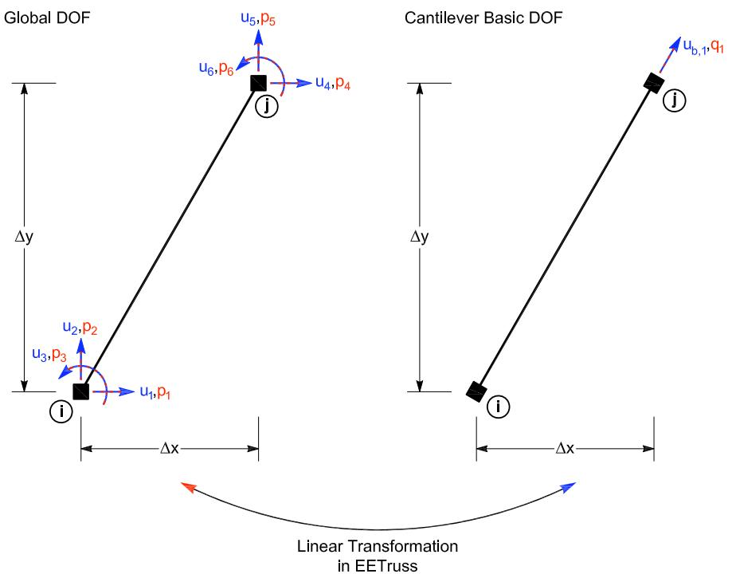

# truss 桁架实验单元
## 命令
此命令用于构造 truss 实验单元对象。两个节点定义此单元。

**truss （site）**
```tcl
expElement truss eleTag iNode jNode -site siteTag -initStif Kij <-tangStif tangStifTag> <-iMod> <-noRayleigh> <-rho rho> <-cMass>
```

**truss （server）**
```tcl
expElement truss eleTag iNode jNode -server ipPort <ipAddr> <-ssl> <-udp> <-dataSize size> -initStif Kij <-tangStif tangStifTag> <-iMod> <-noRayleigh> <-rho rho> <-cMass>
```

| 参数 | 说明 |
|:--- |:--- |
| $eleTag | 唯一单元标签 |
| $iNode, $jNode | 端节点标签 |
| $siteTag | 先前定义的站点对象的标签 |
| $Kij | 单元的初始刚度矩阵分量（按行排列） |
| -iMod | 使用Nakashima初始刚度修正法进行误差校正（可选，默认值为false） |
| -noRayleigh | 不考虑瑞雷阻尼（可选，默认值为考虑） |
| $rho | 单位长度质量（可选，默认值 = 0.0） |
| -cMass | 用于形成一致质量矩阵（可选） |
| $ipPort | 中间层服务器的IP端口 |
| ipAddr | 中间层服务器的IP地址（可选） |
| -ssl | 使用OpenSSL进行安全传输（可选） |
| $size | 发送的数据大小（可选） |
| -udp | 使用udp进行数据传输（默认是tcp/ip） |

## 示例
```tcl
# Define geometry for model
# _____________
# node $tag $xCrd $yCrd $mass
node 1 0.0 0.0
node 2 144.0 0.0
node 3 168.0 0.0
node 4 72.0 96.0
# Define experimental site
# _____________
# expSite LocalSite $tag $setupTag
expSite LocalSite 2 2
# Define experimental elements
# _____________
expElement truss 1 3 4 -site 2 -initStif [expr 3000.0*5.0/135.76]  
```

节点 3 和 4 连接上述二维 truss 实验单元。该单元使用本地实验站点定义。该单元的初始刚度为 [expr 3000.0*5.0/135.76] = 110.5。该单元的初始刚度为$\mathbf{K}_i = \left[110.5\right]$



## 记录Recorder
在创建 ElementRecorder 对象时（参见 OpenSees 手册），对truss实验单元的有效查询包括：
- 全局力：force, forces, globalForce, globalForces
- 局部力：localForce, localForces
- 基本力：basicForce, basicForces, daqForce, daqForces
- 控制（命令）位移：defo, deformation, deformations, basicDefo, basicDeformation, basicDeformations, ctrlDisp, ctrlDisplacement, ctrlDisplacements
- 控制（命令）速度：ctrlVel, ctrlVelocity, ctrlVelocities
- 控制（命令）加速度：ctrlAccel, ctrlAcceleration, ctrlAccelerations
- 数据采集（反馈）位移：daqDisp, daqDisplacement, daqDisplacements
- 数据采集（反馈）速度：daqVel, daqVelocity, daqVelocities
- 数据采集（反馈）加速度：daqAccel, daqAcceleration, daqAccelerations
- 切线刚度：tangStif, tangStiff, expTangStif，expTangStiff，expTangentStif，expTangentStiff

## 参考