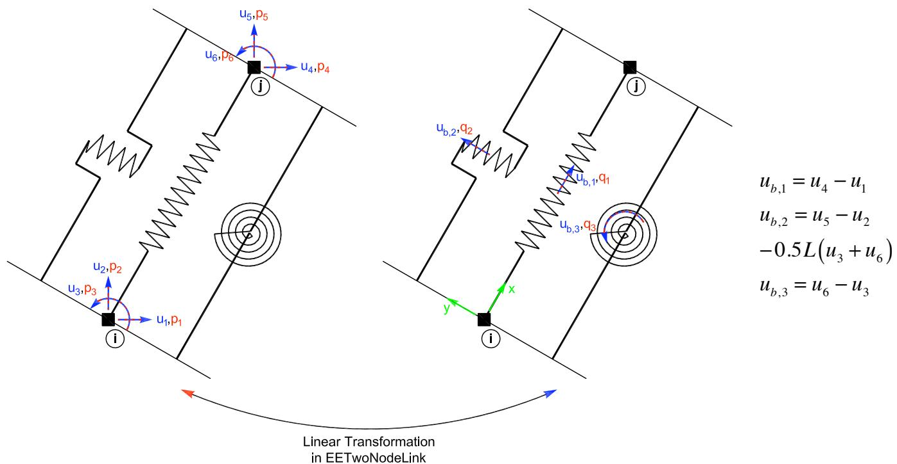

# twoNodeLink 两点连接实验单元
## 命令
此命令用于构建两点连接实验单元对象。该单元由两个节点定义。

**twoNodeLink（site）**
```tcl
expElement twoNodeLink eleTag iNode jNode -dof dofs -site siteTag -initStif Kij <-tangStif tangStifTag> <-orient <x1 x2 x3> y1 y2 y3> <-pDelta Mratios> <-shearDist sDratios> <-iMod> <-noRayleigh> <-mass m>
```

**twoNodeLink（server）**
```tcl
expElement twoNodeLink eleTag iNode jNode -dof dofs -server ipPort <ipAddr> <-ssl> <-udp> <-dataSize size> -initStif Kij <-tangStif tangStifTag> <-orient <x1 x2 x3> y1 y2 y3> <-pDelta Mratios> <-shearDist sDratios> <-iMod> <-noRayleigh> <-mass m>
```

| 参数 | 说明 |
|:--- |:--- |
| $eleTag | 唯一单元标签 |
| $iNode, $jNode | 端节点标签 |
| $dofs | 力方向（1、1-3 或 1-6） |
| $siteTag | 先前定义的站点对象的标签 |
| $Kij | 单元的初始刚度矩阵分量（按行排列） |
| $x1,$x2,$x3 $y1,$y2,$y3 | 单元的方向向量定义。x1、x2、x3 为全局坐标系下的向量分量，用于定义单元的局部 x 轴。y1、y2、y3 同理，用于定义位于单元局部 x-y 平面内的 y 向量（可选参数，默认与全局 X、Y 轴一致）。 |
| -iMod | 使用Nakashima初始刚度修正法进行误差校正（可选，默认值为false） |
| $m | 质量（可选，默认值 = 0.0） |
| $ipPort | 中间层服务器的IP端口 |
| ipAddr | 中间层服务器的IP地址（可选） |
| -ssl | 使用OpenSSL进行安全传输（可选） |
| $size | 发送的数据大小（可选） |
| -udp | 使用udp进行数据传输（默认是tcp/ip） |

## 示例
```tcl
# Define geometry for model
# _____________
set mass3 0.04
set mass4 0.02
# node $tag $xCrd $yCrd $mass
node 1 0.0 0.00
node 2 100.0 0.00
node 3 0.0 54.00 -mass $mass3 $mass3
node 4 100.0 54.00 -mass $mass4 $mass4
# Define experimental site
# _____________
# expSite RemoteSite $tag $ipAddr $ipPort
expSite RemoteSite 1 "169.229.203.152" 8090
# Define experimental elements
# _____________
expElement twoNodeLink 1 1 3 -dof 2 -site 1 -initStif 2.8 -orient 0 1 0 -1 0 0  
```

节点 1 和 3 连接上述二维 twoNodeLink 实验单元。该单元使用 IP 地址为 "169.229.203.152"、端口号为 8090 的远程实验站点定义。该单元的初始刚度为 2.8。方向设置为使单元 x 轴指向全局 Y 轴方向，单元 y 轴在全局坐标系中指向负 X 方向。该单元的初始刚度为$\mathbf{K}_i=2.8$。



## 记录Recorder
在创建 ElementRecorder 对象时（参见 OpenSees 手册），对twoNodeLink实验单元的有效查询包括：
- 全局力：force, forces, globalForce, globalForces
- 局部力：localForce, localForces
- 基本力：basicForce, basicForces, daqForce, daqForces
- 局部位移（控制局部位移）：localDisp,localDisplacement, localDisplacements
- 控制（命令）位移：defo, deformation, deformations, basicDefo, basicDeformation, basicDeformations, ctrlDisp, ctrlDisplacement, ctrlDisplacements
- 控制（命令）速度：ctrlVel, ctrlVelocity, ctrlVelocities
- 控制（命令）加速度：ctrlAccel, ctrlAcceleration, ctrlAccelerations
- 数据采集（反馈）位移：daqDisp, daqDisplacement, daqDisplacements
- 数据采集（反馈）速度：daqVel, daqVelocity, daqVelocities
- 数据采集（反馈）加速度：daqAccel, daqAcceleration, daqAccelerations
- 基本位移和基本力：defoANDforce, deformationANDforce, deformationsANDforces
- 切线刚度：tangStif, tangStiff, expTangStif，expTangStiff，expTangentStif，expTangentStiff

## 参考
