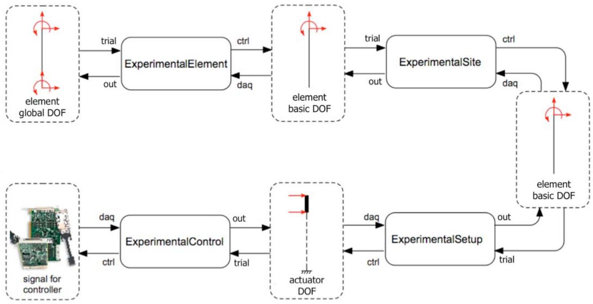

# expRecorder 简介
这些命令用于构造实验记录器对象。记录器对象为实验者提供监控和记录感兴趣的响应量的方法。图 28 说明了进入和离开各种 OpenFresco 模块的信号的命名约定。以下术语用于数据流：从有限元分析软件流向实验室的任何数据称为 1）"试数据"（如果进入对象/类）或 2）"ctrl 数据"（如果离开对象/类）；从实验室流向有限元分析软件的任何数据称为 3）"daq 数据"（如果进入对象/类）或 4）"输出数据"（如果离开对象/类）。记录器响应类型字符串遵循相同的命名约定。

图 33：OpenFresco 模块的数据流和变换

**本章内容**

* Control 记录器
* Setup 记录器
* SignalFilter 记录器  
* Site 记录器
* TangentStiff 记录器