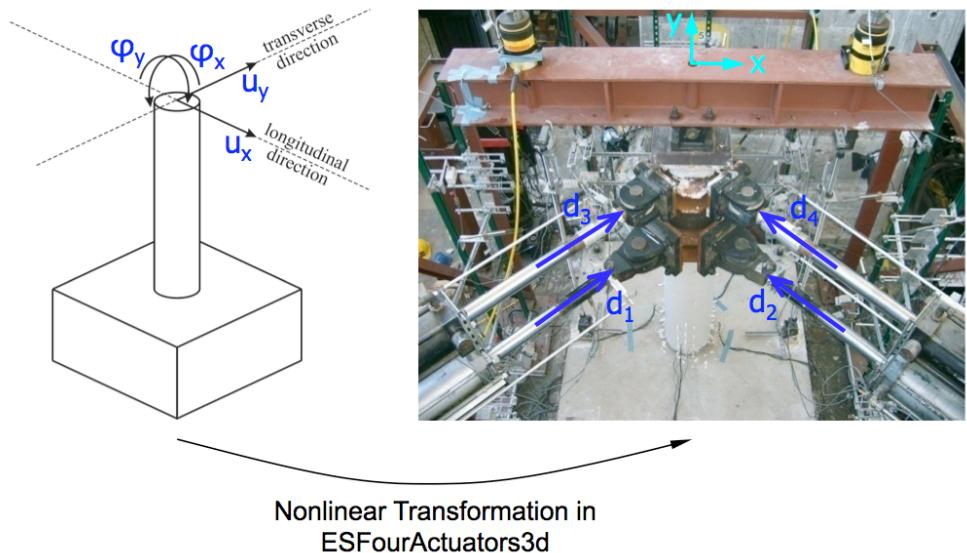
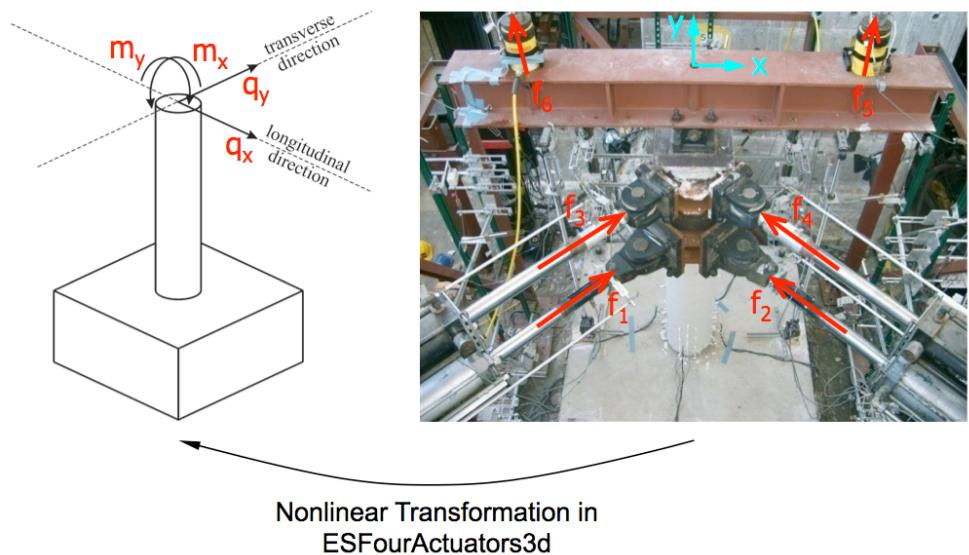

# FourActuators 实验装置
此命令用于构造 FourActuators 实验装置对象。此实验装置由四个作动器组成。作动器控制三维中试件的两个平移和两个旋转自由度。轴向和扭转自由度被忽略。
## 命令
```tcl
expSetup FourActuators $tag <-control $ctrlTag> $L1 $L2 $L3 $L4 $a1 $a2 $a3 $a4 $h $h1 $h2 $arIN $arIS $LrodN $LrodS $Hbeam <-nlGeom> <-phiLocX $phi> <-trialDispFact $f> <-trialVelFact $f> <-trialAccelFact $f> <-trialForceFact $f> <-trialTimeFact $f> <-outDispFact $f> <-outVelFact $f> <-outAccelFact $f> <-outForceFact $f> <-outTimeFact $f> 
```

| 参数 | 说明 |
|:----|:-----|
| $tag | 唯一装置标签 |
| $ctrlTag | 先前定义的控制对象的标签（可选） |
| $L1 | 作动器 1 的长度 |
| $L2 | 作动器 2 的长度 |
| $L3 | 作动器 3 的长度 |
| $L4 | 作动器 4 的长度 |
| $a1 | 刚性连杆 1 的长度 |
| $a2 | 刚性连杆 2 的长度 |
| $a3 | 刚性连杆 3 的长度 |
| $a4 | 刚性连杆 4 的长度 |
| $h | 作动器之间刚性连杆的高度 |
| $h1 | 下部作动器与销连接之间刚性连杆的高度 |
| $h2 | 下部作动器与下部梁翼缘之间刚性连杆的高度 |
| $arIN | 从顶部销到北侧杆下部梁翼缘的刚性连杆长度 |
| $arIS | 从顶部销到南侧杆下部梁翼缘的刚性连杆长度 |
| $LrodN | 北侧杆的销到销长度 |
| $LrodS | 南侧杆的销到销长度 |
| $Hbeam | 分布梁的高度 |
| -nlGeom | 非线性几何（可选，默认值 = false） |
| $phi | 作动器 1 相对于反力墙的角度 [度]（可选，默认值 = 0.0） |
| $f | 在变换之前应用于试（<-ctrl....Fact $f>）和采集（<-out....Fact $f>）数据的因子（可选，默认值 = 1.0） |

## 示例
```tcl
# Define experimental control
 
expControl xPCtarget 1 1 "192.168.2.20" 22222 HybridControllerD3D3_1Act "D:/PredictorCorrector/RTActualTestModels/cmAPI-xPCTarget-STS"

# Define experimental setup  
 
expSetup FourActuators 1 -control 1 60 60 60 60 72 72 72 48 24 24 36 36 12 12 60 
```

上述 FourActuators 实验装置命令使用先前定义的 xPCtarget 实验控制对象。作动器 1、2、3 和 4 的长度均为 60。刚性连杆 1、2、3 和 4 的长度均为 72。作动器之间刚性连杆的长度为 48。下部作动器与销连接之间以及下部作动器与下部梁翼缘之间的刚性连杆高度均为 24。北侧和南侧杆从顶部销到下部梁翼缘的刚性连杆长度均为 36。北侧和南侧杆的销到销长度均为 12。分布梁的高度为 60。


图 16：FourActuators 实验装置中的位移变换



图 17：FourActuators 实验装置中的力变换


