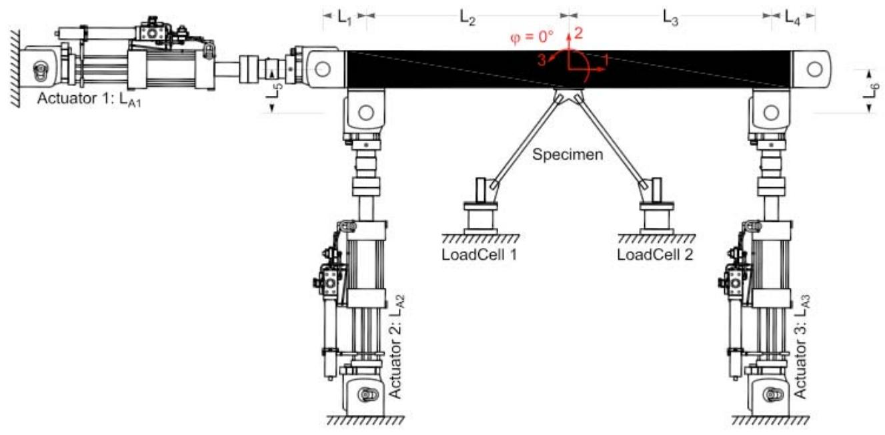
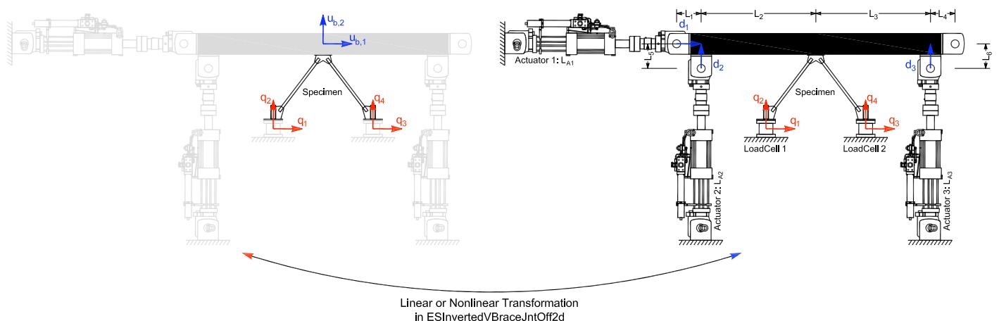

# InvertedVBraceJntOff 实验装置
此命令用于构造 InvertedVBraceJntOff 实验装置对象。此实验装置由三个作动器组成，控制试件变形，以及两个载荷传感器测量六个支撑反力或抗力。它考虑了作动器之间的刚性节点偏移。


## 命令
```tcl
expSetup InvertedVBraceJntOff $tag <-control $ctrlTag> $La1 $La2 $La3 $L1 $L2 $L3 $L4 $L5 $L6 <-nlGeom> <-posAct1 $pos> <-phiLocX $phi> <-trialDispFact $f> <-trialVelFact $f> <-trialAccelFact $f> <-trialForceFact $f> <-trialTimeFact $f> <-outDispFact $f> <-outVelFact $f> <-outAccelFact $f> <-outForceFact $f> <-outTimeFact $f> 
```

| 参数 | 说明 |
|:----|:-----|
| $tag | 唯一装置标签 |
| $ctrlTag | 先前定义的控制对象的标签（可选） |
| $La1 | 作动器 1 的长度 |
| $La2 | 作动器 2 的长度 |
| $La3 | 作动器 3 的长度 |
| $L1 | 刚性连杆 1 的长度 |
| $L2 | 刚性连杆 2 的长度 |
| $L3 | 刚性连杆 3 的长度 |
| $L4 | 刚性连杆 4 的长度 |
| $L5 | 刚性连杆 5 的长度 |
| $L6 | 刚性连杆 6 的长度 |
| -nlGeom | 非线性几何（可选，默认值 = false） |
| $pos | 作动器 1 的位置，左或右（l 或 r）（可选，默认值 = 左） |
| $phi | 从刚性加载梁到局部 x 轴的角度 [度]（可选，默认值 = 0.0） |
| $f | 在变换之前应用于试（<-ctrl....Fact $f>）和采集（<-out....Fact $f>）数据的因子（可选，默认值 = 1.0） |

## 示例
```tcl
# Define experimental control
 
# expControl SimUniaxialMaterials $tag $matTags
expControl SimUniaxialMaterials 1 1 2 3
# Define experimental setup
 
expSetup InvertedVBraceJntOff 1 -control 1 60 72 72 24 60 60 24 12 12 -posed1 left 
```

上述 InvertedVBraceJntOff 实验装置命令使用先前定义的 SimUniaxialMaterials 实验控制对象。作动器 1、2 和 3 的长度分别为 60、72 和 72。刚性加载梁的总长度为 120（$L_2 = 60$ 和 $L_3 = 60$）。偏移量 $L_1$、$L4$、$L5$ 和 $L_6$ 的长度分别为 24、24、12 和 12。作动器 1 位于梁的左侧。局部 1 轴从刚性加载梁旋转 0 度（逆时针）。


图 20：InvertedVBraceJntOff 实验装置


图 21：InvertedVBraceJntOff 实验装置中的变换
