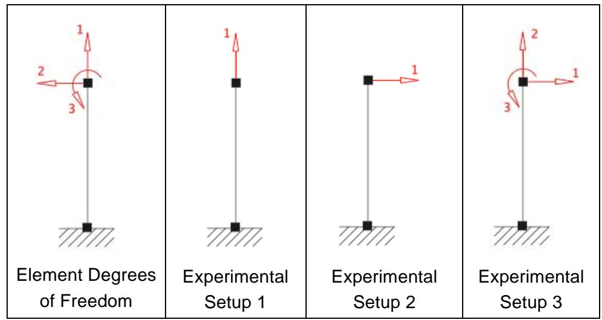
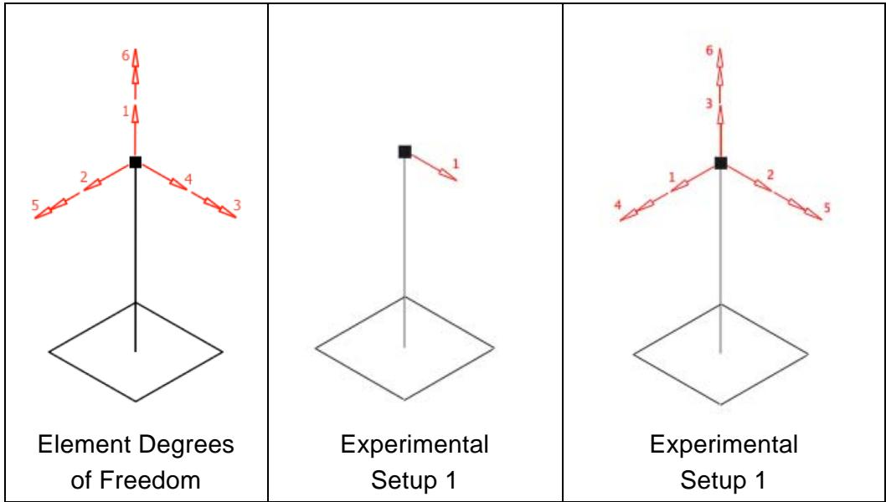
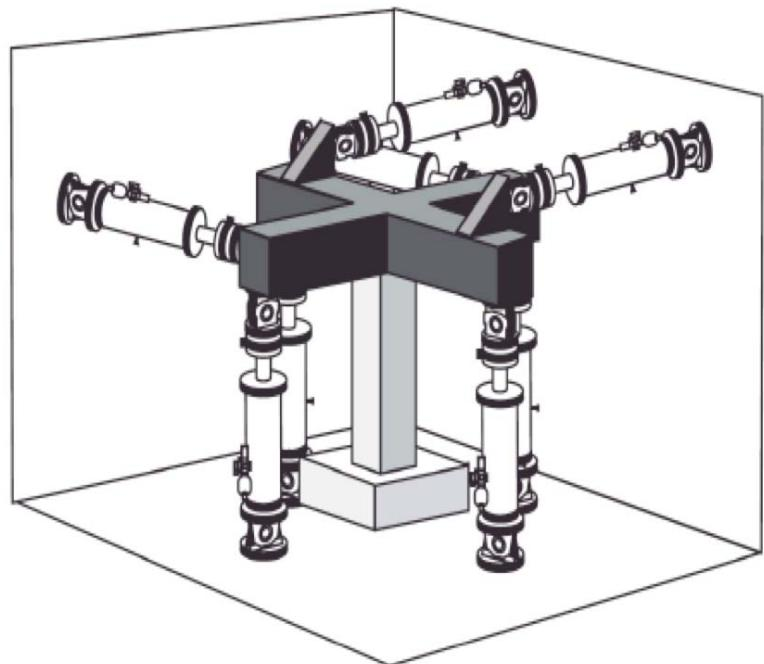
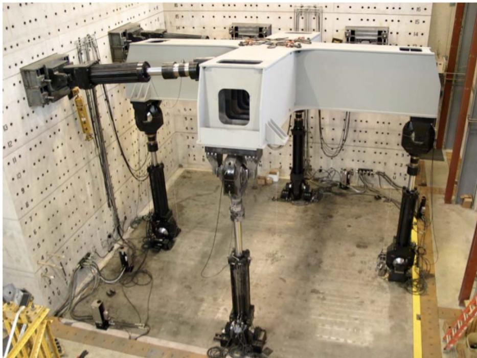

# NoTransformation 实验装置
此命令用于构造 NoTransformation 实验装置对象。此实验装置由最多六个作动器组成，设置为控制试件的任何基本自由度。
顾名思义，ESNoTransformation类是一个虚拟试验设置，不执行从基本单元自由度到作动器自由度的任何变换。但是，它允许重新排序自由度而不对其进行变换。如果试验控制和数据采集系统直接执行所有必要的变换，意味着不需要在试验设置对象中实现额外的变换，则应采用此试验设置。
当使用的是expElement beamColumn，使用的是下图的坐标系。
当使用的是expElement generic，使用的是全局坐标系。
## 命令
```tcl
expSetup NoTransformation $tag <-control $ctrlTag> -dir $dirs ... -sizeTrialOut $sizeTrial $sizeOut <-trialDispFact $f> <-trialVelFact $f> <-trialAccelFact $f> <-trialForceFact $f> <-trialTimeFact $f> <-outDispFact $f> <-outVelFact $f> <-outAccelFact $f> <-outForceFact $f> <-outTimeFact $f> 
```

| 参数 | 说明 |
|:----|:-----|
| $tag | 唯一单元标签 |
| $ctrlTag | 先前定义的控制对象的标签（可选） |
| $dirs | 方向（1-6） |
| $sizeTrial | 从单元接收的试向量的大小 |
| $sizeOut | 返回给单元的输出向量的大小 |
| $f | 在变换之前应用于试（<-ctrl….Fact $f>）和采集（<-out….Fact $f>）数据的因子（可选，默认值 = 1.0） |

## 示例

**二维示例：**


**NoTransformation实验装置二维示例**


```tcl
# Define experimental control  
expControl SimUniaxialMaterials 1 1  
expControl SimUniaxialMaterials 2 1 2 3 
# Define experimental setup  

# Experimental Setup 1  
expSetup NoTransformation 1 -control 1 -dir 1 -sizeTrialOut 3 3 

# Experimental Setup 2  
expSetup NoTransformation 2 -control 1 -dir 2 -sizeTrialOut 3 3 -trialDispFact -1 -outDispFact -1 -outForceFact -1  

# Experimental Setup 3  
expSetup NoTransformation 3 -control 2 -dir 2 1 3 -sizeTrialOut 3 3 -trialDispFact -1 1 1 -outDispFact -1 1 1 -outForceFact -1 1 1 
```

提供了三个示例来说明如何定义 -dir 输入。所有示例均使用先前定义的 SimUniaxialMaterials 实验控制对象。在示例实验装置 1 中，控制系统自由度 1 指向与单元自由度 1 相同的方向。在示例实验装置 2 中，控制系统自由度 1 指向单元自由度 2 的负方向。因此，试位移、输出位移和输出力均乘以 -1。在示例 3 中，控制系统自由度 1、2 和 3 分别指向单元自由度 2、1 和 3 的方向。自由度 1 的响应量乘以 -1，因为它指向单元自由度 2 的负方向。

**三维示例：**


**NoTransformation实验装置三维示例**

```tcl
# Define experimental control
# ___________
# expControl SimUniaxialMaterials $tag $matTags
expControl SimUniaxialMaterials 1 1
expControl SimUniaxialMaterials 2 1 2 3 4 5 6
# Define experimental setup
# ___________
# Experimental Setup 1
expSetup NoTransformation 1 -control 1 -dir 4 -sizeTrialOut 6 6
# Experimental Setup 2
expSetup NoTransformation 2 -control 2 -dir 2 4 1 5 3 6 -sizeTrialOut 6 6 
```

三维示例的 -dir 输入与二维示例的工作原理相同。有关更多信息，请参阅二维示例。


**NoTransformation实验装置图1**


**NoTransformation实验装置图2**
