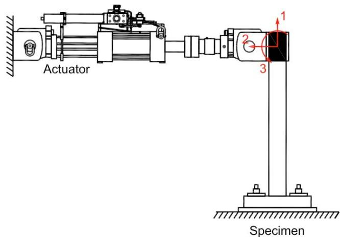
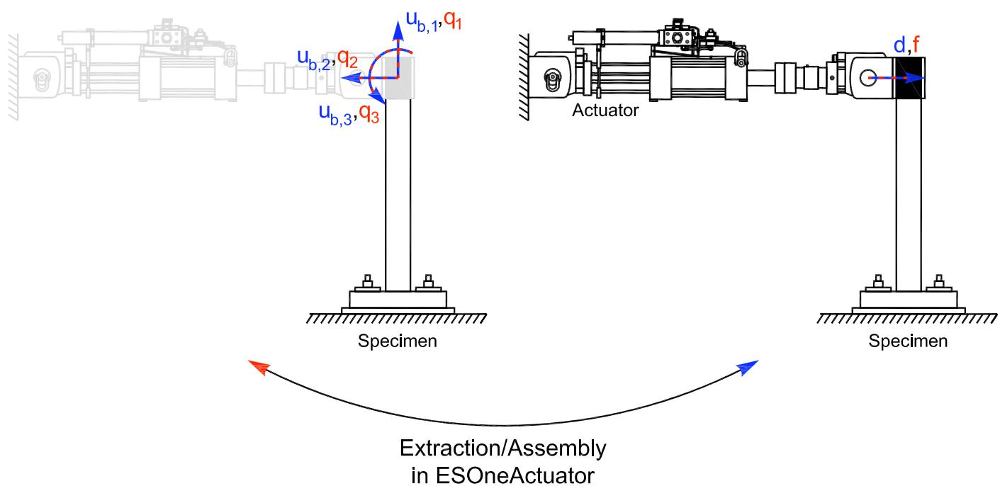

# OneActuator 实验装置
此命令用于构造 OneActuator 实验装置对象。此实验装置仅由一个作动器组成，该作动器设置为试件的方向。

## 命令
```tcl
expSetup OneActuator $tag <-control $ctrlTag> $dir -sizeTrialOut $sizeTrial $sizeOut <-trialDispFact $f> <-trialVelFact $f> <-trialAccelFact $f> <-trialForceFact $f> <-trialTimeFact $f> <-outDispFact $f> <-outVelFact $f> <-outAccelFact $f> <-outForceFact $f> <-outTimeFact $f> 
```

| 参数 | 说明 |
|:----|:-----|
| $tag | 唯一单元标签 |
| $ctrlTag | 先前定义的控制对象的标签（可选） |
| $dir | 单元基本参考坐标系中施加量的方向（1-6） |
| $sizeTrial | 从单元接收的试向量的大小 |
| $sizeOut | 返回给单元的输出向量的大小 |
| $f | 在变换之前应用于试（<-ctrl....Fact $f>）和采集（<-out....Fact $f>）数据的因子（可选，默认值 = 1.0） |

## 示例
```tcl
# Define experimental control   
expControl SCRAMNet 1 381020 8 
  
# Define experimental setup    
expSetup OneActuator 1 -control 1 2 -sizeTrialOut 3 3 -trialDispFact 0.5 -outDispFact 2.0 -outForceFact 2.0 
```

上述 OneActuator 实验装置使用先前定义的 SCRAMNet 实验控制对象。施加量位于图 14 所示的 2 方向。试向量和输出向量的大小均设置为 3。试位移乘以 0.5。输出位移和力乘以 2.0。



**图 23：OneActuator 实验装置**


**图 24：OneActuator 实验装置中的变换**
