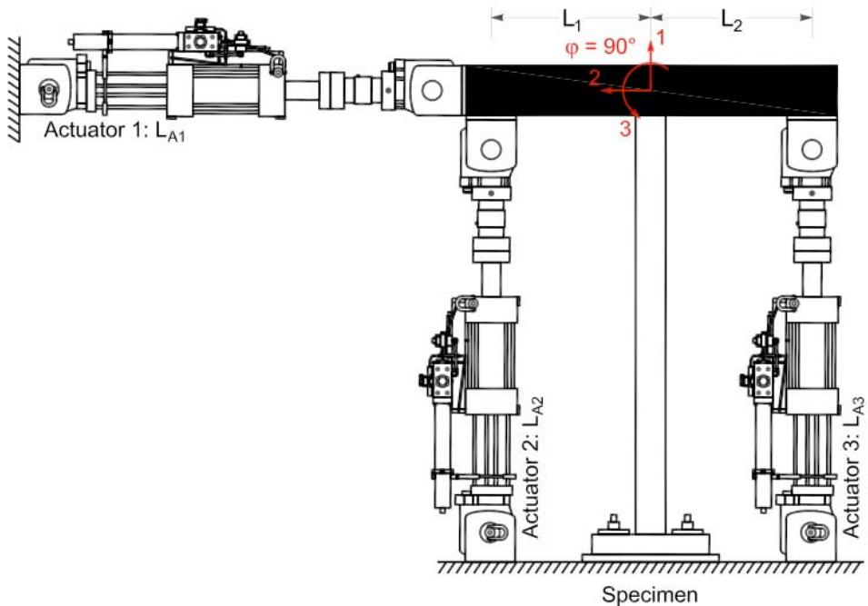
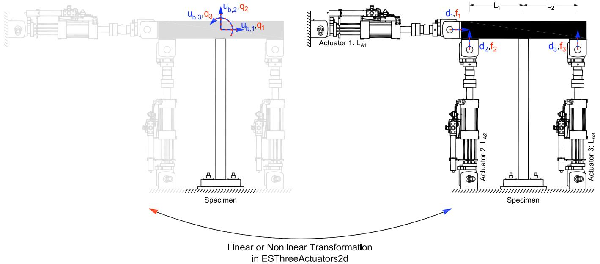

# ThreeActuators 实验装置
此命令用于构造 ThreeActuators 实验装置对象。此实验装置由三个作动器组成。作动器控制试件的两个平移和旋转自由度。

## 命令
**ThreeActuators 3d**
```tcl
expSetup ThreeActuators tag <-control ctrlTag> dofH dofV dofR sizeTrial sizeOut La1 La2 La3 L1 L2 L3 <-nlGeom> <-posAct1 pos>
```
>新增的命令，暂无解释。以前的命令ThreeActuators实际上变成是ThreeActuators2d

| 参数 | 说明 |
|:----|:-----|
| $tag | 唯一装置标签 |
| $ctrlTag | 先前定义的控制对象的标签（可选） |

**ThreeActuators2d**
```tcl
expSetup ThreeActuators2d tag <-control ctrlTag> La1 La2 La3 L1 L2 <-nlGeom> <-posAct1 pos> <-phiLocX phi>
```

| 参数 | 说明 |
|:----|:-----|
| $tag | 唯一装置标签 |
| $ctrlTag | 先前定义的控制对象的标签（可选） |
| $La1 | 作动器 1 的长度 |
| $La2 | 作动器 2 的长度 |
| $La3 | 作动器 3 的长度 |
| $L1 | 刚性连杆 1 的长度 |
| $L2 | 刚性连杆 2 的长度 |
| -nlGeom | 非线性几何（可选，默认值 = false） |
| $pos | 作动器 1 的位置，左或右（l 或 r）（可选，默认值 = 左） |
| $phi | 从刚性加载梁到局部 x 轴的角度 [度]（可选，默认值 = 0.0） |
| $f | 在变换之前应用于试（<-ctrl....Fact $f>）和采集（<-out....Fact $f>）数据的因子（可选，默认值 = 1.0） |

## 示例
```tcl
# Define experimental control
# expControl SimUniaxialMaterials $tag $matTags  
expControl SimUniaxialMaterials 1 1 2 3  

# Define experimental setup
expSetup ThreeActuators2d 1 -control 1 60 72 72 60 60 -philLocX 90 
```

上述 ThreeActuators2d 实验装置命令使用先前定义的 SimUniaxialMaterials 实验控制对象。作动器 1、2 和 3 的长度分别为 60、72 和 72。刚性加载梁的总长度为 120（$L_1 = 60$ 和 $L_2 = 60$）。作动器 1 位于梁的左侧。局部 1 轴从刚性加载梁旋转 90 度（逆时针）。

<figure>
  
  <figcaption>图 25：ThreeActuators2d 实验装置</figcaption>
</figure>

<figure>
  
  <figcaption>图 26：ThreeActuators2d 实验装置中的变换</figcaption>
</figure>