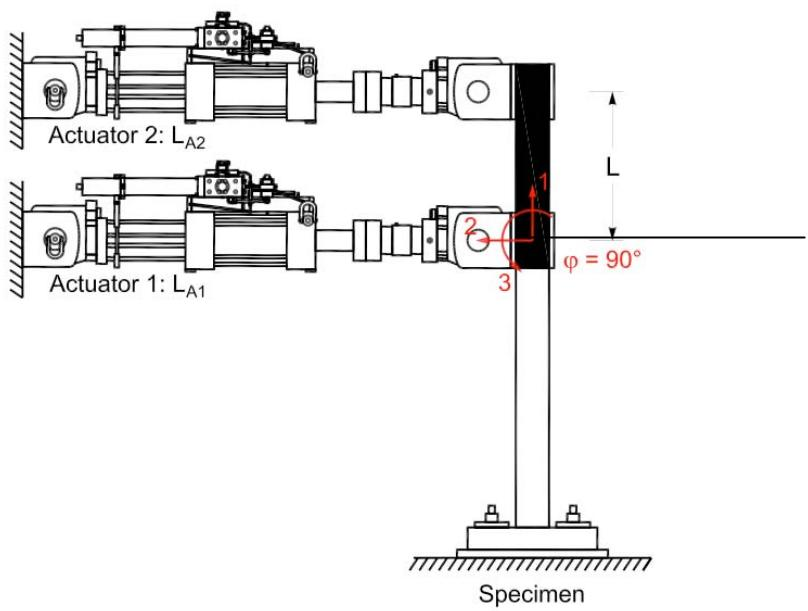
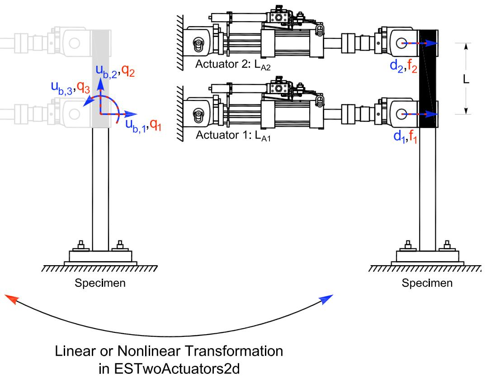

# TwoActuators 实验装置
此命令用于构造 TwoActuators 实验装置对象。此实验装置由两个作动器组成，控制试件的平移和旋转自由度。
## 命令
```tcl
expSetup TwoActuators $tag <-control $ctrlTag> $La1 $La2 $L <-nIGeom> <-posAct $pos> <-phiLocX $phi> <-trialDispFact $f> <-trialVelFact $f> <-trialAccelFact $f> <-trialForceFact $f> <-trialTimeFact $f> <-outDispFact $f> <-outVelFact $f> <-outAccelFact $f> <-outForceFact $f> <-outTimeFact $f> 
```

| 参数 | 说明 |
|:----|:-----|
| $tag | 唯一装置标签 |
| $ctrlTag | 先前定义的控制对象的标签（可选） |
| $La1 | 作动器 1 的长度 |
| $La2 | 作动器 2 的长度 |
| $L | 刚性连杆的长度 |
| -nlGeom | 非线性几何（可选，默认值 = false） |
| $pos | 作动器的位置，左或右（l 或 r）（可选，默认值 = 左） |
| $phi | 从作动器 1 形成的水平线到局部 x 轴的角度 [度]（可选，默认值 = 0.0） |
| $f | 在变换之前应用于试（<-ctrl....Fact $f>）和采集（<-out....Fact $f>）数据的因子（可选，默认值 = 1.0） |

## 示例
```tcl
# Define experimental control
 
# expControl SimUniaxialMaterials $tag $matTags
expControl SimUniaxialMaterials 1 1 2
# Define experimental setup
 
expSetup TwoActuators 1 -control 1 72 72 60 -philLocX 90 
```

上述 TwoActuators 实验装置命令使用先前定义的 SimUniaxialMaterials 实验控制对象。作动器 1 和 2 的长度分别为 72 和 72。刚性加载梁的总长度为 60。作动器位于梁的左侧。局部 1 轴从作动器 1 旋转 90 度（逆时针）。


**图 29：TwoActuators 实验装置**


**图 30：TwoActuators 实验装置中的变换**

