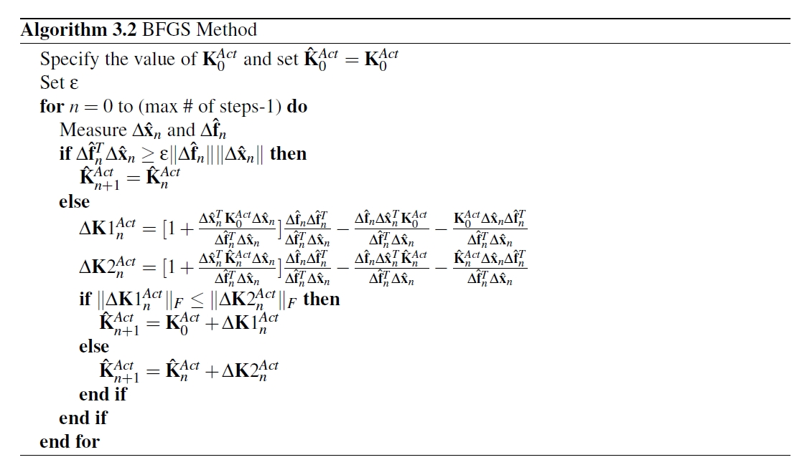

# BFGS 

使用 BFGS 方法来估计切线刚度矩阵。

## 命令

```tcl
expTangentStiff BFGS tag <-eps value>
```

与 Carrion 和 Spencer 类似，Igarashi 等人 [11] 使用 Broyden-Fletcher-Goldfarb-Shanno（BFGS）方法开发了算法 3.2，以在五层全尺寸建筑的混合仿真过程中更新切线刚度矩阵。他们利用刚度矩阵来缩放作动器运动。该算法使用已知的 $\Delta \bar { \mathbf { u } } _ { n }$ 和 $\Delta \bar { \mathbf { f } } _ { n }$ 对。方程 3.14 可以从方程 3.11 推导出来。

$$
\Delta \bar {\mathbf {f}} _ {n} = \mathbf {K} _ {n} ^ {A c t} \Delta \bar {\mathbf {u}} _ {n} \tag {3.14}
$$

BFGS 是 Broyden 方法的一个变种。BFGS 方法假设刚度矩阵是对称正定的，这是一个有效的假设。该算法遵循最小更新方法。具有较小 Forbenius 范数的增量刚度 $\Delta \mathbf { K } _ { n } ^ { A c t }$ 更新刚度矩阵。算法 3.2 中的 ε 参数取决于测量设备的精度。设置该参数是为了防止测量设备的噪声错误地触发更新。

  

## 示例


这个示例来自于OpenFresco/EXAMPLES/TrussModel
/Truss_Local.tcl

```tcl
# create ModelBuilder (with two-dimensions and 2 DOF/node)
model BasicBuilder -ndm 2 -ndf 2

# Load OpenFresco package
# -----------------------
# (make sure all dlls are in the same folder as openSees.exe)
loadPackage OpenFresco

# Define geometry for model
# -------------------------
# node $tag $xCrd $yCrd $mass
node 1   0.0  0.0
node 2 144.0  0.0
node 3 168.0  0.0
node 4  72.0 96.0

# set the boundary conditions
# fix $tag $DX $DY
fix 1 1 1 
fix 2 1 1
fix 3 1 1

# Define materials
# ----------------
set E 3000.0
set A3 5.0
set L3 [expr sqrt(pow(168.0-72.0,2.0) + pow(96.0,2.0))]
set kInit [expr $E*$A3/$L3]
# uniaxialMaterial Elastic $matTag $E
uniaxialMaterial Elastic 1 $E
#uniaxialMaterial Elastic 2 $kInit
uniaxialMaterial Steel01 2 50.0 $kInit 0.1

# Define experimental control
# ---------------------------
# expControl SimUniaxialMaterials $tag $matTags
expControl SimUniaxialMaterials 1 2

# Define experimental setup
# -------------------------
# expSetup OneActuator $tag <-control $ctrlTag> $dir -sizeTrialOut $t $o <-trialDispFact $f> ...
expSetup OneActuator 1 -control 1 1 -sizeTrialOut 1 1

# Define experimental site
# ------------------------
# expSite LocalSite $tag $setupTag
expSite LocalSite 1 1

# Define experimental tangent stiffness
# -------------------------------------
# expTangentStiff Broyden $tag
expTangentStiff Broyden 1
# expTangentStiff BFGS $tag <-eps $value>
#expTangentStiff BFGS 1
# expTangentStiff Transpose $tag $numCols
#expTangentStiff Transpose 1 1

# Define numerical elements
# -------------------------
# element truss $eleTag $iNode $jNode $A $matTag
element truss 1 1 4 10.0 1
element truss 2 2 4  5.0 1
#element corotTruss 1 1 4 10.0 1
#element corotTruss 2 2 4  5.0 1

# Define experimental element
# ---------------------------
# expElement truss $eleTag $iNode $jNode -site $siteTag -initStif $Kij <-tangStif tangStifTag> <-iMod> <-rho $rho> 
expElement truss 3 3 4 -site 1 -initStif $kInit -tangStif 1
#expElement corotTruss 3 3 4 -site 1 -initStif $kInit -tangStif 1
```

## 参考

[1]Kim, H.K., (2011). Development and implementation of advanced control methods for hybrid simulation. Ph.D. Dissertation, University of California, Berkeley, California.

[11]A. Igarashi, F. Seible, and G. Hegemier. Development of the pseudodynamic technique for  testing a full scale 5-story shear wall structure. In Development and Future Dimensions of Structural Testing Techniques, 1993.